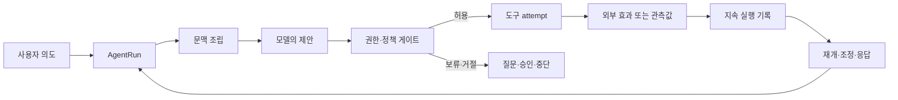

# 머리말 — 에이전트를 대답 상자가 아니라 실행 시스템으로 읽기

에이전트가 “완료했습니다”라고 말한 직후에 운영자는 더 어려운 질문을 받는다. 정말 파일이 바뀌었는가. 알림은 한 번만 전송됐는가. 사용자가 취소를 눌렀을 때 멈춘 것은 화면인가, 실행인가, 아니면 이미 외부로 나간 요청의 응답만 잃어버린 것인가. 여러 에이전트가 같은 결론을 냈다면 독립된 근거가 여럿 생긴 것인가, 아니면 같은 잘못된 문맥을 공유한 것인가.

이 책은 그런 질문을 피하지 않는다. 여기서 에이전트는 그럴듯한 문장을 만들어 내는 답변 UI가 아니라, 입력을 받아 문맥을 조립하고, 모델의 제안을 해석하고, 권한을 확인하고, 도구를 실행하며, 외부 세계의 변화를 기록하고, 실패 뒤에 다시 판단하는 **실행 시스템**이다. 대화창은 그 시스템이 드러나는 한 표면일 뿐이다. 화면에 보이는 문장과 디스크·데이터베이스·결제·메시지 수신자에게 일어난 사실은 서로 다른 기록으로 확인해야 한다.

이 책의 중심에는 하나의 `AgentRun`이 있다. 사용자의 의도에서 시작해 모델 요청, 검색, 하위 작업, 승인, 도구 호출, 외부 효과, 관측, 취소, 재개, 복구에 이르는 추적 가능한 실행 단위다. 특정 제품의 클래스 이름을 빌린 말은 아니다. 프레임워크가 바뀌어도 남는 질문의 단위다. 독자는 이 단위를 따라가며 “무엇이 일어났는가”와 함께 “누가 그 사실을 결정하는가”, “어떤 기록이 그것을 뒷받침하는가”, “무엇은 아직 모르는가”를 구분하게 된다.

그림의 화살표는 이상적인 성공 순서가 아니다. 각각은 실패를 질문할 자리다. 문맥은 누가 조립했는가. 모델이 제안한 호출은 왜 허용됐는가. timeout은 도구가 시작되지 않았다는 뜻인가. 영수증이 없을 때 재시도는 복구인가 중복인가. 이 책은 화살표를 늘리기 위해 그림을 쓰지 않는다. 다음 조사를 어디서 시작해야 하는지 정하기 위해 쓴다.

## 이 책이 약속하는 것

### 문장과 효과를 분리한다

모델 출력의 “성공”은 서술이다. 도구 프로세스의 exit code는 실행기 관측값이다. 수신자 측의 식별 가능한 receipt는 외부 효과의 근거가 될 수 있다. 세 가지를 같은 성공으로 묶으면 재시도와 복구가 망가진다. 그래서 이 책은 `logical call`과 `attempt`, `attempt`와 `effect`, `effect`와 `receipt`를 분리한다. 같은 사용자의 의도는 여러 번 시도될 수 있고, 한 attempt는 응답을 잃을 수 있으며, receipt가 없으면 결과는 종종 `unknown`이어야 한다.

| 구분 | 독자가 묻게 될 질문 | 섣불리 믿으면 생기는 오류 |
|---|---|---|
| 제안 | 모델이 무엇을 하자고 했는가 | 제안을 권한으로 오인한다 |
| 논리 호출 | 사용자가 의도한 행동은 무엇인가 | retry마다 새 행동을 만든다 |
| 실행 시도 | 실제로 몇 번 dispatch했는가 | timeout을 미실행으로 단정한다 |
| 외부 효과 | 세계에 무엇이 달라졌는가 | executor 로그를 commit으로 읽는다 |
| 영수증 | 누가 어떤 ID의 효과를 확인했는가 | UI 완료 표시를 증명으로 쓴다 |

### 설명·수식·코드·실습을 왕복한다

직관만으로는 권한 revision이나 분산 효과의 실패 창을 다룰 수 없고, 코드 행 번호만으로는 왜 분리가 필요한지 이해하기 어렵다. 각 장은 먼저 작은 실패 장면을 제시하고, 상태와 불변조건을 정리한 뒤, 공개된 원전·사양·코드의 필요한 부분으로 내려간다. 이후에는 반례와 관측값을 통해 설명이 너무 넓어지지 않도록 되돌아온다.

공개 코드는 움직인다. 따라서 코드 링크는 가능한 한 고정 revision과 심볼·행 범위를 함께 제시한다. 코드가 말하는 범위와 문서가 말하는 범위를 섞지 않는다. 예를 들어 [W3C Trace Context](https://www.w3.org/TR/trace-context/)는 분산 trace 문맥을 전파하는 형식을 설명하지만, trace ID가 권한 또는 외부 효과의 영수증이라는 뜻은 아니다. [OpenTelemetry의 trace 개요](https://opentelemetry.io/docs/concepts/signals/traces/)는 관측의 연결을 설명하지만, 관측되지 않은 효과의 부재를 증명하지 않는다. 원전은 출발점이고, 적용 범위는 별도의 설계 판단이다.

### 모르는 것을 성공으로 바꾸지 않는다

분산 시스템에서 가장 값비싼 오류 중 하나는 불확실성을 거짓 확신으로 바꾸는 일이다. 네트워크 timeout 뒤의 정확한 상태는 때로 “실패”가 아니라 “수신 여부를 알 수 없음”이다. 검색 결과가 비었다고 데이터의 부재가 증명되지는 않는다. 그래프에서 edge를 찾지 못했을 때도 명시적인 폐세계 가정이 없다면 판정은 `false`가 아닌 `unknown`일 수 있다. 이 책은 그런 경계를 실패로 숨기지 않고 설계의 정상 상태로 다룬다.

### 프레임워크 이름보다 소유권을 먼저 본다

ReAct, planner, worker, supervisor, swarm, memory, blackboard, graph라는 이름은 유용한 압축어다. 그러나 이름이 동일하다고 상태 모델과 안전 보장이 같아지지 않는다. “memory”가 단순 대화 요약인지, tenant·freshness·trust·삭제 정책을 가진 데이터인지부터 묻는다. “parallel”이 빠르다는 말은 branch 결과가 독립적이고, 취소 잔여 비용이 통제되며, 합류 기준이 있다는 뜻이 아니다. “consensus”와 “vote”도 다르다. 이 책은 용어를 제품 기능 표가 아니라 책임·상태·실패 모델의 차이로 해부한다.

## 이 책을 관통하는 실행 계약

하나의 실행을 읽을 때 최소한 아래의 식별자를 분리해 두면, 대다수의 모호함이 눈에 보이기 시작한다.

| 식별자 또는 revision | 답하는 질문 | 필요해지는 장 |
|---|---|---|
| `RunID`, `TurnID` | 어느 사용자 요청과 진행 단위인가 | 1, 15, 27, 28장 |
| context generation | 모델이 어느 시점의 세계를 보았는가 | 4–7장 |
| model attempt ID | 어느 provider 요청과 retry인가 | 8–10장 |
| logical call ID, attempt 번호 | 한 의도와 여러 실행을 어떻게 분리하는가 | 11–14장 |
| policy·approval revision | 누구의 어떤 범위 허용인가 | 12, 25–26장 |
| effect ID, idempotency key | 외부 변화가 중복되지 않았는가 | 13, 29–31, 39–40장 |
| trace·metric·log·receipt | 무엇을 관측했고 무엇을 확정했는가 | 32–36장 |

이 표는 모든 시스템에 동일한 필드명을 강요하지 않는다. 같은 이름의 ID 하나에 모든 뜻을 떠맡기지 말라는 요청이다. trace ID를 idempotency key로 사용하거나, 모델의 tool-call ID를 수신자 effect ID로 간주하거나, UI의 승인 버튼을 commit-time authorization으로 해석하는 순간 경계가 무너진다.

## 열 부분, 마흔한 장의 지도

이 책은 한 번의 실행을 넓혀 가는 열 부분으로 구성된다. 앞부분은 단일 요청이 어디서 상태를 얻는지 밝히고, 중간은 여러 작업과 검색·그래프가 왜 단순한 “지능 확장”이 아닌지 다루며, 뒷부분은 사람·분산 효과·운영·실습의 경계로 내려간다.

| 부 | 핵심 질문 | 장 | 다음 부에 넘기는 것 |
|---|---|---|---|
| I. 실행의 최소 단위 | 한 요청은 어디서 시작하고 끝나는가 | 1–3 | Run·turn·framework boundary |
| II. 모델이 보는 세계 | 문맥과 토큰은 어떻게 실행 조건이 되는가 | 4–10 | generation·stream·retry identity |
| III. 도구와 외부 효과 | 제안은 어떻게 허용·실행·확인되는가 | 11–14 | call/effect/receipt 구분 |
| IV. 여러 작업의 조정 | 위임·DAG·투표·공유 상태는 무엇을 보장하는가 | 15–20 | parent-child·merge·write authority |
| V. 검색과 지식 경계 | 후보·연결·시간 정보는 언제 근거가 되는가 | 21–24 | admissible evidence·freshness·scope |
| VI. 사람과 실행권 | 언제 묻고, 승인은 무엇을 허용하는가 | 25–27 | consent·interrupt·resume contract |
| VII. 지속성과 복구 | 기록·재생·분산 효과를 어떻게 다루는가 | 28–31 | durable state·reconciliation·fencing |
| VIII. 관측과 운영 판단 | 무엇을 재고, 무엇을 먼저 고칠 것인가 | 32–36 | oracle·SLO·tenant boundary |
| IX. 재현 가능한 실습 | 작은 AgentRun을 어떻게 끝까지 증명하는가 | 37–40 | golden run·coordination·recovery lab |
| X. 낯선 시스템의 독해 | 처음 보는 framework를 어떻게 검증할 것인가 | 41 | 스스로 쓰는 조사 rubric |

책은 직선으로 읽을 수 있도록 설계했지만, 실무에서 중요한 것은 현재 장애의 문에 들어가도 전체 실행 계보로 돌아올 수 있는가다. 그래서 장 끝에는 다음 장의 개념뿐 아니라 확인해야 할 ID, 관측점, 반례, 공개 원전을 남긴다. 좋은 설명은 독자를 한 장에 가두지 않는다.

## 근거의 강도를 읽는 법

이 책의 문장에는 같은 무게를 주지 않는다. 독자는 다음 네 표지를 마음속에 붙여 읽으면 된다. 표지는 자격의 서열이 아니라, 무엇을 다음 단계에서 확인해야 하는지 알려 주는 안내판이다.

| 표지 | 뜻 | 독자가 할 일 |
|---|---|---|
| **원전에서 확인** | 표준·논문·공식 문서 또는 고정 코드가 직접 말한다 | 적용 조건과 revision을 함께 읽는다 |
| **실행으로 확인** | 재현 가능한 좁은 조건에서 관측했다 | 환경·입력·oracle을 바꾸어도 유지되는지 본다 |
| **설계로 권장** | 여러 사실을 바탕으로 제안하는 안전한 구조다 | 내 시스템의 실패 모델에 맞는지 검토한다 |
| **아직 확인할 것** | 공개 근거 또는 실행 범위가 부족하다 | 결론으로 쓰지 말고 측정·실험의 항목으로 남긴다 |

예컨대 벡터 검색의 점수는 후보를 정렬하는 데 탁월할 수 있다. 그러나 권한, 최신성, 부정, 출처의 충분성, 인과 관계를 자동으로 판정한다는 뜻은 아니다. 이 문장은 검색을 폄하하려는 것이 아니다. 검색의 강점을 근거 판정의 책임과 교환하지 말자는 뜻이다. [FAISS 문서](https://faiss.ai/)는 유사도 검색 라이브러리의 목적을 보여 주고, [NIST의 zero trust 개요](https://csrc.nist.gov/pubs/sp/800/207/final)는 접근 판단을 별도의 지속 검증 문제로 다루는 이유를 보여 준다.

## 독자가 직접 가져가야 할 질문

다음 체크리스트는 완독 뒤에만 쓰는 요약이 아니다. 새 에이전트 프레임워크, 새 tool connector, 새 memory 기능을 만날 때마다 처음부터 적용하는 독해 도구다.

- 이 요청의 durable한 경계는 무엇이며 RunID와 TurnID는 어디에서 만들어지는가?
- 모델이 실제로 본 instruction, tool schema, retrieval 결과, context generation은 복원할 수 있는가?
- 모델의 제안과 실행기의 허용을 어느 코드·정책 경계가 분리하는가?
- 같은 논리 행동의 retry를 어떻게 식별하며, 수신자는 무엇으로 중복을 막는가?
- timeout·cancel·process kill 뒤에 `unknown`을 표현할 상태가 있는가?
- approval의 principal·scope·expiry·revision은 effect 직전에 다시 검사되는가?
- parallel branch가 늘린 것은 독립 증거인가, 같은 오류를 빠르게 복제한 것인가?
- retrieval 후보와 최종 근거 사이에 authorization·freshness·provenance 검사가 있는가?
- trace·metric·log가 빠져도 외부 효과 receipt와 재조정 경로는 남는가?
- 고장 주입의 oracle이 화면 문구가 아니라 durable 상태와 수신자 관측값인가?

이 질문에 모두 즉시 답할 필요는 없다. 답하지 못한 항목을 남기는 일부터 성과다. 그 빈칸이 다음 로그 필드, 다음 테스트, 다음 코드 탐색의 정확한 출발점이 된다.

## 이 책의 원전과 실습을 대하는 태도

여기서는 원전을 인용의 장식으로 쓰지 않는다. [ReAct 논문](https://arxiv.org/abs/2210.03629v3)을 읽을 때에는 reasoning과 acting의 아이디어를 현재 실행기의 durable state model로 과장하지 않는다. [The Raft Consensus Algorithm](https://raft.github.io/raft.pdf)을 읽을 때에는 leader election과 committed log의 조건을 투표 기반 agent panel에 자동으로 이식하지 않는다. [Sagas 논문](https://www.cs.cornell.edu/andru/cs711/2002fa/reading/sagas.pdf)을 읽을 때에는 compensation을 cancel이나 rollback의 동의어로 바꾸지 않는다.

코드도 마찬가지다. 한 함수가 어떤 이벤트를 emit한다는 것은 그 함수·그 revision·그 조건에서의 사실이다. 전체 hosted service, 다른 provider, 다른 운영 환경에서도 동일한 receipt와 권한 semantics가 있다는 증거는 아니다. 좁고 정확한 문장을 서로 연결하는 편이, 넓고 편한 문장을 하나 만드는 것보다 오래 간다.

이제 출발점은 1장이다. 하지만 목표는 1장을 이해하는 데 있지 않다. 독자가 실제 장애를 만났을 때 “다시 실행해 볼까”보다 먼저 “어떤 사실이 확정되었고, 누가 그것을 소유하며, 무엇을 아직 모르는가”를 묻게 되는 데 있다.
