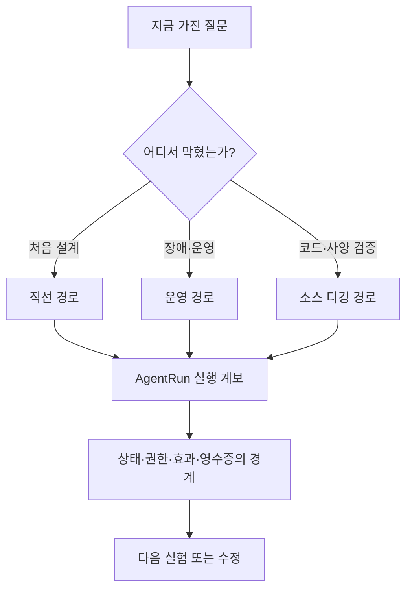
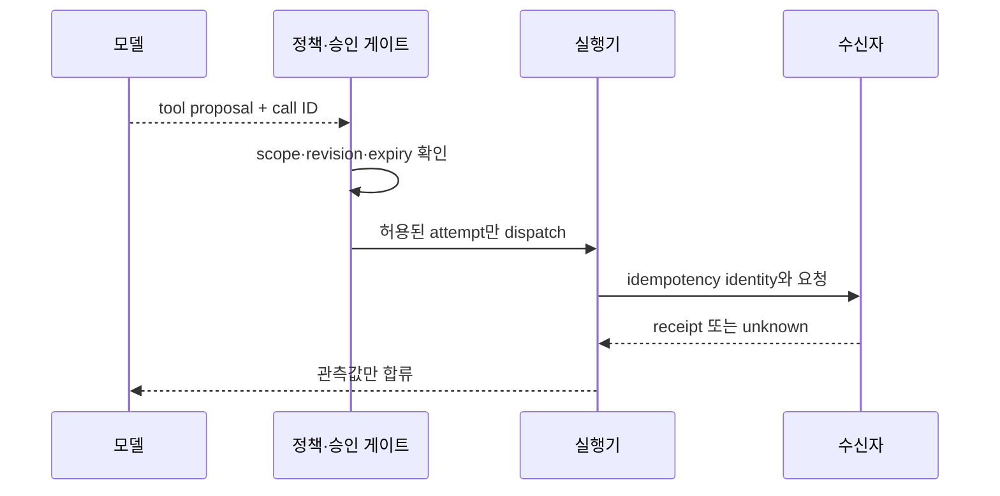
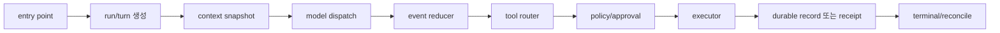

# 이 책을 읽는 법 — 문제에서 시작해 실행 계보로 돌아오는 세 경로

이 책은 처음부터 끝까지 읽어도 되지만, 그 한 가지 길만 권하지 않는다. 에이전트 시스템을 다루는 사람은 대개 빈 노트에서 시작하지 않는다. 누군가는 “취소했는데 왜 메시지가 갔는가”라는 incident를 들고 오고, 누군가는 retrieval 품질 저하를 들고 오며, 누군가는 새 프레임워크의 supervisor·memory·swarm 기능이 무엇을 실제로 보장하는지 판단해야 한다. 출발점은 다르다. 다만 어느 길을 택해도 마지막에는 하나의 `AgentRun`으로 돌아와야 한다. 그래야 국소적인 증상과 전체 실행의 소유권이 다시 만난다.

이 안내는 세 가지 대표 경로와 여러 우회로를 제시한다. **직선 경로**는 처음 구현하거나 체계를 세우는 독자를 위한 길이고, **운영 경로**는 장애·SLO·보안 사건에서 출발하는 길이며, **소스 디깅 경로**는 코드·사양·논문을 따라 낯선 구현을 검증하려는 길이다. 어느 경로에서도 장을 읽는 순서는 “기능 설명 → 옵션 목록”이 아니라 “실패 장면 → 상태 소유자 → 관측점 → 반례 → 복구 판단”이다.

## 먼저, 장을 여는 공통 규칙

### 한 장마다 ‘완료’의 주어를 찾는다

“요청이 완료됐다”는 문장은 주어가 빠져 있다. 모델 요청이 끝난 것인지, local handler가 반환한 것인지, receiver가 effect ID를 commit한 것인지, 사용자의 화면이 업데이트된 것인지에 따라 다음 행동이 달라진다. 따라서 각 장에서 먼저 찾을 것은 기능 이름이 아니라 상태의 owner다.

| 상태 | 먼저 확인할 owner | 흔한 잘못된 결론 |
|---|---|---|
| 모델 응답 종료 | provider client·stream reducer | 도구도 끝났다 |
| 호출 허용 | policy·approval gate | schema에 보였으니 실행 가능하다 |
| 도구 반환 | executor | 외부 변화가 commit됐다 |
| 외부 효과 | receiver 또는 durable effect store | timeout이므로 아무 일도 없었다 |
| 사용자 표시 | UI/session projection | terminal 상태가 durable하다 |

이 구분은 이론을 위한 까다로움이 아니다. 예를 들어 [HTTP의 idempotent method 정의](https://www.rfc-editor.org/rfc/rfc9110#section-9.2.2)는 같은 요청을 반복했을 때 의도된 효과가 같은 성질을 설명한다. 그러나 특정 API가 정말 그 성질을 구현했는지는 endpoint 문서, receiver의 저장 방식, 실패 주입으로 따로 확인해야 한다. 명칭과 구현은 다르다.

### 다음 세 증거를 함께 찾는다

한 장의 설명을 읽을 때는 세 층을 번갈아 본다. 첫째는 공개 원전이나 고정 코드가 직접 말하는 사실이다. 둘째는 작고 재현 가능한 조건에서 실제로 관찰한 사건이다. 셋째는 그 둘을 바탕으로 한 설계 선택이다. 마지막 층이 가장 실무적일 때도 있지만, 첫째·둘째 층과 같은 문장으로 읽으면 위험하다.

| 독서 표지 | 예 | 질문 |
|---|---|---|
| 직접 근거 | 사양, 논문, 고정 revision 코드 | 정확히 어떤 조건에서 말하는가? |
| 실행 관찰 | fixture, test, trace, failure injection | 입력·환경·oracle은 무엇인가? |
| 설계 선택 | retry 규칙, ledger schema, gate 순서 | 내 실패 모델에서도 타당한가? |
| 미확인 경계 | provider 내부, 원격 receipt, 멀티노드 partition | 무엇을 측정해야 결론이 나는가? |

이 책에서 “미확인”은 빈칸이 아니라 작업 항목이다. 수신자 receipt가 없는 timeout을 `unknown`으로 남기는 설계는 불친절해서가 아니라, 실제로 구별할 수 없는 두 세계를 하나로 지어내지 않기 위한 선택이다.

### 장의 끝에서 반드시 남길 네 가지

각 장을 읽고 나면 최소한 아래 네 가지를 메모한다. 현업 incident 대응에서도, 새 라이브러리 평가에서도 이 노트가 다음 장의 연결점이 된다.

- 상태: 어떤 ID와 revision이 바뀌었는가?
- 관측: trace·log·metric·receipt 중 무엇이 그 사실을 뒷받침하는가?
- 반례: 이 설명이 성립하지 않는 가장 작은 실패 장면은 무엇인가?
- 다음 gate: 효과를 허용하거나 재시도하기 전에 무엇을 다시 확인해야 하는가?

## 경로 1 — 직선 경로: 처음부터 하나의 실행을 끝까지 만들기

이 경로는 새 시스템을 설계하거나, 에이전트 기능을 기능 목록이 아닌 실행 모델로 처음 잡고 싶은 독자를 위한 길이다. 총 41장을 순서대로 읽는 것이 기본이지만, 첫 통과에서 모든 세부 구현을 암기할 필요는 없다. 대신 각 부가 다음 부에 무엇을 넘기는지 붙잡는다.

### 1단계: 한 요청의 경계를 세운다 — 1–3장

1장에서 `Run`, `Turn`, `Step context`, `logical call`, `attempt`, `effect`, `receipt`를 분리한다. 2장에서는 ReAct를 한 줄짜리 loop가 아니라 상태 전이가 있는 실행으로 다시 읽는다. 3장은 Claude Code, Codex, Jikji, pi-agent처럼 비슷해 보이는 framework의 경계를 같은 이름으로 뭉개지 않는 법을 다룬다.

이 단계의 산출물은 코드가 아니라 한 장짜리 실행 원장이다. 새 요청이 들어왔을 때 어떤 ID가 생기고, 누가 terminal을 선언하며, 어디서 child가 갈라지는지 적어 본다. 아직 tool을 연결하지 않아도 된다. identity가 불분명한 시스템에 tool을 더하는 것은 어두운 방에 문을 더 만드는 일과 같다.

### 2단계: 모델이 보게 되는 세계를 고정한다 — 4–10장

4–7장은 instruction, context assembly, tokenizer, chat template, tool schema, compaction, memory를 하나의 문맥 계약으로 묶는다. 8–10장은 model request와 retry identity, partial stream, 확률적 제안과 결정적 제어면을 나눈다. 여기서 핵심은 모델이 “현재 대화 전체”를 보는 것이 아니라 특정 세대의 조립된 입력을 본다는 사실이다.

이 단계에서는 아주 작은 golden input을 만든다. 고정된 instruction, 두 개의 도구 schema, 짧은 대화, retrieval 후보 하나, context generation 하나를 기록한다. 같은 사용자 문장이더라도 chat template·schema·tool visibility가 달라지면 같은 모델 요청이 아닐 수 있다. [Hugging Face chat template 문서](https://huggingface.co/docs/transformers/chat_templating)는 메시지 구조가 실제 token sequence로 바뀌는 과정을 보여 주며, [JSON Schema](https://json-schema.org/overview/what-is-jsonschema)는 도구 입력 형식의 계약을 읽는 출발점이 된다.

### 3단계: 제안을 효과로 바꾸기 전에 멈춘다 — 11–14장

11–14장은 tool registry, routing, permission, approval, sandbox, logical call, parallel execution, speculative execution을 다룬다. 이 부분은 “도구를 많이 붙이면 에이전트가 강해진다”는 직관을 가장 자주 깨는 구간이다. 도구 schema는 모델이 사용할 수 있는 언어이고, 실행 권한은 별도의 통제면이다. 동시에 여러 branch를 내보낸다고 latency가 자동으로 줄지 않으며, 서로 상관된 후보를 여러 개 얻는다고 근거가 늘지 않는다.

직선 경로의 첫 번째 중간 점검은 13장에서 한다. timeout 뒤 재시도가 가능한 이유를 “재시도는 안전하다”가 아니라 “receiver가 어떤 key를 중복 제거하며 어떤 receipt로 결론을 주는가”로 설명할 수 있어야 한다. 설명할 수 없다면 14장의 speculation을 활성화할 때가 아니다.

### 4단계: 일을 늘리기 전에 책임을 보존한다 — 15–20장

15–20장은 delegation, planner-worker DAG, debate, verifier, blackboard, contract-net, mailbox, CRDT, consensus를 다룬다. 이 부의 핵심 문장은 간단하다. **작업을 나누는 것과 책임을 나누는 것은 다르다.** child 결과에는 parent가 시작할 때의 snapshot과 generation이 붙어야 하고, 늦은 결과를 합칠 때는 품질 평가 전에 stale 여부를 판단해야 한다. 투표는 durable commit이 아니며, blackboard의 CAS는 distributed consensus가 아니다.

여기서는 agent 수를 늘리기보다 하나의 merge rule을 먼저 쓴다. “어떤 결과를 어떤 parent generation에 합칠 수 있는가”, “서로 다른 답이 나왔을 때 verifier는 어떤 predicate와 독립 근거를 요구하는가”, “누가 shared state의 어느 키를 쓸 권한이 있는가”가 그 rule의 내용이다. [Raft 논문](https://raft.github.io/raft.pdf)은 합의의 조건을 읽는 좋은 기준점이지만, agent vote를 Raft commit으로 부르는 면허는 아니다.

### 5단계: 검색을 근거 판정과 바꾸지 않는다 — 21–24장

21–24장은 embedding, vector search, graph, temporal query, hybrid retrieval을 연결한다. 이 부를 통과한 뒤에는 “관련 있어 보이는 문서”와 “현재 tenant·권한·시간 범위에서 채택 가능한 근거”를 구별할 수 있어야 한다. vector score는 후보 순위를 정하는 신호다. graph edge는 탐색 경로가 될 수 있다. 둘 중 어느 것도 그 자체로 권한, 최신성, 부정, 출처, 인과성을 증명하지 않는다.

권장 순서는 `scope와 authorization → 넓은 후보 검색 → graph join → temporal/provenance 검증 → 채택 또는 보류`다. post-filter가 authorized recall을 조용히 잃게 만들 수 있다는 점도 여기서 확인한다. [FAISS](https://faiss.ai/)와 [W3C PROV](https://www.w3.org/TR/prov-overview/)를 함께 읽으면 검색과 provenance가 서로 대신할 수 없는 이유가 선명해진다.

### 6단계: 사람·지속성·운영으로 닫는다 — 25–41장

25–27장은 ask-or-act, consent, approval, interrupt, steer, resume을 다룬다. 28–31장은 event log, checkpoint, replay, outbox/inbox/saga, lease, heartbeat, fencing, fault injection으로 실패 이후의 판단을 다룬다. 32–36장은 telemetry, evaluation, SLO, multi-tenancy, operations을 통해 관측과 운영의 경계를 세운다. 37–40장은 전체 실행을 작은 재현 가능한 lab으로 닫고, 41장은 처음 보는 프레임워크에도 적용할 독해 rubric을 남긴다.

직선 경로를 마쳤다면 다음 체크리스트에 답할 수 있어야 한다.

- 한 Run에서 model attempt와 logical call은 왜 서로 다른가?
- effect가 `unknown`일 때 왜 blind replay를 금지해야 하는가?
- approval revision과 context generation은 effect 직전에 왜 다시 검증되는가?
- trace가 있어도 receipt가 별도로 필요한 이유는 무엇인가?
- 배포 후 incident에서 최초 계약 위반을 어떻게 찾는가?

## 경로 2 — 운영 경로: 장애·보안·SLO에서 거꾸로 읽기

이 경로는 이미 서비스가 있고, 증상이 먼저 보이는 독자를 위한 길이다. 목표는 incident를 한 번의 로그 검색으로 끝내는 것이 아니라, 최초로 깨진 계약을 찾는 것이다. 시작점은 36장이지만 36장에서 끝나지 않는다.

### 화면에는 취소, 바깥에는 완료가 보일 때

13장 → 29장 → 30장 → 31장 → 39장 → 40장 순으로 읽는다. 먼저 logical call과 effect receipt를 분리하고, outbox/inbox와 reconciliation으로 넘어간다. 그 다음 lease와 fencing이 stale writer를 어디까지 막는지 확인한다. 마지막에 process kill, timeout, retry를 가진 lab에서 `unknown`의 실제 처리를 점검한다.

| 증상 | 첫 장 | 즉시 확인할 사실 | 금지할 성급한 대응 |
|---|---|---|---|
| 취소 뒤 알림 도착 | 13, 29 | receiver receipt와 effect ID | blind retry 또는 “취소 성공” 선언 |
| 같은 메시지 두 번 전송 | 8, 13 | logical call ID·attempt·idempotency key | UI session ID만으로 dedup |
| worker 재시작 뒤 오래된 쓰기 | 30 | fencing token과 receiver 검사 | heartbeat가 새로우니 안전하다고 판단 |
| 재개 뒤 답변이 달라짐 | 6, 28 | context generation·checkpoint·tool visibility | replay가 있으니 동일 실행이라고 간주 |

### retrieval이 다른 tenant의 정보를 내보일 때

21장 → 22장 → 24장 → 12장 → 35장 → 39장 순으로 읽는다. 여기서는 검색 품질 지표보다 authorization path가 먼저다. post-filter는 제한된 후보에서 허가 가능한 항목을 놓칠 수 있고, filter 누락은 아예 다른 tenant의 후보를 노출할 수 있다. model prompt에 넣기 전의 scope gate와 채택 전 provenance·freshness 검사를 분리한다.

### tail latency와 비용이 함께 악화될 때

14장 → 16장 → 32장 → 34장 → 36장 순으로 읽는다. 병렬화와 speculation은 평균 latency만 보아서는 판단할 수 없다. 분기 성공 확률, verification 비용, 취소 후에도 남는 원격 작업, queue wait, provider defer, token 사용량, tenant별 admission을 함께 본다. [Prometheus의 metric과 label 관행](https://prometheus.io/docs/practices/naming/)은 bounded label을 권하는 이유를, [OpenTelemetry metrics](https://opentelemetry.io/docs/concepts/signals/metrics/)는 집계 신호가 개별 effect의 영수증을 대체하지 못하는 이유를 생각하게 한다.

운영 경로에서 마지막으로 남길 것은 대시보드가 아니라 incident packet이다. RunID, policy revision, context generation, logical call ID, attempt 번호, dispatch·cancel·return·receipt 시각, tenant, effect disposition을 한 사건으로 묶는다. “실패율이 올랐다”는 출발점이고, “어느 계약이 처음 깨졌는가”가 결론이다.

## 경로 3 — 소스 디깅 경로: 새 프레임워크를 이름이 아니라 경계로 검증하기

이 경로는 Codex, Claude Code, Jikji, pi-agent 또는 아직 이름을 모르는 새 framework의 소스를 읽는 사람을 위한 길이다. 목표는 라이브러리의 모든 파일을 읽는 데 있지 않다. 한 번의 AgentRun을 실제로 따라가고, 주장할 수 있는 범위와 주장할 수 없는 범위를 가르는 데 있다.

### 첫 번째 왕복: public entry에서 terminal까지

1장 → 3장 → 8장 → 9장 → 11장 → 13장 → 28장 순으로 읽는다. 시작 API 또는 CLI entry를 찾고, run·turn 생성, context capture, model dispatch, stream reduction, tool router, durable event 기록, terminal transition을 따라간다. 함수 하나를 찾았다고 경로가 끝난 것은 아니다. 호출자·피호출자·예외 처리·테스트까지 확인해야 실제 경계가 보인다.

### 두 번째 왕복: API 문서와 runtime을 분리한다

문서에 “agent can use tools”라고 쓰여 있어도 tool name collision, schema drift, retry identity, receiver-side dedup가 구현됐다는 뜻은 아니다. 반대로 코드에 `idempotency_key` 필드가 있어도 수신자가 실제로 중복 제거했다는 뜻은 아니다. API 문서는 의도와 공개 계약을 알려 주고, 고정 코드와 테스트는 특정 구현의 조건을 알려 준다. 둘을 하나의 무게로 합치지 않는다.

새 framework를 읽을 때의 최소 질문은 다음과 같다.

- run과 turn은 어디서 만들어지고 지속되는가?
- context는 어느 시점에 snapshot되며 compaction 뒤 generation은 바뀌는가?
- tool proposal은 어느 router에서 policy decision으로 변하는가?
- cancellation token은 admission 전·실행 중·수신자 효과 후에 각각 무엇을 멈추는가?
- output filter가 실행 전 gate인지, 이미 끝난 실행의 결과 filter인지 어떻게 구별되는가?
- retry는 어떤 logical identity를 보존하며, receiver receipt는 어디서 합류하는가?
- test가 보장하는 범위는 local mock인가, remote API인가, multi-process인가?

### 세 번째 왕복: 반례를 먼저 설계한다

소스 디깅의 완성은 “이 함수가 있다”가 아니라 “이 함수가 있어도 이 반례는 막지 못한다”를 말할 수 있는 상태다. stream reducer에는 duplicate·out-of-order·malformed event를 넣고, approval에는 stale revision을 넣고, child merge에는 오래된 generation을 넣고, receiver에는 timeout 뒤의 duplicate attempt를 넣는다. [Jepsen의 분산 시스템 테스트 글](https://jepsen.io/analyses)은 정상 경로보다 failure model을 먼저 명시해야 하는 이유를 보여 주는 좋은 읽을거리다.

## 목적별 빠른 진입표

| 지금의 목적 | 먼저 읽을 장 | 이어서 볼 장 | 손에 남겨야 할 결과 |
|---|---|---|---|
| 최소 agent loop를 안전하게 만들기 | 1, 4, 8, 11 | 12, 13, 37 | Run·call·effect가 분리된 golden run |
| tool calling을 production에 올리기 | 11–14 | 26, 29–32, 39 | approval·idempotency·receipt 계약 |
| child agent를 도입하기 | 15–18 | 20, 27, 28, 38 | parent snapshot과 merge rule |
| agent debate를 신뢰할지 판단하기 | 16–17 | 33, 38 | 독립 근거·verifier predicate·stop rule |
| RAG를 권한 있게 만들기 | 21–24 | 12, 25, 35, 39 | scope-first retrieval pipeline |
| 재현·재개·복구를 설계하기 | 27–31 | 37, 40 | checkpoint·replay·reconcile oracle |
| SLO와 운영 체계를 만들기 | 32–36 | 31, 39–40 | bounded telemetry와 incident playbook |
| 낯선 framework를 평가하기 | 3, 41 | 1, 11–13, 28 | source-to-failure rubric |

## 10부 전체 목차를 문제로 읽는 법

열 부분을 순서가 아니라 질문의 묶음으로 다시 보면 필요한 장을 더 빨리 찾을 수 있다.

1. **실행의 최소 단위(1–3장)** — “이 요청”이 실제로 무엇인가?
2. **모델이 보는 세계(4–10장)** — 모델의 입력·stream·retry는 어떤 상태에 의존하는가?
3. **도구와 외부 효과(11–14장)** — 제안은 어떻게 허용되고, 실패 뒤 무엇을 알 수 있는가?
4. **여러 작업의 조정(15–20장)** — 분업이 책임과 독립 근거를 보존하는가?
5. **검색과 지식 경계(21–24장)** — 후보를 어떤 조건에서 근거로 채택하는가?
6. **사람과 실행권(25–27장)** — 질문·승인·중단·재개는 어떤 durable contract인가?
7. **지속성과 복구(28–31장)** — crash 뒤 무엇을 replay하고 무엇을 reconcile하는가?
8. **관측과 운영 판단(32–36장)** — metrics가 말하지 못하는 것을 어떤 receipt와 oracle로 보완하는가?
9. **재현 가능한 실습(37–40장)** — 좁은 실험이 실제 failure boundary를 어떻게 드러내는가?
10. **낯선 시스템의 독해(41장)** — 새 이름을 만나도 같은 질문으로 어떻게 판별하는가?

## 세 경로에 공통인 종료 조건

어느 경로를 골라도 아래 조건을 만족하기 전에는 “이 기능을 이해했다”라고 말하지 않는 편이 좋다.

- 정상 경로 하나와 실패 경로 하나를 같은 RunID 계보로 설명할 수 있다.
- 모델 제안, policy decision, tool attempt, external effect, receipt를 서로 다른 사건으로 말할 수 있다.
- trace·log·metric 중 어느 신호가 빠져도 무엇이 사라지고 무엇이 남는지 안다.
- timeout·cancel·crash 뒤에 안전한 결론과 `unknown`을 구분한다.
- 한 가지 framework의 편의 API를 일반 보장으로 확장하지 않는다.
- 적어도 하나의 공개 원전과 하나의 실행 관찰을, 적용 범위를 잃지 않고 연결한다.

책을 닫을 때 독자가 얻어야 할 것은 특정 agent library의 레시피가 아니다. 새 시스템을 보고도 질문을 잃지 않는 감각이다. “누가 이 상태를 소유하는가?”, “이 화살표는 어떤 기록으로 증명되는가?”, “이 실패 뒤에 정말 재시도해도 되는가?”라는 세 질문이 남아 있다면, 이 책의 어느 경로로 들어왔든 올바른 곳에 도착한 것이다.
