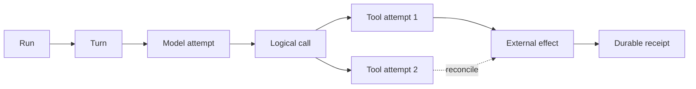
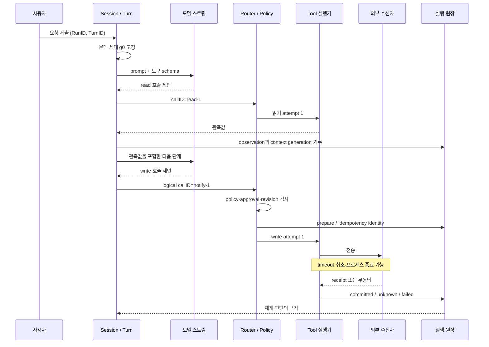

# 1장. 한 요청이 끝났다는 말의 무게

## 열여덟 사건으로 보는 한 번의 실행

한 로컬 실행을 검색부터 수신 확인까지 끊지 않고 기록해 보았다. 하나의 `run_id`와 `trace_id`, 그리고 1–18의 순번 범위 안에서 후보 검색, 권한 확인, 원문 행과 해시 검증, 세 갈래 실행, 취소 요청과 확인, 효과 적용, 수신자 재시작 뒤 확인서 조회가 차례로 일어났다.

|관측 단위|수|읽어야 할 의미|
|---|---:|---|
|검색 후보|3|답도, 실행 권한도 아닌 후보|
|초기 권한 허용|2|그 시점에 읽을 수 있었다는 판정|
|검증된 고유 근거|1|파일·행·세대·해시가 일치한 근거|
|실행 갈래|3|근거 세 개가 아니라 같은 근거를 쓴 계산 세 개|
|수신 확인서|1|승자 효과가 로컬 수신자에 적용된 근거|

`run`, `turn`, `attempt`, `logical call`, `effect`를 다른 이름으로 두는 이유는 수명이 다르기 때문이다. 모델 재시도는 attempt를 늘리지만 사용자의 논리 행동까지 새로 만들지는 않는다. 반대로 한 turn에서 파일 수정과 알림 발송은 서로 다른 logical call과 effect다. 이 구분이 있어야 “다시 실행해도 되는가?”를 로그 문자열이 아니라 수신자 상태로 답할 수 있다.

토요일 밤, 배포 브랜치의 설정 파일을 고쳐 달라는 요청이 들어왔다. 에이전트는 저장소를 읽고, 변경안을 만들고, 사용자에게 승인을 받았다. 이어 네트워크가 잠시 끊겼다. 화면에는 “취소됨”이 남았지만, 몇 초 뒤 알림 채널에는 배포 완료 메시지가 도착했다. 파일은 바뀌었는가? 메시지는 한 번만 보내졌는가? 다시 실행해도 되는가?

이 장은 이 질문을 피해 가지 않는다. 에이전트가 말을 잘 만드는 프로그램이라는 설명만으로는 답할 수 없기 때문이다. 실제 시스템에서 한 요청은 문장 하나가 아니라 **상태를 가진 실행**이다. 입력을 받아 문맥을 조립하고, 모델 응답을 스트리밍으로 줄이고, 도구 호출을 판정하고, 효과를 남기거나 남기지 못한 채 멈춘다. 어느 한 경계가 흐려지면 “성공”, “취소”, “재시도”라는 짧은 단어가 서로 다른 사실을 가리키게 된다.

이 책에서는 이 단위를 `AgentRun`이라고 부른다. 특정 프레임워크의 클래스 이름이 아니라, 사용자 요청에서 시작해 최종 응답 또는 중단 상태에 이르는 추적 가능한 실행 단위라는 뜻이다. 1장의 목표는 하나다. 독자가 장애 한 장면을 보았을 때, 다음에 어디를 열어 어떤 소유자와 기록을 확인해야 하는지 알게 하는 것.

## 1.1 실패 장면부터 시작한다

가상의 요청을 하나 정하자. “`config/production.yaml`의 timeout을 30초로 바꾸고, 변경 이유를 배포 채널에 알려라.” 읽기 도구와 쓰기 도구가 모두 필요하다. 모델은 먼저 파일을 읽고, 수정 명령을 제안하고, 알림 전송을 제안한다. 모델은 두 도구를 *제안*했을 뿐이다. 그렇다고 둘이 같은 종류의 일이 되지는 않는다.

읽기는 대개 다시 해도 괜찮다. 그러나 쓰기는 외부 세계를 바꾼다. 메시지는 이미 발송됐을 수 있고, HTTP 요청은 서버에 도착했지만 응답만 유실됐을 수 있다. 호출자가 timeout을 맞았다는 사실은 수신자가 아무 일도 하지 않았다는 증거가 아니다.

이 장의 기준 장면에서 실행은 다음 순서로 흔들린다.

1. 요청을 받아 turn을 시작한다.
2. 현재 지시문, 대화, 작업 디렉터리, 사용 가능한 도구를 묶어 모델 입력을 만든다.
3. 모델 스트림이 읽기와 쓰기 도구 호출을 내보낸다.
4. 읽기 결과가 다음 모델 입력으로 합류한다.
5. 길어진 문맥을 줄이거나 child 작업을 분기하는 사이 부모 상태가 바뀐다.
6. 쓰기 직전 승인을 다시 확인한다.
7. 도구가 실행되는 동안 연결이 끊기거나 프로세스가 죽는다.
8. 시스템은 성공이라고 지어내지 않고, 남은 기록으로 재개·조회·보류 중 하나를 선택한다.

이를 “모델 → 도구 → 답변”으로 납작하게 그리면 두 가지 오류가 생긴다. 첫째, 화면에 보이는 완료와 외부 효과의 완료를 같은 사건으로 취급한다. 둘째, 재시도를 언제나 복구라고 부른다. 좋은 에이전트 시스템은 이 둘을 분리해서 기록한다.

## 1.2 왜 실행을 상태 기계로 읽어야 하는가

언어 모델은 다음 행동의 후보를 낸다. 실행기는 그 후보를 받아 상태를 바꾼다. 이 분업은 책임을 선명하게 만든다. 모델이 `send_message`를 출력해도 실제 전송 권한을 가진 것은 모델이 아니라 도구 경계다. 반대로 실행기가 결과를 기록해도 그 결과를 다음 문맥에 넣을지 결정하는 곳은 별도일 수 있다.

가장 작은 상태 원장은 다음과 같이 분해하는 편이 안전하다.

| 단위 | 질문 | 예 | 누가 소유해야 하는가 |
|---|---|---|---|
| Run | 무엇을 하나의 요청으로 묶는가 | `run-7f…` | session/thread 관리자 |
| Turn | 이번 사용자 입력에 대한 한 번의 진행은 무엇인가 | steer 또는 새 turn | turn admission |
| Step context | 모델이 이번 단계에 실제로 본 세계는 무엇인가 | 지시문·도구·작업 경로·문맥 세대 | context builder |
| Model attempt | 어느 요청을 어느 provider에 보냈는가 | retry 전후 두 attempt | request/retry owner |
| Logical tool call | 사용자가 의도한 한 행동은 무엇인가 | “배포 채널에 알림” | router/ledger |
| Tool attempt | 그 행동을 몇 번째로 실행했는가 | timeout 뒤 재전송 | executor |
| External effect | 바깥 세계에서 실제로 무엇이 달라졌는가 | 메시지 1건 | 수신자 또는 효과 원장 |
| Receipt | 효과를 확인할 근거가 있는가 | receiver의 effect ID | 수신자·durable store |

특히 `logical call`과 `attempt`를 나누는 것이 중요하다. 같은 알림을 다시 시도했다고 해서 새 알림이 되어서는 안 된다. 반대로 새 알림을 보내야 하는 상황에서 오래된 식별자를 재사용해도 안 된다. 이 구분이 없으면 retry 횟수, 비용, 중복 효과, 실패 복구를 모두 제대로 설명할 수 없다.

아래 그림은 한 요청의 **설계상 사건 순서**다. 실제 trace가 없는 화살표까지 발생했다고 단정하는 그림이 아니다. 각 화살표에 관측점과 실패 질문을 붙일 자리로 읽는다.

여기서 `unknown`은 실패한 구현의 변명이 아니라 정상적인 상태다. 응답을 받지 못한 순간, “안 보냈다”와 “보냈지만 답이 사라졌다”를 구별할 수 없다면 둘 중 하나를 고르면 안 된다. 상태 조회, 수신자 측 중복 제거, 사람의 확인, 보상 작업이 필요한 이유가 여기에 있다.

## 1.3 상태는 누가 갖는가: 소유자가 없으면 복구도 없다

상태는 많이 저장할수록 좋은 것이 아니다. 각 사실에 한 명의 결정권자를 두고, 다른 곳에는 복제본·관측값·캐시라는 지위를 부여해야 한다.

Codex의 고정 공개 리비전에서 `run_turn`은 이전 hook 결과를 비우고, 샘플링 전 문맥 축약을 시도하고, 필요한 MCP 서버를 정한 뒤, 첫 `StepContext`를 포착한다. 코드에서는 `capture_step_context_with_required_mcp_servers(...)` 호출이 이 일을 맡는다. 모델 요청은 막연한 “현재 대화” 대신 이 시점에 포착된 단계 문맥에서 출발한다. [Codex `run_turn`](https://github.com/openai/codex/blob/0344625ccf4ae0ab6472c6c1e7b4ace6af14661e/codex-rs/core/src/session/turn.rs#L155-L255)

이 사실에서 곧바로 “문맥은 항상 최신이다”를 결론 내리면 안 된다. 포착 뒤 파일·권한·부모 상태가 바뀔 수 있다. 따라서 effectful 도구는 **제안 시점의 문맥 세대**만 믿지 말고 **실행 직전의 정책·권한·대상 revision**을 다시 확인해야 한다. snapshot은 설명을 위한 기준점이고, 최신성 보증은 별도 게이트다.

소유권을 현실적으로 배치하면 다음과 같다.

| 사실 | 권장 owner | 다른 계층이 가져도 되는 것 | 잘못된 지름길 |
|---|---|---|---|
| turn 시작·중단 | session/thread | UI의 진행 표시 | UI에서 완료로 보인다고 durable terminal이라 믿기 |
| 모델이 본 문맥 | step-context builder | debug snapshot | 이전 대화 전체가 자동으로 보존된다고 믿기 |
| 도구 허용 여부 | policy/approval gate | 모델에 보이는 schema | schema 노출을 실행 권한으로 읽기 |
| 호출 식별자 | router/ledger | trace attribute | trace ID를 idempotency key로 쓰기 |
| 외부 효과 완료 | receiver + receipt | executor의 성공 로그 | exit 0을 효과 commit으로 읽기 |
| 재개 판단 | durable ledger/reconciler | retry counter | timeout 뒤 blind replay |

Jikji 공개 코드의 remote tool 요청은 `tenant_id`, `run_id`, `call_id`, 선택적 `idempotency_key`를 wire request에 싣는다. 이는 수신자가 같은 논리 호출을 식별할 재료를 준다. 그러나 수신자가 실제로 중복 제거를 하는지, 수신자 DB와 외부 효과를 한 transaction으로 묶는지는 이 필드만으로 증명되지 않는다. [Jikji `remoteExecuteRequest`](https://github.com/jikji-labs/jikji/blob/d0cb4997e1882f9f5fc28b0b601ddf97317baf43/jikji/pkg/toolnode/remote_runner.go#L91-L100)

이 차이는 현장에서 매우 크다. “키를 보냈다”는 설계 입력이다. “같은 키로 두 번 와도 한 번만 반영했다”는 수신자 테스트와 receipt가 있어야 하는 실행 성질이다.

## 1.4 실제 코드 경로: 제안이 실행이 되기까지

모델 스트림의 도구 호출은 아직 실행이 아니다. Codex에서는 stream의 response item이 in-flight tool future로 보내질 수 있고, 그 뒤 router가 `session`, `turn`, `step_context`, cancellation token, `call_id`, tool name, payload를 묶은 `ToolInvocation`을 만든다. 짧게 보면 `ToolInvocation { … call_id, tool_name, payload }`가 바로 그 경계다. [Codex tool router](https://github.com/openai/codex/blob/0344625ccf4ae0ab6472c6c1e7b4ace6af14661e/codex-rs/core/src/tools/router.rs#L302-L387)

그 다음 registry는 이름 없는 도구와 payload 종류가 맞지 않는 도구를 거절하고, pre-tool hook을 수행하며, 필요하다면 입력을 바꾼 새 invocation으로 교체한다. 이는 “모델이 올바른 JSON을 만들었다”와 “현재 환경에서 이 행동을 허용한다”가 별개의 검증이라는 뜻이다. [Codex registry preflight](https://github.com/openai/codex/blob/0344625ccf4ae0ab6472c6c1e7b4ace6af14661e/codex-rs/core/src/tools/registry.rs#L493-L650)

실행 뒤에도 한 번 더 중요한 분리가 있다. Codex의 주석은 이를 아주 직접적으로 말한다. `A PostToolUse block rejects the result, not the already-completed tool execution.` 즉 post-tool hook이 결과의 모델 노출을 막을 수 있어도, 이미 끝난 도구의 외부 효과를 되돌린다는 뜻은 아니다. [Codex registry postflight](https://github.com/openai/codex/blob/0344625ccf4ae0ab6472c6c1e7b4ace6af14661e/codex-rs/core/src/tools/registry.rs#L651-L773)

승인과 sandbox도 같은 방식으로 읽어야 한다. orchestrator는 approval 요건과 sandbox 관련 시도를 순서 있게 조합한다. 하지만 approval은 행동을 허용하는 의사결정 경로이고, sandbox는 특정 실행 환경의 제한이다. 둘 중 어느 것도 일반적인 외부 API 효과의 rollback 영수증은 아니다. [Codex tool orchestrator](https://github.com/openai/codex/blob/0344625ccf4ae0ab6472c6c1e7b4ace6af14661e/codex-rs/core/src/tools/orchestrator.rs#L56-L260)

이 네 경계를 따라가면, 디버깅 질문도 자연스럽게 바뀐다.

- 모델이 왜 이 도구를 제안했는가? — prompt와 도구 schema, retrieval·관측값을 본다.
- 왜 이 도구가 실행됐는가? — router와 policy·approval 결정을 본다.
- 왜 사용자에게 결과가 안 보였는가? — postflight와 observation join을 본다.
- 실제 세계는 바뀌었는가? — executor log가 아니라 receiver receipt와 effect ledger를 본다.

## 1.5 문맥 축약과 child 작업: 기억은 복사가 아니라 세대다

긴 실행은 모든 대화를 그대로 모델에 보낼 수 없다. 그래서 요약·축약·분기를 사용한다. 하지만 “요약했으니 기억했다”는 위험한 문장이다. pending approval, 금지 조건, 아직 끝나지 않은 도구 호출, 권한 revision 같은 정보는 문장 요약에서 쉽게 탈락하거나 의미가 바뀔 수 있다.

Codex는 샘플링 전 현재 context window와 fallback 조건을 확인해 축약을 실행할 수 있으며, dispatch는 token budget과 provider capability에 따라 여러 경로를 고른다. [pre-sampling compaction](https://github.com/openai/codex/blob/0344625ccf4ae0ab6472c6c1e7b4ace6af14661e/codex-rs/core/src/session/turn.rs#L1032-L1331) 따라서 안전한 설계는 `g0`의 문맥에서 나온 proposal을 `g1`의 권한 상태에 그대로 commit하지 않는다. proposal에는 생성 세대를, commit gate에는 현재 세대를 기록하고, 불일치 시 재검증하거나 버린다.

child agent도 마찬가지다. 부모의 snapshot에서 child를 시작하는 것은 child가 부모의 live state를 공유한다는 뜻이 아니다. Codex의 fork는 persisted rollout history를 읽어 새 child identity를 만든다. [Codex thread fork](https://github.com/openai/codex/blob/0344625ccf4ae0ab6472c6c1e7b4ace6af14661e/codex-rs/core/src/thread_manager.rs#L1247-L1435) child가 늦게 낸 결과를 부모가 받아들일 때는 “좋은 답인가”에 앞서 “어느 snapshot을 전제로 했는가”를 검사해야 한다. stale 결과의 merge는 언어 품질 문제가 아니라 상태 동시성 문제다.

## 1.6 관측: trace는 지도이지 영수증이 아니다

관측이 없으면 복구는 추측이 된다. 반대로 trace가 있다고 해서 모든 사실이 증명되지는 않는다. Trace ID는 이벤트를 엮는 join key이지 권한, tenant, 외부 효과 commit을 대신하는 권한 증명이 아니다. [W3C Trace Context](https://www.w3.org/TR/2021/REC-trace-context-1-20211123/)

실무에서 최소한 다음 시간과 ID를 분리해 남긴다.

| 기록 | 이유 | 혼동하면 생기는 일 |
|---|---|---|
| RunID / TurnID / parent-child ID | 실행 계보 복원 | child 결과의 원래 문맥을 잃음 |
| context generation / policy revision | stale 판정 | 오래된 승인으로 새 대상 실행 |
| logical call ID / attempt number | 재시도 상관 | 중복과 별개 요청을 구분 못 함 |
| approval decision·principal·scope | 누가 무엇을 허용했는가 | UI 승인만 남고 권한 근거가 사라짐 |
| dispatch·cancel·return·receipt 시각 | 실패 창 분석 | timeout을 미실행으로 오독 |
| effect disposition | prepared / committed / unknown / compensated | 실패를 자동 성공 또는 자동 rollback으로 바꿈 |

Codex telemetry는 response event에서 얻은 token usage와 function-call name을 response span에 기록할 수 있고, sandbox outcome을 call ID와 함께 남긴다. 이는 비용과 실행 경계의 관측에 유용하다. 그러나 외부 효과가 한 번만 commit되었다는 receipt는 아니다. [Codex response telemetry](https://github.com/openai/codex/blob/0344625ccf4ae0ab6472c6c1e7b4ace6af14661e/codex-rs/otel/src/events/session_telemetry.rs#L517-L555) · [sandbox outcome](https://github.com/openai/codex/blob/0344625ccf4ae0ab6472c6c1e7b4ace6af14661e/codex-rs/otel/src/events/session_telemetry.rs#L1104-L1133)

Metrics에는 특히 절제가 필요하다. Prometheus label에 `run_id`, raw prompt, tool argument, 이메일 같은 무한·민감 값을 넣으면 비용과 보안이 함께 무너진다. bounded label에는 결과 종류와 도구 종류를, 상세 correlation에는 trace/log/event store를 쓴다. [Prometheus label practices](https://prometheus.io/docs/practices/naming/#labels)

## 1.7 고장 주입: 성공 경로보다 먼저 준비할 여섯 장면

장애 주입은 시스템을 일부러 망가뜨리는 행사가 아니다. “성공”이라는 말이 어디까지 참인지 경계를 긋는 실험이다. 다음 표의 oracle은 화면 문구가 아니라 관찰 가능한 상태다.

| 주입 지점 | 기대할 수 있는 oracle | 절대 결론 내리면 안 되는 것 |
|---|---|---|
| `response.completed` 전 스트림 종료 | retry budget 아래 새 model attempt 또는 명시적 stream error | 앞선 partial 응답이 외부 효과를 만들지 않았음 |
| handler 시작 전 취소 | dispatch admission이 거부되고 시작 이벤트가 없음 | 원격 실행기도 반드시 멈춤 |
| handler 완료 뒤 취소 | completed lifecycle과 cancellation을 구분 | 완료한 효과가 rollback됨 |
| sandbox deny | 선택 파일/명령이 정책대로 차단됨 | 모든 외부 도구가 같은 정책을 따름 |
| approval 대기 중 취소 | handler 전 output/effect 부재 | 이미 다른 branch가 실행되지 않음 |
| process kill·timeout | receipt가 없으면 `unknown`으로 보류 | “실패”이므로 안전하게 재실행 가능 |

Codex 공개 테스트는 cancellation이 dispatch admission 전일 때와 handler 완료 뒤일 때를 구분한다. 바로 이 구분 덕분에 cancel을 하나의 boolean으로 취급하지 않게 된다. [parallel cancellation tests](https://github.com/openai/codex/blob/0344625ccf4ae0ab6472c6c1e7b4ace6af14661e/codex-rs/core/src/tools/parallel.rs#L419-L675)

또한 고정 통합 fixture는 local mock Responses stream과 로컬 POSIX 명령을 사용해, function call부터 output, 후속 model request, terminal 상태까지의 lifecycle을 검증한다. 이는 회귀를 확인하는 데 유용한 범위다. 다만 해당 fixture의 명령은 외부 write가 아니므로, receipt·idempotency·원격 rollback까지 증명하는 테스트로 넓혀 읽어서는 안 된다. [unified exec lifecycle test](https://github.com/openai/codex/blob/0344625ccf4ae0ab6472c6c1e7b4ace6af14661e/codex-rs/core/tests/suite/unified_exec.rs#L1033-L1120)

## 1.8 복구: 재시도는 결론이 아니라 질문이다

복구에는 네 상태가 특히 유용하다.

| 상태 | 뜻 | 다음 행동 |
|---|---|---|
| `prepared` | 의도와 key는 durable하지만 수신 여부를 모름 | status query 또는 idempotent retry 준비 |
| `committed` | receiver receipt와 효과 identity가 연결됨 | 결과를 관측값으로 합류 |
| `unknown` | timeout·crash·partition으로 결과를 판정 못 함 | blind replay 금지, reconcile·escalate |
| `compensated` | 되돌리는 새 효과가 성공함 | 원래 효과와 별 권한·별 receipt 보존 |

compensation은 cancellation도 rollback도 아니다. 예를 들어 이미 발송한 메시지를 지우는 작업은 “취소”가 아니라 또 하나의 권한 있는 외부 write다. 전송이 취소됐다고 간주하면 audit trail도 사라진다.

lease, heartbeat, circuit breaker도 서로 다른 문제를 푼다. lease는 한 worker가 당분간 작업할 권리를 주장하는 장치고, fencing token을 receiver가 검사할 때 stale writer를 막는다. heartbeat는 노드가 최근 살아 있었다는 routing 신호다. circuit breaker는 반복 실패 대상으로의 폭주를 줄인다. 셋 중 어느 것도 이미 출발한 요청의 효과를 자동으로 취소하거나 확인하지 않는다. Jikji의 circuit-breaker 테스트도 실패 임계값과 cooldown 뒤의 선택 가능성을 다루며, in-flight operation의 rollback을 보장하지 않는다. [Jikji breaker regression](https://github.com/jikji-labs/jikji/blob/d0cb4997e1882f9f5fc28b0b601ddf97317baf43/jikji/pkg/toolnode/catalog_breaker_test.go#L20-L70)

## 1.9 프레임워크를 비교할 때는 이름이 아니라 증거 범위를 비교한다

세 시스템이 모두 “agent”, “tool”, “session”이라는 단어를 쓰더라도 같은 durability나 cancellation 의미를 가진다고 볼 수 없다. 비교의 출발점은 기능 체크박스가 아니라 공개 근거의 종류다.

| 대상 | 공개 근거에서 직접 확인되는 경계 | 이 장에서 보류하는 것 |
|---|---|---|
| Codex | turn admission, captured step context, stream reduction, router/registry, approval·sandbox 시도, event path | remote effect exactly-once, 모든 provider의 취소·rollback |
| Jikji | loop, provider/tool dispatch, tenant·scope 경계, journal/recovery 구성, remote request identity | journal과 원격 효과의 원자적 일치, 모든 receiver dedup |
| pi-agent | active run, loop, tool validation, abort signal, 순차·병렬 실행, context compaction | 이 범위 밖의 durable persistence·recovery는 host 소유 |
| Claude Code 공개 저장소 | settings, hooks, plugins, skills, MCP, subagent 관련 공개 계약 | 공개되지 않은 내부 scheduler·memory·checkpoint 구현 |

pi-agent에서는 병렬 실행 뒤에도 tool-call 원래 순서로 result message를 구성하는 경계가 공개 구현과 테스트에 있다. 이는 “실행 완료 순서”와 “대화 transcript 순서”를 분리하는 좋은 사례다. 그러나 `AbortSignal` 전달은 외부 write rollback의 증거가 아니다. [pi-agent parallel reducer](https://github.com/badlogic/pi-mono/blob/853a80d26c90a14c1886f0ebb8ffaae133ca2185/packages/agent/src/agent-loop.ts#L487-L552) · [tool execute abort boundary](https://github.com/badlogic/pi-mono/blob/853a80d26c90a14c1886f0ebb8ffaae133ca2185/packages/agent/src/agent-loop.ts#L668-L724)

Claude Code는 공개 저장소의 hooks·plugin·MCP 문서를 통해 훌륭한 구성 표면을 보여 준다. 하지만 공개되지 않은 제품 내부의 persistence나 scheduler를 그 문서에서 역으로 확정해선 안 된다. 문서 계약과 실행 코드의 증거 등급을 섞지 않는 태도가 프레임워크 비교의 첫 규칙이다. [Claude Code public repository revision `f275fa…`](https://github.com/anthropics/claude-code/tree/f275fa282e76c5e5456912268f2c367a7f4f4797)

## 1.10 현장 체크리스트: 장애 화면 앞에서 묻는 순서

다음 질문은 incident 중에 위에서 아래로 답한다. “모델이 왜 그랬나?”를 맨 먼저 묻지 않는 이유는, 대개 먼저 복구해야 할 것은 모델의 심리가 아니라 효과의 상태이기 때문이다.

1. 이 요청의 RunID·TurnID·parent-child 계보는 무엇인가?
2. 모델이 실제로 사용한 context generation, tool schema, policy revision은 무엇인가?
3. 문제의 행동은 logical call 하나인가, 서로 다른 call인가? 각 attempt는 몇 번째인가?
4. proposal·approval·dispatch·handler return·receiver receipt의 시간을 각각 알고 있는가?
5. effect identity와 idempotency key는 receiver까지 전달됐는가?
6. timeout 뒤 상태가 `failed`가 아니라 `unknown`이어야 하는 근거는 없는가?
7. child 결과는 어느 parent snapshot에서 나왔으며, merge 직전 revision을 다시 확인했는가?
8. trace와 metric에 secret·raw prompt·unbounded ID가 들어가지 않았는가?
9. 재시도 전에 receiver 조회, dedup, compensation, 사람 승인 중 무엇이 필요한가?
10. 이 결론을 지지하는 것은 코드, test, production receipt 중 어느 종류의 근거인가?

마지막 질문이 빠지면 시스템은 쉽게 과신한다. test가 통과했다는 사실, trace가 끝났다는 사실, UI가 성공을 표시했다는 사실은 각각 유용하다. 그러나 어느 것도 자동으로 “외부 세계가 정확히 한 번 원하는 상태가 되었다”를 뜻하지 않는다.

### 1.10.1 10분 사건 판독 연습

과거 incident 하나를 골라 화면 캡처가 아니라 event ledger에서 시작한다. `RunID`, logical call ID, attempt 번호, dispatch 시각, 마지막 transport 결과, receiver receipt locator를 한 줄씩 채운다. 그중 하나라도 없으면 결론을 `failed`로 닫지 말고 `unknown`으로 남긴다. 이어 같은 call을 재시도하기 전에 receiver 조회·idempotency key 확인·사람 승인 중 무엇이 필요한지 적는다.

이 연습의 합격 기준은 원인을 멋지게 서술하는 일이 아니다. 서로 다른 두 사람이 같은 기록을 보고 **재시도 가능**, **조회 필요**, **보상 작업 필요** 중 같은 다음 행동을 고르는 것이다. 화면의 성공 문구나 trace 종료만으로 분류가 바뀌면 필요한 기록이 아직 부족하다.

## 이 장의 원전 바로가기

읽는 순서는 의도적으로 코드의 바깥에서 안쪽으로, 다시 운영 경계로 간다.

1. [W3C Trace Context Recommendation](https://www.w3.org/TR/2021/REC-trace-context-1-20211123/) — correlation ID가 권한이나 효과 receipt가 아닌 이유를 먼저 고정한다.
2. [Prometheus labels practices](https://prometheus.io/docs/practices/naming/#labels) · [OpenTelemetry GenAI agent spans](https://opentelemetry.io/docs/specs/semconv/gen-ai/gen-ai-agent-spans/) — 무엇을 관측하고 무엇을 label에 넣지 말아야 하는지 정한다.
3. [Codex `run_turn`](https://github.com/openai/codex/blob/0344625ccf4ae0ab6472c6c1e7b4ace6af14661e/codex-rs/core/src/session/turn.rs#L155-L255) · [pre-sampling compaction](https://github.com/openai/codex/blob/0344625ccf4ae0ab6472c6c1e7b4ace6af14661e/codex-rs/core/src/session/turn.rs#L1032-L1331) — 모델이 보는 상태가 어디서 조립되는지 읽는다.
4. [Codex router](https://github.com/openai/codex/blob/0344625ccf4ae0ab6472c6c1e7b4ace6af14661e/codex-rs/core/src/tools/router.rs#L302-L387) · [registry preflight](https://github.com/openai/codex/blob/0344625ccf4ae0ab6472c6c1e7b4ace6af14661e/codex-rs/core/src/tools/registry.rs#L493-L650) · [postflight](https://github.com/openai/codex/blob/0344625ccf4ae0ab6472c6c1e7b4ace6af14661e/codex-rs/core/src/tools/registry.rs#L651-L773) — proposal, admission, execution, result visibility를 분리한다.
5. [Codex cancellation tests](https://github.com/openai/codex/blob/0344625ccf4ae0ab6472c6c1e7b4ace6af14661e/codex-rs/core/src/tools/parallel.rs#L419-L675) · [unified execution test](https://github.com/openai/codex/blob/0344625ccf4ae0ab6472c6c1e7b4ace6af14661e/codex-rs/core/tests/suite/unified_exec.rs#L1033-L1120) — 테스트가 실제로 닫는 실패 경계를 확인한다.
6. [Jikji remote tool request](https://github.com/jikji-labs/jikji/blob/d0cb4997e1882f9f5fc28b0b601ddf97317baf43/jikji/pkg/toolnode/remote_runner.go#L91-L100) · [Jikji breaker test](https://github.com/jikji-labs/jikji/blob/d0cb4997e1882f9f5fc28b0b601ddf97317baf43/jikji/pkg/toolnode/catalog_breaker_test.go#L20-L70) — distributed tool의 identity와 recovery 한계를 대조한다.
7. [pi-agent parallel reducer](https://github.com/badlogic/pi-mono/blob/853a80d26c90a14c1886f0ebb8ffaae133ca2185/packages/agent/src/agent-loop.ts#L487-L552) · [Claude Code public repository fixed revision](https://github.com/anthropics/claude-code/tree/f275fa282e76c5e5456912268f2c367a7f4f4797) — 구현 코드와 공개 계약을 같은 증거로 취급하지 않는 비교 기준을 잡는다.
