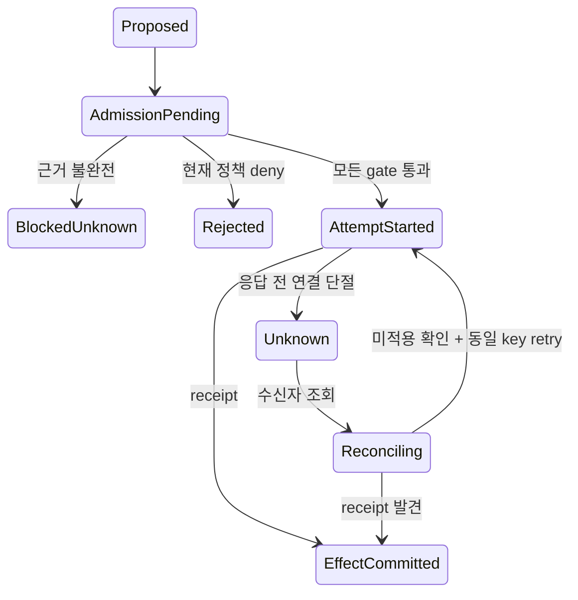
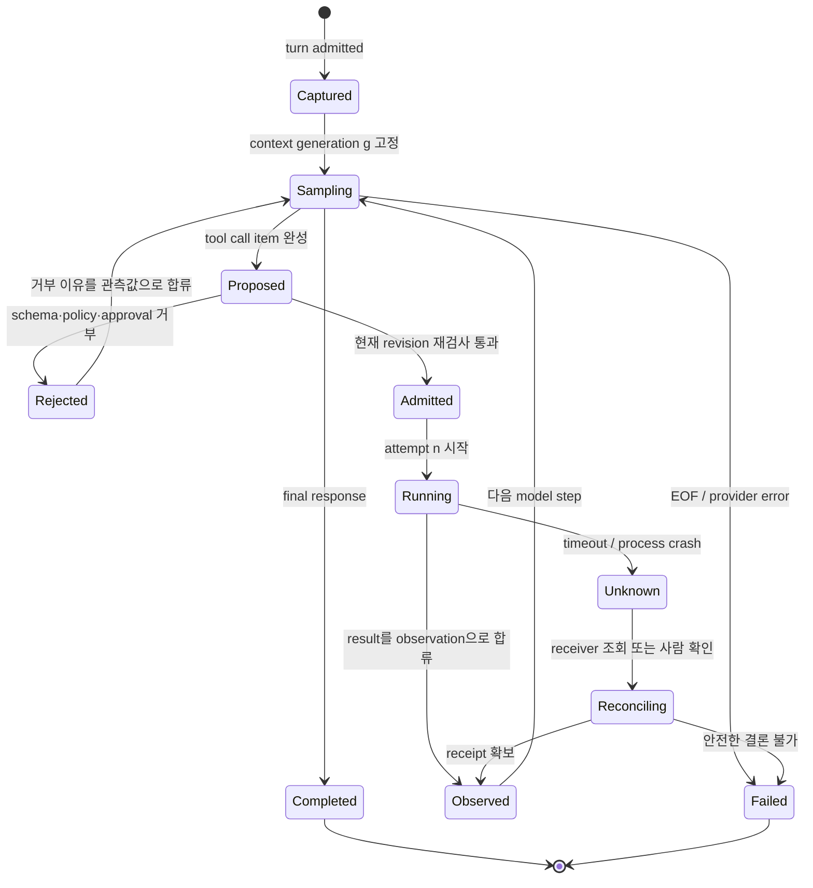

# 2장. ReAct를 상태 기계로 다시 읽기

> 선수 지식: [1장](./01-agent-run.md)의 Run·Turn·logical call·receipt 구분. 이 장을 마치면 ReAct의 각 단계를 재시도와 복구가 가능한 상태 전이로 그릴 수 있다.

## boolean 대신 전이 함수를 둔다

실제 실행에서 `allowed=True`였던 후보가 모두 행동으로 이어지지는 않았다. 두 후보가 초기 권한 검사를 통과했지만 원문 좌표와 해시까지 완전한 것은 하나였고, 그 하나만 실행 갈래의 입력이 됐다. 그래서 ReAct loop의 `Act`는 다음과 같은 전이 함수로 읽는 편이 정확하다.

```python
# 의사 코드: 아래 event class와 예외는 상태 전이를 설명하는 표기다.
def advance(state, event):
    match state, event:
        case "proposed", SchemaValid(): return "admission_pending"
        case "admission_pending", ProofIncomplete(): return "blocked_unknown"
        case "admission_pending", PolicyDenied(): return "rejected"
        case "admission_pending", GatesPassed(): return "attempt_started"
        case "attempt_started", ReceiptSeen(): return "effect_committed"
        case "attempt_started", ConnectionLost(): return "unknown"
        case "unknown", ReceiptSeen(): return "effect_committed"
    raise IllegalTransition(state, event)
```



이 상태 기계는 `Observe`도 둘로 나눈다. 도구가 반환한 텍스트는 다음 모델 단계의 관측이고, receipt는 외부 효과의 사후조건이다. 전자는 후자를 대신하지 않는다.

“생각하고, 행동하고, 관찰한다”는 말은 에이전트의 작동을 기억하기에는 좋다. 그러나 장애를 고치기에는 너무 짧다. 야간에 도구 호출이 두 번 나갔을 때, 혹은 모델의 출력이 중간에서 끊겼을 때, 그 문장은 아무것도 결정해 주지 않는다. 무엇이 이미 실행되었는지, 무엇이 모델의 제안에 그쳤는지, 어느 기록을 믿어야 하는지를 알려 주지 않기 때문이다.

이 장에서는 ReAct를 프롬프트 기법이 아니라 **상태를 바꾸는 제어 루프**로 읽는다. `Reason`은 설명 텍스트가 아니라 다음 전이를 고르는 근거이고, `Act`는 아직 제안이며, `Observe`는 외부 세계가 바뀌었다는 영수증이 아니라 다음 단계에 넣을 관측값이다. 이 셋을 한 덩어리로 취급하는 순간, 재시도·권한·취소·병렬화가 모두 흐려진다.

## 2.1 먼저 실패 장면을 고정한다

에이전트에게 “현재 배포 설정을 읽고, 승인되면 timeout을 30초로 바꾼 뒤 변경 사실을 알려라”라고 시킨다. 첫 모델 응답은 `read_file`과 `write_file`을 제안한다. 읽기 결과가 돌아온 뒤 모델은 새 값을 계산한다. 이때 스트림 연결이 끊긴다. 운영자는 보통 두 가지 중 하나를 성급하게 말한다. “쓰기 전에 끊겼으니 안전하다.” 또는 “도구 호출이 보였으니 이미 바뀌었다.” 둘 다 근거가 없다.

`write_file`이라는 JSON이 모델 출력에 있었는지, 실행기가 이를 admission했는지, handler가 시작했는지, 파일 시스템이 바뀌었는지, 그 결과가 다음 모델 입력에 합류했는지는 서로 다른 사건이다. ReAct의 실제 단위는 다음과 같이 쪼개야 한다.

| 단계 | 상태 변화 | 반드시 남길 식별자 | 이것만으로는 알 수 없는 것 |
|---|---|---|---|
| 제안 | model item → proposed call | response item ID, call ID | 호출이 허용되었는가 |
| 입장 | proposed → admitted/rejected | policy revision, approval decision | handler가 끝났는가 |
| 시도 | admitted → attempt started | attempt number, cancellation epoch | 외부 효과가 commit됐는가 |
| 관측 | output → model-visible observation | observation ID, source call ID | observation이 최신 사실인가 |
| 종료 | active → terminal | terminal reason, durable offset | background 효과가 없는가 |

ReAct 논문은 reasoning trace와 action-observation의 교대를 제안했지만, 그 자체가 transaction protocol은 아니다. 논문에서의 관찰 문자열을 수신자 receipt로 읽으면 안 된다. [ReAct: Synergizing Reasoning and Acting in Language Models](https://arxiv.org/abs/2210.03629)는 이 루프가 추론과 행동을 결합하는 방법임을 보여 주지만, exactly-once 외부 효과를 약속하지 않는다.



그림의 `Unknown`은 구현 결함이 아니다. 요청은 도착했고 응답만 유실됐을 수 있다. `Unknown`을 `Failed`로 바꿔 blind retry하면, ReAct의 한 번의 행동은 두 번의 외부 효과가 될 수 있다.

## 2.2 왜 “생각”도 상태인가

모델의 chain-of-thought를 전부 영속화해야 한다는 뜻은 아니다. 여기서 말하는 상태는 모델이 어떤 선택지를 보았고, 그 선택이 어느 문맥·도구 표면·정책 세대에서 나왔는지를 재현할 수 있는 최소 사실이다. 도구 결과가 새 prompt에 합류하면 다음 행동은 이전 행동과 독립적이지 않다. 따라서 `reason → act → observe`보다 더 유용한 표기는 다음과 같다.

```text
Step(g, input, toolset, policy) -> proposal
proposal + admission(current policy) -> attempt
attempt + receiver/result -> observation
observation + next context generation -> Step(g+1, ...)
```

여기서 가장 흔한 버그는 제안 시점의 권한을 실행 시점까지 들고 가는 것이다. 사용자 승인을 기다리는 동안 대상 브랜치나 정책이 바뀌었다면, 같은 JSON이라도 같은 행동이 아니다. 그래서 effectful tool은 `proposal_generation`, `approval_revision`, `target_revision`을 따로 기록하고 dispatch 직전에 다시 확인해야 한다.

Codex의 고정 공개 리비전에서 `run_turn`은 이전 비동기 hook을 정리하고, 필요 MCP 서버를 확정한 뒤, `StepContext`를 포착하여 모델 요청을 시작한다. 즉 model-visible world는 막연한 대화 전문이 아니라 캡처된 단계 문맥이다. [Codex `run_turn`](https://github.com/openai/codex/blob/0344625ccf4ae0ab6472c6c1e7b4ace6af14661e/codex-rs/core/src/session/turn.rs#L155-L255) 이 구현은 문맥의 owner가 존재함을 보여 준다. 다만 snapshot 뒤에 외부 세계가 변하지 않는다는 보장은 하지 않는다.

## 2.3 도구 호출은 문법이 아니라 입장 절차다

모델이 구조화된 도구 호출을 출력해도 바로 실행하면 안 된다. 적어도 이름, payload 형태, 사용 가능 도구 집합, 사용자·tenant 권한, 승인 범위, 대상 revision, 동시성 제한을 확인해야 한다. 이 단계는 모델 품질을 의심하기 위한 장치가 아니라, 모델이 권한 owner가 아니기 때문에 필요하다.

Codex는 response item을 in-flight future로 넘기기 전에 router에서 `session`, `turn`, `step context`, cancellation token, `call_id`, tool name, payload를 묶은 invocation을 만든다. [Codex tool router](https://github.com/openai/codex/blob/0344625ccf4ae0ab6472c6c1e7b4ace6af14661e/codex-rs/core/src/tools/router.rs#L302-L387) 이어 registry는 알 수 없는 도구·맞지 않는 payload를 거절하고 pre-tool hook을 수행한다. [Codex registry preflight](https://github.com/openai/codex/blob/0344625ccf4ae0ab6472c6c1e7b4ace6af14661e/codex-rs/core/src/tools/registry.rs#L493-L650)

이 두 함수 사이에는 중요한 설계 원칙이 숨어 있다. **schema exposure는 authorization이 아니다.** 모델에게 `delete_branch` schema를 보여 주는 일은 모델이 그 이름을 올바르게 말할 수 있게 할 뿐이다. 실제 실행 권한은 registry와 policy gate가 소유한다. 반대로 policy가 허용해도 schema가 drift하면 모델은 다른 인자를 만들 수 있다. 문법·권한·대상 최신성은 세 개의 독립 gate다.

| gate | owner | 입력 | 거부 시 모델에 보여 줄 것 | 거부 시 절대 하지 말 것 |
|---|---|---|---|---|
| 구조 gate | schema validator | name, JSON args | parse/validation error | 부분 JSON 실행 |
| 권한 gate | policy/approval | principal, scope, action | denial reason의 안전한 요약 | schema 노출을 승인으로 간주 |
| 최신성 gate | target owner | revision, lease/fence | stale-target error | 오래된 승인으로 commit |
| 효과 gate | receiver/ledger | idempotency/effect ID | receipt 또는 unknown | executor exit 0만 믿기 |

## 2.4 실습: 작고도 안전한 ReAct 원장

다음 의사 코드는 모델을 흉내 내는 것이 아니라 state owner를 드러내기 위한 최소 실행기다. `call_id`는 논리 행동을, `attempt`는 재시도를, `effect_id`는 수신자와 합의한 외부 효과를 가리킨다.

```python
# 의사 코드: authorize·record_prepare·observation은 경계의 소유자를 나타낸다.
def dispatch(proposal, state, receiver):
    assert proposal.context_generation == state.generation
    decision = authorize(state.principal, proposal.action, state.policy_revision)
    if not decision.allowed:
        return observation("rejected", proposal.call_id, decision.reason)

    key = f"{state.run_id}:{proposal.call_id}"
    record_prepare(key, state.policy_revision, proposal.target_revision)
    try:
        receipt = receiver.execute_once(key, proposal.payload)
    except TimeoutError:
        return observation("unknown", proposal.call_id, "query receiver before retry")
    record_commit(key, receipt.effect_id)
    return observation("observed", proposal.call_id, receipt.summary)
```

이 코드의 `execute_once`는 receiver가 key를 저장하고 중복을 억제한다는 강한 가정이다. HTTP client가 같은 header를 보낸다는 사실만으로는 성립하지 않는다. Jikji의 remote tool 요청이 `tenant_id`, `run_id`, `call_id`, 선택적 idempotency key를 전달하는 것은 identity를 전달할 재료를 제공한다. [Jikji remote runner](https://github.com/jikji-labs/jikji/blob/d0cb4997e1882f9f5fc28b0b601ddf97317baf43/jikji/pkg/toolnode/remote_runner.go#L91-L100) 그러나 수신자가 어떤 저장소에 어떤 기간 동안 중복 키를 보존하는지는 receiver 구현과 테스트로 별도 확인해야 한다.

## 2.5 관측값은 사실의 등급을 가져야 한다

ReAct에서 `Observation: deployment completed`라는 문자열은 읽기 좋지만 지나치게 강하다. 더 나은 observation은 출처와 한계를 붙인다.

```json
{
  "call_id": "notify-17",
  "attempt": 1,
  "disposition": "unknown",
  "evidence": "client timeout after dispatch",
  "next_action": "receiver status lookup required",
  "model_visible_summary": "알림 전송 결과를 확인하지 못했습니다. 재전송하지 마세요."
}
```

관측 owner와 효과 owner를 나누면 모델은 불확실성을 말할 수 있고, 복구기는 그 불확실성을 실제 절차로 바꿀 수 있다. trace span은 이 사건을 연결하는 데 유용하지만 receipt가 아니다. [W3C Trace Context](https://www.w3.org/TR/2021/REC-trace-context-1-20211123/)와 OpenTelemetry의 agent span 규약은 correlation과 관측 형식을 돕지만, 외부 서비스가 한 번만 반영했음을 증명하지 않는다. [OpenTelemetry GenAI agent spans](https://opentelemetry.io/docs/specs/semconv/gen-ai/gen-ai-agent-spans/)

## 2.6 고장 주입으로 루프의 거짓말을 찾는다

성공 path만 보면 ReAct는 아주 단순하다. 아래 fault matrix를 먼저 통과시켜야 상태 기계가 된다.

| 주입 | 확인할 oracle | 올바른 다음 전이 | 금지된 결론 |
|---|---|---|---|
| tool JSON을 반만 수신 | validator error, handler start 없음 | rejected → next sampling | 파싱 가능한 조각을 실행 |
| approval 대기 중 cancel | dispatch event 없음 | terminal cancelled | 모든 branch가 없었다고 단정 |
| handler 뒤 network timeout | receiver receipt 부재 | unknown → reconcile | 실패이므로 안전한 replay |
| post-tool hook 거부 | handler complete + output blocked | execution과 visibility 분리 | 외부 효과도 rollback |
| stale target revision | revision mismatch | reject/replan | 오래된 proposal commit |
| stream EOF | `response.completed` 전 종료 기록 | retryable error 또는 failed | partial assistant text를 완료로 표시 |

Codex registry의 post-tool hook 주석은 결과 차단이 이미 끝난 tool execution을 되돌리지 않는다고 명시한다. [Codex registry postflight](https://github.com/openai/codex/blob/0344625ccf4ae0ab6472c6c1e7b4ace6af14661e/codex-rs/core/src/tools/registry.rs#L651-L773) 또 cancellation 테스트는 dispatch 전 취소와 handler 완료 뒤 취소를 구분한다. [Codex parallel cancellation tests](https://github.com/openai/codex/blob/0344625ccf4ae0ab6472c6c1e7b4ace6af14661e/codex-rs/core/src/tools/parallel.rs#L419-L675) 이 두 앵커는 cancel이 하나의 상태가 아니라 시점에 따라 다른 의미를 가진다는 직접 근거다.

### 2.6.1 이력 세 장을 손으로 판정하기

같은 logical call ID에 대해 다음 세 이력을 만든다: `proposed → rejected`, `proposed → dispatched → receipt`, `proposed → dispatched → timeout`. 첫째는 새 proposal을 만들 수 있고, 둘째는 receipt를 결과로 합류하며, 셋째는 receiver 조회 전 재시도할 수 없어야 한다. 각 이력에는 attempt와 target revision을 따로 쓴다.

검사는 event 개수가 아니라 전이 순서에 둔다. `dispatch`보다 앞선 receipt, 이전 attempt의 receipt를 새 attempt에 붙이는 일, timeout을 곧바로 실패로 바꾸는 일을 모두 invalid history로 처리한다. 이 작은 판정표가 맞아야 모델의 자연어 observation도 복구기의 다음 행동을 거짓으로 바꾸지 않는다.

## 2.7 복구와 비보장

ReAct loop의 종료는 네 가지를 분리해서 말해야 한다.

| 표기 | 뜻 | 복구 원칙 |
|---|---|---|
| `rejected` | 실행 전 gate가 막음 | 이유를 관측값으로 넣고 재계획 |
| `failed` | 알고 있는 실패, 효과 미시작 또는 명시 실패 | retry policy 범위에서 재시도 가능 |
| `unknown` | 시작·commit 여부를 판정 못 함 | 조회·dedup·사람 승인 전 재시도 금지 |
| `committed` | receipt가 effect identity를 확인 | 모델에 결과 합류, 중복 호출 방지 |

모든 도구를 transaction으로 만들 수는 없다. 이메일 발송, 결제, 티켓 생성, 외부 배포는 보상 작업을 따로 설계해야 한다. compensation은 원래 행동을 없었던 일로 만드는 마법이 아니라, 새로운 권한과 새로운 receipt를 가진 별도 행동이다. cancel도 compensation도 아니라는 문장을 상태 표에 직접 넣어 두는 이유다.

## 2.8 프레임워크 비교: loop의 표면과 책임의 깊이

| 구현 | 공개적으로 확인되는 ReAct 경계 | 여기서 주장하지 않는 것 |
|---|---|---|
| Codex | turn·captured context·stream item·router/registry·cancel test | 모든 remote tool의 exactly-once |
| Jikji | run/call identity를 포함한 remote request 경계 | receiver 저장소와 효과의 원자성 |
| pi-agent | active run·argument validation·abort propagation·ordered reduction | host persistence·외부 rollback |
| ReAct 논문 | reasoning/action/observation의 방법론 | runtime durability protocol |

pi-agent는 길이 제한으로 멈춘 response의 tool call을 실패 처리하여 실행하지 않는 fence를 둔다. [pi-agent truncated tool fence](https://github.com/badlogic/pi-mono/blob/853a80d26c90a14c1886f0ebb8ffaae133ca2185/packages/agent/src/agent-loop.ts#L220-L240) 이는 parse-safe와 execute-safe가 다르다는 좋은 구현 사례다.

## 2.9 현장 체크리스트

1. 이번 `Act`는 proposal, admitted call, attempt, effect 중 어디까지 갔는가?
2. logical call ID와 retry attempt를 다른 필드로 남겼는가?
3. 현재 policy·approval·target revision을 dispatch 직전에 재확인하는가?
4. 결과 문자열이 아닌 receiver receipt로 commit을 판정하는가?
5. timeout을 `unknown`으로 남기고 receiver query가 가능한가?
6. model-visible observation에 출처·시각·불확실성이 들어 있는가?
7. partial JSON, stale proposal, postflight rejection, kill-after-dispatch를 주입했는가?
8. trace ID를 권한·idempotency 키로 재사용하지 않았는가?

## 이 장의 원전 바로가기

1. [ReAct 논문](https://arxiv.org/abs/2210.03629)
2. [Codex turn entry](https://github.com/openai/codex/blob/0344625ccf4ae0ab6472c6c1e7b4ace6af14661e/codex-rs/core/src/session/turn.rs#L155-L255)
3. [Codex router](https://github.com/openai/codex/blob/0344625ccf4ae0ab6472c6c1e7b4ace6af14661e/codex-rs/core/src/tools/router.rs#L302-L387) · [registry](https://github.com/openai/codex/blob/0344625ccf4ae0ab6472c6c1e7b4ace6af14661e/codex-rs/core/src/tools/registry.rs#L493-L773)
4. [Jikji remote request boundary](https://github.com/jikji-labs/jikji/blob/d0cb4997e1882f9f5fc28b0b601ddf97317baf43/jikji/pkg/toolnode/remote_runner.go#L91-L100)
5. [pi-agent loop](https://github.com/badlogic/pi-mono/blob/853a80d26c90a14c1886f0ebb8ffaae133ca2185/packages/agent/src/agent-loop.ts#L220-L310)
