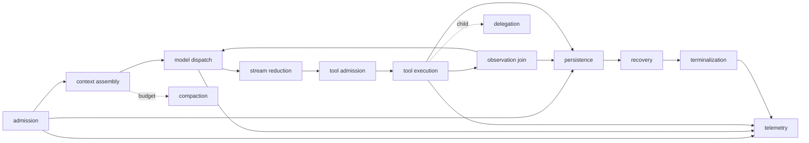
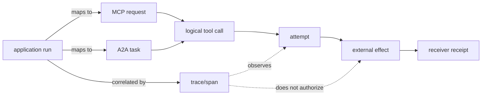

# 3장. 프레임워크의 경계에서 과신을 멈추는 법

에이전트 프레임워크를 비교할 때 가장 위험한 말은 “둘 다 session이 있으니 비슷하다”이다. 같은 이름은 같은 책임을 뜻하지 않는다. 어떤 구현의 `session`은 UI와 모델 요청을 묶는 휘발성 단위일 수 있고, 다른 구현의 `run`은 재개 가능한 journal entry일 수 있다. 공개 문서의 hook은 내부 scheduler의 증거가 아니며, `AbortSignal` 전달은 원격 쓰기의 rollback 영수증이 아니다.

이 장의 목적은 순위를 매기는 데 있지 않다. 한 시스템에서 관찰한 성질을 다른 시스템으로 옮길 때, 어디까지가 직접 근거이고 어디부터가 설계 가설인지 판별하는 법을 익힌다. 이 태도가 있어야 멀티 에이전트 시스템의 조합도 정확해진다.

## 3.1 실패 장면: 이름은 같고 복구는 다르다

두 팀이 각각 “child agent를 취소했다”고 보고한다. A팀은 parent가 child의 cancellation token을 signal했다는 로그를 보여 준다. B팀은 child의 durable checkpoint를 closed로 표시하고 receiver가 fencing token을 거절했다는 receipt를 보여 준다. 둘 다 취소라는 단어를 썼지만, 전자는 실행기 안으로 신호를 전달한 사실이고 후자는 stale writer가 더 이상 commit하지 못한 사실이다.

이 차이를 무시하면 운영자는 A의 UI가 멈춘 것을 보고 외부 효과도 멈췄다고 추론한다. 그 결과는 보통 중복 배포·중복 메일·고아 lease다. 프레임워크 비교는 기능 목록보다 다음 질문에서 시작한다.

| 질문 | 확인할 owner | 필요한 근거 | 이름만 보고 하면 안 되는 추론 |
|---|---|---|---|
| 누가 turn을 시작하는가 | admission loop | 함수와 상태 전이 | `thread`가 durable run이다 |
| 누가 prompt를 조립하는가 | context builder | request builder 코드 | history가 항상 통째로 간다 |
| 누가 도구를 허용하는가 | registry/policy | admission 코드와 test | schema가 보이므로 실행 가능하다 |
| 누가 결과를 순서화하는가 | reducer/join | concurrency code | 병렬 실행이면 결과도 병렬 순서다 |
| 누가 외부 효과를 확인하는가 | receiver/ledger | receipt·idempotency test | tool success log가 commit이다 |
| 누가 재개하는가 | persistence/recovery | checkpoint/journal path | event emission이 persistence다 |

## 3.2 비교를 위한 13개 경계

한 AgentRun을 비교 가능한 단위로 자르려면 admission, context assembly, model dispatch, stream reduction, tool admission, tool execution, observation join, compaction, delegation, persistence, recovery, terminalization, telemetry의 열세 가지를 분리하면 충분하다. 각 행에는 `Implemented`, `HostOwned`, `DocumentationOnly`, `NotObserved` 중 하나만 적는다. 빈칸은 기능이 없다는 뜻이 아니라, 현재 공개 근거로 말할 수 없다는 뜻이다.



이 그림은 모든 구현이 모두 제공한다는 주장도, 동일한 순서로 구현한다는 주장도 아니다. 조사표의 빈칸을 발견하기 위한 체크리스트다. 특히 persistence와 telemetry는 loop 밖의 host가 소유할 수 있다. 그런 경우 `HostOwned`라고 쓰는 편이 “있을 것”이라고 상상하는 것보다 정확하다.

## 3.3 Codex: turn과 step context의 경계

고정 리비전의 Codex에서 `start_or_steer_turn` 계열은 새 turn 시작, 기존 turn으로의 steer, 기록된 turn ID의 recovery를 구분한다. [Codex thread admission](https://github.com/openai/codex/blob/0344625ccf4ae0ab6472c6c1e7b4ace6af14661e/codex-rs/core/src/codex_thread.rs#L342-L430) 이 구현에서 중요한 것은 “사용자 입력”과 “recovery”가 같은 입력 경로가 아니라는 점이다. 복구가 새 user message를 덧붙여서 발생하면 transcript와 causality가 변한다.

`run_turn`은 pre-sampling compaction, MCP requirement, captured `StepContext`, tool build, model stream을 잇는다. [Codex turn entry](https://github.com/openai/codex/blob/0344625ccf4ae0ab6472c6c1e7b4ace6af14661e/codex-rs/core/src/session/turn.rs#L155-L255) tool router와 registry는 proposal을 invocation으로 만들고 validation/hook을 거친다. [Codex router and registry](https://github.com/openai/codex/blob/0344625ccf4ae0ab6472c6c1e7b4ace6af14661e/codex-rs/core/src/tools/router.rs#L302-L387) 이는 admission·context·stream·tool gate에 대한 공개 코드 근거다.

그러나 이 사실에서 일반 원격 도구의 exactly-once, 모든 provider의 cancellation, 외부 API rollback을 결론 내릴 수는 없다. Codex의 event persistence 경로가 turn event를 rollout과 trace 경로로 보내더라도, 수신자 데이터베이스와 한 transaction을 구성한다는 증거는 별개다. [Codex event persistence](https://github.com/openai/codex/blob/0344625ccf4ae0ab6472c6c1e7b4ace6af14661e/codex-rs/core/src/session/mod.rs#L2043-L2145)

## 3.4 pi-agent: loop가 보이는 만큼만 말한다

pi-agent의 공개 TypeScript 구현은 `transform → LLM-message conversion → system/messages/tools → provider stream`이라는 context assembly 경계를 직접 보여 준다. [pi-agent context assembly](https://github.com/badlogic/pi-mono/blob/853a80d26c90a14c1886f0ebb8ffaae133ca2185/packages/agent/src/agent-loop.ts#L279-L310) assistant tool call은 validation과 abort check를 지나며, 병렬 모드에서는 완료 순서가 아니라 원래 tool-call 순서로 result message를 만든다. [pi-agent parallel reducer](https://github.com/badlogic/pi-mono/blob/853a80d26c90a14c1886f0ebb8ffaae133ca2185/packages/agent/src/agent-loop.ts#L487-L552)

이것은 transcript ordering에 대한 직접 근거다. 반면 host가 process를 재시작한 뒤 어떤 실행을 재개하는지, event sink가 어느 저장소에 durability를 갖는지, tool이 외부 API write를 되돌리는지는 loop만 보고 결정할 수 없다. 비교표에서 그런 행은 `HostOwned` 또는 `NotObserved`로 남겨야 한다.

## 3.5 Jikji: 분산 요청 identity는 출발점이다

Jikji의 remote runner는 tenant·run·call ID와 idempotency key를 request에 넣는 경계를 공개한다. [Jikji remote execution request](https://github.com/jikji-labs/jikji/blob/d0cb4997e1882f9f5fc28b0b601ddf97317baf43/jikji/pkg/toolnode/remote_runner.go#L91-L100) 이는 어떤 tenant의 어떤 논리 호출인지 수신자에게 전할 수 있다는 뜻이다. 다만 키의 retention 기간, receiver의 dedup table, 외부 side effect와 journal 간 원자성까지는 request type 하나가 말해 주지 않는다.

이 구분은 분산 시스템에서 특히 중요하다. idempotency key는 메시지에 들어가는 **명사**이고, exactly-once는 sender·receiver·durable state·reconciliation을 포함하는 **프로토콜 성질**이다. 전자를 발견하고 후자를 발표하는 오류를 피해야 한다.

## 3.6 Claude Code: 공개 계약과 내부 구현을 섞지 않는다

Claude Code 공개 저장소에는 settings, hooks, plugins, skills, MCP, subagent의 유용한 구성 표면이 있다. [Claude Code fixed public revision](https://github.com/anthropics/claude-code/tree/f275fa282e76c5e5456912268f2c367a7f4f4797) 그러나 그것은 공개된 문서·설정 계약이다. 문서가 hook event를 설명한다고 해서 제품 내부에서 hook과 scheduler, checkpoint, permission enforcement가 어떤 순서로 실행되는지 알 수 있는 것은 아니다.

이때 “문서에 없으니 없다”도 잘못이고 “제품이 크니 당연히 있을 것”도 잘못이다. 전자는 부재의 보편 명제이고, 후자는 설계 환상이다. 둘 다 피하려면 `DocumentationOnly`라는 등급을 사용한다. 이 표기는 기능의 존재가 아니라, 우리가 인용할 수 있는 근거의 범위를 가리킨다.

## 3.7 실습: framework boundary 카드 만들기

어떤 새 프레임워크라도 소개 문서부터 읽지 말고, 하나의 쓰기 도구를 고른 다음 아래 카드를 채운다. `?`는 실패가 아니라 다음 조사 대상이다.

```yaml
operation: deploy-config
admission_owner: "?"
context_snapshot_owner: "?"
tool_schema_owner: "?"
approval_owner: "?"
logical_call_identity: "?"
attempt_identity: "?"
receiver_receipt: "?"
recovery_owner: "?"
cancel_semantics: "signal-only | receiver-confirmed | ?"
evidence:
  code: pinned URL + lines
  test: pinned URL + oracle
  docs: fixed revision URL
non_guarantees:
  - external rollback
```

카드를 작성한 뒤 “?”가 남은 시스템은 사용할 수 없다는 뜻이 아니다. 다만 그 부분을 host 설계로 메우거나, 운영 절차로 격리하거나, 위험 행동에서 제외해야 한다는 뜻이다. 특히 결제·배포·권한 변경처럼 effectful operation은 `receiver_receipt: ?`인 상태에서 자동 실행시키지 않는 편이 낫다.

## 3.8 고장 주입: 추상화가 새는 위치를 찾는다

| fault | 관측할 것 | framework에 묻는 질문 |
|---|---|---|
| 모델 스트림 EOF | terminal item 전의 event sequence | 다음 turn이 열리는가, partial call이 실행되는가 |
| abort | dispatch 전/후 handler lifecycle | signal인가 실제 receiver stop인가 |
| child 지연 반환 | parent snapshot/version | stale result가 새 state에 merge되는가 |
| tool result reorder | transcript order, call association | completion order와 display order가 분리되는가 |
| host restart | durable checkpoint, retry identity | 누가 resume하며 effect key를 보존하는가 |
| hook reject after execution | handler와 model output | visibility 차단을 rollback으로 오독하지 않는가 |

Codex 공개 테스트는 cancellation이 handler admission 전일 때와 completion 후일 때 다른 lifecycle을 남김을 보여 준다. [Codex cancellation tests](https://github.com/openai/codex/blob/0344625ccf4ae0ab6472c6c1e7b4ace6af14661e/codex-rs/core/src/tools/parallel.rs#L419-L675) pi-agent의 length-stopped call fence는 partial arguments를 실행하지 않는 기준을 보여 준다. [pi-agent length fence](https://github.com/badlogic/pi-mono/blob/853a80d26c90a14c1886f0ebb8ffaae133ca2185/packages/agent/src/agent-loop.ts#L220-L240) 이 두 test/코드 경계 밖의 환경을 일반화하지 않는 것이 비교의 절제다.

## 3.9 비교표: 기능이 아니라 증거를 나란히 놓기

| 축 | Codex 공개 코드 | pi-agent 공개 코드 | Jikji 공개 코드 | Claude Code 공개 저장소 |
|---|---|---|---|---|
| admission | 구현 관찰 가능 | active run loop 관찰 가능 | run loop 조사 가능 | 문서 표면 |
| context assembly | captured step context | transform→provider input | prompt/token 계약 일부 | 문서 표면 |
| tool admission | router/registry | validation/hook | remote dispatch identity | 구성 문서 |
| parallel reduction | in-flight futures 및 test | 원래 호출 순서 reducer | 구현별 확인 필요 | 문서 표면 |
| cancel | token과 lifecycle test | AbortSignal 전달 | 경계별 확인 필요 | 문서 설명 범위 |
| durable recovery | event 경로는 관찰, 외부 효과 별도 | host 소유 | journal/receiver를 별도 확인 | 공개 내부 근거 없음 |

표의 “관찰 가능”은 완전성을 뜻하지 않는다. public implementation을 읽을 수 있다는 말일 뿐이며, 실제 배포 configuration·provider·plugin은 다른 행동을 만들 수 있다.

## 3.10 현장 체크리스트

### 같은 이름을 실제 계약으로 다시 읽기

|표면 이름|Codex·pi·Jikji에서 먼저 찾을 곳|MCP·A2A·관측 계층에서의 뜻|끝내 별도로 확인할 것|
|---|---|---|---|
|run / task|turn admission, agent loop, workflow runner|MCP request ID, A2A `Task.id`|logical call·attempt·effect ID|
|context|prompt builder와 reducer|A2A `context_id`, MCP `_meta`|권한 주체·정책 revision|
|cancel|abort handle 소유자와 join|MCP `notifications/cancelled`, A2A CancelTask|receiver가 commit을 멈췄다는 증거|
|success|terminal reducer|MCP tool result, A2A `COMPLETED`|외부 시스템의 durable receipt|
|trace|event emitter/exporter|OpenTelemetry trace/span|누락 없는 authority ledger|

MCP는 cancellation notification이 이미 끝난 요청 뒤에 도착할 수 있고 receiver가 취소할 수 없는 요청을 무시할 수도 있다고 명시한다. A2A의 `CANCELED`는 Task의 terminal state다. 둘 다 외부 DB 쓰기나 결제의 rollback 계약은 아니다. OpenTelemetry의 trace와 span은 관측을 연결하지만 실행 권한을 부여하지 않는다. 그러므로 프레임워크의 `runId`를 이 세 ID 중 하나에 그대로 복사하는 것보다 명시적인 mapping을 두는 편이 안전하다.



Claude Code의 공개 저장소에는 설정 예제와 hook·통합 표면이 있지만 managed core scheduler의 전체 구현은 공개돼 있지 않다. 따라서 공개 hook에서 본 event 이름으로 내부 queue, checkpoint, cancellation, effect fence를 단정하지 않는다. 이 경우 올바른 표기는 “공개 계약으로 확인”, “core는 판정 불가”다.

1. 같은 용어 대신 같은 state transition을 비교했는가?
2. 코드·테스트·문서의 증거 등급을 분리했는가?
3. event emission과 durable persistence를 구분했는가?
4. cancel signal과 receiver-confirmed stop을 구분했는가?
5. schema exposure, approval, sandbox, receipt를 서로 바꾸어 부르지 않았는가?
6. `HostOwned`와 `NotObserved`를 억지로 구현됨으로 채우지 않았는가?
7. 고정 commit 링크로 함수와 테스트를 다시 열 수 있는가?

## 이 장의 원전 바로가기

1. [Codex thread admission](https://github.com/openai/codex/blob/0344625ccf4ae0ab6472c6c1e7b4ace6af14661e/codex-rs/core/src/codex_thread.rs#L342-L430)
2. [Codex context/tool path](https://github.com/openai/codex/blob/0344625ccf4ae0ab6472c6c1e7b4ace6af14661e/codex-rs/core/src/session/turn.rs#L155-L255)
3. [pi-agent loop and reducer](https://github.com/badlogic/pi-mono/blob/853a80d26c90a14c1886f0ebb8ffaae133ca2185/packages/agent/src/agent-loop.ts#L279-L310)
4. [Jikji remote runner](https://github.com/jikji-labs/jikji/blob/d0cb4997e1882f9f5fc28b0b601ddf97317baf43/jikji/pkg/toolnode/remote_runner.go#L91-L100)
5. [Claude Code public repository](https://github.com/anthropics/claude-code/tree/f275fa282e76c5e5456912268f2c367a7f4f4797)
6. [MCP cancellation 2025-06-18](https://github.com/modelcontextprotocol/modelcontextprotocol/blob/3ff697dcbea0804f3f397b864cfbbaaa10cba71a/docs/specification/2025-06-18/basic/utilities/cancellation.mdx#L7-L49)
7. [A2A Task와 TaskState](https://github.com/a2aproject/A2A/blob/c0f30b35390c59d2cc398a1100823a9115b97a20/specification/a2a.proto#L150-L210)
