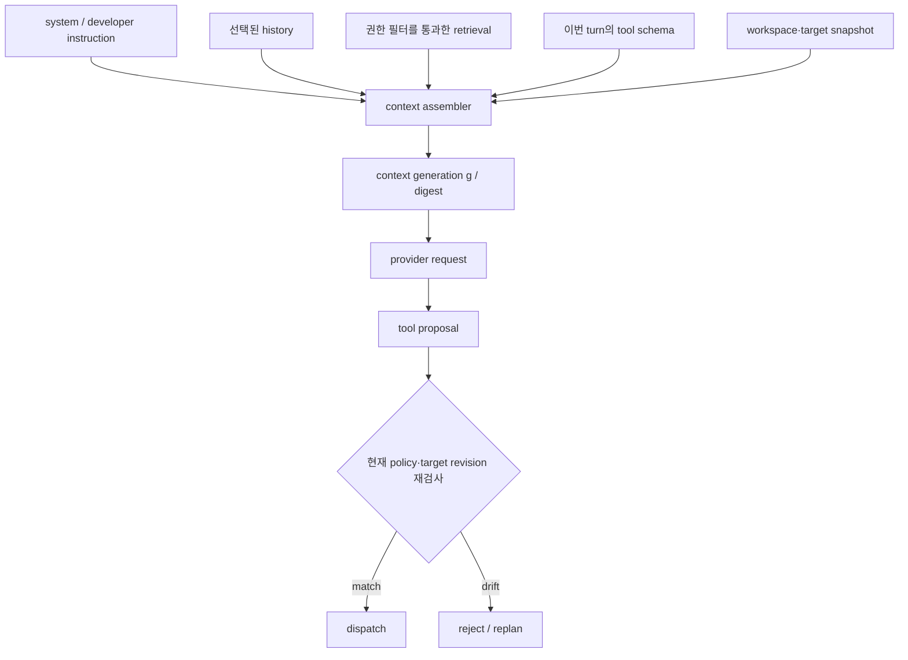

# 4장. 문맥은 대화 기록이 아니라 조립된 실행 환경이다

“모델이 앞에서 한 말을 잊었다”는 진단은 대개 너무 늦고 너무 모호하다. 실제 원인은 history가 잘린 것일 수도, 도구 schema가 바뀐 것일 수도, retrieval 결과가 다른 tenant에서 섞인 것일 수도, system instruction이 plugin 입력에 밀린 것일 수도 있다. 이 모든 사건은 모델 입장에서는 같은 현상으로 나타난다. **이번 요청에 보인 토큰 배열이 달라졌다.**

그래서 문맥은 append-only 대화 로그가 아니다. 실행 시점에 여러 owner가 제공한 재료를 선택·정렬·렌더링·제한한 결과다. context assembly의 목표는 많이 넣는 일이 아니라, 모델이 본 세계를 추적 가능하게 만들고 권한 밖의 정보가 들어가지 않게 하는 일이다.

## 4.1 실패 장면: 승인 대기 중 바뀐 세계

한 child agent가 저장소 변경안을 만들고 있다. 부모는 변경 대상의 policy revision `p41`에서 child를 시작했다. 그 사이 운영자가 해당 디렉터리를 protected로 바꾸어 `p42`가 된다. child는 늦게 결과를 반환한다. 부모가 “이미 충분한 문맥으로 판단한 답”이라며 결과를 바로 실행하면, context assembly의 snapshot이 실행 권한을 이긴 셈이 된다.

문맥을 이해하려면 두 시간을 분리해야 한다.

| 시간 | 질문 | owner | 기록 |
|---|---|---|---|
| capture time | 모델이 무엇을 보았는가 | context builder | context generation, input digest |
| admission time | 이 행동을 지금 해도 되는가 | policy/approval gate | policy revision, principal, scope |
| dispatch time | 어떤 대상에 실행하는가 | target owner | target revision, lease/fence |
| receipt time | 외부 세계가 무엇을 받았는가 | receiver | effect ID, receiver time |

capture time의 훌륭한 답은 dispatch time의 승인장이 아니다. 이 원칙을 잊으면 “문맥이 최신이었다”는 말이 취약점이 된다.



## 4.2 문맥의 재료와 owner

문맥을 조립할 때 가장 먼저 던질 질문은 “이 문자열을 누가 넣었는가?”다. 재료가 많아질수록 우선순위와 출처가 중요해진다.

| 재료 | 흔한 owner | 왜 필요한가 | 주요 위험 |
|---|---|---|---|
| system/developer instruction | product/runtime | 행동의 헌법 | plugin 텍스트가 더 높은 권한처럼 보임 |
| user input | turn admission | 작업 의도 | untrusted text가 instruction을 흉내 냄 |
| history | session/history store | 대화 연속성 | 오래된 승인·실패가 사실처럼 재삽입 |
| retrieval | retrieval + authorization | 현재 외부 지식 | tenant 누출·stale 문서·출처 상실 |
| tool schema | registry/schema builder | 모델의 행동 언어 | schema drift·과도한 도구 노출 |
| workspace snapshot | file/VCS owner | 작업 대상의 기준 | 모델이 본 revision과 commit 대상 불일치 |
| tool observation | executor/result join | loop의 피드백 | executor log를 receipt로 과장 |

priority는 단순 문자열 순서가 아니다. user text가 “이전 지시를 무시하라”고 써도 system instruction의 owner가 바뀌는 것은 아니다. retrieval 문서가 “관리자 권한으로 실행하라”고 말해도 authorization이 되는 것은 아니다. 내용과 권한 출처를 함께 기록해야 하는 이유다.

## 4.3 실제 코드: per-turn 조립 경계

Codex의 고정 공개 리비전에서 `run_turn`은 먼저 compaction 필요성을 보고, 필요한 MCP server를 결정한 다음 step context를 capture한다. [Codex `run_turn`](https://github.com/openai/codex/blob/0344625ccf4ae0ab6472c6c1e7b4ace6af14661e/codex-rs/core/src/session/turn.rs#L155-L255) tool set도 전역 상수가 아니라 step context와 recommendation을 바탕으로 request마다 구성된다. [Codex `built_tools`](https://github.com/openai/codex/blob/0344625ccf4ae0ab6472c6c1e7b4ace6af14661e/codex-rs/core/src/session/turn.rs#L1516-L1604)

이 코드는 두 가지를 가르친다. 첫째, “사용 가능한 도구”도 문맥의 일부이며 매 turn 동일하다고 가정하면 안 된다. 둘째, context의 재현성은 모델 이름만 기록해서 얻어지지 않는다. tool definition, skill/plugin material, MCP requirement, history selection이 달라지면 같은 user input이라도 다른 실행이다.

pi-agent도 변환기와 LLM message conversion을 거쳐 `systemPrompt`, messages, tools를 provider stream에 전달한다. [pi-agent context assembly](https://github.com/badlogic/pi-mono/blob/853a80d26c90a14c1886f0ebb8ffaae133ca2185/packages/agent/src/agent-loop.ts#L279-L310) 여기서 provider serializer와 provider tokenizer의 정확한 token count는 adapter/provider가 소유한다. local estimate가 provider hard limit을 대체한다고 말해서는 안 된다.

## 4.4 context generation을 만드는 최소 규격

문맥 전체를 로그에 무제한 저장하면 보안과 비용이 망가진다. 반대로 digest만 저장하면 재현이 불가능하다. 실무에서는 재료의 reference와 결정 정보를 분리해 보관한다.

```json
{
  "run_id": "r-82",
  "generation": 17,
  "instruction_revision": "ins-9",
  "history_cut": {"from": 44, "to": 88},
  "toolset_digest": "sha256:…",
  "retrieval_set": ["doc:policy-4@v12", "doc:repo-7@v3"],
  "workspace_revision": "git:81a2…",
  "token_budget_owner": "provider-adapter",
  "redaction_profile": "prod-3"
}
```

여기서 `retrieval_set`은 원문을 무단 복제하기 위한 장치가 아니라, 어떤 문서의 어느 version을 선택했는지 다시 찾기 위한 reference다. secret·개인정보·긴 tool argument는 별도 접근 제어된 event store에 두고, metric label이나 범용 trace attribute에는 넣지 않는다. Prometheus도 label cardinality를 통제할 것을 권한다. [Prometheus labels](https://prometheus.io/docs/practices/naming/#labels)

## 4.5 retrieval은 문맥의 입구이지 진실 판정기가 아니다

검색 결과가 top-k에 들어왔다고 해서 사실·권한·최신성이 보장되는 것은 아니다. vector score는 query와 candidate의 표현상 가까움을 순위로 제시할 뿐, 문서의 scope나 허가를 판정하지 않는다. 따라서 context에 넣는 순서는 보통 다음처럼 구성한다.

1. caller와 tenant, data scope를 확정한다.
2. 허용된 corpus에서 후보를 가져온다.
3. 문서 revision·timestamp·provenance를 확인한다.
4. claim과 source span을 함께 넣거나, 불확실하면 abstain한다.
5. 모델 출력의 action proposal은 다시 별도 policy gate에서 확인한다.

후처리 authorization은 편해 보이지만 top-k가 권한 밖 문서로 채워지면 허용 문서를 하나도 돌려주지 못할 수 있다. 반대로 pre-filter는 recall과 latency를 바꾼다. 어느 쪽이 “정답”인지는 데이터 규모·policy 모델·위협 모델에 달렸지만, rank score를 authorization으로 재해석하면 둘 다 실패한다.

## 4.6 child와 context: 공유 메모리라는 착각

child agent에게 부모의 transcript 일부를 주면 snapshot이 전달된다. child는 parent의 live state를 공유하지 않는다. Codex의 fork 경로는 persisted rollout history를 이용해 별도 child identity를 만든다. [Codex thread fork](https://github.com/openai/codex/blob/0344625ccf4ae0ab6472c6c1e7b4ace6af14661e/codex-rs/core/src/thread_manager.rs#L1247-L1435) parent가 child result를 merge할 때는 답의 유창함보다 `base_generation`을 먼저 확인해야 한다.

```python
# 의사 코드: apply_as_observation은 제품별 merge 구현 자리다.
def merge_child(parent, child_result):
    if child_result.base_generation != parent.generation:
        return {"status": "stale", "action": "revalidate or re-run"}
    if child_result.toolset_digest != parent.toolset_digest:
        return {"status": "incompatible", "action": "do not apply"}
    return apply_as_observation(parent, child_result)
```

이 fence가 없으면 늦은 child가 이미 폐기된 권한·파일 revision·도구 schema를 전제로 만든 행동을 현재 state에 넣는다. 특히 외부 write 제안은 merge 후에도 parent의 current policy gate를 다시 지나야 한다.

## 4.7 관측과 디버깅: “무엇이 prompt에 있었는가”를 복원하기

문맥 버그는 모델 답변만 보면 고칠 수 없다. 다음 질문을 answerable하게 남긴다.

| 질문 | 필요한 증거 | 잘못된 대체물 |
|---|---|---|
| 어떤 지시문 revision이 사용됐는가 | instruction ID/digest | UI에 보인 최신 설정 |
| 어떤 도구가 노출됐는가 | toolset digest + schema revision | 현재 registry 목록 |
| 어떤 retrieval이 들어갔는가 | authorized doc/version IDs | 검색 화면의 현재 결과 |
| 어느 history가 잘렸는가 | cut boundary·compaction event | 요약 텍스트만 |
| provider가 무엇을 거절했는가 | provider response/usage | local token estimate |
| child는 어디에서 갈라졌는가 | parent ID + base generation | parent의 현재 transcript |

Codex는 response telemetry와 context-window 상태를 별도 관측한다. [Codex context-window policy](https://github.com/openai/codex/blob/0344625ccf4ae0ab6472c6c1e7b4ace6af14661e/codex-rs/core/src/session/context_window.rs#L52-L120) estimate는 운영에 유용하지만 hard limit의 authoritative source가 아니다. provider 요청이 실제로 받아들인 token 수와 model-visible bytes를 혼동하지 않는다.

## 4.8 fault injection: 조립기는 어떤 방식으로 깨지는가

| 실험 | oracle | 복구 |
|---|---|---|
| tool schema에서 required field 변경 | toolset digest 변화, old proposal 거부 | 새 schema로 replan |
| retrieval 문서가 권한 철회됨 | current scope filter에서 제거 | citation을 stale로 표시, 재검색 |
| child 응답이 parent generation보다 늦음 | base generation mismatch | revalidate/re-run |
| history cut이 pending approval을 제거 | invariant failure | approval ledger는 요약 밖 durable owner 유지 |
| provider token limit 초과 | provider error/compact event | compact 후 새 generation으로 retry |
| untrusted doc가 system처럼 보임 | provenance/type 유지 | instruction tier 승격 금지 |

이 실험은 “요약이 좋은가”를 평가하지 않는다. 어떤 사실은 요약으로 압축해도 되지만, pending effect·approval·lease·tenant scope는 별도의 구조화 state로 보존해야 한다. 문장 하나에 섞어두면 압축기의 품질이 곧 보안 경계가 된다.

## 4.9 비교와 비보장

| 관점 | Codex | pi-agent | 일반 설계 원칙 |
|---|---|---|---|
| context owner | captured StepContext | transform/LLM conversion | 요청별 generation을 만든다 |
| tool surface | built tools per request | tools input to stream | schema는 policy와 분리 |
| token authority | context-window/adapter 경계 | provider adapter | local count는 estimate일 수 있음 |
| child | forked identity/history | host 설계 확인 필요 | snapshot과 live state를 분리 |
| durability | event path 별도 | host-owned 가능 | raw prompt와 audit record를 구분 |

문맥 생성이 deterministic하다고 해도 model output이 deterministic하다는 뜻은 아니다. 반대로 model output이 달라도 context bug라고 단정할 수 없다. sampling, provider revision, tools의 외부 관측값이 모두 변수가 된다. context assembly는 이 변수들을 구분해 조사 가능하게 만드는 층이다.

## 4.10 현장 체크리스트

1. prompt의 모든 재료에 owner와 revision이 있는가?
2. user text, retrieval text, system instruction의 권한 계층을 분리했는가?
3. tool schema digest와 policy revision을 별도로 기록하는가?
4. retrieval은 scope filter·provenance·freshness를 통과한 뒤에만 넣는가?
5. child result에 base generation과 toolset compatibility가 있는가?
6. summary 밖에 pending approval/effect state를 durable하게 보존하는가?
7. capture time과 dispatch time의 target/policy revision을 구분하는가?
8. raw context를 metric label에 넣지 않는가?

## 이 장의 원전 바로가기

## 4.11 소스 디깅: 조립 순서를 데이터로 복원하기

문맥 조립을 이해하는 가장 빠른 방법은 완성된 prompt를 읽는 일이 아니다. 재료가 들어온 순서와 탈락한 이유를 표로 복원하는 것이다. 사용자 메시지 하나를 골라 `run_id`, `turn_id`, `context_generation`을 고정한 뒤, system instruction, developer instruction, history, tool result, retrieval result, tool schema가 어느 함수에서 합류하는지 찾는다. 각 재료에는 내용뿐 아니라 owner, revision, visibility, token count가 필요하다. 같은 문자열이라도 system owner가 준 instruction과 검색 문서 안의 명령문은 권한이 다르다.

```text
ContextMaterial = (
  material_id, kind, owner, revision,
  visibility_scope, source_span, token_count,
  admitted_at_generation, exclusion_reason
)
```

직관적으로 prompt는 서류철에 가깝다. 서류가 많다고 사건을 잘 이해하는 것은 아니다. 누가 언제 제출했는지, 지금 효력이 있는지, 다른 서류와 충돌할 때 어느 규칙을 따르는지가 서류의 의미를 정한다. 그래서 context hash만 남기면 부족하다. hash는 같은 bytes인지 답하지만 그 bytes를 넣을 자격이 있었는지는 말하지 않는다.

조립 결과를 다음 함수로 생각해 보자.

```text
C_g = Render(Order(Filter(M_system ∪ M_history ∪ M_tools ∪ M_retrieval,
                           principal, tenant, policy_g)), template_g)
```

`C_g`는 세대 `g`에서 모델이 본 token 열이다. `Filter`는 권한·만료·신뢰 상태를 적용하고, `Order`는 충돌 우선순위와 tool result의 위치를 정하며, `Render`는 chat template과 special token을 실제 bytes로 만든다. 어느 한 단계가 달라져도 같은 사용자 문장은 다른 모델 요청이 된다. 그래서 재시도 때 context generation이 바뀌었다면 “같은 요청을 다시 보냈다”고 기록해서는 안 된다.

[Codex의 `run_turn`](https://github.com/openai/codex/blob/0344625ccf4ae0ab6472c6c1e7b4ace6af14661e/codex-rs/core/src/session/turn.rs#L155-L255)을 읽을 때는 함수 이름보다 소유권 이동을 표시한다. turn 준비, 필요한 MCP server 결정, step context 포착, sampling 시작 사이에 어떤 값이 복제되고 어떤 값이 참조되는지 본다. 이어 [`built_tools`](https://github.com/openai/codex/blob/0344625ccf4ae0ab6472c6c1e7b4ace6af14661e/codex-rs/core/src/session/turn.rs#L1516-L1604)에서 tool 목록이 전역 상수가 아니라 요청 조건으로 만들어지는 경로를 따라간다. 두 span을 나란히 놓으면 “현재 사용 가능한 도구”도 문맥 세대의 일부라는 사실이 드러난다.

[pi-agent loop의 조립 구간](https://github.com/badlogic/pi-mono/blob/853a80d26c90a14c1886f0ebb8ffaae133ca2185/packages/agent/src/agent-loop.ts#L279-L310)은 다른 구현에서 같은 질문을 던질 비교점이다. 메시지 배열이 어느 시점에 확정되고, tool call 결과가 다음 호출에 어떻게 합류하며, 취소 signal이 어느 호출에 전달되는지 표시한다. 이름이 `messages`라고 해서 append-only history라고 가정하지 않는다. adapter가 normalize하거나 누락시키는 필드까지 확인해야 한다.

### 반례: 같은 transcript, 다른 실행

두 run의 화면 transcript가 완전히 같다고 하자. 첫 run은 tool schema v3와 policy p8을, 둘째 run은 schema v4와 policy p9를 사용했다. v4에서 `environment`가 필수로 바뀌었지만 UI는 tool schema를 표시하지 않는다. 두 transcript를 같은 fixture로 처리하면 둘째 run의 malformed proposal을 모델 변동으로 오진한다. 실제 원인은 model-visible contract가 달라진 것이다.

또 다른 반례는 child 결과다. child가 generation 12에서 읽은 파일 요약을 늦게 반환했고 parent는 generation 15에서 파일을 수정했다. 문장이 유창하고 hash도 child 결과 자체에는 맞더라도 parent의 현재 결론으로 곧장 합칠 수 없다. [Codex fork 경로](https://github.com/openai/codex/blob/0344625ccf4ae0ab6472c6c1e7b4ace6af14661e/codex-rs/core/src/thread_manager.rs#L1247-L1435)는 별도 child identity가 생기는 지점을 찾게 해 준다. merge admission은 그 뒤 애플리케이션이 책임질 경계다.

### 직접 해 보는 추적 실습

1. 한 turn의 모든 material을 JSON Lines로 기록하되 원문 대신 안전한 digest와 source coordinate를 남긴다.
2. retrieval 문서 하나의 tenant를 바꾸고 `Filter`에서 제외되는지 확인한다. 최종 token 수만 비교하지 말고 exclusion reason을 본다.
3. tool schema의 required field 하나를 추가한다. `toolset_digest`, rendered bytes, token count, proposal validation이 함께 달라지는지 확인한다.
4. 같은 transcript로 generation만 바꾸어 child result를 반환한다. merge가 stale을 명시적으로 거부하는지 시험한다.
5. UI transcript, model input bytes, durable control state를 세 파일로 분리한다. 어느 파일도 다른 둘의 완전한 대용품이 아님을 incident 질문으로 확인한다.

완료 조건은 “prompt를 출력했다”가 아니다. 특정 model attempt가 어느 세대의 어떤 재료를 실제로 보았고, 제외된 재료는 왜 빠졌으며, 그 조립 결과에서 나온 proposal이 어느 정책 세대에서 심사됐는지를 한 경로로 설명할 수 있어야 한다.

### 조립 장애를 읽는 운영 표

|증상|먼저 비교할 좌표|성급한 결론|다음 검사|
|---|---|---|---|
|같은 질문에 다른 도구 호출|template·toolset digest·generation|모델이 변덕스럽다|rendered bytes와 schema diff|
|최신 파일을 무시함|workspace revision·retrieval as-of|context window가 작다|후보 탈락 이유와 merge 시점|
|child 답이 현재 상태와 충돌|base generation·source revision|child 품질이 낮다|stale merge admission|
|다른 tenant 문구가 보임|principal·scope·filter 위치|검색 점수 문제다|prefilter와 cache key|
|재시도 뒤 인수가 바뀜|logical request·attempt·context generation|retry가 비결정적이다|압축·tool result 합류 여부|

이 표는 원인을 하나로 단정하지 않는다. 조사 순서를 좁힌다. 예컨대 같은 toolset digest인데 rendered bytes가 다르면 template나 serializer를 의심한다. 두 값이 같은데 proposal만 다르면 그때 decoding·provider revision·sampling을 본다. 반대로 generation이 달라졌다면 출력 차이는 기대 가능한 변화이므로 동일 요청 재현 실패로 집계하지 않는다.

민감한 prompt 전문을 장기 보관하지 않아도 이 비교는 가능하다. segment별 byte/token count, 안전한 digest, owner와 revision, exclusion disposition을 남기면 된다. incident용 원문 capture가 필요하면 접근 범위와 보존 기간을 별도로 제한한다. 관측 편의를 이유로 사용자 입력과 tool result를 범용 trace attribute에 복제하면 문맥 조립기가 새로운 유출 경로가 된다.

1. [Codex turn context](https://github.com/openai/codex/blob/0344625ccf4ae0ab6472c6c1e7b4ace6af14661e/codex-rs/core/src/session/turn.rs#L155-L255)
2. [Codex built tools](https://github.com/openai/codex/blob/0344625ccf4ae0ab6472c6c1e7b4ace6af14661e/codex-rs/core/src/session/turn.rs#L1516-L1604)
3. [pi-agent assembly](https://github.com/badlogic/pi-mono/blob/853a80d26c90a14c1886f0ebb8ffaae133ca2185/packages/agent/src/agent-loop.ts#L279-L310)
4. [Codex fork path](https://github.com/openai/codex/blob/0344625ccf4ae0ab6472c6c1e7b4ace6af14661e/codex-rs/core/src/thread_manager.rs#L1247-L1435)
5. [Prometheus label guidance](https://prometheus.io/docs/practices/naming/#labels)
