# 5장. 토크나이저·채팅 템플릿·도구 스키마: 모델이 실제로 읽는 계약

> 선수 지식: [4장](./04-context-assembly.md)의 context generation. 여기서는 조립된 객체가 문자열·토큰·도구 제안으로 바뀌는 경계와, 유효한 JSON이 곧 실행 허가가 아닌 이유를 추적한다.

도구 호출 실패를 “모델이 JSON을 못 만들었다”로 끝내면 중요한 절반을 놓친다. 모델은 JSON Schema를 직접 읽는 것이 아니라, 채팅 템플릿이 렌더한 문자열 또는 provider가 직렬화한 wire format을 토큰으로 읽는다. 같은 대화와 같은 Python dict라도 tokenizer revision, chat template, special token 정책, tool description, truncation 위치가 달라지면 모델의 입력은 달라진다.

이 장은 tokenization을 부수적인 전처리로 보지 않는다. 에이전트에서 tokenizer와 schema renderer는 **권한을 부여하지는 않지만 행동 언어를 정의하는 컴파일러 경계**다. 이 경계를 모르면 “도구가 보였는데 왜 호출하지 않았지?”, “학습 때는 되던 JSON이 서빙에서 왜 깨지지?”, “token budget이 남았는데 provider가 왜 거절했지?” 같은 질문에 답할 수 없다.

## 5.1 실패 장면: 같은 스키마가 다른 프로그램이 된다

다음 도구를 생각하자.

```json
{
  "name": "deploy",
  "description": "승인된 revision만 배포한다.",
  "parameters": {
    "type": "object",
    "properties": {"revision": {"type": "string"}},
    "required": ["revision"],
    "additionalProperties": false
  }
}
```

개발 환경에서는 template A가 이 schema를 `<tool>…</tool>` 구문으로 넣었다. 운영 환경에서는 template B가 description을 생략하고 `revision`을 optional처럼 보이게 렌더했다. 모델은 같은 “deploy”를 아는 것처럼 보이지만 실제 token sequence는 다르다. 더 나쁜 경우, model output이 `{"revision":"abc"}`에서 길이 제한으로 끊겼는데 parser가 관대하게 복구하고 실행기가 그 값을 dispatch한다. 이것은 언어 모델의 환각이 아니라 parser·renderer·executor 사이의 계약 위반이다.

| 층 | 입력 | 출력 | owner | 대표 실패 |
|---|---|---|---|---|
| schema normalization | callable/dict | canonical tool schema | framework adapter | required/description drift |
| template rendering | roles, tools, docs | text/wire representation | tokenizer/template owner | role marker·escaping 오류 |
| tokenization | rendered input | input IDs, masks | tokenizer/provider adapter | special token 중복·count 불일치 |
| generation parsing | output IDs/text | proposed call | output parser | partial JSON accepted |
| tool admission | proposed call | admitted/rejected | registry/policy | schema를 authority로 오독 |
| execution | admitted call | observation/effect | executor/receiver | parser success를 commit으로 오독 |

## 5.2 왜 토큰화가 에이전트 안전과 연결되는가

tokenizer는 문자열을 정수열로 바꾼다. 하지만 chat template은 단순 join이 아니다. role boundary, generation prompt, tool schema, special token을 어디에 넣는지 정한다. 모델은 “사용자 메시지”라는 추상 객체가 아니라 그 결과 token sequence를 본다. tokenization 경계는 세 가지 이유로 운영 문제가 된다.

1. **의미 경계**: assistant turn과 tool result turn의 marker가 달라지면 모델이 누가 말했는지 다르게 읽는다.
2. **예산 경계**: text character 수가 아니라 provider가 계산한 token 수가 context limit을 결정한다.
3. **검증 경계**: model output이 구조처럼 보여도 완전성·schema·권한 검사를 통과하기 전에는 proposal이다.

```mermaid
flowchart LR
  A[roles + messages + tools] --> B[schema normalize]
  B --> C[chat template render]
  C --> D[tokenizer / provider serializer]
  D --> E[input IDs + generation boundary]
  E --> F[model output IDs]
  F --> G[complete call parser]
  G --> H[schema validator]
  H --> I[policy / approval gate]
  I --> J[tool attempt]
  J --> K[receiver receipt]
```



그림에서 schema validator 앞의 모든 단계는 실행 허가가 아니다. tokenizer가 `deploy`라는 token을 잘 만들었다고 policy가 통과되는 것은 아니며, parser가 JSON을 만들었다고 receiver가 effect를 commit한 것도 아니다.

## 5.3 실제 구현: Transformers의 템플릿 경계

Hugging Face Transformers의 고정 리비전에서 `apply_chat_template` 경로는 role/message와 tool을 Jinja chat template으로 렌더한 뒤 tokenizer를 호출한다. 이때 이미 템플릿이 special token을 넣었다면 tokenization에서 중복으로 넣지 않도록 처리한다. [Transformers chat template tokenization](https://github.com/huggingface/transformers/blob/4da05482135896a529d5536c3c003102d36528a2/src/transformers/tokenization_utils_base.py#L2989-L3131)

도구는 callable 또는 dict를 JSON Schema 형태로 바꾸고 template render에 전달된다. [Transformers tool-schema rendering](https://github.com/huggingface/transformers/blob/4da05482135896a529d5536c3c003102d36528a2/src/transformers/utils/chat_template_utils.py#L498-L587)

이 코드가 직접 보여 주는 것은 role/tool/schema가 renderer를 거쳐 tokenization에 들어간다는 사실이다. 모든 provider wire format이 동일하다거나, 이 renderer가 authorization을 수행한다는 뜻은 아니다. 특히 callable에서 생성한 schema는 description과 type hint의 해석을 포함하므로, dependency revision이 바뀌면 model-visible bytes가 바뀔 수 있다.

assistant mask도 교육과 디버깅에서 중요하다. generation character span을 token mask로 옮기는 코드에는 truncation 경계가 있다. [Transformers assistant mask and truncation](https://github.com/huggingface/transformers/blob/4da05482135896a529d5536c3c003102d36528a2/src/transformers/tokenization_utils_base.py#L3132-L3157) 학습에서 이 mask가 달라지면 어느 token에 loss를 주는지가 달라진다. 에이전트 실행에서는 같은 경계가 “모델에게 무엇을 새 assistant generation으로 시작하라고 보였는가”와 연결된다.

## 5.4 schema는 API 문서가 아니라 변화하는 입력이다

tool schema에 다음 중 하나만 바뀌어도 model-visible input은 달라질 수 있다.

| 변경 | 모델 행동에 미치는 가능성 | 실행기에서 별도 확인할 것 |
|---|---|---|
| `required` 추가 | 모델이 누락 필드를 채우려 함 | validator가 실제 required를 강제하는가 |
| description 수정 | action 선택 확률 변화 | description을 권한 설명으로 쓰지 않는가 |
| enum 축소 | 유효 action space 감소 | stale proposal을 다시 검증하는가 |
| tool 제거 | model이 이전 대화의 이름을 다시 낼 수 있음 | unknown tool이 안전하게 거부되는가 |
| template revision 변경 | role/token boundary 변화 | digest가 context generation에 남는가 |
| tokenizer revision 변경 | IDs·length·special token 변화 | provider count와 local count를 구분하는가 |

따라서 생산 시스템에서는 schema를 runtime configuration으로 다룬다. `toolset_digest`, template revision, tokenizer ID, renderer version을 context generation에 포함한다. 모델 output만 저장하면 “왜 이번엔 인자 이름이 달랐는지”를 나중에 재현할 수 없다.

## 5.5 실습: schema/template drift를 검출하는 contract test

아래 테스트는 특정 tokenizer에 의존하지 않고, 무엇을 비교해야 하는지 보여 준다. production에서는 raw prompt를 무단 저장하지 말고 권한 있는 artifact store에 접근 통제를 둔다.

```python
# 의사 코드: render_tools·deploy_schema·build_context·validate는 예시 fixture다.
def test_tool_contract_changes_are_visible():
    schema_v1 = render_tools([deploy_schema(required=["revision"])])
    schema_v2 = render_tools([deploy_schema(required=["revision", "environment"])])
    assert sha256(schema_v1).hexdigest() != sha256(schema_v2).hexdigest()

    ctx1 = build_context(template="v4", tools=schema_v1)
    ctx2 = build_context(template="v4", tools=schema_v2)
    assert ctx1.toolset_digest != ctx2.toolset_digest
    assert validate({"revision": "a"}, schema_v2).is_error
```

이 test는 renderer와 validator가 서로 다른 schema revision을 구별함을 보여 준다. 모델이 반드시 올바른 인자를 낸다는 것도, 바뀐 schema가 좋은 UX라는 것도 아니다. 다음에는 old generation에서 나온 proposal을 current toolset에 dispatch하려 할 때 mismatch가 거부되는 fault test가 필요하다.

## 5.6 partial JSON은 valid-looking과 executable의 차이다

스트리밍 시스템은 token을 조각으로 받는다. `{"path":"prod`처럼 보이는 문자열은 UI에 표시할 수 있지만 execution에 넘겨서는 안 된다. 다음 fence를 분리한다.

```text
stream delta -> complete response item?
  no  -> display as partial only
  yes -> JSON parse?
          no  -> structured error observation
          yes -> schema valid?
                  no  -> rejected observation
                  yes -> current policy / target checks
```

pi-agent는 response가 length reason으로 중단되어 tool call이 불완전할 수 있는 경우, parse 가능한 것처럼 보여도 error result로 처리하여 실행하지 않는 경계를 둔다. [pi-agent truncated-call fence](https://github.com/badlogic/pi-mono/blob/853a80d26c90a14c1886f0ebb8ffaae133ca2185/packages/agent/src/agent-loop.ts#L220-L240) 이 코드는 “JSON parser를 통과했다”보다 “protocol상 complete assistant action인가”가 강한 조건임을 보여 준다.

## 5.7 token budget: 숫자는 하나가 아니다

`input tokens = 12,000`이라는 수치를 봐도 무엇을 뜻하는지 물어야 한다. local history-based estimate, renderer의 token length, provider returned usage, model context hard limit은 서로 다를 수 있다.

| 숫자 | owner | 좋은 용도 | 나쁜 용도 |
|---|---|---|---|
| local estimate | client/history | compaction의 사전 경보 | provider hard limit 판정 |
| tokenizer IDs 길이 | local tokenizer | 같은 revision의 regression | 다른 provider 청구 예측 |
| provider usage | provider response | 비용·실제 요청 관측 | 숨은 server-side context 설명 |
| configured context window | model configuration | 최대 예산 계획 | 실제 현재 사용량 추정 |

Codex는 active usage, compact scope, full-window limit과 history 기반 estimate를 분리한다. [Codex context-window policy](https://github.com/openai/codex/blob/0344625ccf4ae0ab6472c6c1e7b4ace6af14661e/codex-rs/core/src/session/context_window.rs#L52-L120) 이 설계에서 얻을 교훈은 정확한 숫자 하나를 숭배하지 말라는 것이다. estimate는 telemetry이고, authoritative rejection은 provider 또는 hard-limit owner가 남긴 event에서 온다.

## 5.8 관측과 보안

tool description에는 종종 내부 URL·테이블 이름·권한 힌트가 들어간다. prompt dump를 telemetry에 넣으면 디버깅은 쉬워 보이지만 데이터 경계가 사라진다. 반대로 아무것도 기록하지 않으면 template drift를 재현할 수 없다. 해법은 전부 저장/전부 삭제의 양자택일이 아니다.

| 기록층 | 저장할 것 | 피할 것 |
|---|---|---|
| metric | bounded tool kind, validation outcome, token bucket | raw args, run ID, prompt |
| trace | context generation, schema digest, decision code | secret, full user document |
| audit artifact | 접근 제어된 rendered artifact/reference | 무기한 공개 로그 |
| receiver ledger | effect ID, idempotency key, disposition | model reasoning 원문 |

Prometheus는 high-cardinality label을 피하라고 권고한다. [Prometheus labels](https://prometheus.io/docs/practices/naming/#labels) 이 권고는 비용만의 문제가 아니다. prompt나 tool arg를 label로 쓰면 민감 정보가 metrics backend 전체로 복제된다.

## 5.9 fault injection과 복구

| 주입 | oracle | 복구/차단 |
|---|---|---|
| template revision 변경 | rendered digest 변화 | 새 generation, old proposal 재검증 |
| tokenizer special token 중복 | IDs regression 실패 | tokenizer 호출 옵션 수정 |
| required field drift | validator rejection | 모델에 structured error, replan |
| truncated tool call | terminal item 없음/length reason | 실행 금지, 새 model attempt |
| provider count 불일치 | provider usage와 local estimate 분리 기록 | hard-limit owner의 결과를 따름 |
| schema에 없는 도구명 | registry rejection | unknown call을 실행하지 않음 |

주의할 비보장은 분명하다. schema validation은 business authorization이 아니고, JSON Schema는 receiver의 side effect atomicity가 아니며, token count는 semantic correctness가 아니다. 각 층의 성공을 다음 층의 성공으로 승격하지 않는다.

## 5.10 현장 체크리스트

1. tokenizer, chat template, tool schema의 revision/digest를 남기는가?
2. template이 special token을 넣는지 tokenizer 옵션과 함께 테스트했는가?
3. callable→schema 변환과 wire serializer의 owner를 구분했는가?
4. partial/length-stopped call을 어떤 조건에서도 dispatch하지 않는가?
5. schema validation, authorization, receiver receipt를 세 gate로 분리했는가?
6. provider usage와 local token estimate를 다른 metric으로 기록하는가?
7. raw tool args·prompt를 bounded metric label에 넣지 않는가?
8. old toolset generation의 proposal이 새 schema에 실행되지 않는가?

## 이 장의 원전 바로가기

## 5.11 소스 디깅: 문자열이 token과 도구 계약이 되는 순간

토크나이저를 단어 분리기로만 보면 chat template과 tool schema가 왜 실행 결과를 바꾸는지 놓친다. 모델이 받는 것은 role 객체나 Python dict가 아니라 special token을 포함한 정수열이다. 직렬화 함수가 공백 하나, role marker 하나, JSON property 순서 하나를 바꾸면 token 경계와 길이가 달라진다. 길이가 달라지면 truncation 위치가 움직이고, 잘린 위치가 tool call JSON 한가운데라면 문법과 실행 가능성도 함께 바뀐다.

```text
messages + tools
  ──ApplyChatTemplate──> rendered text
  ──Normalize/PreTokenize──> pieces
  ──Encode──> input_ids, attention_mask
  ──Truncate/Pad──> model request tensors
```

문자열 `"environment":"prod"`가 한 token인지 여러 token인지는 vocabulary와 normalization에 달렸다. 그러나 더 중요한 질문은 그 필드가 schema에서 required인지, template가 schema를 어느 role에 어떤 escaping으로 넣었는지다. token count 식은 다음처럼 분해할 수 있다.

```text
N_total = N_special + N_instruction + N_history
        + N_tool_schema + N_tool_results + N_generation_prefix
```

예산 `B`를 넘으면 어느 항을 줄일지 owner가 정해야 한다. 마지막 `B`개 token만 남기는 방식은 system instruction을 살리고 tool result를 자를 수도, 반대로 오래된 tool result 때문에 최신 사용자 질문을 자를 수도 있다. 따라서 truncation은 배열 slice가 아니라 semantic segment policy다.

[Transformers의 `apply_chat_template` 경로](https://github.com/huggingface/transformers/blob/4da05482135896a529d5536c3c003102d36528a2/src/transformers/tokenization_utils_base.py#L2989-L3131)를 함수 단위로 읽을 때는 네 지점을 표시한다. template 선택, tools/documents 전달, tokenize 여부, generation prompt와 assistant mask 처리다.

이어 [tool schema 변환](https://github.com/huggingface/transformers/blob/4da05482135896a529d5536c3c003102d36528a2/src/transformers/utils/chat_template_utils.py#L498-L587)에서 Python callable의 type hint와 docstring이 JSON schema로 바뀌는 조건을 확인한다. 자동 변환이 편리해도 description, nullable, enum, nested object 의미가 제품 계약과 같은지는 별도 검사해야 한다.

[assistant mask와 truncation 구간](https://github.com/huggingface/transformers/blob/4da05482135896a529d5536c3c003102d36528a2/src/transformers/tokenization_utils_base.py#L3132-L3157)은 학습용 mask 이야기로만 넘기지 않는다. serving에서도 character span과 token span의 대응이 깨지면 어느 부분이 assistant 생성인지, tool call이 어디서 시작하는지 분석하기 어려워진다. fast tokenizer와 slow tokenizer, Unicode normalization, template whitespace control이 달라질 때 golden fixture가 필요한 이유다.

### schema digest는 무엇을 포함해야 하나

도구 이름만 hash하면 부족하다. 최소 canonical name, description, JSON Schema, default 처리, 추가 필드 허용 여부, serializer revision, template revision을 포함한다.

```python
# 실행 가능한 최소 예: JSON 의미를 보존하는 canonical digest
import hashlib, json

def schema_digest(schema: dict, template_revision: str) -> str:
    payload = {"schema": schema, "template_revision": template_revision}
    encoded = json.dumps(payload, ensure_ascii=False,
                         sort_keys=True, separators=(",", ":")).encode()
    return hashlib.sha256(encoded).hexdigest()
```

`sort_keys=True`는 object key 순서 차이를 제거하지만 array 순서까지 바꾸지는 않는다. enum이나 required array의 순서가 의미상 무관하다고 판단해 정렬하려면 JSON Schema의 해당 keyword 의미를 알고 별도 canonicalizer를 작성해야 한다. 무턱대고 모든 배열을 정렬하면 tuple validation이나 example 순서를 바꿀 수 있다.

### 반례 세 가지

첫째, template가 tool schema를 넣었지만 truncation이 description 끝과 parameters 시작 사이에서 일어났다. token budget metric에는 맞지만 모델은 이름만 보고 인수를 추측한다. schema validation이 뒤에서 막더라도 반복 retry와 비용은 늘어난다.

둘째, v1의 `revision`만 required였던 schema가 v2에서 `environment`도 required로 바뀌었다. prompt cache key가 tool 이름만 포함하면 v1 bytes가 재사용된다. 모델이 낸 v1 호출을 v2 validator가 거부하면서 모델 품질 문제처럼 보인다.

셋째, stream이 tool call JSON의 `}` 직전에 끊겼다. [pi-agent의 incomplete tool-call 경계](https://github.com/badlogic/pi-mono/blob/853a80d26c90a14c1886f0ebb8ffaae133ca2185/packages/agent/src/agent-loop.ts#L220-L240)를 읽으면 불완전 item을 완성된 호출로 승격하지 않는 경계를 찾을 수 있다. 화면에 거의 완성된 JSON이 보였다는 사실은 dispatch 근거가 아니다.

### 직접 실행하는 golden fixture

1. 한국어, combining character, emoji, 긴 경로, 중첩 JSON을 포함한 message/tool fixture를 만든다.
2. rendered text bytes의 SHA-256, `input_ids`, token count, tool schema digest를 함께 저장한다.
3. tokenizer revision이나 template revision을 하나만 바꾸고 네 값 중 무엇이 달라졌는지 기록한다.
4. budget을 tool schema 중간까지 낮춰 truncation한다. validator 이전에 request builder가 semantic segment 손실을 탐지하는지 본다.
5. stream을 JSON의 각 byte 경계에서 끊어 incomplete item이 handler로 넘어가지 않는지 검사한다.

AgentRun에는 모든 token을 영구 저장할 필요가 없다. 대신 model attempt가 사용한 tokenizer/template/toolset revision, 입력 token 수, truncation disposition, 안전한 digest를 남긴다. 민감한 원문 없이도 “같은 사용자 문장이 왜 다른 proposal을 만들었는가”를 소스와 fixture로 좁힐 수 있다.

1. [Transformers chat template/tokenization](https://github.com/huggingface/transformers/blob/4da05482135896a529d5536c3c003102d36528a2/src/transformers/tokenization_utils_base.py#L2989-L3131)
2. [Transformers tool schema rendering](https://github.com/huggingface/transformers/blob/4da05482135896a529d5536c3c003102d36528a2/src/transformers/utils/chat_template_utils.py#L498-L587)
3. [Transformers assistant mask/truncation](https://github.com/huggingface/transformers/blob/4da05482135896a529d5536c3c003102d36528a2/src/transformers/tokenization_utils_base.py#L3132-L3157)
4. [pi-agent incomplete tool-call boundary](https://github.com/badlogic/pi-mono/blob/853a80d26c90a14c1886f0ebb8ffaae133ca2185/packages/agent/src/agent-loop.ts#L220-L240)
5. [Codex context-window policy](https://github.com/openai/codex/blob/0344625ccf4ae0ab6472c6c1e7b4ace6af14661e/codex-rs/core/src/session/context_window.rs#L52-L120)
