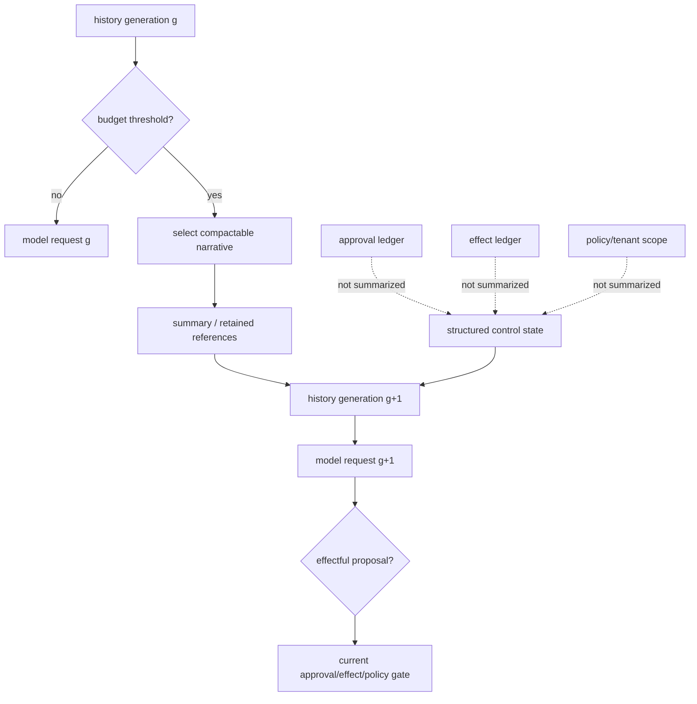

# 6장. 압축은 기억이 아니라 손실을 관리하는 프로토콜이다

> 선수 지식: [4장](./04-context-assembly.md)의 입력 소유권과 [5장](./05-tokenizer-tool-schema.md)의 토큰 예산. 이 장을 마치면 압축 가능한 서사와 별도 원장에 남겨야 할 통제 상태를 나눌 수 있다.

긴 실행에서 문맥 압축은 선택 사항이 아니다. 모델 context window는 유한하고, tool output·검색 문서·child 결과·사용자 대화는 계속 늘어난다. “요약을 잘하는 모델”만으로는 부족하다. 요약은 원래 history와 동치가 아니며, 무엇을 버렸는지 모르면 승인·권한·미완료 효과 같은 상태까지 문장 속에서 사라질 수 있다.

결론은 단순하다. 압축은 자연어를 줄이는 기능이 아니라 **generation을 바꾸는 상태 전이**다. summary는 model-visible memory의 한 형태일 뿐, durable effect ledger·approval record·tenant scope·lease를 대신하면 안 된다. 좋은 compaction은 토큰을 아끼면서도 어떤 종류의 사실을 절대로 문장 요약에 맡기지 않을지 명시한다.

## 6.1 실패 장면: 사라진 “아직 승인되지 않음”

에이전트가 긴 incident를 분석하다가 “데이터베이스 migration은 승인 후에만 실행한다”는 제약을 앞 turn에서 받았다. 이후 로그와 검색 결과가 쌓여 context limit에 닿는다. compactor는 기술적 결론을 짧게 요약하지만 pending approval을 누락한다. 다음 model step은 migration command를 제안한다. 실행기가 prompt의 summary만 믿으면 안전 조건은 토큰 절약 과정에서 지워진다.

여기서 실패는 요약 모델이 틀린 문장을 썼기 때문만이 아니다. 승인 상태를 natural-language history의 일부로 둔 설계가 실패한 것이다. 변하면 안 되는 제약은 별도 owner가 가진 구조화 state여야 한다.

| 정보 종류 | 압축해도 되는가 | 안전한 owner | 이유 |
|---|---|---|---|
| 장황한 command output | 대개 가능 | artifact reference + summary | 원문은 필요 시 다시 조회 |
| 이미 종료된 읽기 관측 | 조건부 가능 | observation ledger | provenance·시각은 보존 |
| 사용자 목표의 요약 | 조건부 가능 | history generation | 의미 drift를 표시 |
| pending approval | 문장만으로는 불가 | approval ledger | gate의 입력이기 때문 |
| prepared/unknown effect | 불가 | effect/reconciliation ledger | retry·복구의 기준 |
| tenant/scope | 불가 | authorization owner | 검색·도구의 허용 범위 |
| lease/fencing token | 불가 | coordination store | stale writer 차단 |



## 6.2 왜 압축이 필요하고 왜 위험한가

context window는 단지 비용 상한이 아니다. provider가 요청을 받아들일 수 있는 입력 공간이다. 긴 transcript를 무조건 보내면 latency·비용이 커지고, 어느 순간 hard limit 거부가 난다. 반대로 aggressive compaction은 instruction hierarchy, negative constraint, tool-result provenance, unresolved disagreement를 떨어뜨린다.

압축기의 품질을 “요약이 자연스러운가”로 평가하면 부족하다. 운영에서 먼저 물어야 할 것은 다음이다.

1. 어떤 history segment가 선택되었는가?
2. summary가 어떤 source generation을 대체하는가?
3. 어떤 structured control state는 summary 밖에 남는가?
4. compaction 뒤 toolset, template, policy, target revision은 같은가?
5. 이 generation에서 만든 proposal을 다음 generation의 현재 state에 실행해도 되는가?

이 질문을 event로 남기면 compaction은 관측 가능한 transition이 된다. 남기지 않으면 “모델이 갑자기 잊었다”는 모호한 사건이 된다.

## 6.3 실제 코드: pre-sampling compact는 언제 들어가는가

Codex의 고정 공개 리비전에서 pre-sampling compaction은 normal sampling 전에 context-window 상태와 fallback 조건을 확인한다. [Codex pre-sampling compact policy](https://github.com/openai/codex/blob/0344625ccf4ae0ab6472c6c1e7b4ace6af14661e/codex-rs/core/src/session/turn.rs#L1032-L1062)

그 다음 compatibility hash, backend/provider/model identity 조건을 보고 fallback step context를 다룬다. [Codex compaction compatibility](https://github.com/openai/codex/blob/0344625ccf4ae0ab6472c6c1e7b4ace6af14661e/codex-rs/core/src/session/turn.rs#L1063-L1197)

dispatch는 token-budget, remote-v2, remote-v1, inline path를 provider capability와 설정에 따라 고른다. [Codex compaction dispatch](https://github.com/openai/codex/blob/0344625ccf4ae0ab6472c6c1e7b4ace6af14661e/codex-rs/core/src/session/turn.rs#L1198-L1331)

이 구현에서 직접 말할 수 있는 것은 “compaction이 sampling 전에 context-window·provider capability와 연결된 선택 경로를 가진다”는 것이다. summary가 원 history와 의미적으로 동치라는 것, remote compactor가 보안·권한 상태를 모두 보존한다는 것, 또는 모든 provider가 같은 token 계산을 한다는 것은 이 코드로 보장되지 않는다.

## 6.4 압축 상태 기계

압축을 `history = summarize(history)` 한 줄로 표현하면 recovery가 불가능하다. 최소한 다음 상태를 분리한다.

| 상태 | 뜻 | durable record | 다음 행동 |
|---|---|---|---|
| `eligible` | budget 경보, 아직 원 history 유지 | usage estimate, threshold | selection 계획 |
| `preparing` | compact 대상과 invariant를 고정 | source generation, retained IDs | compactor 호출 |
| `produced` | summary artifact 생성 | summary digest, model/provider | validation |
| `validated` | required facts/reference 통과 | validation result | generation 교체 |
| `installed` | g → g+1 적용 | old/new generation link | 새 sampling |
| `rejected` | summary가 invariant 위반 | rejection reason | original 유지/다른 전략 |
| `failed` | compactor 오류 | error, attempt | retry/alternate path |

`installed`는 “요약이 진실”이라는 뜻이 아니다. 이제 모델이 보는 history representation이 바뀌었다는 뜻이다. 원 transcript와 compact artifact의 pointer는 audit/recovery 기간 동안 남겨야 한다. 저장 비용 때문에 원문을 삭제해야 한다면 retention policy와 deletion receipt를 별도로 다룬다. 압축 event가 삭제 event를 대신하지 않는다.

## 6.5 실습: control plane을 문장 요약에서 분리하기

아래 예시는 compactor에게 넘길 narrative와 반드시 별도 보관할 control plane을 나눈다.

```python
# 의사 코드: ledger와 store API는 보존해야 할 소유권 경계를 나타낸다.
def compact(run):
    narrative = select_messages(run.history, exclude_types={"approval", "effect", "lease"})
    control = {
        "policy_revision": run.policy_revision,
        "approvals": approval_ledger.open_for(run.id),
        "effects": effect_ledger.unresolved_for(run.id),
        "fences": lease_store.current_fences(run.id),
    }
    summary = summarize(narrative)
    if not validates(summary, must_reference=narrative.critical_ids):
        return reject("summary lost required reference")
    return install_generation(run, summary, control)
```

### 6.5.1 설치 전 불변식 판정 연습

완료된 read 하나, 열려 있는 approval 하나, `unknown` write 하나, 만료된 memory 하나, stale child 결과 하나를 같은 history에 넣는다. 압축 전후에 narrative token 수만 비교하지 말고 `approval ID`, unresolved effect 집합, policy revision, child base generation을 표로 대조한다. summary가 짧아져도 이 값 중 하나를 잃으면 설치를 거절한다.

그다음 같은 source generation에서 compactor를 두 번 시작해 늦게 끝난 결과를 설치하려 한다. base generation이 현재 값과 다르면 stale install로 막아야 한다. 이 연습은 요약 문장의 동등성이나 특정 provider의 압축 품질을 증명하지 않는다. 세대 교체가 control state를 덮어쓰지 않는지만 검증한다.

이 코드는 `validates`가 semantic equivalence를 증명한다고 주장하지 않는다. 최소 invariant를 확인할 뿐이다. 예컨대 사고 번호, 대상 revision, open question, 인용 reference가 summary에서 사라지지 않았는지 검사할 수 있다. 하지만 “이 요약만으로 사람이 같은 결정을 내린다”는 성질은 별도 evaluation과 human review가 필요하다.

## 6.6 summary의 오염과 prompt injection

retrieval 문서나 tool output에는 “다음 지시를 따르라”는 untrusted text가 들어갈 수 있다. compactor가 이를 권위 있는 짧은 문장으로 다시 쓰면 provenance가 흐려진다. 요약문이 system instruction처럼 보이게 되는 위험이다.

대응은 단순한 금칙어 필터가 아니다.

| 위험 | 잘못된 대응 | 더 나은 경계 |
|---|---|---|
| untrusted retrieval instruction | 요약에서 문장을 지운다 | source tier/provenance를 보존, action authority로 승격 금지 |
| stale policy text | 최신 문서처럼 요약 | policy owner의 current revision을 별도 조회 |
| tool output의 비밀 | 모두 로그에 저장 | redaction profile + restricted artifact |
| child의 추정 결론 | parent fact로 요약 | author/agent·evidence grade를 유지 |
| 과거 승인 | “승인됨”으로 압축 | approval ID/scope/expiry를 ledger에서 재검사 |

압축은 정보의 출처를 더 짧게 만들지만 더 신뢰할 만하게 만들지는 않는다. provenance가 필요한 claim은 summary에 reference를 달거나, 원 artifact를 다시 조회할 수 있게 해야 한다.

## 6.7 token 계산과 compaction trigger의 한계

local tokenizer로 세는 token 수와 provider가 실제로 세는 usage는 다를 수 있다. chat template, tool schema serialization, hidden system material, provider adapter 차이가 이유다. Codex는 active usage·compact scope·full-window limit과 history-derived estimate를 분리한다. [Codex context-window policy](https://github.com/openai/codex/blob/0344625ccf4ae0ab6472c6c1e7b4ace6af14661e/codex-rs/core/src/session/context_window.rs#L52-L120)

compaction trigger는 하나의 magic number가 아니라 정책으로 써야 한다.

```text
if provider reports hard-limit risk: compact or reject
elif local estimate crosses warning budget: prepare compact artifact
elif tool schema/template changed: do not reuse old estimate blindly
else: continue with observation of estimate error
```

warning은 proactive control에 유용하고, provider error는 authoritative feedback에 가깝다. 둘을 같은 metric으로 덮어쓰면 trigger가 왜 발생했는지 나중에 알 수 없다.

## 6.8 fault injection: 압축이 잃을 수 있는 것

| 주입 | 확인할 oracle | 복구 |
|---|---|---|
| summary가 pending approval을 누락 | approval ledger와 summary를 대조 | summary reject, gate는 ledger를 우선 |
| compactor timeout | old generation remains current | retry 또는 더 작은 대상 선택 |
| template/schema change 중 compaction | generation digest mismatch | 재렌더·재검증 |
| child output만 남고 source가 없음 | provenance invariant fail | child result를 claim으로 승격 금지 |
| old history deletion | artifact retention receipt 부재 | deletion 보류, restore path 확인 |
| provider hard-limit after local warning 없음 | provider error event | compact/retry, estimate calibration |

fault test의 oracle을 요약 문장의 유창함으로 잡지 않는다. generation link, approval ledger, unresolved effect, source reference, provider result처럼 구조화된 상태로 잡는다. 그래야 model 교체나 문체 변화에도 test가 유지된다.

## 6.9 복구와 비보장

compaction이 실패했다고 해서 원 history가 손상되어야 하는 것은 아니다. source generation과 target generation을 immutable reference로 남기면, compactor retry는 새 attempt가 된다. 반대로 history를 in-place로 덮어쓰면 timeout·crash 뒤 어느 transcript가 진실인지 알 수 없다.

또한 summary를 checkpoint로 오해하면 안 된다. checkpoint는 recovery가 필요로 하는 ID·전이·control state를 durable하게 보관하는 구조이고, summary는 다음 model request의 token budget을 줄이는 표현이다. 좋은 시스템은 둘을 함께 둘 수 있지만 하나가 다른 하나를 대체하지 않는다.

compaction이 잘라 낸 자리에는 cache가 들어온다. 요약이 지운 approval, receipt, `Unknown` effect를 cache entry가 슬그머니 다시 채워 넣지 않으려면 compaction artifact와 cache key가 같은 generation 축을 공유해야 한다. 압축된 history를 재사용 가능한 prompt prefix와 후보 cache로 바꿀 때의 key 설계와 invalidation 계약은 [43장](./43-cache-engineering.md)에서 이어 읽는다.

## 6.10 비교

| 관점 | Codex 공개 근거 | 일반적인 설계 결론 |
|---|---|---|
| trigger | pre-sampling context window branch | sampling 전에 budget 판단을 명시 |
| compatibility | hash/provider/model 조건 | representation drift를 generation으로 기록 |
| dispatch | 여러 compact path 선택 | compactor는 provider capability를 가질 수 있음 |
| metrics | attempt 주변 관측 | metric은 semantic preservation 증거가 아님 |
| recovery | 이 코드 밖 receiver/effect 별도 | summary와 checkpoint를 분리 |

pi-agent의 context compaction과 harness는 turn boundary와 structural linkage를 확인하는 유용한 구현 범위이지만, host persistence의 보편 보증은 아니다. [pi-agent agent loop](https://github.com/badlogic/pi-mono/blob/853a80d26c90a14c1886f0ebb8ffaae133ca2185/packages/agent/src/agent-loop.ts#L279-L310) 프레임워크가 compression 버튼을 제공한다는 사실보다, 어떤 state가 버튼 밖에 남는지를 먼저 본다.

## 6.11 현장 체크리스트

1. compaction을 `g → g+1` 전이로 기록하는가?
2. source history와 summary artifact의 link/digest를 남기는가?
3. approval·effect·tenant scope·lease를 narrative summary에만 두지 않는가?
4. summary가 untrusted text의 권한을 높이지 않는가?
5. provider hard limit과 local estimate를 분리하는가?
6. compactor failure가 원 history를 in-place로 파괴하지 않는가?
7. stale child result와 old schema proposal을 새 generation에서 재검증하는가?
8. summary quality와 safety invariant를 다른 평가로 측정하는가?
9. 압축 뒤의 요약을 cache key나 prompt prefix로 재사용할 때 `Unknown` effect와 만료 가능한 approval이 typed state로 남는가? ([43장](./43-cache-engineering.md))

## 이 장의 원전 바로가기

1. [Codex pre-sampling compaction](https://github.com/openai/codex/blob/0344625ccf4ae0ab6472c6c1e7b4ace6af14661e/codex-rs/core/src/session/turn.rs#L1032-L1062)
2. [Codex compaction compatibility](https://github.com/openai/codex/blob/0344625ccf4ae0ab6472c6c1e7b4ace6af14661e/codex-rs/core/src/session/turn.rs#L1063-L1197)
3. [Codex compaction dispatch](https://github.com/openai/codex/blob/0344625ccf4ae0ab6472c6c1e7b4ace6af14661e/codex-rs/core/src/session/turn.rs#L1198-L1331)
4. [Codex context-window state](https://github.com/openai/codex/blob/0344625ccf4ae0ab6472c6c1e7b4ace6af14661e/codex-rs/core/src/session/context_window.rs#L52-L120)
5. [pi-agent loop](https://github.com/badlogic/pi-mono/blob/853a80d26c90a14c1886f0ebb8ffaae133ca2185/packages/agent/src/agent-loop.ts#L279-L310)

## 6.12 소스 디깅: 세대 전환을 추적한다

압축 전후를 두 문장으로 비교하면 요약 품질만 보인다. 실행기는 `generation g`의 history를 읽어 `generation g+1`을 설치한다. narrative는 줄일 수 있지만 승인, 미확정 효과, lease, policy revision, child base generation 같은 control state는 문장에 섞어 압축해서는 안 된다.

```text
Compact(g) = (summary, retained_refs, control_state, loss_report)
install 가능 ⇔ required_refs ⊆ retained_refs
              ∧ unresolved_effects(g) = unresolved_effects(g+1)
```

요약이 사실상 맞아도 `call-17`이 아직 unknown이라는 표식이 사라지면 다음 turn이 같은 알림을 새로 보낼 수 있다. 오래된 도구 출력 전문을 모두 보존하면 최신 질문이 잘릴 수도 있다. 압축은 정보량 최대화가 아니라 위험별 보존 규칙을 적용하는 세대 전환이다.

[Codex pre-sampling 검사](https://github.com/openai/codex/blob/0344625ccf4ae0ab6472c6c1e7b4ace6af14661e/codex-rs/core/src/session/turn.rs#L1032-L1062)에서 trigger가 어느 상태를 읽는지 표시한다.

[호환성 경로](https://github.com/openai/codex/blob/0344625ccf4ae0ab6472c6c1e7b4ace6af14661e/codex-rs/core/src/session/turn.rs#L1063-L1197)에서는 remote/local 선택과 fallback이 같은 보존 계약을 지키는지 본다. [dispatch 구간](https://github.com/openai/codex/blob/0344625ccf4ae0ab6472c6c1e7b4ace6af14661e/codex-rs/core/src/session/turn.rs#L1198-L1331)은 새 history가 언제 설치되고 실패가 어느 상태로 돌아오는지 추적할 자리다.

반례는 “배포 알림을 보냈다”는 자연스러운 요약이다. 원래 상태가 timeout 뒤 `unknown`이었다면 재시도를 중복 효과로 바꾼다. “사용자가 배포를 승인했다”만 남기고 action digest와 expiry를 버리면 다른 target에 승인을 재사용할 수도 있다.

실습에서는 완료된 read, pending approval, unknown write, 만료된 memory, stale child result를 각각 하나씩 history에 넣는다. 압축 전후에 narrative token 수, retained control IDs, unresolved effect 집합, approval digest, generation을 비교한다. summary 생성 실패와 summary 검증 실패도 나눈다. 전자는 모델/provider 문제이고 후자는 설치를 막아야 할 계약 위반이다.

```python
# 의사 코드: 세대 교체의 compare-and-swap 경계를 나타낸다.
def install_compaction(run, base_generation, compacted):
    if run.generation != base_generation:
        return "stale_compaction"
    if not run.required_control_ids <= compacted.retained_ids:
        return "loss_detected"
    run.replace_history(compacted.summary, compacted.control_state)
    run.generation += 1
    return "installed"
```

동시에 두 compaction이 시작되면 늦게 끝난 요약이 최신 history를 덮지 않도록 base generation을 비교해야 한다. fixture는 같은 문장을 요구할 필요가 없다. required ID 보존, unknown 효과 불변, stale install 거부, token budget 상한처럼 실행 의미를 지키는 oracle을 둔다. 마지막에는 trigger owner, summary producer, validator, generation installer, failure disposition을 다섯 줄로 적는다.
