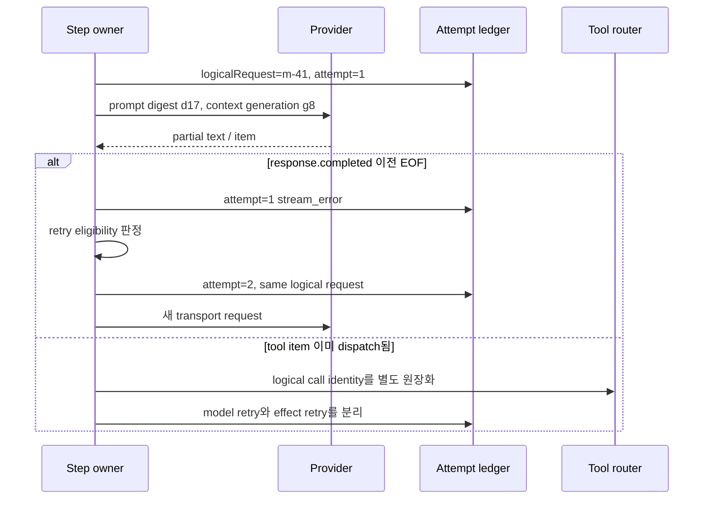

# 8장. 재시도는 같은 요청을 다시 보내는 일이 아니다

> 선수 지식: [1장](./01-agent-run.md)의 logical call·attempt와 [6장](./06-context-compaction.md)의 context generation. 이 장을 마치면 전송 재시도, 모델 재질문, 도구 재실행을 서로 다른 예산과 복구 절차로 분리할 수 있다.

## retry budget과 effect identity를 분리한다

재시도 판단은 예외 이름 하나로 하지 않는다. 같은 논리 모델 요청에 새 transport attempt를 붙일 수 있는지, 이전 stream이 tool proposal을 dispatch했는지, 그 tool의 효과가 조회 가능한지를 함께 본다.

```python
# 의사 코드: NewAttempt와 객체 필드는 retry policy의 계약을 나타낸다.
def retry_model(req, last_attempt, ledger, budget):
    if budget.exhausted or ledger.cancel_requested:
        return "stop"
    if last_attempt.tool_call_dispatched:
        return "reconcile_tool_effect_first"
    if not last_attempt.error.retryable:
        return "fail"
    return NewAttempt(logical_request_id=req.id,
                      context_generation=req.context_generation)
```

|바뀌는 것|유지해야 하는 것|새 logical request가 필요한 경우|
|---|---|---|
|provider request ID, attempt 번호, backoff|의도, prompt digest, context generation|사용자 steer, 도구 결과 합류, 정책상 새 질문|
|tool attempt 번호|logical call, action digest, idempotency key|대상·인수·행동이 달라짐|
|route/endpoint|tenant·권한·데이터 경계|route가 의미 자체를 바꿈|

두 crash 실험에서 호출자가 본 connection lost는 같았다. 그러나 commit 전에는 재시작 ledger가 `prepared`, receipt 없음, `apply_count=0`이었고, commit 후 응답 전에는 receipt와 `apply_count=1`이 있었다. 전자는 동일 key 재시도로 1회 적용됐고 후자는 duplicate retry 뒤에도 1회를 유지했다. 그러므로 model retry budget이 남았다는 사실은 tool effect 재전송 허가가 아니다.

“모델 호출이 실패했으니 한 번 더 보내자”는 문장은 너무 짧다. 어떤 요청을, 어느 문맥으로, 어떤 provider route에, 어느 비용 한도 안에서 다시 보내는가? 첫 스트림은 token 일부를 이미 보냈는가? 그 사이 도구 호출이 시작됐는가? 사용자가 취소했는가? 새 모델 응답이 원래와 달라도 같은 성공인가? 재시도는 네트워크 예외 처리의 작은 조각이 아니라 AgentRun의 정체성을 다시 다루는 일이다.

이 장에서는 `logical model request`와 `request attempt`를 나눈다. 전자는 한 step에서 모델에게 물으려던 의도이고, 후자는 실제 transport/provider에 보낸 한 번의 전송이다. 둘을 구분하지 않으면 비용, 중복, 취소, 관측, 사용자에게 보이는 transcript가 모두 뒤섞인다.

## 8.1 EOF가 온 순간 무엇을 알 수 있는가

모델이 “파일을 확인했고 다음으로 배포…”까지 스트리밍하다 연결이 끊겼다고 하자. 화면에는 문장 일부가 보인다. 이 사실만으로 다음 셋 중 어느 것도 말할 수 없다.

1. provider가 생성 자체를 끝내지 못했다.
2. provider는 끝냈지만 마지막 event만 유실됐다.
3. 모델이 도구 호출을 이미 제안했고, runtime이 그것을 실행하기 시작했다.

`EOF → retry`는 언제나 안전한 등식이 아니다. 모델 text만의 stream이라면 새 attempt를 시작할 수 있다. 하지만 이전 stream의 tool-call item이 dispatch 경계로 넘어갔다면, 새 model request는 새로운 proposal을 낼 수 있고 이전 proposal과 경쟁한다. 그 뒤의 write는 13장에서 다룰 logical call/effect identity가 필요하다.



## 8.2 코드가 말하는 범위

Codex의 고정 공개 리비전에서 sampling request는 요청 attempt를 반복하고, retryable stream error를 구분하며, retry가 허용된 뒤 timing을 남긴다. [Codex sampling retry loop](https://github.com/openai/codex/blob/0344625ccf4ae0ab6472c6c1e7b4ace6af14661e/codex-rs/core/src/session/turn.rs#L1361-L1468)

retry policy는 bounded retry와 특정 조건의 connection retry, capped exponential delay를 다룬다. [Codex response retry policy](https://github.com/openai/codex/blob/0344625ccf4ae0ab6472c6c1e7b4ace6af14661e/codex-rs/core/src/responses_retry.rs#L1-L150)

이 구현에서 읽어야 할 문장은 “재시도한다”가 아니라 “어떤 오류가 retryable이며, 어느 시점에서 다음 attempt를 허용하는가”다. retryable transport failure는 provider가 같은 출력이나 같은 tool proposal을 반환한다는 약속이 아니다. 더구나 이것은 원격 도구의 외부 효과 원자성이나 rollback을 보장하지 않는다.

스트림 event loop는 `response.completed` 전에 EOF가 오면 stream error로 취급하고, cancellation을 turn abort로 바꾼다. [Codex stream event loop](https://github.com/openai/codex/blob/0344625ccf4ae0ab6472c6c1e7b4ace6af14661e/codex-rs/core/src/session/turn.rs#L2296-L2520)

별도 integration test는 특정 고정 시나리오에서 stream error 뒤 다음 turn을 시작할 수 있음을 확인한다. [stream recovery test](https://github.com/openai/codex/blob/0344625ccf4ae0ab6472c6c1e7b4ace6af14661e/codex-rs/core/tests/suite/stream_error_allows_next_turn.rs#L21-L120) 이것은 회복성의 좋은 근거이지만, 모든 provider failure나 partial tool execution의 안전성을 일반화하는 근거는 아니다.

## 8.3 네 종류의 retry를 섞지 말 것

| 이름 | 안정적인 identity | 다시 해도 되는 조건 | 흔한 오해 |
|---|---|---|---|
| transport retry | request attempt | 아직 요청 결과를 확정 못 함 | 네트워크 retry가 model determinism을 준다 |
| model retry | logical model request | budget·cancel·context revision이 허용 | 새 답은 같은 답이다 |
| tool retry | logical tool call | receiver dedup/조회 가능 | timeout은 미실행이다 |
| workflow resume | checkpoint/work item | checkpoint와 policy가 현재도 유효 | 재개가 함수 중간부터 시작한다 |

특히 model retry와 tool retry는 관측 대상이 다르다. model retry는 prompt digest, model ID, provider revision 표식, decoding 파라미터, token usage를 남긴다. tool retry는 action digest, idempotency key, receiver receipt, effect disposition을 남긴다. 한 줄짜리 `retry_count`로 둘을 합치면 “두 번 모델을 물었는데 메시지는 한 번만 보냈다”와 “모델은 한 번 물었는데 메시지는 두 번 보냈다”를 구별하지 못한다.

## 8.4 문맥이 움직이면 같은 요청이 아니다

재시도 직전에 새 사용자 steer, tool observation, memory 삭제, policy revision이 들어올 수 있다. 이때 무조건 첫 attempt의 prompt를 복제하는 것도, 무조건 최신 문맥으로 바꾸는 것도 답이 아니다. 전자는 이미 철회된 권한이나 구식 정보를 다시 보내고, 후자는 비교 가능한 attempt를 잃는다.

권장되는 기록은 다음과 같다.

```text
LogicalModelRequest {
  run_id, turn_id, step_id, context_generation,
  prompt_digest, tool_schema_digest, model_route,
  decoding_config_digest, retry_budget
}
ModelAttempt {
  logical_request_id, attempt_no, transport_route,
  started_at, first_event_at, terminal_event_at,
  outcome, error_class, usage, provider_revision_hint
}
```

`context_generation`이 바뀌면 재시도 정책은 명시적으로 둘 중 하나를 선택해야 한다. (a) 기존 snapshot의 재현 attempt로 남기고, 결과를 최신 state에 commit하기 전에 재검증한다. (b) 기존 logical request를 terminal로 닫고 새 generation의 새 logical request를 만든다. 이 선택을 기록하지 않으면 A/B 평가에서도 retry 효과와 문맥 효과가 섞인다.

## 8.5 backoff는 예의가 아니라 overload 제어다

재시도는 장애 중인 provider에 추가 부하를 준다. 지수 backoff가 필요한 이유는 “기다리면 언젠가 된다”가 아니라, 동시에 실패한 많은 client가 같은 순간에 몰려 회복을 더 어렵게 만들지 않기 위해서다. jitter가 없는 고정 backoff는 동기화된 재폭주를 만든다. 그러나 backoff가 있다고 하여 요청이 공정해지는 것은 아니다. tenant별 budget, queue admission, circuit breaker, provider rate limit과 같이 보아야 한다.

| 신호 | 즉시 재시도의 위험 | 더 나은 반응 |
|---|---|---|
| connect reset | 일시 장애일 수 있음 | bounded exponential backoff + jitter |
| 429/rate limit | shared quota 고갈 | retry-after 존중, tenant budget 차감 |
| 5xx surge | provider overload | circuit breaker와 admission 조절 |
| client cancel | 사용자가 더 이상 원하지 않음 | 새 attempt 금지, in-flight 상태 분리 |
| EOF after partial item | 결론 불명 | item/dispatch ledger 확인 후 재개 결정 |
| auth/policy deny | 일시 오류가 아님 | retry하지 말고 명시적으로 종료 |

Temporal SDK의 retry 관련 코드는 transport/client policy와 workflow scheduling을 분명히 분리한다. [Temporal TypeScript retry classification](https://github.com/temporalio/sdk-typescript/blob/1327f2d5ae77210555bbafc01fbdeaca3e9499eb/packages/client/src/grpc-retry.ts#L109-L167) 그 구분을 빌리면, client retry가 receiver-side business idempotency를 만들어 주지 않는다는 사실도 선명해진다.

## 8.6 실습: 같은 seed가 같은 실행을 뜻하지 않는 이유

다음 작은 실험을 해 보자. 같은 prompt와 같은 seed로 두 attempt를 요청한다. 텍스트가 같아도 `provider_revision_hint`, tool schema digest, context generation이 달라졌다면 그것은 완전히 같은 실험이 아니다. 텍스트가 달라도 policy gate가 두 proposal을 모두 deny했다면 외부 효과의 관점에서는 동일하게 안전할 수 있다.

실험 원장에는 다음을 남긴다.

1. input item 순서와 prompt digest
2. 모델 route, endpoint/API version, 시간, provider fingerprint가 있다면 그것
3. temperature, top-p, seed semantics, maximum output
4. 도구 schema와 `tool_choice`, 병렬 호출 option
5. attempt별 최초 event·EOF·completed 시각과 token usage
6. attempt에서 나온 tool proposal과 그 뒤 admission/effect 상태

비교 기준은 exact text 하나가 아니라 proposal multiset, admission allow/deny, logical call 수, external receipt 수, 비용이다. 이는 stochastic 제어를 다루는 10장의 실험 설계와 이어진다.

## 8.7 고장 주입 표

| 장면 | 관찰해야 할 oracle | 결코 추정하면 안 되는 것 |
|---|---|---|
| 첫 token 전 connection failure | attempt=1의 error class, attempt=2 생성 | provider가 아무 계산도 안 했다 |
| partial text 뒤 EOF | `response.completed` 부재, transcript 상태 | partial text가 최종 답이다 |
| tool item 직후 EOF | router admission/dispatch event | 도구가 실행되지 않았다 |
| retry 중 사용자 cancel | 이후 attempt admission 없음 | remote provider가 즉시 중단했다 |
| policy revision 변경 | old request를 새 action으로 commit하지 않음 | retry가 자동으로 최신 권한을 쓴다 |
| 429 burst | retry budget·queue delay·tenant fairness | backoff가 SLA를 보장한다 |

## 8.8 실무 체크리스트

- [ ] logical model request와 transport attempt를 별도 ID로 기록한다.
- [ ] retryable error와 deny/cancel/schema error를 명시적으로 구분한다.
- [ ] prompt·tool schema·context/policy generation을 attempt와 함께 고정한다.
- [ ] partial stream을 final completion처럼 저장하지 않는다.
- [ ] model retry와 tool/effect retry의 budget·메트릭을 분리한다.
- [ ] backoff에는 jitter, upper bound, tenant/provider budget을 둔다.
- [ ] EOF와 cancel 사이의 race를 fault test로 재현한다.

## 8.9 비보장

재시도 정책은 provider 장애를 줄일 수 있지만 정확히 한 번의 모델 생성이나 정확히 한 번의 외부 효과를 보장하지 않는다. seed, low temperature, response cache도 provider revision·route·문맥이 바뀌는 현실을 지우지 못한다. 안전성의 마지막 경계는 모델 request가 아니라 tool admission과 receiver receipt다.

## 8.10 비용 예산과 재시도의 정치학

retry는 개인 요청만의 비용 문제가 아니다. outage 동안 aggressive client 하나가 shared quota를 먹으면 다른 tenant의 정상 요청까지 밀린다. 따라서 budget은 run-level뿐 아니라 tenant·provider·전역 queue 단위로 내려가야 한다. ‘중요한 작업’이라는 말도 retry 무제한의 근거가 아니라, 사람 escalation 또는 더 강한 provider route를 선택할 근거가 되어야 한다.

| budget | 끊어야 할 폭주 | 기록할 값 |
|---|---|---|
| per attempt | runaway stream reconnect | elapsed, tokens, error class |
| per run | 한 사용자 요청의 비용 폭발 | attempts, cumulative usage |
| per tenant | noisy neighbor | admitted/denied/deferred |
| per provider | outage fan-out | 429/5xx, breaker state |
| global | control plane 자기 보호 | queue depth, tail wait |

retry를 포기할 때도 사용자에게 ‘실패’만 보이지 않는다. 마지막 관찰 시각, 완료를 모르는지 여부, 안전하게 재개하려면 무엇이 필요한지를 보여 준다. 특히 tool proposal이 포함된 attempt라면 새 model retry 전 이전 proposal의 dispatch state를 확인해야 한다.

## 8.11 replay와 재현의 차이

provider request를 기록했다고 나중에 완전히 replay할 수 있는 것은 아니다. secret·time·retrieval·tool response·model backend가 달라질 수 있다. replay fixture의 가치는 실제 provider 결과를 재현한다는 데보다, event ordering·retry state transition·budget cutoff을 deterministic하게 검증하는 데 있다. live incident record와 sanitized replay fixture를 같은 것으로 부르지 않는 것이 좋다.

재현 불가능성이 실패는 아니다. 대신 불변식이 무엇인지 좁혀 적는다. 예를 들어 같은 fixture에서 ‘EOF 뒤 final completion 없이 UI가 성공을 표시하지 않는다’, ‘cancel 뒤 새 attempt가 admission되지 않는다’는 것은 provider text가 달라도 재현 가능한 계약이다.

### 재시도 결정을 사용자 언어로 번역하기

사용자가 보는 오류는 ‘재시도 2회’보다 “답변 생성 연결이 끊겼고, 이전 도구 실행 여부는 확인 중입니다”에 가까워야 한다. text stream만 실패했는지, effect가 미확정인지, 자동 retry budget이 남았는지를 구분해 보이면 사용자는 새 요청을 보내 중복을 만드는 대신 적절히 기다리거나 확인을 요청할 수 있다.

## 8.12 소스 디깅: retry loop의 네 경계

logical request 생성, 오류 분류, backoff/budget, 새 attempt admission을 각각 찾는다. 같은 prompt digest라도 provider route와 response ID는 바뀔 수 있다. tool proposal이 dispatch됐다면 model retry보다 effect reconciliation이 먼저다.

```text
retryable = transport_class 허용 ∧ budget_remaining ∧ not_cancelled
          ∧ context_generation unchanged ∧ no_unreconciled_effect
```

[sampling loop](https://github.com/openai/codex/blob/0344625ccf4ae0ab6472c6c1e7b4ace6af14661e/codex-rs/core/src/session/turn.rs#L1361-L1468)에서 attempt 증가를, [retry policy](https://github.com/openai/codex/blob/0344625ccf4ae0ab6472c6c1e7b4ace6af14661e/codex-rs/core/src/responses_retry.rs#L1-L150)에서 오류 분류와 delay 상한을, [stream loop](https://github.com/openai/codex/blob/0344625ccf4ae0ab6472c6c1e7b4ace6af14661e/codex-rs/core/src/session/turn.rs#L2296-L2520)에서 EOF와 cancel disposition을 찾는다.

429와 tool dispatch 뒤 timeout을 같은 retryable flag로 접으면 안 된다.

실습 stub은 partial text 뒤 EOF, completion 전 cancel, 429와 retry-after, tool item 직후 connection loss를 낸다. partial transcript가 final로 승격되지 않는지, cancel 뒤 admission이 없는지, unknown effect가 있으면 retry가 보류되는지 확인한다. 원장에는 logical request/attempt ID, generation, digests, route, error class, delay와 누적 budget을 남긴다.
