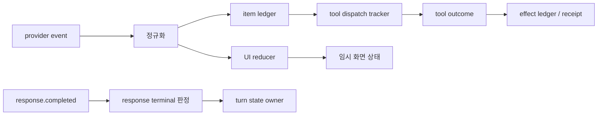

# 9장. 스트림을 줄인다는 것은 문장을 잇는 일이 아니다

> 선수 지식: [8장](./08-model-request-retry.md)의 request attempt와 EOF 경계. 여기서는 provider event를 transcript·도구 상태·외부 효과 원장으로 각각 투영하는 reducer를 설계한다.

## terminal은 하나가 아니다

한 실행에는 최소 네 종류의 종결이 있다.

|종결|소유자|증명하는 것|증명하지 못하는 것|
|---|---|---|---|
|`response.completed`|모델 protocol|응답 stream이 정상 종결됨|도구 효과 commit|
|turn terminal|run controller|이번 turn이 더 진행되지 않음|child·remote 작업 종료|
|tool attempt terminal|executor|handler가 반환·실패·취소됨|수신자 적용 여부|
|receipt observed|receiver/ledger|특정 key의 효과가 적용됨|사용자 의도가 옳았음|

실제 실행에서는 승자가 준비된 뒤 두 loser에 취소를 요청했다. 요청과 acknowledgement는 별도 사건이었고 loser가 이미 수행한 work chunk도 남았다. 따라서 reducer가 cancel 버튼 하나를 받았다고 `all_terminal=true`를 만들면 안 된다.

```python
# 의사 코드: state와 event는 reducer가 받는 정규화 객체다.
def reduce_tool(state, event):
    if event.kind == "cancel_requested":
        state.cancel_requested_at = event.ordinal
    elif event.kind == "cancel_acknowledged":
        state.cancel_ack_at = event.ordinal
    elif event.kind == "receipt":
        state.effect = ("committed", event.receipt_id)
    return state
```

receipt event가 stream 뒤에 도착해도 이미 terminal인 model item에 끼워 넣지 않는다. 동일한 `run_id` 아래 별도의 effect ledger와 join해야 partial transcript, 실행 종료, 외부 효과가 서로를 위조하지 않는다.

스트리밍 응답을 화면에 한 글자씩 붙이는 일은 쉬워 보인다. 하지만 AgentRun에서 stream은 text delta만이 아니다. reasoning item, tool call, tool output, refusal, usage, 완료 신호, 오류가 한 실행의 여러 상태를 밀어낸다. reducer가 이것들을 단순 문자열로 합치면 화면은 자연스러워도 실행 원장은 거짓이 될 수 있다.

이 장에서는 **보이는 transcript와 durable execution state를 분리한다**. reducer는 provider event를 사용자가 읽을 수 있는 상태로 투영하지만, 도구 호출의 실행 여부나 외부 효과의 완료를 스스로 결정하지 않는다.

## 9.1 실패 장면: 완료 전에 끝난 문장을 성공으로 인쇄하다

“배포가 완료되었습니”라는 delta가 화면에 찍힌 뒤 connection이 끊겼다. UI reducer가 마지막 text를 assistant message로 finalize하면 사용자는 완료를 본다. 그러나 protocol의 terminal event는 오지 않았다. 동시에 직전 item이 tool-call proposal이었다면 router는 아직 실행 중일 수 있다. 이때 취소 버튼을 누른 사용자는 무엇을 취소하는가? 화면의 문장인가, in-flight 도구인가, 다음 model attempt인가?

정답은 하나의 boolean이 아니다. stream의 종결, turn의 terminal state, tool attempt의 terminal state, effect receipt는 서로 다른 소유자에게 있다.



## 9.2 event와 state의 차이

event는 ‘무슨 일이 보고되었다’는 사실이고, state는 ‘현재 시스템이 무엇을 사실로 채택하는가’다. event를 순서대로 append하는 것만으로 state를 만들 수 없는 이유는 지연, 중복, missing ID, cancellation, out-of-order delivery 때문이다.

| event 종류 | reducer가 할 수 있는 일 | reducer가 하면 안 되는 일 |
|---|---|---|
| text delta | 같은 item의 표시 text 누적 | 최종 답변 성공 선언 |
| tool-call item | pending 카드 표시, call ID 보존 | 도구가 실행됐다고 표시 |
| tool output | 관측값 카드 연결 | 외부 effect commit 판단 |
| completed | response state를 terminal로 전이 | 모든 child 작업 완료 가정 |
| stream error | partial transcript에 오류 표식 | partial 내용을 신뢰할 final answer로 승격 |
| cancel request | UI intent 기록 | 원격 수신자의 commit을 rollback 선언 |

Codex의 stream event loop는 cancellation과 EOF-before-completion을 별도 상태로 다루며, stream item에 ID가 없을 때 이를 부여하는 경로도 갖는다. [Codex stream event loop](https://github.com/openai/codex/blob/0344625ccf4ae0ab6472c6c1e7b4ace6af14661e/codex-rs/core/src/session/turn.rs#L2296-L2520) 이 코드는 한 가지 실무 교훈을 준다. event identity가 없으면 delta merge도, 재개도, 문제 보고도 불안정해진다.

## 9.3 reducer의 불변식

좋은 reducer는 많은 것을 하지 않는다. 대신 몇 가지 불변식을 지킨다.

1. 동일 `(response_id, item_id, sequence)` event는 두 번 적용해도 상태가 변하지 않는다.
2. terminal event 뒤 같은 item에 오는 delta는 버리거나 anomaly로 기록한다.
3. `response.completed`가 없으면 response를 `completed`로 부르지 않는다.
4. tool call의 proposal, dispatch, return, receipt는 별 이벤트로 보존한다.
5. UI visibility 차단은 실행 취소나 rollback과 동의어가 아니다.

이를 간단한 의사 코드로 쓰면 다음과 같다.

```text
reduce(state, event):
  if event.id in state.applied: return state
  if state.response_terminal and event.belongs_to_response: record_anomaly(event)
  else if event.kind == TextDelta: append(item_id, event.delta)
  else if event.kind == ToolCall: upsert_pending_call(event.call_id)
  else if event.kind == Completed: state.response_terminal = completed
  else if event.kind == StreamError: state.response_terminal = errored
  mark_applied(event.id)
```

여기에는 effect 완료가 없다. 그 정보를 넣고 싶다면 receiver receipt를 가진 별 stream/event source에서 join해야 한다. trace ID나 call ID는 join key이지 그 자체가 receipt가 아니다.

## 9.4 text reducer와 tool tracker가 왜 갈라져야 하는가

Codex의 item dispatch는 stream response item을 finalize하거나 추적되는 in-flight tool future로 보낸다. [Codex stream tool dispatch](https://github.com/openai/codex/blob/0344625ccf4ae0ab6472c6c1e7b4ace6af14661e/codex-rs/core/src/session/turn.rs#L2521-L2720) 이 경계는 tool call이 단지 채팅의 특수한 토큰이 아니라는 사실을 드러낸다. tool output이 늦게 돌아와도 모델 text reducer의 순서와 tool lifecycle은 다를 수 있다.

예를 들어 두 read tool은 병렬로 끝날 수 있다. UI가 completion order로 결과를 넣으면 model에게 준 original call order와 다른 transcript가 만들어질 수 있다. write tool은 더 엄격하다. 병렬 proposal은 가능해도 commit order·approval·idempotency key를 reducer가 임의로 정해서는 안 된다.

Codex의 parallel 도구 테스트는 cancellation 전 admission과 handler 완료 뒤 cancellation을 구분한다. [parallel cancellation tests](https://github.com/openai/codex/blob/0344625ccf4ae0ab6472c6c1e7b4ace6af14661e/codex-rs/core/src/tools/parallel.rs#L419-L675) UI가 ‘취소됨’이라고 표시해도 이미 완료된 handler의 효과가 되돌아간다는 뜻은 아니다.

## 9.5 partial output의 정직한 표시

사용자는 기다리는 동안 답을 보고 싶다. 그래서 partial output을 숨길 필요는 없다. 다만 다음 상태를 시각적으로 분리해야 한다.

| 화면 표기 | 실제 의미 | 다음 행동 |
|---|---|---|
| 생성 중 | terminal event 전 delta | 수정·중단 가능 |
| 도구 대기 | proposal은 있으나 admission/dispatch 미확정 | 승인·정책 상태 노출 |
| 도구 실행 중 | handler 시작이 관측됨 | 결과·cancel·timeout 분리 |
| 응답 완료 | response.completed 관측 | child/effect 완료와 별도 표시 |
| 응답 오류 | stream terminal error | retry 가능성·partial 신뢰도 표시 |
| 효과 미확정 | receipt 없음 | `unknown`, 재조정 필요 |

이 표기를 하지 않으면 완성된 문장과 실행 완료를 사용자가 같은 것으로 믿게 만든다. 에이전트 UI의 친절함은 애매함을 숨기는 데 있지 않고, 애매함이 행동 선택에 영향을 주는 순간 정확히 보여 주는 데 있다.

## 9.6 실습: EOF를 세 위치에 주입하라

다음 세 실험은 reducer의 경계를 드러낸다.

1. 첫 text delta 전에 EOF: assistant item은 empty/errored이며 final message가 없다.
2. 여러 delta 뒤, `response.completed` 전에 EOF: partial text는 표시하되 `final=false`와 error causality를 가진다.
3. tool-call item 뒤 EOF: pending call은 남지만, dispatch event가 없으면 실행으로 표시하지 않는다. dispatch가 있었다면 tool tracker로 확인한다.

각 실험에서 확인할 oracle은 `terminal_event_seen`, `partial_item_count`, `pending_call_count`, `dispatch_seen`, `receipt_seen`이다. “UI가 멈추지 않았다”는 좋은 UX 신호일 수 있어도 execution correctness oracle은 아니다.

### 9.6.1 재접속 경계 확인

둘째 실험의 마지막으로 받은 sequence를 저장한 뒤, 재접속 응답에 같은 delta와 그 다음 delta를 함께 넣는다. reducer는 이미 적용한 `(response_id, item_id, sequence)`를 한 번만 반영하고, 새 delta만 partial 화면을 바꿔야 한다. `response.completed` 뒤에 늦은 receipt가 오면 transcript terminal은 그대로 두고 tool effect ledger만 갱신한다.

이 검사는 실제 provider의 재접속 프로토콜을 재현하는 실험이 아니다. 화면 reducer가 중복, transcript 종료, receiver 관측을 하나의 완료 boolean으로 합치지 않는지 확인하는 순수 입력-출력 시험이다.

## 9.7 관측 설계

stream reducer에는 raw event payload를 무제한 저장하지 않는다. prompt나 tool argument에는 비밀·개인정보가 있을 수 있다. 대신 다음처럼 bounded metadata와 보호된 event store를 나눈다.

| 위치 | 기록 | 목적 |
|---|---|---|
| metric | event kind, terminal class, bounded tool type | 오류율·지연 추세 |
| trace | run/turn/attempt/item correlation | 하나의 경로 추적 |
| durable ledger | call ID, state transition, receipt ref | 재개·감사 |
| protected debug store | redacted payload, sampling policy | 원인 분석 |

Prometheus의 label은 cardinality가 무한해지지 않도록 제한해야 한다. `run_id`나 raw tool args를 label로 두면 metrics 시스템 자체가 장애 원인이 된다. [Prometheus labels guidance](https://prometheus.io/docs/practices/naming/#labels) trace는 이 문제를 해결하는 보조 수단이지만, trace sampling으로 버려진 이벤트까지 복원하지는 못한다.

## 9.8 고장 주입 체크리스트

- [ ] duplicate delta가 text를 두 번 붙이지 않는가?
- [ ] out-of-order tool result가 다른 call과 합쳐지지 않는가?
- [ ] completed 뒤 delta가 anomaly로 남는가?
- [ ] EOF와 cancel이 서로 다른 terminal class인가?
- [ ] post-tool output 차단을 handler rollback으로 표시하지 않는가?
- [ ] stream error 뒤 새 turn이 가능해도, 이전 effect가 미확정임을 보존하는가?
- [ ] late child result가 부모의 오래된 step에 무단 merge되지 않는가?

## 9.9 비보장

정확한 reducer는 provider가 정확히 한 번 event를 보내거나 네트워크가 순서를 보존한다는 보장이 아니다. 또한 화면에서 결과가 사라졌다고 external effect가 사라지는 것도 아니다. reducer의 책임은 관찰한 상태를 거짓 없이 투영하는 것이며, retry·권한·외부 효과의 결론은 각자의 owner에게 남겨 두는 것이다.

## 9.10 ordering key와 재접속

재접속 뒤 provider가 마지막 event부터 다시 보내거나, client가 화면 복원을 위해 local buffer를 replay할 수 있다. 이때 timestamp만으로 순서를 정하면 clock skew와 batching에 흔들린다. 가능하면 response ID, item ID, provider sequence, local ingestion sequence를 함께 보존한다. provider sequence가 없다면 reducer는 엄격한 total order를 지어내기보다 ‘동일 item 안의 append’, ‘서로 다른 item의 표시 순서’라는 제한된 의미만 주장해야 한다.

재접속은 UI transport의 회복일 뿐 model execution의 resume은 아닐 수 있다. 화면이 이전 delta를 다시 받았다고 provider가 같은 request를 이어 생성하는지, 새 request attempt가 생겼는지는 별 event로 밝혀야 한다. 이 distinction이 없으면 duplicate text와 duplicate effect를 한 종류의 bug로 처리하게 된다.

## 9.11 accessibility와 error disclosure

partial/unknown 상태는 색깔만으로 표시하지 않는다. screen reader가 읽을 수 있는 terminal label, 재시도·취소의 의미, 효과 미확정의 설명이 필요하다. 오류 detail은 디버깅에 유용하지만 provider header·tool payload·secret를 그대로 UI에 내보내면 안 된다. 안전한 사용자 문구와 보호된 diagnostic record를 분리하는 것도 reducer boundary의 책임이다.

## 9.12 reducer property test

property-based test로 임의의 duplicate, permutation, EOF insertion을 만들 수 있다. assertion은 아름다운 문장이 아니라 다음과 같다: duplicate를 넣어도 applied event 수가 늘지 않는다; terminal 뒤 delta는 final text를 바꾸지 않는다; unknown tool result가 다른 call에 합쳐지지 않는다; raw payload를 metrics label에 내보내지 않는다. 이런 test는 provider를 호출하지 않아도 stream correctness의 많은 부분을 지킨다.

## 9.13 stream을 저장할 때의 보존 정책

raw stream은 디버깅에 값지지만 가장 민감한 데이터일 수 있다. 사용자 입력, file contents, tool arguments, provider identifier, reasoning 성격의 항목이 섞인다. 그래서 event별 retention을 둔다. terminal class·item count·latency 같은 집계는 오래 두고, 원문 payload는 짧은 TTL·암호화·접근 감사 아래 둔다. redaction은 화면 출력 직전에 한 번 하는 filter가 아니라 capture, export, analytics, support bundle 각각에서 확인할 정책이다.

sampling도 편향을 만든다. 정상 stream을 많이 버리고 오류 stream만 남기면 latency percentile을 재구성하기 어렵고, 반대로 tail을 잘못 sample하면 장애의 causal event가 사라진다. 중요한 외부 write 경계는 trace sampling 여부와 무관하게 작은 durable ledger event를 남기는 편이 낫다. 하지만 그 ledger도 receipt가 아니라는 구분을 지킨다.

## 9.14 독자의 디버깅 순서

partial 답이 이상할 때 화면부터 고치지 말고 다음 순서로 본다. response terminal event가 있었는가; item ID와 sequence가 연속적인가; tool proposal이 dispatch로 넘어갔는가; dispatch가 return/receipt를 얻었는가; reducer가 어느 상태를 사용자에게 표시했는가. 이 순서는 provider 오류, UI merge bug, tool lifecycle bug, effect ambiguity를 한 덩어리로 고치지 않게 해 준다.

reducer를 독립 모듈로 두면 UI 프레임워크를 바꾸어도 execution contract를 유지하기 쉽다. event normalization과 state transition을 pure function에 가깝게 두고, network subscription·DOM rendering·telemetry export를 바깥 adapter로 둔다. 이 구조는 재현 fixture와 accessibility 테스트를 훨씬 단순하게 만든다.

그 결과 partial state는 숨겨야 할 결함이 아니라, 사용자가 올바른 다음 행동을 고를 수 있게 하는 정보가 된다.

이때 사용자에게 남기는 재시도 버튼도 단순 refresh가 아니다. 새 model request를 만들지, 기존 stream의 상태만 다시 구독할지, tool effect를 먼저 reconcile할지를 선택해야 한다. UI action에는 그 선택이 명시되어야 하며, 같은 화면의 버튼이 서로 다른 durability semantics를 조용히 섞어서는 안 된다.

## 9.15 소스 디깅: reducer를 순수 함수로 떼어내기

stream의 네트워크 도착 순서와 의미 순서는 다를 수 있다. reducer는 `(response_id, item_id, sequence)`로 중복을 제거한다. tool future 완료 순서도 call 순서와 다를 수 있어 화면 순서, 모델 재입력 순서, 효과 commit 순서를 따로 둔다.

```text
S_(n+1) = reduce(S_n, normalize(raw_event_n))
terminal(S,item) ⇒ 이후 delta가 표시 결과를 바꾸지 않음
```

[event loop](https://github.com/openai/codex/blob/0344625ccf4ae0ab6472c6c1e7b4ace6af14661e/codex-rs/core/src/session/turn.rs#L2296-L2520)에서 item ID, completion/EOF/cancel 분기를 찾고 [tool dispatch](https://github.com/openai/codex/blob/0344625ccf4ae0ab6472c6c1e7b4ace6af14661e/codex-rs/core/src/session/turn.rs#L2521-L2720)에서 transcript와 in-flight future가 갈라지는 지점을 찾는다. response completion을 모든 tool 성공으로 바꾸는 reducer는 잘못됐다.

fixture는 event 중복, 두 item 순서 교환, terminal 뒤 delta, missing ID, tool result 뒤 receipt 유실을 만든다. reducer에서 clock·network·DOM을 빼야 permutation test가 가능하다. 화면은 “stream 종료”, “도구 실행 중”, “효과 확인됨”, “효과 확인 필요”를 분리한다.
