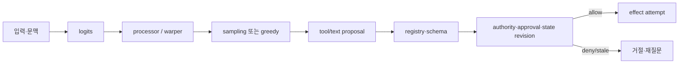

# 10장. 확률적 제안과 결정적 통제면

> 선수 지식: [5장](./05-tokenizer-tool-schema.md)의 도구 제안 경계와 [9장](./09-stream-reduction.md)의 terminal 판정. 이 장에서는 logits가 바꾸는 후보 분포와 정책이 바꾸는 실행 가능성을 분리한다.

언어 모델이 “이 도구를 호출하라”고 출력했을 때 그것은 명령인가, 제안인가? 안전한 시스템에서는 제안이다. 모델의 logits, temperature, sampling seed, top-p는 다음 token 또는 tool-action 후보의 분포를 바꾼다. 반면 권한, 대상 revision, 비용 한도, tenant scope, 승인 만료는 확률로 결정하면 안 된다. 이 장은 두 면을 갈라 읽는 법을 다룬다.

## 10.1 낮은 temperature가 안전을 만들지 않는 이유

temperature를 0 또는 아주 낮게 두면 실행이 결정적일 것이라는 믿음은 흔하다. 그러나 결정성이 줄어드는 범위는 모델의 decoding 경로다. prompt, model alias, provider backend, tool schema, retrieval hit, context order, policy revision이 하나라도 바뀌면 같은 설정도 다른 proposal을 낼 수 있다. 더 결정적인 것은 proposal이 위험 action을 정확히 반복해도 그 action이 허용되는가의 질문에는 답하지 못한다는 점이다.



모델 경로를 예측 가능하게 만드는 것과 control plane을 fail-closed로 만드는 것은 보완 관계지만 대체 관계가 아니다.

## 10.2 Transformers 코드의 정확한 경계

Transformers의 고정 공개 revision에서 logits processor list는 score를 순서대로 변환한다. score가 decoding mode에 따라 logits 또는 log-softmax일 수 있다는 설명도 코드 문서에 있다. [Transformers logits processors](https://github.com/huggingface/transformers/blob/550d7b3834670483a4df436541272c055dc364bf/src/transformers/generation/logits_process.py#L63-L103) Temperature warper는 sampling에서 score를 temperature로 나누며, sampling을 사용하지 않으면 영향을 주지 않는다는 구현 경계가 명시되어 있다. [temperature warper](https://github.com/huggingface/transformers/blob/550d7b3834670483a4df436541272c055dc364bf/src/transformers/generation/logits_process.py#L238-L303)

top-p는 누적 확률 질량을 기준으로 후보를 동적으로 자른다. [top-p implementation](https://github.com/huggingface/transformers/blob/550d7b3834670483a4df436541272c055dc364bf/src/transformers/generation/logits_process.py#L473-L539) 이 사실은 top-p가 사실성·안전성·도구 권한을 보장한다는 뜻이 아니다. `do_sample` 조건에서만 temperature/top-p 관련 processor가 붙는 경로도 확인할 수 있다. [generation mode setup](https://github.com/huggingface/transformers/blob/550d7b3834670483a4df436541272c055dc364bf/src/transformers/generation/utils.py#L1292-L1322)

| 층 | 바꾸는 것 | 바꾸지 못하는 것 |
|---|---|---|
| temperature | 후보 분포의 sharpness | policy·권한·최신성 |
| top-p | 누적질량 밖 후보 제거 | 근거의 진실성 |
| seed | 특정 구현/조건의 재현 보조 | provider revision을 넘는 동일성 |
| tool choice | 제안 surface 제한 | receiver effect receipt |
| policy gate | 현재 scope의 allow/deny | 모델이 좋은 답을 낸다는 보장 |

## 10.3 proposal을 action으로 승격하는 여섯 문턱

도구 JSON이 schema를 통과했다고 실행해도 되는 것은 아니다. 다음은 권장되는 문턱이다.

1. **registry**: 이름과 payload 종류가 현재 등록된 도구와 맞는가.
2. **schema**: canonicalization 뒤 argument가 모호하지 않은가.
3. **state revision**: proposal을 만든 step 이후 대상·policy가 바뀌지 않았는가.
4. **authority**: principal·tenant·network·filesystem scope가 허용하는가.
5. **approval**: 위험도에 맞는 action-bound receipt가 신선한가.
6. **effect discipline**: idempotency identity와 receiver 상태 조회가 준비됐는가.

이 gate들은 deterministic하되, 반드시 단순 boolean일 필요는 없다. `deny`, `ask`, `defer`, `dry_run_only`, `allow`처럼 이유가 남는 disposition이 더 낫다. 모델 confidence는 이 문턱을 우회할 수 없다.

## 10.4 평가를 어떻게 설계할 것인가

같은 prompt를 여러 번 실행해 “답이 비슷하다”고 말하는 것은 불충분하다. 다음 표처럼 층을 분리해 paired trial을 만든다.

| 측정 | 고정해야 할 것 | 결과 |
|---|---|---|
| proposal 안정성 | input, tool schema, model route, seed lane | text·call multiset/order |
| admission 안정성 | policy/state/approval revision | allow/deny 사유 |
| effect 안전성 | logical call ID, receiver dedup | receipt count, unknown count |
| 비용·지연 | retry, queue, provider tier | token·attempt·tail latency |

OpenAI API 문서는 endpoint별 `temperature`, `top_p`, `tools`, `tool_choice`, `parallel_tool_calls` surface를 보여 준다. [Responses create reference](https://developers.openai.com/api/reference/cli/resources/responses/methods/create) 하지만 문서에 field가 있다는 것은 내부 sampling 또는 tool dispatch 구현의 보증이 아니다. seed 역시 best-effort일 수 있으며 backend 변화 관찰 정보와 함께 기록해야 한다. [Chat Completions reference](https://developers.openai.com/api/reference/java/resources/completions/methods/create)

## 10.5 실습: toy sampler와 real system의 경계

고정된 세 action의 toy logits를 만들고, temperature·top-p·seed를 바꾸어 proposal이 어떻게 변하는지 관찰한다. 그 다음 동일 proposal을 아래 gate에 보낸다.

```text
allow iff registered(tool)
      and schema_valid(args)
      and proposal.policy_revision == current.policy_revision
      and tool in principal.allow_list
```

낮은 temperature로 `delete_backup` proposal이 매번 나와도 allow-list가 없으면 거절돼야 한다. policy revision이 바뀌면 같은 proposal도 stale로 거절돼야 한다. 이 실험이 입증하는 것은 toy sampler의 재현성과 gate의 결정성이다. 실제 provider 품질, 실제 병렬 실행, 실제 external effect safety의 벤치마크가 아니다.

## 10.6 실패 주입과 운영 점검

| 주입 | 기대 oracle |
|---|---|
| 동일 seed, provider fingerprint 변경 | 새 stratum으로 분리 |
| proposal 뒤 policy revoke | stale deny |
| 잘못된 JSON이지만 유사 tool name | registry/schema deny |
| parallel proposal 두 개 | 각 action digest별 독립 gate |
| model retry 후 다른 proposal | logical model attempt 차이 기록 |
| temperature=0 주장 | decoding 설정과 backend 조건을 함께 기록 |

- [ ] decoding parameter와 control-plane revision을 같은 experiment record에 남긴다.
- [ ] proposal 품질 지표와 effect receipt 지표를 합산하지 않는다.
- [ ] seed 없는 endpoint에 가짜 seed 값을 쓰지 않는다.
- [ ] policy deny를 model retry로 해결하려 하지 않는다.
- [ ] `parallel_tool_calls`를 실제 병렬 commit 보장으로 설명하지 않는다.

## 10.7 비보장

확률적 제어를 잘 기록해도 모델은 환각할 수 있고 provider는 바뀔 수 있다. 결정적 policy gate를 잘 만들어도 그것은 외부 수신자의 한 번만 실행을 보장하지 않는다. 두 층을 분리하는 목적은 완벽성을 주장하는 데 있지 않고, 실패가 났을 때 어느 층의 어떤 사실이 흔들렸는지 찾기 위해서다.

## 10.8 확률은 위험의 단위가 아니다

모델이 어떤 action token에 0.95의 확률을 주는 것을 ‘95% 안전’으로 읽으면 안 된다. 이것은 token distribution의 상대 질량일 뿐, action이 현재 요구를 만족할 확률이나 외부 세계의 피해 확률이 아니다. 높은 확률은 흔히 학습 데이터에서 자주 이어진 표현을 뜻한다. rare한 production environment, 새 policy, tenant 고유 제약에는 오히려 자신 있게 틀릴 수 있다.

risk score가 필요하다면 model probability와 별도의 입력을 가져야 한다. action class의 비가역성, blast radius, target sensitivity, current authorization, evidence freshness, rollback 가능성, operator cost가 그것이다. 이 값들 중 일부는 불확실하므로, high risk+unknown 조합은 confidence가 높아도 ask 또는 deny로 흐르게 한다.

```text
admission = policy(action, principal, target, current_state)
if admission is deny: stop
if irreversible and evidence is unknown: ask
if receipt_contract is absent: narrow scope or defer
```

이 규칙은 모델을 불신하자는 말이 아니다. 모델에게는 후보 생성·요약·대안 탐색을 맡기고, 외부 세계를 바꾸는 permission은 검증 가능한 state에 맡기자는 분업이다.

## 10.9 constrained decoding도 authorization이 아니다

JSON schema, grammar-constrained decoding, tool choice forcing은 malformed proposal을 크게 줄일 수 있다. 하지만 형식적으로 완벽한 `{"path":"/prod/config","operation":"delete"}`는 여전히 금지된 action일 수 있다. constrained decoding은 syntax layer를 강화하고, registry와 policy는 semantics/action layer를 강화한다.

| 기법 | 잘 막는 것 | 남는 것 |
|---|---|---|
| JSON schema | type/required field 오류 | stale target, privilege abuse |
| grammar | 파싱 불가 output | 잘못된 business intent |
| tool choice | 허용된 tool 이름 밖 proposal | 그 tool의 위험한 argument |
| function call validation | canonicalization 전 구조 오류 | TOCTOU, receiver duplicate |
| policy gate | scope 밖 action | provider response의 진실성 |

도구 choice를 하나로 강제한 experiment도 ‘모델이 그 행동을 독립적으로 선택했다’는 평가에는 쓸 수 없다. constraint가 있는 evaluation과 없는 evaluation을 같은 success rate로 비교하면 control-plane 효과를 model capability로 잘못 귀속한다.

## 10.10 stochastic evaluation의 실패 사례

평가 결과가 흔들릴 때 sampler만 탓하기 쉽다. 하지만 다음 교란 변수가 더 흔하다.

| 교란 | 관측 방법 | 대응 |
|---|---|---|
| retrieval drift | retrieved IDs/digests | corpus snapshot 또는 stratum 분리 |
| tool response drift | observation receipt/digest | mock 또는 replay fixture |
| policy rollout | decision revision | paired run에서 고정 |
| provider routing | model/fingerprint/region | route별 결과 분리 |
| retry | attempt history | first attempt와 final outcome 분리 |
| human approval | receipt·wait time | approval lane을 별 experimental factor |

특히 같은 seed lane에서 A/B를 pair한다고 해도 provider가 seed semantics를 보장하지 않거나 backend fingerprint가 바뀌면 그것은 새 stratum이다. 실패한 pair를 억지로 평균내는 것보다 결측으로 남기는 편이 정직하다.

## 10.11 정책 테스트는 model test와 다르다

model benchmark는 많은 prompt에서 proposal quality를 본다. policy test는 훨씬 작은 action matrix에서 불변식을 본다. 예컨대 policy revision 17에서 허용된 exact digest가 revision 18에서 revoke됐을 때, 모든 model proposal 형태에 대해 handler가 시작되지 않아야 한다. 이 test는 LLM을 호출하지 않아도 된다.

```text
for proposal in malformed, alternate_tool, exact_action, stale_action:
  decision = admit(proposal, current_revision)
  assert not (decision == allow and proposal is stale_or_out_of_scope)
```

그러한 deterministic test가 있어야 sampling noise가 security regression을 가리지 않는다. 실제 모델을 연결한 end-to-end test는 그 위에 ‘모델이 어떤 proposal을 얼마나 자주 냈는가’를 추가한다.

## 10.12 확장 체크리스트

- [ ] logits/probability를 confidence·truth·risk와 구분해 설명한다.
- [ ] constrained decoding의 syntax 보장과 action authorization을 분리한다.
- [ ] 평가 record가 retrieval/tool/policy/provider drift를 남긴다.
- [ ] seed/fingerprint가 없으면 재현성을 과장하지 않는다.
- [ ] model failure와 gate failure의 owner가 다른 dashboard에 보인다.
- [ ] high-risk unknown에 대해 low temperature를 안전장치로 쓰지 않는다.

## 10.13 한 번 더 확인할 질문

실험 보고서를 읽을 때는 “온도를 낮췄다” 다음에 반드시 묻는다. 어느 endpoint에서, 어느 provider revision에서, tool schema와 retrieval corpus를 고정했는가? output text가 아니라 admission과 receipt도 비교했는가? 이 질문에 답할 record가 없다면 수치는 decoding 실험의 힌트일 뿐 실행 안전성의 증거가 아니다.

좋은 control plane은 모델을 느리게 만들기 위한 장치가 아니다. 위험한 proposal만 더 엄격히 멈추고, 무해한 read·계산은 빠르게 진행할 수 있게 비용과 권한의 언어를 분리하는 장치다.

## 10.14 소스 디깅: logit에서 admission까지

모델은 token마다 logit `z_i`를 내고 `p_i = exp(z_i/T) / Σ exp(z_j/T)`로 확률을 만든다. 낮은 온도는 분포를 뾰족하게 하지만 사실성이나 권한을 만들지 않는다. top-k는 후보 수를, top-p는 누적 확률 질량을 제한한다. processor 적용 순서도 결과를 바꾼다.

[processor 기반 클래스](https://github.com/huggingface/transformers/blob/550d7b3834670483a4df436541272c055dc364bf/src/transformers/generation/logits_process.py#L63-L103), [temperature](https://github.com/huggingface/transformers/blob/550d7b3834670483a4df436541272c055dc364bf/src/transformers/generation/logits_process.py#L238-L303), [top-p](https://github.com/huggingface/transformers/blob/550d7b3834670483a4df436541272c055dc364bf/src/transformers/generation/logits_process.py#L473-L539)를 읽으며 tensor shape와 제거 token 표현을 확인한다. temperature가 0에 가까워도 가장 높은 logit의 tool이 잘못된 tenant를 가리킬 수 있다.

```python
# 실행 가능한 최소 예: 온도에 따른 확률만 계산한다.
import math
def softmax(logits, temperature):
    xs = [x / temperature for x in logits]
    m = max(xs); es = [math.exp(x-m) for x in xs]
    return [x / sum(es) for x in es]
```

고정 logit `[2.0, 1.0, 0.0]`에 온도를 바꾸고 entropy를 계산한다. 같은 proposal을 deterministic gate에 넣어 tenant mismatch, stale revision, missing approval가 온도와 무관하게 거부되는지도 확인한다. AgentRun에는 decoding 설정과 model revision을 attempt에 붙이고 gate decision은 별 event로 남긴다.
