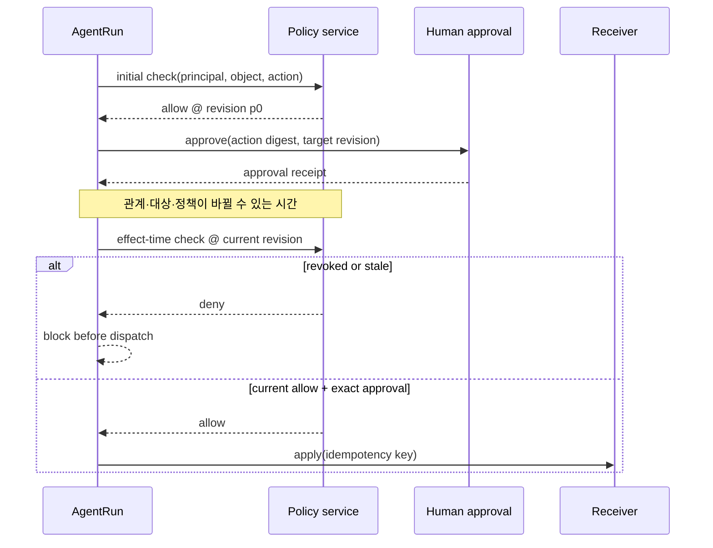
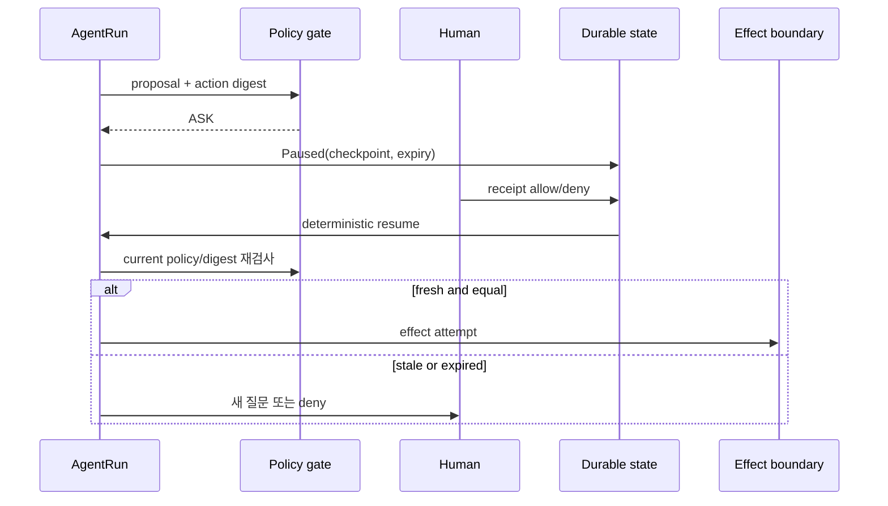

# 12장. 승인, 권한, sandbox는 서로의 대용품이 아니다

## 12.0 최초 allow는 사용 기한이 없는 표가 아니다

한 장애 주입 실행에서 후보 `a-design`은 최초 권한 검사에 통과했다. 그 뒤 viewer 관계를 제거하고 효과 직전에 더 강한 일관성 옵션으로 다시 검사하자 deny가 됐다. 수신자 프로세스는 시작되지 않았고 dispatch 전 cancellation 요청과 확인이 모두 남았으며 잔여 작업은 0이었다. 이 관찰이 보여 주는 범위는 좁고 중요하다. **계획 시점의 allow를 실행 시점까지 들고 가면 안 된다.**



```python
# 의사코드다. 프로젝트의 proposal·approval·policy 타입을 연결해야 실행할 수 있다.
def authorize_effect(proposal, approval, current_policy):
    if approval.action_digest != proposal.action_digest:
        return "stale_approval"
    if approval.expired or approval.target_revision != proposal.target_revision:
        return "stale_approval"
    return "allow" if current_policy.check(proposal) else "deny"
```

[OpenFGA가 높은 일관성 요청에서 cache lookup을 우회하는 고정 소스](https://github.com/openfga/openfga/blob/a7dfe8491dc7f9cd5905f4e9ae6c8e1d718c4bd9/internal/graph/cached_resolver.go#L136-L203)는 정책 서비스가 제공하는 읽기 계약을 확인하는 출발점이다. 그러나 단일 호스트에서 effect-time deny를 관측했다고 해서 다중 replica의 선형화 가능성이나 외부 효과의 rollback까지 증명되지는 않는다.

“사용자가 승인했으니 안전하다”는 말은 세 가지 다른 기제를 하나로 뭉갠다. 권한은 principal이 어떤 자원에 접근할 수 있는지의 정책이다. 승인은 특정 행동을 지금 수행해도 된다는 사람 또는 정책의 결정이다. sandbox는 실행 프로세스가 닿을 수 있는 환경을 줄이는 격리 장치다. 셋은 겹칠 수 있지만 어느 하나도 나머지를 자동으로 만들지 않는다.

## 12.1 Yes 버튼이 묶어야 하는 것

사람이 `Yes`를 눌렀다고 해서 어떤 write든 허용되는 것은 아니다. 좋은 approval receipt는 exact action에 묶인다.

```text
ConsentReceipt {
  run_id, turn_id, logical_call_id,
  action_digest = H(operation, canonical_target, canonical_args, scope),
  policy_fingerprint, checkpoint_revision,
  requested_at, decided_at, valid_until, disposition
}
```

대상 경로, URL, cwd, argument, scope, policy revision 가운데 하나라도 바뀌면 이 receipt는 stale이다. “배포를 허용한다”가 아니라 “이 revision의 이 target에 이 command를 이 TTL 안에서 수행한다”가 승인 단위여야 한다.



## 12.2 코드에서 보는 좁은 계약

Codex orchestrator는 approval 요건과 sandbox 관련 attempt 처리를 순서 있게 조합한다. [Codex tool orchestrator](https://github.com/openai/codex/blob/0344625ccf4ae0ab6472c6c1e7b4ace6af14661e/codex-rs/core/src/tools/orchestrator.rs#L56-L260) approval handling은 command·cwd·parsed action 같은 정보를 presentation boundary로 보낼 수 있다. [Codex approvals](https://github.com/openai/codex/blob/0344625ccf4ae0ab6472c6c1e7b4ace6af14661e/codex-rs/core/src/tools/approvals.rs#L495-L780) 이 코드는 UI에 무엇을 보여 줄 수 있는지와 실행 시도 순서를 읽게 해 준다. 그것만으로 모든 approval receipt가 durable하고 외부 effect가 exactly once라는 결론은 낼 수 없다.

Jikji의 approval 흐름은 auto/deny/ask를 나누고 human approver가 없는 ask를 fail-closed로 다룬다. 이는 중요한 기본값이다. 그러나 승인 판단과 receiver의 commit receipt는 서로 다른 데이터다. message send가 승인되었다고 전송 성공이 증명되는 것은 아니다.

## 12.3 pause와 resume의 경쟁 조건

승인 대기 상태에는 최소 세 race가 있다.

| race | 안전한 반응 |
|---|---|
| decision이 pause persistence보다 먼저 도착 | durable state를 다시 읽고 하나의 resume identity로 수렴 |
| resume job이 두 번 delivery | logical call ID와 idempotency gate로 중복 실행 억제 |
| 사람이 답하는 동안 대상/policy 변경 | receipt stale, 재질문 또는 deny |

LangGraph의 `interrupt()`와 `Command(resume=...)` 패턴은 checkpoint 기반 재개를 유용하게 보여 준다. 그러나 재개가 node의 interrupt 지점이 아니라 node 시작부터 재실행될 수 있다. [LangGraph interrupts](https://langchain-ai.github.io/langgraph/concepts/human_in_the_loop/) 따라서 interrupt 앞에 external write를 둔 application은 중복을 스스로 막아야 한다. framework의 pause는 business effect fence가 아니다.

## 12.4 sandbox의 진짜 역할

sandbox는 허용하지 않은 파일, 네트워크, process, secret surface를 줄인다. 하지만 sandbox 안에서 허용된 HTTP call이 외부 서버를 바꿨다면 그 변경은 sandbox 밖에서 일어난다. 또 sandbox deny가 나도 모델이 같은 action을 다른 도구로 우회 제안할 수 있으므로 registry·policy와 같이 본다.

| 메커니즘 | 답하는 질문 | 답하지 못하는 질문 |
|---|---|---|
| authorization | 이 principal에게 scope가 있는가 | 사용자가 지금 동의했는가 |
| approval | 이 action digest를 수행해도 되는가 | 코드가 격리됐는가 |
| sandbox | process가 어디까지 닿는가 | receiver가 한 번만 commit했는가 |
| idempotency/receipt | 효과가 무엇이었는가 | 행동이 적절했는가 |

## 12.5 좋은 승인 UI는 요약과 원문을 함께 준다

모델의 긴 설명만 보고 승인하게 하면 automation bias가 생긴다. 반대로 매번 이해할 수 없는 raw command만 보여 주면 approval fatigue가 생긴다. 둘을 함께 제시한다. 목적, canonical target, diff/command, 권한 범위, 위험·불확실성, dry-run/reject/defer 대안을 보여 주고, “다시 묻지 않기”는 target·TTL·rate가 제한된 scope extension으로 취급한다.

사람의 답도 무조건 참이 아니다. override는 이유, principal, policy change, expiry를 가진 감사 가능한 상태 전이여야 한다. 위험이 큰데 설명이 잘린 UI라면 allow보다 pause/deny가 정직한 기본값이다.

## 12.6 fault lab

1. approval을 받은 뒤 target path를 바꾼다. resume은 stale receipt를 거절해야 한다.
2. approval 대기 중 cancel한다. handler 시작 event가 없음을 확인한다.
3. allow 직후 process를 죽인다. receipt가 없으면 `unknown`을 유지한다.
4. sandbox deny 뒤 같은 operation을 다른 tool route로 제안한다. policy가 우회되지 않아야 한다.
5. 같은 resume token을 두 번 enqueue한다. logical call과 effect receipt가 한 번인지 검사한다.

## 12.7 체크리스트와 비보장

- [ ] approval은 action digest·policy revision·expiry를 가진다.
- [ ] no UI, malformed response, expiry는 fail-closed 또는 safe pause다.
- [ ] sandbox profile과 실제 granted permission을 기록한다.
- [ ] resume 전에 action digest와 current state를 다시 비교한다.
- [ ] cancel/deny와 external rollback을 같은 말로 쓰지 않는다.

이 장의 장치는 권한 오남용을 줄이지만, 사람의 잘못된 승인·sandbox escape·원격 API의 side effect·분산 삭제를 자동 해결하지 않는다. 그런 사건에는 receiver receipt, audit, incident response가 이어져야 한다.

## 12.8 capability는 role보다 좁아야 한다

role-based permission은 운영하기 편하지만, 에이전트의 action surface에는 지나치게 넓다. `developer` role에 network write가 있다는 이유로 모든 URL, 모든 repository, 모든 secret scope에 같은 권한을 주면 prompt injection 하나가 큰 반경의 효과가 된다. 더 안전한 단위는 짧게 만료되고 좁게 묶인 capability다.

```text
Capability {
  principal, tenant, operation_class,
  target_constraint, max_effects, valid_until,
  issuer, policy_revision, non_delegable
}
```

capability는 approval receipt와도 다르다. capability는 정책이 발급한 가능 범위, receipt는 한 action digest에 대한 결정을 말한다. 예를 들어 ‘이 repository에서 test를 실행할 capability’가 있어도 production deploy는 별 approval을 요구할 수 있다. 반대로 한 번의 deploy approval이 future commands에 일반 capability를 부여해서는 안 된다.

| 실패 | 넓은 role 모델 | bounded capability 모델 |
|---|---|---|
| prompt injection | tool 전체가 노출 | exact target/operation 밖은 deny |
| long-running run | 오래된 권한이 계속 유효 | TTL·renewal과 revision 검사 |
| child agent | 부모 권한을 전부 복사 | 목적별 delegation token |
| incident response | role을 전역 회수 | issuer/revision 기준 즉시 revoke |

child에게 capability를 넘길 때는 delegation chain도 기록한다. 부모 run의 단순 trace parent가 권한 위임을 증명하지는 않는다. child가 언제 어떤 max_effect 이하에서 행동할 수 있는지를 별 receipt로 남겨야 한다.

## 12.9 policy decision을 설명 가능하게 남기기

deny만으로는 운영이 어렵고 allow만으로는 감사가 어렵다. policy engine은 최소한 다음과 같은 decision record를 남겨야 한다.

```text
DecisionRecord {
  decision_id, action_digest, principal, tenant,
  policy_revision, matched_rules, effective_capability,
  disposition, reason_codes, evaluated_at
}
```

여기서 `reason_codes`는 모델에게 chain-of-thought를 요구하는 필드가 아니다. ‘target outside workspace’, ‘approval expired’, ‘network host not allow-listed’, ‘budget exhausted’처럼 사람이 재현할 수 있는 정책 근거다. raw prompt와 secret를 reason으로 적지 않는 것도 중요하다.

policy를 explainable하게 만들면 운영자는 false deny를 고칠 수 있고, 보안 담당자는 false allow의 원인을 찾을 수 있다. 하지만 matched rule이 남았다고 rule 자체가 옳다는 뜻은 아니다. 정책 변경에는 review, staged rollout, emergency revoke, regression test가 별도로 필요하다.

## 12.10 sandbox escape를 가정한 방어 심화

sandbox는 경계이므로 결함이 날 수 있다고 가정한다. 방어를 한 층에 몰지 않는다.

1. 모델에는 필요한 최소 도구 schema만 제공한다.
2. registry는 unknown/불일치 action을 막는다.
3. policy는 principal·tenant·target을 확인한다.
4. sandbox는 process/file/network surface를 줄인다.
5. receiver는 idempotency와 authorization을 다시 확인한다.
6. telemetry는 allow/deny/unknown을 남기되 secret를 과수집하지 않는다.

이것은 ‘sandbox가 뚫려도 안전하다’는 보장이 아니다. 침해 반경을 줄이고, 침해가 발생했을 때 어느 gate가 실패했는지 찾을 수 있게 하는 구조다. 특히 external API credential은 sandbox가 보호해 준다고 믿지 말고 scope·TTL·rotation·audit을 따로 설계해야 한다.

## 12.11 승인 피로를 수치로 보는 법

승인 시스템은 승인 횟수가 적을수록 좋은 것도, deny가 많을수록 좋은 것도 아니다. 다음을 함께 본다.

| 지표 | 경계 |
|---|---|
| high-risk false allow | 가장 높은 비용의 오류 |
| unnecessary ask rate | 사람의 작업 중단 비용 |
| stale receipt reject rate | policy drift를 감지하는 신호 |
| median/long-tail approval wait | AgentRun 지연과 SLA |
| grouped approval breadth | 한 Yes가 실제로 덮는 action 수 |
| cancel-after-ask rate | UI 표현 또는 latency 결함 신호 |

이 지표는 개인을 감시하는 점수판이 되어서는 안 된다. approval 기록에는 개인정보와 민감한 command가 섞일 수 있다. retention·redaction·접근 권한도 그 자체로 approval 시스템의 일부다.

## 12.12 확장 fault lab

| 주입 | 합격 oracle |
|---|---|
| child가 부모보다 넓은 scope 요청 | delegation deny |
| capability TTL 만료 직전 dispatch | handler 전 재평가 |
| policy rollout 중 pause/resume | old receipt stale 또는 explicit compatibility rule |
| redirect가 allow host 밖으로 이동 | request가 새 host policy를 통과하지 못함 |
| approval UI의 target truncation | automatic allow 금지/ask 유지 |
| sandbox process kill | receiver receipt 없으면 unknown |

이 실험에서 제일 중요한 질문은 ‘명령이 성공했는가’가 아니다. 어떤 대상, 어떤 revision, 어떤 scope가 실제로 gate를 통과했는지, 그리고 불명확한 순간에 시스템이 과감하게 성공을 지어내지 않았는지다.

## 12.13 운영자가 볼 수 있어야 하는 화면

승인 운영 화면에는 ‘허용/거절 수’만 있으면 안 된다. pending receipt의 expiry, stale로 거절된 resume, policy revision별 allow 변화, sandbox deny와 receiver unknown의 교차, 같은 action digest의 repeated ask를 볼 수 있어야 한다. 그래야 피로의 원인이 사용자 습관인지, 지나치게 넓은 tool surface인지, policy rollout의 오류인지 구분할 수 있다.

incident 때는 emergency deny가 새 dispatch를 막는 것과 이미 in-flight인 action을 판정하는 것을 따로 운용한다. global revoke는 필요하지만, 그 자체가 과거 효과의 삭제 영수증을 만들지는 않는다. revoke 시각, 적용된 policy revision, 영향을 받은 logical call 목록, reconciliation 결과를 연결해야 한다.

## 12.14 마지막 점검

approval은 사람을 보안 장비로 취급하는 방식이 아니라, 자동화가 알 수 없는 책임 경계를 명확히 드러내는 계약이어야 한다. 사람이 답할 수 있도록 충분히 좁고 정확한 action을 만들지 못했다면 Yes 버튼을 더 크게 만드는 것으로 해결되지 않는다.

권한 설계의 좋은 종료 상태는 ‘아무것도 못 한다’가 아니라, 기대한 action은 근거와 함께 통과하고 예상하지 않은 action은 왜 멈췄는지 설명 가능한 상태다. 그 균형은 모델 tuning이 아니라 capability, receipt, sandbox, receiver 확인을 함께 운영할 때 나온다.

### policy 변경의 배포

policy도 code처럼 staged rollout이 필요하다. 처음에는 shadow mode로 기존 결정과 새 결정의 차이를 기록하고, high-risk deny 규칙은 break-glass 절차와 함께 넣으며, 변경 뒤 stale approval·deny surge·unknown effect를 관찰한다. 새 revision을 배포한 순간 과거 receipt를 어떻게 처리하는지 명시하지 않으면 pause/resume 경로에서 가장 늦게, 가장 위험한 방식으로 결함이 드러난다.
