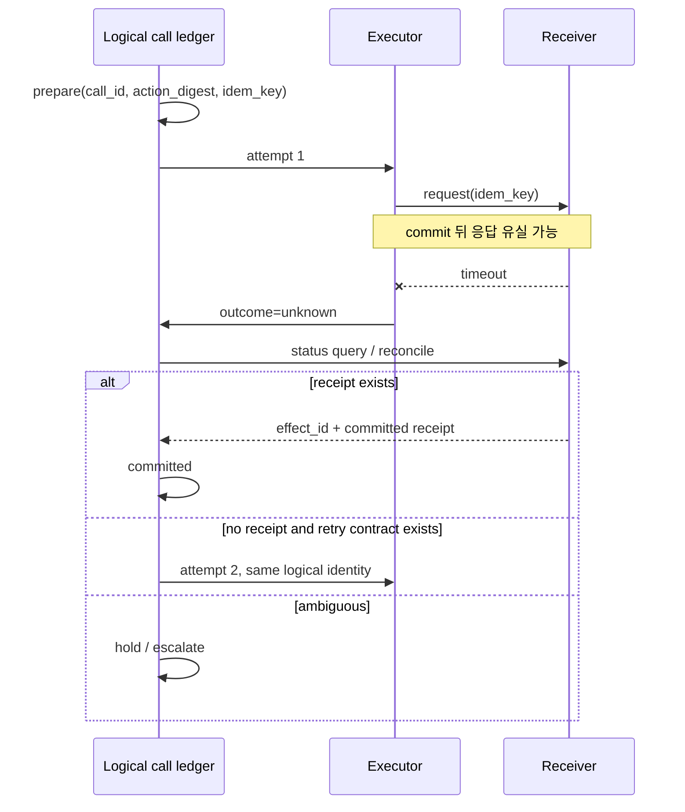
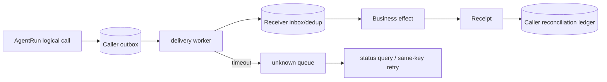

# 13장. 호출은 끝났지만 효과는 끝나지 않을 수 있다

> 선수 지식: [8장](./08-model-request-retry.md)의 attempt와 [12장](./12-permission-approval-sandbox.md)의 effect-time 재검사. 이 장을 마치면 timeout 뒤 `failed`와 `unknown`을 구별하고 receipt 기반 복구 절차를 세울 수 있다.

## 한 실행을 끝까지 따라가 보기

실제 로컬 실험에서는 하나의 `run_id`에 검색 후보, 권한 판정, 근거의 파일·행·해시, 세 실행 갈래, 취소 요청과 확인, 논리 효과, 수신 확인서를 모두 매달았다. 이벤트 18개는 같은 `trace_id`와 1–18의 순번 범위를 공유했다. 검색은 세 후보를 돌려줬지만 권한 검사를 통과한 것은 둘, 파일 해시까지 검증된 것은 하나뿐이었다. 세 갈래는 그 하나의 근거를 공유했고, 승자만 하나의 idempotency key로 수신자를 호출했다. SQLite 수신자를 재시작한 뒤에도 같은 확인서와 `apply_count=1`이 조회됐다.

`retrieved`, `allowed`, `verified`, `winner`, `cancel_requested`, `cancel_acknowledged`, `effect_applied`, `receipt_observed`는 `success=true` 하나로 줄일 수 없는 사실이다. 최초 권한 확인 뒤 권한 tuple을 제거한 별도 실행에서는 효과 직전 재확인이 거부됐고 수신자 자체가 시작되지 않았다. **승자라는 사실은 commit 권한이 아니다.**

```python
# 의사코드다. proof와 policy 객체의 실제 검증 API는 구현체가 제공해야 한다.
def may_dispatch(candidate, proof, policy_now):
    return (candidate.generation == proof.generation
            and proof.unique_row
            and proof.source_span_complete
            and proof.hash_matches
            and policy_now.allowed)
```

이 코드는 분산 transaction을 만드는 마법이 아니다. 어느 조건이 `false`인지, 어느 조건이 아직 `unknown`인지 감추지 않고 효과 경계를 닫는다.

외부 세계를 바꾸는 도구에서 가장 위험한 순간은 timeout이다. 호출자는 응답을 받지 못했다. 그렇다면 전송되지 않았는가, 수신자는 처리했지만 응답만 잃었는가, 처리 중 죽었는가? 네트워크와 프로세스가 있는 세계에서 이 세 경우를 호출자 혼자 구별할 수 없다. 그러므로 timeout 직후의 정직한 상태는 종종 `unknown`이다.

이 장은 **logical call**, **attempt**, **external effect**, **receipt**를 구분해 이 문제를 다룬다. 이 구분은 복잡한 이름 놀이가 아니라, duplicate send와 blind retry를 막는 최소 언어다.

## 13.1 네 ID의 역할

| 단위 | 뜻 | 예 |
|---|---|---|
| LogicalToolCall | 사용자가 의도한 한 행동 | “배포 채널에 이 diff 알림” |
| ToolAttempt | 그 행동을 실행한 n번째 시도 | timeout 뒤 attempt 2 |
| EffectID | 수신자 세계에서의 business 변화 | message `msg-991` |
| Receipt | effect와 call을 연결하는 durable 근거 | receiver dedup record |

`call_id`만 있고 receiver가 이를 저장하지 않으면 그것은 correlation hint다. `attempt=2`가 있다는 것은 재시도가 있었다는 뜻이지 새 메시지가 필요하다는 뜻이 아니다. `exit 0`과 trace span success는 executor가 본 결과일 뿐이며, receiver receipt의 대용품이 아니다.



## 13.2 retry가 해결하지 못하는 창

다음 표에서 오른쪽 두 행이 바로 blind replay를 금지하는 이유다.

| 실패 지점 | caller가 아는 사실 | disposition |
|---|---|---|
| dispatch 전 crash | receiver에 안 갔을 가능성이 큼 | prepared/failed, 재시도 정책 가능 |
| receiver 도착 전 network failure | 전달 여부 불명 | unknown 또는 transport-specific 판단 |
| receiver commit 전 crash | receiver 상태 조회 필요 | unknown |
| receiver commit 뒤 response loss | 효과는 이미 있을 수 있음 | unknown, dedup/status query |
| receipt durable write 뒤 client crash | reconcile로 commit 복원 가능 | committed 가능 |

Temporal의 activity retry 옵션과 client retry는 scheduling/transport의 재시도를 다룬다. [Temporal activity retry options](https://github.com/temporalio/sdk-go/blob/213f751d5117fd5621ef6dd55a21b78d605c9696/workflow/activity_options.go#L83-L90) 그러나 이 설정은 third-party API가 같은 business write를 중복 제거한다는 보장이 아니다. Temporal의 설명과 test를 정확히 읽으면, workflow identity·retry·heartbeat는 서로 다른 문제를 푼다는 점이 보인다. [Temporal heartbeat interface](https://github.com/temporalio/sdk-typescript/blob/1327f2d5ae77210555bbafc01fbdeaca3e9499eb/packages/workflow/src/workflow.ts#L254-L261)

## 13.3 receiver가 가져야 하는 계약

가장 단순하고 강한 패턴은 receiver inbox/dedup table이다. 요청은 stable idempotency key와 canonical action digest를 갖고, receiver는 같은 key를 받으면 새 business action 대신 이전 receipt를 돌려준다. key가 같고 payload가 다르면 조용히 성공시키지 말고 conflict로 처리한다.

```text
receive(key, action_digest):
  if inbox[key] exists and inbox[key].digest == action_digest:
      return inbox[key].receipt
  if inbox[key] exists:
      return conflict
  atomically persist inbox(key, digest) and business effect
  return receipt(effect_id, committed_at)
```

‘atomically’가 어려운 이유가 핵심이다. receiver DB write와 외부 SaaS send가 서로 다른 transaction이라면 outbox, provider idempotency, status query, compensation처럼 추가 경계가 필요하다. 바로 그래서 client-side retry library만으로 exactly-once를 주장할 수 없다.

Jikji remote runner가 tenant/run/call과 선택적 idempotency 재료를 보내는 것은 이 설계를 위한 좋은 입력이다. [Jikji remote request](https://github.com/jikji-labs/jikji/blob/d0cb4997e1882f9f5fc28b0b601ddf97317baf43/jikji/pkg/toolnode/remote_runner.go#L91-L100) 하지만 수신자가 그 재료를 어떤 저장소에, 어느 TTL로, payload conflict에 어떻게 쓰는지는 별도 코드와 테스트가 있어야 한다.

## 13.4 취소·보상·rollback을 분리하라

취소는 앞으로의 dispatch를 막거나 in-flight handler에 abort signal을 전달한다. rollback은 이미 일어난 변화를 원자적으로 없앤다. compensation은 반대 방향으로 새 effect를 만드는 일이다. 이미 보낸 메시지를 삭제할 때도 별도 권한·failure mode·receipt가 필요하다.

Codex의 cancellation test는 handler 시작 전 cancel과 handler 완료 뒤 cancel을 구분한다. [Codex parallel cancellation tests](https://github.com/openai/codex/blob/0344625ccf4ae0ab6472c6c1e7b4ace6af14661e/codex-rs/core/src/tools/parallel.rs#L419-L675) 이로부터 배울 것은 cancel UI가 곧 receiver rollback이라는 뜻이 아니라, cancel 시점별로 관측해야 할 lifecycle이 다르다는 점이다.

## 13.5 reconciliation worker

reconciler는 retry daemon이 아니다. `unknown` effect를 다루는 판정기다. 다음 순서가 보수적이다.

1. logical call, action digest, key, attempt history를 durable ledger에서 읽는다.
2. receiver status query 또는 inbox lookup을 한다.
3. receipt가 있으면 committed로 합류한다.
4. receipt가 없고 receiver가 same-key retry를 보장하면 같은 key로 재시도한다.
5. 수신자 조회가 불가능하거나 conflict면 hold/escalate한다.
6. 보상이 필요하면 새 logical call과 새 receipt로 남긴다.

reconciler 자체도 두 번 실행될 수 있으므로 lease/fencing, stable work identity, audit trail이 필요하다. lease는 동시 worker를 줄이지만 receiver가 fencing token을 검사하지 않으면 stale writer를 완전히 막지 못한다.

## 13.6 실습: loopback receiver의 세 가지 kill

작은 SQLite loopback receiver를 만들고 다음 위치에서 child process를 죽인다.

| kill 위치 | 기대 결과 |
|---|---|
| prepare 전 | attempt가 시작되지 않았음 |
| receiver apply 뒤 receipt 전 | caller=unknown, receiver 조회로만 복원 |
| local receipt write 뒤 | reconciler가 committed receipt를 발견 |

각 run은 `logical_call_id`, `attempt_no`, `idempotency_key`, `effect_id`, `receiver_state`, `caller_state`를 남긴다. 성공 assertion은 두 가지를 확인한다. `same logical call → at most one receiver effect`가 성립해야 하고, receipt가 없으면 `unknown`을 유지해야 한다.

## 13.7 운영 체크리스트

- [ ] retry counter 대신 logical call/attempt/effect ID를 모두 가진다.
- [ ] timeout 뒤 default는 blind replay가 아니라 status query다.
- [ ] receiver가 key와 canonical payload digest를 durable하게 비교한다.
- [ ] idempotency TTL 만료, key collision, payload conflict를 시험한다.
- [ ] executor 성공 log와 receiver receipt를 다른 metric으로 센다.
- [ ] compensation을 cancel/rollback과 구분하고 별도 승인한다.
- [ ] `unknown` queue의 age와 human escalation을 운영한다.

## 13.8 비보장

idempotency key 하나가 모든 외부 시스템에 exactly-once를 부여하지는 않는다. 수신자가 key를 무시할 수 있고, business action이 다중 시스템을 건드릴 수 있으며, receipt store도 장애 날 수 있다. 이 장의 목적은 불가능한 확실성을 포장하는 데 있지 않다. 어디에서 확실성이 끊겼는지 기록하고 그 지점에서 재조정하게 하는 데 있다.

## 13.9 action digest는 무엇을 묶어야 하는가

idempotency key를 UUID 하나로만 만들면 같은 key가 전혀 다른 요청에 재사용됐을 때 receiver가 무엇을 해야 하는지 모른다. 반대로 payload 전체를 그대로 해시하면 timestamp·nonce·표시 순서처럼 의미 없는 변화가 같은 business action을 다른 것으로 만든다. 그래서 action digest는 canonical business intent를 묶어야 한다.

| 효과 | digest에 포함할 것 | 보통 제외할 것 |
|---|---|---|
| 메시지 발송 | tenant, recipient/channel, canonical body, attachments | transport retry timestamp |
| 파일 write | workspace, resolved path, desired content/diff, precondition revision | UI label |
| HTTP mutation | method, normalized target, semantic body, auth scope | client connection ID |
| 결제/배포 | account/environment, amount/artifact digest, precondition | trace span ID |

precondition revision도 중요하다. “현재 main branch에 deploy”는 action이 아니다. 어느 artifact, 어느 environment, 어느 observed revision을 전제로 했는가를 묶지 않으면 재시도가 나중의 다른 세계에 과거의 intent를 적용한다. 수신자는 same key + same digest만 idempotent replay로 받아들이고, same key + different digest는 security incident 또는 client bug로 취급해야 한다.

## 13.10 outbox와 inbox는 왜 함께 나오는가

caller의 local ledger write와 network send 사이에도 crash window가 있다. local transaction 안에 ‘보낼 일’을 outbox에 기록하고, 별 worker가 이를 delivery하는 패턴은 이 창을 관측 가능하게 만든다. receiver는 inbox/dedup를 둔다. 두 패턴을 합치면 at-least-once delivery의 현실을 숨기지 않고, business effect의 중복을 receiver 계약으로 줄인다.



이 그림에도 transaction 경계는 남는다. receiver inbox insert와 business effect가 다른 system에 있으면 atomicity가 깨질 수 있다. outbox/inbox는 패턴이지 마법 주문이 아니다. 그래서 failure injection이 필요하다.

## 13.11 여러 효과를 한 요청에서 다룰 때

“파일을 고치고, 테스트를 실행하고, 배포하고, 채널에 알린다”는 사용자 요청은 하나의 Run이지만 하나의 effect가 아니다. file write, test execution, deploy, message send는 각각 독립 logical call과 receipt를 가져야 한다. 앞 단계가 성공했다고 뒷 단계가 자동 허용되는 것도 아니고, 마지막 notification이 실패했다고 deployment가 rollback되는 것도 아니다.

| 단계 | 권장 disposition |
|---|---|
| diff 생성 | observation/proposal |
| file write | effect receipt 또는 unknown |
| test run | observation, artifact digest |
| deploy | 별 approval·effect receipt |
| notification | deploy receipt를 참조하는 별 effect |

보상도 순서를 가진다. deploy 취소를 하려 해도 정확히 무엇이 배포됐는지 receipt가 필요하며, notification 삭제가 deployment undo를 뜻하지 않는다. saga라는 이름을 붙이기 전에 각 보상이 어떤 권한과 어떤 실패 모드를 가지는지 먼저 적는다.

## 13.12 effect 상태의 관측과 SLO

효과 시스템의 가장 유용한 지표는 성공률 하나가 아니다.

| 지표 | 질문 |
|---|---|
| `unknown_effect_age` | 얼마나 오래 판정되지 않은 write가 남는가 |
| `receipt_join_rate` | attempt 중 receipt로 합류한 비율은 얼마인가 |
| `dedup_hit_rate` | retry가 실제 중복 전달을 얼마나 만나는가 |
| `digest_conflict_count` | key 재사용/버그/공격 신호가 있는가 |
| `reconciliation_lag` | unknown에서 terminal까지의 꼬리 지연은 얼마인가 |
| `compensation_failure_rate` | 되돌리는 새 효과가 실패하고 있는가 |

이 metric의 label에는 run ID, user ID, payload digest를 넣지 않는다. bounded outcome·tool class·tenant tier 같은 낮은 cardinality만 쓰고, 상세 linkage는 권한이 있는 trace/ledger에서 찾는다. metric의 green은 receipt가 누락된 개별 사고를 지우지 못한다.

## 13.13 더 어려운 case: 외부 API가 idempotency를 제공하지 않을 때

어떤 legacy API는 status query도 idempotency key도 제공하지 않는다. 이 경우 agent는 환상을 만들지 말아야 한다. 가능한 선택은 (a) write 전에 human confirmation을 높이고, (b) read-after-write로 관찰 가능한 business state를 찾고, (c) 호출을 한 번만 시도하고 unknown을 사람에게 올리고, (d) 더 강한 adapter/receiver를 앞에 두는 것이다. ‘재시도하면 대개 괜찮다’는 결론은 비용이 작은 read에는 쓸 수 있어도, 돈·배포·공개 메시지에는 안전 정책이 아니다.

정확한 시스템은 모르는 상태를 그대로 보고할 수 있어야 한다. `unknown` queue는 receiver 계약이 끊기는 지점을 보여 주는 중요한 운영 신호다.
