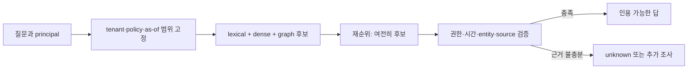
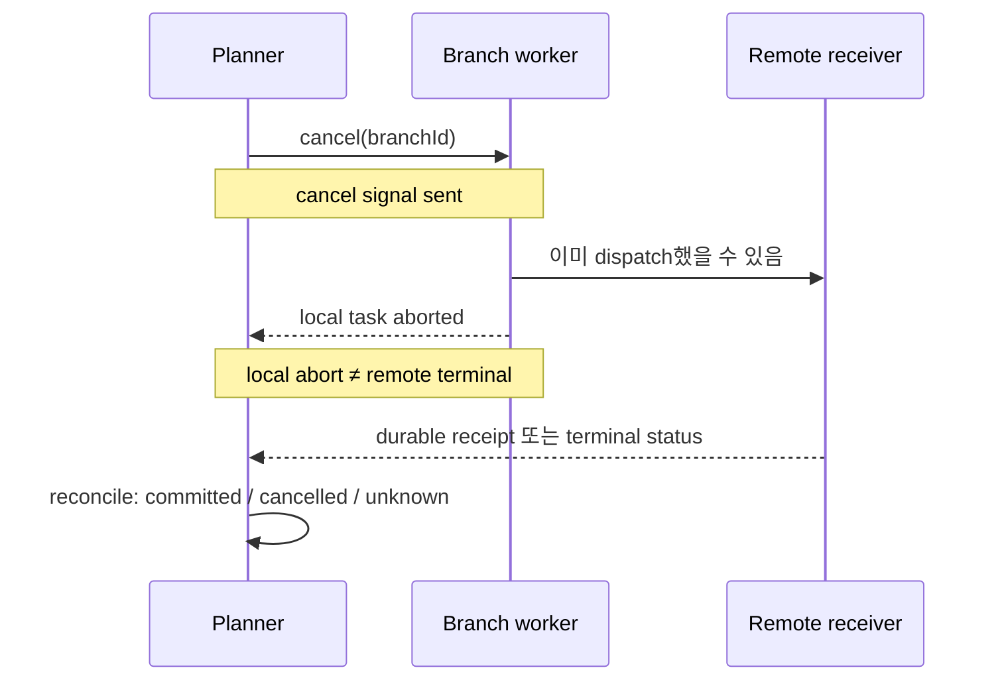
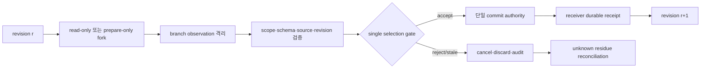

# 14장. 먼저 움직인 일이 왜 더 느리고 더 위험해지는가

> 선수 지식: [9장](./09-stream-reduction.md)의 순서·terminal과 [13장](./13-logical-call-effect.md)의 effect disposition. 이 장에서는 병렬 fan-out의 지연 이득을 취소 비용·중복 작업·미확정 효과와 함께 계산한다.

## 손익분기식부터 세운다

갈래 수를 늘리기 전에 다음 순가치를 같은 단위로 환산한다.

```text
NV = V_L·max(0, L_serial-L_winner) + V_I·max(0, U_verified-1)
   - C_C·W_duplicate - C_V·N_verifier_reads
   - C_R·W_after_cancel - p_effect·Loss_effect
```

`U_verified`는 **서로 다른 검증 근거의 수**다. 갈래 수와 구별해야 한다. 같은 문서·세대·해시를 네 갈래가 읽었다면 정보는 하나이고 계산만 네 벌이다.

|시나리오|fan-out|고유 근거|tail 절감(ms)|중복·취소 잔여(ms)|효과 위험 입력|순가치|
|---|---:|---:|---:|---:|---:|---:|
|독립 근거|2|2|54.59|30.53|0|+4.72|
|공유 근거|4|1|23.97|182.79|0|-11.60|
|효과 fence 없음|2|2|54.53|25.48|10|-4.93|
|예산 초과|8|실행 전 추정|—|projected 240|0|실행 거부|

이 값은 작은 bounded 실행에서 식의 경계를 확인한 관측치이며 운영 ROI로 해석할 수 없다. 네 번째 경우에는 budget 100을 넘는 projected work 240을 결과가 나오기 전에 거부했다.

```python
# 의사코드다. 비용 추정치와 gate 존재 여부를 묶은 admission predicate를 나타낸다.
admit = (projected_work <= branch_budget
         and effect_mode in {"read_only", "staged", "idempotent_reconciled"}
         and provenance_gate_defined
         and (estimated_nv > 0 or shadow_measurement))
```

[The Tail at Scale](https://research.google/pubs/the-tail-at-scale/)의 중복 요청 동기를 외부 효과가 있는 에이전트에 옮길 때는 취소 잔여와 확인서 비용을 새로 넣어야 한다. [Speculative RAG](https://arxiv.org/abs/2407.08223)와 [RASD](https://arxiv.org/abs/2503.03434)도 같은 이름 때문에 이 식의 고유 근거와 동일시해서는 안 된다.

새벽 두 시, 장애 대응 에이전트가 같은 질문을 세 번 던진다. 하나는 키워드 검색을, 하나는 벡터 검색을, 하나는 서비스 그래프 탐색을 시작한다. 가장 먼저 돌아온 답은 180일 전의 다른 테넌트 문서다. 두 번째 답은 권한은 맞지만 이미 철회됐다. 세 번째 답은 느렸지만 현재 revision의 근거와 변경 이력을 함께 가져온다. 이 순간 시스템이 해야 할 일은 ‘가장 빠른 답을 채택’하는 일이 아니다. **무엇이 후보이고, 무엇이 검증된 관찰이며, 무엇이 실제 세계를 바꿀 권한을 얻었는지**를 구별하는 일이다.

병렬화는 대기 시간을 숨길 수 있다. 그러나 모르는 의존성, 공유된 잘못, 취소되지 않은 원격 작업, 버려진 결과가 메모리에 남기는 흔적까지 없애지는 못한다. 이 장은 추측적 실행을 더 많이 켜는 법을 설명하지 않는다. 먼저 달린 일이 언제 이득이고 언제 사고의 선행 비용이 되는지를 다룬다.

## 14.1 ‘추측’이라는 한 단어가 숨기는 네 가지

이름이 비슷하다고 같은 최적화로 취급하면 지표도 안전 규칙도 뒤섞인다. 다음 네 가지는 서로 다른 대상에 미리 비용을 지불한다.

| 메커니즘 | 먼저 움직이는 대상 | 승자의 판정 | 전형적인 위험 |
|---|---|---|---|
| query fan-out | 여러 질의 재작성·인덱스·경로 | 새로운 **허용 가능한 근거** | 중복 후보, index/rate-limit 경합 |
| speculative tool execution | 아직 확정되지 않은 다음 tool 호출 | 검증된 작업 결과 | 취소 잔여, 외부 효과 |
| speculative decoding | draft model이 낸 token 묶음 | target model의 token 검증 | 낮은 acceptance, target 검증 비용 |
| Speculative RAG | 여러 문서 부분집합의 초안·추론 | verifier 또는 선택 단계 | context/token 증폭, 동일 근거의 반복 |

### 14.1.1 query fan-out은 ‘답을 여러 개 생성’하는 일이 아니다

질의 확장, lexical 검색, dense 검색, late interaction 재순위, 그래프 경로 탐색을 함께 시작하는 것은 대개 **후보군을 넓히는** 작업이다. 여기서 dense score가 높다는 사실은 ‘표현 공간에서 가깝게 배치되었다’는 뜻뿐이다. 그것이 해당 사용자에게 공개되어도 되는지, 기준 시점에 유효한지, 인용 가능한 원전인지, 원인과 결과의 방향이 맞는지는 다른 술어다.

예를 들어 `top-k`의 첫 문서가 다른 테넌트에 속하면 점수 0.99는 권한 판정 1이 아니다. 철회된 문서가 두 번째여도 score는 현재성을 복원하지 않는다. 한 문단에서 ‘정책’과 ‘장애’가 함께 언급되었다고 해서 정책이 장애를 일으켰다는 인과 방향도 생기지 않는다. [Faiss FAQ](https://github.com/facebookresearch/faiss/wiki/FAQ)는 검색 시점의 ID filtering과 index 구성의 제약을 설명한다. 이는 filtering이 필요 없다는 뜻이 아니라, **검색 구조의 편의와 authorization의 의미가 다른 계층**이라는 경고로 읽어야 한다.

후보를 답으로 승격하는 최소 경로는 다음과 같다.



`unknown`은 검색 실패를 멋있게 포장한 말이 아니다. 그래프에서 어떤 edge가 보이지 않는다는 사실은, 명시적으로 완결성을 책임지는 재고가 없는 한 그 edge가 거짓이라는 뜻이 아니다. [RDF 1.1 Semantics](https://www.w3.org/TR/rdf11-mt/)의 open-world 모델은 이 차이를 정확히 보존한다. provenance도 마찬가지다. [PROV-O](https://www.w3.org/TR/prov-o/)는 어떤 entity가 어떤 활동을 거쳐 나왔는지를 표현하지만, 그 활동이 가능한 모든 반례를 수집했다는 보증은 제공하지 않는다.

### 14.1.2 speculative tool execution은 ‘병렬 read’보다 훨씬 비싸다

planner가 “다음에는 아마 고객 정보를 조회할 것”이라고 예측해 read-only 조회를 준비하는 것은, 맞으면 대기 시간을 가릴 수 있다. 그러나 그 다음 호출이 메일 발송, 배포, 결제, 티켓 변경이라면 이야기가 달라진다. 모델이 나중에 그 branch를 버려도 이미 일어난 외부 효과는 자동으로 버려지지 않는다.

[speculative-tools](https://github.com/joelvarun/speculative-tools/blob/c93cad9e6449be5e3953ef563943c28b3a962629/README.md#L17-L24)는 tool sequence의 n-gram을 이용해 다음 호출을 예측하고, hit이면 결과를 재사용하고 miss이면 폐기하는 공개 사례다. 이 사례가 유용한 이유는 예측·cache hit·폐기라는 구조를 분명히 보여 주기 때문이다. 하지만 README의 ‘행동이 같다’는 설명만으로 원격 cancellation, 외부 write, idempotency를 증명할 수는 없다. 그 문장이 참이 되려면 tool의 purity 또는 idempotency, 안정적인 call identity, receiver 측 deduplication, 그리고 취소 확인이 별도로 필요하다.

### 14.1.3 speculative decoding은 검색 fan-out이 아니다

speculative decoding에서는 작은 draft model이 다음 token들의 후보를 내고, target model이 그 후보 묶음을 검증한다. 한 번의 target 검증에서 받아들여진 draft-token 길이와 그 검증 비용을 핵심 지표로 삼는다. branch 수나 top-k overlap과는 다르다. retrieval을 draft-token 후보 생성에 결합한 [RASD](https://arxiv.org/abs/2503.03434)는 이 둘을 연결한 연구이지만, 그래서 query rewrite 병렬화와 동의어가 되는 것은 아니다.

반대로 [Speculative RAG](https://arxiv.org/abs/2407.08223)는 여러 retrieval 기반 초안과 검증을 결합하는 방법을 제안한다. 논문에서 보고한 결과는 drafter, verifier, 데이터셋, 병렬 endpoint, 평가 protocol이라는 조건 아래의 결과다. 모든 RAG 요청에 fan-out을 붙이면 같은 품질·지연 우위를 얻는다는 일반 명제로 바꾸면 안 된다.

### 14.1.4 그래프는 병렬화 버튼이 아니다

[Graph of Thoughts](https://arxiv.org/abs/2308.09687)는 thought를 정점과 dependency edge로 다루며 결합·개선하는 연구를 제안했고, [LLMCompiler](https://arxiv.org/abs/2312.04511)는 planner, task fetching, parallel executor 구조를 제시한다. 두 작업은 ‘모든 일을 직렬 chain으로 놓지 않아도 된다’는 통찰을 준다. 다만 planner가 그린 DAG에 edge가 없다는 사실은 숨은 파일 의존성, 같은 API rate-limit bucket, 같은 credential, 같은 stale snapshot이 없다는 증거가 아니다.

실행 DAG는 declared predecessor와 fork/join을, provenance graph는 입력과 산출물의 유래를, state graph는 허용된 전이를, authority/effect graph는 누가 무엇을 commit할 수 있는지를 관리한다. 이 네 graph는 서로 대체되지 않는다.

| graph | 답할 수 있는 질문 | 답할 수 없는 질문 |
|---|---|---|
| 실행 DAG | 어느 task가 선언상 먼저 끝나야 하는가 | 숨은 외부 의존성이 없는가 |
| provenance graph | 어떤 source revision/span에서 왔는가 | 그 source가 완전하고 참인가 |
| 상태 전이 graph | 어떤 상태 이동이 허용되는가 | 원격 취소가 이미 끝났는가 |
| authority/effect graph | 누가 어떤 digest를 commit할 수 있는가 | receiver가 exactly-once를 적용했는가 |

## 14.2 낭비를 ‘평균 latency’ 하나로 판단하면 실패한다

가장 빨리 끝난 branch의 시간 `min(T_i)`는 매력적인 숫자다. 하지만 가장 빨리 끝난 결과가 채택될 확률, 채택 뒤 검증을 통과할 확률, loser가 정말 멈출 확률, 그리고 외부 효과가 되돌릴 수 있는지는 그 숫자 안에 없다.

직렬 정책을 `π₀`, speculative 정책을 `πₛ`라 하자. branch `i`에 대해 실행 비용 `E_i`, 검증·병합 비용 `V_i`, 취소 뒤 남은 비용 `K_i`, 버려진 관찰이 context나 memory를 오염시켜 생기는 복구 비용 `P_i`, 외부 효과 손실 `S_i`를 별도로 기록한다. 스케줄러·join·재계획 비용은 `C_coord`다.

\[
\mathbb E[C(\pi_s)] = \sum_{i\in B}\mathbb E[E_i+V_i+K_i+P_i+S_i] + \mathbb E[C_{coord}].
\]

여기서 중요하게 빠져 있는 값이 있다. `min(T_i)`다. 그것은 결과의 **채택 가능성**을 말하지 않기 때문이다. 실무의 admission은 보통 다음 두 gate를 동시에 넘어야 한다.

\[
\mathbb E[G(B)]-\mathbb E[C(\pi_s)]+\mathbb E[C(\pi_0)]>0
\]

\[
\Pr(\text{stale, unauthorized, ambiguous commit}) \le \epsilon.
\]

첫 식의 `G(B)`는 단순히 먼저 응답이 도착한 가치가 아니라, deadline 안에 **검증을 통과한 결과**를 얻어 절감한 가치다. 둘째 식은 더 빠르다는 이유로 잘못된 write를 허용하지 않는 안전 gate다. 첫 식이 양수여도 둘째 식을 만족하지 못하면 write branch를 추측적으로 실행하면 안 된다.

### 14.2.1 정말 이득인 좁은 경우

현재 tool A가 끝나면 read-only tool B를 부를 확률이 0.95라고 하자. B와 대안 C는 동일한 snapshot만 읽고, 결과는 schema·source revision·provenance 검사를 통과하기 전에는 사용자에게 보이지 않는다. B가 맞을 때 A의 남은 시간과 B의 실행 시간이 겹치고, B/C가 싼 작업이며, C는 빨리 취소되고, 서비스가 병렬 용량을 남겨두었다면 추측은 합리적이다. `p_i`를 최종 채택 확률, `q_i`를 채택 후 검증 통과 확률, `ΔL_i`를 실제로 숨긴 지연, `r_i`를 추가 비용이라 두면 read-only 사전 gate는 다음처럼 쓸 수 있다.

\[
\sum_i p_iq_i\Delta L_i > \sum_i r_i+C_{coord}.
\]

이것은 correctness theorem이 아니다. `p_i`는 model confidence를 그대로 가져오지 말고 holdout이나 운영 로그의 calibration으로 추정해야 한다. 공통 model, prompt, retrieval generation, credential을 공유하는 branch들은 같은 오류를 반복한다. 세 표가 같은 오래된 문서를 가리켰다면 3표가 아니라 하나의 stale source다.

### 14.2.2 낭비가 되는 실패 사건

다음은 전형적인 incident다. 세 query rewrite가 같은 철회 문서를 가져온다. verifier는 세 결과를 모두 읽어야 하고 loser cancellation도 없다. 실행 cost는 3인데 새로운 허용 가능한 근거는 0이다. 병렬화는 response race를 만들었을 뿐, 답을 만들지 못했다.

반대로 lexical branch가 현재 문서 하나를, typed-graph branch가 독립 source span 하나를 가져오고, 중복 branch는 첫 admissible 결과 뒤 실제로 취소된다면, 지불한 cost 2로 서로 다른 두 근거를 얻을 수 있다. 이 비교는 실제 ANN throughput이나 endpoint p99를 재는 benchmark가 아니다. **중복 결과와 새로운 허용 근거를 같은 ‘검색 성공’으로 세면 안 된다**는 유한 반례다.

낭비는 보통 다음의 얼굴로 나타난다.

1. **낮은 채택률**: 대부분의 branch가 버려져 token·tool-ms만 남는다.
2. **공유 원인**: 같은 index snapshot, prompt injection, rate limit이 branch 수만큼 복제된다.
3. **검증세**: 자연어 결과를 비교·판정하는 비용이 본 작업보다 크다.
4. **취소 잔여**: local abort 뒤 원격 요청이 계속되어 quota와 lock이 남는다.
5. **외부 효과**: winner만 표시해도 loser가 보낸 메일·변경한 파일·생성한 배포는 사라지지 않는다.
6. **context 오염**: 버려질 관찰을 shared transcript에 먼저 넣어 다음 planner가 사실처럼 사용한다.

## 14.3 취소는 동사가 아니라 사건들의 열이다

‘cancel 했다’는 로그 한 줄은 거의 아무것도 증명하지 않는다. 최소한 다음 사건을 분리해야 한다.



`signal sent`, `body invoked`, `local task aborted`, `remote terminal`, `receiver receipt`는 별개다. 공개 [OpenAI Agents의 tool execution lifecycle](https://github.com/openai/openai-agents-python/blob/89c02c828ee8510fe9a84ee6675608193aa13b02/.agents/references/tool-execution-lifecycle.md)는 concurrency cap, source-order의 결과 관찰, 취소 뒤 drain 같은 lifecycle 경계를 문서화한다. 이는 특히 실행 완료 순서와 model이 읽는 결과 순서를 분리해야 한다는 실용적 근거가 된다. 하지만 SDK의 cancellation contract가 모든 hosted tool의 원격 종료나 외부 효과 rollback을 증명하는 것은 아니다.

공개 pi 코드의 [`executeToolCalls`](https://github.com/badlogic/pi-mono/blob/853a80d26c90a14c1886f0ebb8ffaae133ca2185/packages/agent/src/agent-loop.ts#L409-L553)도 같은 교훈을 준다. 순차 tool 하나가 있으면 batch 전체를 순차 경로로 보내고, 병렬 경로는 결과를 원래 tool-call 순서로 다시 결합한다. 즉 scheduler가 알아야 할 것은 Promise를 동시에 만들 수 있는가가 아니라, **tool이 선언한 순서 의존성과 결과 관찰 순서가 무엇인가**다. `AbortSignal`을 전달하는 것 역시 receiver가 이미 commit한 변경을 되돌리는 protocol은 아니다.

### 14.3.1 effect fence: 준비와 commit을 분리한다

안전한 기본 구조는 write를 speculative branch 안에서 끝내지 않는 것이다.



branch가 읽은 state revision `r`과 commit 직전 revision이 다르면 compare-and-swap 또는 재검증을 해야 한다. `CommitAuthorized`는 효과가 일어났다는 뜻이 아니고, `ReceiptRecorded`도 receiver가 durable하게 인정한 receipt가 아니면 성공으로 세면 안 된다. 결과는 verifier가 승인하기 전까지 shared memory나 model-visible transcript가 아니라 격리 observation에 둔다.

다음 의사 코드는 review 때 요구할 경계를 나타내며 구현 템플릿으로 쓰지 않는다.

```python
# 의사코드다. fork·verify·CAS·receiver API와 예외 처리는 실제 runtime에 맞춰 구현해야 한다.
branch = fork_read_only(input_revision=r, id=branch_id)
observation = await branch.run()

verdict = verify(
    observation,
    policy_revision=current_policy(),
    required_source_revision=corpus_snapshot,
    expected_state_revision=r,
)
if verdict.accepted and compare_and_swap(r, r + 1):
    receipt = receiver.commit_once(action_digest, idempotency_key)
    record_receipt_or_reconcile(receipt)
else:
    request_cancel(branch_id)
    retain_quarantined_observation_for_audit(observation)
```

이 코드에서 `compare_and_swap`이 있다고 모든 distributed write conflict가 해결되는 것은 아니다. `commit_once`가 있다고 receiver가 실제로 deduplicate한다는 보장도 없다. 바로 그래서 `action_digest`, idempotency key, authority, receiver receipt, terminal status를 모두 ledger에 기록한다.

## 14.4 그래프와 검색을 결합하되, 각각의 무지를 보존한다

벡터와 lexical 검색은 넓고 싼 후보 생성에 좋다. [ColBERT](https://arxiv.org/abs/2004.12832) 같은 late interaction은 ranking 표현을 더 정교하게 만들 수 있다. [G-Retriever](https://arxiv.org/abs/2402.07630)는 질문과 관련된 subgraph를 사용해 graph context를 줄이는 방법을 다룬다. 그러나 reranker를 한 번 더 붙여도 authorization, temporal validity, negative closure가 similarity 함수 속성으로 바뀌지는 않는다.

따라서 결합 순서는 보통 다음과 같이 읽는 편이 좋다.

```text
principal / tenant / as-of
  → 후보 검색(lexical + dense)
  → typed graph join
  → source revision·span·정책·시간 검증
  → answer 또는 unknown
```

여기서 typed join의 각 hop에는 `(subject, predicate, object, direction, valid-time, source)`가 있어야 한다. 단순 path length는 인과 validity가 아니다. 또한 full graph reasoning은 공짜가 아니다. 작은 read에도 무조건 graph traversal, closure, verifier를 붙이면 `C_coord`와 tail latency가 커져 또 다른 speculative waste를 만든다. 구조는 필요한 질문에만 사용한다.

### 14.4.1 한 건의 incident 질의를 끝까지 따라가 보자

운영자가 “어제의 배포가 결제 오류를 일으켰는가?”라고 묻는다. 에이전트가 세 branch를 연다.

- A는 dense index에서 `payment error deployment`를 검색한다.
- B는 배포 event에서 incident event로 이어지는 typed edge를 찾는다.
- C는 변경 승인과 rollback 기록을 lexical 검색한다.

이 세 branch는 같은 질문을 다루지만 동등한 답을 생산하지 않는다. A의 산출은 `candidate document`다. B의 산출은 방향과 time qualifier를 가진 `candidate path`다. C의 산출은 승인/철회 상태를 포함할 수 있는 `candidate record`다. 이들을 바로 한 문장으로 합치면 “가까운 문서”, “연결된 edge”, “관찰된 log”라는 서로 다른 증거 수준이 사라진다.

검증자는 먼저 요청자의 tenant와 role, 그리고 답변의 기준 시점 `as_of`를 고정한다. 다음으로 A의 source revision이 기준 시점보다 앞서는지, B의 edge가 `deployment → caused → incident` 방향인지, C의 approval이 철회되지 않았는지를 확인한다. 마지막에는 각각의 문서 span과 path를 인용 가능한 답에 붙인다. 이 과정에서 ‘반대 증거가 없다’는 결론은 별도다. 결제 시스템의 모든 변경·사건 관계를 완결적으로 수집했다는 inventory owner와 coverage window가 없다면, 정직한 결과는 `false`가 아니라 `unknown` 또는 ‘현재 관측된 기록에서는 확인하지 못함’이다.

이 사례에서 graph는 정답을 만들지 않는다. 검증해야 할 identity·방향·시간을 잃지 않게 한다. 반대로 A/B/C가 같은 stale ingestion generation을 보고 있다면 경로가 세 개여도 독립 corroboration은 하나다. correlation cohort는 ‘branch 이름’ 대신 `model revision, prompt template, retriever/index generation, corpus snapshot, credential scope`의 튜플로 기록하는 편이 낫다.

### 14.4.2 pre-filter와 post-filter의 실패를 분리한다

권한 검사를 검색 뒤에만 붙이는 구조는 흔하다. top-k가 전부 다른 테넌트·철회 문서라면 post-filter 뒤 결과는 비어 버린다. 이 빈 결과가 ‘허용 문서가 없다’는 뜻인지, ‘허용 문서가 있었으나 top-k에 들지 못했다’는 뜻인지는 다르다. 검색 후보의 recall 문제를 authorization verdict로 말해서는 안 된다.

tenant마다 완전히 별도 index를 만드는 선택도 언제나 최선은 아니다. index 구조, filter capability, shard 비용, update frequency, access policy의 변화율은 제품마다 다르다. 어느 선택이든 다음 세 결과를 구별해 측정한다.

| 결과 | 뜻 | 운영상 다음 행동 |
|---|---|---|
| `no candidate` | 현재 검색 범위에서 후보가 없다 | query/index coverage를 조사 |
| `candidate rejected` | 후보는 있었지만 권한·시간·source 조건에서 탈락 | policy/revision과 filter placement를 조사 |
| `unknown` | 부정 사실을 말할 완결된 재고가 없다 | 추가 조사 또는 답변의 한계를 명시 |

이 구분이 빠지면 access filter로 인한 recall 저하를 model hallucination으로, 혹은 데이터 부재를 access denial로 잘못 진단하게 된다. 특히 speculative fan-out은 같은 post-filter miss를 여러 번 반복하면서 비용만 키우기 쉽다.

### 14.4.3 graph planning의 숨은 의존성

planner는 A와 B 사이에 edge가 없으니 병렬이라고 선언한다. 실제로는 두 tool이 같은 third-party API의 초당 요청 한도를 공유한다. 둘을 동시에 시작하면 한 branch의 queue wait가 다른 branch의 tail을 늘리고, retry가 또 다른 fan-out을 부른다. 이 의존성은 data edge가 아니라 **resource edge**다.

따라서 task graph에는 가능한 경우 input/output dependency 외에도 rate-limit bucket, exclusive lock, tenant quota, side-effect domain을 선언해야 한다. 모든 hidden dependency를 자동으로 추출할 수는 없다. 그 한계 때문에 production에서는 ‘declared independent’를 ‘독립이 증명됨’으로 읽지 않고, 별도의 concurrency cap·token budget·queue wait alarm을 둔다. [Adaptive Graph of Thoughts](https://arxiv.org/abs/2502.05078)처럼 필요한 subproblem만 동적으로 확장하는 접근도, expansion 자체의 비용과 숨은 resource conflict를 없애 주지는 않는다.

## 14.5 실습: 안전한 fan-out을 설계하는 45분

목표는 하나의 고객 질의가 stale·unauthorized 결과를 답으로 승격하지 못하게 하는 데 있다. 병렬 branch 수 자체가 목표는 아니다.

### 14.5.1 준비: branch ledger를 먼저 만든다

각 branch마다 다음을 한 행으로 남긴다.

| 범주 | 필드 |
|---|---|
| identity | run ID, branch ID, parent ID, 목적, input state revision |
| retrieval | query rewrite, index/corpus generation, candidate ID, source revision/span |
| resource | input/output token, queue·wall·tool time, retry, quota wait |
| decision | prior, verifier verdict/reason, selected/discarded, verification cost |
| cancellation | signal, acknowledgement, local terminal, remote terminal 시각 |
| effect | effect class, action digest, idempotency key, authority, receiver receipt |
| correlation | model, prompt template, retriever, snapshot, credential cohort |

평균 latency만 있으면 비용을 다른 사용자에게 전가했는지, 중복 branch가 진짜 새 근거를 만들었는지 알 수 없다. p50뿐 아니라 p95/p99, duplicate candidate rate, unique admissible evidence, canceled-loser work, verifier input token을 같이 본다.

### 14.5.2 admission policy를 한 번에 켜지 않는다

새 speculative 정책은 전체 traffic에 일괄 적용하지 않는다. 먼저 **read-only이며 replay 가능한** 한 종류의 tool만 선택한다. 기준선과 candidate 정책에 동일한 query distribution, 동일한 corpus/index generation, 동일한 policy revision을 제공하고 다음 표를 채운다.

| 판정 질문 | 기준선 | speculative 정책 | 경계가 깨지면 |
|---|---:|---:|---|
| deadline 안의 admissible result 비율 |  |  | branch 수가 아니라 검증 실패 원인을 확인 |
| branch당 unique admissible evidence |  |  | 중복 rewrite/공통 snapshot을 축소 |
| verifier input token·wall time |  |  | verifier가 병목인지 재설계 |
| canceled-loser의 실제 잔여 작업 |  |  | remote terminal 전까지 success/retry 금지 |
| p95/p99와 다른 요청의 queue wait |  |  | 여유 용량·concurrency cap을 낮춤 |
| unauthorized/stale 승격 수 |  |  | 즉시 fail closed, source/policy gate 점검 |

특히 평균 latency가 좋아졌는데 다른 요청의 queue wait와 p99가 나빠졌다면 ‘최적화’가 아니라 비용 전가일 수 있다. branch의 완주 여부뿐 아니라 scheduler queue, shared cache miss, provider rate limit, verifier concurrency를 같은 time window에서 본다. admission policy는 통과율이 높다는 이유만으로 write class에 확장하지 않는다. write는 effect fence와 receiver receipt가 별도 검증된 뒤에만 단계적으로 다룬다.

### 14.5.3 cancellation에 timeout을 붙인다고 끝나지 않는다

timeout이 만료되면 application task는 돌아올 수 있다. 그것은 remote 작업의 상태를 모른다는 정보를 추가했을 뿐이다. 다음 표처럼 terminal disposition을 보존해야 한다.

| 관찰된 사건 | 안전한 상태 | 금지할 해석 |
|---|---|---|
| dispatch 전 cancel | `CancelledBeforeDispatch` | remote에 아무 일도 없었다고 기록하지 않기 |
| local task가 abort 반환 | `CancelRequested` 또는 `Unknown` | receiver가 멈췄다고 간주하지 않기 |
| receiver가 cancel acknowledgement | `Cancelled` 후보 | 이미 쓰인 외부 효과가 없다고 단정하지 않기 |
| durable receiver receipt | `Committed` | 동일 action이 다른 receiver에서 실행되지 않았다고 단정하지 않기 |
| timeout 후 status 조회 불가 | `Unknown` | 자동 retry로 duplicate effect를 만들지 않기 |

`Unknown`은 불편하지만 중요한 상태다. 이 상태를 success나 failure로 억지로 접으면, 다음 retry가 중복 메일·중복 결제·두 번의 배포를 만들 수 있다. reconciliation job은 idempotency key와 action digest로 receiver를 조회하고, receipt를 얻거나 인간 승인/compensation 경로로 넘긴다. cancellation 효과를 측정할 때도 ‘cancel 요청 수’가 아니라 요청부터 remote terminal/receipt까지의 시간, 그 뒤에 남은 compute와 quota를 기록한다.

### 14.5.4 네 개의 failure injection

1. **fast-but-invalid**: 가장 빠른 후보를 다른 tenant 또는 stale revision으로 만들고, selection gate가 거부하는지 확인한다.
2. **correlated-vote**: 세 branch에 같은 poisoned retrieval snapshot을 주고, 만장일치를 독립 corroboration으로 올리지 않는지 확인한다.
3. **cancel-residue**: local abort 뒤 receiver receipt를 주지 않는다. 시스템은 success도 retry도 하지 않고 `Unknown`으로 남겨 reconciliation을 요구해야 한다.
4. **write-fence**: 두 prepare 결과 가운데 하나만 fresh approval과 action digest를 갖게 한다. receiver는 같은 idempotency key의 두 번째 commit을 거부해야 한다.

성공 fixture는 framework 전체의 correctness 증명이 아니다. 다만 ‘유사도 점수에서 진실로’, ‘barrier에서 의미적 정확성으로’, ‘abort signal에서 원격 취소 완료로’ 뛰어넘는 잘못된 도약을 회귀적으로 막는다.

### 14.5.5 운영 전 checklist

- [ ] fan-out의 산출물이 candidate인지 admissible evidence인지 answer인지 타입으로 구분되어 있는가?
- [ ] principal, tenant, policy revision, as-of, corpus/index generation이 branch 입력에 고정되는가?
- [ ] branch마다 새로 얻은 허용 근거와 중복 후보를 따로 계수하는가?
- [ ] 독립성 주장이 model·prompt·retriever·snapshot·credential cohort의 실제 분리에 근거하는가?
- [ ] cancellation의 signal, local terminal, remote terminal, receipt를 별도 사건으로 남기는가?
- [ ] write는 prepare/verify/단일 authority commit/receipt의 fence 뒤에만 있는가?
- [ ] stale state revision, unauthorized source, 빈 negative inventory에서 answer 대신 reject 또는 `unknown`이 나오는가?
- [ ] speculative admission이 추가 비용·검증 비용·잔여 비용과 tail SLO를 함께 통과하는가?

## 14.6 이 장을 마치며: 빠른 결과와 빠른 결정은 다르다

병렬 branch를 설계할 때 가장 먼저 물어야 할 질문은 ‘몇 개를 동시에 돌릴까’가 아니다. **이 branch가 틀리거나 버려졌을 때 무엇이 남는가**다. token과 CPU 시간만 남는 read-only 후보라면 확률·비용·용량을 측정해 실험할 수 있다. stale context, quota, lock, 메일, 배포, 금전 효과가 남는다면 추측은 scheduler 옵션이 아니라 effect protocol의 문제다.

좋은 시스템은 가장 빠른 결과를 사랑하지 않는다. 같은 state와 권한 아래에서 검증된 결과만 선택하고, 버린 결과가 남긴 흔적은 취소가 아니라 reconciliation으로 끝까지 추적한다. 그래프는 그 경계를 보이게 하고, 검색은 후보를 찾게 하며, verifier와 receiver receipt가 마지막 결정을 맡는다.

## 원전으로 더 파고들기

- [Faiss FAQ — filtering·incomplete search](https://github.com/facebookresearch/faiss/wiki/FAQ)
- [RDF 1.1 Semantics](https://www.w3.org/TR/rdf11-mt/), [PROV-O](https://www.w3.org/TR/prov-o/)
- [Graph of Thoughts](https://arxiv.org/abs/2308.09687), [LLMCompiler](https://arxiv.org/abs/2312.04511), [Adaptive Graph of Thoughts](https://arxiv.org/abs/2502.05078)
- [Speculative RAG](https://arxiv.org/abs/2407.08223), [RASD](https://arxiv.org/abs/2503.03434)
- [G-Retriever](https://arxiv.org/abs/2402.07630), [ColBERT](https://arxiv.org/abs/2004.12832)
- [pi-agent의 tool 실행 경로](https://github.com/badlogic/pi-mono/blob/853a80d26c90a14c1886f0ebb8ffaae133ca2185/packages/agent/src/agent-loop.ts#L409-L553), [speculative-tools](https://github.com/joelvarun/speculative-tools/blob/c93cad9e6449be5e3953ef563943c28b3a962629/README.md#L17-L24)
