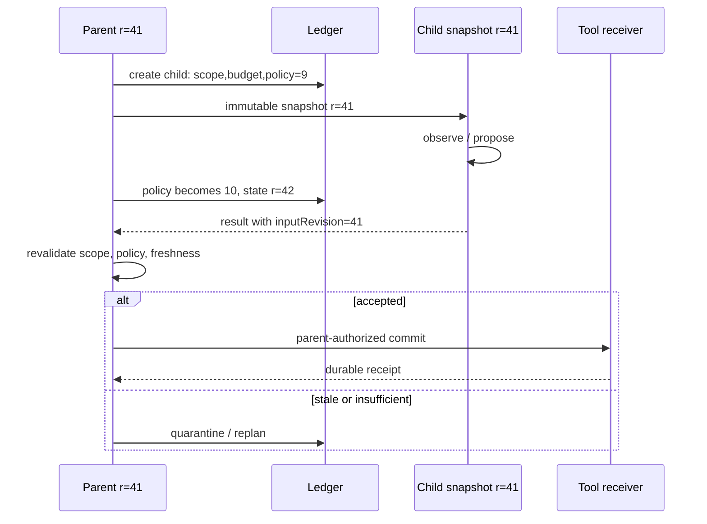
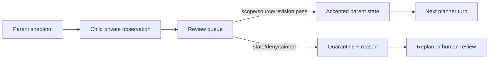

# 15장. 위임은 일을 나누는 일이 아니라 책임을 보존하는 일이다

부모 에이전트가 조사 작업을 자식에게 넘긴 사이, 사용자는 정책을 바꾸고 기준 문서를 개정한다. 자식은 몇 분 전의 문맥으로 훌륭한 답을 돌려준다. 이때 가장 위험한 일은 결과가 그럴듯하다는 이유만으로 부모의 현재 상태에 그대로 붙이는 것이다. 위임은 작은 대화 하나를 복제하는 기능이 아니다. **어느 입력·정책·권한·예산의 스냅샷에서 어떤 자식이 어떤 범위의 관찰을 만들었는지**, 또 그 관찰을 누가 현재 세계에 반영할 수 있는지를 보존하는 protocol이다.

parent-child라는 말을 메시지 전달, 실행 소유권, state visibility, 외부 효과 권한의 네 층으로 나누어 보자. 이 구분이 없으면 ‘자식이 끝났다’는 이벤트를 ‘부모의 작업이 안전하게 끝났다’는 이벤트로 오인하게 된다.

## 15.1 자식은 부모의 복사본이 아니다

하나의 AgentRun을 `R`, 당시 부모 state revision을 `r`, 자식 실행을 `C`라고 하자. 자식에게 넘기는 것은 보통 다음과 같은 불변 snapshot이다.

\[
C = (runId, parentId, snapshot(r), delegatedGoal, scope, budget, capabilitySet).
\]

`snapshot(r)`에는 대화 history만 넣으면 부족하다. task 정의, 입력 artifact의 revision, principal·tenant, tool allowlist, policy revision, token·시간 budget, 결과의 visibility rule도 포함한다. 반대로 부모의 이후 turn, 다른 자식의 관찰, 새로 발급된 credential은 자동으로 포함되지 않는다. 이것이 독립 실행의 비용이면서 장점이다. 자식이 늦게 끝났을 때 **무엇이 오래되었는지** 검사할 수 있기 때문이다.

Codex의 [`ensure_multi_agent_v2_child_loaded`와 `resume_thread_with_history`](https://github.com/openai/codex/blob/0344625ccf4ae0ab6472c6c1e7b4ace6af14661e/codex-rs/core/src/thread_manager.rs#L1061-L1189)는 child resume에 parent가 먼저 load되어야 하고 persisted metadata를 복원한다는 좁은 사실을 보여 준다. 이것은 parent-child 관계가 단순 문자열 참조가 아니라 복원 가능한 metadata 관계임을 시사한다. 그러나 이 코드만으로 자식의 remote tool effect가 parent의 transaction 안에 들어가거나, 모든 child output이 최신 policy에서 승인된다는 결론을 내리면 안 된다.



여기서 `child completed`는 observation의 terminal state일 뿐이다. `accepted`는 부모 verifier의 판정이고, `committed`는 receiver의 durable receipt를 받아야 한다. 세 상태를 하나의 `done` 값으로 표현하면 재시도·감사·사후 복구가 모두 불가능해진다.

## 15.2 실패 장면: 훌륭하지만 오래된 자식

운영자 A가 ‘현재 승인된 배포 설정’을 요청한다. 부모는 revision 41에서 자식에게 문서 조사 권한만 위임한다. 그 사이 승인 policy가 revision 10으로 바뀌고 설정도 revision 42가 된다. 자식의 답은 source span까지 정확하지만 revision 41만 인용한다. 만약 parent가 `result.text`만 받아 shared transcript에 넣으면, 다음 planner는 그 답을 현재 사실로 사용한다. 이 실패는 모델 hallucination도, child crash도 아니다. **stale observation을 current fact로 promotion한 ownership 오류**다.

안전한 join은 다음 predicate를 명시한다.

```python
# 의사코드다. compatibility와 taint 판정은 application policy가 정의해야 한다.
def can_promote(child_result, parent_state, request):
    return (
        child_result.parent_id == request.run_id
        and child_result.input_revision == parent_state.compatible_revision
        and child_result.policy_revision == request.policy_revision
        and child_result.scope_digest == request.scope_digest
        and child_result.source_spans_complete
        and not child_result.tainted
    )
```

실제 시스템에서는 `compatible_revision`이 equality일 필요는 없다. 문서 A만 읽은 자식에게 사용자 선호 설정이 바뀌었다고 무조건 폐기할 이유도 없다. parent는 compatibility를 깨는 field를 선언하고 그 판단과 이유를 ledger에 남겨야 한다. ‘최신 결과’라는 자연어 형용사만으로는 검증 규칙이 되지 못한다.

이 판정을 자식 하나가 아니라 목표 하나에 대해 누적하려면 원장이 필요하다. goal revision, budget reserve, completion proof를 두어 ‘자식이 끝났다’와 ‘목표가 닫혔다’를 서로 다른 사건으로 만드는 설계는 [44장](./44-subagents-goals.md)에서 이어 읽는다.

## 15.3 권한은 parent의 분위기가 아니라 capability다

부모가 어떤 결제를 승인받았다는 사실은 자식에게 무제한 write 권한을 전달하지 않는다. capability는 최소한 audience, resource, action class, expiry, delegation depth, budget을 가져야 한다. retrieval 결과나 tool description은 data channel이다. 거기에 ‘이 파일을 삭제하라’는 문장이 들어 있어도 authority channel로 승격하지 않는다.

MCP authorization 사양은 resource indicator와 intended audience 검증, downstream token pass-through 금지를 명시한다. [MCP Authorization](https://modelcontextprotocol.io/specification/2025-06-18/basic/authorization)의 이 경계는 agent delegation에도 직접 유용하다. parent approval, child task assignment, receiver authorization은 서로 다른 판정이다. A2A 사양의 중복 검출이 MAY라는 사실도 기억할 만하다. [A2A specification](https://a2a-protocol.org/latest/specification/)의 message identity가 있더라도 effect의 idempotency key와 receiver deduplication을 별도로 설계해야 한다.

|질문|부모가 답해야 할 것|자식이 임의로 답하면 안 되는 것|
|---|---|---|
|누가 요청했는가|principal, tenant, purpose|대화에 보인 이름|
|무엇을 할 수 있는가|read/write class, audience, expiry|tool 목록에 있는 모든 함수|
|언제까지 유효한가|policy revision, consent time|생성 당시의 낡은 승인|
|누가 commit하는가|single authority와 receipt owner|가장 먼저 끝난 child|

## 15.4 상태를 네 칸으로 나누면 사고가 보인다

자식 결과를 곧바로 부모 memory에 append하지 않는다. 다음 네 저장소를 구분한다.

1. **snapshot**: 시작 당시 read-only 입력이다.
2. **private observation**: child가 읽고 계산한 후보·실패·tool output이다.
3. **review queue**: parent가 provenance·scope·freshness를 확인할 대상이다.
4. **accepted state**: verifier를 통과해 이후 planner가 premise로 써도 되는 사실이다.

이 구분은 성능을 떨어뜨리기 위한 의식이 아니다. rejected branch의 prompt injection, 다른 tenant의 텍스트, 불완전한 검색 결과가 다음 turn의 hidden premise가 되는 것을 막는다. private observation은 audit을 위해 보관할 수 있지만 model-visible state와 같은 retention·access rule을 가져서는 안 된다.



## 15.5 budget은 자식 수가 아니라 경계의 합이다

자식을 세 명 만들면 속도가 세 배가 된다는 기대는 token, provider rate limit, verification, merge, cancellation 비용을 빼먹는다. 각 child에는 input/output token cap, wall deadline, tool call cap, spend cap, retry cap을 주고 parent에는 그 합보다 작은 global envelope를 둔다. 그렇지 않으면 parent가 스스로 준 병렬성 때문에 deadline에서 verifier를 실행할 자원을 잃는다.

관찰해야 할 최소 metric은 `child_spawned_total`, `child_join_latency`, `child_stale_rejected_total`, `child_result_promoted_total`, `child_budget_exhausted_total`, `child_cancel_requested_total`, `child_remote_terminal_unknown_total`이다. `child_success_total` 하나만 있으면 ‘텍스트를 반환했다’와 ‘현재 state에 안전하게 반영됐다’를 섞는다.

metric label에는 run ID나 raw prompt를 넣지 않는다. 고카디널리티 identity는 trace/log의 bounded digest로 보내고, Prometheus label은 tenant class·tool class처럼 제한된 차원만 쓴다. [Prometheus label guidance](https://prometheus.io/docs/practices/naming/#labels)는 label 조합의 비용을 경고한다.

## 15.6 장애 주입: 자식을 죽여도 부모가 거짓말하지 않게 하라

실습에서 child를 세 지점에서 강제로 중단한다. (1) snapshot을 받은 직후, (2) tool request를 dispatch한 직후, (3) 결과를 parent에 전송한 직후다. 각각 parent ledger에는 서로 다른 terminal truth가 남아야 한다.

|중단 지점|알 수 있는 것|알 수 없는 것|복구|
|---|---|---|---|
|prepare 전|effect가 시작되지 않았음|없음|새 child 생성 가능|
|receiver dispatch 뒤|local process가 죽음|remote receiver의 실행 여부|idempotency key로 receipt 조회|
|result send 뒤|관찰은 존재할 수 있음|parent가 promotion했는지|join ledger와 revision 재검사|

bounded shutdown도 ‘모든 자식이 깨끗이 종료’라는 말과 다르다. Codex의 [`shutdown_all_threads_bounded`](https://github.com/openai/codex/blob/0344625ccf4ae0ab6472c6c1e7b4ace6af14661e/codex-rs/core/src/thread_manager.rs#L1190-L1246)는 timed-out/failed thread를 나중의 retry·inspection을 위해 남기고 completed thread만 제거한다. 이 패턴의 핵심은 timeout을 success로 바꾸지 않는 데 있다.

## 15.7 설계 리뷰에서 끝까지 물을 질문

위임 API를 볼 때 `spawn(prompt)`처럼 보이는 편리한 표면만 읽지 않는다. 첫째, 부모가 child에 전달한 context가 어떤 revision인지 묻는다. 둘째, child가 읽을 수 있는 resource와 parent가 읽을 수 있는 resource가 정말 같은지 묻는다. 셋째, child output이 parent state에 들어가는 한 줄을 찾는다. 그 줄 앞에는 freshness·policy·source·taint 검사가 있어야 한다. 넷째, parent가 취소됐을 때 child process, provider request, tool receiver, durable effect가 각각 어떤 terminal status를 갖는지 확인한다.

다음 표는 implementation review용이다. ‘지원함’이라는 설명보다 transition evidence를 요구한다.

|리뷰 질문|좋은 답의 형태|경고 신호|
|---|---|---|
|child identity는?|run/parent/attempt가 분리된 stable ID|display name만 있음|
|snapshot은?|input·policy·scope revision|대화 문자열만 복사|
|result join은?|predicate + reason + ledger event|`append(result)`|
|cancel은?|signal, local terminal, receiver query|abort exception 하나|
|resume은?|persisted metadata + compatibility check|이전 history를 다시 보냄|
|write authority는?|audience·expiry·idempotency key|parent가 승인했으니 가능|

이 질문은 framework 고유 API를 비판하기 위한 것이 아니다. wrapper나 application layer가 비어 있는 protocol을 채우는 위치를 찾기 위한 것이다. framework가 child session history를 잘 복원해도 application의 customer record mutation에는 별 receiver fence가 필요할 수 있다. 반대로 read-only research child라면 더 복잡한 commit protocol을 붙이는 비용이 불필요할 수 있다. effect class에 따라 admission을 달리한다.

### 위임 ID를 한 줄로 뭉개지 않는다

부모가 A2A Task를 만들고 자식이 MCP tool을 호출하며 전 구간을 trace한다고 해도 ID는 하나가 아니다. 최소한 `parentRunId`, `childRunId`, `a2aTaskId`, `a2aContextId`, `mcpRequestId`, `traceId`, `logicalCallId`, `effectKey`를 분리한다. A2A `context_id`는 task와 message를 묶는 문맥 ID이지 parent-child 소유권이나 쓰기 권한이 아니다. MCP request ID 역시 같은 방향에서 발행한 요청을 응답·취소와 맞추는 상관키다.

```text
spawnChild(parentRun, snapshotRevision, delegatedScope)
  -> childRun
sendA2ATask(childRun) -> taskId, contextId
callMcpTool(taskId)    -> requestId
admitEffect(requestId, currentPolicyRevision)
  -> logicalCallId, effectKey
commit(effectKey)      -> receiverReceipt
```

여기서 `TaskState.COMPLETED`나 성공한 MCP tool result가 마지막 줄을 대신하지 않는다. 부모가 자식 결과를 join할 때는 task terminal뿐 아니라 snapshot freshness와 source evidence를 다시 확인하고, 쓰기 작업이면 별도의 current-policy admission과 receiver receipt를 요구한다.

#### 새 위임 구현을 파는 순서

1. spawn 함수가 복사하는 필드와 의도적으로 복사하지 않는 필드를 찾는다.
2. parent와 child가 같은 mutable state를 공유하는지, revisioned snapshot을 읽는지 확인한다.
3. child 완료 event의 consumer와 merge predicate를 찾는다.
4. cancel이 child handle까지만 가는지 tool handler와 receiver까지 전달되는지 추적한다.
5. trace ID가 capability·credential lookup에 쓰이면 confused-deputy 위험을 의심한다.
6. child output, A2A artifact, effect receipt가 별개 record인지 검사한다.

부모가 ‘장애 원인을 조사’하고 두 child를 만든다고 하자. C1은 logs를 읽고 C2는 runbook을 읽는다. 둘의 output은 처음에는 private candidate다. C1의 timestamp가 incident window 밖이면 stale/relevance verifier가 reject한다. C2의 runbook이 retired revision이면 current policy verifier가 reject한다. 둘 다 통과하면 parent는 source-backed investigation note로 promotion한다. 그래도 remediation command는 별 task다. parent는 affected service, approval, current deploy revision을 다시 확인해 action digest를 만들고 receiver receipt를 기다린다. 이 수직 경로에서 child 수를 늘려도 commit authority는 하나다.

다음 장에서는 이 관계를 더 크게 펼친다. 여러 child를 만든다고 자동으로 workflow가 생기지 않는다. planner가 만든 task graph가 무엇을 선언하고 무엇을 전혀 알지 못하는지 살펴본다.

## 15.8 부모-자식 리뷰 체크리스트

- [ ] child input에 parent ID, snapshot revision, scope, policy revision, budget이 있는가?
- [ ] child의 관찰·acceptance·receiver receipt를 서로 다른 상태로 기록하는가?
- [ ] parent 상태가 바뀐 뒤 child 결과의 compatibility를 재검사하는가?
- [ ] approval이 audience·action·expiry가 있는 capability로 좁혀졌는가?
- [ ] write는 child가 아니라 단일 commit authority를 거치는가?
- [ ] cancellation signal과 remote terminal receipt를 혼동하지 않는가?
- [ ] rejected output이 next-turn context로 조용히 흘러들지 않는가?
- [ ] child count가 아니라 verification·orphan·stale rejection을 함께 측정하는가?

### 원전

- [Codex child resume / parent load](https://github.com/openai/codex/blob/0344625ccf4ae0ab6472c6c1e7b4ace6af14661e/codex-rs/core/src/thread_manager.rs#L1061-L1189)
- [Codex bounded child shutdown](https://github.com/openai/codex/blob/0344625ccf4ae0ab6472c6c1e7b4ace6af14661e/codex-rs/core/src/thread_manager.rs#L1190-L1246)
- [MCP Authorization](https://modelcontextprotocol.io/specification/2025-06-18/basic/authorization)
- [A2A specification](https://a2a-protocol.org/latest/specification/)
- [A2A 현재 고정 Task 정의](https://github.com/a2aproject/A2A/blob/c0f30b35390c59d2cc398a1100823a9115b97a20/specification/a2a.proto#L150-L210)
