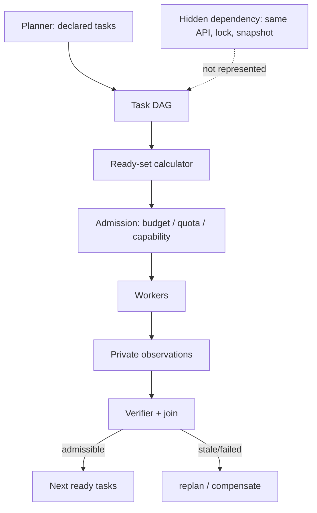
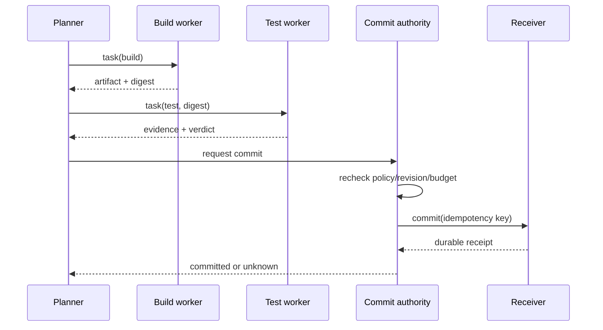
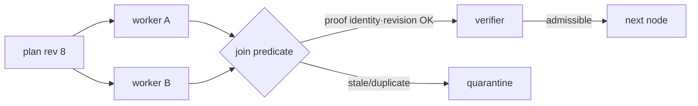

# 16장. Planner의 DAG는 세계의 의존성 그래프가 아니다

‘먼저 검색하고, 그다음 요약하고, 마지막에 보고서를 쓴다’는 계획은 읽기 쉽다. 하지만 작업 A와 B 사이에 edge가 없다고 해서 두 작업이 같은 credential, 같은 rate-limit bucket, 같은 파일, 같은 낡은 snapshot을 공유하지 않는다는 뜻은 아니다. planner-worker 구조는 선언된 의존성을 실행 가능한 상태 전이로 바꾸고, 선언 밖의 충돌은 보수적으로 다뤄야 한다. 일을 병렬로 던지는 것만으로는 모자라다.

## 16.1 task graph가 답하는 질문

task `v`를 `(id, purpose, inputs, outputs, predecessor, budget, effectClass)`로 표현하자. DAG `G=(V,E)`의 edge `(u,v)`는 ‘v가 시작하려면 u의 특정 산출물이 필요하다’는 선언이다. 이것은 scheduler에게 ready set을 계산하게 해 준다.

\[
Ready = \{v \mid \forall u:(u,v)\in E,\ terminal(u)\land admissible(output_u)\}.
\]

그러나 `Ready`가 semantic truth나 resource safety까지 뜻하는 것은 아니다. planner가 graph를 작성할 때 알 수 없던 file lock, vendor quota, prompt injection, 같은 DB row, policy change는 E 밖에 남는다. 그래서 scheduler는 DAG와 별도로 resource class·tenant quota·effect fence·cancellation rule을 살핀다.



LLMCompiler는 planner, task fetching unit, executor로 function-call orchestration을 구성한다. [LLMCompiler](https://arxiv.org/abs/2312.04511v3)의 이 구조는 task 수준 병렬성의 직관을 준다. Graph of Thoughts도 thought를 정점·dependency로 다루고 결합·개선을 제안한다. [Graph of Thoughts](https://arxiv.org/abs/2308.09687v4)는 모든 추론이 선형 chain일 필요가 없다는 점을 보여 준다. 두 연구는 production scheduler의 hidden dependency detector나 effect transaction을 제공한다는 주장과는 구별해야 한다.

## 16.2 실패 장면: edge가 없어서 동시에 망한 두 worker

planner는 A=‘현재 정책 검색’, B=‘배포 상태 조회’를 독립이라고 선언한다. 실제로는 둘 다 동일 provider 계정의 10 RPS quota를 쓴다. A의 query fan-out이 quota를 소진하고 B는 timeout된다. planner는 B가 실패하자 ‘배포가 불명’이라는 결론을 내린다. 그러나 세계가 불확실했던 게 아니다. 자기 스케줄링이 관찰 실패를 만들었다.

해결은 모든 hidden dependency를 마법처럼 추론하는 일이 아니다. tool declaration에 `rateLimitGroup`, `credentialAudience`, `dataSnapshot`, `sideEffectDomain`, `exclusiveKey`를 넣고, 모르는 값은 independent가 아니라 conservative group으로 묶는다. 그러면 ready task라도 admission에서 deferred될 수 있다.

|판정|의미|scheduler 행동|
|---|---|---|
|DAG-ready|선언된 predecessor가 끝남|admission으로 보냄|
|admitted|resource/capability/budget 통과|worker에 dispatch|
|observed|worker가 결과 또는 실패 반환|private queue에 둠|
|admissible|source·revision·schema 통과|downstream 입력으로 승격|
|committed|receiver receipt 확인|effect ledger를 닫음|

## 16.3 worker 결과에는 값보다 계약이 먼저 온다

worker가 `"배포는 정상"`이라는 문자열만 반환하면 planner는 다음 edge를 판단할 수 없다. 결과 envelope에는 task ID, parent run ID, input digest, input revision, tool attempt IDs, output schema revision, source spans, observation time, terminal reason, correlation cohort, resource cost가 필요하다. success는 exit code가 아니라 contract를 만족한 observation이다.

```python
# 축약 예제다. dataclass import와 Replan·Revalidate 구현이 없어 그대로 실행되지는 않는다.
@dataclass
class TaskResult:
    task_id: str
    run_id: str
    input_revision: str
    output: object
    schema_revision: str
    source_spans: list[str]
    terminal: str              # succeeded, failed, cancelled, unknown
    cost: dict
    effect_receipts: list[str]

def downstream_input(result, current_revision):
    if result.terminal != "succeeded":
        return Replan("no admissible observation")
    if result.input_revision != current_revision:
        return Revalidate(result)
    if not result.source_spans:
        return Replan("unsupported result")
    return result.output
```

이 코드는 architecture의 모형이다. 실제 tool receiver의 durability, provider cancel, object-store atomicity를 증명하지 않는다. 코드 조각이 경계를 보이기 때문에 오히려 review 질문이 선명해진다. `terminal=cancelled`인데 worker가 이미 write를 dispatch했다면 effect receipt는 어디서 읽는가? output revision이 다른데 어떤 compatibility rule로 재사용하는가?

## 16.4 병렬성의 이득은 join 이후에 계산한다

planner가 worker 열 개를 만들고 가장 빠른 결과 하나만 사용한다면 나머지 아홉 개의 token·tool time·verification·cancellation 비용은 사라지지 않는다. 병렬 정책의 가치는 first completion이 아니라 deadline 안에 **검증 가능한 결과**가 나올 확률과 비용의 차이다.

\[
Benefit = P(admissible\ before\ deadline)\times savedLatency
- (workerCost + verifyCost + cancellationResidue + contentionCost).
\]

여기에서 correlation을 빼면 숫자가 낙관적으로 변한다. 같은 model revision, prompt, corpus snapshot을 공유한 worker의 세 답은 세 독립 관측이 아니다. equal total budget에서 single worker, independent workers, correlated workers, planner-worker-verifier를 비교해야 한다. 동일 예산의 scripted fixture는 이러한 비교 형식의 반례를 제공하지만, 실제 LLM·tool workload에서의 성능 수치가 아니다.

## 16.5 dataflow가 effect ordering을 대신하지 않는다

build task가 test task보다 먼저 끝나야 한다는 dataflow edge와, production deployment가 승인 receipt 뒤에만 가능한 effect ordering은 다르다. 첫째는 output availability고 둘째는 authority·idempotency·receiver enforcement다. worker가 준비한 deployment plan은 `prepare`일 수 있지만 `commit`은 single authority가 current policy·state revision을 재검사한 뒤 수행한다.



## 16.6 관측: task graph와 trace graph를 섞지 않는다

task graph의 edge는 declared predecessor이고 trace의 span parent는 timing correlation일 수 있다. 둘이 우연히 같아도 one is not proof of the other. worker retry도 새 attempt ID를 가져야 한다. metric은 queue wait, admission reject, active worker, task terminal reason, join latency, verifier latency, stale result rate, orphan effect rate를 기록한다. trace에는 run/task/attempt digest를 link로 넣되 raw prompt·credential·사용자 ID를 attribute나 metric label로 넣지 않는다.

OpenTelemetry는 sampling decision이 span 생성 시점에 이루어지고 downstream 기록·export에 영향을 줄 수 있음을 명시한다. [OpenTelemetry SDK trace specification](https://github.com/open-telemetry/opentelemetry-specification/blob/29ae8c7710d2ea52e21a5ff81fb1cd657bcd3306/specification/trace/sdk.md#L288-L346) 때문에 trace 누락을 task 미실행 증거로 읽으면 안 된다. ledger의 durable terminal record와 telemetry는 서로 보완한다.

## 16.7 실습: 계획을 실행 전에 깨뜨려 보기

다음 순서로 한 workflow를 review한다.

1. 각 task의 input/output revision과 source requirement를 표로 쓴다.
2. edge마다 ‘어떤 output field 때문에 필요한가’를 문장으로 쓴다.
3. tool마다 quota·credential·snapshot·effect domain을 적는다.
4. 두 task가 edge 없이 같은 resource group을 쓰면 admission group을 만든다.
5. worker 하나를 result 전송 직전 중단하고 join이 `unknown`을 유지하는지 확인한다.
6. policy revision을 join 직전에 바꾸고 stale result가 promotion되지 않는지 확인한다.

|검사|통과 기준|실패하면|
|---|---|---|
|cycle|ready set이 0인데 unfinished task 없음|plan reject|
|schema|downstream이 typed result만 읽음|replan|
|budget|verify reserve가 남음|새 fork 중지|
|effect|prepare와 commit authority 분리|manual approval|
|orphan|receipt 조회 전 success 금지|reconcile queue|

## 16.8 계획을 artifact로 취급하는 법

planner output을 자유 텍스트 checklist로만 남기면 worker가 무엇을 보장했는지 사후에 알 수 없다. plan 자체에 schema revision, task IDs, predecessor IDs, input/output contracts, resource declarations, expected effect class, stop conditions를 둔다. plan을 수정하면 새 plan revision을 만들고, 이미 실행된 task를 조용히 새 graph의 정점으로 재해석하지 않는다. 이 방식은 model planner가 완벽한 DAG를 낸다는 가정이 아니라, 잘못된 계획을 관측 가능하게 만든다.

plan diff에서 특히 보는 것은 edge addition/removal, tool capability 확장, budget change, snapshot replacement, acceptance predicate change다. 단순한 task 제목 변경과 ‘deploy task가 test에 의존하지 않음’은 같은 edit가 아니다. 후자는 execution safety를 바꾼다. policy 변화가 plan과 함께 생기면 existing worker result가 어느 policy에서 산출됐는지 다시 확인한다.

### planner를 평가하는 실용 지표

task completion 수는 planner 품질의 약한 지표다. 더 유용한 지표는 declared edge 뒤에 발견된 hidden conflict 비율, replan reason 분포, verifier가 막은 invalid downstream input, budget reserve 고갈, orphan attempt, plan revision churn이다. 높은 parallelism이 낮은 join latency를 동반하지 않으면 planner는 concurrency를 만들었을 뿐 usable work를 만들지 못했을 수 있다. 반대로 deliberate serial fence가 p99를 높여도 irreversible effect 오류를 줄인다면 그 비용은 최적화 실패로 분류하면 안 된다.

### 수직 walkthrough

‘새 모델 문서의 호환성을 평가하라’는 task를 생각하자. planner는 fetch documentation, inspect schema, run read-only compatibility check, draft report를 만든다. documentation fetch와 schema inspect는 declared independent일 수 있지만 같은 vendor quota와 source snapshot을 공유한다. admission은 같은 quota group으로 묶는다. compatibility check는 둘의 admissible output만 입력으로 받는다.

draft report는 source span이 없는 claim을 포함하면 verifier가 reject한다. publish는 human approval과 current policy revision을 다시 확인한 뒤 수행한다. graph는 이 순서를 보이지만, source freshness와 authority는 별 gate가 보장한다.

### merge law가 없는 DAG는 순서가 숨어 있는 목록이다

병렬 worker 결과를 합치는 함수 (m)에는 적어도 결합법칙 (m(m(a,b),c)=m(a,m(b,c)))이 필요한지 검토한다. scheduler가 완료 순서를 보장하지 않는데 reducer가 `last write wins`라면 결과는 네트워크 지연에 따라 바뀐다. 교환법칙까지 필요하다면 `m(a,b)=m(b,a)`를 property test로 확인한다. 중복 delivery가 가능한 queue라면 멱등성 (m(a,a)=a)도 필요하다.

```python
# 의사코드다. reducer의 법칙과 consumed_proofs 갱신은 별도 구현·검증 대상이다.
def join(parent, child):
    assert child.plan_revision == parent.plan_revision
    assert child.input_digest == parent.expected_digest[child.node_id]
    assert child.proof_id not in parent.consumed_proofs
    return reducer(parent, child)  # reducer의 algebraic law는 별도 test
```



MCP tool result나 A2A Task 완료는 node input을 얻었다는 신호일 수 있지만 downstream effect의 영수증은 아니다. planner가 취소한 worker도 이미 queue chunk나 receiver write를 남겼을 수 있다. fault test에서는 loser cancel 뒤 CPU·queue·tool attempt가 얼마나 더 진행됐는지 따로 센다.

#### DAG fault checklist

- 같은 proof ID를 두 worker가 돌려줄 때 한 번만 소비되는가?
- 완료 순서를 뒤집어도 join 결과가 같은가?
- plan revision 변경 뒤 late result가 다음 node를 열지 못하는가?
- cancel acknowledgement 뒤 residual work와 비용이 계측되는가?
- effect node는 current policy와 receiver fence를 다시 확인하는가?

### 장을 닫기 전 체크리스트

- [ ] DAG edge가 output dependency를 구체적으로 설명하는가?
- [ ] edge 부재를 resource independence 증명으로 읽지 않는가?
- [ ] ready, admitted, observed, admissible, committed 상태가 분리되는가?
- [ ] 결과 envelope에 revision·schema·source·attempt identity가 있는가?
- [ ] worker budget이 verifier reserve를 잠식하지 않는가?
- [ ] retry가 같은 effect identity를 중복 commit하지 않는가?
- [ ] trace sampling의 빈칸을 실행 부재로 해석하지 않는가?
- [ ] DAG의 terminal node가 아니라 별도의 completion proof가 목표를 닫는가? ([44장](./44-subagents-goals.md))

### 원전

- [LLMCompiler](https://arxiv.org/abs/2312.04511v3)
- [Graph of Thoughts](https://arxiv.org/abs/2308.09687v4)
- [OpenTelemetry trace SDK](https://github.com/open-telemetry/opentelemetry-specification/blob/29ae8c7710d2ea52e21a5ff81fb1cd657bcd3306/specification/trace/sdk.md#L288-L346)
- [pi-agent tool execution ordering](https://github.com/badlogic/pi-mono/blob/853a80d26c90a14c1886f0ebb8ffaae133ca2185/packages/agent/src/agent-loop.ts#L409-L553)
- [MCP tool result와 tool error](https://github.com/modelcontextprotocol/modelcontextprotocol/blob/3ff697dcbea0804f3f397b864cfbbaaa10cba71a/docs/specification/2025-06-18/server/tools.mdx#L384-L430)
