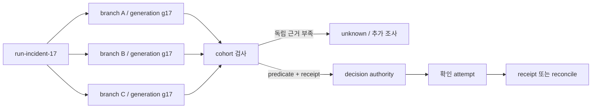
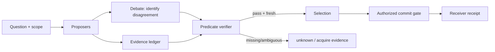
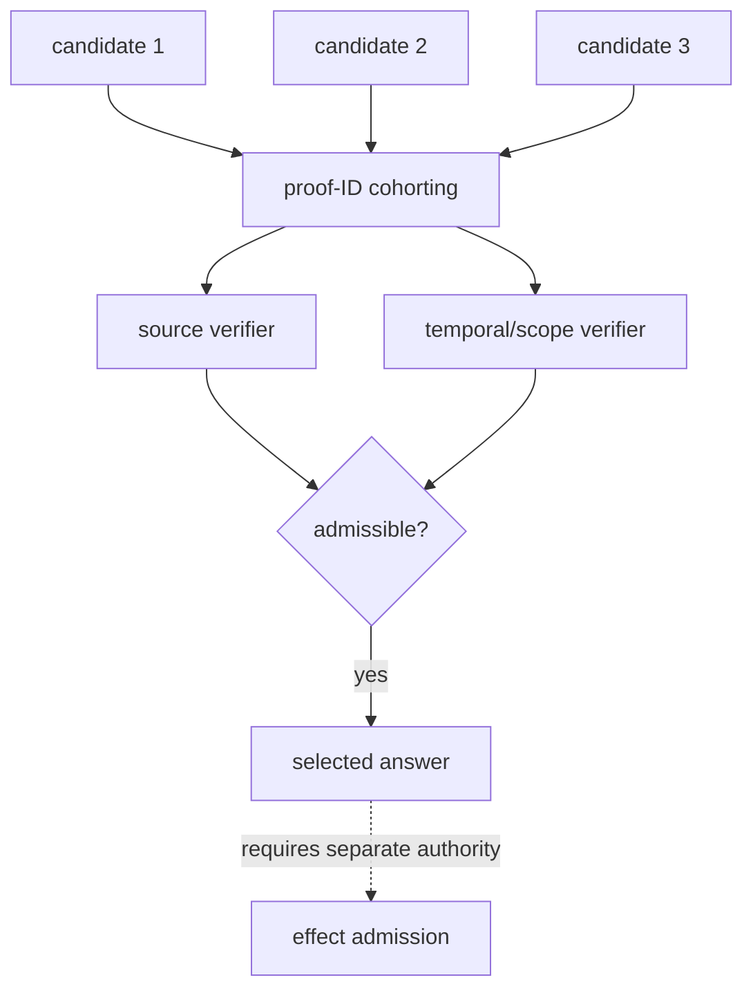

# 17장. 세 명이 같은 답을 말해도 증거가 세 개는 아니다

## 17.0 한 실행에서 ‘찬성 세 표’가 멈추는 자리

운영자가 "지금 배포를 중단해야 하는가"를 묻는다. 하나의 AgentRun이 `run-incident-17`로 시작하고, 조사 branch 셋이 같은 장애 보고서 snapshot을 읽는다. 세 branch는 모두 중단을 권한다. 화면은 곧바로 결론을 낼 수 있어 보인다. 그러나 실행기는 아직 어느 branch에도 결정을 확정할 권한을 주지 않았다. 셋의 문장, 셋의 vote, 실제로 확인할 수 있는 근거는 서로 다른 객체이기 때문이다.

이 장에서는 매번 같은 좌표를 사용한다. `run_id`는 전체 요청, `branch_id`는 조사 경로, `state_generation`은 branch가 읽은 입력 묶음, `decision_authority`는 결론을 채택할 주체, `attempt_id`는 실제 확인 작업, `receipt_id`는 그 확인 또는 외부 효과를 나중에 다시 찾게 하는 기록이다. 이 좌표가 없으면 "세 agent가 합의했다"는 문장은 재현할 수 없는 요약이 된다.



vote는 후보를 좁히는 입력이 될 수 있다. 다만 `decision_authority`가 `state_generation`, source cohort, 검사 predicate를 다시 묶기 전에는 effect를 시작할 수 없다.

세 agent가 ‘승인되어도 된다’고 답하고 judge가 0.97 confidence를 준다. 실제로는 셋이 같은 오래된 문서, 같은 prompt template, 같은 정책 누락을 공유했을 수 있다. 이 장의 출발점은 단순하다. 말의 수와 독립 증거의 수는 다르다. debate, vote, verifier, commit을 한 덩어리로 부르면 다수결이 사실 검증처럼 보이고, fluent judge가 receiver의 receipt를 대신하게 된다.

## 17.1 네 가지를 분리하면 무엇을 측정할지 보인다

|기능|입력|출력|하지 않는 일|
|---|---|---|---|
|debate|서로의 주장과 반박|수정된 주장·쟁점|독립 source를 자동 생성|
|vote|후보 집합|선택 또는 분포|진실·commit 증명|
|verifier|predicate와 evidence|pass/fail/unknown+reason|새로운 권한 발급|
|commit|authorized digest|receiver receipt|사실성 평가|

Self-consistency는 여러 reasoning path를 샘플링해 answer를 고르는 접근이고, [Self-Consistency](https://arxiv.org/abs/2203.11171)는 이 선택의 조건을 다룬다. [Multiagent Debate](https://arxiv.org/abs/2305.14325)는 debate가 factuality·reasoning에 미칠 수 있는 영향을 연구한다. 이는 어떤 production 요청에서도 agent 수를 늘리면 정확해진다는 보장이 아니다. model revision, sampling temperature, prompts, judge, task split, evidence access가 바뀌면 결과의 의미도 바뀐다.

Jikji의 고정 debate 구현은 proposal, `AGREE` 처리, `WINNER:` 선택 같은 control flow를 제공한다. 이 사실은 parsing과 turn loop가 있다는 뜻이다. 그것이 factual predicate, calibrated uncertainty, 독립 evidence, durable decision record를 자동으로 만든다는 뜻은 아니다. 특히 텍스트 `AGREE`는 surface token일 뿐, vote로 볼 수 없다.



## 17.2 실패 장면: poisoned cohort의 만장일치

세 proposer가 같은 corpus snapshot에서 ‘배포가 rollback되었다’는 문장을 읽는다. 실제 revision에는 rollback 취소가 추가됐지만 index ingest가 늦었다. debate는 서로의 같은 인용을 강화하고 judge는 consensus를 본다. 이때 consensus coefficient를 아무리 계산해도 source cohort가 하나면 독립 관찰은 하나다.

correlation cohort는 agent 이름이 아니라 `(model revision, prompt template, retriever/index generation, corpus snapshot, credential scope)`로 기록한다. voter 셋이 서로 다른 seed를 써도 tuple의 대부분이 같으면 오류가 함께 움직일 수 있다. ‘3표 중 3표’는 count일 뿐 confidence calibration이 아니다.

\[
N_{effective} \leq \text{number of distinct evidence cohorts}.
\]

이 식은 통계적 estimator가 아니라 운영 경고다. downstream gate는 같은 source revision만 반복한 표를 independent corroboration으로 가산하지 않아야 한다. 독립성을 요구하면 source family·retriever generation·model provider·tool receiver를 의도적으로 다양화하고, 각 결과에 그 provenance를 남긴다.

## 17.3 verifier는 말 잘하는 마지막 agent가 아니다

검증기는 가능한 한 predicate를 갖는다. 예를 들어 ‘승인됨’은 `principal`, `resource`, `action`, `policyRevision`, `asOf`, `approvalReceipt`가 모두 맞는지를 검사한다. ‘문서가 뒷받침함’은 source revision과 span이 claim을 실제로 포함하는지를 검사한다. ‘배포가 끝남’은 deployment log가 아니라 receiver-side receipt와 target revision을 요구한다.

```python
> **의사코드다.** `receipts`와 `policy`의 조회·판정 계약을 설명하려는 예제다.
def verify_approval(claim, policy, receipts, as_of):
    if claim.as_of != as_of:
        return Unknown("time mismatch")
    receipt = receipts.lookup(claim.approval_id)
    if receipt is None or receipt.policy_revision != policy.revision:
        return Unknown("no fresh approval receipt")
    if not policy.allows(claim.principal, claim.action, claim.resource):
        return Fail("scope denied")
    return Pass(receipt.digest)
```

여기서 `Pass`도 effect가 일어났다는 뜻이 아니다. 그것은 commit gate에 전달할 approval이다. receiver가 idempotency key를 적용하고 durable receipt를 돌려준 뒤에야 committed다. 자연어 judge가 ‘도구 호출은 옳다’고 말하는 것은 verifier의 후보 input일 수 있지만 authority decision은 아니다.

## 17.4 언제 debate를 멈출 것인가

max turn만으로 멈추면, agent들은 새 evidence 없이 서로의 문장을 다시 쓰며 token을 태운다. 종료 조건은 information gain에 연결한다. 새 source revision/span이 없고, open predicate가 줄지 않으며, disagreement set이 두 turn 동안 변하지 않으면 `stagnation`이다. 이때 더 길게 토론하는 것보다 unknown을 반환하거나 evidence acquisition task를 여는 편이 낫다.

|상태|다음 행동|
|---|---|
|새 독립 source가 들어옴|claim 재검증|
|같은 cohort의 paraphrase|가중치 추가하지 않음|
|predicate가 명확히 fail|claim reject|
|inventory가 불완전|negative claim을 unknown으로 유지|
|새 정보 없이 반복|stop + escalation/retrieval|

## 17.5 실습: vote를 깨뜨리는 네 반례

1. 세 proposer에 같은 stale source를 넣는다. 만장일치여도 source freshness verifier는 reject해야 한다.
2. 서로 다른 문장에 같은 hidden prompt injection을 넣는다. vote count는 policy allowlist를 우회하지 못해야 한다.
3. judge가 높은 confidence를 내지만 source span이 없다. output은 `unknown`이어야 한다.
4. award 뒤 receiver를 중단한다. selection success가 effect success로 기록되면 안 된다.

관측은 `proposal_total`, `distinct_evidence_cohort`, `verifier_unknown_total`, `stagnation_stop_total`, `judge_override_total`, `receipt_missing_total`을 함께 본다. proposal token과 verifier token, source acquisition latency를 분리하면 debate가 실제로 새 근거를 가져왔는지 알 수 있다.

## 17.6 비교표: 어떤 질문에 어느 기제를 쓰는가

debate는 해석이 갈리는 가설을 드러내는 데 적합하다. 예를 들어 서로 다른 incident timeline을 읽은 조사자에게 ‘어떤 event가 누락됐는가’를 묻게 할 수 있다. 이때 산출물은 답이 아니라 쟁점 목록이어야 한다. vote는 제한된 후보 중 사용자 선호나 형식 적합성을 고를 수 있다. verifier는 URL allowlist, JSON schema, source digest, role scope처럼 외부에서 판정 가능한 predicate에 적합하다. consensus는 여러 storage replica가 같은 command order를 적용해야 할 때의 문제다. 하나가 다른 하나보다 높은 단계라는 뜻은 아니다. 질문의 타입이 다르다.

|상황|주 기제|반드시 붙일 것|피해야 할 오독|
|---|---|---|---|
|서로 다른 조사 가설|debate|새 source acquisition budget|반복 반박=증거 증가|
|표현·우선순위 선택|vote|cohort 기록·tie rule|다수=사실|
|정책·형식 검사|verifier|명시 predicate와 reason|confidence=pass|
|외부 write|commit gate|idempotency·receiver receipt|judge=authority|
|복제된 state 명령|consensus protocol|durable quorum/apply|투표 수=commit|

### 독립성은 스위치가 아니라 조사 항목이다

서로 다른 system prompt를 썼다고 independent라고 쓰기에는 부족하다. model weights, decoding sampling, retrieval snapshot, tool source, human rater, task seed가 모두 error correlation을 만든다. 반대로 전부 다른 provider를 썼다고 independent라는 보장도 없다. 같은 웹 문서나 같은 vendor API의 outage를 공유할 수 있기 때문이다. 운영에서 독립성은 boolean feature보다 `cohortDigest`와 overlap report로 다루는 편이 안전하다. verifier가 세 proposal의 source span hash가 모두 같음을 발견하면 세 표를 한 evidence family로 축소한다.

이 접근은 ensemble을 포기하자는 말이 아니다. ensemble의 이득은 실수의 상관이 충분히 낮고, 선택 비용이 이득보다 작고, verifier가 승격을 통제할 때에만 나타난다. 따라서 실험은 average accuracy만 보고 끝내지 않는다. 동일 task·동일 총 token budget에서 single proposer, correlated three proposer, intentionally diverse proposer, proposer+predicate verifier를 비교하고 raw generation·source cohort·stop reason을 보관한다. 그래야 좋은 평균이 독립 근거 때문인지 더 많은 token 때문인지 구별된다.

### verifier failure도 관찰해야 한다

verifier는 false positive만 낸다고 생각하기 쉽다. 그러나 schema가 너무 좁으면 정확한 관찰을 버리고, source parser가 revision 변경을 못 따라가면 fresh evidence를 missing으로 분류하며, policy cache가 오래되면 올바른 request를 deny한다. verifier가 `unknown`을 많이 반환하는 것은 언제나 품질 저하가 아니라 해당 predicate의 data inventory가 부족하다는 신호일 수 있다. 이 때문에 pass rate 외에 `unknown by reason`, `source parser drift`, `policy revision age`, `manual override outcome`을 기록한다.

사람 review도 magic verifier가 아니다. reviewer에게 보여 준 source revision, time budget, approval scope, 선택지를 남기지 않으면 사람이 무엇을 승인했는지 재현할 수 없다. human-in-the-loop은 권한의 주체를 명확히 할 수 있지만, receipt 없이 외부 효과의 성공을 증명하지 않는다.

### 수직 사건 기록 예시

한 claim의 ledger에는 claim ID, proposer attempt, prompt/model cohort, input corpus snapshot, source span digest, verifier predicate revision, verdict/reason, selection rule, approval ID, action digest, receiver receipt를 시간순으로 남긴다. 이 구조가 있으면 ‘왜 이 답을 채택했는가’와 ‘왜 외부 변경이 일어났는가’를 다른 질문으로 복원할 수 있다. 반증도 같은 수준으로 남긴다. source contradiction, scope deny, timeout, inventory incompleteness는 서로 다른 reason이다. timeout을 disagreeing vote로 세면 시스템은 network failure를 epistemic disagreement로 오해한다.

judge threshold를 바꿀 때는 holdout과 shadow traffic에서 precision/recall, unknown rate, human override, latency·token cost, cohort diversity를 함께 본다. threshold revision도 claim과 연결한다. 그래야 거절률 변화가 model drift인지 verifier policy 변화인지 구별된다.

### 실무 설계의 순서

처음부터 debate prompt를 다듬기보다 verifier가 읽을 evidence envelope를 먼저 정한다. claim type마다 required evidence를 표로 만들고, source revision과 span이 없는 proposal은 debate room에 들어와도 commit 후보가 되지 못하게 한다. 그 뒤에 proposer diversity를 늘리고, 마지막에 turn budget과 stop rule을 조정한다. 이 순서는 fluent consensus를 먼저 만든 뒤 나중에 근거를 찾는 역전을 막는다.

운영자는 disagreement 자체를 버그로 보지 않는다. 서로 다른 source revision, as-of, entity resolution이 발견되면 disagreement는 조사해야 할 input이다. 반대로 identical cohort가 같은 문장을 반복하면 agreement도 정보가 아닐 수 있다. 좋은 dashboard는 agreement rate 옆에 unique source family, verifier pass/unknown, stale-source rejection, post-selection receipt rate를 함께 보인다.

### review 질문

“judge가 틀렸다면 누가 멈추는가?”, “verifier source parser가 실패하면 false인가 unknown인가?”, “각 proposer가 사용한 evidence가 같은 것임을 어떻게 아는가?”, “winner가 선택된 뒤 policy가 바뀌면 무엇을 재검사하는가?”에 코드와 ledger field로 답할 수 있어야 한다. 답이 prompt 문장뿐이라면 protocol은 아직 구현되지 않은 것이다.

### 배포 전 최소 rehearsal

새 debate flow를 배포하기 전에는 같은 task를 single-agent baseline과 비교한다. total token과 wall deadline을 맞추고, source retrieval을 고정한 뒤 debate가 실제로 verifier pass claim을 늘렸는지 본다. 다음에는 source snapshot을 일부러 stale로 바꾸고, proposer 수가 늘어도 stale rejection이 작동하는지 본다. 마지막으로 receiver를 failure injection하여 selection event가 commit metric에 섞이지 않는지 확인한다. 이 rehearsal의 목적은 최고 점수를 만드는 것이 아니라 protocol의 거짓 성공 경로를 찾는 데 있다.

### 장을 닫기 전 체크리스트

- [ ] vote count와 independent evidence cohort를 따로 기록하는가?
- [ ] verifier predicate가 source·time·scope·receipt를 명시하는가?
- [ ] judge confidence가 commit authority로 승격되지 않는가?
- [ ] 새로운 근거 없는 debate의 stop rule이 있는가?
- [ ] negative claim은 complete inventory 없이는 unknown인가?
- [ ] 선택, approval, receiver receipt가 별 상태인가?

### 표 수가 아니라 독립 proof 수를 센다

세 agent가 같은 검색 결과와 같은 prompt를 읽었다면 3표가 아니라 하나의 evidence cohort일 수 있다. proof identity를 `(source digest, extraction span, retrieval snapshot, verifier predicate)`로 만들고 동일 identity의 표는 한 번만 센다.

\[
N_{\text{effective}}=\left|\{\operatorname{proofId}(v_i)\}\right|,
\qquad
\text{accept}=N_{\text{effective}}\ge k \land \bigwedge_j P_j(e).
\]

verifier가 candidate를 만든 모델의 hidden state, 같은 summary, 같은 retrieval top-k를 공유하면 오류도 공유한다. 독립성은 agent 이름이 아니라 입력·모델·도구·근거 경로의 분리로 측정한다. judge가 답을 선택하는 권한과 외부 effect를 승인하는 권한도 분리한다.



fault 주입에서는 동일 source를 표현만 바꿔 5표로 만들기, verifier timeout, inventory truncation, stale source, judge와 candidate의 prompt 공유를 시험한다. MCP 성공 응답과 A2A artifact 개수는 proof 독립성 지표가 아니다.

## 17.7 실행: vote가 아니라 판정 기록을 시험한다

앞의 장면을 모델 호출 없이 먼저 고정한다. 이 책의 동반 fixture `research/agents/fixtures/test_debate_verifier_wave7.py`는 network나 LLM을 호출하지 않는 결정적 반례다. 그러므로 이 실습이 debate 품질·token 비용·judge calibration을 측정한다고 읽으면 안 된다. 대신 **같은 cohort의 만장일치가 독립 확인으로 승격되지 않는가**, 그리고 **confidence만 높은 판정이 receipt 없이 통과하지 않는가**를 실패-폐쇄 방식으로 검사한다.

```bash
uv run --with pytest --with rdflib \
  pytest -q research/agents/fixtures/test_debate_verifier_wave7.py
```

통과 oracle은 다섯 test다. 그중 `test_unanimous_correlated_votes_are_not_independent_confirmation`은 `(False, "correlated-evidence-cohort")`를, `test_verifier_requires_predicate_and_receipt_not_confidence_alone`은 predicate 없는 0.99 confidence를 거절해야 한다. `test_stopping_is_an_explicit_disposition`은 두 round 동안 새 독립 근거가 0이면 `stopped-information-stagnation`을 요구한다. 즉 성공 메시지가 아니라 `run_id`, `branch_id`, `evidence_cohort`, `predicate revision`, `stop disposition`이 이 실습의 관측값이다.

실제 코드의 debate control flow를 함께 읽으려면 [Jikji의 고정 revision `debate.go`](https://github.com/epoko77-ai/jikji/blob/9c47ef0b5e261914cbf1b96ab9b8ee82e1f581a6/pkg/agent/debate.go#L1-L240)를 연다. 이 코드는 한 구현의 제어 흐름을 보여 줄 뿐, 위 fixture의 cohort gate나 receipt 규칙을 자동으로 제공하지 않는다. 코드가 보장하는 범위와 우리가 추가하는 결정 계약을 분리하는 것이 중요하다.

### 복구: 결론을 재생성하지 말고 판정부터 재개한다

verifier가 timeout이면 `approved`로 바꾸지도, 반대 vote로 세지도 않는다. `verification_unknown`을 branch terminal로 남기고, 같은 `state_generation`과 같은 predicate를 가진 새 `attempt_id`를 만든다. branch가 stale generation을 읽었다면 새 조사 branch를 만들되, 이전 답을 새 evidence로 재사용하지 않는다. 외부 중단 command가 이미 보내졌다면 decision record와 receiver receipt를 먼저 조회한다. receipt가 없을 때 재시도할 수 있는지는 13장에서 다룬 idempotency contract의 질문이며, debate의 자신감이 답해 주지 않는다.

### 원전

- [Self-Consistency](https://arxiv.org/abs/2203.11171)
- [Improving Factuality and Reasoning through Multiagent Debate](https://arxiv.org/abs/2305.14325)
- [Jikji debate control-flow anchor](https://github.com/epoko77-ai/jikji/blob/9c47ef0b5e261914cbf1b96ab9b8ee82e1f581a6/pkg/agent/debate.go#L1-L240)
