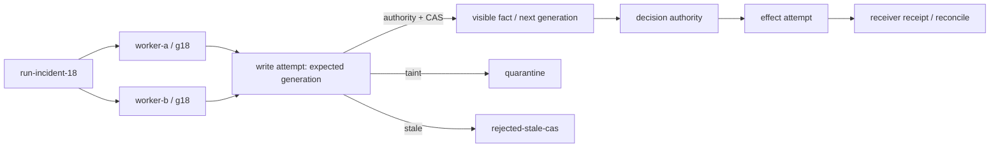
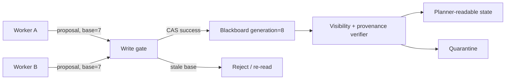

# 18장. Shared state는 합의가 아니라 쓰기 권한의 문제다

## 18.0 같은 판을 본 두 worker가 다른 결론을 쓸 때

`run-incident-18`은 두 조사 branch를 만든다. 둘은 `state_generation=g18`의 같은 board를 읽고, A는 안전한 observation을, B는 오래된 observation을 쓴다. 뒤늦게 B의 결과에서 prompt injection 흔적도 발견된다. 여기서 board는 둘 중 더 그럴듯한 문장을 고르는 공간이 아니다. 누가 쓰는가, 어느 generation을 기준으로 썼는가, 어느 record가 decision authority에 보이는가를 가르는 경계다.

이 장의 수직 좌표는 `run_id → worker branch/task → board generation → writer authority → write attempt → accepted record 또는 quarantine → terminal/recovery`다. effect가 필요해지는 순간 board write와 receiver receipt를 다시 분리한다. board에 `approved`라고 쓴 사실만으로 외부 변경이 끝난 것은 아니다.



blackboard는 여러 worker가 한 판에 관찰과 가설을 올리고, 다른 worker가 이를 이어받는 구조다. 장점은 분명하다. 긴 작업에서 모든 agent가 서로에게 직접 메시지를 보낼 필요가 없다. 위험도 분명하다. 늦은 writer가 새 결과를 덮고, 권한 없는 관찰이 사실처럼 보이며, 취소된 branch의 텍스트가 다음 planner의 전제가 된다. shared state를 설계할 때는 ‘모두가 볼 수 있다’보다 **누가 어떤 generation에 무엇을 쓸 수 있는가**를 먼저 정해야 한다.

## 18.1 한 key의 값만 저장하면 사라지는 다섯 가지

blackboard record에는 value 외에 `key`, `tenant`, `generation`, `writer identity`, `input revision`, `classification`, `provenance`, `taint`, `expiry`, `visibility`가 필요하다. 단순 dict에 `answer`를 넣으면 stale overwrite와 cross-tenant read가 정상 경로가 된다.



CAS(compare-and-swap)는 `baseGeneration == currentGeneration`일 때만 write를 허용한다. 이것은 local lost update를 좁게 막는다. CAS가 있다고 distributed consensus, replica convergence, durable cross-region quorum이 생기는 것은 아니다. 이 장의 실행 fixture도 tenant write authority, stale-generation rejection, taint quarantine, terminal oracle를 가진 결정론적 shared-state harness이며, CRDT/consensus benchmark가 아니다.

## 18.2 실패 장면: 늦은 조사자가 새 정책을 지운다

worker A와 B가 generation 7을 읽는다. A가 최신 policy revision을 찾아 generation 8로 올린다. B는 오래 걸린 검색을 끝내고 generation 7의 문맥에 맞는 요약을 쓴다. last-write-wins라면 B가 A를 덮는다. CAS라면 B는 stale write rejection을 받고 반드시 다시 읽거나 proposal을 버린다. 이 failure는 모델이 틀려서가 아니라 time ownership을 잃어서 생긴다.

`stale`와 `tainted`도 다르다. stale은 valid했지만 base generation이 지난 결과다. tainted는 untrusted tool output, 다른 tenant text, schema violation처럼 planner-visible state로 승격되면 안 되는 결과다. quarantine은 삭제와 동의어가 아니다. 감사용 보존이 필요한 경우에도 visibility와 access rule은 더 좁아야 한다.

|상태|의미|허용되는 다음 행동|
|---|---|---|
|proposal|worker의 private observation|verify, discard|
|accepted|현재 generation에서 검증됨|planner read|
|stale|base가 오래됨|re-read, revalidate|
|tainted|신뢰 경계 위반|quarantine, investigate|
|tombstoned|삭제/철회됨|read 금지, purge workflow|

## 18.3 reducer와 CRDT를 혼동하지 말 것

LangGraph의 [`BinaryOperatorAggregate`](https://github.com/langchain-ai/langgraph/blob/11ee185999b86bfea2d8c0e69cef9a5e37acf686/libs/langgraph/langgraph/channels/binop.py#L65-L155)는 값을 순서대로 operator에 적용하는 local reducer의 한 구현 예다. reducer가 존재한다고 replica가 순서·중복과 무관하게 수렴하는 것은 아니다. state-based CRDT의 merge에는 commutative, associative, idempotent law가 필요하고 replica가 같은 update 집합을 받는 anti-entropy 조건도 필요하다. [Shapiro et al.](https://hal.inria.fr/inria-00555588/document)의 조건은 바로 이 차이를 드러낸다.

특히 agent의 자연어 note를 set union으로 합치면 수학적으로는 merge될 수 있어도 의미적으로는 모순된 instruction이 함께 살아남는다. CRDT law와 policy semantics는 별개다. 어떤 fact가 accepted state에 들어갈지는 merge algebra가 아니라 verifier와 authority가 결정한다.

## 18.4 terminal oracle: worker 종료가 record 승인인가

worker가 exit 0으로 끝났다는 사실은 blackboard write가 durable하고 visible하다는 증거가 아니다. write attempt, storage acknowledgement, visibility generation, planner read, effect receipt를 분리한다. worker가 죽은 뒤 unknown write residue가 남을 수 있으면 새로운 worker가 같은 key를 재시도하기 전에 write ledger를 조회한다.

```python
> **의사코드다.** board의 권한 검사·격리·CAS 저장 계약은 구현체가 제공해야 한다.
def publish(board, proposal, writer):
    assert writer.tenant == proposal.tenant
    if proposal.tainted:
        return board.quarantine(proposal, reason="untrusted")
    if not board.can_write(writer, proposal.key):
        return Denied("write authority")
    return board.compare_and_swap(
        key=proposal.key,
        expected_generation=proposal.base_generation,
        record=proposal,
    )
```

여기서 반환 `Applied`는 해당 board backend의 write acknowledgement일 뿐, backup/replica/검색 인덱스까지 전파됐다는 보장은 아니다. retention과 deletion은 20장의 memory lifecycle, distributed replication은 21장 이후의 graph·storage 설계와 연결해 별도 검증해야 한다.

## 18.5 관측과 장애 주입

`blackboard_cas_conflict_total`, `blackboard_taint_quarantined_total`, `blackboard_visibility_generation`, `blackboard_cross_tenant_denied_total`, `blackboard_stale_read_total`, `blackboard_unknown_write_total`을 둔다. value 자체나 raw prompt를 metric label에 넣지 않는다. trace에는 board key의 keyed digest와 generation을 남긴다.

실습은 worker 둘이 같은 generation을 읽고 서로 다른 proposal을 쓰게 한다. 첫 writer만 success여야 하고 두 번째는 conflict여야 한다. 이어서 tainted proposal을 넣어 planner read path에 도달하지 않는지 확인한다. 마지막으로 write ack 직후 worker를 죽여 read-after-write의 terminal truth를 명시한다. 결과가 모호하면 success가 아니라 reconciliation 대상이다.

## 18.6 blackboard의 읽기 경계와 retention

shared board에 쓴 것이 곧 모든 agent가 읽어도 되는 문서는 아니다. worker의 private trace에는 tool argument, customer text, credential-adjacent metadata가 섞일 수 있다. accepted fact에는 source span과 policy revision만 노출하고, raw observation은 별 access class에 둔다. 한 tenant의 board key를 다른 tenant query가 candidate로조차 보지 않게 하는 prefilter와, 이미 찾은 record를 읽기 전에 막는 authorization은 함께 필요하다.

삭제도 `DELETE key` 한 번으로 끝나지 않는다. primary board, embedding derivative, append-only audit log, cache, backup, replica의 lifecycle은 다르다. tombstone은 일반 read에서 제거됐다는 표시일 수 있지만 physical purge receipt는 아니다. 법적 삭제나 tenant offboarding을 설계할 때는 각 copy의 owner·retention·purge proof를 따로 나열한다. board fixture가 local SQLite에서 record를 지운다는 관찰을 multi-region backup erase의 증명으로 확장하면 안 된다.

|복사본|주 목적|삭제 판정에 필요한 증거|
|---|---|---|
|primary record|현재 coordination|tombstone 또는 purge receipt|
|vector derivative|후보 검색|derivative identity와 index delete 결과|
|audit ledger|사후 조사|retention rule과 restricted visibility|
|backup/replica|복구|backup lifecycle owner의 purge evidence|

### visibility generation은 time travel을 막는다

planner가 generation 8을 읽는 동안 worker가 generation 9를 쓰면, planner는 둘을 한 fact set으로 섞으면 안 된다. run 시작 시 read generation을 고정하거나, join 시 모든 input의 generation compatibility를 검사한다. 이 원칙은 database snapshot isolation의 완전한 구현 주장이 아니다. 다만 ‘현재’라는 단어가 worker마다 다른 값을 가리키는 상황을 드러낸다. incident review에는 read generation, observed-at, accepted-at, policy revision을 함께 남긴다.

### blackboard를 쓰지 말아야 할 때

exclusive write, very small task, one-shot read-only query에는 shared board가 불필요한 race와 retention surface를 만든다. actor mailbox가 owner isolation을 더 잘 제공하는 경우도 있다. 반대로 여러 독립 조사자가 long-lived hypothesis와 source span을 공유해야 할 때는 board가 message fan-out을 줄인다. 선택 기준은 framework 이름이 아니라 shared mutable state가 정말 필요한지, writer conflict·visibility·deletion owner를 감당할 수 있는지다.

### review checklist를 실행으로 바꾸기

board contract test는 다른 tenant writer deny, stale base overwrite reject, tainted observation quarantine, tombstone record의 cached path 차단을 가진다. positive case는 source/provenance가 있는 proposal을 publish하고 planner가 같은 visibility generation에서 읽는지 확인한다. 이 test가 green이어도 partition, replica skew, backup purge를 증명하지 않는다. timestamp도 `observedAt`, `submittedAt`, `storedAt`, `visibleAt`을 섞지 않는다. late writer 판정은 time 장식이 아니라 transition 입력이다.

### 어떤 record를 shared fact로 만들 것인가

agent가 작성한 요약은 보통 shared fact가 아니라 derived proposal이다. 반면 source digest, artifact revision, test exit status처럼 기계적으로 확인 가능한 값은 typed fact가 되기 쉽다. 둘을 같은 key-space에 두면 planner가 설명 문장을 상태 predicate처럼 읽는다. record type을 `Observation`, `VerifiedFact`, `Decision`, `EffectReceipt`로 나누고 allowed writer를 다르게 둔다. worker는 Observation만, verifier는 VerifiedFact를, authority는 Decision을, receiver adapter는 EffectReceipt를 쓴다면 권한 audit가 단순해진다.

write conflict가 잦다면 retry만 늘리지 않는다. key granularity, ownership partition, merge law, update frequency를 살핀다. 같은 global `current_plan` key를 여러 worker가 고치는 설계는 CAS conflict를 정상 traffic으로 만든다. worker별 proposal key를 만들고 verifier가 explicit join하는 구조가 더 안전할 수 있다.

### 복구의 순서

storage restart 뒤 먼저 board를 planner에 열지 않는다. schema version, tenant isolation, tombstone, generation continuity를 검사하고 unknown in-flight write를 reconciliation queue에 넣는다. visible generation을 이전보다 낮게 되돌리는 rollback은 다른 worker가 가진 base generation과 충돌할 수 있으므로 별 migration/epoch로 기록한다. ‘복구됐다’는 말은 process가 뜬 것과 state semantics가 재확인된 것을 구분해야 한다.

### board migration

schema를 바꿀 때 writer와 reader를 동시에 바꾸지 못하는 기간이 생긴다. record envelope에 schema version을 넣고, old writer의 output을 new reader가 안전하게 reject 또는 upcast할 수 있게 한다. migration 동안 taint/visibility rule이 느슨해지면 가장 위험한 compatibility bug가 된다. version conversion은 value formatting이 아니라 authorization/provenance field를 보존하는 operation으로 검토한다.

### capacity와 backpressure

shared board가 느려지면 모든 worker가 retry를 시작해 write storm을 만들 수 있다. queue depth, CAS conflict, storage latency를 보고 per-key serialization 또는 admission backoff를 적용한다. 하지만 backpressure 때문에 observation을 드롭할 때도 어떤 class를 버렸는지 기록해야 한다. low-trust proposal을 drop하는 것과 effect receipt를 drop하는 것은 같은 loss가 아니다. board availability 목표와 audit completeness 목표를 분리한다.

### 장을 닫기 전 체크리스트

- [ ] record에 tenant, generation, writer, provenance, visibility가 있는가?
- [ ] stale write와 taint가 서로 다른 상태인가?
- [ ] CAS의 local 보장을 CRDT/consensus로 과장하지 않는가?
- [ ] reducer의 순서 의존성을 검사하는가?
- [ ] untrusted observation은 quarantine을 거쳐야 하는가?
- [ ] write acknowledgement와 replica/backup 전파를 구분하는가?

### blackboard write에는 generation과 authority를 함께 묶는다

`put(key, value)`만 있는 shared state에서는 취소된 writer가 최신 결과를 덮을 수 있다. 최소 write 계약은 다음과 같다.

```text
compare_and_put(
  key, value,
  expected_generation,
  writer_principal,
  lease_id, fencing_token,
  source_digest, proof_id
)
```

lease는 “아직 작업해도 좋다고 믿는 시간”이고 fencing token은 receiver가 오래된 writer를 거절하는 단조 증가 세대다. lease 만료만 확인하고 write를 받으면 멈췄던 process가 되살아나 stale write를 commit할 수 있다.

|merge 방식|필요 법칙|깨뜨릴 fault|
|---|---|---|
|append log|event identity·dedup|같은 delivery 두 번|
|set union|교환·결합·멱등|순서 뒤집기·중복|
|LWW register|완전한 clock/order 정의|clock skew·동률|
|custom reducer|명시한 algebraic law|모든 permutation property test|

구조 검증이나 protocol 성공 상태는 writer authority와 replica durability를 증명하지 않는다. write acknowledgement, quorum/replica visibility, durable backup, downstream effect receipt를 별도 postcondition으로 기록한다.

## 18.7 실행과 관측: 한 process fixture가 말하는 정확한 범위

이 책의 동반 fixture `research/agents/fixtures/test_blackboard_runtime_wave5.py`는 LangGraph adapter도 분산 protocol도 아니다. 한 process에서 authority, optimistic CAS, taint quarantine, terminal oracle을 강제하는 작은 반례다. 이 좁은 범위를 먼저 명시해야 fixture 성공을 multi-node consistency의 증명으로 과장하지 않는다.

```bash
uv run --with pytest --with rdflib \
  pytest -q research/agents/fixtures/test_blackboard_runtime_wave5.py
```

oracle은 정확히 다음 순서다: `committed`, `rejected-stale-cas`, `quarantined-taint`, `rejected-authority`. 최종 visible 값은 `safe-a` 하나, generation은 1이어야 하며 두 worker 중 하나만 terminal을 보고했을 때는 `not-terminal`이다. 이 결과를 대시보드에서는 `board_generation`, `write_disposition_total`, `quarantine_total`, `active_worker_terminal_count`로 나눠 본다. raw observation을 metric label에 넣지 않는 이유는 32장에서 다시 다룬다.

[LangGraph `BinaryOperatorAggregate`의 고정 구현](https://github.com/langchain-ai/langgraph/blob/11ee185999b86bfea2d8c0e69cef9a5e37acf686/libs/langgraph/langgraph/channels/binop.py#L65-L155)은 reducer가 값을 누적하는 한 구현을 보여 준다. 그 구현이 writer authority, taint quarantine, generation CAS를 제공한다는 주장은 별개다. source를 읽을 때 이 빈 칸을 발견하는 것이 이 장의 목적이다.

### 복구: stale write를 merge하지 말고 다시 평가한다

`rejected-stale-cas`는 worker가 틀렸다는 판정이 아니다. 그 worker의 input generation이 더 이상 현재 decision에 사용할 수 없다는 뜻이다. recovery worker는 최신 board generation을 읽고 source freshness·scope를 다시 검사한 뒤 새 `attempt_id`로 proposal을 만든다. quarantine record는 조용히 삭제하지 말고 reason과 접근 범위를 남긴다. terminal oracle이 `not-terminal`이면 board가 아니라 각 branch의 terminal disposition을 먼저 복원한다. 그리고 이미 effect attempt가 있었다면 board의 상태 대신 receiver receipt를 조회한다.

### 원전

- [LangGraph BinaryOperatorAggregate](https://github.com/langchain-ai/langgraph/blob/11ee185999b86bfea2d8c0e69cef9a5e37acf686/libs/langgraph/langgraph/channels/binop.py#L65-L155)
- [A comprehensive study of CRDTs](https://hal.inria.fr/inria-00555588/document)
- [LangGraph EphemeralValue](https://github.com/langchain-ai/langgraph/blob/11ee185999b86bfea2d8c0e69cef9a5e37acf686/libs/langgraph/langgraph/channels/ephemeral_value.py#L15-L79)
