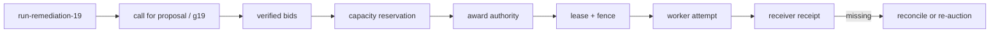
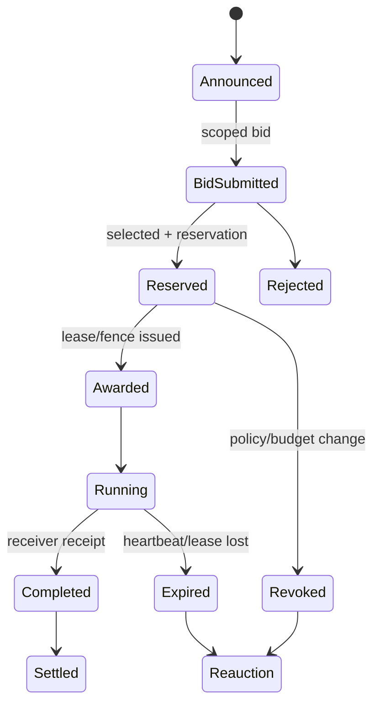
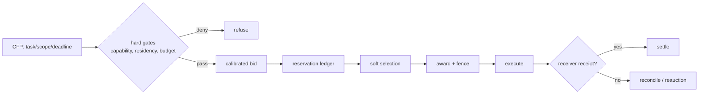
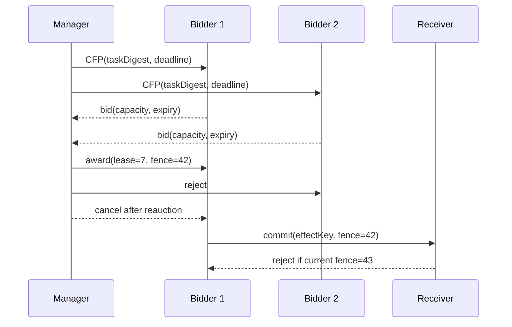

# 19장. ‘경매’라는 비유가 책임을 지려면 낙찰 뒤가 있어야 한다

## 19.0 가장 싼 bid가 가장 먼저 멈춰야 하는 장면

`run-remediation-19`에서 planner는 세 worker에게 장애 완화 작업을 제안한다. A는 가장 낮은 비용을 말하지만 같은 source cohort를 재사용했고, B는 조금 비싸지만 검증 가능한 capacity record를 낸다. selector가 A를 고르는 순간, 시스템은 아직 작업을 시작한 것이 아니다. `branch/task`, bid가 기준으로 삼은 `state_generation`, award를 할 `decision_authority`, 실제 worker `attempt`, 그리고 receiver `receipt`가 차례로 필요하다.



award는 선택의 기록이고 receipt는 effect의 기록이다. 둘의 주어를 바꾸면 '낙찰됐으니 변경이 끝났다'는 거짓 성공이 생긴다.

여러 agent에게 일을 공고하고, 가장 싼 또는 가장 적합한 bid를 골라 맡기는 그림은 자연스럽다. 하지만 proposal을 고르는 selector를 market이라고 부르는 순간 중요한 상태가 사라진다. bid는 언제까지 유효한지, winner는 자원을 예약했는지, lease가 끝나면 누가 fencing 하는지, 늦은 완료가 새 winner의 결과를 덮지 않는지, 실제 비용은 어떻게 정산되는지를 따져야 한다.

이 장은 contract-net·auction을 유용한 coordination vocabulary로 사용하되, 공개된 완전한 LLM market runtime을 발견했다고 주장하지 않는다. 여기의 lifecycle과 failure fixture는 FIPA/JADE의 protocol 원전과 selector 구현을 연결한 **설계 전이**다. 공개 LLM agent code가 durable bid ledger, reservation, lease/fence, receiver settlement까지 하나의 실제 runtime으로 구현했다는 관측은 없다.

## 19.1 proposal 선택과 계약 lifecycle은 다르다

FIPA Contract Net Interaction Protocol은 manager의 CFP, participant의 proposal/refusal, accept/reject proposal과 subsequent task 수행의 대화 구조를 규정한다. [FIPA Contract Net](https://www.fipa.org/specs/fipa00029/SC00029H.html)은 message choreography의 원전이다. JADE의 contract-net behavior는 이 protocol을 agent behavior로 구현하는 도구다. 그러나 protocol message가 있다고 bid가 enforceable price이고, completion message가 receiver-side effect receipt라는 뜻은 아니다.



`selected`와 `awarded`의 간격이 핵심이다. selected는 optimizer가 후보를 고른 상태다. awarded는 principal·scope·budget을 재검사하고 lease/fencing token을 붙여 execution right를 준 상태다. completed는 worker의 자기 보고가 아니라 receiver가 action digest를 durable하게 인정한 상태여야 한다.

## 19.2 실패 장면: 오래된 winner가 새 winner를 덮는다

worker A가 token 17로 bid를 이겨 실행을 시작한다. lease가 만료되고 manager는 worker B에 token 18을 준다. A는 partition 뒤 늦게 돌아와 결과를 write한다. receiver가 token을 검사하지 않으면 A는 B 이후에 온다는 이유만으로 새 상태를 덮는다. fencing의 목적은 owner를 설득하는 것이 아니라 receiver가 **낡은 권한을 거부**하게 만드는 것이다.

```python
> **의사코드다.** dedup의 원자성과 `DurableCommit`의 저장 경계는 receiver에서 구현해야 한다.
def accept_completion(receipt, current_fence):
    if receipt.fence_token < current_fence:
        return Reject("stale winner")
    if not dedup(receipt.action_digest):
        return Replay("already settled")
    return DurableCommit(receipt)
```

lease clock, partition, storage durability는 실제 시스템마다 매우 다르다. 이 의사 코드는 FIPA나 JADE가 fencing receiver를 제공한다는 주장이 아니다. 오히려 contract-net만 도입하고 receiver를 바꾸지 않으면 이 safety property가 생기지 않는다는 review 도구다.

## 19.3 bid는 자유 텍스트가 아니라 검증 가능한 offer다

LLM이 ‘10초 안에 할 수 있습니다’라고 말하는 문장은 bid 후보다. 수락 가능한 bid에는 task digest, input snapshot, resource estimate, capability scope, price/budget reservation, deadline, expiry, evidence of availability가 필요하다. price가 model confidence나 token estimate라면 unit·calibration·upper bound를 명시한다. 서로 다른 worker가 같은 GPU quota와 credential을 약속했는데 reservation ledger가 없다면 두 bid를 합산할 수 없다.

|필드|왜 필요한가|누락 시 실패|
|---|---|---|
|task/input digest|무엇을 맡는지 고정|다른 task로 bait-and-switch|
|expiry|stale offer 차단|오래된 가격·권한 수락|
|capacity reservation|동시 약속 방지|oversubscription|
|capability scope|effect boundary|winner가 범위 확장|
|fence token|late writer 차단|reauction 뒤 overwrite|
|receipt digest|settlement 근거|자기 보고를 완료로 오인|

## 19.4 bid gaming과 collusion은 model prompt로 끝나지 않는다

worker가 낮은 비용을 말해 award를 받은 뒤 retry를 반복하거나, 같은 provider·prompt·source cohort의 worker들이 서로를 높게 평가하면 selector는 최적화가 아니라 manipulation을 수행한다. bid evaluator와 performer를 분리하고, estimate calibration error, timeout, retry, actual resource consumption, receipt rate를 사후 기록한다. 무작위 sampling과 audit은 도움이 될 수 있지만, 공개 LLM selector가 market incentive compatibility를 해결했다는 보장은 아니다.

특히 winner selection을 debate vote처럼 처리하면 bid independence까지 상실한다. bid의 evidence cohort, shared quota group, credential audience, cost model revision을 기록해 correlation을 보인다. ‘세 후보가 모두 같은 값을 말했다’는 price discovery가 아니다.

## 19.5 실습: 계약 lifecycle을 일부러 깨기

결정론적 fixture에서 다음을 확인한다. 늦은 bid는 award 전 거부되고, reservation 없이 award가 되지 않으며, policy revision이 바뀌면 lease가 revoke되고, token 17 completion은 token 18 이후 거부되며, receipt 없는 completion은 settlement가 되지 않는다. 이 fixture는 public LLM market의 throughput·incentive·fault tolerance 성능을 재는 benchmark가 아니다. 상태 전이가 하나라도 빠지면 어떤 오류가 가능한지 보여 주는 최소 반례다.

관측은 `bid_submitted_total`, `bid_expired_total`, `reservation_conflict_total`, `award_revoked_total`, `stale_fence_rejected_total`, `receipt_missing_total`, `reauction_total`, `estimate_error`를 분리한다. `auction_success_total` 하나로는 selection과 completion·settlement를 구분할 수 없다.

## 19.6 언제 경매를 쓰지 말아야 하는가

작업이 deterministic하고 worker의 비용·capability가 거의 같다면 auction은 조정 비용만 추가한다. 간단한 round-robin 또는 fixed routing이 더 투명하다. 반대로 worker마다 locale, data residency, GPU type, trusted tool access, queue depth가 다르고 task가 분해 가능하면 bid vocabulary가 유용하다. 그래도 worker가 스스로 낸 natural-language estimate를 가격으로 바로 사용하지 않는다. scheduler가 관측한 historical duration과 queue time으로 calibrated estimate를 만들고, untrusted bid text는 proposal으로 취급한다.

bid evaluator의 목적 함수도 명시한다. fastest, cheapest, lowest risk, highest provenance coverage는 서로 다른 선택이다. `score=0.8` 하나로 합치면 어떤 safety constraint가 latency와 교환됐는지 보이지 않는다. hard constraint는 먼저 fail-closed로 적용하고, 남은 후보에만 soft ranking을 적용한다.



### 정산은 billing record보다 넓다

settlement는 비용 청구만 뜻하지 않는다. 어떤 input digest를, 어떤 capability·fence 아래, 어느 receiver가 어떤 action digest로 처리했는지를 닫는 ledger event다. 실패한 작업이 token을 썼어도 effect가 없을 수 있고, effect가 있었는데 worker billing record가 사라질 수도 있다. finance, observability, correctness record를 하나의 number로 합치지 말아야 하는 이유다.

### 설계 전이를 검증하는 질문

FIPA/JADE가 제공하는 것은 message protocol/behavior의 경계다. selector code가 제공하는 것은 participant selection의 일부다. 이 둘에서 production LLM market을 설계할 때 새로 만들어야 하는 것은 reservation store, fencing receiver, durable receipts, clock/partition policy, manipulation audit, privacy-preserving bid visibility다. 이를 표로 적어 두면 protocol 원전의 권위를 빌려 미구현 보장을 주장하는 실수를 막는다.

### privacy와 timeout

bid에는 capacity, tenant locality, provider pricing, incident 정보가 드러날 수 있다. evaluator는 selection에 필요한 최소 attribute만 읽고 non-winner에게 다른 bid를 돌려주지 않는다. award deadline 뒤 응답이 없을 때도 곧바로 failed라고 쓰지 않는다. receiver request가 떠났다면 상태는 unknown일 수 있다. reauction은 새 fence token으로 가능하지만 old winner의 effect는 receipt query·compensation·reconciliation으로 닫는다.

### bid 평가를 재현하는 ledger

나중에 ‘왜 B가 아니라 A였는가’를 설명하려면 CFP revision, eligible participant set, hard-gate denial reason, bid expiry, ranking feature revision, reservation state, selection time을 보관한다. model이 만든 free-form rationale은 보조 정보일 뿐 selection proof가 아니다. 동일 bid가 다시 들어와도 같은 ranking을 내려면 cost model, capacity snapshot, tie-break rule이 고정되어야 한다. tie-break가 random이면 seed와 audit policy를 남긴다.

### 계약 단계별 fault injection

CFP 직후 manager를 죽이면 bid가 아직 없음이 명확해야 한다. reservation 뒤 죽이면 capacity가 얼마나 오래 hold되는지 확인한다. award 뒤 worker를 죽이면 lease expiry와 fencing이 작동해야 한다. completion 전달 뒤 receiver를 죽이면 outcome은 receipt query 전까지 unknown이다. 이 네 test는 fault-tolerant market을 증명하지 않는다. 하지만 어느 event가 없을 때 어느 상태를 거짓으로 닫으면 안 되는지 보여 준다.

공개 complete LLM market runtime의 미관측은 단순한 footnote가 아니다. 독자는 protocol source, selector source, local lifecycle fixture가 각각 다른 evidence class임을 알아야 한다. 설계 전이를 배포 사실처럼 서술하지 않는 것이 이 장의 가장 중요한 안전 규칙이다.

### 예산 고갈은 refusal로 끝날 수 있다

모든 CFP가 winner를 가져야 하는 것은 아니다. global budget reserve가 verifier·reconciliation에 필요하면 manager는 좋은 bid라도 refuse/defer할 수 있다. 이때 refusal reason은 worker quality가 아니라 capacity policy일 수 있으므로 별 metric으로 기록한다. 경매의 품질을 award rate만으로 측정하면 안전한 admission이 실패처럼 보인다.

### 비용 모델의 drift

worker의 token/latency estimate는 provider 가격, cache hit, tool queue, model revision 변화에 따라 drift한다. bid 당시 estimate와 settled actual을 연결해 calibration error를 cohort별로 본다. price estimate가 계속 과소평가되면 award rule이 위험한 worker를 보상할 수 있다. 모델이 estimate를 서술하는 능력과 scheduler가 capacity를 안전하게 예약하는 능력은 다르다.

### 문서화할 비보장

이 장의 contract-net state machine은 bid의 법적 구속력, economic incentive compatibility, byzantine bidder resistance, global clock correctness, multi-region exactly-once settlement를 보장하지 않는다. 그런 속성은 별 receiver·storage·identity·failure model과 함께 검증해야 한다. protocol 이름만으로 이 비보장을 숨기지 않는 것이 system design의 출발점이다.

### 장을 닫기 전 체크리스트

- [ ] CFP/proposal/award와 실제 effect receipt가 별 상태인가?
- [ ] bid에 expiry, scope, capacity reservation, input digest가 있는가?
- [ ] lease 만료 뒤 late winner를 receiver가 fence하는가?
- [ ] reauction이 old result를 overwrite하지 못하게 하는가?
- [ ] quote, cost, capacity estimate의 calibration을 사후 측정하는가?
- [ ] 공개 LLM market runtime 미관측이라는 경계를 문서에 남겼는가?

### award는 권한이 아니라 lease 제안이다

winner에게 영구 권한을 주지 말고 `(awardId, taskDigest, leaseUntil, fencingToken, budgetReservation)`을 발급한다. receiver는 proposal 점수나 A2A Task 상태가 아니라 fencing token과 effect key를 검사한다.



reauction은 기존 award의 cancellation acknowledgement만 기다려서는 안 된다. 새 fencing generation을 먼저 publish하고 receiver가 old generation을 거절하게 해야 한다. 늦은 proposal, award 뒤 capacity 상실, duplicate award delivery, winner timeout 뒤 late commit을 fault로 넣는다. protocol call 성공이나 task `COMPLETED`는 quote 이행과 durable effect의 receipt가 아니다.

## 19.7 실행: protocol 이름을 effect guarantee로 바꾸지 않는 test

이 책의 동반 fixture `research/agents/fixtures/test_contract_net_auction_wave7.py`는 FIPA·JADE·AutoGen 또는 production LLM market의 구현이 아니다. bid window, reservation, award, lease fence, settlement receipt, re-auction 사이에서 **허용하면 안 되는 전이**를 고정한 deterministic state machine이다. 그러므로 이 test의 통과는 시장 최적성이나 worker 성능 측정이 아니라, `award ≠ reservation`, `completion message ≠ receipt`, `revoke ≠ settlement`이라는 복구 경계를 확인한다.

```bash
uv run --with pytest --with rdflib \
  pytest -q research/agents/fixtures/test_contract_net_auction_wave7.py
```

oracle은 late bid와 reservation 없는 award의 거절, self-reported cheapest bid의 거절, receipt 없는 settlement의 거절, 만료 lease의 거절, re-auction 뒤 stale fence의 거절이다. 마지막 test에서 새 worker의 새 fence와 새 receipt가 있어야만 `SETTLED`가 된다. 운영 로그에는 `run_id`, `contract_round`, `bidder`, `input_generation`, `reservation_id`, `fence`, `attempt_id`, `receipt_id`, `reauction_reason`을 각각 남긴다. 이 필드가 있어야 싼 bid 선택 문제, worker crash, 중복 effect를 같은 '경매 실패'로 뭉개지 않는다.

selector의 실제 표면은 [AutoGen `SelectorGroupChat` 고정 코드](https://github.com/microsoft/autogen/blob/2b0f7093171350f7d3a3a4c6963bc1fcd873804f/python/packages/autogen-agentchat/src/autogen_agentchat/teams/_group_chat/_selector_group_chat.py#L274-L363)에서 읽을 수 있다. 이 selection 경로가 reservation store나 receiver fencing을 제공한다는 뜻은 아니다. 바로 그 차이가 이 장이 문헌을 설계로 옮길 때 반드시 드러내야 하는 추가 구현이다.

### 복구: revoke, expiry, re-auction의 질문을 분리한다

worker가 사라졌다고 receipt를 지우지 않는다. 먼저 `(logical effect, fence)`로 receiver를 조회한다. receipt가 있으면 effect는 완료일 수 있고, run에는 늦은 관측으로 붙인다. receipt가 없고 lease가 유효하면 같은 worker의 재시도보다 lease owner와 capacity reservation을 먼저 검사한다. lease가 만료되거나 revoke되면 이전 fence는 더 이상 settle할 수 없고 새 round가 필요하다. re-auction은 같은 bid table을 조용히 재사용하는 일이 아니라 새 `state_generation`과 새 decision authority로 다시 시작하는 일이다.

### 원전

- [FIPA Contract Net Interaction Protocol](https://www.fipa.org/specs/fipa00029/SC00029H.html)
- [JADE Contract Net behavior](https://jade.tilab.com/doc/api/jade/proto/ContractNetInitiator.html)
- [AutoGen group-chat selector](https://github.com/microsoft/autogen/blob/2b0f7093171350f7d3a3a4c6963bc1fcd873804f/python/packages/autogen-agentchat/src/autogen_agentchat/teams/_group_chat/_selector_group_chat.py#L274-L363)
