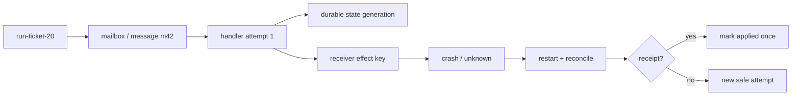
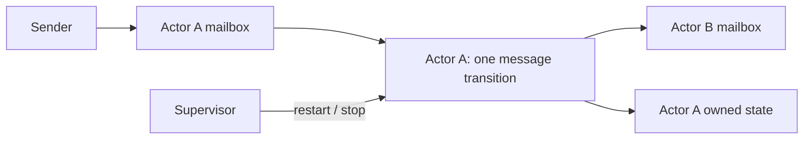

# 20장. Mailbox, reducer, CRDT, consensus는 서로 다른 약속이다

## 20.0 티켓 닫기 요청이 두 번 도착한 한 실행

`run-ticket-20`은 '티켓을 닫아 달라'는 message를 받는다. 네트워크는 같은 message를 두 번 전달했고, 첫 handler는 receiver 호출 뒤 crash했다. 여기서 actor에게 필요한 것은 mailbox owner와 재시작 경계다. reducer에게 필요한 것은 입력 순서가 결과를 바꾸는지에 관한 법칙이다. 여러 replica가 있다면 CRDT 또는 consensus의 failure model을 따로 선택해야 한다. 마지막으로 ticket API의 실제 완료는 receiver receipt가 말해 준다.

같은 AgentRun 좌표로 이 사건을 읽자. `run_id → mailbox/task → state_generation → command authority → handler attempt/effect key → delivery·apply·receiver receipt → restart/reconciliation`이다. actor restart, quorum commit, 화면의 성공 문구는 어느 것도 receiver receipt를 대신하지 않는다.



‘여러 agent의 결과를 모은다’는 말만으로는 너무 많은 것을 가린다. actor는 mailbox에서 message를 하나씩 받아 다음 행동·message·actor 생성을 결정하는 계산 모델이다. reducer는 local sequence에 operator를 적용한다. CRDT는 replica가 같은 update 집합을 받았을 때 순서·중복에도 수렴하도록 merge law를 요구한다. consensus는 failure model 아래 replicated log의 같은 위치에 command를 durable하게 정한다. 네 단어를 바꿔 쓰면 system이 제공하지 않는 보장을 독자가 상상하게 된다.

## 20.1 actor는 thread pool이 아니다

Hewitt의 [Actor Model](https://arxiv.org/pdf/1008.1459)은 actor가 message를 받을 때 message 전송, actor 생성, 다음 행동 지정이라는 세 종류의 일을 할 수 있음을 설명한다. actor identity와 mailbox ownership은 그래서 중요하다. worker pool의 shared queue가 있다고 actor supervision, mailbox isolation, failure containment가 자동으로 생기지 않는다.



mailbox ordering도 ‘전역 시간 순서’가 아니다. sender마다 ordering인지, priority가 있는지, retry가 duplicate message를 만드는지, receiver가 deduplicate하는지가 protocol에 있어야 한다. `message delivered`는 `message applied`, `effect committed`와 다르다.

## 20.2 reducer는 CRDT가 아니다

LangGraph의 `BinaryOperatorAggregate`는 operator로 channel 값을 누적한다. [고정 구현](https://github.com/langchain-ai/langgraph/blob/11ee185999b86bfea2d8c0e69cef9a5e37acf686/libs/langgraph/langgraph/channels/binop.py#L65-L155)은 local reduction을 읽기에 좋은 앵커다. 하지만 string append는 순서에 민감하고 duplicate에 민감하다. replica A가 `[x,y]`, B가 `[y,x]`를 얻어도 같은 결과가 된다는 law는 없다.

Shapiro 등의 CRDT 원전은 state merge가 commutative, associative, idempotent여야 하고 replica가 결국 같은 update를 받는다는 조건을 둔다. [A comprehensive study of CRDTs](https://hal.inria.fr/inria-00555588/document)는 이 수학적 경계를 제공한다. 그러나 자연어 claim을 set union으로 합쳐도 contradictory instruction, authorization, provenance의 의미 충돌은 남는다. CRDT convergence는 policy-valid answer의 증명이 아니다.

|기제|최소 보장|없으면 안 되는 추가 조건|
|---|---|---|
|mailbox|owner가 message를 처리하는 경계|delivery/dedup/supervision|
|reducer|정해진 local apply|operator ordering semantics|
|CRDT|replica state convergence|merge laws + anti-entropy|
|consensus|같은 log command/order|quorum, durable replication, leader rules|

## 20.3 vote와 consensus의 실패 장면

세 agent가 ‘deploy’에 투표해 2:1이 된다. 이 결과는 selector가 후보를 골랐다는 뜻이다. follower two가 durable log entry를 확인했는지, leader가 failover 뒤 같은 command를 적용하는지, state machine이 ordered apply를 하는지는 전혀 말하지 않는다. Raft의 [§5.3–5.4](https://raft.github.io/raft.pdf)는 majority replication, commit index, follower propagation, ordered state machine apply를 구분한다. LLM vote는 이 protocol의 quorum 숫자와 닮아도 consensus commit이 아니다.

반대로 Raft가 합의한 command도 ‘LLM의 판단이 참’임을 보장하지 않는다. consensus는 **같이 적용할 것**을 정할 뿐, predicate verifier의 진실성을 제공하지 않는다. factual verifier와 replicated command ordering을 결합하려면 둘의 receipt를 한 ledger에서 연결하되, 하나를 다른 하나의 증거로 대체하지 않는다.

## 20.4 failure isolation과 supervision

actor A가 malformed message를 받았을 때 mailbox 전체를 멈추는지, 해당 message를 dead-letter로 보내는지, actor state snapshot에서 restart하는지 정해야 한다. restart가 safe하려면 processing attempt identity와 effect idempotency key가 필요하다. 그렇지 않으면 crash 직전 remote API에 보낸 request를 replay한다. supervision은 exception handler가 아니라 state·effect reconciliation policy다.

```python
> **의사코드다.** `already_applied`와 `persist_transition`의 transaction 경계는 생략했다.
def handle(message, state):
    if already_applied(message.id):
        return state
    transition = reduce(state, message)
    persist_transition(message.id, transition)
    # external effect must use separate receiver deduplication
    return transition
```

이 예시는 local persistence의 경계만 보여 준다. `persist_transition`이 multi-node quorum, clock skew, network partition을 해결하지 않는다. unknown remote effect는 dead-letter가 아니라 reconciliation queue로 보내야 한다.

## 20.5 실습과 metric

먼저 reducer에 `append`와 set-union을 넣어 duplicate·순서·재전송에서 결과가 어떻게 다른지 검사한다. 다음으로 두 replica에 같은 update를 다른 순서로 전달하고 CRDT law를 만족하는 merge인지 확인한다. 마지막으로 2/3 vote를 만든 뒤 follower durable acknowledgement가 없는 상태에서 leader를 죽인다. vote 결과가 commit receipt로 바뀌지 않아야 한다.

관측할 항목은 mailbox depth/age, delivery retry, duplicate dropped, dead-letter, actor restart, state generation, CRDT merge conflict, quorum acknowledgement, commit index lag, effect reconciliation이다. queue depth가 작다는 사실은 state correctness나 receiver commit을 뜻하지 않는다.

## 20.6 같은 incident를 네 방식으로 읽기

한 고객의 ‘티켓을 닫아 달라’는 message가 두 번 도착한다. actor 관점에서는 같은 mailbox owner가 duplicate ID를 보고 한 번만 state transition을 적용해야 한다. reducer 관점에서는 duplicate input이 operator 결과를 어떻게 바꾸는지 검사한다. CRDT 관점에서는 두 replica가 중복 update를 받고 merge해도 같은 state가 되는지 본다. consensus 관점에서는 close command가 replicated log의 어느 index에 committed됐는지 본다. effect 관점에서는 ticket service가 idempotency key로 실제 close를 한 번만 수행했는지를 확인한다. 같은 사건이지만 질문이 다섯 개다.

이 분해는 장애 대응에서 특히 중요하다. ‘actor가 restart했다’는 로그가 있어도 remote ticket close가 두 번 일어났는지 모른다. ‘Raft가 commit했다’는 사실이 ticket API가 적용됐다는 receipt는 아니다. ‘CRDT가 수렴했다’는 말도 authorization이 없는 close command를 정당화하지 않는다. 각 계층은 다음 계층의 input일 수는 있어도 대체물은 아니다.

### ordering의 범위를 문장으로 써라

`FIFO`만 쓰면 부족하다. producer별 FIFO인지, actor mailbox 전체 FIFO인지, priority message가 추월하는지, restart 뒤 unacked message가 재전송되는지, handler가 parallel child를 만들 수 있는지를 적는다. 아울러 state transition order와 external effect order가 다를 수 있음을 기록한다. mailbox sequence 10을 local state에 반영한 뒤 remote effect가 실패하면 local event와 receiver receipt가 갈라진다. 이때 rollback, compensation, unknown 중 무엇을 선택하는지는 actor runtime이 아니라 effect protocol의 결정이다.

### 작은 law test가 큰 오해를 막는다

merge 함수에 대해 `merge(a,b)==merge(b,a)`, `merge(merge(a,b),c)==merge(a,merge(b,c))`, `merge(a,a)==a`를 실제 test로 둔다. 하나라도 실패하면 state-based CRDT라고 부르지 않는다. reducer에는 same input order의 replay test와 reordered input test를 따로 둔다. mailbox에는 duplicate, delayed, poison message test를 둔다. consensus에는 leader failover와 uncommitted entry test가 필요하다. 서로 다른 테스트를 한 개의 ‘distributed test passed’라는 문장으로 묶지 않는다.

## 20.7 failure model에서 기제를 고른다

한 process의 owner queue라면 actor/mailbox와 durable local transition으로 충분할 수 있다. partition 중 replica availability가 필요하면 data type과 command semantics로 CRDT/consensus를 고른다. permission grant나 irreversible deployment는 merge만으로 처리하기 어렵다. raw note가 수렴해도 ‘사실로 채택’하는 action은 verifier/authority가 결정한다. message delivery receipt, state apply receipt, external effect receipt도 서로 다른 event다. crash recovery는 그 셋 중 어디까지 왔는지를 읽어 safe retry를 결정한다.

### supervision은 재시작 횟수가 아니다

supervisor policy에는 retry budget, backoff, poison-message threshold, state snapshot source, compensation owner, escalation condition이 있다. actor를 무한 restart하면 transient failure가 아니라 malformed input이나 unauthorized action을 반복한다. dead-letter는 쓰레기통이 아니라 typed investigation queue다. payload classification과 reason code가 있어야 운영자가 data corruption, schema drift, policy deny, receiver outage를 분리한다.

### consensus를 도입하기 전의 비용

quorum protocol은 latency, availability, storage, operational complexity를 산다. agent system에 Raft라는 단어를 붙이는 것보다 먼저 어떤 command가 정말 total order를 요구하는지, local owner queue로 해결되는지, receiver가 이미 authoritative serialization을 제공하는지를 조사한다. 여러 agent의 자연어 answer를 하나로 고르는 문제에 consensus를 쓰는 것은 보통 잘못된 layer다. 그 문제에는 evidence verifier와 selection policy가 필요하다.

### 실전 review table

|문장|추가로 확인할 evidence|
|---|---|
|"message를 보냈다"|mailbox delivery/attempt ID|
|"state가 바뀌었다"|durable apply receipt/generation|
|"replica가 수렴했다"|merge laws와 anti-entropy trace|
|"합의됐다"|quorum log index/follower acknowledgement|
|"변경이 끝났다"|external receiver receipt|

### agent system에서의 practical boundary

대부분의 agent orchestration은 우선 local actor/mailbox, typed result, durable effect ledger로 시작할 수 있다. replica convergence나 consensus는 실제 multi-node ownership requirement가 생겼을 때 failure model과 함께 도입한다. 반대로 multi-agent라는 이름만으로 CRDT나 Raft를 요구하지 않는다. 운영 복잡성을 늘리기 전에 receiver가 이미 serialization/fencing을 제공하는지 확인하는 편이 낫다.

### 관측과 privacy

mailbox payload를 통째로 trace에 넣으면 debugging은 쉬워 보이지만 customer text와 tool argument가 telemetry retention으로 번진다. message ID의 digest, type, size bucket, terminal reason을 metric/trace에 넣고 raw payload는 제한된 audit store에 둔다. dead-letter 분석도 동일한 access policy를 따른다. observability가 actor isolation을 우회하는 privileged read path가 되지 않게 한다.

### deployment와 version skew

actor handler를 rolling update할 때 old/new handler가 같은 mailbox를 읽을 수 있다. message schema, state schema, effect idempotency contract가 호환되는지 확인하지 않으면 retry가 새 handler에서 다른 command를 만들 수 있다. worker generation, handler revision, message schema revision, state migration epoch을 ledger에 남기고, incompatible command는 drain 또는 explicit migration을 기다린다. deployment complete가 모든 in-flight message의 semantic completion을 뜻하지 않는다는 사실을 운영 runbook에 적는다.

### 인과관계의 최소 보존

message parent ID와 trace parent는 useful correlation이지만 authoritative causality proof는 아니다. sender가 `A caused B`라고 텍스트에 쓰는 것과 receiver가 어느 command를 apply했는지는 다르다. causal claim에는 observed event, timestamp source, direction, source span을 두고, order가 필요한 state command에는 replicated log/receipt를 사용한다. graph edge 하나가 자연어 원인 결론을 자동으로 허가하지 않는다.

### delivery, merge, agreement, truth를 네 층으로 분리한다

actor mailbox는 메시지를 전달하고 actor-local 순서를 제공할 수 있다. CRDT는 특정 자료형의 merge convergence를 제공한다. consensus는 복제 상태 기계가 log 순서에 합의하게 한다. verifier는 claim이 근거를 만족하는지 판정한다. 어느 층도 다른 층을 자동 포함하지 않는다.

\[
\text{delivery}\not\Rightarrow\text{exactly-once effect},\quad
\text{convergence}\not\Rightarrow\text{factual truth},\quad
\text{consensus}\not\Rightarrow\text{authorization}.
\]

mailbox handler가 재실행될 수 있으면 메시지 ID와 effect key를 분리한다. 동일 메시지가 같은 logical effect를 재시도할 수 있지만, 서로 다른 메시지가 같은 effect를 요청할 수도 있기 때문이다. handler completion은 receiver receipt를 ledger에 붙인 뒤에만 effect-complete로 승격한다.

fault suite는 mailbox duplicate/reorder, actor restart, CRDT merge permutation, network partition, leader change 직전·직후 commit, stale fencing token을 포함한다. OpenTelemetry span은 이 과정을 관측할 뿐 consensus log나 receipt store가 아니다.

## 20.8 실행: 서로 다른 test가 서로 다른 문장을 막는다

먼저 이 책의 동반 fixture `research/agents/fixtures/test_coordination_primitives_contract.py`를 실행한다. 이 test는 LangGraph, Raft, actor runtime을 실행하지 않는다. local reducer와 set-union을 대비해 merge law를 검증하고, mailbox가 duplicate·재정렬 delivery를 자동 deduplicate하지 않으며, vote 결과가 durable quorum commit이 아님을 보여 주는 반례다.

```bash
uv run --with pytest --with rdflib \
  pytest -q research/agents/fixtures/test_coordination_primitives_contract.py
```

pass oracle은 네 가지다. set union은 commutative·associative·idempotent이고 append reducer는 그렇지 않다. receiver mailbox는 `("m2", "m1", "m2")`처럼 중복 도착을 그대로 본다. vote에는 receipt와 commit index가 없으며, deterministic replicated-log model만 quorum 이상 acknowledgement와 `commit/1` receipt를 만든다. 이 수치는 production Raft benchmark가 아니라 단어의 잘못된 치환을 막는 검사다.

두 번째로 공통 AgentRun의 crash/restart 경계를 확인한다.

```bash
uv run --with pytest --with rdflib \
  pytest -q research/agents/fixtures/test_canonical_agentrun_vertical_wave29.py
```

여기서 oracle은 `agent-run-wave29-canonical-001`의 18개 순서 사건, 세 branch의 하나의 proof identity, 취소 뒤 남은 work chunk, receiver process가 바뀐 뒤에도 `apply_count_after_restart == 1`, 그리고 restart 뒤 찾아낸 동일 `receipt_id`다. 이 실습은 actor library의 기능 검증이 아니라 durable effect recovery를 읽는 공통 좌표를 제공한다.

[LangGraph reducer의 고정 코드](https://github.com/langchain-ai/langgraph/blob/11ee185999b86bfea2d8c0e69cef9a5e37acf686/libs/langgraph/langgraph/channels/binop.py#L65-L155), [Raft 논문](https://raft.github.io/raft.pdf), [Actor Model 원전](https://arxiv.org/pdf/1008.1459)을 나란히 읽되, 각각이 local aggregation, replicated-log protocol, actor 계산 모델이라는 범위를 넘겨서 주장하지 않는다.

### 복구: 어느 층이 미확정인지 먼저 기록한다

crash 뒤 첫 질문은 '재시도할까?'가 아니다. message delivery가 미확정인지, local state apply가 미확정인지, replicated command가 미확정인지, receiver effect가 미확정인지 먼저 분류한다. mailbox duplicate면 message ID를, local apply면 generation/transition receipt를, consensus command면 log index와 quorum 상태를, 외부 변경이면 effect key와 receiver receipt를 조회한다. receipt가 있으면 새 handler는 기존 결과를 연결만 한다. receipt가 없으면 해당 layer의 policy가 허용할 때만 새 attempt를 만든다. 이 순서가 actor restart를 duplicate side effect로 바꾸지 않게 한다.

## 20.9 실행 ledger: restart, merge, term을 한 incident에 겹치지 않게 둔다

이번에는 서로 다른 네 문장을 실제로 분리해 본다. 아래 fixture는 Akka나 Raft cluster를 흉내 내어 성능을 재는 코드가 아니다. 고정된 local ledger를 실행해, 한 문장을 다른 문장으로 잘못 승격하는 순간을 잡는 test다. Akka의 실제 supervision source와 Raft·CRDT 원전은 각각 뒤에서 따로 읽는다.

```bash
uv run --with pytest --with rdflib \
  pytest -q research/agents/fixtures/test_actor_crdt_consensus_vertical_wave43.py
```

pass oracle은 세 묶음이다.

|사건|관찰 값|이 값이 말하지 않는 것|
|---|---|---|
|duplicate + crash|`receiver apply_count_after_restart == 1`|actor library가 exactly-once를 제공한다는 주장|
|poison message|`dead-letter:schema-invalid`, restart 1회|dead letter가 이미 발행한 effect를 되돌린다는 주장|
|CRDT permutation|set union은 6개 순열에서 하나의 final state|외부 append effect도 같은 순서라는 주장|
|term change|index 11은 quorum 2로 commit, token 7 write는 token 8 receiver가 거절|Raft commit이 외부 API 완료 receipt라는 주장|

fixture의 재시작 경로는 다음처럼 **dispatch 후 crash**를 의도적으로 만든다. 그러므로 local handler의 terminal flag는 믿을 수 없다. recovery는 새 effect를 보내기 전에 receiver를 effect key로 조회한다.

```python
# 동반 fixture의 축약본: 실제 receiver는 in-process ledger다.
receiver_receipts[effect_key] = "receipt-ticket-42-close-001"
event("handler-crash-after-dispatch", durable_disposition="unknown")

# actor generation 2
event("reconciliation-query", receiver_receipt_found=True)
durable_messages[message_id] = "applied-from-receipt"
event("duplicate-dropped", durable_disposition="applied-from-receipt")
```

중요한 순서는 `crash → unknown → receipt query → durable disposition → duplicate drop`이다. 반대로 duplicate를 먼저 drop하면, crash 전에 receiver가 실제로 적용했는지와 아직 적용되지 않았는지를 구별할 기록이 사라진다. receipt가 없을 때만 새 attempt를 고려하며, 그때도 idempotency key와 receiver contract가 없으면 자동 재시도는 안전하다고 말할 수 없다.

CRDT 부분도 같은 방식으로 읽는다. `{"alpha", "beta", "gamma"}`의 union은 입력 순열 여섯 개에서 모두 같은 집합이 된다. 하지만 다음 효과는 여섯 개의 서로 다른 trace를 만든다.

```text
alpha -> beta -> gamma
gamma -> beta -> alpha
... (총 6개 순서)
```

즉 replica state에 적용한 merge law가 참이어도, deploy·결제·ticket close처럼 순서가 의미인 명령을 merge로 해결한 것은 아니다. 명령에는 순서화된 log, receiver-side idempotency, 또는 명시적 compensation contract가 필요하다. `state convergence`와 `effect convergence`를 같은 metric으로 보고하면 이 차이를 잃는다.

마지막 ledger는 term 7의 leader가 `n1,n2` acknowledgement로 index 11을 commit한 뒤, term 8 leader가 receiver fence token을 8로 올리는 장면이다. 늦게 돌아온 term 7 writer는 거절되고, term 8 reconciliation은 이미 존재하는 `receipt-deploy-11`을 연결한다. 이때 확인해야 할 키는 셋이다.

```text
replicated command: (term=7, log_index=11, quorum=2)
authority epoch:     receiver_fence_token=8
effect observation:  receipt_id=receipt-deploy-11
```

이 세 키는 우연히 같은 incident에 등장해도 서로 대체되지 않는다. log index는 command order, fence는 stale owner 거절, receipt는 receiver의 실제 apply를 판정한다. 특히 fence comparison은 receiver가 수행해야 한다. caller가 '나는 term 8'이라고 적은 telemetry만으로는 term 7의 늦은 I/O를 막지 못한다.

### Akka source를 읽을 때의 실무 질문

고정 [Akka Typed `SupervisorStrategy.scala`](https://github.com/akka/akka/blob/a7ebe0ca46a55d62270b959942e6698727e400aa/akka-actor-typed/src/main/scala/akka/actor/typed/SupervisorStrategy.scala#L16-L40)는 `resume`, `restart`, `stop`을 구분한다. 같은 파일의 [restart stash contract](https://github.com/akka/akka/blob/a7ebe0ca46a55d62270b959942e6698727e400aa/akka-actor-typed/src/main/scala/akka/actor/typed/SupervisorStrategy.scala#L274-L288)는 restart 대기 중 들어온 message를 stash했다가 새 behavior에 전달할 수 있으며, capacity를 넘으면 drop될 수 있음을 적는다.

그래서 운영 review에서는 'restart했는가?' 대신 다음을 묻는다.

- restart 동안 들어온 message의 상한과 drop disposition은 무엇인가?
- poison message는 왜 retryable이 아닌가? schema error, policy deny, receiver outage를 같은 queue에 넣지 않았는가?
- actor generation이 바뀐 뒤 이전 effect key와 receipt lookup contract는 보존되는가?
- child를 stop/keep하는 선택이 이미 발행된 effect attempt의 ownership을 흐리지 않는가?

이 fixture는 Akka process, mailbox dispatcher, persistence plugin, cluster sharding을 실행하지 않는다. 따라서 위 source는 API/구현 경계의 근거이고, fixture는 receipt-first recovery라는 설계 반례의 근거다. 둘을 합쳐도 특정 Akka deployment의 failure guarantee가 되지는 않는다.

### 장을 닫기 전 체크리스트

- [ ] actor owner·mailbox ordering·supervision을 명시하는가?
- [ ] reducer의 algebraic law와 순서 의존성을 검사하는가?
- [ ] CRDT의 merge law와 anti-entropy를 실제로 구분하는가?
- [ ] vote selection을 consensus commit으로 부르지 않는가?
- [ ] consensus commit을 factual verification으로 부르지 않는가?
- [ ] restart/retry가 effect deduplication과 연결되는가?

### 원전

- [Actor Model](https://arxiv.org/pdf/1008.1459)
- [CRDTs](https://hal.inria.fr/inria-00555588/document)
- [Raft](https://raft.github.io/raft.pdf)
- [LangGraph reducer](https://github.com/langchain-ai/langgraph/blob/11ee185999b86bfea2d8c0e69cef9a5e37acf686/libs/langgraph/langgraph/channels/binop.py#L65-L155)
