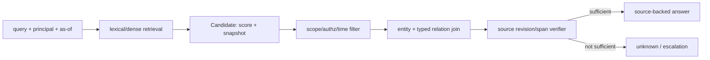
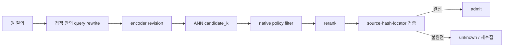

# 21장. 임베딩 검색은 기억을 찾는 도구이지 판단을 위임할 곳이 아니다

agent가 과거 관찰, 도구 문서, 고객 ticket, 작업 artifact를 다시 찾을 때 embedding은 강력하다. 하지만 cosine score 0.91은 표현 공간에서 가깝다는 뜻일 뿐이다. 요청자에게 공개해도 되는지, 지금도 유효한지, 문서의 어느 문장이 claim을 지지하는지, 다른 record가 없는지까지는 말해 주지 않는다. 이 장은 다음 장의 논리적 한계 논의에 들어가기 전에 검색 output의 타입을 안전하게 정한다.

## 21.1 score는 Candidate를 만든다

\[
s(q,d)=\cos(e_q,e_d),\qquad C_k(q)=TopK_d\;s(q,d).
\]

이 식의 `C_k`는 candidate set이다. embedding model, normalization, index generation, distance metric, query rewrite가 바뀌면 같은 텍스트도 다른 순위를 얻는다. 따라서 candidate에는 score뿐 아니라 encoder revision, index snapshot, corpus generation, chunk ID, retrieval time을 넣는다. answer에는 그보다 좁은 source revision과 span locator가 필요하다.

Faiss는 dense nearest-neighbor index의 speed/accuracy trade-off를 설명한다. [Faiss indexes](https://github.com/facebookresearch/faiss/wiki/Faiss-indexes)와 [FAQ](https://github.com/facebookresearch/faiss/wiki/FAQ)는 ANN parameter와 filtering의 실무 제약을 이해하는 좋은 원전이다. 그러나 Faiss가 authorization, valid-time, provenance policy를 결정한다는 뜻은 아니다. 그 판단은 retriever 밖의 identity·policy·source 시스템이 해야 한다.

## 21.2 실패 장면: 빠르고 정확한데 허용되지 않는 문서

global index의 top-4가 모두 다른 tenant의 문서이거나 철회된 문서이고, 다섯 번째에만 허용된 문서가 있다고 하자. global top-4를 고른 뒤 post-filter하면 결과는 비어 있다. 이것은 ‘허용 문서가 없다’는 결론이 아니라 ‘이 search path의 top-k에 허용 문서가 없었다’는 관찰이다. tenant·policy·as-of를 먼저 고정한 scoped exact search는 같은 후보 budget 안에서 허용 문서를 찾을 수 있다.

이때 두 loss를 분리한다. scoped exact와 global-postfilter의 차이는 authorization ordering loss다. scoped exact와 scoped ANN의 차이는 approximation loss다. 둘을 하나의 recall로 합치면 전자는 index tuning으로, 후자는 policy filter로 고치려는 잘못된 결정을 하게 된다.

|출력|정확한 뜻|답변으로 쓸 수 있는가|
|---|---|---|
|no candidate|현재 search path에 없음|아니오, 부정 아님|
|denied candidate|보호 record를 찾았으나 배제|아니오, 존재 누출 주의|
|allowed candidate|읽을 수 있음|아직 source-backed fact 아님|
|verified fact|time/entity/source가 맞음|제한적으로 가능|
|complete-inventory negative|완결 재고에서 부재 확인|false 가능|

## 21.3 memory와 retrieval을 한 저장소로 부르지 않는다

agent memory는 task transcript, user preference, episodic outcome, vectorized derivative, structured fact 등 서로 다른 lifecycle을 가진다. primary memory를 삭제했다고 embedding derivative, backup, WAL, replica, external vector index가 함께 지워졌다고 말할 수 없다. 반대로 vector hit이 memory를 ‘회상했다’고 해도 original source, retention class, consent, trust grade를 복원하지 못하면 planner premise로 바로 승격하면 안 된다.

record에 `tenant`, `purpose`, `trust`, `valid_from/to`, `source revision`, `tombstone`, `retention policy`, `derivative_of`를 둔다. retrieval result는 private observation으로 들어가고, policy·freshness·source span verifier를 통과해야 accepted state가 된다. 이 흐름은 검색 품질을 낮추기 위한 것이 아니라 stale·cross-tenant·injected context가 action planner를 조종하지 못하게 하는 구조다.

## 21.4 ANN과 exact의 경계를 측정한다

ANN은 모든 vector를 방문하지 않음으로써 latency와 memory traffic을 줄인다. exact search도 encoder 표현과 distance metric이 정의한 ranking만 정확하다. 즉 exact는 ANN의 방문 손실을 줄일 수 있어도 semantic truth·authorization·negative knowledge를 만든다지 않는다. benchmark에는 query set, relevant-set 정의, encoder/index revision, filter order, `k`, visit budget, p50/p95/p99, memory, update lag를 고정한다.

ColBERT의 late interaction은 query/document token 간 상호작용으로 ranking 표현을 세밀하게 만든다. [ColBERT](https://arxiv.org/abs/2004.12832v2)는 score 품질의 다른 설계 선택을 보여 준다. 하지만 reranker를 추가해도 `allow` 판정이나 source span completeness가 cosine/MaxSim의 속성이 되지는 않는다.

## 21.5 실습: 빈 검색 결과를 false로 바꾸지 않기

한 tenant의 허용 최신 record와 다른 tenant의 더 가까운 revoked record들을 만든다. (1) global exact→post-filter, (2) scoped exact, (3) scoped approximate의 세 path를 실행해 candidate count, allowed count, answer status를 표로 남긴다. 이어 `closed_inventory=false`인 approval relation을 조회한다. edge를 못 찾아도 output은 `unknown`이어야 한다. RDF의 open-world semantics에서 관측되지 않은 triple은 false가 아니다. [RDF 1.1 Semantics](https://www.w3.org/TR/rdf11-mt/)가 이 차이를 명시한다.

metric은 `retrieval_candidate_total`, `retrieval_postfilter_empty_total`, `authorized_recall_loss`, `ann_recall_loss`, `index_generation_age`, `source_span_missing_total`, `negative_unknown_total`을 분리한다. score를 metric label로 넣거나 query raw text를 trace attribute로 넣지 않는다.

## 21.6 chunking은 검색의 숨은 정책이다

같은 원문도 chunk boundary에 따라 다른 이웃이 된다. 너무 작은 chunk는 문장 주변의 qualification을 잃고, 너무 큰 chunk는 unrelated claim을 함께 끌고 와 score와 citation을 흐린다. overlap은 recall을 올릴 수 있지만 거의 같은 문장을 여러 candidate로 세어 evidence diversity를 부풀린다. 따라서 chunker revision, window length, overlap, parsing failure, source offset mapping을 index revision의 일부로 기록한다.

특히 인용은 chunk ID가 아니라 source span을 가리켜야 한다. chunk 안에 ‘이전 정책에서는 허용’과 ‘현재 정책에서는 금지’가 함께 있으면 어느 문장이 답인지 verifier가 선택해야 한다. retrieval score가 높은 chunk 전체를 prompt에 넣는 것은 evidence selection이 아니다. answer generator가 source span과 claim의 관계를 출력하고, verifier가 revision·time·scope를 확인하는 단계를 둔다.

### query rewrite도 권한 밖에서 움직이지 않는다

agent가 사용자의 질의를 여러 표현으로 바꾸면 recall은 좋아질 수 있다. 하지만 rewrite가 다른 tenant identifier나 hidden tool hint를 삽입하면 search scope가 넓어진다. query rewrite마다 original query digest, rewrite reason, policy scope, index generation을 기록하고, scope는 rewrite 뒤에도 변하지 않게 한다. 여러 rewrite가 같은 chunk를 되찾으면 unique evidence가 늘어난 것이 아니라 ranking attempt가 늘어난 것이다.

### cache의 정답은 snapshot에 묶인다

embedding cache 또는 retrieval cache key에 query text만 쓰면 policy revision·tenant·as-of가 바뀐 결과를 재사용한다. 최소 key는 principal/tenant scope digest, query normalization revision, encoder revision, corpus/index snapshot, as-of bucket, policy revision을 고려한다. cache hit은 비용 절감 지표이지 authorization pass나 source freshness proof가 아니다. cache entry에는 expiry/invalidation owner가 있어야 하며, tombstone된 record가 cached candidate를 통해 되살아나지 않는지 test한다.

|cache hit|재사용 가능한 것|다시 검사할 것|
|---|---|---|
|embedding vector|encoder revision이 같음|scope와 index snapshot|
|candidate list|동일 corpus generation|authorization·valid time|
|verified fact|명시된 validity interval|as-of·policy revision|
|final answer|거의 없음|source·scope·request purpose 전부|

이 표는 final answer cache가 불가능하다는 뜻은 아니다. 다만 answer cache의 key와 invalidation surface가 가장 크므로, retrieval hit을 그대로 answer hit으로 승격하는 shortcut은 위험하다는 뜻이다.

## 21.7 품질·안전성 평가를 분리한다

Recall@k와 nDCG가 좋아져도 authorization correctness, stale answer rate, citation span completeness가 같이 좋아졌다는 뜻은 아니다. 평가 표에는 ranking metric과 `authorized recall`, `post-filter empty`, `stale-source promoted`, `negative unknown correctness`를 나란히 둔다. offline corpus의 완전 relevance label을 production SLO로 옮길 때는 ingest lag, deletion propagation, policy decision latency, tail query latency를 추가로 관찰한다.

generator 직전에도 allowed record, valid as-of, source span을 재검사한다. retrieval answer는 action authority가 아니라 후보 생성이다.

### multi-vector와 hybrid의 위치

lexical search는 exact identifier, error code, version string을 잡는 데 강하고 dense search는 표현이 다른 관련 문장을 넓힌다. hybrid merge나 reranking은 candidate quality를 높일 수 있지만 provenance/authorization pipeline 앞에 놓인다. 두 retriever가 같은 stale document를 찾았다고 independent evidence가 두 개 생기는 것도 아니다. candidate dedup은 text ID만이 아니라 source revision과 semantic overlap을 고려한다.

### embedding model 교체는 data migration이다

새 encoder로 index를 재생성하면 old/new score는 같은 척도가 아닐 수 있다. rollout 중에는 query encoder와 document index의 compatibility, dual-read 기간, cache key, rollback target을 명시한다. 한 shard만 새 embedding을 쓰면 ranking change가 model improvement인지 corpus skew인지 알아내기 어렵다. migration dashboard에는 encoder/index revision pair와 query distribution을 함께 남긴다.

### security review

retrieval text에는 prompt injection이나 tool-like instruction이 들어갈 수 있다. index에 들어갔다는 사실은 trusted prompt가 되었다는 뜻이 아니다. retrieved content를 data channel로 표시하고, tool action·policy instruction과 분리한다. candidate ID·score·count도 권한 없는 caller에게는 record 존재를 누출할 수 있으므로 response shaping과 audit을 설계한다.

### 검색 장애의 user-facing 언어

authorization deny, index timeout, no candidate, stale source, incomplete inventory를 모두 ‘찾지 못했습니다’로 돌려주면 운영자는 원인을 고칠 수 없고 사용자는 false를 추측한다. 내부 reason은 typed하게 남기고, 외부 응답은 존재 누출을 피하는 policy에 맞춰 `unknown`, retry-after, escalation 중 하나를 고른다. 특히 protected record의 deny를 no-record와 구별해 노출할지 여부는 product policy이며 retriever score가 정할 일이 아니다.

### 운영 실험의 최소 단위

새 index를 배포할 때 전체 traffic을 한 번에 바꾸지 않는다. fixed query cohort를 shadow path로 보내 candidate overlap, authorized recall, p95/p99, stale revision rate, source span coverage를 관찰한다. divergence를 발견하면 raw query를 넓게 보관하지 않고 privacy-safe digest와 approved replay corpus로 조사한다. rollback은 index alias만 되돌리는지, cache와 encoder pair도 함께 되돌리는지 명확해야 한다.

## 21.8 후보성의 수학: 거리 순서와 진실 조건을 분리한다

정규화한 query (q)와 문서 벡터 (x_i)의 cosine score는 다음과 같다.

\[
s(q,x_i)=\frac{q^\top x_i}{\lVert q\rVert_2\lVert x_i\rVert_2}
\]

검색기가 계산하는 것은 (C_k(q)=\operatorname{TopK}_i s(q,x_i))다. 반면 답에 쓸 수 있는 집합은 보통 다음 교집합이다.

\[
A(q,u,t,g)=C_k(q)\cap E(q)\cap P(u,t)\cap F(g)\cap V
\]

여기서 (E)는 질문에 답하는 근거, (P)는 사용자와 시각에 따른 허용성, (F)는 데이터 세대의 최신성, (V)는 출처 완전성이다. 높은 score는 첫 항의 정렬에만 관여한다. 나머지를 score threshold 하나로 대신하면 의미와 권한과 최신성이 한 숫자에 섞인다.

실제 Qdrant v1.19.0 실험에서는 서로 다른 두 레코드에 완전히 같은 16차원 벡터를 넣었다. 둘의 cosine은 모두 1.0이었지만 하나만 의미상 정답이었다. 이것은 희귀한 부동소수점 충돌이 아니다. encoder가 서로 다른 원문을 같은 표현으로 접은 순간 검색기는 원문 차이를 복원할 입력을 잃는다. 따라서 alias rate는 `(동일·근접 벡터, 상이한 label/source/policy)` 쌍으로 따로 측정해야 한다.

Qdrant 소스도 threshold를 확률로 해석하지 않는다. [`Distance::check_threshold`](https://github.com/qdrant/qdrant/blob/af875b4bfd98103f7c0ee34fe4f25c5099893ca9/lib/segment/src/types.rs#L354-L370)는 cosine·dot에는 큰 쪽, Euclid·Manhattan에는 작은 쪽을 통과시킬 뿐이다. `0.9`를 “90% 확률”로 보여 주려면 label이 있는 별도 calibration set에서 (P(Y=1\mid s))를 추정하고, 도메인·언어·query 길이별 ECE와 reliability curve를 확인해야 한다.

## 21.9 한 번의 검색을 해부하는 관측 경로

각 화살표에는 최소한 `query_digest`, encoder와 corpus revision, `exact`, `hnsw_ef`, requested/returned k, filter와 policy revision, as-of/generation, source locator를 남긴다. 원 질의 전문을 무조건 로그에 쓰라는 뜻은 아니다. 민감정보를 제거한 digest와 승인된 replay corpus로도 경로 차이를 비교할 수 있다.

진단 순서는 다음처럼 고정하면 원인 혼합을 줄일 수 있다.

1. 같은 벡터·같은 snapshot에서 exact top-k를 oracle로 만든다.
2. ANN과 exact의 집합 recall 및 순서 차이를 잰다.
3. k를 늘려 top-k 절단과 동점 민감도를 분리한다.
4. native filter와 unfiltered→client post-filter의 candidate budget을 비교한다.
5. source generation을 고정하고 delete 전후 visibility를 확인한다.
6. 마지막에만 semantic, admissibility, provenance 분모를 각각 계산한다.

이 순서를 거꾸로 하면 “모델이 의미를 몰랐다”는 결론 속에 작은 `hnsw_ef`, 오래된 replica, post-filter 손실이 숨어 버린다.

## 장을 닫기 전 체크리스트

- [ ] Candidate와 source-backed answer가 다른 타입인가?
- [ ] index/encoder/corpus revision과 as-of가 기록되는가?
- [ ] post-filter loss와 ANN approximation loss를 분리하는가?
- [ ] retrieval 빈 결과가 false가 아니라 unknown으로 남는가?
- [ ] memory primary·derivative·backup lifecycle을 구분하는가?
- [ ] 답이 source revision과 정확한 span으로 돌아가는가?

## 원전

- [Faiss indexes](https://github.com/facebookresearch/faiss/wiki/Faiss-indexes)
- [Faiss FAQ](https://github.com/facebookresearch/faiss/wiki/FAQ)
- [ColBERT](https://arxiv.org/abs/2004.12832v2)
- [RDF 1.1 Semantics](https://www.w3.org/TR/rdf11-mt/)
