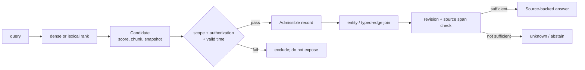
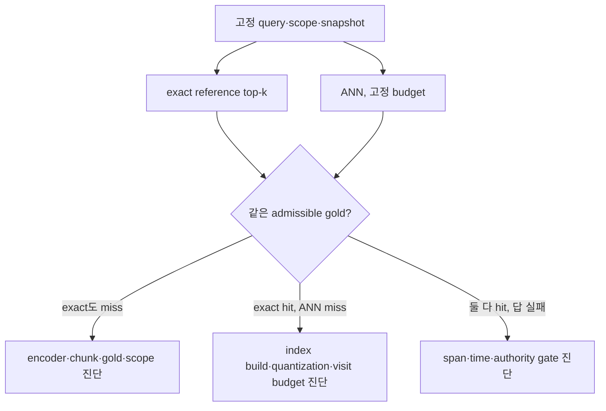
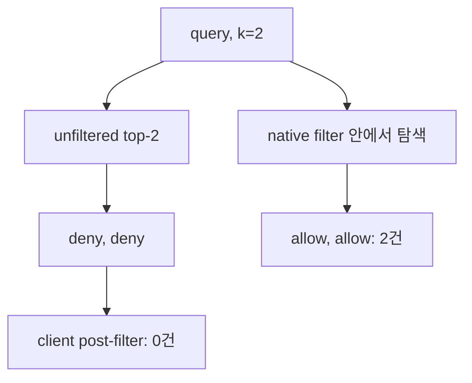

# 22장 벡터 검색의 논리적 경계: 점수는 후보를 고를 뿐, 답을 허가하지 않는다

에이전트가 “관련 문서를 찾았다”고 말할 때, 그 말은 서로 다른 네 일을 한데 뭉개기 쉽다. 질문과 가까운 문서를 **순위화**했는가, 사용자가 그 문서를 **볼 자격**이 있는가, 문서가 지금도 **유효**한가, 그리고 그 문서의 어느 문장이 답을 **뒷받침**하는가. 임베딩 검색은 첫 질문에는 매우 강하다. 나머지 셋을 점수 하나로 대신할 수는 없다.

이 장의 목표는 벡터 검색을 의심하는 것이 아니라, 그 출력의 타입을 정확히 정하는 데 있다. 그래야 24장에서 lexical·dense·graph를 섞어도 검색기가 결정권자가 되는 사고를 피할 수 있다.

## 22.0 하나의 `0.91`이 말하지 않는 것

질문 $q$와 문서 조각 $d$에 대해 dense retriever가 주는 값은 대개 다음과 같다.

$$
s(q,d)=\cos(e_q,e_d),\qquad C_k(q)=\operatorname{TopK}_d\;s(q,d).
$$

여기서 $C_k$는 **후보 집합**이다. cosine이 클수록 표현 공간에서 가깝다는 뜻이지, 문서의 모든 진술이 참이라는 뜻도, 현재 주체가 읽어도 된다는 뜻도 아니다. 이 차이는 API 타입으로 드러내는 편이 가장 안전하다.

|단계|입력|출력 타입|이 단계만으로 말할 수 있는 것|말할 수 없는 것|
|---|---|---|---|---|
|검색|질문, index snapshot|`Candidate(score, chunkId)`|가까운 조각의 순위|권한·최신성·진술의 근거|
|범위·정책 검사|candidate, principal, tenant, policy revision|`AdmissibleRecord`|이 주체가 이 시점에 읽을 수 있는 record|질문에 답하는 source span|
|시간·엔터티·관계 검사|record, as-of, entity key|`VerifiedFact`|지정한 사실 재고에서 성립하는 edge|재고 밖의 부정 사실|
|출처 연결|fact, source revision, span|`SourceBackedAnswer`|인용 가능한 답과 근거 위치|완전한 세계 지식|



`Candidate`와 `SourceBackedAnswer`를 같은 구조체로 만들면, 이후의 개발자가 score가 있음을 proof가 있음을 뜻하는 것처럼 사용할 수 있다. 반환값과 로그에서 타입을 분리하는 일은 문서화 취향이 아니라 권한 누출과 오래된 답을 막는 설계다.

## 22.1 검색기에는 세계 모델이 없다

### 권한은 의미적 유사도가 아니다

지원 티켓의 요약은 서로 다른 tenant에서 거의 동일할 수 있다. global top-`k`를 먼저 구하고 tenant filter를 나중에 적용하면, 허용되지 않은 문서가 상위 칸을 채워 허용 문서를 밀어낼 수 있다. 더 나쁜 경우 candidate ID, score, count, latency 자체가 보호 대상의 존재를 새게 한다.

다음은 작은 반례다. `support/a`의 최신 redacted 문서 하나와, 의미가 더 가까운 타 tenant·revoked·stale 문서 네 개가 있다고 하자. global exact top-4 뒤 filter는 허용 결과를 0개 낼 수 있다. 반대로 tenant, scope, revision, entity, authorization을 먼저 고정한 뒤 exact search하면 같은 budget에서 허용 문서를 찾는다. 이 현상은 retriever가 부정확해서가 아니라 **검색한 우주가 달랐기 때문**이다.

Faiss도 filtering과 index 구성의 trade-off를 별도로 다룬다. 이는 Faiss가 authorization을 제공한다는 뜻이 아니다. 정책 결정은 index 바깥의 policy revision, principal, resource, 시각을 가진 독립된 결정이어야 한다. [Faiss FAQ](https://github.com/facebookresearch/faiss/wiki/FAQ)와 [Faiss 인덱스 개요](https://github.com/facebookresearch/faiss/wiki/Faiss-indexes)는 이웃 탐색의 speed/accuracy 선택을 설명하는 원전이다.

### 최신성은 벡터 차원이 아니다

같은 계약의 2024년판과 2026년 개정판은 가까울 것이다. 하지만 `validFrom`, `validTo`, ingestion generation, source revision이 embedding에 들어 있다고 보장할 수 없다. 특히 chunk의 본문은 그대로인데 표의 단서 한 줄만 바뀐 경우, 가장 가까운 chunk가 가장 오래된 revision일 수 있다.

따라서 요청에는 `asOf`와 snapshot identity를, 문서에는 valid interval과 revision digest를 둔다. 비교의 대상은 “문서 ID가 같은가”가 아니라 “이 `asOf`에서 그 revision이 유효한가”다. 시간 조건을 만족하지 못하면 점수가 아무리 높아도 answer pool에서는 탈락한다.

### source span은 chunk ID보다 좁다

chunk는 검색 단위이고 span은 인용 단위다. 한 chunk 안에 가설·반례·결론이 함께 있을 수 있다. `chunk-17`이 찾아졌다는 사실은 어느 문장이 답인지 정하지 않는다. 답에는 source URI, revision, byte/line/section locator, 추출 시각, 그리고 claim과 span의 연결을 남긴다. 이 연결이 없으면 reranker를 바꾼 뒤 어떤 근거가 사라졌는지 조사할 수 없다.

## 22.2 정확 검색도 논리적 빈칸을 메우지 못한다

ANN은 방문 수를 줄여 latency를 얻고, exact kNN은 동일한 표현과 거리 아래의 순위를 정확히 계산한다. 둘은 중요하게 다르다. 하지만 exact kNN으로 바꾼다고 권한, 부정, 인과, provenance가 생기지는 않는다.

|문제|exact kNN이 고치는가|별도로 필요한 것|
|---|---:|---|
|방문하지 못한 가까운 이웃|예|index·metric·snapshot 기록|
|허용 문서를 top-k 밖으로 밀어낸 post-filter|아니오|scope/authz prefilter 또는 정책 인식 index|
|“승인이 없다”는 부정 결론|아니오|완결 재고와 coverage owner|
|A가 B를 야기했다는 결론|아니오|방향·시점·근거가 있는 causal claim|
|인용 위치의 재현|아니오|source revision과 span locator|

여기서 둘의 loss를 반드시 분리한다.

$$
\text{authorized recall loss}=R_{\text{scoped exact}}-R_{\text{path}},
$$

여기서 `path`가 global top-k 후 filter이면 정책 순서의 loss이고, scoped exact 뒤 approximate visit budget이면 ANN approximation loss다. 둘을 하나의 “retrieval recall”로 평균 내면 해결책이 반대로 간다. 전자는 검색 공간을 바꾸어야 하고, 후자는 index parameter·hardware budget·encoder를 조정해야 한다.

### 부정은 top-k의 빈칸에서 나오지 않는다

top-k에 `hasExternalApproval` 문서가 없다고 해서 승인이 없다고 말할 수는 없다. [RDF 1.1 Semantics](https://www.w3.org/TR/rdf11-mt/)의 open-world 해석에서 관측되지 않은 triple은 false가 아니다. 그저 모른다.

“없음”을 답하려면 최소한 다음을 확인한다.

1. 어떤 inventory가 해당 entity와 predicate를 완결하게 관리하는가.
2. inventory owner와 coverage window는 무엇인가.
3. as-of snapshot에서 그 inventory가 실제로 조회되었는가.
4. `not found`가 timeout·partial shard·권한 거부와 구별되는가.

이 네 조건이 없으면 올바른 반환은 `false`가 아니라 `unknown` 또는 escalation이다. 부정의 가격은 검색 score가 아니라 재고의 완결성이다.

## 22.3 운영 로그는 점수와 판정을 섞지 않는다

검색 trace에는 적어도 `queryDigest`, encoder/index revision, index snapshot, candidate ID, dense·lexical·rerank score, 방문 budget을 기록한다. 정책 trace에는 principal pseudonym, tenant, resource, policy revision, decision, decision time을 둔다. provenance trace에는 source revision, span, extraction method, fact와 answer의 연결을 둔다.

이 세 trace를 하나의 request/AgentRun ID로 조인할 수는 있어도, 하나의 score column으로 합쳐서는 안 된다. 예를 들어 `score=0.93, policy=deny`는 search failure가 아니라 정상적인 **배제**다. `score=0.72, policy=allow, source span missing`은 인용 가능한 answer가 아니라 추가 검증이 필요한 candidate다.

### 코드로 보는 fail-closed 판정

아래 의사 코드는 검색 결과가 비어도 부정을 발명하지 않고, source span이 없으면 답을 승격하지 않는다.

```python
# 의사코드다. index·policy·facts·synthesize의 구체 API는 검색 stack에 맞춰 연결해야 한다.
def retrieve_answer(request, index, policy, facts):
    scope = policy.scope(request.principal, request.tenant, request.as_of)
    candidates = index.search(request.query, scope=scope, k=32)  # Candidate only
    allowed = [c for c in candidates if policy.allows(request, c.record_id)]
    joined = [facts.join(c, as_of=request.as_of) for c in allowed]
    supported = [x for x in joined if x.is_valid and x.source_span is not None]
    if not supported:
        return {"kind": "unknown", "reason": "no source-backed fact"}
    return synthesize(supported)
```

실제 구현에서는 `scope`를 단순 list filter로 축소하지 말고, policy engine이 어떤 revision으로 판단했는지 receipt를 남긴다. 또한 `facts.join`이 실패한 것과 source가 “없다”는 것을 같은 오류 코드로 만들지 않는다.

## 22.4 실습: post-filter 손실을 재현하고 설명한다

작은 결정론적 실습은 production ANN benchmark가 아니다. 다만 “global top-k 후 filter”와 “scope 후 exact search”가 다른 질문을 답한다는 사실을 재현한다.

```python
# 의사 코드: 같은 metric·snapshot에서 경로만 바꾼다.
global_then_filter = [d for d in exact_knn(query, corpus, k=4) if d.tenant == tenant]
scoped_exact = exact_knn(query, [d for d in corpus if d.tenant == tenant], k=4)
assert global_then_filter != scoped_exact  # 반례 corpus에서 의도적으로 성립
```

실행 뒤 다음 표를 직접 채운다.

|경로|후보 수|허용 후보 수|정답 반환|손실의 원인|
|---|---:|---:|---:|---|
|global exact → post-filter| | | |정책 순서 / budget 소진|
|scope → exact| | | |없음 또는 데이터 부족|
|scope → approximate| | | |방문하지 않은 이웃|

그 다음 위 fixture의 `closed_inventory_declared=false`를 확인한다. external approval edge가 없더라도 결과가 `false`가 아니라 `unknown`이어야 한다. 이 검사는 검색 품질 시험이 아니라 답변 타입 시험이다.

## 22.5 encoder는 검색기의 눈이고, chunk는 그 눈이 보는 단위다

벡터 검색을 진단할 때 index 파라미터부터 만지는 습관은 흔하지만, 오류는 그보다 앞선 encoder와 chunk 경계에서 시작하는 경우가 많다. encoder는 문장을 숫자로 바꾸는 함수 $e(\cdot)$일 뿐이다. 질문과 chunk가 같은 언어, 같은 도메인, 같은 입력 형식으로 주어졌을 때 어떤 차이를 보존하도록 학습되었는지가 결과를 좌우한다. 코드 식별자와 오류 로그를 자연어 설명처럼 encode하거나, 질의용 prefix를 요구하는 모델에 문서용 prefix를 넣으면 exact search라도 잘못된 공간에서 정확한 순위를 낸다.

chunking도 단순한 전처리가 아니다. 검색기가 보는 문서는 원문이 아니라 $c_i=\operatorname{chunk}(D,i)$다. 한 조각이 너무 짧으면 조건과 예외가 분리된다. 너무 길면 하나의 embedding이 서로 다른 주제를 평균 내고, reranker와 생성기의 context 비용도 커진다. 특히 정책 문서에서 “허용한다”와 “단, 외부 전송은 제외한다”가 서로 다른 chunk로 갈라지면, 첫 문장만 높은 점수를 얻어 위험한 답이 만들어질 수 있다.

|증상|가장 먼저 할 진단|흔한 잘못된 처방|다음 실험|
|---|---|---|---|
|정확한 ID 질의가 묻힌다|tokenization과 lexical baseline|embedding dimension 증가|ID·error code만 든 probe set 비교|
|긴 규정의 예외가 사라진다|chunk boundary와 overlap|top-k만 확대|조건·예외가 같은 evidence unit에 남는지 검사|
|질문 표현을 바꾸면 결과가 급변한다|query/document template와 normalization|ANN visit budget 증가|동의어·부정·날짜 paraphrase 쌍 평가|
|같은 문서의 구판이 이긴다|revision metadata와 index generation|reranker 교체|동일 본문·다른 revision probe|

좋은 진단 corpus에는 정답 문서만 넣지 않는다. 동일 entity의 구판, 다른 tenant의 거의 같은 문서, 부정 조건만 다른 문서, 예외가 뒤에 붙은 문서를 함께 넣는다. 그래야 “encoder가 의미를 이해했다”가 아니라 어느 구분을 잃었는지 말할 수 있다. 평가의 gold label 역시 단순 document ID보다 `(record revision, span, admissibility)`로 둔다. 검색이 구판 전체를 찾았더라도 현재 revision의 필요한 문장을 찾지 못했다면, 인용 가능한 정답 기준에서는 실패다.

### chunk를 evidence unit으로 설계하는 질문

chunk boundary를 정할 때는 token 길이보다 먼저 다음을 묻는다. 이 조각만 읽은 사람이 주어·조건·예외·시간 범위를 보존할 수 있는가? 조각의 앞뒤를 붙이지 않고도 source span locator를 만들 수 있는가? 표의 header와 row, 코드의 함수 서명과 오류 처리, 계약의 조항과 예외가 함께 남는가? 답이 아니면 overlap을 늘리는 것보다 구조적 split을 택하는 편이 낫다. heading, table row, function block, speaker turn 같은 원문 구조는 whitespace 길이보다 좋은 경계 신호다.

그러나 overlap은 공짜가 아니다. overlap이 커지면 같은 근거가 여러 후보로 중복되고, RRF와 reranker가 그것을 독립 증거처럼 과대표할 수 있다. dedup key는 raw chunk ID가 아니라 canonical source revision과 span range를 포함해야 한다. 생성 모델에는 가장 높은 score의 세 조각을 그대로 넣기보다, 서로 다른 claim을 지지하는 최소 span 묶음을 넣는다.

## 22.6 exact와 ANN을 나누어 고치는 진단 절차

ANN 장애를 “recall이 낮다” 한 줄로 적으면 원인을 찾을 수 없다. 우선 같은 encoder, 같은 normalized vector, 같은 scope, 같은 snapshot에서 exact reference를 만든다. 그 뒤 ANN의 `nprobe`, graph traversal budget, candidate budget을 바꾸며 exact top-k와의 겹침을 재면 approximation loss가 나온다. 이 실험에서 metadata filter나 revision filter를 바꾸면 비교 기준이 무너진다.



quantization과 approximate traversal은 모두 latency·memory를 절약하지만 서로 다른 손실을 낸다. vector quantization은 거리 계산 자체를 근사하고, traversal budget은 후보 공간 방문을 제한한다. 반면 post-filter loss는 거리가 맞아도 금지된 후보가 budget을 점유해서 생긴다. 셋을 분해하지 않으면 GPU를 더 쓰거나 index를 재구축해도 권한 순서 버그는 남는다.

운영에서 최소한 query class별로 `scoped_exact_overlap`, `ANN visit count`, `filter rejection count`, `revision rejection count`, `span coverage`, `unknown reason`을 함께 표본 추출한다. 모든 요청에 exact search를 켜라는 뜻은 아니다. 변경 전후의 sentinel set과 sampled shadow traffic에서 exact reference를 만들고, 비용 상한을 넘기면 표본을 줄인다. 정확도 추정 자체가 tenant 경계를 넘지 않도록 probe corpus와 access scope도 분리한다.

### 이 절이 보장하지 않는 것

여기까지의 진단 절차는 ANN 구현 오차와 입력·정책·세대 문제를 서로 다른 원인으로 좁혀 준다. 그러나 검색 결과의 사실성, 허용성, 원전 완전성 또는 부정 명제의 참을 자동으로 증명하지는 않는다. 각각은 뒤 절의 graph·provenance·inventory gate에서 별도로 판정해야 한다.

## 22.7 실제 HNSW 반례에서 배우는 숫자의 읽는 법

Qdrant v1.19.0, 16차원 2,003개 point, `m=4`, `ef_construct=8`, query `hnsw_ef=1`로 40개 query의 exact top-10과 ANN top-10을 비교했다. 평균 recall@10은 0.705, 최솟값은 0.2였고 36/40 query에서 집합 또는 순서가 달랐다. 일부러 탐색 예산을 작게 만든 반례이므로 제품 기본 품질의 대표값은 아니다. 대신 다음 사실을 분명히 보여 준다.

\[
\operatorname{Recall@k}_{ANN}=
\frac{|N_k^{ANN}(q)\cap N_k^{exact}(q)|}{|N_k^{exact}(q)|}
\]

이 분모는 “exact 검색기가 고른 이웃”이다. 사람이 정한 의미 gold, 정책상 허용된 문서, 출처가 완전한 문서의 분모와 같지 않다. ANN recall이 1이어도 답은 틀리거나 금지되거나 오래될 수 있다.

Qdrant의 [`HNSW read dispatch`](https://github.com/qdrant/qdrant/blob/af875b4bfd98103f7c0ee34fe4f25c5099893ca9/lib/segment/src/index/hnsw_index/hnsw/read_view/dispatch.rs#L56-L174)는 `exact` 여부뿐 아니라 vector 수와 filter cardinality에 따라 plain search와 graph search를 선택한다. 그래서 API에 `exact=false`가 찍혔다고 모든 요청이 HNSW를 탔다고 단정할 수 없다. 실행 경로를 확인하려면 인덱싱된 vector 수, filter cardinality 추정, 실제 search parameters를 함께 남겨야 한다.

### top-k 절단과 동점은 exact에서도 남는다

동일 벡터 두 개를 넣은 query에서 exact top-1은 둘 중 하나만 돌려주었고, top-3에서는 두 레코드가 모두 score 1.0으로 나타났다. 관련 문서 수가 k보다 많으면 exact search도 나머지를 잘라 낸다. 동점 순서를 의미 우선순위로 읽지 말고 secondary key, 충분한 candidate budget, deterministic pagination 계약을 둔다.

### filter 위치가 안전성과 recall을 동시에 바꾼다

unfiltered exact top-2가 모두 deny tenant 문서인 상황에서 client post-filter 결과는 빈 배열이었다. 같은 query에 native allow filter를 적용하자 허용 문서 두 개가 채워졌다.



post-filter는 품질만 나쁜 것이 아니다. 금지된 payload와 score가 client 경계까지 전달된 뒤 버려진다면 이미 candidate exposure가 발생했다. native filter도 외부 정책의 관계·시간 의미론과 자동으로 같아지는 것은 아니므로 policy revision과 query generation을 fence해야 한다.

### 삭제 완료 응답 뒤에도 물어야 할 것

한 프로세스에서 `wait=true` 삭제 전 결과 `[9003,2000]`이 삭제 뒤 `[2000,1996]`으로 바뀌었다. 이는 그 API가 관측한 visible set의 변화다. client cache, embedding 생산 지연, ingestion queue, 다른 replica의 visibility까지 증명하지 않는다. source revision, embedding revision, ingestion generation, tombstone 상태를 하나의 “최신 timestamp”로 뭉치지 않는다.

### 현장 진단표

| 증상 | 먼저 고정할 것 | 비교 | 흔한 오진 |
|---|---|---|---|
| 관련 문서 누락 | vector와 snapshot | exact 대 ANN | encoder 탓으로 단정 |
| 결과 수 부족 | k와 filter | native 대 post-filter | 데이터가 없다고 단정 |
| 높은 score 오답 | encoder/pooling | label별 score 분포 | score를 확률로 표시 |
| 삭제 문서 재등장 | generation/replica | peer별 visible IDs | ANN 비결정성으로 치부 |
| 출처 없는 정답 | locator/hash 계약 | admitted set의 완전성 | semantic recall로 합산 |

- 높은 cosine은 사실성·권한·현재성·인과성을 보장하지 않는다.
- exact kNN은 선택한 embedding과 metric 안에서만 exact다. 원문 의미에 대한 oracle이 아니다.
- ANN recall이 1이어도 chunk가 조건을 잃었으면 인용 가능한 답의 recall은 1이 아닐 수 있다.
- post-filter 뒤 빈 결과는 “문서가 없다”나 “권한이 없다”의 증명이 아니다.

## 장을 닫기 전 체크리스트

- [ ] score, candidate, admissible record, source-backed answer가 서로 다른 타입인가?
- [ ] authz와 valid time이 answer 생성 전에 확인되는가?
- [ ] global post-filter와 scoped retrieval의 authorized recall을 별도로 측정하는가?
- [ ] ANN miss와 policy ordering miss를 같은 recall로 부르지 않는가?
- [ ] negative answer에 complete inventory·owner·coverage가 있는가?
- [ ] 답마다 revision과 정확한 source span을 복원할 수 있는가?

다음 장에서는 후보 조각을 entity와 typed edge로 결합하는 그래프 질의를 다룬다. 그래프는 이 빈칸을 표현하고 검사하는 데 도움이 되지만, 그래프에 edge가 있다는 사실만으로 세계가 완결되는 것은 아니다.

## 원전

- [RDF 1.1 Semantics](https://www.w3.org/TR/rdf11-mt/)
- [Faiss FAQ](https://github.com/facebookresearch/faiss/wiki/FAQ)
- [Faiss indexes](https://github.com/facebookresearch/faiss/wiki/Faiss-indexes)
