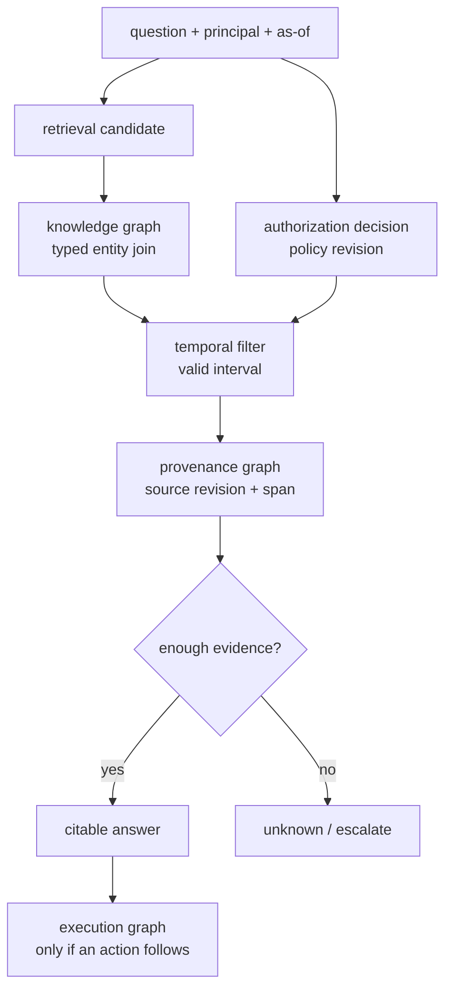
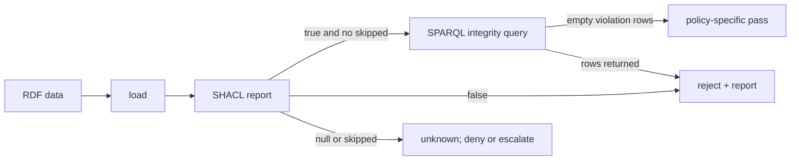
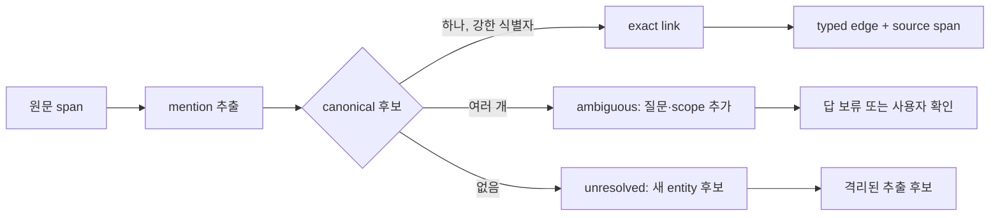
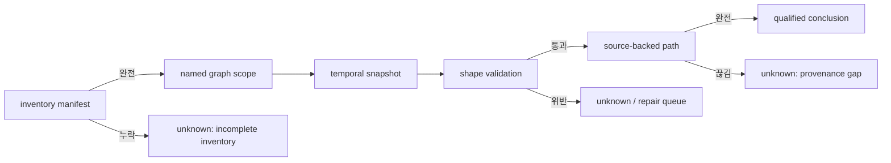

# 23장 그래프·추론·시간 질의: 연결을 증명으로 오인하지 않는 법

벡터 검색이 후보를 넓게 찾았다면, 그래프는 그 후보를 관계·방향·시각·출처라는 제약으로 좁히는 데 유리하다. 하지만 그래프가 있다고 해서 추론이 자동으로 정확해지거나, edge가 없으면 거짓이 되거나, provenance가 완결성을 보장하는 것은 아니다. 이 장은 그래프 질의를 “무엇을 알고 있는가”보다 “어떤 가정 아래 무엇을 판정했는가”라는 관점에서 읽는다.

## 23.0 네 graph를 구별한다

하나의 서비스에는 이름은 모두 graph지만 의미가 다른 구조가 공존한다.

|구조|node와 edge가 뜻하는 것|답할 수 있는 질문|답할 수 없는 질문|
|---|---|---|---|
|knowledge graph|entity와 typed fact|누가 무엇과 어떤 관계인가|추출 오류가 없다는 보장|
|provenance graph|entity, activity, agent의 유래|이 claim은 어느 revision/span에서 왔는가|모든 source를 수집했다는 보장|
|execution graph|task, tool call, retry, effect|어떤 실행이 어떤 effect를 일으켰는가|사실 진술의 진위|
|authorization graph|principal, role, resource, delegation|누가 어떤 action을 할 수 있는가|검색 relevance|



같은 `Document` 노드가 네 graph에 나타나더라도 edge의 종류를 생략하면 잘못된 조인이 생긴다. “문서가 검색되었다”와 “문서가 권한을 부여한다”는 전혀 다른 predicate다.

## 23.1 open world: 없는 edge는 false가 아니다

RDF의 표준 의미론은 관측하지 못한 triple을 거짓으로 닫지 않는다. [`ex:Ticket42 ex:hasExternalApproval ?x`가 없었다]는 관측과 [`Ticket42에는 external approval이 없다]는 부정 사실 사이에는 complete inventory라는 추가 전제가 있다.

이 점을 코드 리뷰에서 명시적으로 드러내려면 결과를 Boolean 대신 세 값으로 모델링한다.

```text
true     : 명시된 source와 temporal scope에서 supporting edge를 확인
false    : 완결 재고가 같은 scope에서 counter-edge/부재를 판정
unknown  : edge가 관측되지 않았거나 재고의 범위·완결성이 부족
```

SPARQL의 `FILTER NOT EXISTS`는 현재 query dataset에서 pattern이 매칭되지 않는다는 연산이지, 바깥 세계에서 그 사실이 거짓임을 선언하는 장치가 아니다. [SPARQL 1.1 Query](https://www.w3.org/TR/sparql11-query/)의 dataset·`GRAPH`·`NOT EXISTS` 의미를 query 작성 시점에 확인해야 한다.

### named graph와 default graph는 서로 바꿔 쓸 수 없다

named graph를 쓰면 source, tenant, revision, ingestion batch를 graph name으로 분리할 수 있다. 하지만 default graph에 무엇이 들어가는지는 store와 query의 dataset clause가 정한다. 같은 triple이라도 default graph가 named graph들의 union인지, 빈 graph인지, caller-specified graph인지에 따라 결과가 달라진다.

SPARQL의 dataset clause는 query text만큼이나 결과의 의미를 결정한다. “query가 빈 결과를 냈다”를 조사할 때 pattern만 고치기 전에 named/default/union 범위를 먼저 확인해야 하는 이유다.

|증상|성급한 해석|먼저 확인할 것|
|---|---|---|
|결과가 비었다|사실이 없다|dataset, `GRAPH`, tenant/revision scope, timeout|
|결과가 너무 많다|추론기가 과잉 추론한다|default union, graph isolation, duplicate source revision|
|다른 실행과 결과가 다르다|SPARQL nondeterminism|snapshot ID, load order, inference profile, parameter bytes|

## 23.2 rule, tableaux, SHACL은 같은 검증기가 아니다

RDFS/OWL rule 계열은 명시된 규칙에서 entailment를 늘린다. tableaux는 OWL DL의 satisfiability와 model construction을 다루는 추론 절차다. SHACL은 shape로 표현한 데이터 제약을 검사한다. 셋은 보완적이지만 서로의 빈 자리를 자동으로 메우지 않는다.

|도구|주 질문|성공이 뜻하는 범위|성공이 뜻하지 않는 것|
|---|---|---|---|
|RDFS/OWL RL rules|무슨 triple이 entail되는가|선택한 profile의 rule closure|원 source의 진실·모든 OWL DL 결론|
|OWL DL tableaux|OWL DL 지식 모델이 만족 가능한가|선택한 DL semantics의 consistency 판단|운영 데이터의 policy authorization|
|SHACL|data node가 shape를 만족하는가|지원되는 constraint의 validation|world closure·완전한 vocabulary 차단|

reasoner가 requested profile을 지원하지 못하면 단순 RDFS closure나 no-inference 경로로 fallback할 수 있다. CI에는 requested profile과 실제 `profile_used`를 둘 다 남겨야 한다. profile 문자열 오타나 기능 미지원이 “성공한 고급 추론”처럼 보이는 일을 막기 위해서다.

### SHACL의 `null`은 통과가 아니다

지원하지 않는 target 또는 constraint가 있을 때 validator가 `conforms: null`과 skipped constraint를 돌려줄 수 있다. 이는 true가 아니라 **판정 유보**다. admission gate는 `conforms == true`이며 skipped constraint가 0일 때만 pass로 둔다.



SHACL이 `true`여도 shape에 적지 않은 predicate가 없다는 말은 아니다. 폐세계 vocabulary policy가 필요하면 별도의 allowed-predicate audit과 source-of-truth가 필요하다. schema validator의 통과를 access control pass로 재활용하지 않는다.

## 23.3 시간은 filter 하나가 아니라 snapshot 계약이다

temporal query의 입력은 `asOf=2026-09-01T...`만이 아니다. valid time(현실에서 유효한 기간), transaction/ingestion time(시스템이 안 시각), source revision, graph snapshot ID를 함께 정해야 한다. 늦게 들어온 정정은 valid time과 ingestion time이 달라질 수 있다.

```sparql
SELECT ?claim ?span WHERE {
  GRAPH ?g {
    ?claim :about :Policy42 ; :validFrom ?from ; :sourceSpan ?span .
    OPTIONAL { ?claim :validTo ?to }
  }
  FILTER (?from <= ?asOf && (!BOUND(?to) || ?asOf < ?to))
}
```

이 쿼리는 예시일 뿐이다. `?g`가 어느 tenant·revision·snapshot을 의미하는지 밖에서 정하지 않으면 cross-tenant revision을 조인할 수 있다. `validTo`의 inclusive/exclusive convention, time zone, source publication time과 system ingestion time도 API contract에 고정한다.

### source-backed path의 최소 단위

다중 홉 답에는 각 hop마다 다음 tuple을 남긴다.

```text
(subject, predicate, object, direction, valid interval,
 source revision, span locator, extraction/curation method)
```

path length가 짧다고 인과성이 강한 것은 아니다. `A mentions B`, `B mentions C`는 `A caused C`가 아니다. 인과 relation을 답하려면 predicate 자체, 방향, 시간 선후, 대안 설명을 다룬 source를 별도로 요구한다.

## 23.4 실습: 빈 결과·null·profile fallback을 서로 다른 실패로 만든다

load→SHACL→query가 하나의 shared store에서 순차 실행되는지 확인한다. memory storage의 one-shot CLI를 별 process로 나누면 다음 process는 빈 store를 볼 수 있다. batch와 one-shot의 storage lifetime을 비교해 보라.

실습의 pass condition은 shell exit 0이 아니다.

1. 모든 command envelope에 error가 없는가.
2. SHACL `conforms`가 true이고 skipped constraint가 없는가.
3. “위반을 찾는” integrity query가 빈 배열을 반환했는가.
4. query text, load order, source hash, reasoning profile이 manifest에 있는가.

batch interface가 query field에 inline SPARQL text를 기대하는지, `.rq` 경로를 기대하는지 계약을 확인한다. 파일 경로가 들어가 생긴 parse error를 “빈 결과”로 오독하지 않는 test를 작성한다.

## 23.5 추출은 사실의 복사가 아니라 가설 생성이다

문서에서 triple을 뽑았다고 해서 그래프가 현실을 복제한 것은 아니다. 추출기는 문장, 표, 코드, OCR 결과를 `(subject, predicate, object)` 후보로 바꾸고, entity linker는 문자열을 canonical entity에 붙인다. 두 단계 모두 불확실하다. “Apple”은 회사·과일·프로젝트 codename일 수 있고, `owner`는 문서마다 법적 책임자·운영 담당자·코드 소유자를 뜻할 수 있다. 관계의 문법적 방향도 실무 의미의 방향과 다를 수 있다.

따라서 edge에는 최소한 다음을 붙인다.

|필드|목적|없을 때 생기는 오답|
|---|---|---|
|`assertionId`|원자 주장 식별|재추출 뒤 어느 사실이 바뀌었는지 모름|
|subject/object canonical key|동명이인·별칭 분리|서로 다른 고객과 조직을 조인|
|predicate vocabulary revision|관계 의미의 버전 고정|`owner` 의미가 바뀌어도 같은 edge로 취급|
|confidence와 extraction method|자동 추출·수동 검토 구분|약한 후보를 승인 근거로 사용|
|source revision/span|검토 가능한 원문 위치|수정된 문장의 낡은 edge가 남음|
|valid/observed interval|현실 시간과 수집 시간 분리|정정을 과거 사실로 오해|

confidence는 score일 뿐 자동 admission 권한이 아니다. 임계값을 넘은 추출 후보를 바로 policy edge로 승격하면 모델의 이름 해석 오류가 access control 버그가 된다. 민감 predicate는 source span을 사람이 검토했거나, 원문 구조가 정형이고 parser가 결정론적이라는 별도 조건을 요구하는 편이 낫다.

### entity resolution의 세 가지 안전한 결과

entity linking의 반환은 `matched`와 `not matched` 두 개가 아니다. `exact`, `ambiguous`, `unresolved`를 구분한다. `ambiguous`를 가장 점수가 높은 entity에 억지로 붙이면 이후 multi-hop 질의가 설득력 있는 허구를 만든다. 이를테면 두 고객이 같은 약어를 쓰는 경우, 검색기는 둘의 문서를 회수하고 그래프는 잘못 연결된 purchase→approval path를 만들 수 있다. 그 순간 path 길이와 score가 짧고 높을수록 오히려 오답은 더 믿음직해 보인다.



실무 probe set에는 alias, transliteration, 조직 합병 전후 이름, 재사용된 product code, 동일한 이름의 사람을 넣는다. link precision만 재지 말고, `ambiguous`로 정직하게 보류한 비율과 잘못된 forced merge 비율을 따로 본다. 권한·지급·의료 같은 high-impact predicate는 false merge의 비용이 false split보다 훨씬 크다.

## 23.6 drift는 graph가 오래되었다는 한마디보다 구체적이다

drift에는 적어도 네 종류가 있다. source drift는 원문 revision이 바뀌는 일, schema drift는 predicate와 shape 의미가 바뀌는 일, entity drift는 canonical ID의 병합·분할·별칭 변화, inference drift는 reasoner version/profile 변화다. 같은 query가 어제와 오늘 다르게 답했을 때 “데이터가 업데이트됐다”만으로는 재현할 수 없다.

|변화|반드시 기록할 비교쌍|재계산 범위|안전한 기본값|
|---|---|---|---|
|source revision|old/new digest, changed span|그 span에 의존한 assertion|낡은 edge를 current answer에서 제외|
|predicate 정의|vocabulary revision, mapping|해당 predicate를 쓴 path|호환 mapping이 검토될 때까지 unknown|
|entity merge/split|old/new canonical key|link와 downstream join|과거 path를 새 identity로 자동 승계하지 않음|
|reasoner/profile|requested/actual profile, version|derived triple과 validation report|새 closure를 별 snapshot으로 저장|

삭제도 drift다. 원문에서 문장이 사라졌다고 과거에 존재하지 않았던 것은 아니며, 현재 답에 사용할 수 없다는 것과 audit에서 삭제해야 한다는 것도 다르다. 현재 serving graph와 append-only provenance ledger의 retention policy를 분리한다. serving graph에서는 retracted edge를 current query에서 제외할 수 있지만, audit ledger에서는 언제 누구의 어떤 revision이 그것을 사용했는지 남겨야 incident를 복원할 수 있다.

### SHACL `null`과 profile fallback의 운영 절차

validation 결과가 `null`, `skipped`, `unsupported`이면 success counter를 올리지 않는다. 먼저 shape가 요구한 constraint와 validator가 실제 검사한 constraint의 차이를 report에 적고, 지원되는 더 작은 shape 집합으로 범위를 축소할지, 다른 validator로 재검증할지, 해당 data product를 보류할지 정한다. 아무 조치도 하지 않은 fallback은 validation이 아니라 관측되지 않은 downgrade다.

reasoner도 같다. `OWL RL`을 요청했는데 runtime이 RDFS만 수행했다면 derived edge 수가 0이어도 “규칙이 만족됐다”가 아니다. request profile, resolved profile, unsupported feature, source snapshot, validator version을 하나의 validation receipt에 고정한다. deployment에서 profile이 바뀌면 기존 path를 재현할 수 있도록 이전 executable과 rule set digest도 보존한다.

```text
accept validation only if
  report.conforms is true
  and report.skipped_constraints == 0
  and resolved_profile == requested_profile
  and snapshot_digest == expected_snapshot_digest
else
  quarantine the derived assertions; return unknown for dependent claims
```

### 비보장

- 추출 confidence와 link score는 source의 사실성이나 정책 권한을 보장하지 않는다.
- shape 통과는 vocabulary 밖 predicate가 없거나 그래프 전체가 완결되었다는 뜻이 아니다.
- 추론 profile fallback은 성능 최적화처럼 보여도 derived fact의 의미를 바꾸는 호환성 사건이다.
- source가 바뀌었다는 사실만으로 과거 execution의 provenance를 지워서는 안 된다.

다음 장은 이 graph gate를 lexical·dense retrieval과 조합한다. 핵심은 모든 retriever를 더하는 일이 아니라, 어느 단계가 candidate를 만들고 어느 단계가 admission을 결정하는지 순서를 보존하는 것이다.

## 23.7 named graph는 출처 이름표가 아니라 질의 범위다

quad ((s,p,o,g))에서 (g)는 장식용 metadata가 아니다. 질의가 default graph를 보는지, 특정 named graph를 보는지, 여러 graph의 union을 보는지에 따라 같은 triple도 보이거나 사라진다. 그러므로 “저장돼 있다”와 “현재 query scope에서 참이다”를 구분해야 한다.

```sparql
SELECT ?claim ?source WHERE {
  GRAPH ?g {
    ?claim ex:supportedBy ?source ;
           ex:validFrom ?from .
    OPTIONAL { ?claim ex:validUntil ?until }
    FILTER (?from <= ?asOf && (!BOUND(?until) || ?asOf < ?until))
  }
  VALUES ?g { ex:reviewedSources ex:runtimeObservations }
}
```

여기서 빈 결과는 적어도 네 가지다. 실제로 없을 수 있고, graph scope를 틀렸을 수 있고, as-of 밖일 수 있고, 필요한 graph가 아직 load되지 않았을 수 있다. 이들을 하나의 `false`로 접으면 open-world 데이터에서 위험한 부정을 만든다.

### 시간 snapshot은 단일 시계가 아니다

실전 snapshot은 보통 다음 tuple이다.

\[
S=(t_{asof}, G_{included}, r_{source}, g_{ingest}, r_{policy})
\]

`as-of`만 같아도 source revision이나 ingestion generation이 다르면 결과가 달라진다. 공개 구현의 temporal query 경로는 scope와 snapshot 입력을 분리해 받는다. 고정 커밋의 [snapshot query 구현](https://github.com/fabio-rovai/open-ontologies/blob/d423869aa071afebf0806e7e79e724be5fe81ac6/src/temporal.rs#L1835-L1962)과 [입력 검증](https://github.com/fabio-rovai/open-ontologies/blob/d423869aa071afebf0806e7e79e724be5fe81ac6/src/inputs.rs#L1168-L1186)을 함께 읽으면, query 문법 지원과 의미적 completeness 보장이 별개라는 점이 보인다.

### 완전성은 세 층으로 보고한다

1. **inventory completeness**: 필요한 graph와 source revision이 모두 load됐는가.
2. **shape completeness**: 필수 속성·cardinality·datatype을 검증했는가.
3. **proof completeness**: 결론을 뒷받침하는 source path가 끊기지 않았는가.

SHACL 통과는 2번의 일부다. 그것만으로 1번의 누락이나 3번의 논증 타당성을 증명하지 않는다. 반대로 SHACL 위반은 자동으로 세계의 거짓을 뜻하지 않고, 현재 데이터가 요구한 shape를 만족하지 못했다는 뜻이다.



## 장을 닫기 전 체크리스트

- [ ] knowledge/provenance/execution/authorization graph의 edge type이 분리되어 있는가?
- [ ] edge 부재를 `unknown`으로 두며, `false`에는 complete inventory가 있는가?
- [ ] default graph와 named graph union을 명시했는가?
- [ ] as-of, source revision, ingestion generation, policy revision을 함께 기록하는가?
- [ ] 빈 결과와 incomplete inventory를 구별하는가?
- [ ] shape validation, rule inference, proof verification을 별도 단계로 남기는가?
- [ ] requested reasoning profile과 실제 사용 profile을 함께 남기는가?
- [ ] SHACL `false`, `null`, skipped를 모두 fail-closed 처리하는가?
- [ ] entity merge에 `sameAs`보다 약한 후보 상태와 provenance가 있는가?
- [ ] 결론에서 원문·커밋·행 범위로 역추적할 수 있는가?

## 원전

- [RDF 1.1 Semantics](https://www.w3.org/TR/rdf11-mt/)
- [SPARQL 1.1 Query](https://www.w3.org/TR/sparql11-query/)
- [PROV-O](https://www.w3.org/TR/prov-o/)
