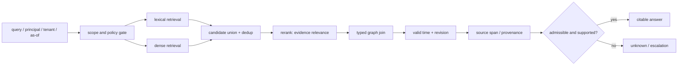
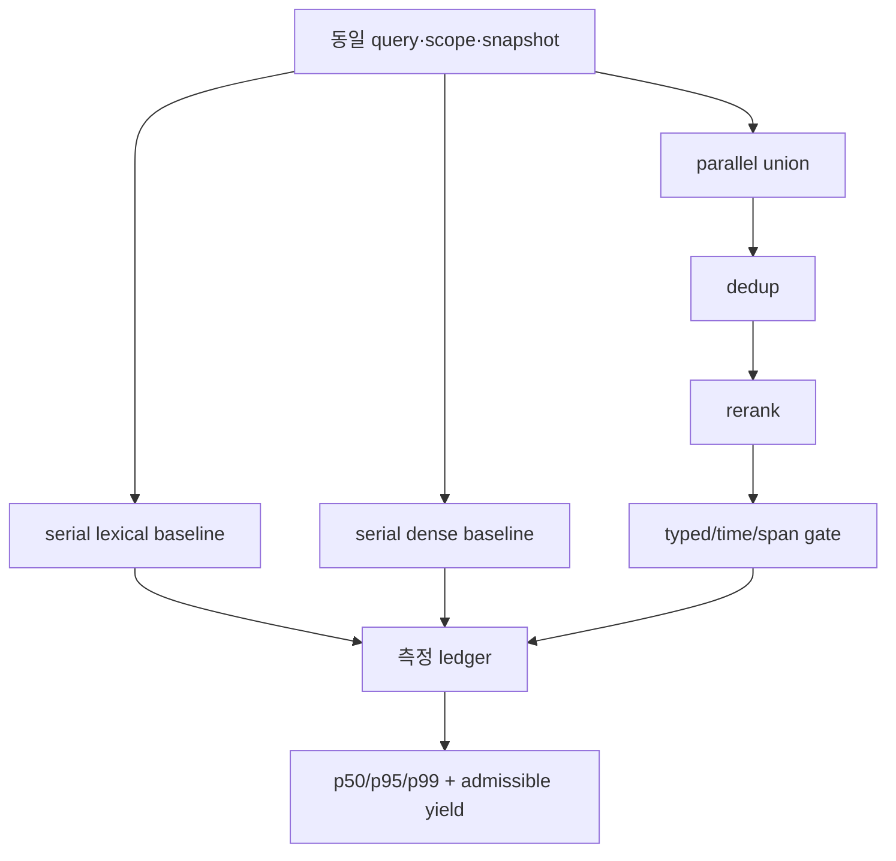
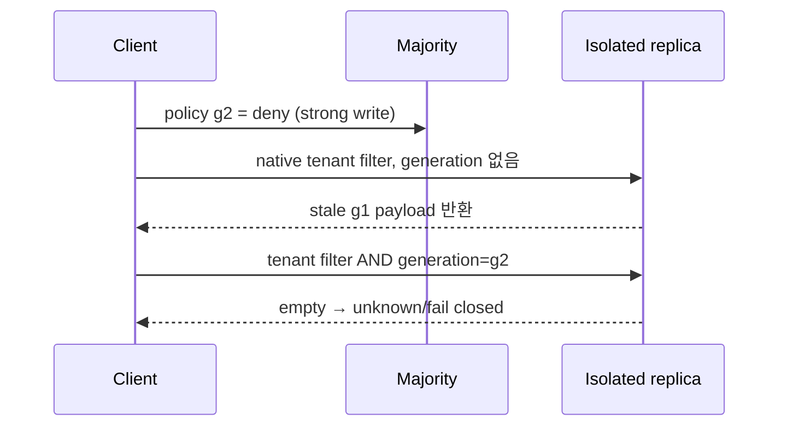

# 24장 하이브리드 검색의 올바른 순서: 넓게 찾되, 근거가 될 때만 채택한다

hybrid retrieval은 BM25와 dense score를 더하는 공식만이 아니다. 서로 다른 검색기가 서로 다른 실패를 보완하게 하고, 그 출력이 행동이나 답의 근거가 되기 전에 권한·시간·엔터티·출처를 닫는 파이프라인이다. 순서를 바꾸면 recall 수치가 좋아 보여도 정보가 새거나, 허용된 최신 근거가 top-k 밖으로 사라질 수 있다.

## 24.0 후보의 합집합과 답의 교집합

lexical search는 정확한 identifier, 희귀한 token, 코드·에러 문자열에 강하다. dense search는 paraphrase와 표현 변형에 강하다. graph join은 entity identity와 typed relation을 점검한다. 셋의 출력은 처음에는 모두 **후보**다. 답은 그 후보 가운데 policy·time·provenance 조건을 모두 만족하는 교집합에서만 만들어진다.



그림의 `scope and policy gate`가 맨 앞에 있는 것은 성능 미세 조정이 아니다. tenant·resource·policy revision이 search universe를 정하기 때문이다. 단, 실제 정책 시스템이 query-time prefilter를 제공하지 않는 환경도 있다. 그때는 global index를 그대로 쓰면서 안전하다고 선언하지 말고, shard isolation, encrypted per-tenant index, allow-list constrained retrieval, 또는 strict post-filter 뒤 부족 결과를 `unknown`으로 돌려주는 trade-off를 명시한다.

## 24.1 fusion은 relevance 후보를 늘릴 뿐이다

rank-based fusion의 간단한 예는 reciprocal rank fusion(RRF)이다.

$$
\operatorname{RRF}(d)=\sum_{r\in\{lex,dense\}}{1\over k+\operatorname{rank}_r(d)}.
$$

RRF는 두 score scale을 억지로 맞추지 않고 rank를 결합한다. 반면 calibrated weighted sum, cross-encoder rerank, late interaction은 서로 다른 비용·학습·score 의미를 가진다. 어느 것을 골라도 `0.87`은 answer validity가 아니라 ranking signal이다.

|기법|강점|대표적인 실패|다음 gate가 검사할 것|
|---|---|---|---|
|lexical|ID, exact phrase, error code|paraphrase·형태 변형|entity key와 revision|
|dense|의미적 근접성|tenant 혼입·stale·negation|policy/time/provenance|
|RRF/union|한 retriever의 miss 완화|중복 후보·verifier context 팽창|dedup과 marginal evidence|
|reranker|질문-문서 관계를 더 정밀 평가|학습 편향·비용·긴 context truncation|span과 factual/authority predicates|
|typed graph join|명시적 multi-hop 관계|entity resolution·edge freshness 오류|source span, temporal scope|

두 retriever가 모두 같은 오래된 문서를 되돌리면 fusion은 독립 근거를 두 개 만든 것이 아니다. `CandidateProvenance`에 retriever 종류, query rewrite, index snapshot, candidate digest를 기록해 duplicate를 검출한다. answer가 요구하는 것은 candidate count가 아니라 **새로운 admissible evidence**다.

## 24.2 반례로 순서를 고정한다

다음 세 경로를 비교하면 왜 “검색 후 filter”가 별개의 질문인지 보인다.

|경로|먼저 하는 일|실패 반례|올바른 해석|
|---|---|---|---|
|A|global top-k → auth filter|타 tenant·revoked·stale 문서가 k칸을 소진|허용 recall이 사라진 정책-ordering loss|
|B|scope/auth → exact search|허용 최신 문서가 반환|같은 vector metric 아래의 기준선|
|C|scope/auth → approximate search|visit budget이 target을 건너뜀|ANN approximation loss|

A와 C의 둘 다 결과가 비어도 원인은 다르다. A는 `k`를 키우는 것으로 우연히 완화될 수 있지만, 금지 candidate의 존재·score·latency를 이미 다루었다. C는 scope가 맞아도 ANN parameter가 target을 방문하지 않은 것이다. 운영 지표도 분리한다.

```text
authorized_recall@k      = allowed gold found / allowed gold
approximation_loss       = scoped_exact_recall - scoped_ann_recall
policy_ordering_loss     = scoped_exact_recall - global_then_filter_recall
source_backed_precision  = cited supported answers / emitted answers
unknown_rate             = requests correctly withheld for insufficient proof / requests
```

특히 `unknown_rate`가 높다고 무조건 나쁜 것이 아니다. source span, valid time, closed inventory가 없는 상황에서 단정하지 않은 결과일 수 있다. 원인을 `authorization`, `freshness`, `entity ambiguity`, `missing span`, `negative incomplete`, `retrieval miss`로 분리해야 개선 예산을 제대로 쓴다.

## 24.3 graph join 뒤에는 provenance를 다시 확인한다

graph join은 “문서 A가 entity X를 언급하고 edge X→Y가 있다”를 결합할 수 있다. 하지만 추출기가 `X`를 잘못 resolve했거나, edge가 이전 revision에서만 유효하면 그 join은 설득력 있게 보이는 오답이 된다. 따라서 답의 각 hop은 별도 source-backed object로 확인한다.

```text
Candidate(chunk, score, indexSnapshot)
  -> AdmissibleRecord(record, policyDecision, policyRevision)
  -> TemporalFact(subject, predicate, object, validInterval, graphSnapshot)
  -> SourceBackedFact(..., sourceRevision, spanLocator)
  -> Answer(claim, supportingFactIds, synthesisRevision)
```

이 순서의 핵심은 `policyDecision`과 `sourceRevision`을 model context의 자연어 설명으로만 넘기지 않는 것이다. typed field와 gate를 두어야 cancellation·retry·rerank 교체 뒤에도 admission 판단을 다시 검증할 수 있다.

### speculation은 기본값이 아니다

여러 rewrite, index, graph path를 동시에 던지는 query fan-out은 때로 latency를 줄인다. 그러나 세 branch가 같은 candidate를 돌려주고 verifier가 세 출력을 모두 읽으면, work는 세 배인데 unique admissible evidence는 하나다. 공통 index shard·rate limit·verifier를 공유하면 wall-clock도 줄지 않고 queue만 길어진다.

fan-out이 정당화되려면 다음 조건을 계측으로 보인다.

1. branch들이 서로 다른 실패 모드를 덮는가.
2. 첫 **admissible** evidence 뒤 loser를 실제로 cancel하는가.
3. verifier input이 raw branch output의 합이 아니라 deduplicated provenance-preserving evidence인가.
4. 외부 effect는 branch 안이 아니라 별도 commit gate 뒤에 있는가.
5. p95/p99, canceled-loser work, queue wait, unique admissible yield가 직렬 기준선보다 낫는가.

speculative decoding은 draft token을 target model이 검증하는 inference 알고리즘이다. retrieval fan-out과 같은 말이 아니다. 둘을 한 “speculative” metric으로 합치면 token verification 비용과 search branch 비용의 책임 소재가 사라진다.

## 24.4 실행 설계: query plan을 관측 가능한 계약으로 만든다

요청 하나에 다음 artifacts를 남긴다.

|artifact|필수 필드|조사에 쓰는 질문|
|---|---|---|
|retrieval plan|query digest, rewrite ID, lexical/dense revision, snapshot, k/visit budget|무엇을 어느 index에서 찾았나|
|candidate ledger|candidate ID, per-retriever rank/score, dedup key|왜 이 후보가 context에 들어왔나|
|admission receipt|principal scope, policy revision, decision time|누가 읽기를 허용했나|
|graph proof path|hop tuple, graph snapshot, valid interval|관계와 시간은 무엇인가|
|citation ledger|source revision, span locator, quote/synthesis mapping|답의 어느 부분을 어디서 뒷받침하나|
|final decision|answer/unknown, rejection reasons, model revision|왜 단정하거나 보류했나|

이것은 모든 값을 prompt에 주입하라는 뜻이 아니다. 비밀인 policy detail은 protected audit store에 두고, model에는 최소한의 admissible evidence만 준다. 관측 trace 역시 개인정보·secret을 label이나 raw log에 넣지 않도록 redaction policy를 적용한다.

## 24.5 실습: hybrid pipeline의 두 가지 의도적 실패

먼저 22장의 fixture를 실행해 ordering loss와 approximation loss를 확인한다.

```python
# 의사 코드: 각 후보에 retriever provenance를 보존한 채 합친다.
candidates = deduplicate(lexical(scope, q) + dense(scope, q), key=canonical_span)
ranked = rerank(q, candidates)
answerable = [x for x in ranked if x.valid_as_of(as_of) and x.has_source_span]
```

그 뒤 다음 fault를 한 번에 하나씩 주입한다.

1. **stale source**: high-score candidate의 `validTo`를 과거로 둔다. reranker가 1위로 올려도 temporal gate가 탈락시켜야 한다.
2. **missing provenance**: graph edge는 남기고 `sourceSpan`을 제거한다. answer가 edge만으로 인용 가능한 사실이 되면 안 된다.
3. **incomplete negative inventory**: approval edge를 지우되 complete inventory 선언을 지운다. 결과는 `false`가 아니라 `unknown`이어야 한다.
4. **duplicate fan-out**: 세 branch가 같은 candidate를 반환하게 한다. branch count가 아니라 unique admissible yield가 1인지 검증한다.

각 fault에서 최종 텍스트만 비교하지 말고 candidate ledger, policy receipt, graph path, final rejection reason을 앞에서부터 대조한다. 최초로 계약이 깨진 경계가 수정 위치다.

## 24.6 비용은 평균 latency가 아니라 임계 경로와 꼬리에서 결정된다

hybrid pipeline의 비용은 retriever 세 개의 평균 시간을 더한 값이 아니다. lexical과 dense가 병렬이면 첫 단계의 이상적 시간은 `max(t_lex, t_dense)`에 가깝다. 하지만 shared CPU, GPU, vector shard, network queue, reranker batch를 함께 쓰면 한 branch의 fan-out이 다른 branch의 queue wait를 키운다. 최종 gate는 모든 후보가 아니라 *admissible evidence*를 기다리므로 p50이 낮아도 p99가 길 수 있다.

$$
T_{end} = T_{admission} + \max(T_{lex},T_{dense}) + T_{merge} + T_{rerank} + T_{verify} + T_{queue}.
$$

이 식은 회계 모델이지 보편 법칙이 아니다. `T_queue`는 각 항에 흩어져 있을 수 있고, cancellation이 실제 worker까지 전파되지 않으면 loser work가 다음 요청의 queue를 만든다. 그러므로 request trace에는 시작·enqueue·first byte·candidate ready·gate decision·cancel acknowledged 시각을 따로 둔다. 단순한 HTTP duration 하나로는 어디가 tail을 만들었는지 알 수 없다.

|비용 항목|낮추는 선택|뒤따르는 위험|반드시 함께 볼 지표|
|---|---|---|---|
|dense 후보 수|작은 `k`·작은 visit budget|admissible gold miss|scoped exact overlap|
|rerank 길이|작은 candidate window|조건·예외 span 탈락|source-backed recall|
|fan-out branch|동시 rewrite·다중 shard|queue contention·중복 evidence|unique yield / cancelled work|
|graph hop 수|짧은 path 우선|필요한 provenance 생략|hop별 span coverage|
|validation|비동기 처리|답이 gate보다 먼저 나감|admission-before-emission violation|

### tail experiment: 한 변수만 바꾼다

실험은 policy와 corpus snapshot을 고정하고, 같은 query set을 직렬 기준선과 hybrid plan에 보낸다. warm cache와 cold cache를 섞지 않으며, 실패한 요청을 latency 계산에서 빼지 않는다. 최소한 다음 네 변형을 둔다.

1. lexical only — ID와 희귀 token에 대한 기준선.
2. dense only — paraphrase에 대한 기준선.
3. union + rerank — fusion이 unique evidence를 늘리는지 측정.
4. union + typed join + provenance gate — 실제 answer emission 경로.

각 변형에서 p50/p95/p99, queue wait, retriever별 CPU/GPU time, reranker input tokens, cancellation requested/acknowledged, `unknown` 사유, source-backed precision을 표로 남긴다. p99를 개선했다는 결론은 동일한 admission rule과 동일한 gold corpus에서 나온 경우에만 의미가 있다. validation을 생략해 빨라진 경로는 경쟁 상대가 아니다.



## 24.7 순서 실험은 정답 수뿐 아니라 누출 표면을 비교한다

동일한 corpus로 다음 ordering을 비교해 보자. `global retrieve → filter`는 종종 표면상 높은 raw recall을 보인다. 하지만 forbidden document가 candidate ledger, cache key, reranker input, latency variance에 남을 수 있다. `scope → retrieve`는 그런 후보를 애초 검색 우주에서 제외한다. 후자가 구현 불가능하면 strict post-filter와 `unknown`을 택할 수 있지만, 그 경우 최소 결과 수와 leakage audit을 계약에 명시한다.

|실험군|허용 문서 recall|금지 candidate 노출|tail 위험|허용 가능한 결론|
|---|---:|---:|---:|---|
|global→filter|별도 측정|ID·count·score·timing|높음|안전한 prefilter의 대체가 아님|
|scope→exact|기준선|0을 목표|중간|encoder/chunk 진단의 기준|
|scope→ANN|exact와 비교|0을 목표|budget 의존|근사 손실을 수치화|
|scope→hybrid→gate|answer 기준 측정|0을 목표|reranker·join 의존|운영 candidate 경로|

cache도 순서에 포함한다. cache key가 `query text`만 갖고 tenant, principal scope, policy revision, corpus snapshot을 빼면 이전 요청의 허용 결과가 새 요청에 재사용될 수 있다. 반대로 모든 identity를 넣으면 hit rate가 낮아진다. 이 trade-off를 숨기지 말고 cache entry의 visibility boundary와 invalidation event를 기록한다. revoked policy나 retracted source revision은 TTL만 기다릴 수 있는 변화가 아니다.

### branch ordering과 cancellation의 착시

“첫 번째 답이 오면 다른 branch를 취소한다”는 말도 receipt가 없으면 약하다. cancellation requested가 local task를 멈췄다는 것과 remote reranker/shard가 compute를 중단했다는 것은 다르다. branch가 읽기만 한다면 주된 문제는 비용과 queue지만, query rewrite가 audit write나 prefetch effect를 갖는다면 cancellation 후에도 외부 효과가 남을 수 있다. retrieval branch를 가능한 한 read-only로 두고, cache fill·feedback write·tool call은 별도의 idempotent effect gate로 넘기는 이유다.

## 24.8 운영자가 보는 진단 카드

장애 중에는 모든 지표를 동시에 보지 않는다. 다음 순서가 원인을 좁힌다.

1. `answer`가 줄었는가, 아니면 `unknown`이 늘었는가? 둘을 하나의 failure rate로 합치지 않는다.
2. scoped exact reference도 gold를 놓쳤는가? 그렇다면 index가 아니라 encoder·chunk·data·scope 문제다.
3. exact는 맞고 ANN만 놓쳤는가? build revision, quantization, visit budget, shard health를 본다.
4. candidate는 맞고 gate가 거절했는가? policy/time/entity/span rejection reason을 본다.
5. p99만 나빠졌는가? queue wait와 cancellation acknowledgement, shared resource saturation을 본다.

이 카드가 중요한 이유는 retriever를 더 붙이는 일이 자주 증상을 가리기 때문이다. dense miss에 graph hop을 추가하거나 policy reject에 reranker를 추가하면 비용은 커지고 원인은 남는다.

### 비보장

- fusion score가 높다고 독립된 근거가 여러 개라는 뜻은 아니다.
- parallel fan-out이 wall-clock을 줄인다는 보장은 없다. shared bottleneck에서는 tail을 키울 수 있다.
- cache hit는 현재 principal·policy·revision에 대해 여전히 admissible하다는 보장이 아니다.
- 평균 latency 개선은 p99, 취소 잔여 작업, 누출 표면 개선을 뜻하지 않는다.

이제 검색 결과는 LLM에게 건네는 문맥 이상의 것이 된다. 어떤 사실을 읽게 했고, 왜 이 주체가 그 사실을 볼 수 있었으며, 어느 revision의 어느 문장이 최종 답을 지지하는지 되짚을 수 있는 실행 경로가 된다.

## 24.9 분산 검색과 정책 투영이 만날 때

세 Qdrant v1.19.0 프로세스, 단일 shard, replica 3, write consistency factor 2인 localhost cluster를 실제로 구성했다. 한 프로세스를 종료한 동안 살아 있는 두 peer는 기존 point와 새 point를 읽었고, 종료 peer를 같은 저장소와 포트로 재시작한 뒤 세 peer의 visible ID 집합이 `[101,202,303]`으로 수렴했다. 이것은 한 번의 process outage 관측이지 임의 network partition에서의 선형화 가능성 증명이 아니다.

별도 network namespace 실험에서는 한 peer를 나머지 둘과 양방향 격리했다. 격리 peer의 factor-1 read는 200이었지만 `consistency=all` read와 strong write는 500이었다. 연결된 majority의 `consistency=all` read도 실패했고 strong write는 성공했다. 복구 뒤에는 visible ID가 수렴했다. Qdrant의 [read resolve 경로](https://github.com/qdrant/qdrant/blob/af875b4bfd98103f7c0ee34fe4f25c5099893ca9/lib/collection/src/shards/replica_set/execute_read_operation.rs#L83-L108)는 consistency mode마다 필요한 성공 수와 결과 해소 조건을 달리한다. 따라서 “read 성공”만 기록하지 말고 mode와 peer 관측을 함께 남긴다.

더 위험한 반례는 오래된 정책 투영이다. 격리 전에 generation `g1`에서 tenant를 allow하고, majority에서 `g2` deny로 바꿨다. 격리 peer에서 generation 조건 없는 native filter는 오래된 allow payload를 반환했다. `policy_generation=g2` 조건을 함께 넣은 query는 빈 결과로 실패 닫힘했고, client post-filter는 payload를 받은 다음 제거했으므로 candidate exposure를 막지 못했다.



consistency와 generation fence는 직교한다. 강한 consistency는 어느 replica 결과를 수용할지 다루지만, query가 요구해야 할 정책 세대를 자동으로 발명하지 않는다. 반대로 generation filter는 stale 투영에서 fail-closed할 수 있지만 majority availability를 만들지는 않는다.

## 24.10 안전한 hybrid admission 식

vector와 graph 후보를 합치는 단계와 답으로 허용하는 단계를 분리한다.

\[
C=\operatorname{Fuse}(C_{dense},C_{sparse},C_{graph})
\]

\[
A=\{x\in C\mid tenant(x)=u\land gen(x)=g^*\land valid(x,t)\land complete(source(x))\}
\]

`Fuse`는 후보 누락을 줄이는 최적화다. `A`는 안전 계약이다. fusion score가 높아도 generation이 다르거나 provenance가 불완전하면 admit하지 않는다. 빈 (A)는 “답이 false”가 아니라 `unknown`, 재동기화, 권한 재평가 중 하나로 라우팅한다.

### 운영자가 그대로 실행할 진단 순서

1. 응답에 사용한 peer, consistency mode, collection generation을 기록한다.
2. dense/sparse/graph 각 retriever의 원 candidate ID를 fusion 뒤에도 보존한다.
3. native filter 이전과 이후의 count를 남기되 금지 payload를 외부 client로 보내지 않는다.
4. expected policy generation을 query predicate에 넣고, 불일치는 빈 결과가 아니라 typed stale 상태로 분류한다.
5. source hash와 locator가 없는 후보는 답 생성 전에 격리한다.
6. write timeout이나 500을 rollback으로 단정하지 말고 안정적인 logical ID로 receiver state를 조회한다.
7. peer 복구 뒤에는 readiness만 보지 말고 peer별 visible ID와 generation의 수렴을 확인한다.

### 과잉 일반화를 막는 실험 기록

process kill, 양방향 partition, 비대칭 packet loss, disk stall은 서로 다른 fault다. 한 종류를 재현하고 다른 종류의 quorum 성질을 주장해서는 안 된다. 최소 기록은 binary commit, topology와 port, shard/replication 설정, consistency query parameter, leader 배치, fault 시작·종료 시각, peer별 HTTP status와 body, 복구 후 postcondition, 모든 process 정리 여부다. 이 정도가 있어야 “검색 결과가 달라졌다”를 ANN 오차, stale projection, policy deny, replica availability로 나눌 수 있다.

## 장을 닫기 전 체크리스트

- [ ] lexical/dense/fusion/rerank 출력은 모두 candidate로 취급되는가?
- [ ] scope·authorization은 가능하면 retrieval universe를 정하고, 불가능하면 위험을 명시하는가?
- [ ] policy ordering loss와 ANN approximation loss를 별도 지표로 보는가?
- [ ] graph hop마다 entity key, direction, valid time, source span을 검증하는가?
- [ ] fan-out의 성공을 branch 수가 아니라 unique admissible evidence와 tail latency로 판정하는가?
- [ ] canceled-loser work와 queue wait를 p50만이 아니라 p95/p99와 함께 보는가?
- [ ] unsupported answer 대신 `unknown`을 반환하고 그 이유를 trace로 남기는가?
- [ ] expected policy generation, source hash, locator가 없는 후보를 effect 경계 앞에서 막는가?

## 원전

- [Faiss FAQ](https://github.com/facebookresearch/faiss/wiki/FAQ)
- [RDF 1.1 Semantics](https://www.w3.org/TR/rdf11-mt/)
- [SPARQL 1.1 Query](https://www.w3.org/TR/sparql11-query/)
- [PROV-O](https://www.w3.org/TR/prov-o/)
