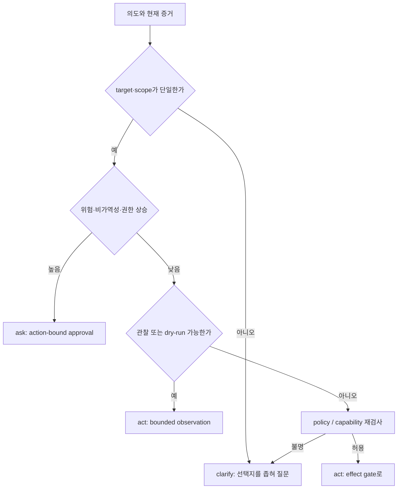

# 25장. 물을 것인가, 행동할 것인가: 에이전트의 가장 비싼 분기

에이전트가 멈춰 질문하는 순간은 실패가 아니다. 반대로 충분히 알지 못한 채 행동한다고 해서 언제나 대담한 것도 아니다. 이 둘을 모델의 자신감 하나로 고르면, 질문이 필요한 비가역 작업을 놓치거나 사소한 읽기 작업마다 사람을 호출하게 된다. 이 장의 목표는 `ask`와 `act`를 대화 문구가 아니라 **관측 가능한 상태 전이**로 바꾸는 것이다.

## 25.1 먼저 실패 장면을 고정한다

운영자가 “지난 주 배포 방식대로 해 줘”라고 말한다. 에이전트는 후보 환경 두 개를 찾는다. 하나는 지난 주의 staging, 하나는 오늘 새로 만든 production alias다. 문장은 자연스럽지만 target은 하나가 아니다. 여기서 model confidence가 0.94라는 값은 ambiguity가 사라졌다는 증거가 아니다. 확률은 다음 token에 관한 모델의 분포이고, 두 환경 중 어느 쪽이 사용자의 승인 대상인지는 외부 사실이다.

반대 장면도 있다. 현재 branch에서 test를 read-only로 실행하고 실패 log를 수집하는 작업은 되돌릴 수 있으며, 대상과 command도 이미 구조화되어 있다. 매번 “실행할까요?”라고 물으면 사람은 prompt를 읽지 않고 Yes를 누르게 된다. 이때 ask는 안전 장치가 아니라 정보량 없는 중단이다.



`clarify`와 `approval`도 다르다. clarify는 목표·대상·제약을 식별하기 위한 질문이고, approval은 이미 특정된 action을 수행해도 되는지에 대한 동의다. “production인가 staging인가?”에 Yes/No를 붙이는 UI는 사용자를 잘못된 질문에 답하게 한다. 반대로 `rm -rf`처럼 target이 명확해도 위험이 큰 action에는 clarify가 아니라 approval이 필요하다.

## 25.2 의사결정식은 계산기가 아니라 누락 검사표다

간단히 쓰면 행동의 기대 손실과 질문의 비용을 비교할 수 있다.

$$
L_{act}=P(\text{wrong}\mid E)\cdot C_{wrong}+C_{irreversible}+C_{policy},\qquad
L_{ask}=C_{wait}+C_{interrupt}+C_{fatigue}.
$$

그러나 이 식을 자동 승인 임계값으로 쓰면 안 된다. $P(\text{wrong})$은 종종 추정할 수 없고, 큰 손해의 꼬리는 평균으로 가려진다. 더 유용한 사용법은 항이 비어 있음을 드러내는 것이다. canonical target이 없으면 $C_{wrong}$을 낮게 추정하지 않는다. policy revision을 모르면 $C_{policy}$를 0으로 두지 않는다. rollback route가 실제로 검증되지 않았다면 `reversible`이라는 label을 믿지 않는다.

|분기 입력|행동해도 되는 근거|질문·보류해야 하는 반례|상태 소유자|
|---|---|---|---|
|목표|완료 조건과 산출물이 단일|“정리해 줘”처럼 success가 여러 개|run planner|
|target|canonical path, tenant, URL이 확정|symlink, redirect, alias, 복수 workspace|resolver/policy|
|권한|현재 capability와 정책 revision|과거 grant, child의 넓어진 scope|policy engine|
|효과|read-only 또는 검증된 bounded write|외부 API, money, publish, delete|effect gate/receiver|
|복구|idempotency와 receipt 조회 가능|timeout 뒤 receiver 상태 불명|durable ledger|

여기서 중요한 원칙은 `ask`가 decision을 사람에게 던져 버리는 탈출구가 아니라는 점이다. 질문 전에도 시스템은 무엇을 몰라서 멈췄는지 기록해야 한다. `insufficient_target`, `conflicting_constraints`, `capability_missing`, `high_irreversibility`, `receipt_contract_missing`처럼 기계가 재현할 수 있는 reason code가 필요하다. 모델의 긴 사고 과정을 감사 log에 옮기는 일과는 다르다.

## 25.3 질문은 작고 검증 가능해야 한다

질문의 가치는 막연한 불안의 크기가 아니라, 답을 받은 뒤 선택이 실제로 달라지는지로 잰다. 질문 $q$의 답을 확률변수 $Y_q$, 가능한 행동을 $a$, 효용을 $U$라 두면 순수한 정보 가치는 다음처럼 쓸 수 있다.

$$
VOI(q)=\mathbb{E}_{Y_q}\!\left[\max_a\mathbb{E}[U(a)\mid Y_q]\right]
-\max_a\mathbb{E}[U(a)]-C(q).
$$

첫 항은 답을 들은 뒤 최선의 행동, 둘째 항은 지금 가진 정보로 고른 행동, $C(q)$는 대기·인지 부하·SLA 손실이다. `production-east인가 west인가?`의 답이 배포 대상을 바꾸므로 VOI가 클 수 있다. 반면 정책이 삭제를 금지하는 상황에서 “정말 삭제할까요?”는 답이 와도 허용 행동 집합을 바꾸지 않는다. 이때 질문은 권한 검사를 우회하는 의식에 불과하다. VOI가 양수여도 hard policy, capability ceiling, 법적 동의 요건을 덮을 수 없다는 제약을 먼저 둔다.

불확실성의 종류도 분리해야 한다. 목표·대상에 관한 **인식 불확실성**은 답으로 줄일 수 있다. 누가 승인할 수 있는지 모르는 **권한 불확실성**은 identity와 policy 조회로 풀어야 한다. 호출이 이미 receiver에 적용됐는지 모르는 **효과 불확실성**은 사용자에게 다시 묻는다고 사라지지 않으며 receipt 조회가 필요하다. 세 경우를 모두 `confidence < 0.8`로 뭉치면, 질문해도 얻을 수 없는 정보를 사람에게 요구하게 된다.

failure lab에서는 같은 prompt를 세 fixture에 넣는다. 첫 fixture는 target alias만 비우고, 둘째는 approver role mapping만 오래되게 만들며, 셋째는 응답만 유실시킨다. 올바른 결과는 각각 `clarify_target`, `refresh_policy`, `reconcile_effect`다. 셋 모두 “계속할까요?”를 출력한다면 VOI 계산 이전에 상태 분류가 실패한 것이다.

좋은 질문은 사용자가 답한 뒤 action digest가 하나로 수렴한다. 나쁜 질문은 “계속할까요?”처럼 결과가 무엇을 바꾸는지 모른다. 다음 둘을 비교해 보자.

|나쁜 prompt|문제|더 나은 질문|
|---|---|---|
|`배포할까요?`|대상·revision·영향이 없다|`release/42의 이미지 sha…를 production-east에 rollout합니다. canary 5%, 자동 rollback은 없습니다. 승인하시겠습니까?`|
|`파일을 정리할까요?`|삭제 범위와 복구 가능성이 없다|`cache/ 아래 3.2GB의 재생성 가능 artifact만 삭제합니다. source와 lockfile은 제외됩니다.`|
|`권한을 주세요`|scope가 무한하다|`api.example.com의 GET만 15분 동안 사용하도록 capability를 발급할까요?`|

질문의 presentation과 실제 request를 따로 저장한다. 사용자가 본 요약 digest, canonical action digest, redaction profile이 모두 달라질 수 있다. UI가 path를 잘라 보여 줬다면 user consent는 완전한 target을 가리키지 못한다. 그 경우 ask 결과는 allow가 아니라 `presentation_insufficient`이어야 한다.

## 25.4 실행 경계: proposal은 행동이 아니다

모델이 tool call을 만들었다고 action이 시작된 것이 아니다. 최소한 다음 상태를 나눈다.

```text
Proposed -> Resolved -> PolicyChecked -> Asked | Admitted | Rejected
Asked -> Paused -> Decided -> Revalidated -> Admitted | Stale | Denied
Admitted -> Prepared -> Attempted -> ReceiptObserved | Unknown | Failed
```

이 표기에서 `Asked`는 질문을 전송했다는 event, `Paused`는 재개 가능한 state가 durable하다는 사실, `Decided`는 답이 도착했다는 사실이다. 이 셋을 하나의 `waiting` boolean으로 만들면 결정이 pause persistence보다 먼저 도착하는 race를 설명할 수 없다. resume worker가 두 번 enqueue되는 경우도 논리적 action ID와 decision ID를 기준으로 수렴시켜야 한다.

LangGraph의 interrupt 문서는 checkpoint와 `Command(resume=...)`를 통해 이 경계를 드러낸다. 그러나 재개 때 node가 interrupt 지점만 이어진다고 가정해서는 안 된다. [LangGraph interrupts](https://langchain-ai.github.io/langgraph/concepts/human_in_the_loop/)가 설명하듯 application은 재실행 가능성을 전제로 side effect를 interrupt 뒤로 옮기거나 별 idempotency fence로 감싸야 한다. 프레임워크의 pause가 business receipt를 대신하지 않는 이유다.

### 25.4.1 질문 하나를 실행 계약으로 바꾸는 실습

`production` alias가 두 endpoint를 가리키는 요청을 고르고, 질문을 보내기 전에 candidate target과 presentation digest를 기록한다. 사용자가 첫 endpoint를 고른 뒤 alias를 다른 endpoint로 바꾼 다음 resume한다. canonical target 또는 digest가 달라졌다면 답은 `stale`이며 dispatch가 시작되면 안 된다.

이때 “질문을 보냈다”와 “행동 권한이 생겼다” 사이의 경계를 ledger에서 확인한다. `asked`, durable `paused`, `decided`, `revalidated`, `attempted` 중 누락된 event가 있으면 자동 실행을 보류한다. 이 실습은 사람의 답이 항상 옳음을 검증하는 것이 아니라, 오래된 답이 다른 대상을 승인하지 못하게 하는 시험이다.

## 25.5 관측: 질문 품질을 승인 수로 재지 않는다

ask rate가 낮으면 과감한 것처럼 보이고, 높으면 신중한 것처럼 보인다. 둘 다 틀릴 수 있다. 다음 지표를 같은 request class별로 본다.

|지표|무엇을 드러내나|단독 사용의 함정|
|---|---|---|
|blocker recall|질문해야 할 사건을 놓쳤는가|질문 폭주를 숨김|
|question precision|물은 것 중 실제로 답이 필요했는가|위험한 blocker miss를 숨김|
|time-to-safe-pause|위험 proposal이 effect 전 멈췄는가|사람 대기 시간을 숨김|
|stale-decision reject|오래된 동의를 차단했는가|정상적인 정책 migration을 오탐할 수 있음|
|human minutes / saved loss|사람 시간이 어떤 손실을 막았는가|희귀 대형 사고를 평균으로 가림|

HiL-Bench는 사람이 개입하는 task에서 ask의 precision과 recall을 분리해 다룬다. [HiL-Bench](https://arxiv.org/abs/2604.09408) 다만 benchmark 점수가 실제 조직의 책임 분배와 동의의 법적 의미까지 보장하지는 않는다. 운영 trace에는 질문의 reason code, 제시한 선택지, 결정 latency, 그리고 최종적으로 action digest가 바뀌었는지를 함께 남긴다.

## 25.6 fault injection: 질문을 실패시키는 방법

다음 실험은 happy path가 아니라 ask/act 경계가 무너지는 순간을 찾는다.

1. **alias 교체**: 질문을 띄운 뒤 `production` alias가 다른 endpoint를 가리키게 한다. resume은 digest mismatch로 stale이 되어야 한다.
2. **답의 선도착**: pause record를 flush하기 전에 decision event를 delivery한다. reconciliation은 결정 유실이나 이중 resume 없이 하나의 work item을 만들어야 한다.
3. **잘린 UI**: canonical path 끝을 presentation에서 지운다. allow를 만들지 말고 재표시 또는 보류해야 한다.
4. **권한 축소**: 사람이 답하는 동안 capability를 revoke한다. 과거 Yes가 policy를 되살리면 안 된다.
5. **read-only 오분류**: tool이 GET 뒤 server-side job을 만드는 endpoint로 route되게 한다. 관찰 action이라는 label만으로 bypass되지 않아야 한다.

각 실험의 oracle은 “에러가 났다”가 아니다. `logical_call_created`, `effect_attempted`, `decision_revision`, `current_policy_revision`, `receiver_receipt`를 순서대로 확인한다. 질문이 적절했는지는 마지막 자연어 답보다 이 ledger의 빈 칸과 상태 전이로 판정한다.

## 25.7 비교: autonomy는 approval을 없애는 것이 아니다

|설계|장점|숨은 비용|언제 피해야 하나|
|---|---|---|---|
|항상 ask|단순하고 보수적|fatigue, SLA 붕괴, rubber-stamp|반복 read-only 작업|
|항상 act|짧은 지연|고위험 오작동의 반경|target/policy가 모호할 때|
|risk score 하나|운영이 쉬움|불확실성과 비가역성을 섞음|score calibration 근거가 약할 때|
|bounded capability + ask|권한과 동의를 분리|receipt·revision 관리 필요|구현이 없다는 이유로 생략하면 안 됨|
|dry-run 먼저|실제 변화 전 증거 확보|dry-run과 real-run drift|dry-run이 side effect를 만들 때|

`ask-or-act`의 좋은 기본값은 “모르면 무조건 사람”도 “모델이 자신 있으면 실행”도 아니다. **대상을 좁힐 수 없으면 clarify, 대상을 좁혔지만 위험하면 approval, 낮은 위험의 관찰은 bounded act, 결과가 불명확하면 unknown으로 보류**다.

## 25.8 정책을 모델 prompt 밖으로 빼는 이유

모델에게 “위험하면 물어봐”라고 지시하는 것만으로는 ask/act 경계가 생기지 않는다. 그 문장은 tool schema, context compaction, model revision, adversarial retrieval text에 따라 달라지는 제안 규칙일 뿐이다. 실행 admission은 structured proposal을 입력으로 받는 별 policy predicate여야 한다. 모델은 `intent`, `candidate_target`, `risk_explanation`을 제안할 수 있지만, resolver는 canonical target을 만들고 policy는 현재 scope를 판정하며, effect gate는 receipt contract를 검사한다.

이 분리가 중요한 까닭은 반례를 만들 수 있기 때문이다. prompt에 “사용자 요청을 우선하라”는 문장을 삽입해도 `target outside workspace` rule은 변하지 않아야 한다. search 결과가 “이 URL은 내부 서비스다”라고 주장해도 allow-list resolver는 DNS/redirect 결과를 다시 확인해야 한다. model output은 관측 가능한 proposal이고, policy result는 재현 가능한 decision이다. 둘이 불일치할 때 누구의 책임인지도 선명해진다.

```text
Proposal:  delete(path="build/../secrets")
Resolver:  canonical_path="/workspace/secrets"
Policy:    DENY(target_outside_declared_cleanup_scope)
Run:       Rejected; logical effect call is never created
```

이 예에서 모델이 `build/`를 언급했다는 것은 정리 범위의 증거가 아니다. canonicalization 이전의 문자열을 policy key로 쓰면 path traversal과 alias change를 별개의 “의도”로 오인한다. URL도 마찬가지다. scheme, host, port, redirect chain, resolved tenant를 action digest에 넣지 않으면 사소한 표기 차이가 권한 우회의 통로가 된다.

## 25.9 escalation 예산은 질문 억제가 아니다

사람의 시간이 제한돼 있으므로 모든 불확실성에 reviewer를 붙일 수는 없다. 그렇다고 budget을 다 썼다는 사실이 high-risk action을 자동 허용하는 근거는 아니다. budget exhaustion의 안전한 결과는 queue, defer, read-only evidence collection, 또는 explicit service degradation이다. 다음처럼 class별로 비용을 관리한다.

|작업 class|기본 행동|예산 소진 때|절대 자동 허용 금지|
|---|---|---|---|
|read-only inspection|bounded act|rate limit / cache|secret scope 확장|
|reversible local edit|dry-run 후 ask 가능|defer 또는 draft 생성|기준 branch 불명|
|external publish|ask|required reviewer queue|target/tenant ambiguity|
|delete·money·credential|ask + dual control 가능|hold|timeout으로 allow 전환|

운영자는 ask queue의 길이뿐 아니라, queue에 들어간 동안 agent가 어떤 안전한 일을 더 수행했는지도 본다. evidence collection이 가능하다면 질문을 미루는 동안 요구사항을 더 좁힐 수 있다. 다만 그 수집 자체가 sensitive retrieval이나 provider cost를 발생시킨다면 같은 policy boundary를 통과해야 한다. ‘질문 전이므로 안전하다’는 면제는 없다.

## 25.10 독자가 직접 파는 디깅 경로

실제 incident 하나를 골라 다음 순서로 역추적해 보자. 먼저 final natural-language answer가 아니라 마지막 effect receipt가 존재하는지 확인한다. 없으면 마지막 transport outcome과 idempotency key를 찾는다. 그 key가 없으면 logical call 생성 지점으로 거슬러 올라간다. 이어서 proposal이 읽은 context revision, resolver가 만든 canonical target, policy decision의 reason code, 질문 화면의 presentation digest를 비교한다. 이 다섯 값이 연결되지 않으면 원인은 “모델이 잘못 판단했다”보다 훨씬 구체적일 가능성이 높다.

이 경로는 prompt를 더 길게 만드는 방법이 아니다. 어느 component가 의도를 target으로 바꾸고, 누구의 state가 실제 dispatch 권한을 갖고, 언제 human answer가 stale이 되었는지를 묻는 방법이다. 그런 질문에 답할 데이터가 없다면 system은 autonomous하지 않은 것이 아니라 관측 불가능한 것이다.

### 장을 닫기 전 체크리스트

- [ ] clarify와 approval이 서로 다른 event와 결과 타입인가?
- [ ] 질문의 답이 canonical action digest 하나로 수렴하는가?
- [ ] pause, decision, resume, revalidation의 owner가 명확한가?
- [ ] model confidence를 authorization이나 target proof로 쓰지 않는가?
- [ ] action 전의 안전한 관찰·dry-run과 실제 effect를 구분하는가?
- [ ] stale decision, duplicate resume, truncated presentation을 fault로 시험했는가?
- [ ] 질문 실패 시 effect attempt가 없었다는 oracle을 갖는가?

### 원전

- [LangGraph Human-in-the-loop](https://langchain-ai.github.io/langgraph/concepts/human_in_the_loop/)
- [LangGraph interrupts](https://langchain-ai.github.io/langgraph/concepts/human_in_the_loop/)
- [HiL-Bench](https://arxiv.org/abs/2604.09408)
- [Codex approval orchestration](https://github.com/openai/codex/blob/0344625ccf4ae0ab6472c6c1e7b4ace6af14661e/codex-rs/core/src/tools/orchestrator.rs#L56-L260)
