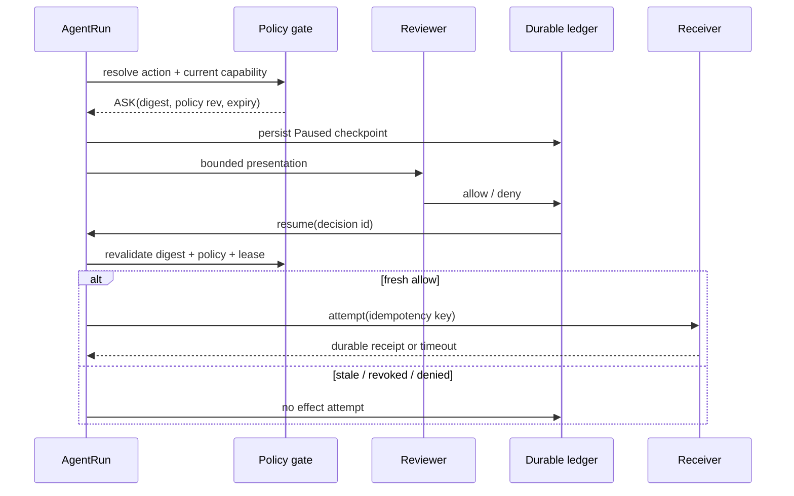
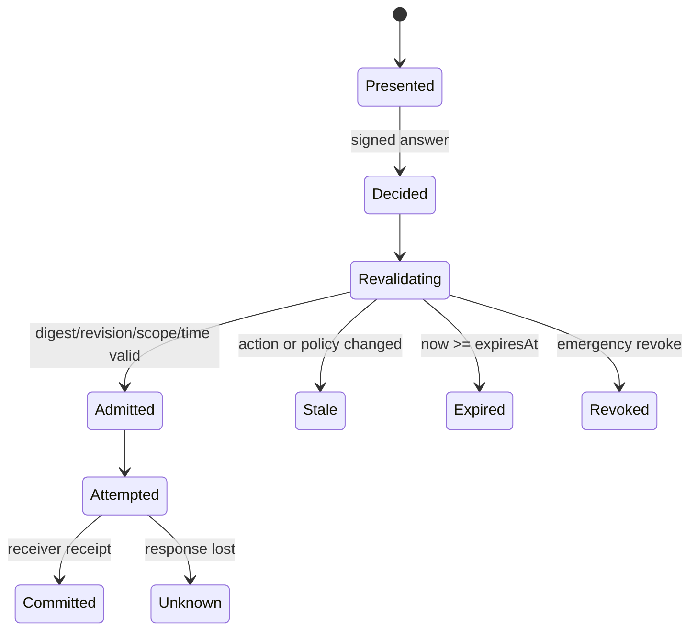

# 26장. 승인·동의·영수증: Yes가 외부 효과를 증명하지 않는 이유

승인은 미래의 행동을 허용하는 결정이고, receipt는 이미 일어난 효과를 수신자 쪽에서 확인하는 근거다. 둘을 합치면 가장 흔한 운영 거짓말이 생긴다. “승인을 받았고 tool이 성공했으므로 배포되었다.” 승인 뒤 sandbox가 막혔을 수도 있고, executor에는 timeout이 났지만 receiver는 이미 commit했을 수도 있다. 이 장은 허용, 시도, commit을 한 줄의 성공 상태로 압축하지 않는 방법을 다룬다.

## 26.1 한 번의 Yes가 실제로 가리켜야 할 것

승인 화면에는 action의 자연어 요약만 있어서는 부족하다. 실행기와 사람이 같은 대상을 보았는지 나중에 재검사할 수 있어야 한다.

```text
ConsentReceipt {
  decision_id, run_id, logical_call_id,
  action_digest = H(operation, canonical_target, canonical_args, scope),
  policy_revision, checkpoint_revision,
  requested_at, decided_at, valid_until,
  disposition, presentation_digest, redaction_profile
}
```

`action_digest`는 operation 이름만 해시한 값이 아니다. target URL의 redirect 전 host, cwd, resolved path, tenant, shell parsing 결과, network destination처럼 business effect를 바꾸는 필드를 canonicalize해서 묶는다. 반대로 요청 시각·UI 색상·trace ID처럼 의미 없는 흔들림까지 넣으면 동일 action이 매번 다른 것으로 보인다. digest 설계는 보안 장식이 아니라 idempotency와 동의 범위의 언어다.



## 26.2 authorization, consent, sandbox, receipt의 질문은 다르다

|기제|답하는 질문|성공해도 알 수 없는 것|주 상태 소유자|
|---|---|---|---|
|authorization|이 principal에게 이 scope가 있는가|사람이 지금 동의했는가|policy engine|
|consent|이 digest를 이 시점에 실행해도 되는가|process가 격리됐는가|approval ledger|
|sandbox|process가 어느 file/network/process에 닿는가|receiver가 commit했는가|executor/OS|
|idempotency|같은 의도를 중복 적용하지 않는가|행동이 적절했는가|receiver inbox|
|receipt|어느 effect가 durable해졌는가|다른 시스템도 atomic했는가|receiver|

이 표는 “여러 겹이라 안전하다”는 문구가 아니다. 어느 게이트가 실패했는지 정확히 찾기 위한 좌표다. sandbox deny는 approval의 자동 revoke가 아니며, approval allow는 receiver receipt가 아니다. receipt가 없는 timeout을 `failed`로 단정하면 재시도 때 duplicate를 만든다. `unknown`은 불편하지만 부정직한 success보다 훨씬 값싼 상태다.

Codex의 공개 approval handling은 command, cwd, parsed action 등을 presentation 경계로 다루는 코드를 보여 준다. [Codex approval orchestration](https://github.com/openai/codex/blob/0344625ccf4ae0ab6472c6c1e7b4ace6af14661e/codex-rs/core/src/tools/orchestrator.rs#L56-L260)와 [approval types](https://github.com/openai/codex/blob/0344625ccf4ae0ab6472c6c1e7b4ace6af14661e/codex-rs/core/src/tools/approvals.rs#L495-L780)는 UI와 실행 경계가 분리되는 이유를 읽게 한다. 이 코드가 임의의 원격 API의 exactly-once나 조직의 전체 consent policy를 보장하는 것은 아니다.

## 26.3 stale receipt는 오류가 아니라 정상 방어다

사람이 답하는 동안 다음 중 하나가 바뀔 수 있다: policy rule, capability, target alias, parent run의 lease, checkpoint의 plan revision, child agent의 delegation chain. 따라서 resume 직전 다음 predicate를 다시 평가한다.

$$
\operatorname{admit}(d)=
\operatorname{allow}(d)\land \operatorname{notExpired}(d)\land
\operatorname{sameDigest}(d,a)\land \operatorname{samePolicy}(d,p)\land
\operatorname{validLease}(r).
$$

하나라도 거짓이면 이미 받은 allow를 ‘거절’로 덮어쓰지 말고 `stale`로 남긴다. 이 distinction은 운영상 중요하다. deny는 reviewer가 현재 action을 허용하지 않았다는 뜻이고, stale은 reviewer가 다른 과거 action에 답했다는 뜻이다. 전자는 policy/사용자 의도 분석으로, 후자는 UI latency·alias 안정성·resume 설계 분석으로 이어진다.

|사건|잘못된 구현|안전한 disposition|
|---|---|---|
|target alias 변경|기존 Yes를 재사용|stale, 새 presentation|
|policy revision 변경|old allow를 우선|재평가 후 explicit compatibility 또는 stale|
|approval TTL 만료|지연된 queue에서 실행|expired, no attempt|
|동일 resume 두 번|두 handler dispatch|하나의 logical call로 dedup|
|capability 회수|receipt만 보고 실행|revoked, no attempt|

## 26.4 capability는 동의보다 넓고 role보다 좁다

role은 관리하기 쉽지만 `developer`처럼 넓은 role은 prompt injection 하나에 지나친 도구 표면을 준다. capability는 target·operation·횟수·만료를 좁혀 발급한다.

```text
Capability {
  subject, tenant, operation_class, target_constraint,
  max_effects, valid_until, issuer, policy_revision,
  delegation_parent, non_delegable
}
```

capability가 있다고 모든 실행이 자동 승인되는 것은 아니다. 예를 들어 test artifact upload capability와 production publish consent는 다른 결정이다. 반대로 한 번의 production publish Yes가 모든 future publish에 대한 capability가 되어서는 안 된다. child agent에게 권한을 전달할 때도 parent trace link만 남기지 말고 delegation ceiling을 기록한다. parent의 넓은 권한이 child로 복사되는 순간 least privilege는 사라진다.

## 26.5 receipt: 수신자의 사실을 묻는다

수신자가 `(idempotency_key, action_digest)`를 durable하게 저장하고 같은 요청이면 같은 receipt를 돌려줄 때, caller는 timeout 뒤 상태를 대사할 수 있다.

```text
receive(key, digest):
  row = inbox.lookup(key)
  if row and row.digest == digest: return row.receipt
  if row and row.digest != digest: return conflict
  atomically write inbox(key, digest) and local business effect
  return receipt(effect_id, committed_at)
```

여기서 atomic이 receiver database 안에서만 성립한다면, receiver가 다시 다른 SaaS를 호출하는 순간 transaction 경계는 새로 생긴다. outbox, provider idempotency, reconciliation 또는 compensation이 이어져야 한다. [Temporal activity retry options](https://github.com/temporalio/sdk-go/blob/213f751d5117fd5621ef6dd55a21b78d605c9696/workflow/activity_options.go#L83-L90)의 retry는 scheduling 정책이지 외부 receiver의 중복 제거 증명이 아니다.

## 26.6 관측과 fault injection

approval metric만 보면 false allow를 놓친다. 다음 event를 별도로 기록한다: `proposal_created`, `policy_decided`, `presentation_rendered`, `consent_decided`, `revalidation_passed`, `effect_attempted`, `receiver_receipt_observed`, `reconciled`. secret와 raw prompt는 protected audit store에 두고, 일반 telemetry에는 digest·reason code·redaction-aware dimension만 남긴다.

|fault|검사할 oracle|복구|
|---|---|---|
|allow 뒤 process kill|receipt 없으면 `unknown`|receiver status query|
|receiver commit 뒤 response loss|effect count=1, caller initially unknown|same key로 reconcile|
|payload가 같은 key로 변경|silent success 금지|conflict + escalation|
|approval UI target truncate|allow receipt 생성 금지|re-present|
|sandbox deny|attempt 없음 또는 bounded denial|policy와 sandbox profile 재검토|
|expired decision replay|effect attempt=0|새 ask|

fault 주입에서 success log는 oracle이 아니다. `effect_attempted=0`이어야 할 거부 경로에서 receiver receipt가 생기지 않았는지, timeout 경로에서 receipt 없는데 committed로 표시하지 않았는지를 확인한다.

## 26.7 비교와 비보장

|설계|좋아 보이는 이유|빠지는 사실|
|---|---|---|
|UI audit log만 저장|누가 Yes 했는지 보임|무엇을 보았고 무엇을 실행했는지 불명|
|권한=승인|구현이 짧음|현재 사람의 동의와 action binding 부재|
|sandbox=안전|격리 효과가 큼|원격 side effect·receipt 부재|
|timeout=실패|queue가 단순|이미 commit한 effect의 duplicate 위험|
|retry=복구|일시 장애에 강함|receiver contract 없는 blind replay|

이 설계는 잘못된 사람의 승인, sandbox escape, receiver의 허위 receipt, 다중 provider 전역 atomicity를 자동 해결하지 않는다. 다만 ‘누가 무엇을 허용했는가’와 ‘무엇이 이미 일어났는가’를 분리하므로, 모르는 상태를 성공으로 위장하지 않고 복구 작업을 시작할 수 있다.

## 26.8 동의 화면도 공격 표면이다

approval UI는 보안 경계의 한쪽 면이다. 모델이 만든 자연어 요약이 canonical action과 다르면 reviewer는 다른 계약에 동의한다. 긴 command를 줄이거나 path를 ellipsis로 자르는 것은 단순한 디자인 문제가 아니다. target의 마지막 segment, redirect된 host, 변경 파일 수, destructive flag가 사라질 수 있다. 요약은 이해를 돕되 원문을 대체하지 않아야 한다.

안전한 화면은 목적과 영향, 구조화된 target, canonical args 또는 diff, scope·TTL, 대안, 현재 불확실성을 같은 decision에 묶는다. 사람이 실제로 본 data의 digest와 action digest를 모두 보관하는 이유가 여기에 있다. 또한 approval record에 raw secret를 넣어서는 안 된다. secret를 가린 표현이 실제 action을 구별하지 못한다면 reviewer에게 그 한계를 표시하고 별 secure viewer나 safe pause를 써야 한다. `redacted`라는 label이 증명력을 복구하지는 않는다.

|UI 실패|겉보기 결과|안전한 처리|
|---|---|---|
|명령 끝이 잘림|reviewer가 넓은 wildcard를 못 봄|presentation invalid, 재요청|
|diff가 늦게 로드됨|빈 변경을 승인|render-complete digest 없으면 ask 유지|
|모델 요약과 canonical args 불일치|다른 action에 동의|hard error, dispatch 금지|
|권한 설명이 role만 표시|실제 host/scope 불명|effective capability 표시|
|reviewer identity 미확정|감사 attribution 손실|decision 미수락 또는 explicit anonymous policy|

## 26.9 policy migration과 긴 승인 대기

장시간 human queue에서는 policy가 바뀌는 일이 정상이다. 모든 revision change를 무조건 stale로 만들면 운영자는 받지 못할 질문을 재검토하게 된다. 반대로 compatibility를 넓게 인정하면 revoke가 무력해진다. 그래서 policy migration에는 `compatible_for_action_class`처럼 좁은, 감사 가능한 predicate가 필요하다. 예컨대 logging retention 규칙만 바뀌고 exact network write allow-list는 그대로라면 policy owner가 compatibility receipt를 발급할 수 있다. 이 receipt 역시 원 approval을 덮는 magic flag가 아니라 새 revision과 rule set을 가리킨다.

emergency revoke는 더 간단해야 한다. revoke list가 current action에 맞으면 예약된 resume, queued attempt, new capability admission 모두 fail-closed한다. 이미 receiver 경계를 지난 호출은 revoke가 undo하지 않는다. 그 호출은 receipt query와 incident path로 들어간다. 권한 회수와 복구를 같은 API로 설계하면 두 경우 모두 불완전해진다.

## 26.10 reviewer도 관측 대상이지만 감시 대상은 아니다

approval 품질을 개선하려면 reviewer wait time, stale rate, override rate는 측정해야 한다. 그러나 “누가 많이 deny했는가”를 생산성 점수로 만들면 심사가 rubber-stamp로 변한다. 개인 식별 정보를 최소화하고, aggregate class와 sampled audit를 통해 UI·policy 결함을 찾는다. high-risk false allow, target truncation, receipt mismatch는 개인의 빠른 판단 탓으로 돌릴 사건이 아니라 system design 결함으로 분류한다.

특히 emergency override에는 사유·scope·expiry·second reviewer·사후 review가 필요할 수 있다. 그렇다고 두 명의 Yes가 receiver receipt 두 개가 되는 것은 아니다. consent의 다중 서명과 effect의 durable observation은 여전히 다른 층이다.

## 26.11 revision과 expiry를 상태 전이로 시험한다

승인은 boolean이 아니라 특정 시점의 묶음에 대한 서명이다. 최소 판정식을 다음처럼 두면 `Yes` 하나에 숨어 있던 전제가 드러난다.

$$
Valid(d,t)=SigOK(d)\land d.actionDigest=a_{now}\land
d.policyRev\sim p_{now}\land t<d.expiresAt\land
\neg Revoked(d)\land Scope(d)\supseteq Effect(a_{now}).
$$

여기서 (\sim)은 단순한 revision 동일성이 아니다. 정책 소유자가 그 action class에 대해 발급한 좁은 compatibility 관계다. 권한 축소나 target allow-list 변경에는 성립시키지 않는다. action digest에는 canonical target, args, content hash, receiver, destructive mode가 들어가야 한다. 사람이 본 화면은 별 `presentationDigest`로 묶는다. 둘 중 하나라도 달라지면 기존 결정을 재사용하지 않는다.



검증에서는 승인 직후 네 사건을 각각 주입한다. 파일 내용을 바꿔 content hash를 흔들고, policy revision을 올리고, monotonic deadline을 넘기고, dispatch 직전에 revoke를 넣는다. 기대값은 모두 “새 승인 없이 effect attempt 0회”다. 이어 정상 승인 호출의 응답만 버린다. 승인은 유효했어도 결과는 `Unknown`이어야 한다. MCP 성공 응답이나 A2A terminal task state도 receiver가 정의한 commit receipt가 아니므로, 별 계약이 없으면 이 빈칸을 채우지 못한다.

### 26.11.1 receipt 대사 연습

동일 action digest로 정상 승인 하나를 만들고, dispatch 직후 응답을 버린다. 재개 시 approval record를 성공으로 재사용하지 말고 receiver에 effect key를 조회한다. receipt가 있으면 `Committed`로 연결하고, 없거나 조회할 수 없으면 `Unknown`을 유지해 사람이 정한 reconciliation 절차로 넘긴다.

같은 실험에서 content hash를 한 글자만 바꾼 뒤 기존 Yes를 제출한다. revalidation은 stale로 끝나고 effect attempt가 0회여야 한다. 이 결과는 특정 receiver가 exactly-once를 제공한다는 증명이 아니라, 동의·전송 응답·수신자 receipt를 별도 기록으로 다루는지 확인하는 최소 계약이다.

### 장을 닫기 전 체크리스트

- [ ] consent receipt가 action digest·policy/checkpoint revision·expiry를 포함하는가?
- [ ] presentation digest와 canonical request digest의 차이를 기록하는가?
- [ ] stale, denied, expired, revoked를 하나의 실패 코드로 뭉개지 않는가?
- [ ] capability delegation에 target·TTL·ceiling이 있는가?
- [ ] timeout 뒤 receiver receipt를 먼저 조회하는가?
- [ ] key 재사용과 payload conflict를 테스트하는가?
- [ ] approval success와 effect success를 다른 metric으로 집계하는가?

### 원전

- [Codex tool orchestrator](https://github.com/openai/codex/blob/0344625ccf4ae0ab6472c6c1e7b4ace6af14661e/codex-rs/core/src/tools/orchestrator.rs#L56-L260)
- [Codex approvals](https://github.com/openai/codex/blob/0344625ccf4ae0ab6472c6c1e7b4ace6af14661e/codex-rs/core/src/tools/approvals.rs#L495-L780)
- [Temporal activity options](https://github.com/temporalio/sdk-go/blob/213f751d5117fd5621ef6dd55a21b78d605c9696/workflow/activity_options.go#L83-L90)
- [NIST zero trust architecture](https://csrc.nist.gov/pubs/sp/800/207/final)
