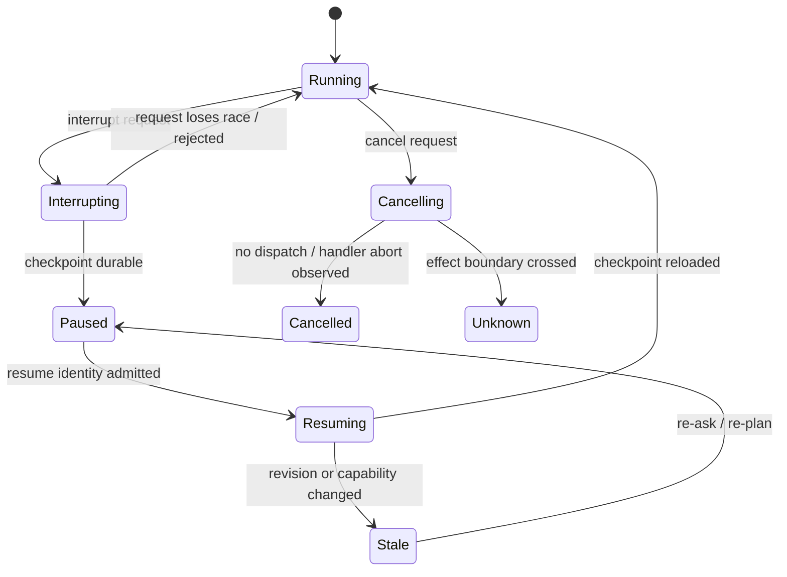
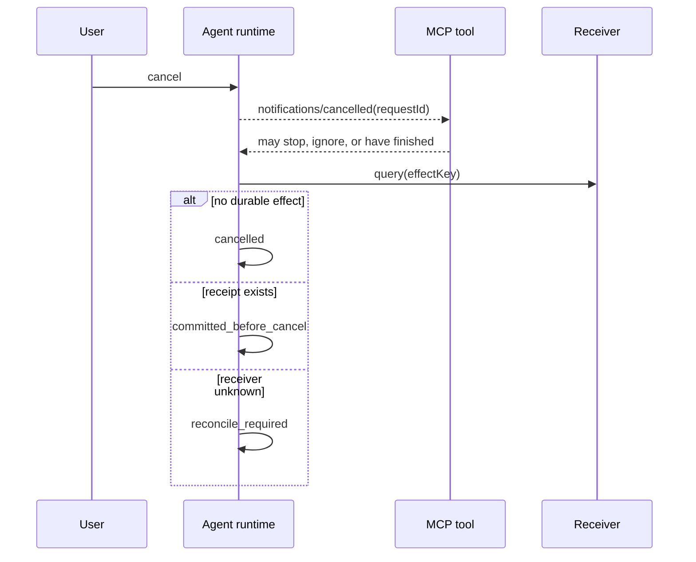

# 27장. interrupt·steer·resume: 멈춘 대화가 아니라 재개되는 프로그램

스트리밍 중인 에이전트에게 새 지시를 넣는 일은 채팅창의 UX 기능처럼 보인다. 하지만 runtime 관점에서 `interrupt`, `steer`, `follow-up`, `cancel`, `resume`은 서로 다른 경쟁 조건을 만든다. 출력 token을 멈춘 일, 실행 중인 tool을 멈춘 일, 미래 dispatch를 막은 일, 이미 수신자가 commit한 효과를 되돌린 일은 전혀 다르다.

## 27.1 다섯 동사를 먼저 분리한다

|동사|의미|반드시 남길 상태|자동으로 보장하지 않는 것|
|---|---|---|---|
|interrupt|현재 run의 제어 지점을 durable pause로 옮김|checkpoint, interrupt ID|외부 effect rollback|
|steer|현재 계획에 새 입력을 합류시킴|input ordering, applied revision|이미 생성된 tool call의 무효화|
|follow-up|현재 turn 뒤의 새 work를 예약|parent/child relation|현재 work의 취소|
|cancel|dispatch 또는 handler에 중단을 요청|cancel cause, observed phase|receiver commit 취소|
|resume|저장된 checkpoint에서 재개 work 생성|checkpoint generation, resume ID|exactly-once side effect|

이 구분이 없으면 사용자가 “멈춰”라고 했을 때 시스템이 무엇을 약속했는지 말할 수 없다. token stream이 끊겼다는 event만 보고 `cancelled`로 표시하면 이미 준비된 effect worker가 queue에서 살아 있을 수 있다. 반대로 effect가 이미 receiver에서 commit된 뒤 cancel을 받았다면, 정직한 상태는 rollback이 아니라 `cancel_requested_after_commit`이다.



## 27.2 가장 위험한 것은 interrupt 이전의 코드다

checkpoint framework를 쓰면 개발자는 ‘여기서 멈췄다가 여기서 계속한다’고 생각하기 쉽다. 실제로는 node 또는 handler가 처음부터 재실행되는 모델이 흔하다. [LangGraph interrupts](https://langchain-ai.github.io/langgraph/concepts/human_in_the_loop/)는 interrupt가 checkpoint를 전제로 하며 resume이 재실행 의미를 가진다는 점을 명시한다. 따라서 interrupt 전에 email send, DB write, external HTTP call을 두면 재개 시 duplicate가 생길 수 있다.

안전한 모양은 effect를 별 논리 호출로 떼는 것이다.

```text
node():
  evidence = collect_read_only()
  decision = interrupt(render(evidence))
  validate(decision)
  enqueue_effect(logical_call_id, idempotency_key)
```

이 코드도 receiver receipt가 없으면 exactly-once가 아니다. 그러나 restartable node와 side-effect boundary를 분리하므로, 어디에 key와 reconciliation을 둘지 명확해진다. `interrupt()`의 반환값을 받은 직후 action을 수행하기 전 current policy, action digest, lease를 다시 검사하는 이유도 여기에 있다.

## 27.3 steer는 새 문장이 아니라 ordering 계약이다

사용자가 생성 중 “아니, 읽기 전용으로만 해”라고 쓰면 runtime은 다음 중 무엇을 선택하는지 선언해야 한다.

1. 현재 model request가 끝난 뒤 다음 turn에 반영한다.
2. generation만 abort하고 tool dispatch는 그대로 둔다.
3. 아직 dispatch되지 않은 proposal을 revoke하고 새 plan을 만든다.
4. 이미 시작된 handler에 cooperative cancellation을 보낸다.

이 네 정책은 모두 구현 가능하지만 결과가 다르다. `steer_seq`를 단조 증가시키고, tool proposal에는 자신이 읽은 `context_revision`을 붙인다. scheduler는 proposal을 dispatch하기 직전 현재 revision과 비교한다. mismatch이면 old proposal을 실행하지 않고 `superseded`로 남긴다. 이 한 줄의 compare가 없으면 새 제약은 transcript에만 있고 old action은 여전히 queue에서 출발한다.

pi의 공개 extension surface는 stream 중 `steer`와 `followUp`, abort 뒤 idle 대기를 구분해 보여 준다. [pi mono repository](https://github.com/badlogic/pi-mono/blob/2e3ca0d67d321a71e51d11655ee1c6a04c6ce31f/packages/coding-agent/src/core/agent.ts#L1-L280)는 입력 lifecycle을 읽을 수 있는 출발점이다. example extension의 command gate를 host 전체의 permission guarantee로 일반화해서는 안 된다.

## 27.4 cancellation은 신호이고 receipt는 사실이다

cancel signal은 협력적인 handler라면 받아들이지만, blocking syscall·subprocess·원격 API는 즉시 멈추지 않을 수 있다. 다음 표처럼 phase별 oracle을 둔다.

|cancel 시점|기대되는 관측|최종 상태|
|---|---|---|
|proposal 전|logical call 없음|cancelled|
|queue 대기|dispatch 없음|cancelled|
|handler 시작 직후|abort acknowledged 또는 timeout|cancelled/unknown|
|receiver request 전|attempt 없음|cancelled|
|receiver apply 뒤|receipt query 필요|unknown→committed 또는 compensated|

Codex의 병렬 cancellation test는 handler 시작 전과 완료 뒤의 cancel을 구분해 다룬다. [Codex parallel cancellation tests](https://github.com/openai/codex/blob/0344625ccf4ae0ab6472c6c1e7b4ace6af14661e/codex-rs/core/src/tools/parallel.rs#L419-L675) 이 코드에서 배울 것은 cancel이 “성공하면 rollback”이라는 약속이 아니라 lifecycle phase마다 다른 관측을 요구한다는 점이다.

## 27.5 checkpoint는 transcript 백업이 아니다

checkpoint에 단지 messages를 저장하면 resume은 그럴듯한 답을 계속 만들 수 있지만, 안전한 실행을 재개하지는 못한다. 최소한 다음을 담는다.

|필드|왜 필요한가|
|---|---|
|run/turn/work identity|duplicate resume을 같은 work로 수렴|
|plan·context revision|steer 뒤 old proposal을 판별|
|pending tool call와 action digest|무엇이 아직 effect 전인지 판별|
|approval/consent receipt와 expiry|과거 Yes 재사용 방지|
|lease/fencing token|stale worker 차단|
|attempt history와 receiver receipt|blind replay 방지|
|redaction profile|새 작업자가 볼 수 있는 범위 유지|

checkpoint serialization도 안정적이어야 한다. schema migration 후 old checkpoint를 읽을 수 없다면 runtime은 조용히 default 값을 채우지 말고 `migration_required`로 멈춰야 한다. default capability를 붙이거나 pending effect를 잊는 migration은 데이터 손실보다 위험하다.

## 27.6 fault lab: 재개가 안전한지 증명하는 반례

1. **interrupt 앞 write**: node가 log message를 원격으로 보낸 뒤 interrupt한다. 두 번 resume하여 receiver apply count가 둘이 되는지 확인한다. key를 옮긴 뒤에야 합격이다.
2. **steer와 queue race**: old proposal을 queue에 넣고 그 직후 read-only steer를 넣는다. dispatcher가 revision mismatch를 `superseded`로 남겨야 한다.
3. **cancel-after-send**: receiver가 apply한 뒤 response를 차단한다. caller는 cancelled 성공을 만들지 말고 unknown으로 receiver를 조회해야 한다.
4. **checkpoint 손상**: pending receipt field를 제거한다. resume이 새 key를 만들어 replay하면 실패, hold/escalate하면 합격이다.
5. **double resume**: 같은 resume ID를 두 queue worker에 전달한다. 한 worker만 fenced admission을 얻어야 한다.

이 실험은 UI 버튼 클릭을 테스트하는 것이 아니라 `interrupt_request`, `checkpoint_persisted`, `cancel_observed_phase`, `proposal_superseded`, `receiver_receipt`의 인과 순서를 테스트한다.

## 27.7 비교: 빠른 상호작용과 안전한 상호작용

|전략|반응성|효과 안전성|필요한 추가 계약|
|---|---|---|---|
|stream만 abort|높음|낮음|tool queue 분리 필요|
|turn 경계 steer|예측 가능|중간|사용자에게 지연 표시|
|proposal revision fence|높음|dispatch 전 강함|durable revision|
|handler cancellation|상황 의존|원격 effect에는 약함|phase receipt/status query|
|checkpoint+idempotency|낮은 구현 단순성|restart에 강함|receiver dedup, migration|

이 장의 비보장은 분명하다. process kill, network partition, provider가 idempotency key를 무시하는 경우에는 cancel과 resume만으로 효과를 확정할 수 없다. 따라서 `unknown` queue, status query, 보상 action과 human escalation이 계속 필요하다.

## 27.8 input ordering: 사용자의 마지막 말이 항상 마지막 상태는 아니다

networked UI에서 input event는 server에 순서대로 도착하지 않을 수 있다. reconnect 중에 과거 steer가 새 steer 뒤에 도착할 수 있고, browser가 retry한 event가 중복될 수 있다. 따라서 문자열의 arrival time 대신 client sequence, session epoch, server accepted ordinal을 기록한다. 이미 적용한 steer의 idempotency key가 다시 오면 duplicate로 합치고, 낮은 sequence의 명령은 무조건 폐기하기보다 현재 run이 아직 그 revision을 읽지 않았는지 검사한다.

예를 들어 `stop`과 `continue but read-only`가 역순으로 도착하면, UI가 마지막으로 보낸 것이 무엇인지와 scheduler가 마지막으로 admission한 proposal이 무엇인지 모두 확인해야 한다. “latest wins”는 입력 상태의 policy일 수 있지만, 이미 receiver 경계를 넘은 effect를 삭제하는 policy는 아니다. 새 steer는 앞으로의 plan revision을 바꾸고, 과거 attempt는 ledger에 남는다.

```text
InputEvent(session_epoch, client_seq, input_id, kind, payload_digest)
AcceptedInput(server_ordinal, applied_context_revision)
Proposal(context_revision, proposal_id, action_digest)
DispatchCheck(current_context_revision, proposal.context_revision)
```

이 네 record가 있으면 incident에서 “사용자가 stop을 눌렀는데 왜 호출됐는가?”라는 질문을 답할 수 있다. stop event가 늦었는지, dispatcher가 revision check를 건너뛰었는지, receiver가 이미 apply했는지가 서로 다른 원인이기 때문이다.

## 27.9 graceful interrupt와 hard kill의 다른 비용

cooperative cancellation은 handler가 cleanup을 실행할 시간을 준다. file descriptor를 닫고 local transaction을 rollback하며 child task에 cancel을 전달할 수 있다. hard kill은 빠르지만 이 cleanup을 우회한다. 따라서 테스트는 graceful abort만 통과했다고 recovery를 증명해선 안 된다. process를 실제로 kill한 뒤 checkpoint prefix, lease expiry, receiver receipt가 무엇을 말하는지 확인한다.

|종료 방식|장점|위험|관측해야 할 것|
|---|---|---|---|
|cooperative abort|cleanup 가능|handler가 signal 무시|abort ack, deadline|
|deadline timeout|자원 회수|late completion race|attempt phase, late receipt|
|process kill|최악 창 검증|local finalizer 미실행|durable prefix, receipt query|
|worker eviction|cluster 현실 반영|lease overlap|fencing token, owner epoch|

resume worker가 old checkpoint를 읽을 수 있다고 해서 old worker가 쓰지 못하는 것은 아니다. lease ownership과 receiver-side fencing을 연결하지 않으면 GC pause 뒤 깨어난 stale worker가 late publish를 할 수 있다. cancel/resume 설계는 scheduler의 control signal만이 아니라 distributed ownership 문제이기도 하다.

## 27.10 대화 품질과 실행 안전을 함께 디버깅하기

steer가 무시됐다는 사용자 보고를 받으면 model response만 읽지 않는다. 먼저 input acceptance ledger에서 server ordinal을 찾고, 그 ordinal이 context assembly에 반영된 revision을 찾는다. 다음으로 그 revision 이후 만든 proposals와 superseded disposition을 검사한다. 마지막으로 effect attempt와 receiver receipt를 대조한다. 이 순서를 따르면 ‘모델이 말을 안 들었다’는 모호한 결론 대신, UI delivery·context reducer·scheduler admission·effect boundary 중 어느 층에서 새 제약이 사라졌는지 분리할 수 있다.

이렇게 찾은 결함은 종종 prompt engineering 문제가 아니다. old proposal을 abort할 ownership이 없거나, queue message가 action digest 대신 자연어만 갖고 있거나, checkpoint schema가 context revision을 저장하지 않은 상태 모델 결함이다.

## 27.11 cancel residue를 수치로 남긴다

취소 지연만 재면 신호가 빨리 전달됐다는 사실만 알 수 있다. 취소 수락 시각 $t_c$ 뒤에도 시작되거나 완료된 일을 residue로 정의한다.

$$
R_{work}=\sum_i w_i\,\mathbf{1}[start_i>t_c],\qquad
R_{effect}=\sum_j cost_j\,\mathbf{1}[commit_j>t_c].
$$

(R_{work})는 낭비된 compute·tool call, (R_{effect})는 취소 뒤 실제로 적용된 외부 변화다. 이미 receiver가 commit한 일을 늦게 관측했다면 `commit_j`는 receiver 시각 또는 sequence로 판정한다. local span 종료 시각을 쓰면 clock skew와 exporter 지연을 late effect로 오인한다. 사용자가 체감하는 `time-to-ack`, scheduler가 새 admission을 막는 `time-to-quiesce`, 모든 child가 terminal이 되는 `time-to-drain`, receipt가 수렴하는 `time-to-reconcile`도 따로 측정한다.

race 실험은 barrier를 두고 순서를 강제로 만든다. (1) effect send 직전 cancel, (2) send 직후 response 전 cancel, (3) receipt persist 뒤 response 전 cancel, (4) checkpoint persist 전 steer, (5) old worker lease 만료 뒤 resume을 실행한다. oracle은 단일 `cancelled` 값이 아니라 `accepted ordinal`, `proposal revision`, `attempt phase`, `fencing epoch`, `receiver receipt`의 튜플이다. 특히 2와 3은 겉으로 같은 timeout이어도 receiver 사실이 다르다.

```text
CancelAccepted does not imply HandlerStopped.
HandlerStopped does not imply ChildStopped.
ChildStopped does not imply EffectAbsent.
EffectAbsent is claimable only from the receiver contract or bounded reconciliation.
```

이 네 문장을 assertion으로 고정하면 “취소 버튼이 성공했으니 아무 일도 없었다”는 회귀를 잡을 수 있다. bounded reconciliation이 끝나지 않았다면 terminal label은 `CancelledUnknownEffect`처럼 불확실성을 보존해야 한다. 재개는 이 상태를 새 호출로 덮지 말고, 같은 logical effect와 idempotency key를 먼저 조회해야 한다.

### 장을 닫기 전 체크리스트

### protocol 취소와 프로그램 재개의 교차walk

|관측|확실히 말할 수 있는 것|말할 수 없는 것|
|---|---|---|
|MCP cancelled notification|특정 request ID 결과를 쓰지 않겠다는 의사|handler 중단·외부 rollback|
|A2A `CANCELED`|Task가 terminal state에 들어감|모든 child/tool effect가 취소됨|
|`AbortController.abort()`|signal listener가 통지됨|listener가 없는 작업의 종료|
|checkpoint 저장|재개 입력점이 durable함|interrupt 전 effect의 exactly-once|
|span status error|관측 span이 오류로 끝남|실행이 없었음·receipt가 없음|

특히 MCP 명세는 cancellation이 요청 완료 뒤 도착할 수 있다고 적는다. 따라서 다음과 같이 request cancel과 effect reconciliation을 분리한다.



pi 계열에서 `AbortSignal`이 tool callback으로 전달되는지, Codex에서 parallel join이 loser task를 어떻게 정리하는지, Jikji runner가 progress/checkpoint를 어디에 쓰는지를 함수 단위로 본다. 같은 `cancel` 메서드가 있어도 signal 전달, task join, durable checkpoint, receiver fence 중 어느 층인지 먼저 표시한다. Claude Code의 managed core는 공개 소스로 이 전 경로를 확인할 수 없으므로 공개 hook과 문서 계약 이상을 추정하지 않는다.

- [ ] interrupt, steer, follow-up, cancel, resume의 event 이름과 state owner가 다른가?
- [ ] effect가 restartable node의 interrupt 이전에 놓이지 않았는가?
- [ ] steer revision을 proposal과 dispatch 양쪽에서 비교하는가?
- [ ] cancellation phase별로 `cancelled`와 `unknown`을 구분하는가?
- [ ] checkpoint가 pending action·receipt·lease·redaction을 포함하는가?
- [ ] double resume, cancel-after-send, migration failure를 주입했는가?
- [ ] cancel UI 성공을 receiver rollback으로 해석하지 않는가?

### 원전

- [LangGraph interrupts](https://langchain-ai.github.io/langgraph/concepts/human_in_the_loop/)
- [Codex parallel cancellation tests](https://github.com/openai/codex/blob/0344625ccf4ae0ab6472c6c1e7b4ace6af14661e/codex-rs/core/src/tools/parallel.rs#L419-L675)
- [pi agent core](https://github.com/badlogic/pi-mono/blob/2e3ca0d67d321a71e51d11655ee1c6a04c6ce31f/packages/coding-agent/src/core/agent.ts#L1-L280)
- [Temporal failure detection](https://docs.temporal.io/workflow-execution/timeout)
- [MCP cancellation의 race 규칙](https://github.com/modelcontextprotocol/modelcontextprotocol/blob/3ff697dcbea0804f3f397b864cfbbaaa10cba71a/docs/specification/2025-06-18/basic/utilities/cancellation.mdx#L7-L49)
