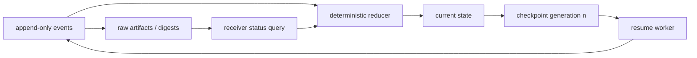
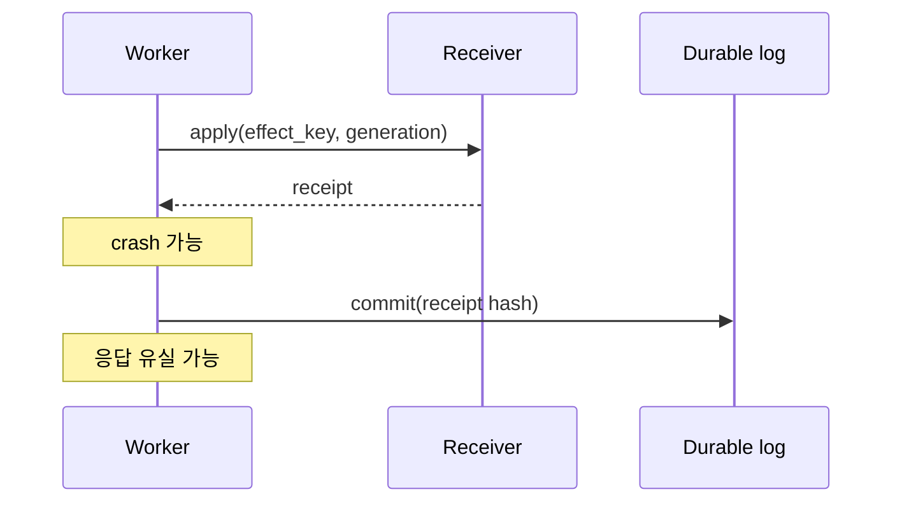

# 28장. event log·checkpoint·replay: 기록이 있다고 재현되는 것은 아니다

“로그를 남겼으니 재현할 수 있다”는 말은 대개 맞지 않다. stdout에는 model token이 있고 trace에는 span이 있어도, 어느 policy revision에서 어떤 tool proposal이 admission 되었는지, tool result가 context에 적용되기 전 죽었는지, receiver가 이미 effect를 commit했는지는 빠져 있을 수 있다. event log, checkpoint, replay는 서로 다른 일을 한다. 이 장은 그 경계를 설계하는 법을 다룬다.

## 28.1 세 저장물의 역할

|저장물|주 질문|필수 identity|실패하면 잃는 것|
|---|---|---|---|
|append-only event log|무슨 일이 어떤 순서로 관측됐나|event ID, run/work ID, ordinal|감사·원인 분석|
|checkpoint|어디서 재개할 수 있나|state revision, schema version|진행 중 계산|
|artifact/receipt store|무엇이 실제로 보이거나 commit됐나|digest, locator, receiver ID|근거·effect reconciliation|

event log를 mutable row 하나로 구현하면 최신 상태는 읽기 쉽지만, 과거 `Asked→Denied→Reasked`가 일어난 이유는 잃는다. 반대로 모든 event를 저장해도 reducer가 nondeterministic하거나 external result를 다시 호출하면 replay는 같은 state에 도달하지 않는다. log는 역사이고, checkpoint는 빠른 진입점이며, receipt는 외부 사실의 별도 앵커다.



## 28.2 event는 이름보다 ownership이 중요하다

`tool_completed`라는 event 하나에 executor exit code, model-visible result, receiver receipt를 같이 넣으면 각 사실의 owner가 사라진다. 더 좁은 event가 필요하다.

```text
ProposalCreated(action_digest, context_revision)
PolicyDecided(decision_id, policy_revision, disposition)
EffectPrepared(logical_call_id, idempotency_key)
AttemptObserved(attempt_id, transport_outcome)
ReceiptObserved(receiver_id, effect_id, receipt_digest)
StateReduced(previous_revision, next_revision, reducer_revision)
CheckpointWritten(generation, state_digest)
```

`AttemptObserved(timeout)`는 receipt가 아니다. `StateReduced(committed)`도 receiver DB를 읽지 않았다면 receipt가 아니다. 이 구분을 지키면 observability backend가 잠시 event를 drop했을 때 trace success가 effect success로 변질되는 일을 막을 수 있다.

## 28.3 order에는 세 종류가 있다

분산 런타임은 흔히 하나의 timestamp로 줄 세우려 하지만, clock에는 skew가 있고 queue는 reorder하며 event exporter는 batch를 재전송한다. 따라서 최소 세 순서를 분리한다.

|순서|예|쓸 수 있는 판정|
|---|---|---|
|local ordinal|한 reducer 안의 `event_no`|state transition 순서|
|causal relation|prepare가 attempt의 parent|어느 일이 다른 일을 가능케 했는가|
|wall time|receiver committed_at|SLO·incident timeline|

wall clock이 늦다고 causal하게 늦은 것은 아니다. 반대로 same logical call에 대한 event가 ordinal gap을 갖는다면 export loss 또는 writer bug다. idempotent event ID, producer sequence, durable append acknowledgment을 두어야 replay가 중복 delivery를 합칠 수 있다. append 성공과 downstream projector 성공도 별 지표다.

## 28.4 replay는 모델을 다시 부르는 일이 아니다

두 종류의 replay를 구분한다. **state replay**는 고정된 event와 reducer revision으로 상태를 다시 계산한다. **behavior replay**는 같은 input으로 model/tool을 다시 호출해 비슷한 결과를 얻으려는 실험이다. 후자는 model version, sampling seed, provider behavior, 시간 의존 검색 결과 때문에 대개 동일하지 않다. 이를 audit recovery라고 부르면 위험하다.

```text
state_replay(events, reducer_rev, checkpoint):
  assert event digests and schema are valid
  state = load(checkpoint)
  for event in events.after(checkpoint.ordinal):
      state = reduce(state, event)
  return state
```

이 reducer가 deterministic하려면 event 안에 decision에 필요한 입력이 있어야 한다. 예를 들어 policy 결과를 replay 때 현재 policy engine에 다시 묻지 않는다. 당시 `PolicyDecided` event와 policy revision을 읽는다. tool output도 live tool을 다시 호출하지 않고 artifact digest가 가리키는 immutable result를 사용한다. missing artifact면 default 빈 문자열을 만들지 말고 replay를 `incomplete_evidence`로 실패시킨다.

## 28.5 checkpoint의 일관성 경계

checkpoint는 event log의 특정 prefix와 정확히 연결된다. `generation=42`가 어디까지 reduce했는지 `last_event_ordinal`, `state_digest`, `reducer_revision`, `schema_version`을 함께 적는다. checkpoint 파일을 먼저 쓰고 event append가 나중에 실패하면 resume은 존재하지 않는 과거를 출발점으로 삼을 수 있다. 반대로 event는 있는데 checkpoint가 없으면 처음부터 deterministic replay하는 느린 길이 있어야 한다.

|장애 창|위험|회복 기준|
|---|---|---|
|event persist 전 kill|state가 보인 것처럼 기록|해당 transition 미적용|
|event 뒤 checkpoint 전 kill|긴 replay|event prefix에서 재계산|
|checkpoint 뒤 artifact loss|그럴듯한 재개|hold, artifact 복구|
|schema upgrade|default capability 주입|explicit migration 또는 reject|
|duplicate event delivery|두 번 effect처럼 reduce|event ID dedup|

checkpoint는 secret가 들어가기 쉽다. prompt, tool args, raw retrieval document를 통째로 넣으면 recovery store가 데이터 유출 surface가 된다. 공개 telemetry에는 digest와 reason code를, 보호된 store에는 retention·access control·redaction profile을 적용한 artifact를 둔다. redaction 때문에 replay에 필요한 field가 사라진다면 그 사실 자체를 `not_replayable_under_current_access`로 기록한다.

## 28.6 외부 효과는 event sourcing 밖에 있다

event를 replay한다고 bank transfer나 email send를 다시 실행하면 안 된다. replay가 reconstruct해야 하는 것은 **의도와 현재 지식**이며, 외부 효과의 현재 상태는 receiver receipt나 status query로 대사한다. effect 관련 reducer의 안전한 규칙은 다음과 같다.

```text
if ReceiptObserved exists: effect = committed
elif AttemptObserved exists and transport is ambiguous: effect = unknown
elif Prepared exists: effect = pending
else: effect = absent
```

`unknown`을 없애려고 retry를 reducer에 숨기지 않는다. reconciler는 별 work item으로 receiver를 조회하고, 같은 idempotency key로 재시도할 수 있다는 receiver contract가 있을 때만 dispatch한다. [Temporal heartbeat interface](https://github.com/temporalio/sdk-typescript/blob/1327f2d5ae77210555bbafc01fbdeaca3e9499eb/packages/workflow/src/workflow.ts#L254-L261)는 workflow-level progress reporting을 보여 주지만, third-party receiver receipt의 대용품은 아니다.

## 28.7 fault lab: replay가 거짓말하는 네 순간

1. **event drop**: `EffectPrepared` 뒤 `AttemptObserved`를 삭제한다. replay가 absent로 결론 내리지 말고 ledger gap을 보고해야 한다.
2. **duplicate delivery**: 같은 event ID를 두 번 append한다. reducer state와 effect attempt counter가 바뀌면 실패다.
3. **artifact mutation**: tool result 파일의 digest를 바꾼다. replay가 현재 파일을 읽어 성공하면 audit가 무너진다.
4. **reducer drift**: 새 reducer가 없는 field에 allow 기본값을 준다. old checkpoint는 migration review 없이 resume되면 안 된다.
5. **receiver-after-crash**: receiver commit 뒤 local `ReceiptObserved` 전에 process를 죽인다. replay 결과는 committed가 아니라 unknown이고, query 후에만 committed가 된다.

각 fault의 산출물은 final response가 아니라 `before_state_digest`, `event_ids`, `checkpoint_generation`, `artifact_digest`, `after_state_digest`, `reconciliation_decision`이다. 그래야 incident responder가 최초의 불일치 지점을 찾는다.

## 28.8 비교: log를 많이 남기는 것과 좋은 replay

|방식|장점|결정적 한계|
|---|---|---|
|stdout log|싸고 읽기 쉬움|정렬·schema·dedup 계약 없음|
|trace span|분산 경로 시각화|drop·sampling, state ownership 부재|
|snapshot만|빠른 resume|왜 그 상태인지 잃음|
|event log만|역사 보존|긴 replay와 schema migration 비용|
|event+checkpoint+artifact digest|감사와 복구를 연결|retention·privacy·운영 복잡성|

좋은 event sourcing은 모든 것을 event로 만들자는 신념이 아니다. 바뀌는 state의 입력과 외부 사실의 관측 경계를 분리해, 재생할 수 있는 것과 재조회해야 하는 것을 정직하게 나누는 설계다.

## 28.9 schema evolution은 과거를 다시 해석하는 권한이다

event format을 바꾸는 일은 field 이름을 고치는 작업보다 위험하다. 과거 `approved=true`가 새 모델에서 `consent receipt present`인지, `policy allow`인지, 둘 다인지에 따라 replay 결과가 달라진다. migration이 과거 record에 없는 정보를 추측해 채우는 순간 audit history가 rewrite된다. 그러므로 event schema에는 version뿐 아니라 semantic migration note, lossy 여부, migration author, fixture가 필요하다.

|변경|안전한 migration|위험한 migration|
|---|---|---|
|새 optional telemetry field|없음으로 명시|과거 값이 0이었다고 가정|
|approval 상태 분리|old event를 `ambiguous_legacy`로 보존|old allow를 fresh consent로 승격|
|digest 알고리즘 교체|old/new digest를 병존|new hash를 추정 생성|
|redaction 강화|replay access를 제한|원문을 새 store로 복사|
|reducer 버그 수정|새 reducer 결과를 별 run으로 기록|기존 history를 덮어쓰기|

reducer revision은 code version만 뜻하지 않는다. 같은 events가 다른 state를 만들 수 있는 규칙의 identity다. incident 분석에서 ‘현재 코드는 맞다’는 대답은 당시 reducer와 비교하지 않으면 의미가 없다. state replay 결과에는 reducer revision과 event range를 붙이고, production state를 교체하려면 별 approval·rollout·rollback plan을 둔다.

## 28.10 snapshot 검증과 compaction

event log가 무한히 자라면 checkpoint만 믿고 오래된 event를 지우고 싶어진다. 그러나 compaction은 증거를 삭제하는 작업이다. 최소한 checkpoint state digest가 어떤 prefix digest 또는 Merkle root에 닿는지, 삭제된 raw artifact의 retention policy가 무엇인지, regulation/incident hold가 걸린 run은 제외되는지 기록해야 한다. “최근 snapshot이 있으니 과거는 필요 없다”는 말은 stale approval이나 duplicate effect의 원인을 포기하겠다는 뜻일 수 있다.

실무적으로는 hot event store, compressed immutable archive, protected artifact store를 분리한다. search index는 편의용이며 audit authority가 아니다. index가 재생성될 수 있다면 source event/receipt locator와 digest가 원본 경로를 가리켜야 한다. compaction 뒤에도 negative evidence, 즉 receipt가 없어서 unknown이었던 시점의 사실을 삭제하면 과거 결정이 성공으로 오해될 수 있다.

## 28.11 replay drill을 정기 운영으로 만들기

replay는 장애 때 처음 실행하면 안 된다. 매 release에서 표본 run을 골라 isolated environment에 복원하고, checkpoint 직후 state digest, pending call count, receipt lookup result, redaction-access result를 baseline과 비교한다. mismatch가 나면 ‘replay test failed’로 끝내지 말고 event producer, artifact retention, reducer migration, external receipt contract 중 어느 owner가 바뀌었는지 classify한다.

이 drill은 production effect를 재발사하지 않아야 한다. network egress를 막고, replay mode에서는 live tool call이 hard fail하도록 만들어 accidental execution을 검출한다. 작동하는 replay는 사고를 되감는 시간 여행이 아니라, 우리가 무엇을 알고 무엇을 모르는지 반복해서 검증하는 훈련이다.

### 장을 닫기 전 체크리스트

- [ ] event, checkpoint, artifact/receipt store의 owner와 책임이 다른가?
- [ ] local ordinal, causal relation, wall time을 혼동하지 않는가?
- [ ] reducer가 live model/tool/policy 호출 없이 state replay 가능한가?
- [ ] checkpoint가 last ordinal·digest·schema·reducer revision을 묶는가?
- [ ] missing artifact와 schema drift를 fail-closed로 다루는가?
- [ ] external effect를 replay하지 않고 receipt query로 reconcile하는가?
- [ ] event drop·duplicate·mutation·kill을 fault로 주입했는가?

### 원전

## 28.12 receipt가 없는 replay는 효과를 추측한다

외부 효과 `apply(K)`와 로컬 commit 사이에는 세 개의 crash window가 있다.

| 중단 지점 | receiver 상태 | 로컬 기록 | 재시작 때 안전한 행동 |
|---|---|---|---|
| apply 전 | 미적용 | 미완료 | 같은 idempotency key로 시도 가능 |
| apply 후 commit 전 | 적용됐을 수도 있음 | 미완료 | 재실행 전에 receiver 조회 |
| commit 후 응답 전 | 적용 | 완료 | 결과를 재구성하고 중복 apply 금지 |



HTTP 500이나 timeout은 rollback 영수증이 아니다. 실제 replicated vector store 실험에서도 실패 응답 뒤 최종 point 상태를 별도로 조회해야 했다. replay 판단식은 `local_status` 하나가 아니라 `(effect_key, receiver_postcondition, receipt, fencing_generation)`을 입력으로 받아야 한다.

### RPO와 RTO를 event 종류별로 쓴다

- 실행 이력 RPO: 마지막 durable append 이후 잃을 수 있는 event 수
- 외부 효과 RPO: receiver에서 적용됐지만 receipt가 보존되지 않은 효과 수
- 재개 RTO: checkpoint load부터 안전한 다음 결정까지 걸리는 시간
- reconciliation RTO: receiver 조회와 중복·누락 판정이 끝나는 시간

telemetry exporter가 event를 잃었다고 효과가 사라진 것은 아니다. 반대로 span이 있다고 commit된 것도 아니다. incident 시에는 audit log, receiver postcondition, telemetry를 독립된 증거원으로 조회한다.

### replay 사후조건 체크리스트

- [ ] 같은 logical effect key의 receiver apply count가 기대값인가?
- [ ] checkpoint generation보다 오래된 worker write가 거절되는가?
- [ ] local commit과 receipt hash가 연결되는가?
- [ ] telemetry가 비어도 durable 상태로 결론을 낼 수 있는가?
- [ ] 복구 뒤 pending·unknown·completed가 서로 다른 상태인가?

- [Temporal workflow execution timeouts](https://docs.temporal.io/workflow-execution/timeout)
- [Temporal workflow interface](https://github.com/temporalio/sdk-typescript/blob/1327f2d5ae77210555bbafc01fbdeaca3e9499eb/packages/workflow/src/workflow.ts#L254-L261)
- [OpenTelemetry trace data model](https://opentelemetry.io/docs/specs/otel/trace/api/)
- [Martin Kleppmann, event sourcing discussion](https://martin.kleppmann.com/2015/03/04/turning-the-database-inside-out-with-apache-samza.html)
