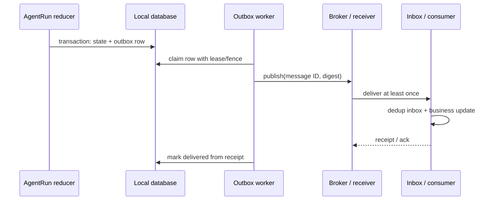
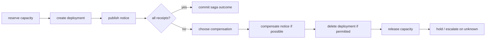

# 29장. outbox·inbox·saga: 분산 효과를 한 transaction처럼 보지 않는 법

## 확인서가 갈라놓는 두 개의 동일한 timeout

별도 수신자 프로세스와 WAL SQLite(`synchronous=FULL`)를 사용해 같은 연결 단절을 두 위치에 주입했다.

|주입 위치|재시작 직후 ledger|안전한 복구|
|---|---|---|
|prepared commit 뒤, effect commit 전|`prepared`, receipt 없음, `apply_count=0`|같은 key로 재시도|
|effect+receipt commit 뒤, 응답 전|`applied`, receipt 있음, `apply_count=1`|재전송하지 않고 committed로 수렴|

호출자가 본 것은 두 경우 모두 connection lost였다. 차이는 수신자 확인서를 조회한 뒤에야 드러났다. 두 번째 경우 같은 key를 다시 보내도 수신자는 `duplicate`와 기존 receipt를 돌려주고 `apply_count=1`을 유지했다.

```sql
BEGIN IMMEDIATE;
INSERT INTO inbox(idempotency_key, payload_digest)
VALUES (?, ?) ON CONFLICT(idempotency_key) DO NOTHING;
-- 새 key일 때만 business state와 receipt를 함께 기록한다.
COMMIT;
```

이 예시는 한 SQLite 파일 안의 로컬 원자성만 보인다. broker와 외부 SaaS까지 exactly-once가 되었다고 확대하면 안 된다. 외부 시스템에 lookup 계약이 없다면 saga는 `Unknown`을 자동 보상하지 말고 운영자 확인 queue로 보내야 한다.

에이전트가 issue를 만들고, repository에 comment를 남기고, 배포 알림을 보내고, inventory를 갱신한다고 하자. 이 네 호출은 한 database transaction이 아니다. 한 곳이 성공한 뒤 다음 곳에서 timeout이 나면 ‘전체 실패’라고 말할 수도, ‘전체 성공’이라고 말할 수도 없다. outbox, inbox, saga는 이 불편한 현실을 감추지 않고 실행 계보와 복구 경계를 만드는 패턴이다.

## 29.1 실패 장면: DB와 message broker 사이의 빈틈

가장 고전적인 버그는 local DB에 `task=ready`를 commit한 뒤 broker publish 전에 process가 죽는 경우다. 반대로 broker publish 뒤 DB commit 전에 죽으면 consumer가 아직 존재하지 않는 task를 본다. 두 시스템을 하나의 atomic transaction으로 묶을 수 없다면, application은 어느 쪽이 사실인지 durable하게 판별할 재료를 가져야 한다.



outbox의 핵심은 publish를 성공시키는 것이 아니라, **intent와 publish할 message identity를 같은 local transaction에서 남기는 것**이다. worker가 죽어도 새 message ID를 만들어선 안 된다. receiver가 at-least-once로 전달받아도 inbox가 `(message_id, digest)`로 중복을 흡수한다. key가 같고 digest가 다르면 duplicate로 조용히 성공시키는 대신 conflict로 멈춘다.

## 29.2 outbox는 retry queue가 아니다

outbox row에는 적어도 logical action, message ID, canonical payload digest, destination, ordering key, attempt 수, lease/fencing, 상태가 있어야 한다.

```text
OutboxRow {
  outbox_id, logical_call_id, message_id, payload_digest,
  destination, ordering_key, state,
  attempt_no, next_attempt_at, lease_until, fencing_token,
  created_revision, delivered_receipt
}
```

`pending → claimed → sent_unknown → delivered | dead_letter` 같은 상태를 두는 이유는 `send()`가 반환하지 않았을 때 publish가 일어나지 않았다고 가정하지 않기 위해서다. `sent_unknown`은 불필요한 실패가 아니라 receiver receipt를 먼저 조회해야 하는 운영 queue다. receiver가 status query를 제공하지 않고 broker도 message ID를 조회할 수 없다면, blind retry의 duplicate 위험과 human escalation 비용을 명시적으로 선택해야 한다.

|상태|worker가 아는 사실|다음 안전한 일|
|---|---|---|
|pending|local intent durable|lease 획득 후 publish|
|claimed|한 worker가 시도 권한 획득|lease/fence 확인|
|sent_unknown|network/worker 결과 모호|receipt/status query|
|delivered|receipt durable|새 publish 금지|
|dead_letter|자동 복구 한계|원인·scope를 가진 escalation|

## 29.3 inbox는 consumer의 business transaction 안에 있다

consumer가 `message_id`를 memory set에만 넣으면 restart 뒤 duplicate가 돌아온다. inbox dedup record는 business update와 같은 durable transaction에 있어야 한다.

```text
consume(message):
  if inbox[message.id] exists with same digest:
      return prior receipt
  if inbox[message.id] exists with other digest:
      return conflict
  transaction:
      insert inbox(message.id, digest)
      apply local business state
      persist receipt(effect_id)
  return receipt
```

이는 consumer database 안에서 at-most-once apply에 가까운 계약이다. consumer가 이후 third-party API를 호출하면 다시 outbox가 필요하다. “inbox가 있으므로 end-to-end exactly once”라는 말이 틀린 이유다. [Jikji remote request](https://github.com/jikji-labs/jikji/blob/d0cb4997e1882f9f5fc28b0b601ddf97317baf43/jikji/pkg/toolnode/remote_runner.go#L91-L100)처럼 run/call/idempotency 재료를 전송하는 구현은 좋은 시작점이지만, receiver가 어떤 persistence와 conflict policy를 갖는지는 별도 검증 대상이다.

## 29.4 saga는 rollback의 다른 이름이 아니다

saga는 여러 local transaction을 순서로 연결하고, 뒤 단계가 실패하면 앞 단계의 business 의미를 되돌리기 위한 **새 action**을 만든다. compensation은 DB rollback과 다르다. 이미 고객에게 보낸 message를 삭제하려면 권한이 필요하고, recipient가 읽었을 수 있으며, 삭제 자체도 실패할 수 있다.



compensation의 순서는 original action의 역순처럼 보이지만 항상 그렇지 않다. `publish notice`를 먼저 지우면 진실을 숨길 수 있고, capacity release가 너무 이르면 다른 workflow가 충돌할 수 있다. saga definition에는 각 단계의 forward action, receipt predicate, compensation precondition, irreversibility, human owner를 함께 적는다.

|단계|forward 성공의 근거|보상|보상하지 말아야 하는 조건|
|---|---|---|---|
|reserve|reservation receipt와 TTL|release reservation|이미 consumer가 사용 시작|
|create deployment|deployment ID/status|delete/scale down|새 revision이 이어짐|
|publish notice|provider receipt|정정 notice|삭제가 audit를 훼손|
|bill|ledger entry|credit/refund|법적 settlement 완료|

## 29.5 AgentRun에 묶는 identity

outbox와 saga가 agent runtime 밖의 infrastructure처럼 보여도, action proposal부터 동일한 identity chain을 가져야 한다.

```text
RunID / TurnID
  -> LogicalCallID
     -> OutboxID + MessageID + IdempotencyKey
        -> Consumer InboxID
           -> EffectID + ReceiptID
              -> SagaStepID / CompensationCallID
```

각 화살표는 단순 trace parent가 아니라 lookup 가능한 key다. action digest가 바뀌면 같은 MessageID를 재사용하지 않는다. compensation은 original key를 덮는 것이 아니라 새 LogicalCallID를 얻고 `compensates=original_effect_id`를 남긴다. 그래야 “처음부터 없던 일”처럼 audit를 지우지 않는다.

## 29.6 ordering, lease, poison message

partitioned broker에서 global ordering을 가정하면 saga가 꼬인다. 어떤 ordering key 안에서만 order가 필요한지 선언한다. 같은 order의 message를 여러 worker가 claim할 때 lease만 쓰면 GC pause 뒤 stale worker가 publish할 수 있다. receiver가 fencing token을 검사하거나 inbox가 monotonic generation을 확인해야 stale writer를 거부할 수 있다.

poison message는 retry 횟수만 늘려 해결되지 않는다. schema mismatch, authorization revoke, malformed payload, downstream quota, unknown receipt는 원인이 다르다. dead-letter에는 raw secret를 복사하지 않고 redacted payload digest, reason code, attempt history, policy revision, remediation owner를 저장한다. 재처리는 new attempt가 아니라 동일 message identity의 controlled replay인지, 새 business intent인지 먼저 판정한다.

## 29.7 fault injection: 성공 count가 아니라 중복과 공백을 센다

1. **DB commit 뒤 worker kill**: pending outbox row가 남고 restart worker가 같은 MessageID를 publish해야 한다.
2. **publish 뒤 ack loss**: outbox는 sent_unknown이 되고 inbox receipt query 뒤 delivered로 수렴해야 한다.
3. **consumer apply 뒤 crash**: duplicate delivery가 prior receipt를 반환하고 business count는 1이어야 한다.
4. **same key, different digest**: consumer가 conflict를 내야 한다. latest payload로 조용히 overwrite하면 안 된다.
5. **compensation crash**: original effect를 deleted로 표시하지 말고 compensation receipt가 없으면 unknown/hold여야 한다.
6. **lease expiry**: 늦은 worker가 fence보다 낮은 token으로 publish를 시도하면 receiver가 거부해야 한다.

관측 표에는 `outbox_state`, `message_id`, `inbox_apply_count`, `receipt_id`, `saga_step`, `compensation_state`, `fencing_token`, `dead_letter_reason`을 둔다. p99 publish latency만 보면 duplicate·공백·human queue를 놓친다.

### 실행 실습: 네 개의 내구 DB와 네 개의 죽음

아래 실습은 producer, broker, consumer, saga coordinator를 **서로 다른 WAL SQLite 파일**로 둔다. broker도 SQLite이므로 Kafka·SQS·외부 API의 동작을 재현하는 실험은 아니다. 대신 DB commit과 publish, consumer apply와 ack, compensation 기록 사이의 창을 실제 child process 종료로 끊는다. 이 범위가 중요한 이유는 "정확히 한 번"이라는 문장이 어느 durable boundary에서만 참인지 드러내기 때문이다.

```bash
python3 research/agents/harnesses/outbox_inbox_saga/outbox_inbox_saga_harness.py --write-artifacts
uv run --with pytest --with rdflib pytest -q \
  research/agents/fixtures/test_outbox_inbox_saga_runtime_wave44.py
```

publisher의 핵심은 order 상태와 outbox intent를 먼저 한 transaction에 쓰고, 그 뒤에만 broker delivery를 넣는 순서다. `publish_attempts`가 늘어도 `message_id`는 바뀌지 않는다.

```python
# producer.sqlite: order=reserved 와 outbox(message_id, digest, pending)는 이미 함께 commit 됐다.
broker.execute(
    "insert into deliveries(message_id, digest) values (?, ?)",
    (row["message_id"], row["digest"]),
)
if crash_after_publish:
    os._exit(86)       # local published 표시는 아직 쓰지 못했다.
producer.execute("update outbox set state='published' where message_id=?", (MESSAGE,))
```

consumer는 inbox record, business effect, authority receipt를 하나의 SQLite transaction에 둔다. apply 뒤 ack 전에 죽으면 broker는 아직 미확인 delivery를 재전달할 수 있다. 재시작 consumer는 같은 ID·digest의 inbox row를 찾아 prior receipt를 돌려주고 business row를 한 번 더 쓰지 않는다.

```python
prior = consumer.execute(
    "select * from inbox where message_id=?", (delivery["message_id"],)
).fetchone()
if prior:
    return {"result": "duplicate", "receipt_id": prior["receipt_id"]}
consumer.execute("insert into inbox values (?,?,?)", (message_id, digest, receipt))
consumer.execute("insert into business values (?,1)", ("effect-seat-7",))
if crash_after_apply:
    os._exit(87)       # transaction은 이미 commit, broker ack는 아직 없다.
```

실습 oracle은 다음 네 결과를 동시에 요구한다.

|사망 창|재시작 뒤 관찰할 delivery|business `apply_count`|복구 판정|
|---|---:|---:|---|
|`commit-before-publish`|1|1|같은 MessageID로 publisher 재시작|
|`publish-before-ack`|2|1|첫 delivery apply, 두 번째는 duplicate|
|`consumer-apply-before-ack`|1회 재전달|1|prior receipt로 ack|
|`compensation-failure`|해당 없음|forward와 별개|`compensation_unknown`을 재시작 대사 뒤에만 `compensated`로 전이|

두 번째 행이 특히 중요하다. broker delivery가 두 개인데 business effect가 하나인 것은 **delivery at-least-once와 consumer-local deduplicated apply**를 뜻한다. 외부 결제 API·production broker·서로 다른 데이터베이스까지 exactly-once라는 결론은 이 표에서 나오지 않는다. 그러한 수신자는 message ID 조회, durable idempotency storage, conflict policy, receipt 조회 계약을 별도로 제공해야 한다.

보상 실패도 rollback으로 덮지 않는다. 실습은 `release-reserve`를 먼저 `compensation_unknown`으로 기록하고, 다음 process가 별도 attempt를 만들 때만 `compensated`로 바꾼다. 실제 provider가 "이미 release됨"을 조회할 수 없으면 이 단계는 자동 재시도가 아니라 hold와 담당자 escalation이어야 한다.

## 29.8 비교: 두 단계 commit 환상에서 벗어나기

|접근|무엇을 단순화하나|무엇을 숨기나|
|---|---|---|
|best-effort HTTP retry|일시 장애|commit 뒤 응답 유실|
|distributed 2PC|일부 participant atomicity|외부 API·가용성·운영 비용|
|outbox only|producer 공백|consumer duplicate와 third-party effect|
|inbox only|consumer duplicate|producer crash-before-send|
|saga|business recovery 경로|보상의 실패·비가역성|
|outbox+inbox+saga|각 경계의 사실|전역 exactly-once 보장은 여전히 없음|

이 설계는 모든 메시지를 한 번만 전달한다는 보장이 아니다. 보통 broker는 at-least-once이고, 목표는 duplicate delivery가 business duplicate effect가 되지 않게 하는 것이다. compensation도 실패를 삭제하지 않는다. 어떤 user-facing effect가 이미 관측됐다면 정정·incident handling·감사가 더 정직한 복구일 수 있다.

## 29.9 saga orchestration과 choreography의 선택

saga에는 중앙 orchestrator가 다음 step을 고르는 방식과, 각 서비스가 event를 받아 다음 event를 발행하는 choreography 방식이 있다. orchestrator는 execution graph와 timeout/compensation 상태를 한곳에서 읽기 쉽다. 하지만 coordinator가 병목·권한 집중점이 될 수 있다. choreography는 service autonomy에 맞지만, 전체 business rule과 loop를 추적하기 어려워진다. agent 시스템은 model planner를 orchestrator로 오인하기 쉬운데, 자연어 plan은 durable saga state가 아니다.

|방식|강점|주 실패|AgentRun에 필요한 보완|
|---|---|---|---|
|orchestration|step·timeout·보상 가시성|central coordinator outage|durable saga ledger와 lease|
|choreography|서비스 느슨한 결합|event loop·숨은 dependency|causal IDs와 loop budget|
|model-only plan|유연한 설명|restart 뒤 계획 drift|structured saga definition|
|workflow engine|retry scheduling|외부 receipt를 자동 보장하지 않음|inbox/outbox·status query|

어느 쪽이든 each step에는 `command accepted`, `business effect committed`, `compensation eligible`을 구별하는 receipt predicate가 있어야 한다. broker ack만으로 deployment가 ready가 되었다고 주장하지 않는다. model은 다음 step을 제안할 수 있지만, saga reducer가 current state와 allowed transition을 결정한다.

## 29.10 retry 폭풍과 backpressure

downstream provider가 느려졌을 때 모든 outbox worker가 동시에 재시도하면 queue 지연은 더 커지고 receiver의 dedup store도 압박을 받는다. exponential backoff만 넣어도 동일 destination에 같은 시간대 retry가 몰릴 수 있다. jitter, destination concurrency budget, per-tenant quota, circuit breaker, dead-letter threshold를 함께 운영한다. 중요한 점은 backpressure가 action의 semantic priority를 바꾸지 못하게 하는 데 있다. ‘오래 기다렸으니 승인 없이 보내자’는 정책은 존재해서는 안 된다.

|신호|해석|안전한 반응|
|---|---|---|
|outbox age 증가|destination 또는 worker 병목|admission rate 조절, backlog 공지|
|unknown receipt 증가|response loss/receiver query 결함|새 publish보다 reconciliation 우선|
|duplicate inbox hit 증가|producer retry 또는 broker replay|digest conflict와 attempt pattern 조사|
|compensation queue 증가|forward failure 또는 설계 불가역성|human owner와 risk review|
|dead-letter 재처리 반복|원인 미해결|automatic replay 중단|

## 29.11 data retention과 audit의 충돌

inbox는 duplicate를 막으려면 일정 기간 key를 기억해야 하지만, 무기한 저장은 privacy와 비용 문제가 된다. TTL을 짧게 하면 오래 지연된 broker delivery가 새 effect처럼 적용될 수 있다. TTL은 broker max delay, retry horizon, legal retention, provider idempotency duration, business duplicate 비용을 함께 고려해 정한다. key가 만료된 뒤 재전달이 가능한 시스템이라면 ‘만료 뒤 duplicate 위험’을 documented residual risk로 남기고, 고위험 action에는 longer-lived receipt registry나 human review를 사용한다.

message payload를 audit 목적으로 통째로 복사하지 말고 canonical digest와 최소한의 redacted attributes를 기본으로 둔다. 그러나 digest만으로 dispute를 해결할 수 없는 경우도 있다. secure evidence vault, access logging, deletion propagation, incident hold를 별도로 설계한다. outbox/inbox가 보안 저장소 역할까지 자동으로 해 주지는 않는다.

## 29.12 독자가 따라갈 디깅 순서

duplicate 알림 incident가 생기면 consumer 화면부터 고치지 않는다. final business effect ID에서 inbox receipt를 찾고, 그 receipt의 message ID로 broker deliveries를 모은다. 이어 outbox row의 attempt history와 lease/fencing token, producer logical call, approval/action digest를 역방향으로 잇는다. 같은 message ID가 정말 두 번 apply됐는지, 다른 MessageID가 같은 business intent를 표현했는지, key TTL이 지나 dedup이 사라졌는지 구분한다.

이 순서를 지켜야 하는 까닭은 duplicate라는 말이 적어도 네 결함을 가리키기 때문이다. broker의 duplicate delivery, producer가 새 ID를 만든 replay, consumer의 non-atomic inbox write, user가 유사하지만 별도 action을 두 번 승인한 경우다. 보상 여부도 이 분류 뒤에만 결정할 수 있다.

### 장을 닫기 전 체크리스트

- [ ] state mutation과 outbox intent가 같은 local transaction에 남는가?
- [ ] outbox worker가 재시작해도 MessageID와 digest를 바꾸지 않는가?
- [ ] inbox dedup과 business update가 한 durable boundary에 있는가?
- [ ] same key/different digest를 conflict로 처리하는가?
- [ ] sent_unknown에서 blind retry 전에 receipt/status query를 하는가?
- [ ] saga step마다 receipt predicate·보상 precondition·irreversibility를 적는가?
- [ ] lease만이 아니라 stale writer를 막을 fencing 또는 monotonic check가 있는가?
- [ ] dead-letter가 retry 묘지가 아니라 remediation queue인가?

### 원전

- [Temporal activity retry options](https://github.com/temporalio/sdk-go/blob/213f751d5117fd5621ef6dd55a21b78d605c9696/workflow/activity_options.go#L83-L90)
- [Jikji remote runner request identity](https://github.com/jikji-labs/jikji/blob/d0cb4997e1882f9f5fc28b0b601ddf97317baf43/jikji/pkg/toolnode/remote_runner.go#L91-L100)
- [AWS transactional outbox pattern](https://docs.aws.amazon.com/prescriptive-guidance/latest/cloud-design-patterns/transactional-outbox.html)
- [Sagas paper](https://www.cs.cornell.edu/andru/cs711/2002fa/reading/sagas.pdf)
