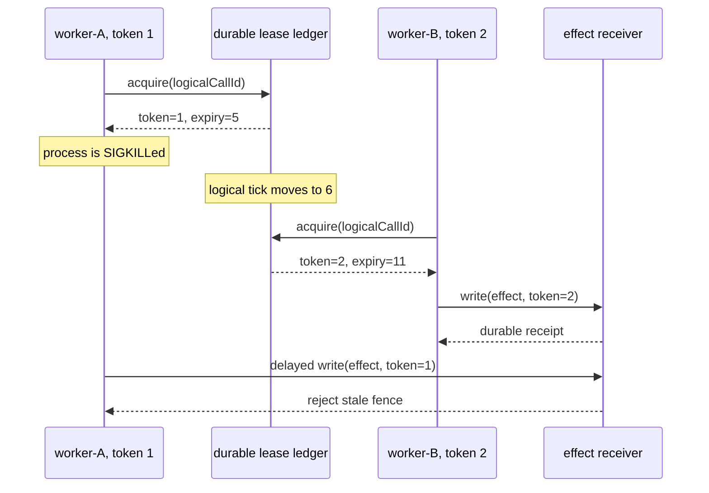
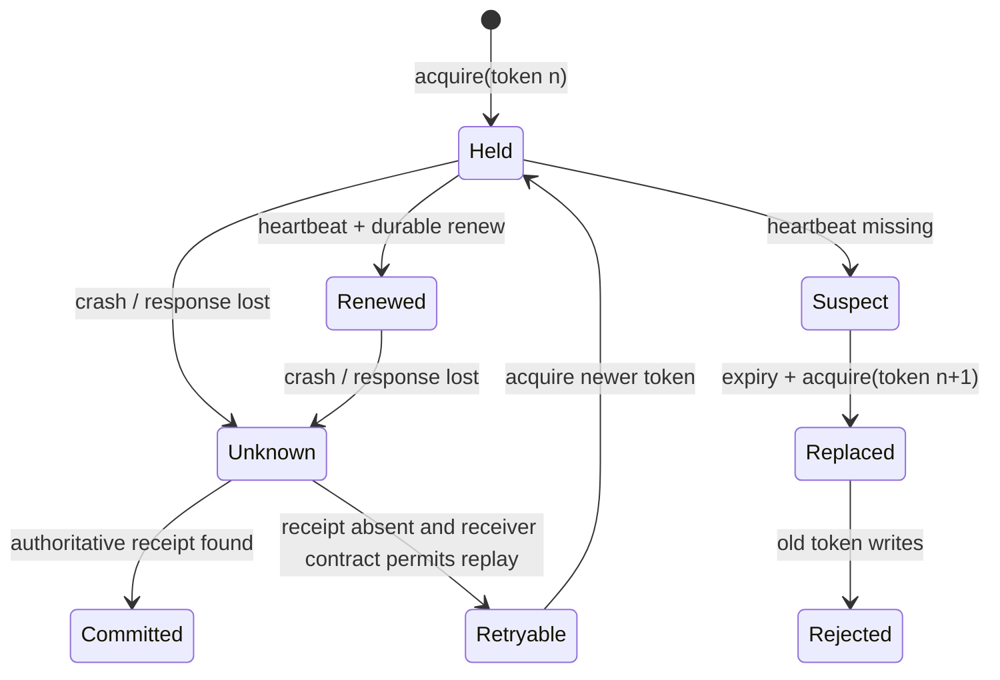
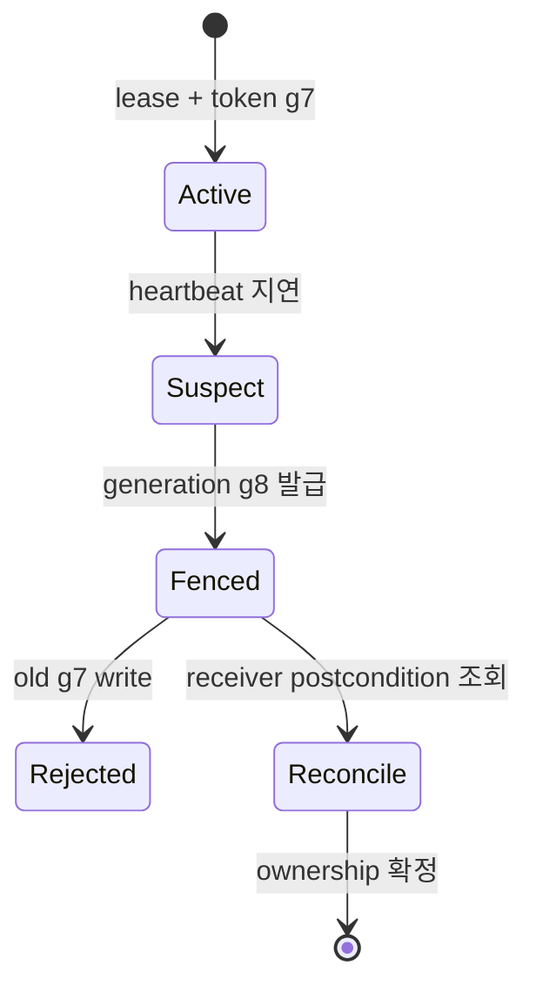
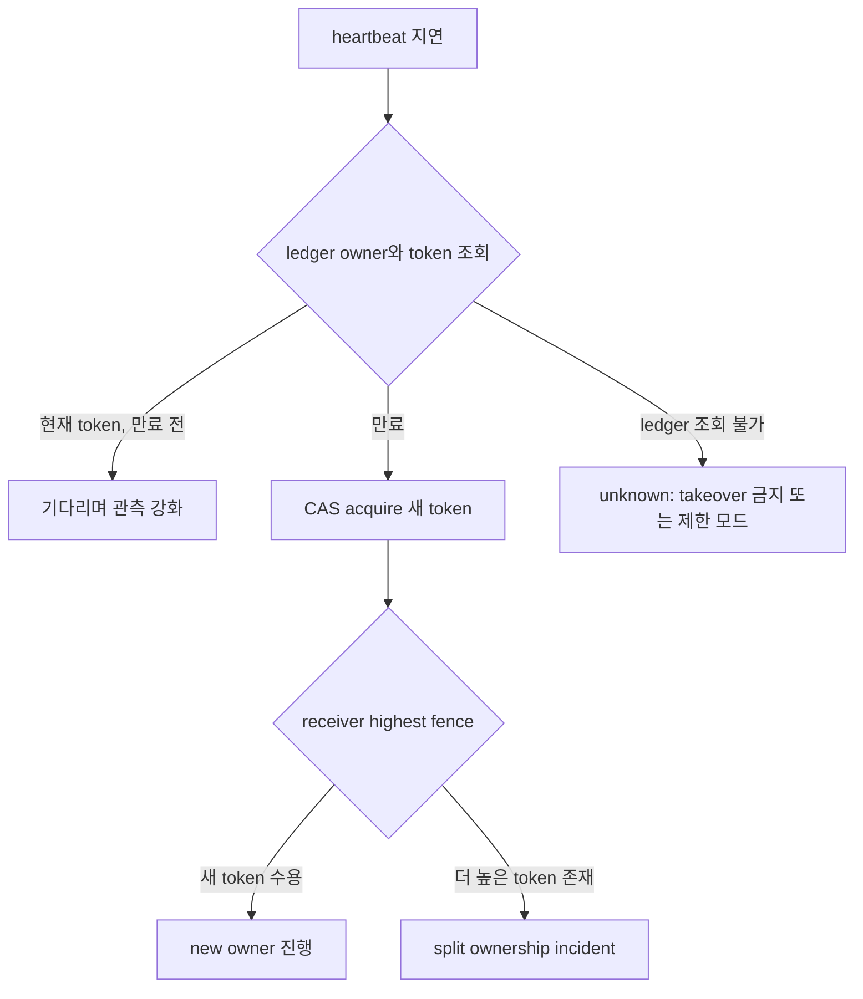

# 30장. 살아 있다는 신호와 쓸 권한은 다르다: lease, heartbeat, fencing

분산된 에이전트에서 가장 위험한 문장은 “작업자가 살아 있으니 계속 쓰게 하자”이다. 살아 있음은 관측이고, 쓰기 권한은 합의된 현재성이다. worker가 마지막 heartbeat를 보냈다는 사실은 그 뒤에도 네트워크가 연결돼 있다는 뜻이 아니며, lease를 한 번 얻었다는 사실은 그 lease가 만료된 뒤에도 receiver가 그 worker의 쓰기를 받아야 한다는 뜻이 아니다. 한 문장으로 줄이면 이렇다. **heartbeat는 힌트이고, fencing token은 수신자가 검사하는 세대다.**

에이전트는 planner, tool worker, recovery worker가 같은 논리 작업을 이어받을 수 있다. 그러므로 `workerId`, `attemptId`, `logicalCallId`, `effectId`, `leaseToken`을 하나의 식별자로 합치면 안 된다. 같은 사람이 만든 재시도도 새 attempt이고, 같은 attempt가 여러 effect를 만들 수도 있으며, 가장 최근의 lease 소유자만 현재 token을 갖는다.

|값|답하는 질문|재시도에서의 취급|receiver가 믿어도 되는가|
|---|---|---|---|
|`logicalCallId`|사용자가 의도한 논리 작업은 무엇인가|유지|중복 탐지의 후보|
|`attemptId`|이번 실행 시도는 어느 것인가|새로 생성|아니오; 실패와 효과를 묶는 관측값|
|`holderId`|누가 lease를 들고 있다고 주장하는가|바뀔 수 있음|아니오; 이름은 권한이 아니다|
|`leaseExpiry`|원장이 계산한 만료 시점은 언제인가|renew 때 이동|단독으로는 부족|
|`fencingToken`|현재 소유권 세대는 몇 번째인가|새 acquire마다 증가|예; 비교 가능한 receiver 계약이 있을 때|
|`receiptId`|receiver가 어떤 효과를 durable하게 인정했는가|효과마다 고유|예; receipt의 신뢰 경계 안에서|



## 30.1 왜 heartbeat만으로는 충분하지 않은가

heartbeat는 보통 “마지막으로 관측한 진행 신호”를 전달한다. [Temporal Go SDK의 worker 코드](https://github.com/temporalio/sdk-go/blob/213f751d5117fd5621ef6dd55a21b78d605c9696/internal/worker.go#L442-L450)는 worker가 heartbeat에 resource 정보를 넣는 표면을 보여 준다. 이 코드는 heartbeat가 외부 효과의 commit receipt라는 뜻을 주지 않는다. heartbeat가 도착해도 receiver와 worker 사이의 다음 패킷은 사라질 수 있고, heartbeat가 멈춰도 GC pause·scheduler stall·일시적인 network delay가 원인일 수 있다.

여기서는 두 관점을 나눠야 한다.

* coordinator는 `lastSeen`을 보고 “새 owner를 허용할지” 결정한다.
* effect receiver는 들어온 write가 “현 owner 세대의 것인지” 결정한다.

첫 결정만 있고 둘째가 없으면 stale worker가 늦게 도착한 write를 계속 적용할 수 있다. lease 만료는 caller 쪽의 규칙일 뿐, 이미 전송된 RPC를 시간 여행으로 취소하지 못한다. token을 request header에 담더라도 receiver가 durable state와 비교하지 않으면 그 token은 장식이다.

```text
if request.token < receiver.currentToken(logicalCallId):
    reject(STALE_FENCE)
elif request.idempotencyKey already has durable receipt:
    return receipt
else:
    apply_once(); persist(receipt, token); return receipt
```

위 의사 코드는 sequence number만으로 정확히 한 번 실행을 만든다는 약속이 아니다. receiver가 `apply_once`와 receipt persistence를 어떻게 원자화하는지가 별도 계약이다. database transaction, outbox, idempotent provider API처럼 receiver가 실제로 제공하는 원자성 범위를 기록해야 한다. 그렇지 않으면 “fencing을 넣었다”는 말은 write 경쟁의 한 종류만 막았을 뿐이다.

## 30.2 실제 SIGKILL 반례: 멈춤은 실패 판정이 아니다

이 책의 실습 fixture는 단일 호스트에서 서로 다른 child process가 SQLite WAL 원장을 연다. worker-A는 token 1을 durable하게 받은 직후 실제 `SIGKILL`을 받는다. 이후 logical clock을 6으로 전진시키면 worker-B가 token 2를 받아 write한다. 마지막으로 stale-writer는 token 1로 도착하지만 receiver가 거절한다. 이 실험이 실측한 것은 process death, durable ledger, token generation, stale write rejection의 순서다.

중요하게도 이 실습은 “6ms 후 failover가 완료됐다”는 결과가 아니다. `0 → 6 → 12`는 wall clock이 아니라 테스트가 저장한 논리 tick이다. CI의 부하, NTP 보정, kernel scheduler가 timeout 의미를 오염시키지 않게 하려는 선택이다. 따라서 표의 `tick`을 latency, p99, Kubernetes Lease duration으로 바꾸어 읽어서는 안 된다.

|사건|로컬 worker가 아는 것|원장이 아는 것|허용되는 다음 행동|
|---|---|---|---|
|acquire 직후 SIGKILL|없음|token 1, receipt 없음|`unknown`으로 남기고 reconcile|
|expiry 뒤 B acquire|A는 죽었음|token 2가 current|B만 새 write를 제안|
|A의 지연 write|A는 예전 권한을 믿음|current token=2|receiver가 거절|
|B receipt 뒤 B 종료|로컬 cache는 사라질 수 있음|receipt 존재|retry는 receipt를 반환|
|receipt 관측 전 재시도|성공/실패 불명|조회 필요|새 key가 아니라 같은 logical call 조회|

여기서 `unknown`은 애매한 오류 메시지가 아니다. receiver apply 전 crash와 apply 후 receipt 전달 전 crash가 외부에서 같은 증상으로 보이는 **정보 부족의 상태**다. 이를 `failed`로 강등하면 중복 실행을 유도하고, `succeeded`로 올리면 누락 효과를 은폐한다. 복구기는 원장의 authoritative identity로 receiver를 조회한 뒤에만 상태를 바꾼다.

## 30.3 lease와 cancellation을 섞지 말 것

lease가 끝났다는 것은 미래 write를 거절할 세대가 바뀌었다는 뜻이다. cancellation은 caller가 더 이상 결과를 기다리지 않거나 receiver에게 취소를 요청했다는 뜻이다. 둘은 독립이다. [Temporal의 worker stop 경로](https://github.com/temporalio/sdk-go/blob/213f751d5117fd5621ef6dd55a21b78d605c9696/internal/internal_worker_base.go#L899-L929)처럼 intake를 닫고 context를 취소하는 lifecycle을 보아도, remote provider가 이미 시작한 일을 중단했다는 receipt는 따로 받아야 한다.

다음 상태도를 운영 runbook에 넣어 두면 담당자가 timeout을 성공·실패로 성급하게 번역하는 일을 줄일 수 있다.



`Suspect`도 terminal이 아니다. heartbeat가 늦었다는 이유로 두 owner를 동시에 유효하다고 만들지 않으려면 acquire 자체가 단일 authoritative ledger에서 serializable해야 한다. 반대로 ledger가 partition된 다중 리더 구조라면 SQLite fixture의 결론을 복사할 수 없다. quorum, leader election, clock skew, lease read/write quorum, storage replication을 별도로 시험해야 한다.

## 30.4 코드 설계: lease를 모델 호출 바깥에 둔다

LLM은 “내가 아직 owner인가?”를 판정하는 적합한 주체가 아니다. 모델 출력은 늦고 확률적이며, 읽은 context는 stale일 수 있다. lease acquire/renew/fence compare는 deterministic control plane에 둔다. 모델은 `Plan`을 만들고, policy가 `ActionDigest`를 고정하며, executor는 현재 fence를 붙여 receiver에 보낸다.

```text
Plan -> policy(actionDigest, revision)
     -> lease ledger(acquire / renew)
     -> executor(effect, idempotencyKey, fence)
     -> receiver(compare fence, persist receipt)
     -> reconciler(receipt query, disposition update)
```

이 분리는 모델이 tool call을 두 번 내는 문제와 owner 경쟁을 함께 다루기 좋다. 같은 `logicalCallId`여도 action argument가 바뀌면 새 `ActionDigest`와 새 approval이 필요하다. 같은 action이라도 attempt가 달라졌다고 idempotency key를 바꾸면 dedup을 잃는다. 반대로 모든 tool call에 한 키를 재사용하면 서로 다른 effect를 합친다. key의 scope는 “논리 효과 하나”다.

## 30.5 실습: 세 가지 실패를 주입하라

실습의 목표는 lease 구현을 믿는 것이 아니라 그 보장 범위를 확인하는 것이다.

1. `acquire` 직후 worker를 죽인다. 원장이 token을 보존하는지, outcome을 `unknown`으로 남기는지 확인한다.
2. logical tick을 expiry 뒤로 옮기고 새 worker를 acquire한다. token이 증가하고 old holder가 renew하지 못하는지 확인한다.
3. old token을 붙인 write를 receiver에 보낸다. caller log가 아니라 receiver의 durable compare가 거절하는지 확인한다.
4. receiver apply 뒤 receipt 전달 전에 process를 죽인다. retry가 새 write를 만들지 않고 same key receipt lookup을 하는지 확인한다.
5. 새 holder의 renew도 끝낸 뒤 다시 실행한다. token 3의 replay와 receipt reconciliation이 token 1의 unknown을 committed로만 바꾸는지 확인한다.

실습 결과에 반드시 `actual_elapsed_ns`가 있다면 그것은 fixture process의 local overhead일 뿐이다. lease TTL, provider latency, SLO, outage duration의 증거로 승격하지 않는다. production benchmark에는 real clock, host load, network fault model, multiple storage replicas, receiver metrics, discarded sample 수를 별도로 넣어야 한다.

## 30.6 운영 체크리스트와 비보장

|질문|통과 기준|실패하면 생기는 일|
|---|---|---|
|receiver가 token을 비교하는가|현재 token보다 작은 write 거절|stale owner가 늦게 overwrite|
|renew는 durable한가|restart 뒤 expiry와 token 재구성 가능|메모리 owner가 재등장|
|receipt는 effect와 원자적으로 연결되는가|same key query가 stable receipt 반환|timeout 뒤 이중 실행 또는 누락|
|clock의 owner가 명확한가|test tick과 production clock을 구분|TTL 수치를 성능 주장으로 오독|
|reconcile는 authoritative state를 읽는가|trace만으로 success를 만들지 않음|관측 누락이 effect 누락으로 둔갑|

이 장이 보장하지 않는 것 또한 분명하다. 단일-host SQLite와 Linux식 `SIGKILL`은 multi-region partition, split brain, Kubernetes Lease API, Temporal task ownership, provider-side cancel, replicated database failover를 검증하지 않는다.

[Kubernetes Deployment controller의 reconciliation 경로](https://github.com/kubernetes/kubernetes/blob/98e9da3000734733127c8ac3bdb77b42ad61c31b/pkg/controller/deployment/deployment_controller.go#L479-L519)는 reconciliation이 authoritative state를 다시 읽는 구조를 보여 주지만, 이 장의 receiver fence 구현 증거는 아니다. 이 경계를 지켜야 “죽어도 중복 실행하지 않는다”는 강한 문장이 실제로 시험 가능한 약속이 된다.

## 30.7 heartbeat 운영 규칙: 건강 신호를 권한으로 승격하지 않는다

heartbeat 처리기는 소유권을 판정하는 곳이 아니라 관측 사실을 적는 곳이어야 한다. `last_seen_at`이 갱신됐다는 이유만으로 lease를 연장하거나 write를 허용하면, control plane의 건강 신호가 receiver의 권한 검사를 우회한다. 반대로 heartbeat 한 번이 늦었다고 즉시 기존 holder를 취소하면 GC pause나 일시적인 network delay가 중복 owner를 만든다. 안전한 순서는 `suspect 기록 → durable lease 원장 확인 → 새 generation 발급 → receiver가 old token 거절`이다. 어느 단계도 “프로세스가 살아 보인다”는 한 비트로 대체할 수 없다.

## 30.8 replica partition에서 lease 직관이 깨지는 지점

세 프로세스의 replicated vector store에서 한 peer를 나머지 둘과 양방향 격리했다. 격리 peer의 낮은 consistency read는 성공했지만 `all` read와 strong write는 실패했다. 연결된 majority의 strong write는 성공했고, 통신을 복구한 뒤 visible point 집합은 다시 수렴했다. 이 관측을 “모든 partition에서 quorum이 안전하다”로 넓히면 안 된다. 다만 heartbeat가 보이는 peer와 write 권한을 가진 경로가 같지 않음을 보여 준다.

Qdrant v1.19.0의 [strong ordering 경로](https://github.com/qdrant/qdrant/blob/af875b4bfd98103f7c0ee34fe4f25c5099893ca9/lib/collection/src/shards/replica_set/update.rs#L210-L228)는 leader를 통한 update 경로를 선택한다. 운영자는 HTTP status뿐 아니라 요청의 ordering, consistency, peer, generation, 복구 후 postcondition을 기록해야 한다.

\[
\operatorname{MayWrite}(w)=
(now < leaseUntil_w)\land(token_w=token_{current})\land(gen_w=gen_{current})
\]

receiver가 마지막 두 항을 검증하지 않으면 멈췄던 worker가 되살아나 새 owner의 결과를 덮을 수 있다. heartbeat freshness는 이 식에 들어가지 않는다.



### 장애 주입 판정표

| 주입 | 성공 판정 | 실패 판정 |
|---|---|---|
| worker SIGKILL | lease 만료 뒤 새 owner만 write | old token write 수용 |
| heartbeat loss | 불필요한 duplicate ownership 없음 | heartbeat만으로 즉시 takeover |
| network partition | minority의 stale write가 fence됨 | 복구 뒤 old generation overwrite |
| lease renewal 지연 | 실행 취소와 effect 상태를 별도 판정 | cancellation을 rollback으로 간주 |

heartbeat는 버리기에는 매우 유용하다. long-running tool의 progress, stuck worker 탐지, capacity 추정, orphan sweep의 후보를 제공한다. 다만 heartbeat event에는 무엇을 알았는지와 무엇을 추론하지 않았는지를 함께 적는다. 예컨대 `lastHeartbeatAt`, `progressDigest`, `leaseTokenSeen`, `workerVersion`, `resourceClass`는 기록할 수 있다. 반면 `effectCommitted=true`는 receipt를 직접 읽지 않았다면 heartbeat에서 만들면 안 된다.

|heartbeat 상태|control plane의 행동|receiver의 행동|운영자에게 보일 문장|
|---|---|---|---|
|정상 수신|renew를 시도할 수 있음|현재 fence만 accept|최근 신호가 관측됨|
|지연|suspect로 분류, 새 acquire 준비|기존 token을 자동 폐기하지 않음|지연 원인은 미상|
|만료|새 holder에게 다음 token 발급 가능|더 낮은 token 거절|소유권 세대가 바뀜|
|worker 종료|ledger/receipt reconcile|이미 도착한 packet은 token으로 판정|process 종료가 effect 결과는 아님|

renew request 역시 경쟁 조건을 가진다. old holder가 expiry 직전 보낸 renew가 network를 돌아 늦게 도착할 수 있다. ledger는 expiry와 current token을 비교해 새 holder 뒤의 renew를 거절해야 한다. ‘마지막 heartbeat timestamp가 더 새롭다’는 비교만으로는 세대 역전을 막기 어렵다. timestamp는 서로 다른 clock에서 온 값일 수 있고, packet ordering은 ownership ordering이 아니다.

lease는 **진행 보장**이 아니다. current token을 가진 worker가 model provider에서 영원히 hang할 수 있고, receiver가 unavailable일 수 있다. lease는 오직 stale writer를 구별하기 위한 안전 장치다. progress를 얻으려면 timeout, retry budget, backpressure, human escalation, multi-node liveness proof를 따로 설계해야 한다. 안전성(safety)과 살아남음(liveness)을 같은 TTL setting 하나로 해결하려 하면 둘 다 측정할 수 없게 된다.

## 30.9 lease를 시간표가 아니라 순서 대수로 읽는다

lease record를 (L=(r,o,e,f))로 쓰자. (r)은 resource, (o)는 owner, (e)는 만료 시각, (f)는 단조 증가 fencing token이다. acquire가 성공할 조건은 저장소가 보는 현재 record (L_c)에 대해 `expired(Lc) OR same_owner(Lc)`이고, 새 record의 token은 언제나 (f'>f_c)여야 한다. 여기서 중요한 것은 wall clock보다 token의 순서다. 서로 다른 worker의 시계가 어긋나도 receiver는 숫자 하나를 비교해 오래된 write를 거절할 수 있다.

\[
Accept(write)=authenticated(owner)\land f_{request}\ge f_{receiver}\land revision_{expected}=revision_{current}
\]

`>=`를 쓰는 이유는 같은 owner가 같은 token으로 idempotent retry할 수 있기 때문이다. 단, receiver가 effect key를 함께 deduplicate하지 않으면 같은 token의 서로 다른 write를 모두 적용할 수 있다. 반대로 token을 `>`로만 받으면 response loss 뒤 같은 effect의 안전한 재전송까지 거절한다. fencing과 idempotency는 서로 다른 축이다.

```text
transaction acquire(resource, owner):
    current = SELECT ... FOR UPDATE
    if current.not_expired and current.owner != owner:
        return BUSY(current.expiry)
    next = current.fence + 1
    UPDATE lease SET owner=owner, fence=next, expiry=now+ttl
    return Lease(owner, next, expiry)

receiver apply(effect_key, fence, expected_revision, payload):
    BEGIN
    row = lock_receiver_target()
    reject if fence < row.highest_fence
    reject if expected_revision != row.revision
    return old receipt if effect_key already exists
    apply payload; persist receipt; advance highest_fence
    COMMIT
```

두 transaction이 다른 database에 있다면 원자적 한 덩어리가 아니다. acquire commit 뒤 receiver 호출 전 죽을 수 있고, receiver commit 뒤 lease ledger 기록 전 죽을 수도 있다. 설계는 이 창을 없다고 가정하지 말고 receipt 조회로 봉합한다.

### 갱신 경쟁의 여섯 경우

| 경우 | ledger 판정 | receiver 판정 | 운영 해석 |
|---|---|---|---|
| 만료 전 같은 owner 갱신 | expiry 연장 | token 유지 가능 | 정상 진행 |
| 만료 뒤 old owner 갱신 도착 | 거절 | old token 거절 | packet 지연 |
| 새 owner acquire 뒤 old write | 이미 새 token | stale fence | 안전한 차단 |
| 새 owner가 apply 전 죽음 | lease만 존재 | effect 없음 | 만료 뒤 재할당 |
| old owner apply 후 응답 유실 | local unknown | receipt 존재 | 조회 후 commit 복원 |
| ledger partition | 둘이 owner라고 믿을 수 있음 | 높은 token만 수용 | receiver fence가 최후 방어선 |

Qdrant v1.19.0의 strong ordering update는 leader 경로를 택한다([고정 소스](https://github.com/qdrant/qdrant/blob/af875b4bfd98103f7c0ee34fe4f25c5099893ca9/lib/collection/src/shards/replica_set/update.rs#L210-L228)). 실제 세 peer 격리에서는 minority strong write가 실패하고 연결된 쪽의 strong write가 성공했다. 이 결과는 위 대수의 일반 증명이 아니라, leader 도달성과 API 사후조건을 관측한 한 사례다. application lease token을 Qdrant ordering 옵션과 동일시해서는 안 된다.

### TTL을 정하는 식과 함정

TTL은 보통 (T_{lease}>T_{renew,p99}+T_{pause,p99}+T_{network,p99}+margin)으로 잡는다. 너무 짧으면 정상 worker가 반복해서 fence되고, 너무 길면 죽은 worker의 회수 RTO가 길어진다. 평균 latency를 넣지 말고 GC pause, event-loop stall, storage tail, clock uncertainty를 포함한 percentile을 쓴다. renewal storm을 막으려면 모든 worker가 정확히 절반 시점에 갱신하지 않도록 jitter를 둔다.



### 구현 리뷰 질문

- acquire와 renew가 같은 compare-and-swap 조건을 쓰는가?
- fencing token이 scheduler log에서 끝나지 않고 모든 mutation receiver까지 가는가?
- receiver가 highest token과 effect receipt를 durable하게 함께 보존하는가?
- cancellation 후 늦은 callback도 token 검사를 거치는가?
- read-only 작업과 irreversible effect가 같은 TTL·회수 정책을 쓰지 않는가?
- token overflow, restore된 오래된 snapshot, database failover 뒤 monotonicity를 시험했는가?
- lease loss를 `Failed`가 아닌 ownership loss로 기록하고 effect 상태를 따로 reconcile하는가?

이 질문 가운데 하나라도 답이 없으면 “heartbeat가 있으니 안전하다”는 결론을 내릴 수 없다. heartbeat는 조사 후보를 만들고, lease는 owner를 정하며, fencing은 receiver의 write를 막고, receipt는 이미 일어난 효과를 증명한다.

운영 지표도 네 책임을 섞지 않는다. `heartbeat_age_seconds`는 worker 관측, `lease_expiry_seconds`와 `fence_rejection_total`은 ownership, `receipt_lookup_outcome`은 effect reconciliation을 나타낸다. 경보는 heartbeat 지연 하나로 takeover를 실행하지 말고 ledger 확인, token 증가, receiver 거절 확인을 차례로 요구한다. 복구 훈련에서는 old worker를 일부러 늦게 깨워 새 token 뒤 write가 실제 거절되는지까지 확인한다. 이 마지막 반례가 없으면 lease table만 증가하고 receiver는 여전히 stale write를 받을 수 있다. background로 띄운 subagent도 같은 규칙 아래에 있다. parent session이 사라진 뒤에도 도는 child는 lease와 heartbeat 없이는 비용만 태우는 고아가 된다. 그 orphan deadline과 chargeback 계약은 [44장](./44-subagents-goals.md)에서 다룬다.
