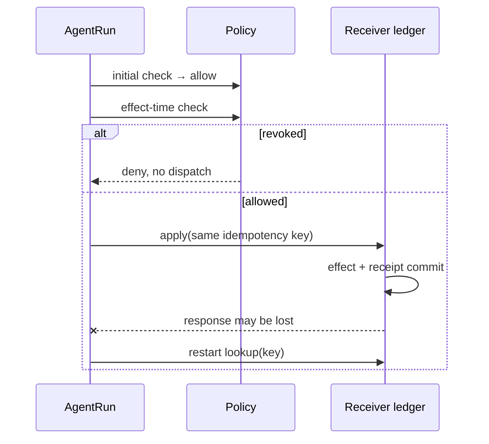
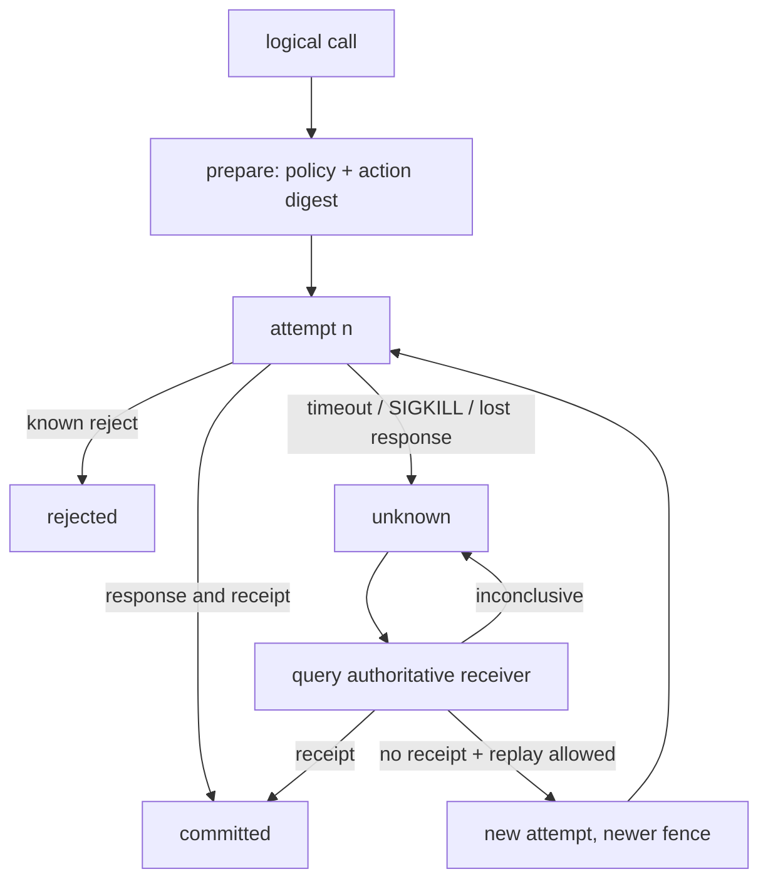
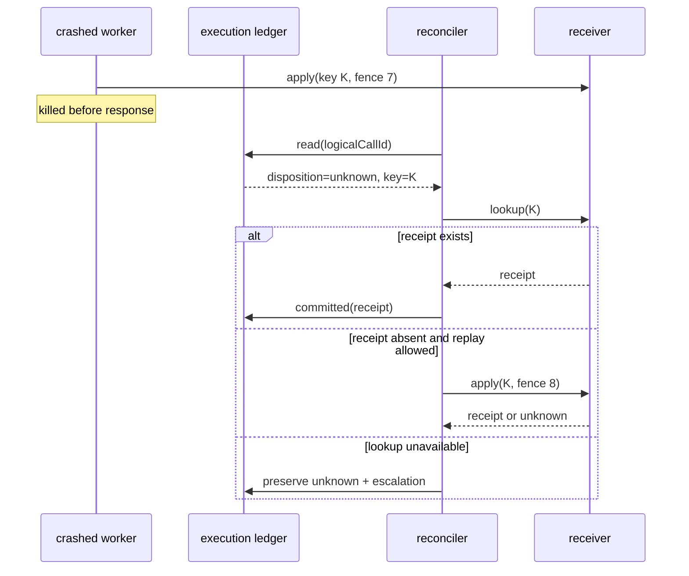
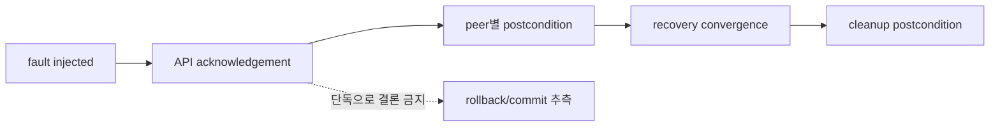

# 31장. 실패를 기다리지 말고 설계한다: fault injection과 recovery

## 네 run으로 만든 최소 fault matrix

한 정상 실행을 여러 장애 이야기로 재해석하지 않았다. 각 장애는 서로 다른 `run_id`, `trace_id`, 순번 범위를 가진 독립 실행이었다.

|fault|최초 관측|권위 있는 사후조건|최종 처리|
|---|---|---|---|
|allow 뒤 effect 직전 revoke|초기 allow|재확인 deny, receiver 미기동|dispatch 차단|
|commit 전 crash|connection lost|prepared, receipt 없음, count 0|동일 key retry 후 count 1|
|commit 후 응답 전 crash|connection lost|receipt 존재, count 1|lookup 후 duplicate 흡수|
|telemetry loss/redaction|응답·receipt 수신|export 2건 중 1건|효과는 존재, 관측은 불완전|



여기서 cancellation은 rollback이 아니다. revoke 실행에서는 dispatch 전 취소 요청과 확인이 모두 남았고 residue가 0이었지만, 이미 수신자에 도달한 호출에 같은 결론을 적용할 수 없다.

에이전트 시스템의 복구는 `try/except` 블록의 길이로 판단할 수 없다. 실패는 모델 호출, 큐, 권한 승인, worker process, receiver, 관측 exporter, 저장소 중 어디에서든 일어난다. 더 까다로운 문제는 **보이지 않는 결과**다. worker가 응답을 받지 못했다고 해서 receiver가 효과를 적용하지 않았다는 결론은 나오지 않는다. 그래서 복구 설계의 출발점은 “무엇이 실패했나”보다 “어떤 사실을 아직 모르는가”여야 한다.

이 장은 고장을 예외가 아니라 상태 전이로 다룬다. 목표는 모든 요청을 성공시키는 것이 아니다. 중복 effect, 권한 없는 재시도, telemetry absence를 success로 읽는 일, stale worker write를 막고, 모르는 결과를 정직하게 `Unknown`으로 남기는 것이다.



## 31.1 failure taxonomy: 같은 `error`라는 단어를 없애라

에이전트 runbook에서 `error_rate` 하나로 다음 사건을 합치면 복구가 잘못된 방향으로 간다.

|분류|예|즉시 retry 가능한가|권위 있는 다음 증거|
|---|---|---:|---|
|입력/계획 오류|schema가 맞지 않는 tool argument|아니오|validator 결과와 새 plan|
|정책 거절|approval 만료, tenant mismatch|아니오|새 policy decision|
|일시적 transport 오류|connection reset before send 확정|경우에 따라|transport contract|
|provider 결과 미상|timeout after send|아니오|provider/receiver receipt query|
|worker death|SIGKILL after prepare|아니오|durable ledger + receiver|
|stale ownership|old fencing token write|아니오|current fence comparison|
|관측 전달 실패|trace exporter queue overflow|아니오|execution/effect ledger|
|oracle 실패|test harness parse failure|아니오|독립된 oracle repair|

특히 `retryable`은 예외 class가 아니라 receiver 계약의 결과다. “HTTP 500이면 재시도” 같은 규칙은 apply-before-response 창을 모른다. idempotency key와 durable receipt query가 제공될 때에만 동일 logical effect를 안전하게 재제출할 길이 생긴다. provider가 그런 API를 제공하지 않는다면 자동 재시도는 business decision이며, 보상·human approval·manual reconciliation을 포함해야 한다.

## 31.2 실제 kill과 논리 시간 실험을 어떻게 읽을 것인가

이 책에서 다룬 multiprocess fixture는 worker-A가 lease를 받은 직후 실제 `SIGKILL`로 사라지는 사건을 만든다. 이후 durable SQLite ledger의 logical tick을 앞으로 이동하고 worker-B가 새 fencing token을 얻는다. 지연된 A의 write는 receiver compare에서 거절되고, 뒤늦은 retry는 receipt를 찾아 이전 attempt의 disposition을 조정한다.

여기서 실제인 것과 시뮬레이션인 것을 섞지 않는 것이 중요하다.

|관찰|종류|말할 수 있는 결론|말할 수 없는 결론|
|---|---|---|---|
|child process의 SIGKILL|실제 process event|메모리만의 state를 신뢰할 수 없음|node outage의 시간 분포|
|SQLite durable row|실제 local storage event|fixture의 restart가 ledger를 다시 읽음|replicated DB durability|
|`0→6→12` tick|controlled logical time|expiry ordering이 재현됨|6ms failover, p99|
|stale token reject|실제 fixture receiver branch|receiver 비교가 필요한 이유|모든 provider API가 fencing 지원|
|retry receipt lookup|실제 fixture branch|unknown을 receiver evidence로 좁힘|network partition에서 항상 종결|

logical clock은 고장을 약화하는 장치가 아니라 원인을 분리하는 장치다. wall clock 기반 test는 scheduler stall, CI contention, sleep precision을 함께 재는 반면, 이 fixture는 “만료가 먼저인가, stale write가 먼저인가”라는 순서만 검증한다. 실제 latency SLO는 별도의 load test와 histogram으로 측정해야 한다.

## 31.3 fault injection matrix를 코드보다 먼저 쓴다

고장 주입은 chaos라는 이름의 무작위 파괴가 아니다. 각 fault에 대해 injection point, expected durable evidence, 금지된 전이, recovery owner를 정한다.

|주입 지점|주입|반드시 남아야 할 증거|절대 해서는 안 되는 전이|복구 owner|
|---|---|---|---|---|
|approval 전|policy service unavailable|no approval decision|tool call로 우회|planner/policy|
|prepare 뒤|worker SIGKILL|attempt=`unknown`|`failed`로 단정|reconciler|
|receiver apply 뒤|receipt response drop|same idempotency key|새 effect key로 replay|receiver query|
|lease expiry 뒤|old holder delayed packet|current fencing token|old write accept|receiver|
|log enqueue|bounded queue full|loss counter|log absence를 execution absence로 해석|telemetry owner|
|rollout drain|deadline 초과|orphan/unknown record|success/abort 추측|deployment reconciler|
|verifier|malformed report|oracle error type|pass score 생성|evaluation owner|

이 표는 incident 후 작성하는 회고 문서가 아니다. 테스트 코드와 production event schema의 공통 계약이어야 한다. 각 row에는 `RunID`, `LogicalCallID`, `AttemptID`, policy revision, state revision, fence token, idempotency key를 연결한다. 그래야 “worker가 죽었다”와 “다른 worker가 같은 user action을 새로 시작했다”를 분리할 수 있다.

## 31.4 recovery는 재실행이 아니라 판정 순서다

가장 단순한 복구기는 `retry()`지만, 안전한 복구기는 다음 순서를 따른다.

1. durable execution ledger에서 logical call과 마지막 known disposition을 읽는다.
2. action digest와 approval revision이 아직 유효한지 확인한다. 인수가 달라졌다면 같은 재시도가 아니다.
3. receiver가 제공하는 idempotency/receipt 조회를 한다.
4. receipt가 있으면 `Committed`로 reconcile한다. telemetry span이 있어도 receipt가 없으면 이 단계를 건너뛸 수 없다.
5. receipt가 없고 replay가 계약상 허용되면 새 attempt와 최신 fence로 같은 logical effect를 제출한다.
6. receiver를 조회할 수 없으면 `Unknown`을 보존하고 escalation deadline을 기록한다.



새 fence는 stale owner를 막기 위한 것이지 receipt lookup을 대체하지 않는다. idempotency key는 중복 apply를 막기 위한 것이지 approval freshness를 대체하지 않는다. 이 둘을 결합하지 않고 각각의 책임을 분리해야 한다.

## 31.5 cancellation, compensation, rollback의 차이

사용자가 cancel을 눌렀을 때 가능한 결과는 최소 네 가지다. 아직 prepare 전이라면 start하지 않을 수 있다. receiver가 cancellable job을 아직 시작하지 않았다면 cancel receipt를 받을 수 있다. 이미 effect가 commit됐으면 cancel은 과거를 지우지 못한다. 그때는 compensation이 필요할 수 있다. compensation도 새 logical effect이며 원래 effect의 inverse라고 가정하면 안 된다. 환불을 취소하는 일은 회계 기간, 수수료, downstream shipment 등 때문에 원래 상태 복원과 다를 수 있다.

|행동|무엇을 바꾸는가|필요한 증거|흔한 오해|
|---|---|---|---|
|cancel request|미래 작업을 멈추라고 요청|receiver acknowledgement|요청만으로 중단됐다고 믿음|
|abort before apply|아직 effect 없음|prepare state와 receiver no-receipt|timeout을 abort로 읽음|
|rollback|같은 transactional boundary를 되돌림|transactional commit model|외부 API에도 자동 존재한다고 가정|
|compensation|새로운 반대 방향 business effect|새 approval, new receipt|원래 effect가 사라졌다고 표현|

## 31.6 실습과 운영 체크리스트

다음 실습은 “복구가 됐다”는 인상이 아니라, 필요한 증거가 남았는지 확인한다.

1. `after_prepare`, `after_receiver_apply`, `after_local_receipt` 세 지점에서 worker를 죽인다. 세 경우가 같은 `failed`로 합쳐지지 않는지 본다.
2. receiver의 receipt response만 drop한다. provider apply 여부를 trace나 socket error로 추정하지 않고 key lookup으로 판정하는지 본다.
3. approval을 만료시킨 뒤 retry한다. old approval과 changed arguments가 자동 실행되지 않는지 본다.
4. old token을 가진 process의 packet을 새 owner 뒤에 전달한다. receiver가 caller-side timer가 아닌 token comparison으로 거절하는지 본다.
5. exporter queue를 가득 채운다. telemetry loss counter와 effect ledger를 분리해 dashboard가 `0 failures`라고 거짓말하지 않는지 본다.

이 장은 multi-node quorum, cross-region storage divergence, real provider cancellation, database outbox atomicity, full Kubernetes drain을 검증하지 않는다. [Dapr의 resiliency 개념 문서](https://github.com/dapr/docs/blob/5958a7e19a04e199326a6c5321bdd7714ee83b4c/daprdocs/content/en/concepts/resiliency-concept.md#L12-L20)가 보여 주는 retry/resiliency policy도 idempotency나 business compensation을 자동 보장하지 않는다. 이 비보장을 runbook에 적어 두면, 고장 때 사람과 코드가 모르는 사실을 만들어 내지 않게 된다.

## 31.7 recovery drill의 합격 기준

복구 drill은 “테스트가 끝났다”가 아니라 아래의 부정적 조건까지 확인해야 합격이다. 첫째, killed attempt가 `Committed`나 `Failed`로 자동 승격되지 않는다. 둘째, stale token의 write가 caller log에서만 실패하는 것이 아니라 receiver durable boundary에서 거절된다. 셋째, retry count가 늘어도 logical effect 수가 늘지 않는다. 넷째, 관측 pipeline을 고장 내도 effect ledger의 상태가 바뀌지 않는다. 다섯째, receipt query가 unavailable인 동안 automation이 새 key로 write하지 않는다.

|검사|관찰해야 하는 durable field|통과가 아닌 것|
|---|---|---|
|attempt kill|`disposition=unknown`, kill phase|process exit code만 존재|
|duplicate prevention|같은 key의 stable receipt|client가 retry를 안 했다는 log|
|fence rejection|received/current token와 reject reason|old worker가 조용히 끝남|
|approval freshness|action digest와 policy revision|user-facing confirmation text|
|telemetry loss|drop reason와 raw execution identity|dashboard trace가 없음|
|manual escalation|owner, deadline, query evidence|ticket만 생성됨|

drill의 결과는 사고 후 forensic에도 남겨야 한다. 어떤 code revision, receiver schema, provider mode, fault injection phase, retry policy로 실행했는지 고정하지 않으면 다음 배포에서 같은 assertion을 다시 말할 수 없다. 특히 failure를 재현했다는 사실과 production에서 같은 failure frequency가 있다는 주장은 다르다. 전자는 mechanism 검증이고 후자는 관측 표본과 환경을 갖춘 reliability 측정이다.

복구가 human escalation으로 넘어갈 때도 상태를 단순화하지 않는다. 담당자가 “재시도”를 클릭할 수 있도록 `Unknown`을 `Failed`로 바꾸는 대신, receipt lookup 결과, approval 만료 여부, 최대 retry budget, 가능한 compensation path를 화면에 보여 준다. 사람이 automation의 빈칸을 메울 수는 있어도, 시스템이 잃어버린 receipt를 사람이 상상으로 채우게 해서는 안 된다.

fault injection에는 안전한 test target이 필요하다. production customer effect에 무작위 `SIGKILL`이나 duplicate packet을 보내는 방식은 검증이 아니라 사고가 될 수 있다. isolated receiver, synthetic tenant, disposable database, explicit fault flag, bounded retry budget을 사용하고, drill 종료 뒤 receipt와 side effect를 정리한다. test가 남긴 orphan을 성공적으로 삭제했다는 log 역시 effect receipt와 다르므로, cleanup logical call에도 독립 key와 verification을 둔다. 고장을 의도적으로 만들수록 실험 자체의 권한 경계는 더 엄격해야 한다.

## 31.8 fault matrix를 상태 전이의 곱으로 만든다

고장 이름만 나열하면 coverage가 생기지 않는다. 주입 지점 (P), 전달 결과 (D), durable state (S), 복구 주체 (R)의 곱으로 trial을 만든다.

\[
Trial=P\times D\times S\times R
\]

예를 들어 `worker kill` 하나도 apply 전, receiver commit 후, receipt 수신 후, local journal commit 후가 다르다. network fault도 request drop, response drop, 양방향 partition, 지연, reorder를 구분한다. 모든 조합을 무작정 실행하는 대신 위험 분석으로 pairwise와 반드시 필요한 3-way 조합을 고른다.

| 주입점 | 로컬 상태 | receiver 상태 | 올바른 terminal | 금지할 자동화 |
|---|---|---|---|---|
| prepare 전 kill | 없음 | 없음 | retryable candidate | 새 logical call 생성 |
| prepare 후 apply 전 | Prepared | 없음 확인 전 Unknown | reconcile | 즉시 Failed |
| apply commit 후 response loss | Prepared | receipt·count 1 | Unknown→Committed | 새 key retry |
| local commit 후 ack loss | Committed | receipt | 응답 재구성 | effect 재실행 |
| policy revoke 후 queue 대기 | Approved-old | 미실행 | stale rejection | 과거 승인 재사용 |
| exporter loss | 상태 유지 | 상태 유지 | telemetry gap | effect absence 판정 |
| minority partition | replica별 상이 | generation 상이 가능 | typed stale/unavailable | 낮은 consistency 결과 채택 |

### fault injector도 계약을 가져야 한다

```python
@contextmanager
def fault(name, target, deadline_s):
    assert target.environment == "disposable-lab"
    before = capture_processes_ports_and_rows(target)
    handle = enable_fault(name, target)
    try:
        yield handle
    finally:
        disable_fault(handle)
        assert wait_until_recovered(target, deadline_s)
        assert no_surviving_child_processes(target)
        persist_cleanup_diff(before, capture_state(target))
```

`finally`가 있다는 사실만으로 cleanup 성공은 아니다. port가 닫혔는지, child process가 reap됐는지, network namespace·proxy rule이 남지 않았는지, disposable row가 정확한 scope에서 정리됐는지를 postcondition으로 검사한다. broad path나 unresolved variable을 삭제 대상으로 쓰지 않는다.

### 실제 partition 결과를 읽는 순서

세 peer 중 하나를 양방향 격리한 실험에서 격리 peer의 낮은 consistency read는 성공했고 `all` read와 strong write는 실패했다. 연결된 두 peer의 strong write는 성공했지만 `all` read는 실패했다. 통신 복구 뒤 visible point set은 수렴했다. 이 네 결과는 모순이 아니다. read consistency, update ordering, 도달 가능한 replica 수가 서로 다른 조건을 검사하기 때문이다.



실험 기록에는 topology, 방향성, 차단 계층, leader 위치, 정확한 query parameter가 필요하다. process를 죽인 실험을 partition이라고 쓰거나 양방향 격리를 비대칭 packet loss라고 쓰면 다음 사람이 다른 fault를 재현한다.

### 복구 oracle을 결과 문자열에서 분리한다

복구 성공은 process exit code 0이나 readiness 200이 아니다. 다음 불변식을 함께 확인한다.

1. stable effect key의 receiver apply count가 1 이하인가.
2. durable receipt와 local terminal이 같은 effect digest를 가리키는가.
3. old fencing generation의 write가 거절되는가.
4. policy generation이 다른 후보가 채택되지 않는가.
5. telemetry loss counter와 durable effect count가 독립적으로 남는가.
6. recovery 뒤 peer별 visible set과 generation이 기대값으로 수렴하는가.
7. cleanup 뒤 child process, port, temporary rule이 남지 않았는가.

### retry budget을 fault 결과로 계산한다

재시도 횟수 (n)이 늘면 성공확률만 오르는 것이 아니다. receiver가 이미 적용했을 확률과 queue 부하도 함께 커진다. attempt (i)의 비용을 (c_i), 중복 효과 손실을 (L_d), receiver 조회 비용을 (c_q)라 하면 blind retry보다 lookup-first가 유리한 조건은 대략 다음과 같다.

\[
c_q < P(applied\mid timeout)\cdot L_d + c_{duplicate\ attempt}
\]

금전·메일·배포처럼 (L_d)가 큰 effect는 작은 조회 비용을 아끼려고 blind retry할 이유가 거의 없다. 조회 API가 없다면 이것은 기술적 retry flag가 아니라 업무 위험 승인 문제다.

### 회귀 suite 설계

- deterministic logical clock trial과 실제 process kill trial을 둘 다 둔다.
- fault 이전 baseline과 fault 해제 뒤 convergence를 같은 manifest에 묶는다.
- expected failure도 typed assertion으로 검사하고 `|| true`만으로 삼키지 않는다.
- random seed, process ID, port, data directory는 run identity와 함께 기록한다.
- telemetry를 oracle로 쓰는 trial과 telemetry loss를 주입하는 trial을 분리한다.
- negative evaluator는 inventory completeness 없이는 false를 내리지 않는다.

fault injection의 목적은 예외를 많이 만드는 데 있지 않다. 실패가 어느 durable boundary를 지나갔는지 밝혀, 재시도·reconcile·escalation 가운데 하나만 선택할 수 있게 만드는 데 있다.

trial report에는 expected fault와 실제 관측 fault를 나란히 쓴다. `kill requested`와 `process reaped`, `rule installed`와 `packet blocked`, `timeout observed`와 `receiver committed`는 각각 다른 사건이다. assertion이 실패하면 가장 먼저 갈린 event ordinal, peer response, receiver row를 묶어 남긴다. 최종 상태만 비교하면 중간에 duplicate apply가 났다가 보상된 경우를 놓친다. 회귀 검사는 terminal뿐 아니라 금지 transition이 한 번도 일어나지 않았음을 확인해야 한다.

이 규칙을 release checklist와 on-call drill에 함께 넣는다.

### 코드 원전

- [Temporal TypeScript의 request retry 판정](https://github.com/temporalio/sdk-typescript/blob/1327f2d5ae77210555bbafc01fbdeaca3e9499eb/packages/client/src/grpc-retry.ts#L109-L167)
- [Temporal Go activity retry·heartbeat options](https://github.com/temporalio/sdk-go/blob/213f751d5117fd5621ef6dd55a21b78d605c9696/workflow/activity_options.go#L66-L90)
- [Dapr state API의 concurrency contract](https://github.com/dapr/docs/blob/5958a7e19a04e199326a6c5321bdd7714ee83b4c/daprdocs/content/en/reference/api/state_api.md#L454-L461)
