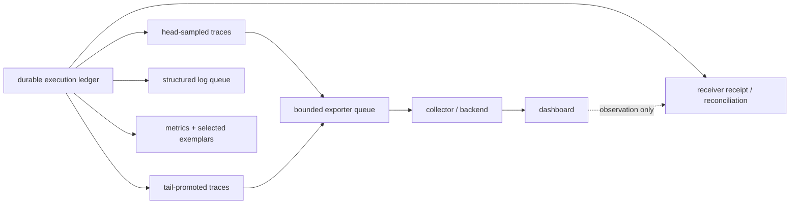
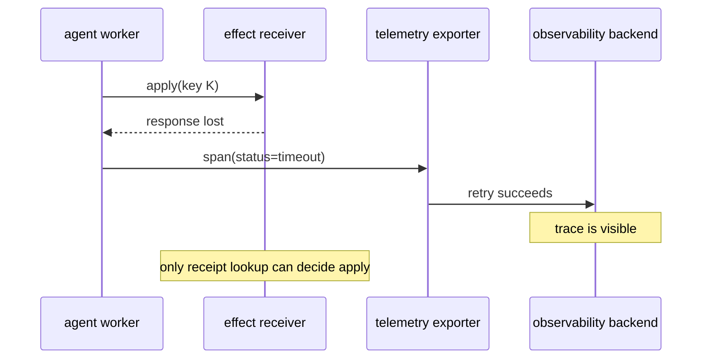

# 32장. trace, metric, log, receipt: 보이는 것과 일어난 것은 다르다

## “로그가 없다”를 효과 부재로 읽지 않는 실험

한 실행에서 수신자는 효과와 receipt를 commit했고 호출자도 이를 받았다. 그러나 exporter가 시도한 이벤트 두 건 가운데 저장된 것은 한 건뿐이었다. 저장본은 allowlist 방식으로 `trace_id`와 사건 이름만 남겨 payload/token marker를 제거했다. 따라서 세 문장을 동시에 참으로 유지해야 한다.

1. receipt가 있으므로 이 로컬 수신자에서 효과는 적용됐다.
2. 이벤트 하나가 없으므로 telemetry는 불완전하다.
3. 민감 표식이 없으므로 redaction 검사는 통과했지만 completeness를 증명하지는 않는다.

```text
run_id → trace_id → attempt_id → idempotency_key_digest
                                      ↓
                         receiver receipt / restart lookup
```

trace backend가 비어 있으면 “실행 없음”이 아니라 `telemetry_disposition=missing`을 기록하고 receiver reconciliation을 수행한다. [OpenTelemetry trace API의 고정 revision](https://github.com/open-telemetry/opentelemetry-specification/blob/57c30c2ebf7c5f92013f2c49b0db89e3612ae6f1/specification/trace/api.md#L830-L832)도 sampling과 business commit이 다른 결정임을 전제로 읽어야 한다.

장애 중에는 dashboard만 보고 “문제가 없었다”고 말하기 쉽다. trace가 없으면 요청이 없었다고, exporter가 성공하면 tool effect도 성공했다고, metric의 평균이 낮으면 tail user도 괜찮았다고 말하기 쉽다. 모두 틀릴 수 있다. trace·metric·log는 실행의 서로 다른 투영이며, receiver receipt와 durable execution ledger는 또 다른 종류의 사실이다. 이 장은 관측을 과소평가하려는 글이 아니다. **관측이 답할 수 있는 질문과 답할 수 없는 질문**을 코드와 상태로 나누는 것이 목적이다.



## 32.1 네 기록은 네 가지 질문에 답한다

|기록|가장 잘 답하는 질문|부족한 질문|권위의 원천|
|---|---|---|---|
|trace|한 request에서 어떤 span과 causal context가 보였는가|모든 실행이 보였는가, effect가 commit됐는가|sampling/export 성공 범위|
|log|무슨 구조화된 진단 사건이 남았는가|손실 없이 모든 사건을 보았는가|logger/queue 보존 범위|
|metric|어떤 집계 분포·카운터가 관측되었는가|어느 개별 run이 원인인가|instrumentation와 label 정의|
|exemplar|특정 metric observation이 가리키는 선택적 trace는 무엇인가|complete trace-log join|sampled association|
|receipt|receiver가 특정 idempotency key를 적용했는가|사용자 의도가 옳았는가|receiver durable state|
|execution ledger|시스템이 알고 있는 run/attempt state는 무엇인가|외부 시스템이 실제로 apply했는가|ledger durability/model|

이 표에서 특히 구분해야 할 행은 receipt다. trace의 `status=OK`는 client library가 request lifecycle을 어떻게 끝냈는지 보여 줄 수 있지만, remote receiver가 business effect를 durable하게 commit했다는 증거는 아니다. 반대로 receipt가 있어도 관측 pipeline이 이를 수집하지 못할 수 있다. 이런 비대칭이 있기 때문에 reconciler는 dashboard가 아니라 receiver/ledger identity를 조회한다.

## 32.2 sampling은 분모를 바꾼다

[OpenTelemetry trace specification](https://github.com/open-telemetry/opentelemetry-specification/blob/57c30c2ebf7c5f92013f2c49b0db89e3612ae6f1/specification/trace/api.md#L830-L832)은 head sampling이 span 생성 시점에 이용 가능한 정보로 결정됨을 명시한다. 따라서 error가 나중에야 드러나는 작업은 head sample에서 빠질 수 있다. 반대로 tail policy가 error trace를 승격하면 error가 trace 표본에 과대표집된다.

작은 결정론적 fixture를 보자. durable execution ledger에는 4 run과 2 error가 있다. head sampling은 2 run을 남기지만 두 error는 모두 빠져 `0/2`로 보인다. tail policy는 error 두 개를 포함한 3 run을 남겨 `2/3`으로 보인다. 둘 중 어느 값도 전체 실행의 error rate `2/4`를 대신하지 못한다.

|투영|보이는 분자/분모|왜 전체 reliability rate가 아닌가|
|---|---:|---|
|durable ledger|2 errors / 4 runs|fixture가 가진 실행 분모|
|head sample|0 / 2|생성 시점 정보가 error를 모름|
|tail promoted sample|2 / 3|error를 의도적으로 보존|
|exported trace|queue/drop/retry 뒤의 수|delivery policy가 분모를 더 변경|

올바른 dashboard 문장은 “head-sampled trace에서 관측된 error 비율” 또는 “tail-promoted trace의 error composition”이다. “서비스 error rate”라고 부르려면 durable request denominator와 sampling/drop weight를 함께 정의해야 한다. head와 tail을 평균 내어 보정하는 것도 일반 해법이 아니다. policy, sampling probability, promotion condition, unsampled count가 서로 다르기 때문이다.

## 32.3 exporter 성공은 tool receipt가 아니다

[OpenTelemetry library guideline](https://github.com/open-telemetry/opentelemetry-specification/blob/57c30c2ebf7c5f92013f2c49b0db89e3612ae6f1/specification/library-guidelines.md#L76-L88)은 exporter와 queue/retry가 telemetry delivery 구성임을 설명한다. telemetry exporter가 두 번째 시도에서 backend로 span을 전달했다고 해도, span 안의 tool call이 receiver에서 commit됐다는 뜻은 아니다. 이는 서로 다른 channel이다.



이 장의 실습에서는 bounded queue가 `tr-02`를 overflow로 drop하고, `tr-04`는 retryable export failure 뒤에야 전달된다. `tr-04`가 backend에서 검색된다는 사실은 effect receipt가 `null`인 상태와 공존한다. 다음 행동은 trace로 `Committed`를 만들지 않고, `logicalCallId`/idempotency key로 receiver에 reconcile query를 보내는 것이다.

[OpenTelemetry SDK environment specification](https://github.com/open-telemetry/opentelemetry-specification/blob/57c30c2ebf7c5f92013f2c49b0db89e3612ae6f1/specification/configuration/sdk-environment-variables.md#L154-L170)에 보이는 BSP/BLRP queue size, batch size, timeout은 queue의 구성 표면이다. 특정 language SDK, collector, backend가 overflow에서 동일한 drop 순서를 쓴다는 보장은 아니다. 그러므로 production에는 exporter queue depth, dropped spans/logs, retry count, backend reject count, sampling decision을 별도 계측한다.

## 32.4 trace–log–metric join은 부분 함수다

`trace_id`를 log field나 exemplar label로 넣으면 조사 속도는 좋아진다. [Prometheus exemplar JSON regression](https://github.com/prometheus/prometheus/blob/1584f8c2f7879f15a4a15cd3698d478623b52ca4/model/textparse/json_codec_test.go#L166-L180)은 exemplar label로 trace ID를 표현할 수 있음을 보여 준다. 하지만 이는 가능한 링크의 표현일 뿐, 모든 metric point에 exemplar가 있다는 계약도, 모든 trace에 log가 보존된다는 계약도 아니다.

실습의 두 반례는 의도적으로 다르다. `run-fail-1`은 head sampling에서 trace가 없지만 log가 남는다. `run-fail-2`는 tail promotion trace는 남지만 log queue에서 log가 drop되고 exemplar도 없다. 두 경우 missing join은 실패가 없었다는 증거가 아니다. 조사 UI는 `missing_trace`, `missing_log`, `missing_exemplar`, `export_failed`, `redacted`를 하나의 null로 합치지 말아야 한다.

|조인 결과|가능한 의미|금지된 결론|
|---|---|---|
|trace 있음, receipt 없음|request/timeout 관측|effect가 실패했다|
|receipt 있음, trace 없음|sampling/drop 또는 instrumentation gap|요청이 없었다|
|metric 있음, exemplar 없음|집계만 보존|이 run에는 문제가 없었다|
|log 없음, trace 있음|log drop/redaction/path divergence|코드가 그 분기를 안 탔다|
|모두 없음, ledger 있음|telemetry pipeline loss 또는 disabled instrumentation|실행 자체가 없었다|

## 32.5 redaction은 보안과 진단의 교환이다

prompt, bearer token, email, request target을 그대로 trace attribute나 Prometheus label에 넣는 일은 편리하지만 위험하다. 반대로 전부 `[REDACTED]`로 바꾸면 특정 tenant/target에서만 일어나는 failure를 구분하기 어렵다. 두 선택 모두 비용이 있다. 좋은 설계는 그 비용을 숨기지 않는다.

|필드|일반 telemetry에 허용되는 형태|고위험 형태|진단 대안|
|---|---|---|---|
|사용자 식별자|rotation 가능한 pseudonym|email, account number|권한 분리된 mapping store|
|prompt|길이, bounded category, digest|원문, secret 포함 context|짧은 보존의 access-controlled capture|
|tool target|resource class, stable opaque ID|URL query, file path, tenant secret|audit-authorized drill-down|
|credential|존재 여부조차 최소화|bearer token, API key|절대 기록하지 않음|

digest도 만능이 아니다. low-entropy identifier는 dictionary attack으로 역추론될 수 있고, stable digest는 장기 추적자가 된다. redaction test에는 leakage negative control뿐 아니라 debugging discrimination negative control도 필요하다. 즉 secret이 안 나오는지와, 필요한 권한을 가진 운영자가 서로 다른 failure class를 구분할 수 있는지를 동시에 시험한다.

## 32.6 실습: receipt가 없는 trace를 복구 대상으로 만든다

1. 네 개의 logical run 중 두 개만 head sample한다. dashboard rate와 ledger rate를 나란히 출력한다.
2. error trigger 뒤 tail promotion을 적용한다. error-rich 표본을 global rate로 게시하려는 코드가 거부되는지 확인한다.
3. bounded exporter queue를 넘긴다. drop counter가 증가하고 execution ledger가 변하지 않는지 본다.
4. effect request 뒤 response를 잃는다. trace export가 성공해도 disposition이 `Unknown`으로 남는지 확인한다.
5. receiver receipt query가 성공했을 때에만 `Committed`로 reconcile한다.
6. redaction fixture에 secret/email/request target을 넣는다. 일반 span/label에서 제거되지만 diagnostic channel의 권한·보존 정책이 없다면 그 channel도 만들지 않는다.

## 32.7 비보장과 체크리스트

이 장의 loss model은 외부 collector, Prometheus server, OTLP network, real provider를 부하 시험한 결과가 아니다. fixture의 `actual_elapsed_ns`는 Python local overhead이며 trace latency, effect latency, SLO에 넣지 않는다. collector outage, disk-backed queue durability, cross-service clock skew, backend retention, legal discovery 요구는 대상 운영 환경에서 별도로 검증해야 한다.

* trace는 span lifecycle이고 receipt는 effect lifecycle이라는 타입 구분이 코드에 있는가?
* sampling·drop·retry·redaction reason과 durable denominator를 함께 기록하는가?
* `trace_id`가 없을 때 run identity로 ledger를 조사할 수 있는가?
* metric label cardinality를 통제하면서도 incident correlation을 위한 최소 식별자가 있는가?
* receiver 조회가 불가능할 때 dashboard green을 success로 승격하지 않고 `Unknown`과 escalation을 남기는가?

관측은 시스템의 눈이다. 그러나 눈이 감겼다고 세계가 멈춘 것은 아니다. 이 단순한 구분을 지킬 때 trace, metric, log는 화려한 그림이 아니라 복구 가능한 시스템의 증거 사슬이 된다.

## 32.8 event schema: 조인 키를 먼저 설계한다

관측을 나중에 붙이면 `trace_id` 하나로 모든 것을 연결하려는 유혹이 생긴다. 대신 execution/effect schema에서 안정된 identity를 먼저 정한다. `runId`는 사용자 요청의 범위, `logicalCallId`는 재시도 전후에 이어지는 의도, `attemptId`는 process lifecycle, `effectId`와 `idempotencyKey`는 receiver boundary, `receiptId`는 commit evidence다. trace/log/metric은 이 identity 중 필요한 최소 부분을 **참조**할 수 있지만 만들어서는 안 된다.

|event|필수 identity|시간 의미|권위 있는가|
|---|---|---|---|
|execution transition|run, logical call, attempt|ledger 기록 시점|그 ledger 범위에서 예|
|effect prepare|effect, action digest, fence|proposal 시점|아니오|
|receiver receipt|effect, idempotency key, receipt|receiver commit 시점|receiver 범위에서 예|
|trace span|run/attempt correlation|instrumentation clock|관측 범위에서만 예|
|metric point|service/class/window|aggregation window|개별 run에는 아니오|
|redaction event|field class, policy revision|projection 시점|원문 존재를 뜻하지 않음|

metric에 full run ID를 label로 넣어 조인을 완전하게 만들려 하면 cardinality와 개인정보 문제가 생긴다. 반대로 아무 correlation도 없으면 incident 조사 비용이 폭증한다. 해법은 bounded exemplar, sampled trace, opaque correlation ID, access-controlled ledger lookup을 조합하는 것이다. 어떤 channel이 어떤 retention·권한을 가졌는지를 명시해야 redaction 후의 null을 정상적인 보안 결과로 해석할 수 있다.

시간도 하나가 아니다. client start, server receive, worker start, receiver apply, receipt persist, trace export time은 다른 clock·다른 boundary의 사건이다. span duration만으로 queue wait를 계산하거나 exporter timestamp로 effect completion을 계산하지 않는다. clock skew가 의심되면 duration은 같은 process monotonic measurement 안에서만 쓰고, cross-system order는 receipt/ledger sequence 같은 causal evidence로 보강한다.

## 32.9 네 기록 사이에는 전사 함수가 없다

span에서 receipt로 가는 변환을 (f:S\rightharpoonup R)라고 쓰면 (f)는 부분 함수다. instrumentation이 없거나 sampling되면 span이 없고, span이 있어도 receiver commit identity가 없을 수 있다. 반대 방향 (g:R\rightharpoonup S)도 exporter drop 때문에 부분 함수다. 따라서 다음 명제는 모두 거짓이다.

$$
SpanOK\Rightarrow Committed,\quad
\neg Span\Rightarrow \neg Committed,\quad
MetricCount=\sum Receipts,\quad
LogError\Rightarrow EffectFailed.
$$

OpenTelemetry의 span status는 instrumentation이 관측한 operation 결과를 표현한다. receiver의 business commit이나 idempotency ledger를 정의하지 않는다. semantic conventions 저장소에 남아 있는 `invoke_agent`·`execute_tool` span 모델도 [deprecated 파일](https://github.com/open-telemetry/semantic-conventions/blob/e9d0607d95d879d4c565b5a25a565fe0c995ec61/model/gen-ai/deprecated/spans-deprecated.yaml#L531-L635)에 있으므로, 이를 현재 안정 규약이나 효과 보증으로 인용하면 안 된다. 이름이 `execute_tool`이어도 span lifecycle의 관측 계약일 뿐이다.

failure lab은 네 channel을 독립적으로 끊는다. collector를 중단해 span·log export를 잃고도 receiver receipt가 남는지, metric scrape를 건너뛰어도 execution ledger가 유지되는지, receiver response만 버려 span을 error로 끝내도 나중 조회로 commit이 드러나는지, log redaction으로 effect ID가 사라져도 access-controlled lookup이 가능한지 본다. 각 trial은 `(runId, logicalCallId, attemptId, effectId, receiptId)`에서 어떤 join이 정의됐는지와 왜 정의되지 않았는지를 함께 출력한다. null을 빈 문자열로 채우면 “관측 불가”가 “동일 사건”으로 합쳐지므로 join key가 없을 때는 명시적으로 `unjoinable`을 반환한다.

이 네 channel의 분리를 층별로 펼치면 [42장](./42-loop-engineering.md)의 loop 진단 metric, [43장](./43-cache-engineering.md)의 freshness·invalidation 지표, [44장](./44-subagents-goals.md)의 goal proof 지표, [45장](./45-ontology-agent-control-plane.md)의 generation skew 지표가 된다. 층이 달라져도 규칙은 같다. 어느 층의 숫자도 receipt를 대신하지 않는다.

## 32.10 한 수직 실행에서 관측을 연결하되, 전달 보증은 만들지 않는다

OpenFGA 판정 → MCP tool → local receipt를 실제 loopback으로 통과시킨 실행에서 allow arm에는 `security.openfga.check`, `mcp.tools.call`, `receiver.receipt`, structured log, root span이 같은 trace ID로 남았고, deny arm에는 tool attempt와 receipt가 없었다. 이것은 authorization decision이 이 fixture의 dispatch gate가 되었고, trace로 실행의 **관계**를 살필 수 있다는 뜻이다.

그러나 사용한 exporter는 [끝난 `SpanData`를 메모리에서 읽는 구현](https://github.com/open-telemetry/opentelemetry-rust/blob/285dc925f98403ff426acc70968f104dc820d4f2/opentelemetry-sdk/src/trace/in_memory_exporter.rs#L117-L138)이었다.

[SimpleSpanProcessor가 exporter를 연결하는 코드](https://github.com/open-telemetry/opentelemetry-rust/blob/285dc925f98403ff426acc70968f104dc820d4f2/opentelemetry-sdk/src/trace/provider.rs#L306-L321)는 inspection pipeline을 만들지만 OTLP collector의 수신 확인, disk queue, backend retention을 만들지 않는다. metric도 Prometheus server가 scrape한 series가 아니라 text exposition 형태의 retained counter였다.

|질문|이 실행이 답한 것|별도 검증이 필요한 것|
|---|---|---|
|권한 deny가 tool을 막았는가|deny arm에서 tool/receipt 없음|policy update와 dispatch 사이의 원자성|
|같은 실행을 trace로 잇는가|allow/deny arm의 span이 arm trace ID로 join|모든 service와 모든 retry의 complete trace|
|receipt는 남았는가|allow arm의 local receipt|원격 receiver durability와 multi-writer correctness|
|metric은 수집됐는가|retained counter가 증가|Prometheus scrape, remote-write, alert delivery|

### collector와 Prometheus를 붙일 때의 최소 oracle

collector를 추가하면 “span이 collector까지 도착했다”와 “effect가 commit됐다”가 또 한 번 분리된다. Prometheus를 추가하면 “counter가 process에서 노출됐다”, “server가 한 번 scrape했다”, “rule이 평가됐다”, “alert가 전달됐다”도 각각 다른 사실이다. 따라서 운영 검증은 아래처럼 channel별 postcondition을 선언한다.

```text
trace: collector accepted batch / backend queryable trace (telemetry only)
metric: Prometheus scraped timestamp / rule result (aggregate only)
effect: receiver receipt by idempotency key (business effect only)
```

공개 [기록 검증 bundle](/labs/volume-3/runtime-cancellation-observability/README.txt)에서는 allow/deny의 순서와 fail-closed oracle만 재검사한다.

```bash
python3 labs/volume-3/runtime-cancellation-observability/verify_recorded_wave78.py \
  --case openfga-mcp-otel-receipt --verify-recorded
```

이 검증은 collector나 Prometheus를 기동하지 않으며, 정제된 ledger의 SHA-256도 live 실행 증명이 아니다. 오히려 이 제한을 명시해야 dashboard가 녹색이라는 이유로 receipt를 생략하는 설계를 피할 수 있다.
