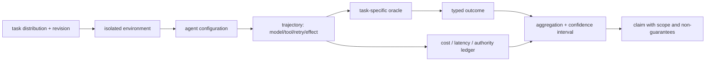
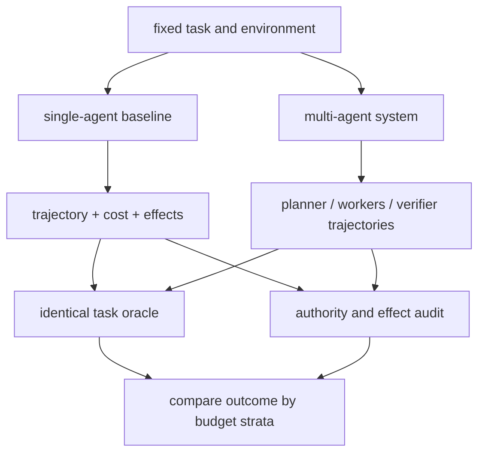

# 33장. 에이전트를 평가한다는 것: 점수보다 먼저 trial과 oracle을 고정하라

에이전트 평가에서 가장 먼저 실패하는 것은 모델이 아니라 문장이다. “A가 B보다 좋다”는 말에는 task distribution, environment revision, tool authority, prompt, model revision, token budget, timeout, oracle, aggregation이 숨어 있다. 어느 하나가 바뀌면 같은 score라도 다른 실험일 수 있다. multi-agent는 특히 위험하다. planner·worker·verifier를 더 넣어 성공률이 오르면 그것이 협업의 효과인지, 단순히 호출 수와 탐색 예산이 늘어난 결과인지 분리해야 한다.

원칙은 간단하다. **한 점수는 한 oracle의 요약일 뿐이며, trial의 trajectory와 실패 분류를 잃으면 점수는 원인을 설명하지 못한다.**

## 33.1 score 앞에 있는 여덟 개의 고정값

|고정 또는 기록 항목|왜 필요한가|누락했을 때 생기는 착시|
|---|---|---|
|dataset/task revision|문제 자체를 같은 것으로 만든다|새로운 공개 해답·난이도 차이를 model gain으로 읽음|
|environment/image/tool revision|실행 가능한 world를 고정|tool drift를 agent 능력으로 읽음|
|model/provider revision|응답 분포와 API 행동을 고정|서비스 업데이트를 prompt 개선으로 읽음|
|prompt, template, decoding|policy와 exploration을 고정|“agent architecture” 비교에 hidden prompt 차이가 섞임|
|총 예산|input/output token, calls, tool bytes, wall time, money|branch를 더 늘린 결과를 구조 개선으로 홍보|
|authority/effect policy|읽기·쓰기·approval·idempotency 범위|더 위험한 agent가 더 높은 task score를 얻음|
|oracle version|무엇을 success라 할지 고정|grader update를 capability change로 오독|
|trial seed/ordering|변동성을 추적|재현 불가능한 한 번의 최고 score|

seed를 적었다고 remote model, user simulator, provider queue가 deterministic해지는 것은 아니다. seed는 재현에 필요한 메타데이터 한 조각이다. 따라서 결과에는 observed variation, failed trials, unavailable provider, context limit, parser error를 숨기지 않고 분리한다.

## 33.2 benchmark는 서로 다른 질문을 한다

[SWE-bench의 evaluation harness](https://github.com/SWE-bench/SWE-bench/blob/9d38c55881d3ee5c25bad64d736c4440fa5b82d9/swebench/harness/run_evaluation.py#L288-L429)는 pristine container tree에 patch를 적용하고 test script 결과와 report를 materialize하는 흐름을 보여 준다. patch apply 성공은 behavioral correctness가 아니며, report의 `resolved`는 그 harness가 정의한 test oracle의 결과다. [SWE-bench grading](https://github.com/SWE-bench/SWE-bench/blob/9d38c55881d3ee5c25bad64d736c4440fa5b82d9/swebench/harness/grading.py#L113-L176)는 log credibility를 판정하는 단계를 둔다. 이는 pass-looking output이 oracle을 속일 수 있다는 사실을 드러낸다.

[AgentBench session loop](https://github.com/THUDM/AgentBench/blob/d1e4a10db08c87075c78972e48ecc182be03e2d5/src/client/task.py#L18-L153)는 controller-mediated trajectory와 task status, history-length summary를 다룬다. history length는 token cost도, latency도, side-effect correctness도 아니다. [tau-bench 실행부](https://github.com/sierra-research/tau-bench/blob/59a200c6d575d595120f1cb70fea53cef0632f6b/tau_bench/run.py#L20-L203)는 task/trial reward와 pass^k를 만들지만, user simulation과 strategy configuration이 달라지면 같은 model 비교가 아니다.

|벤치마크|강한 oracle|그것만으로 약한 것|
|---|---|---|
|SWE-bench|컨테이너 test contract 아래 patch resolution|장기 운영 안정성·비용·외부 effect|
|AgentBench|환경별 trajectory/task status|공통 metric의 의미·total token|
|tau-bench|state/output 조건과 repeated trials|trial independence·실제 사용자 비용|
|Terminal-Bench|terminal task, tests, typed harness result|컨테이너 밖 서비스 안전성|
|AgentDojo|task×injection pair의 utility/security 결과|실제 adversary distribution·availability 분리|

## 33.3 pass@k, pass^k, best-of-n은 다른 주장이다

독립 Bernoulli trial이라는 강한 가정 아래 한 trial 성공확률이 `p`이면, 적어도 한 번 성공할 확률은 `1-(1-p)^k`처럼 계산할 수 있다. 그러나 에이전트 trial은 같은 model, prompt, retrieval snapshot, hidden contamination, provider congestion, simulator를 공유한다. 실패가 강하게 상관되면 `k`를 늘렸을 때의 gain은 독립 공식보다 작을 수 있다. 반대로 best-of-many가 intermediate score를 보며 탐색하면 그 값은 one-shot quality가 아니라 search budget의 결과다.

결과 표에는 다음 항목을 같이 둔다.

|표기|반드시 함께 적을 것|금지된 해석|
|---|---|---|
|single-trial success|trial count, failures, environment revision|일반 능력의 확정치|
|pass@k/pass^k|k, seed, reset rule, branch correlation|독립성 검증 없이 확률 보장|
|best observed|search iterations, intermediate feedback, budget|한 번의 agent quality|
|mean reward|reward semantics, censored timeout, CI|안전·정확성·비용의 종합 점수|
|human/LLM judge score|rubric, judge model, disagreement, blinding|객관적 ground truth|

[Terminal-Bench result model](https://github.com/laude-institute/terminal-bench/blob/d28711d0da2675d0bb1d56de45ae5df6082438a3/terminal_bench/harness/models.py#L43-L78)은 resolution, failure mode, parser result, token, timestamp를 보존할 수 있는 구조를 보인다. 필드가 있다는 사실과 모든 backend가 완전하게 채운다는 사실은 다르다. missing cost/latency는 0이 아니라 `missing`으로 남긴다.

## 33.4 multi-agent 비교의 공정한 단위

“한 agent 대 세 agent”는 architecture comparison이 아니라 compute allocation comparison일 수 있다. planner가 1회, worker가 4회, verifier가 2회 모델을 호출했다면 base agent에도 같은 total budget을 어떤 방식으로든 배정해야 한다. 그렇다고 token 수만 맞추면 충분하지 않다. multi-agent는 병렬성, tool authority 분할, shared context, verifier oracle, cancellation residue를 바꾼다.

최소 계약은 다음과 같다.

1. task, hidden test, container image, retrieval snapshot, tool state를 revision으로 고정한다.
2. total input/output token, model call 수, tool call/bytes, wall-clock, monetary cost를 run마다 기록한다.
3. planner/worker/verifier의 model, prompt, temperature, retry, delegation depth를 공개한다.
4. branch가 공유한 context, cache, user simulator, provider endpoint를 기록하여 독립성 가정을 제한한다.
5. write authority, approval, idempotency key, cancellation timing, rollback/compensation outcome을 score 밖의 ledger로 남긴다.
6. answer score와 external terminal state oracle을 별도로 채점한다.

## 33.5 security와 utility의 분모는 같지 않다

[AgentDojo benchmark](https://github.com/ethz-spylab/agentdojo/blob/089ed468cf3ed0322acc66b0211f26d9d90dbf60/src/agentdojo/benchmark.py#L41-L316)는 injection pair, baseline solvability, error handling을 분리한다. API/context error를 utility false와 security true로 집계하는 경로가 있을 수 있으므로, naive security rate는 availability failure 때문에 올라갈 수 있다. “공격을 막았다”와 “agent가 전혀 작동하지 않았다”를 분리하지 않으면 안전성을 과장한다.

[Agent Security Bench 실행부](https://github.com/agiresearch/ASB/blob/1f561dccf92d55302368fa67679b4ba9d9c8fdc4/main_attacker.py#L36-L231)는 seed, judge, concurrent process, 결과 accounting의 표면을 보여 준다. string goal hit나 LLM judge는 유용한 oracle일 수 있지만 full attacker impact, recovery, data exposure의 완전한 증명은 아니다. security report에는 attack success, clean-task utility, provider failure, policy refusal, judge disagreement, unintended external effect를 분리해 써야 한다.

## 33.6 평가 실습: claim을 재현 가능한 문장으로 바꾼다

다음 템플릿으로 결과를 작성한다.

> 고정된 task revision과 container image, 동일한 총 model/tool budget 아래에서, 정책상 허용된 tool만 사용하도록 한 구성 M은 구성 S보다 이 oracle에서 높은 resolved 비율을 보였다. 이 값은 n회 trial의 관측치이며, shared provider와 retrieval snapshot 때문에 독립 pass@k 해석은 주장하지 않는다. 외부 effect correctness는 별도 receipt audit에서 보고한다.

이 문장에는 metric, scope, budget, uncertainty, 비보장이 함께 담겨 있다. “최고의 agent”보다 길지만 독자가 실제로 재현·반박·개선할 수 있다.

1. 동일 task에서 baseline과 multi-agent의 total budget을 맞춘다.
2. answer oracle, terminal-state oracle, safety oracle, cost ledger를 별도로 실행한다.
3. timeout, parse error, provider error, policy refusal, unknown effect를 한 failure bucket으로 합치지 않는다.
4. randomization unit이 task인지 run인지 branch인지 명시한다.
5. confidence interval 또는 bootstrap의 단위가 shared-task correlation을 무시하지 않는지 확인한다.
6. public benchmark score를 production reliability/SLO/security claim으로 승격하지 않는다.

## 33.7 비보장

이 장의 프로토콜은 모든 capability를 한 숫자로 측정하게 하지 않는다. hidden benchmark contamination, private provider revision, human evaluator variance, long-horizon business value, uninstrumented side effect는 남는다. [METR Task Standard의 GAIA adaptor](https://github.com/METR/task-standard/blob/03236e9a1a0d3c9f9d63f6c9e60a9278a59d22ff/examples/gaia/gaia.py#L18-L204)도 final answer normalization의 범위를 보여 줄 뿐 hidden leaderboard executor나 tool/effect safety를 대변하지 않는다. 좋은 평가는 이 빈칸을 score로 덮지 않는다. 다음 실험이 검증할 대상을 드러낼 뿐이다.

## 33.8 평가 카드: 결과와 함께 배포하는 최소 원장

논문 표나 release note 옆에는 score 카드가 아니라 평가 카드를 둔다. 독자가 “이 개선을 내 환경에 적용해도 되는가”를 판정하려면 최고 점수보다 실패의 지도가 필요하다.

|필드|예시 질문|
|---|---|
|claim|어떤 task/oracle에서 무엇이 개선됐는가?|
|scope|model, prompt, environment, tool, dataset revision은 무엇인가?|
|budget|총 token/call/time/cost와 branch 수는 같은가?|
|outcomes|success, known reject, timeout, provider error, unknown effect가 각각 몇 개인가?|
|safety|권한 거절, injection, unintended effect, compensation은 어떻게 채점했는가?|
|variance|trial unit, seed, CI, shared-resource correlation은 무엇인가?|
|artifacts|trajectory, oracle logs, source revision, evaluation code는 재검사 가능한가?|
|non-guarantee|이 점수가 말하지 않는 deployment/long-horizon 사실은 무엇인가?|

특히 verifier를 넣은 시스템은 verifier 자체도 평가 대상이다. verifier가 같은 model family와 shared context를 읽으면 독립된 oracle이 아니라 correlated second opinion일 수 있다. verifier가 answer를 거부할 때 utility loss, 통과시 false acceptance, timeout시 `unknown`을 따로 기록한다. “두 모델이 동의했다”가 “두 독립된 근거가 있다”는 뜻이 아닌 이유다.

### 평가 배포 전 체크리스트

- [ ] task·environment·model·prompt·tool·oracle revision을 한 manifest에 고정했는가?
- [ ] single-agent와 multi-agent의 token·호출·tool·시간 예산을 같은 단위로 공개했는가?
- [ ] answer score와 receiver terminal state, policy violation, 비용을 별도 oracle로 채점했는가?
- [ ] timeout·provider error·policy refusal·`Unknown`을 오답 한 칸에 합치지 않았는가?
- [ ] shared provider·retrieval snapshot·verifier가 만드는 trial 상관을 신뢰구간에 반영했는가?
- [ ] 최고 점수뿐 아니라 전체 trajectory, 실패 분류, 중단된 trial을 재검사할 수 있는가?
- [ ] 공개 점수가 production reliability나 장기 외부 효과를 보장하지 않는다고 명시했는가?

## 33.9 하나의 recall을 네 계단으로 분해한다

같은 query 결과도 다음 분모는 서로 다르다.

1. ANN recall: exact top-k와 얼마나 겹치는가.
2. epistemic recall: 질문에 답하는 gold를 얼마나 찾았는가.
3. admissibility recall: 의미상 맞는 gold 중 현재 사용자·시각에 허용된 것을 얼마나 남겼는가.
4. provenance completion: 채택한 결과 중 source/hash/locator가 완전한 비율은 얼마인가.

실제 HNSW 반례에서는 40개 query의 recall@10 평균이 0.705, 최솟값이 0.2였지만 이 값만으로 의미 정답률을 알 수 없다. 동일 벡터에 서로 다른 semantic label을 붙인 두 레코드는 모두 cosine 1.0이었다. 평가표에 score 하나만 남기면 표현 손실과 ANN 손실을 구분하지 못한다.

### closed-world negative evaluator

“검색되지 않았다”를 false로 판정하려면 평가 corpus가 닫혀 있다는 계약이 필요하다.

\[
NegOK(q)=Complete(I,g,t)\land SearchedAll(I)\land NoSupportingEvidence(q)
\]

`Complete`가 증명되지 않으면 negative 결과는 `unknown`이다. evaluator는 최소한 inventory manifest, generation, as-of, graph scope, excluded source와 이유를 출력해야 한다. 이 규칙은 모델의 답변 거절률을 높이기 위한 장치가 아니라, 누락을 사실 부정으로 둔갑시키지 않기 위한 oracle 계약이다.

| 평가 실패 | 상태 | 자동 점수 처리 |
|---|---|---|
| gold source 누락 | incomplete inventory | trial 무효 또는 unknown |
| policy generation 불일치 | stale evaluator | 점수 보류 |
| source locator 누락 | provenance incomplete | utility와 별도 실패 |
| exact oracle 미실행 | ANN loss 미분리 | ANN recall 미보고 |

### partition·telemetry loss 평가

partition trial은 peer별 response와 consistency mode를 outcome에 포함한다. telemetry-loss trial은 trace 유무를 성공 oracle로 쓰지 않고 durable log와 receiver postcondition으로 실제 효과를 판정한다. “관측되지 않음”과 “실행되지 않음”을 같은 label로 학습시키면 evaluator 자체가 장애를 은폐한다.

## 33.10 인과 평가와 계층 평가를 겹쳐 쓴다

multi-agent 방식 $M$과 single-agent 기준선 $S$의 평균 차이는 곧바로 구조의 효과가 아니다. 더 큰 token budget, 다른 provider, 더 풍부한 retrieval, verifier 추가 호출이 함께 바뀌었을 수 있다. 알고 싶은 양은 관측 상관이 아니라 같은 trial unit에서 구조만 개입한 효과다.

$$
ATE=\mathbb{E}[Y\mid do(A=M)]-\mathbb{E}[Y\mid do(A=S)].
$$

가능하면 task instance를 block으로 묶고 구조를 무작위 배정한다. model revision, prompt, tool snapshot, retrieval corpus, token·time·cost ceiling을 고정하며 provider outage와 shared cache는 cluster 단위 상관으로 처리한다. 무작위화가 불가능하면 matched pair와 사전 등록한 조정 변수를 쓰되 “인과 효과”가 아니라 조건부 비교라고 표시한다. verifier가 더 많은 budget을 쓴 결과를 구조의 우월성으로 발표하지 않는다.

평가 oracle은 한 층에서 끝나지 않는다.

|층|질문|대표 oracle|다음 층을 대신하지 못하는 이유|
|---|---|---|---|
|구문|출력이 parse되는가|schema validator|잘못된 사실도 parse됨|
|protocol|상태 전이가 허용되는가|transition checker|허용된 호출도 의미가 틀릴 수 있음|
|의미|답·코드가 task를 만족하는가|gold/test/property|권한 위반을 놓칠 수 있음|
|policy|현재 주체가 이 행동을 해도 되는가|revisioned policy|허용은 commit을 뜻하지 않음|
|effect|receiver에 무엇이 적용됐는가|receipt/postcondition|장기 운영 품질은 별도|
|운영|비용·지연·복구가 경계 안인가|SLO와 fault trial|개별 답의 진실성을 보장하지 않음|

closed-world negative evaluator도 이 계층을 통과해야 한다. inventory manifest, source revision, scope, generation, as-of가 모두 고정되고 excluded source가 열거됐을 때만 `false`를 허용한다. 하나라도 빠지면 결과는 `unknown`이며, 모델이 자신 있게 부정했거나 검색 top-k가 비었다는 사실은 승격 근거가 아니다. adversarial fixture에서는 gold 문서를 scope 밖, stale generation, policy-denied partition, telemetry-loss partition에 하나씩 숨긴다. 네 경우를 모두 false로 채점하는 evaluator는 negative precision이 높아 보일 뿐 completeness 계약을 위반한다.

마지막으로 구조 개입과 장애 개입을 교차한다. $M/S\times\{normal, partition, receipt\ loss, revoke\ race\}$ factorial trial을 실행하면 평균 정확도에는 숨은 복구 차이가 드러난다. outcome은 answer score 하나가 아니라 semantic correctness, policy violation, committed effect, unknown rate, recovery time, total budget의 벡터로 보존한다. 어느 가중치를 쓸지는 배포 정책의 결정이며 평가 코드가 몰래 정할 일이 아니다.

### 평가 체크리스트

- [ ] exact/semantic/admissible/provenance 분모가 따로 있는가?
- [ ] negative label에 closed-world completeness 증거가 있는가?
- [ ] partition topology와 peer별 응답이 trial identity에 포함되는가?
- [ ] telemetry loss가 effect loss로 채점되지 않는가?
- [ ] timeout·500 뒤 receiver postcondition을 확인하는가?

- [ ] task·environment·model·tool revision을 고정했는가?
- [ ] answer, terminal state, safety, cost oracle을 별도로 실행했는가?
- [ ] 성공·거절·timeout·provider error·unknown effect의 분모를 공개했는가?
- [ ] single/multi-agent 비교의 총 token·tool·verification budget을 맞췄는가?
- [ ] shared model·prompt·retrieval·provider가 만드는 상관 오류를 독립 시행으로 계산하지 않았는가?
- [ ] 점수가 말하지 않는 production·long-horizon 비보장을 적었는가?

평가의 가장 실용적인 산출물은 leaderboard가 아니라 regression suite다. 과거 incident의 stale approval, cross-tenant retrieval, receipt-loss, poisoned shared evidence, retry storm을 작은 deterministic scenario로 고정한다. 새 architecture가 평균 score를 올리더라도 이 negative control을 깨면 release gate를 통과시키지 않는다. 이런 실패 사례가 책의 앞 장들에서 배운 상태·권한·복구를 실제 capability claim에 다시 연결한다.
