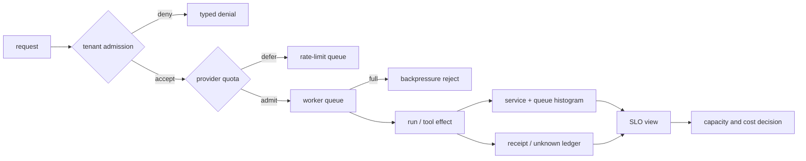
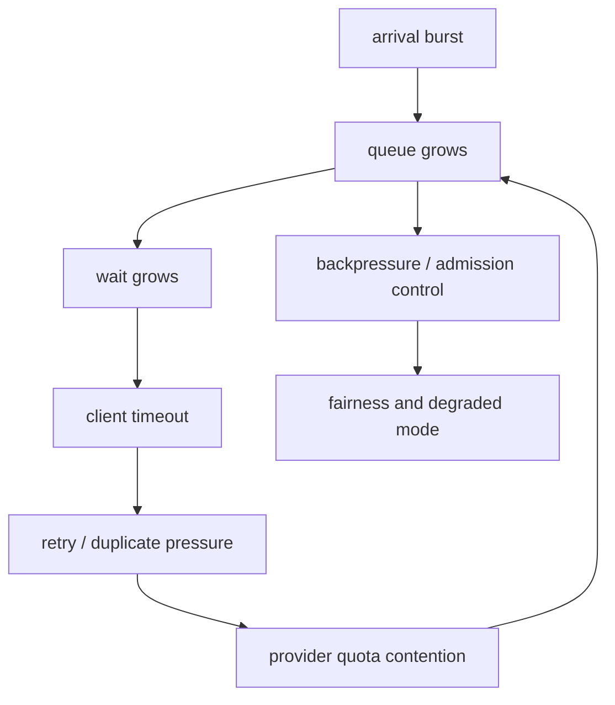
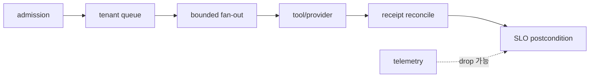
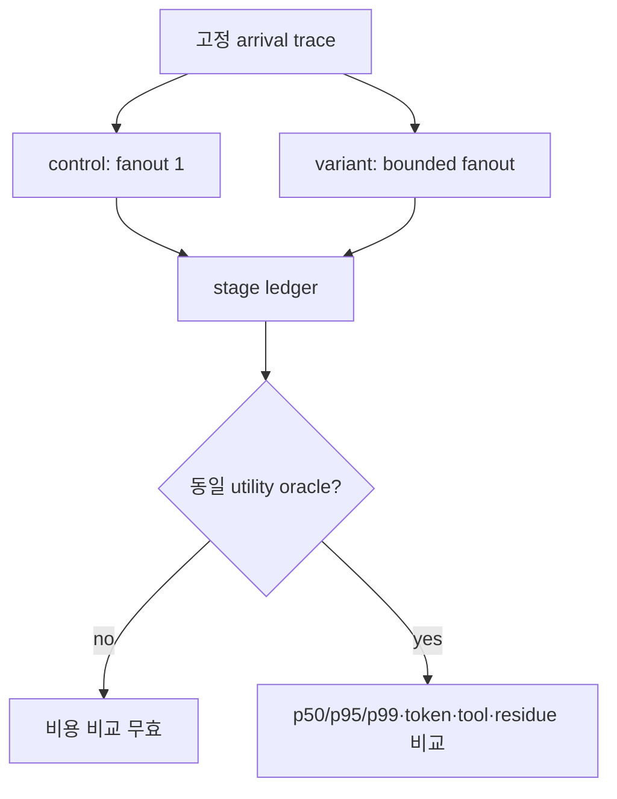

# 34장. 비용·용량·SLO: 빠르게 보이는 시스템과 실제로 견디는 시스템

에이전트 서비스의 비용과 latency는 모델 API 호출 하나로 끝나지 않는다. planner가 요청을 분해하고, worker가 병렬로 tool을 부르고, verifier가 다시 읽고, retry가 provider queue를 밀어 올리며, telemetry가 export queue를 채운다. 성공률만 보면 이 추가 작업은 보이지 않는다. 평균 latency만 보면 가장 늦은 소수의 user와 drain 중 orphan이 보이지 않는다. capacity planning은 “GPU 또는 API quota를 몇 개 사야 하나”보다 먼저 **어떤 요청이 admission되었고, 얼마를 기다렸고, 어디에서 unknown이 되었는가**를 묻는 일이다.

이 장에서는 실측과 시뮬레이션을 엄격히 나눈다. 여기서 소개하는 deterministic load ledger는 admission, provider rate limit, queue backpressure, tenant denial, drain orphan을 재현한다. 시간 값은 `simulated_*_ms`라는 입력값이며 Python이 ledger를 쓰는 local elapsed time은 service latency·tail latency·SLO·error budget에 포함하지 않는다. 이 구분이 없으면 작은 fixture의 숫자가 production p99처럼 떠돌기 시작한다.



## 34.1 SLO는 평균값이 아니라 약속의 경계다

SLO를 만들려면 먼저 SLI event를 정의한다. “요청이 빨랐다”가 아니라, 어느 요청이 eligible이고, start/end가 어디이며, error/unknown이 어떻게 분모에 들어가는지를 정해야 한다. AgentRun에는 final text가 stream되기 전, tool result를 기다리는 중, external effect의 receipt를 reconcile하는 중 등 여러 terminal이 있다. 사용자 응답 latency와 effect completion latency를 하나로 평균 내면 둘 다 설명하지 못한다.

|지표|권장 event 경계|분모|주의할 점|
|---|---|---|---|
|admission latency|request accepted 또는 typed reject|모든 admission attempt|denial을 server error와 혼동하지 않음|
|queue wait|admitted 시각→worker start|실제로 queue에 든 run|queue full reject에는 wait가 없음|
|time to first useful output|request start→정의된 first token/plan|interactive run|stream 시작이 effect success는 아님|
|terminal response latency|start→answer terminal|response contract run|unknown effect를 success로 세지 않음|
|effect reconciliation age|unknown 발생→authoritative disposition|unknown effect|user latency와 별도|
|cost per completed task|model+tool+storage+egress의 명시 범위|completed/typed outcome strata|token만 비용의 전부가 아님|

SLO는 하나의 `p99 < x`가 아니라 error budget policy다. eligibility와 exclusion은 고객에게 불리한 사건을 숨기는 도구가 되면 안 된다. provider rate-limit defer, queue reject, authorization denial, rollout drain orphan은 서로 다른 typed outcome으로 보고한다. 어떤 것이 availability budget에 들어가는지는 product contract가 정하지만, unknown effect를 success로 빼는 것은 통계 기법이 아니라 사실 왜곡이다.

## 34.2 결정론적 부하 ledger가 보여 주는 것

실습 ledger에는 tenant-a 두 개와 tenant-c 한 개만 admission된다. tenant-b는 provider rate limit에 걸린 요청 하나, queue-full backpressure 요청 하나, tenant-a credential을 제시한 cross-tenant denial 하나를 가진다. accepted run의 simulated queue wait는 0/3/6ms이고 service 종료 latency는 4/7ms로 입력되어 있다. drain deadline을 넘긴 `run-c1`은 success/abort가 아니라 orphan `unknown`으로 남고 reconciliation 대상이 된다.

|운영 축|ledger에서 관측한 것|그 관측이 증명하지 않는 것|
|---|---|---|
|tenant admission|일부 요청만 accept|real IdP, namespace isolation|
|provider limit|한 요청 `deferred_provider_rate_limit`|실제 provider quota/429/retry|
|backpressure|queue-full typed reject|pod autoscaling throughput|
|tenant denial|cross-tenant credential 거절|모든 receiver authorization|
|tail rule|eligible 3개 중 breach와 orphan을 구분|production p99/network jitter|
|sampling|selected trace 일부만 보존|exporter durability/collector ingestion|
|rollout drain|deadline 뒤 unknown and reconcile|remote tool cancellation|

여기서 simulated SLO eligible 3개 중 tail breach 하나와 orphan unknown 하나가 있다면 “2/3 소진”은 **fixture policy 아래의 논리적 accounting**이다. 고객 SLA, 실제 availability, monthly error budget burn rate가 아니다. production 수치로 바꾸려면 real traffic timestamp, sampling/dropping denominator, percentile method, deployment revision, region, provider class, retries와 cancellations의 accounting 규칙이 필요하다.

## 34.3 Little의 법칙은 시작점이지 capacity 답안지가 아니다

안정 상태에서 평균 동시 실행 수 `L`, 도착률 `λ`, 평균 체류시간 `W`에는 `L = λW`라는 관계가 있다. 이를 사용하면 각 단계의 concurrency budget을 거칠게 sanity check할 수 있다. 예를 들어 tool wait가 길어지면 동일 arrival rate에서 in-flight run이 늘어난다. 그러나 에이전트 workload는 bursty arrival, heavy-tail service time, fan-out, retry feedback, provider quota, tenant fairness 때문에 평균만으로 제어하기 어렵다.



이 feedback loop에서 retry는 공짜 가용성이 아니다. receipt 없는 timeout 재시도는 duplicate effect 위험도 늘리고 provider contention도 늘린다. speculative branch는 유용한 결과가 필요할 때만 실행하되, 취소 잔여, verifier cost, cache pollution, tool side effect를 비용 ledger에 적는다. “parallel이라 빨랐다”는 말은 branch 수·취소율·adoption rate·winner와 loser의 token/tool spend 없이 불완전하다.

## 34.4 capacity는 공정성과 권한의 문제이기도 하다

global FIFO queue가 항상 공정한 것은 아니다. 긴 context와 느린 provider를 사용하는 tenant가 모든 worker slot을 차지하면, 작은 read-only request가 뒤에 갇힌다. tenant별 concurrency cap, weighted fair queue, class별 budget, bounded queue는 그런 head-of-line blocking을 줄일 수 있다. 그러나 isolation은 score/queue만의 문제가 아니다. cross-tenant resource ID, cache key, trace label, retrieval candidate가 새지 않도록 authorization을 admission 전과 receiver 전 모두에서 검사해야 한다.

|제어|보호하는 것|새로 만드는 trade-off|반드시 기록할 항목|
|---|---|---|---|
|tenant concurrency cap|noisy neighbor|idle capacity가 남을 수 있음|tenant wait/reject rate|
|bounded queue|memory collapse, unbounded wait|즉시 reject 증가|queue depth, reject reason|
|provider token bucket|quota exhaustion|defer/starvation|refill policy, deferred age|
|priority lane|urgent read or recovery|low-priority starvation|priority justification|
|context/tool budget|cost explosion|quality degradation|budget exhaustion type|
|admission policy|unsafe write under overload|user-visible denial|policy revision and principal|

priority는 단순한 performance knob가 아니다. recovery/reconciliation을 우선시하면 unknown effect를 빨리 좁힐 수 있지만, 새로운 interactive user를 늦출 수 있다. write effect를 overload 때 막으면 service score는 내려갈 수 있으나 safety는 올라갈 수 있다. 따라서 business SLO, safety SLO, reconciliation SLO를 한 percent로 합치지 않는다.

## 34.5 비용 ledger: token, tool, cache, 사람의 비용을 분리한다

모델 billing token은 중요한 숫자지만 total cost가 아니다. input/output token, cached token, embedding/retrieval, tool provider fee, storage, egress, observability ingestion, retry, verifier, human escalation을 policy scope 안에서 분리한다. 정확한 금액을 모든 run에 붙일 수 없으면 `unknown_cost_component`를 남긴다. 0으로 채우는 것은 절감이 아니라 누락이다.

|비용 항목|단위 예|누구에게 귀속하는가|왜 별도인가|
|---|---|---|---|
|model inference|tokens, requests, GPU-seconds|planner/worker/verifier|fan-out이 숨어 있음|
|tool execution|calls, seconds, bytes|logical effect|external quota/side effect와 연결|
|retrieval/cache|queries, storage bytes, hit/miss|run+tenant|hit은 authorization proof가 아님|
|retry/reconcile|attempts, lookup calls|unknown outcome|불확실성의 운영 비용|
|telemetry|spans/log bytes, cardinality|service plane|observability delivery가 effect와 다름|
|human escalation|minutes, approval count|risk class|자동화 score에서 사라지기 쉬움|

cache hit로 latency가 내려가도 revision, tenant, principal, policy scope가 다르면 reuse하면 안 된다. cache key에 model revision과 prompt template뿐 아니라 authorization-relevant scope와 source snapshot을 포함할 이유가 여기 있다. cache가 빠르다는 것은 답·권한·effect approval이 아직 유효하다는 뜻이 아니다.

## 34.6 Prometheus와 telemetry: histogram만으로 완결되지 않는다

Prometheus histogram은 tail latency를 집계하기 좋은 도구지만, bucket 경계와 label cardinality가 metric 의미를 만든다. 너무 넓은 bucket은 SLO 경계 근처의 변화를 숨기고, tenant/run ID를 label로 넣으면 cardinality가 폭발한다. trace exemplar는 drill-down을 돕지만 complete join 계약은 아니다. 관측 pipeline의 drop·sampling은 32장에서 본 것처럼 별도의 denominator를 만든다.

운영 대시보드에는 최소한 다음 panel을 나란히 둔다.

1. admitted/deferred/rejected/denied counts를 reason별로 본다.
2. queue wait와 service duration을 별도 histogram으로 본다.
3. unknown effect의 age와 receipt reconciliation success를 본다.
4. model/tool/retry/verifier 비용을 logical call 단위로 본다.
5. sampled trace 수와 durable run 수, exporter drops를 함께 본다.
6. tenant fairness, priority starvation, provider quota depletion을 본다.

## 34.7 실습: 부하 수치에 이름을 붙인다

1. admission을 통과한 요청, rate-limit deferred 요청, queue-full reject 요청, cross-tenant denial을 다른 event type으로 기록한다.
2. queue wait와 service time을 `simulated_*_ms`로 명시하고 local process elapsed time과 섞지 않는다.
3. rollout drain deadline 뒤에는 effect outcome을 `Unknown`으로 남기고 receipt reconciliation queue에 넣는다.
4. trace sampling을 줄여도 raw run ledger의 admitted denominator가 사라지지 않는지 확인한다.
5. p50/p95/p99를 게시하기 전에 sample count, histogram bucket, censoring/timeout 처리, region/provider revision을 함께 게시한다.
6. speculative branch와 retry가 만든 loser cost를 winner request의 비용에서 빼지 않는다.

## 34.8 비보장과 체크리스트

이 장의 deterministic ledger는 Kubernetes, autoscaler, provider, network, real AgentRun을 부하 시험하지 않는다. [Kubernetes controller의 rate-limiting queue 사용](https://github.com/kubernetes/kubernetes/blob/98e9da3000734733127c8ac3bdb77b42ad61c31b/pkg/controller/deployment/deployment_controller.go#L479-L519)은 controller reconciliation의 구현 표면이지 agent service의 throughput 증명은 아니다. simulated 4ms/7ms, 0/3/6ms는 benchmark가 아니다.

* SLO의 분모에 typed denial, timeout, unknown effect를 어떻게 넣는지 계약으로 썼는가?
* queue wait, service duration, reconciliation age, user-visible latency를 다른 metric으로 보이는가?
* admission·tenant isolation·receiver authorization이 서로 다른 layer임을 유지하는가?
* cost report에 retry, speculative loser, verifier, telemetry, human escalation을 숨기지 않는가?
* capacity 실험 결과가 실제 wall-clock 측정인지, controlled simulation인지 모든 chart와 문장에 표시했는가?

좋은 SLO는 숫자를 낮춰 보이게 하는 문구가 아니다. overload와 failure에서 누가 기다리고, 누가 거절되고, 무엇이 미상으로 남으며, 얼마를 더 썼는지를 정직하게 드러내는 운영 계약이다.

### 코드·운영 원전

## 34.9 speculation은 latency를 사는 fan-out 지출이다

독립 branch (n)개를 동시에 실행할 때 첫 성공 latency는 줄 수 있지만 총비용은 대략 다음처럼 늘어난다.

\[
E[C_{trial}]=\sum_{i=1}^{n}P(i\text{가 취소 전 시작})\cdot(C^{token}_i+C^{tool}_i+C^{queue}_i)
\]

취소가 협력적이면 winner가 정해진 뒤에도 이미 시작한 tool과 provider 호출은 계속 비용을 낼 수 있다. 그래서 fan-out budget은 `max_branches`만이 아니라 `max_started_calls`, `max_tokens`, `max_tool_cost`, `cancel_grace_ms`로 쪼갠다.

### queue budget과 SLO

Little의 법칙 (L=\lambda W)에서 (W)를 service time으로만 두면 queue wait가 사라진다. deadline (D)에 대해 admission은 다음을 보수적으로 검사한다.

\[
W_{queue,p99}+W_{service,p99}+W_{reconcile,p99}\le D
\]

partition이나 stale generation 때문에 fail-closed한 요청의 재시도도 새로운 arrival다. 무제한 retry는 회복 중인 cluster에 부하를 되먹임한다. tenant별 retry budget, exponential backoff, jitter, circuit state를 capacity ledger에 포함한다.

| 예산 | 측정 단위 | 초과 시 행동 |
|---|---|---|
| queue | 대기 ms·depth | admission reject 또는 degrade |
| fan-out | 시작 branch·동시 tool | 새 branch 금지 |
| token | input/output tokens | 작은 context·종료 |
| reconciliation | receiver 조회 수·시간 | unknown으로 승격 |
| telemetry | exporter queue·drop | 효과 경로는 계속, 경보 발생 |

### RPO/RTO를 SLO 옆에 둔다

RPO는 “몇 분의 데이터” 하나가 아니다. checkpoint event, receipt, policy generation마다 허용 손실량이 다르다. RTO도 service readiness와 safe reconciliation 완료를 나눈다. 포트가 열렸지만 stale replica와 unknown effect가 남아 있다면 기술적으로 기동했어도 업무 복구는 끝나지 않았다.



## 34.10 stage별 queueing model로 병목을 찾는다

AgentRun을 단일 server로 보지 말고 admission (Q_a), model (Q_m), retrieval (Q_r), tool (Q_t), verifier (Q_v), reconciliation (Q_c) queue의 network로 본다. branch가 갈라지면 한 요청이 여러 visit을 만든다. stage (j)의 평균 visit 수를 (V_j), 한 visit의 service time을 (S_j)라 두면 요청당 수요는 (D_j=V_jS_j)다. 가장 큰 (D_j/m_j)를 가진 stage가 먼저 포화한다.

\[
U_j=\lambda V_j S_j/m_j
\]

평균 utilization이 1보다 작아도 p99는 무너질 수 있다. service time이 heavy-tail이고 fan-out loser가 취소를 늦게 받으면 순간 (V_j)가 커진다. 그래서 stage별로 arrival, started, completed, canceled-but-running, deadline-expired를 따로 센다.

| stage | admission budget | 실행 budget | 포화 시 degrade |
|---|---|---|---|
| model | token estimate·provider quota | concurrent streams | 작은 context·낮은 tier |
| retrieval | candidate k·query count | index concurrency | exact 금지·k 축소가 아닌 read-only fallback |
| tool | authority class·cost ceiling | receiver slots | queue 또는 승인 요청 |
| verifier | evidence count·deadline | parallel checks | unknown, 임의 approve 금지 |
| reconcile | unknown effect count | lookup QPS | bounded backoff·사람 인계 |

### fan-out의 실제 잔여 비용

branch (n)개 중 첫 성공에서 나머지를 cancel해도 이미 시작한 비용은 남는다. branch (i)의 시작 시각 (a_i), cancellation 관측 시각 (c_i), 실제 종료 (z_i)를 기록하면 잔여 면적은 (sum_i(z_i-c_i)^+)다. token streaming, remote job, child process마다 종료 receipt가 다르므로 `cancel_called`을 비용 0으로 계산하지 않는다.

```text
if queue_wait_p99 > queue_budget:
    reject before model/tool allocation
if active_fanout >= tenant.fanout_cap:
    do not start another speculative branch
on winner:
    signal losers
    account until each loser reaches terminal receipt
```

### error budget을 결과 유형별로 태운다

availability SLO에서 `unknown`을 success로 세면 위험이 숨고 error로만 세면 안전하게 멈춘 시스템을 과도하게 벌한다. dashboard는 supported success, policy reject, capacity reject, timeout, provider failure, unknown effect를 분리한다. error budget 정책도 다르다. unknown effect는 즉시 reconciliation capacity를 소비하고, capacity reject는 admission tuning으로, policy reject는 보안 정상 동작으로 간다.

RTO는 `HTTP ready`, `new admission enabled`, `unknown effect reconciled`, `tenant generation converged` 네 시점을 나눠 보고한다. RPO도 event, receipt, telemetry별로 잃은 건수를 쓴다. “15분 만에 복구”라는 한 줄은 어느 경계가 회복됐는지 말하지 못한다.

### capacity 실험 설계



arrival trace, task mix, model revision, cache state, tool latency fixture, utility oracle를 고정한다. throughput을 높이려고 쉬운 request를 더 넣거나 실패한 branch를 denominator에서 빼면 capacity 비교가 아니다. warm-up과 steady state, overload와 recovery를 별도 구간으로 나눈다.

### 운영 진단 질문

- queue depth는 높은데 started rate가 낮다면 semaphore, quota, stuck worker 중 무엇인가?
- provider latency는 정상인데 end-to-end p99가 높다면 queue wait와 loser residue는 얼마인가?
- retry rate가 오른 시점에 unique effect key도 늘었는가, 같은 key lookup이 늘었는가?
- tenant별 utilization과 rejection reason이 global 평균 뒤에 숨지 않았는가?
- exporter drop 때문에 metric denominator가 줄지는 않았는가?
- scale-out 뒤 receiver QPS나 reconciliation queue가 새 병목이 되지 않았는가?

용량 계획의 답은 “worker를 몇 개 띄울까”가 아니다. 어떤 stage에 어떤 권한의 work를 얼마나 들여보내고, deadline 안에 끝나지 않은 work를 어떤 terminal로 정리할지 정하는 일이다.

### 수치 예제: 평균은 충분하지만 tail은 실패하는 경우

초당 8개 요청이 들어오고 요청마다 model visit 2회, 평균 120ms라면 model 수요는 요청당 240ms다. stream slot 4개의 평균 utilization은 (8\times0.24/4=0.48)이다. 이 숫자만 보면 여유롭다. 그러나 요청 5%가 verifier 재호출로 visit 8회를 만들고 tool timeout 뒤 reconciliation까지 점유하면 p99의 visit 수와 체류시간은 평균식에서 사라진다. load ledger에는 visit histogram과 branch별 시작·종료를 남겨야 한다.

autoscaler도 queue depth 하나만 보지 않는다. admission reject가 queue 앞에서 일어나면 depth는 낮은데 수요는 높을 수 있고, provider 429 재시도가 queue를 부풀리면 worker를 늘려도 외부 quota는 늘지 않는다. `eligible arrival`, `admitted`, `started`, `useful terminal`, `unknown residue`를 이어서 봐야 scale 방향을 정할 수 있다.

비용 회고에서는 성공 요청의 단가만 보고하지 않는다. canceled loser, rejected-after-retrieval, stale-policy retry, receipt lookup, 사람 검토에 쓴 비용을 원인별로 붙인다. 그래야 speculation을 줄일지, policy를 앞당길지, receiver 조회를 개선할지 결정할 수 있다.

측정 구간과 통화·단가 revision도 함께 고정한다.

- [Kubernetes HPA의 queue·reconcile 경계](https://github.com/kubernetes/kubernetes/blob/98e9da3000734733127c8ac3bdb77b42ad61c31b/pkg/controller/podautoscaler/horizontal.go#L223-L306)
- [OpenTelemetry BatchSpanProcessor의 queue/export contract](https://github.com/open-telemetry/opentelemetry-specification/blob/29ae8c7710d2ea52e21a5ff81fb1cd657bcd3306/specification/trace/sdk.md#L420-L482)
- [Prometheus instrumentation·cardinality guidance](https://github.com/prometheus/docs/blob/6ee5b68a4660d0b4e7999c9ae8ddb025ca400aef/docs/practices/instrumentation.md#L175-L200)
