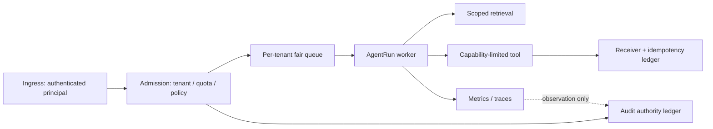
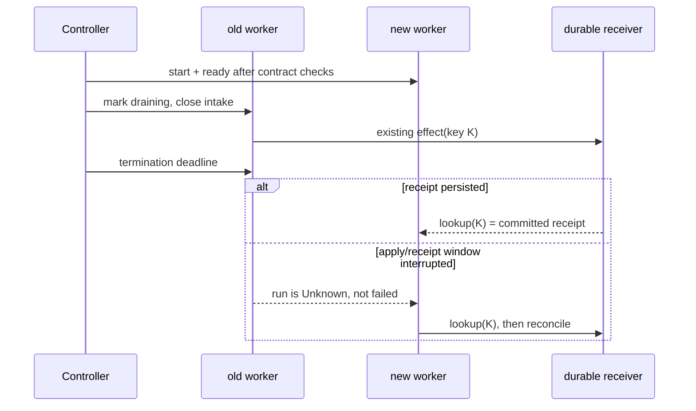
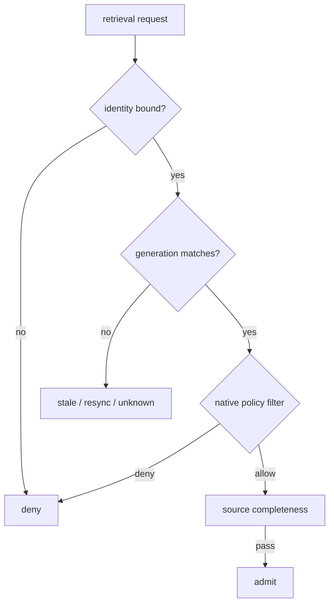
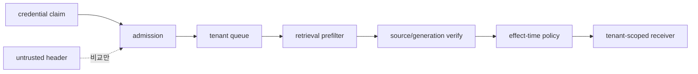

# 35장. 여러 tenant를 한 클러스터에 올릴 때 지켜야 할 경계

멀티 에이전트 서비스를 여러 고객에게 제공할 때 가장 위험한 착각은 pod를 나눴으니 tenant도 나뉘었다고 믿는 일이다. namespace, API key, 벡터 필터, 큐, trace는 서로 다른 경계이며, 어느 하나도 나머지를 자동으로 대신하지 않는다. 이 장의 목표는 고성능 배포 구성을 외우는 데 있지 않다. 요청이 ingress에서 receiver receipt까지 이동하는 동안 **누가 무엇을 읽고, 얼마를 쓰고, 어디에 효과를 남길 수 있는지**를 독립적으로 판정하는 법을 익히는 데 있다.

> **실습 상태 — 설계용 배포 계약.** 이 장의 `kubectl` 명령과 `manifests/*.yaml` 경로는 완성된 배포 패키지가 아니라 독자가 구현해야 할 manifest 계약을 설명한다. 현재 저장소에는 해당 Kubernetes manifest가 없으므로 그대로 실행되는 명령으로 읽지 않는다. 실행 검증을 마친 로컬 fixture는 37–40장에서 별도로 표시한다.

## 35.1 tenant는 문자열이 아니라 권한 있는 실행 좌표다

`tenant_id=acme`라는 label 하나가 있다고 해서 isolation이 생기지 않는다. 그 문자열은 모델 prompt, worker queue, retrieval filter, tool credential, audit record 각각에서 다른 의미를 가질 수 있다. 안전한 설계는 다음 identity 묶음을 요청 최초에 고정하고, 이후 component가 이를 임의로 재해석하지 못하게 한다.

|좌표|질문|바뀌어도 되는가|주된 실패|
|---|---|---|---|
|principal|누구의 자격으로 요청했는가|재인증 때만|사용자와 service account 혼동|
|tenant|어느 데이터·예산·정책 영역인가|실행 중 불가|헤더 신뢰, cross-tenant cache|
|run id|어느 논리 실행인가|불가|재시도마다 새 실행으로 분열|
|policy revision|어느 규칙으로 허용됐는가|재승인 때만|과거 allow 재사용|
|budget lease|얼마나 예약했는가|명시적 갱신만|동시 예약 초과|
|effect scope|어느 receiver·대상·인수인가|digest 변경 시 새 승인|넓은 위임|



그림에서 audit ledger와 telemetry를 분리한 이유가 중요하다. trace에 `tenant=acme`가 찍혔다고 receiver가 acme 권한으로 실행했다는 뜻은 아니다. 반대로 receiver receipt가 있다면 exporter가 trace를 버렸더라도 effect의 권위 있는 기록은 남아 있을 수 있다. 관측은 설명을 돕고, receipt는 상태 변경을 판정한다.

Kubernetes Deployment controller도 객체를 채택하기 전에 cache가 아닌 객체와 UID를 다시 확인한다. controller가 본 이름만으로 소유권을 판단하지 않는 이유는 delete/recreate와 cache staleness 때문이다. 에이전트 서비스도 `tenant_id`가 든 오래된 작업을 새 policy로 실행하기 전 principal, tenant, policy revision, action digest를 다시 검증해야 한다.

## 35.2 격리는 다섯 개의 서로 다른 문제다

|층|보호하려는 것|필수 계약|흔한 오판|
|---|---|---|---|
|인증·인가|호출 주체와 resource|짧은 수명의 audience-bound credential|API key만 tenant 경계라고 생각|
|계산|CPU/GPU·동시성·queue slot|tenant별 admission·fairness·deadline|평균 QPS가 같으면 공정하다고 판단|
|데이터|prompt, memory, vector, artifact|query universe를 먼저 scope|global top-k 후 filter|
|네트워크|tool egress·metadata·control plane|allow-list와 workload identity|namespace가 egress도 막는다고 가정|
|효과|결제·배포·메일·DB write|capability, approval, idempotency, receipt|tool success text를 commit으로 간주|

계산 격리는 model serving과 특히 다른 양상을 보인다. 긴 AgentRun은 단순 request보다 여러 차례 model call, 검색, 승인 대기, tool 실행을 갖는다. token 수만 세면 tool이 기다리는 동안 worker slot을 붙들고 있는 시간을 놓친다. 따라서 admission에는 적어도 `estimated_model_tokens`, `max_tool_calls`, `deadline`, `concurrency_class`, `tenant_credit`가 필요하다. 추정이 틀릴 수 있으므로 reservation은 완전한 요금 청구가 아니라 상한선과 중단 기준이어야 한다.

공정성은 평균 지연이 아니라 tail과 거절 사유에서 드러난다. tenant A의 fan-out이 공유 verifier를 포화시켜 tenant B의 짧은 요청을 막는다면, B의 오류율이 낮아도 서비스는 격리되지 않았다. queue wait를 tenant·priority·stage별로 분해하고, provider 429와 local admission rejection을 같은 `error` 계열로 합치지 않는다.

## 35.3 배포 전 계약: identity, budget, cancellation

새 release를 올릴 때 다음의 세 질문에 답할 수 있어야 한다.

1. drain 중인 worker가 더 이상 새 Run을 claim하지 않는가?
2. 이미 claim한 Run이 deadline까지 끝나지 않으면 누가 orphan으로 기록하는가?
3. tool RPC가 이미 receiver에서 적용된 뒤 pod가 종료되면 새 pod가 무엇을 근거로 복구하는가?

`SIGTERM`은 remote abort가 아니다. intake를 닫고 local task를 취소했다는 사건일 뿐이다. receiver 쪽에 durable idempotency record가 있는지 조회하기 전에는 `Committed`와 `Aborted`를 단정할 수 없다. 이 경계는 롤링 업데이트의 사소한 세부가 아니라 effect safety의 핵심이다.



## 35.4 실습: 두 tenant가 서로의 작업을 굶기지 않는지 확인한다

다음은 product 설치 안내가 아니라, local kind cluster 또는 사내 staging에 맞게 바꿔 쓸 수 있는 운영 runbook의 뼈대다. 실제 namespace와 image digest는 조직 값으로 바꾼다. 임의의 production cluster에 그대로 적용하면 안 된다.

```bash
kubectl create namespace agent-lab
kubectl -n agent-lab apply -f manifests/serviceaccounts.yaml
kubectl -n agent-lab apply -f manifests/networkpolicy.yaml
kubectl -n agent-lab apply -f manifests/agent-api.yaml
kubectl -n agent-lab rollout status deploy/agent-api --timeout=180s
kubectl -n agent-lab get pods -o wide
```

**예상 oracle**은 `rollout status`의 성공 문자열이 아니다. 다음 세 관측을 함께 확보해야 한다.

```bash
kubectl -n agent-lab get endpoints agent-api -o yaml
kubectl -n agent-lab logs deploy/agent-api --since=5m | rg 'admission|draining|receipt'
kubectl -n agent-lab port-forward svc/agent-api 8080:8080
curl -fsS http://127.0.0.1:8080/healthz
```

- 새 revision의 readiness는 schema/policy/receiver connectivity 같은 **계약 검사**를 통과한 뒤에만 true여야 한다.
- tenant A와 B에 동일한 request shape을 보내면 audit record의 tenant, principal, queue class가 각각 유지돼야 한다.
- A의 요청이 거절돼도 B의 request가 A의 memory key, cached retrieval, tool credential을 읽지 않아야 한다.
- draining 시작 후 새 Run claim은 0이고, 남은 Run은 `completed`, `cancelled`, `unknown` 중 하나의 명시적 terminal disposition을 가져야 한다.

테스트 트래픽은 가능한 한 무해한 echo tool과 폐기 가능한 corpus를 사용한다.

```bash
curl -fsS -X POST http://127.0.0.1:8080/runs \
  -H 'content-type: application/json' \
  -H 'x-lab-principal: analyst-a' -H 'x-lab-tenant: tenant-a' \
  --data '{"input":"find lab policy","mode":"read-only"}'
curl -fsS -X POST http://127.0.0.1:8080/runs \
  -H 'content-type: application/json' \
  -H 'x-lab-principal: analyst-b' -H 'x-lab-tenant: tenant-b' \
  --data '{"input":"find lab policy","mode":"read-only"}'
```

환경이 header를 identity source로 신뢰하도록 설정돼 있지 않다면 위 header는 보안 검사가 아니다. 실제 환경에서는 ingress가 검증한 credential의 claim에서 tenant를 결정하고, app header는 단지 untrusted input으로 취급한다.

### fault injection: noisy neighbor와 drain

먼저 A가 branch 20개를 열도록 lab-only feature flag를 켠다. 그 다음 B의 짧은 read-only run을 반복해서 보낸다. A의 throughput이 높은 것보다 B의 `queue_wait` p95, admission outcome, deadline miss가 기준선에서 얼마나 변했는지가 oracle이다.

```bash
kubectl -n agent-lab set env deploy/agent-api LAB_FANOUT_TENANT_A=20
kubectl -n agent-lab rollout status deploy/agent-api --timeout=180s
kubectl -n agent-lab rollout restart deploy/agent-api
kubectl -n agent-lab rollout status deploy/agent-api --timeout=180s
```

restart는 crash-after-apply를 재현하지 않는다. 그것은 대부분의 RPC가 아직 시작되지 않은 지점에서 끝날 수 있다. effect boundary를 시험하려면 receiver가 apply한 뒤 receipt response를 지연시키는 lab stub, 또는 고정 logical call id를 가진 controlled process kill이 필요하다. 종료 뒤의 oracle은 pod가 다시 떴다는 사실이 아니라 receiver lookup에서 `apply_count=1`인지, local ledger가 `Unknown`을 거쳐 같은 key로 reconciliation했는지다.

### cleanup

실습 후 laboratory namespace와 port-forward를 정리한다. production namespace, shared CRD, 실제 customer secret을 지우는 명령은 이 책의 실습 범위가 아니다.

```bash
kubectl delete namespace agent-lab --wait=true
```

## 35.5 배포 검토 체크리스트

- [ ] ingress가 인증된 claim으로 tenant를 정하고, request body/header가 이를 덮어쓰지 못하는가?
- [ ] retrieval, memory, cache, artifact, tool credential의 key가 모두 tenant를 포함하는가?
- [ ] global top-k 뒤 filter의 허용 recall 손실을 계측하거나, query-time scope를 강제하는가?
- [ ] quota·queue·provider limit·GPU concurrency의 거절을 별도 reason으로 남기는가?
- [ ] release readiness가 HTTP 200뿐 아니라 schema/policy/receiver 계약을 검사하는가?
- [ ] drain 중 새 claim을 막고, in-flight Run의 terminal evidence를 보존하는가?
- [ ] cancellation을 effect abort나 rollback의 증거로 사용하지 않는가?
- [ ] trace label에 raw prompt, secret, high-cardinality run id를 넣지 않는가?

## 35.6 이 장이 보장하지 않는 것

이 장의 command와 도식은 Kubernetes가 모든 메모리·GPU·네트워크 side channel을 제거한다고 증명하지 않는다. namespace와 NetworkPolicy는 receiver의 application authorization을 대체하지 않는다. fair queue의 local simulation은 여러 region·provider·shared GPU에서의 공정성을 측정한 결과가 아니다. 또한 receipt가 있는 한 번의 tool은 정확히 한 번의 **업무 의미**를 보장하지 않을 수 있다. 예를 들어 두 개의 서로 다른 logical call이 같은 청구서를 가리키는 business-level duplicate는 receiver의 idempotency schema 밖에 있을 수 있다.

배포를 검토할 때 마지막으로 확인할 항목은 경계의 비용이다. tenant별 queue, index, cache, credential을 늘리면 isolation은 좋아질 수 있으나 운영·메모리 비용도 늘어난다. 반대로 전부 공유하면 평균 utilization은 좋아 보여도 한 tenant의 speculative fan-out, provider retry, cache churn이 다른 tenant의 tail을 지배한다. 따라서 어떤 경계를 물리적으로 분리하고 어떤 경계를 논리 gate로 남길지, 그리고 각각의 침해를 어떤 audit event로 탐지할지를 release design에 명시한다. “우리는 multi-tenant다”는 설명이 아니라, tenant가 어떤 키·큐·credential·receipt namespace에서 다른 tenant와 만나지 않는가가 배포 계약이다.

## 원전 바로가기

## 35.7 tenant 경계에는 generation을 포함한다

`tenant_id=A`만 확인해서는 정책 투영의 시대가 맞는지 알 수 없다. 실제 partition 실험에서 과거 generation `g1`의 allow payload가 격리 replica에 남아 있었고, 연결된 majority는 `g2` deny로 전진했다. generation 조건 없는 native filter는 stale payload를 반환했다. `tenant=A AND policy_generation=g2`로 fence하자 결과가 비어 fail-closed했다. client post-filter는 payload를 받은 뒤 버렸으므로 노출 경계를 이미 넘었다.

\[
Admit(x,u)=tenant(x)=tenant(u)\land policyGen(x)=expectedGen(u)\land valid(x,t)
\]

consistency mode와 generation fence는 서로 대신하지 못한다. 전자는 replica 응답 해소 조건이고 후자는 어떤 정책 snapshot을 요구하는지 정한다.



### tenant별 queue와 fan-out

전역 semaphore 하나는 noisy tenant가 slot을 모두 점유할 수 있다. 최소한 `(tenant queue cap, active-run cap, speculative branch cap, token/tool budget)`을 분리하고 global emergency cap을 겹친다. weighted fairness를 쓰더라도 빈 tenant의 quota 대여와 회수 규칙을 명시한다.

### 배포·복구 postcondition

- [ ] 새 policy generation이 모든 serving replica에서 조회되는가?
- [ ] 오래된 generation query가 deny 또는 typed stale로 끝나는가?
- [ ] 금지 payload가 client post-filter 경계까지 나오지 않는가?
- [ ] tenant별 queue depth와 p99 wait가 quota 안인가?
- [ ] drain 중 새 intake가 닫히고 in-flight effect는 receipt로 reconcile되는가?
- [ ] 복구 선언 전에 peer별 visible generation과 ID 집합을 비교했는가?

## 35.8 tenant 좌표를 모든 key에 전파한다

tenant isolation은 API 입구의 `tenant_id` 검사로 끝나지 않는다. cache, queue, checkpoint, idempotency, vector payload, trace lookup, object-store prefix까지 같은 좌표를 가져야 한다. 안전한 key는 보통 다음 tuple의 digest다.

\[
K=H(tenant,principal,resource,policyGen,schemaRev,logicalCall)
\]

모든 구성요소가 tuple 전체를 저장할 필요는 없지만 생략한 필드가 충돌과 재사용에 어떤 영향을 주는지 문서화한다. 특히 global idempotency key는 tenant A와 B의 우연히 같은 주문 번호를 한 효과로 합칠 수 있고, tenant 없는 cache key는 검색 결과를 교차 노출할 수 있다.

```text
admission(request):
    identity = verify_credential(request.credential)
    reject if request.tenant_hint != identity.tenant
    snapshot = policy_store.current(identity.tenant)
    budget = quota.reserve(identity.tenant, request.cost_upper_bound)
    enqueue(key=(identity.tenant, request.priority),
            expected_policy_generation=snapshot.generation)

before_effect(work):
    current = policy_store.current(work.tenant)
    reject STALE if current.generation != work.expected_generation
    receiver.apply(key=tenant_scoped_effect_key(work), fence=work.fence)
```

### generation rollout은 dual-read보다 명확한 상태 기계가 필요하다

정책이나 embedding generation을 바꿀 때 old/new를 동시에 읽는 기간이 생긴다. 이때 결과를 무조건 합치면 철회된 문서와 새 문서가 함께 후보가 된다. rollout 상태를 `Building → Shadow → Required → Retired`로 두고 각 상태의 read/write 규칙을 정한다.

| 상태 | write | read/admit | rollback |
|---|---|---|---|
| Building | new 생성, old 유지 | old만 권위 | new 폐기 가능 |
| Shadow | 양쪽 비교 | old만 effect 허용 | divergence 기록 |
| Required | new generation fence | new만 허용 | policy 승인된 downgrade만 |
| Retired | old tombstone | old 즉시 stale | 재생성 절차 필요 |

실제 격리 replica 반례에서는 generation 없는 native filter가 오래된 allow payload를 반환했다. generation을 predicate에 넣자 빈 결과로 닫혔다. 빈 결과는 최신 deny인지 아직 동기화되지 않은 것인지 typed reason으로 구분한다.

### 보안 경계 시험



시험은 happy path 두 개보다 충돌 fixture가 중요하다. 같은 resource ID, 같은 cache digest, 같은 logical call suffix를 두 tenant에 넣고 store의 composite unique key가 분리하는지 확인한다. tenant A의 trace ID로 B의 audit endpoint를 조회하고 404/deny shaping이 존재를 누출하지 않는지도 본다. metric label에는 raw tenant/user를 넣지 말고 bounded tier를 쓰며 상세 조인은 접근 통제된 ledger에서 한다.

### noisy neighbor의 네 자원

CPU/GPU 시간만 제한해서는 부족하다. model token, tool concurrency, storage/embedding write, reconciliation lookup을 각각 quota로 둔다. A가 speculative branch를 많이 열어 verifier를 포화시키면 B의 model quota가 남아도 지연된다. hierarchical scheduler는 global cap 아래 tenant cap, 그 아래 priority/class cap을 둔다.

\[
admit_t \iff active_t<c_t\land queued_t<q_t\land credits_t\ge estimate(request)
\]

estimate가 실제보다 작으면 실행 중 budget exhaustion을 typed terminal로 남기고 새 외부 효과를 시작하지 않는다. 실제보다 크면 unused reservation을 반환한다. 예약 실패를 provider error나 policy deny와 같은 error로 합치지 않는다.

### incident 때 확인할 순서

1. credential에서 확정한 tenant와 application hint가 같은가.
2. queue key·cache key·retrieval filter·effect key에 tenant가 유지되는가.
3. expected와 observed policy generation이 같은가.
4. native filter 이전에 금지 payload가 어느 process까지 도달했는가.
5. peer별 visible generation과 consistency mode가 무엇인가.
6. drain worker의 old fence write가 receiver에서 거절됐는가.
7. cleanup이 synthetic tenant scope 밖의 record를 건드리지 않았는가.

multi-tenant 안전성은 namespace 개수로 평가하지 않는다. identity가 파생 데이터와 외부 효과까지 끊기지 않고 흐르며, 오래된 generation과 owner가 마지막 receiver에서 거절되는지를 본다.

### backup·restore도 tenant 경계 시험이다

backup은 정상 serving path를 우회해 여러 tenant의 record를 한 artifact에 모을 수 있다. restore할 때 오래된 policy generation과 fencing counter까지 되살리면 이미 retire된 권한이 재등장한다. 복구 절차는 tenant별 restore scope, encryption key, generation floor, current fence를 다시 확인해야 한다. 운영자가 tenant A만 복구한다고 요청했는데 shared cache·vector namespace·receipt table 전체가 돌아오면 격리 실패다.

offboarding 역시 delete API 한 번으로 끝나지 않는다. primary row, derived embedding, cache, checkpoint, audit retention, backup disposition을 lifecycle 표로 관리한다. 법적 보존이 필요한 audit과 즉시 삭제해야 할 serving data를 같은 정책으로 묶지 않는다. deletion 완료 receipt에는 범위와 제외된 보존 항목을 적고, 검색 결과와 receiver 조회에서 해당 tenant가 사라졌는지 postcondition을 검사한다.

- [Kubernetes Deployment controller: ownership 재검증](https://github.com/kubernetes/kubernetes/blob/98e9da3000734733127c8ac3bdb77b42ad61c31b/pkg/controller/deployment/deployment_controller.go#L521-L545)
- [Kubernetes NetworkPolicy API](https://github.com/kubernetes/kubernetes/blob/98e9da3000734733127c8ac3bdb77b42ad61c31b/staging/src/k8s.io/api/networking/v1/types.go#L30-L156)
- [Kubernetes rolling update와 availability bounds](https://github.com/kubernetes/kubernetes/blob/98e9da3000734733127c8ac3bdb77b42ad61c31b/staging/src/k8s.io/api/apps/v1/types.go#L416-L520)
- [Temporal worker shutdown의 intake·drain 경계](https://github.com/temporalio/sdk-go/blob/213f751d5117fd5621ef6dd55a21b78d605c9696/internal/internal_worker_base.go#L899-L929)
- [Kubernetes HPA의 queue deduplication](https://github.com/kubernetes/kubernetes/blob/98e9da3000734733127c8ac3bdb77b42ad61c31b/pkg/controller/podautoscaler/horizontal.go#L276-L306)
