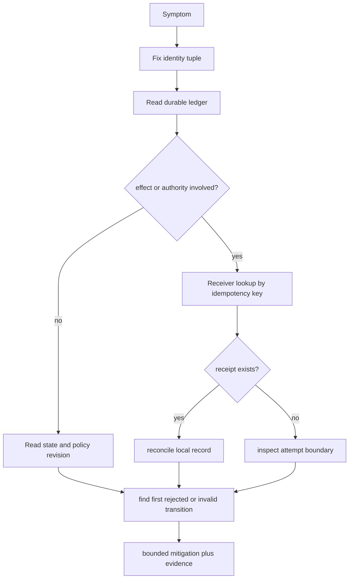
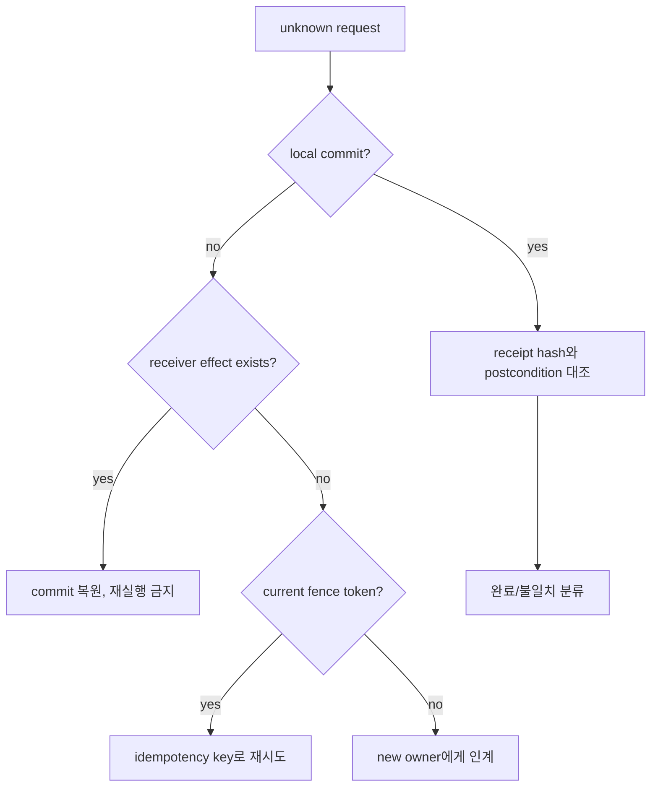
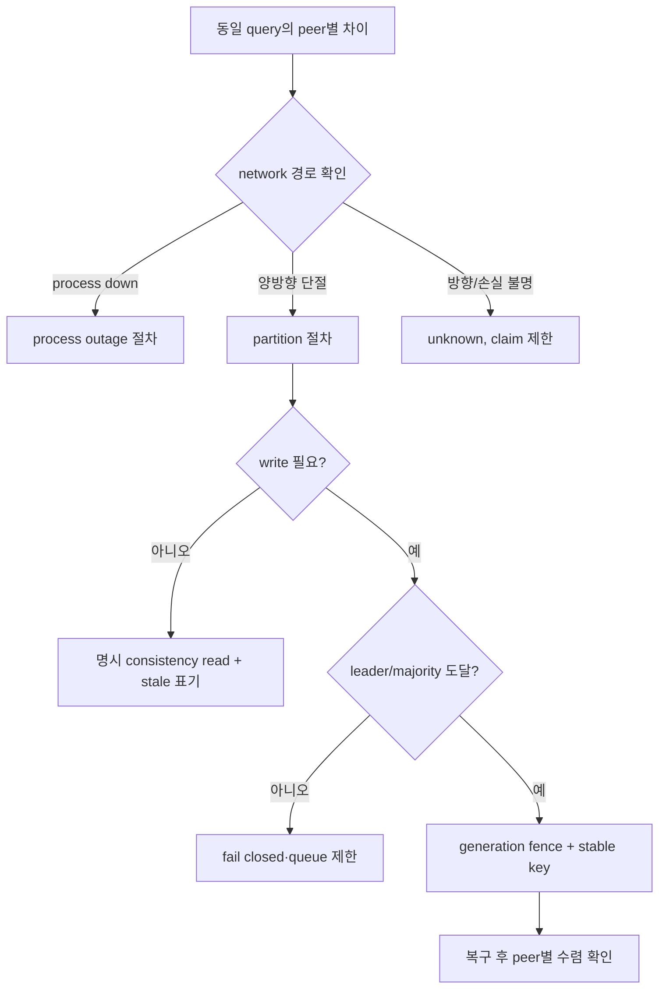

# 36장. 에이전트 서비스 운영: 증상 대신 최초 계약 위반을 찾는다

운영자는 “응답이 느리다”, “도구가 두 번 실행됐다”, “모델이 이상한 답을 냈다”라는 증상으로 출발한다. 하지만 AgentRun은 model call, memory read, retrieval, approval, tool attempt, receiver receipt, retry, exporter를 잇는 긴 실행이다. 최종 텍스트만 보고 원인을 찾으면 가장 눈에 띄는 component를 고치게 된다. 이 장의 playbook은 사건을 **최초로 깨진 계약**까지 거슬러 올라가는 방법이다.

## 36.1 먼저 문장을 멈추고 identity를 모은다

장애 티켓이 들어오면 prompt 전문이나 모델 로그부터 복사하지 않는다. 민감 정보를 넓히고, 정작 재시도·fan-out·worker handoff를 잇는 key를 잃기 쉽다. 최소한 아래 좌표를 protected audit store에 보존한다.

|필드|역할|없는 경우 생기는 착시|
|---|---|---|
|RunID|사용자 실행 계보|같은 대화의 다른 attempt 혼합|
|AttemptID|특정 worker/model/tool 시도|retry를 duplicate로 오인|
|LogicalCallID|사용자 의도의 논리 작업|timeout 뒤 새 side effect 생성|
|IdempotencyKey|receiver dedup key|apply 횟수 판정 불가|
|State/Policy revision|결정 당시 세계의 version|stale 승인과 현재 정책 혼동|
|TraceID|관측 join 보조키|유실된 trace를 absence로 오판|
|ReceiptID|권위 있는 효과 증거|HTTP 200을 commit으로 오인|



이 순서는 trace가 사라진 상황에서도 작동한다. telemetry는 sampling, queue overflow, redaction, exporter retry로 일부가 빠질 수 있다. 반면 receipt ledger와 policy decision은 안전 계약을 위해 별도로 durable해야 한다. 둘을 모두 잃었다면 시스템은 성공/실패를 꾸며내지 말고 `Unknown`으로 승격해 human reconciliation으로 넘겨야 한다.

## 36.2 증상별 첫 질문

|증상|가장 먼저 묻는 질문|그 다음 oracle|성급한 처방|
|---|---|---|---|
|p99 증가|queue wait인가, model/tool service time인가|stage별 histogram|worker 수만 증가|
|중복 효과|같은 logical call/key의 receiver apply count는|durable receipt·dedup row|새 retry key 발급|
|권한 없는 답|후보가 들어왔나, admission이 잘못됐나|candidate/admission ledger|retriever score 조정|
|낡은 실행|승인·state·tool schema revision은|commit 직전 recheck|cache TTL만 축소|
|trace 단절|sampling/export failure인가, 실행 중단인가|ledger와 exporter health|trace 없음=실패|
|queue 폭주|tenant별 arrival/service/cancel은|admission reason·queue age|전역 concurrency 상향|

이 표는 어떤 component가 범인이라고 선언하지 않는다. p99가 올랐을 때 model latency가 평균적으로 정상이어도 fan-out loser가 cancel되지 않아 verifier queue를 막을 수 있다. 반대로 provider 429가 늘어도 local scheduler가 deadline 없는 재시도를 무한히 만들고 있을 수 있다. “rate limit”은 관측된 결과이지 원인 위치가 아니다.

## 36.3 SLI는 결과와 경계를 함께 측정한다

에이전트의 성공률 하나는 너무 거칠다. final answer가 문자열 기준으로 통과해도 read scope가 틀렸거나 effect reconciliation이 남아 있을 수 있다. 최소한 다음 계열을 분리한다.

|지표|분자/분모|왜 필요한가|주의|
|---|---|---|---|
|admission rejection|reason별 rejected / submitted|과부하와 정책 거절 구분|거절이 항상 나쁜 것은 아님|
|queue wait|admitted→claimed 시간|noisy neighbor·backpressure|평균 대신 p95/p99|
|useful completion|supported terminal / admitted|단순 text completion과 구분|support predicate를 명시|
|unknown effect|unreconciled effect / effect attempts|위험한 단정 감시|0을 위해 Unknown을 숨기지 말 것|
|receiver dedup hit|dedup receipt / receiver calls|retry 폭발 탐지|정상 재전송도 있음|
|unique evidence yield|admissible dedup evidence / branch|fan-out 낭비|candidate 수로 대체 금지|
|telemetry loss|dropped/export-failed / created spans|관측 공백의 크기|effect 발생률 아님|

Prometheus 문서는 label 조합이 time series를 곱셈으로 늘린다고 경고한다. 따라서 RunID, user ID, raw tool argument를 metric label에 넣지 않는다. 그런 값은 access-controlled trace/log 또는 audit store의 structured field로 보내고, metric에는 bounded reason enum, tenant tier 같은 제한된 cardinality만 쓴다. 관측을 늘리려다가 monitoring system 자체를 장애 원인으로 만들지 않는 것이 첫 번째 운영 원칙이다.

## 36.4 실습: incident packet을 만든다

아래 명령은 가상의 API가 `/admin/runs/{run}`와 receiver query endpoint를 제공한다고 가정한다. 실제 endpoint 명칭과 인증 방식은 조직의 control plane 계약을 따라야 한다.

```bash
export RUN_ID='lab-run-20260901-001'
curl -fsS "http://127.0.0.1:8080/admin/runs/${RUN_ID}" > run.json
jq '{runId, stateRevision, policyRevision, attempts, logicalCalls}' run.json
jq '.logicalCalls[] | {logicalCallId,idempotencyKey,disposition,receiptId}' run.json
```

이 단계의 **expected oracle**은 “JSON이 나왔다”가 아니라 다음 조건이다. 한 logical call의 모든 attempt가 하나의 stable idempotency key로 이어져야 한다. terminal `Committed`에는 receiver-issued receipt가 있어야 한다. worker 종료와 network timeout은 receipt가 없으면 `Unknown` 또는 `PendingReconciliation`으로 남아야 한다. answer-support trace에는 tenant, policy revision, source revision이 있으나 secret 원문은 없어야 한다.

receiver의 권위 있는 상태를 따로 조회한다.

```bash
export IDEMPOTENCY_KEY='lab-key-001'
curl -fsS "http://127.0.0.1:8081/receipts/${IDEMPOTENCY_KEY}" | jq .
```

`apply_count: 1`과 durable `receipt_id`가 있으면 local worker가 죽었어도 효과 자체는 commit된 것이다. 반대로 HTTP timeout만 있고 receiver query가 “unknown key”면 retry 가능 여부는 receiver 계약에 달려 있다. 이 경우에도 key를 바꾸어 새 effect로 보내기 전에 logical call의 대상과 business invariant를 다시 비교한다.

### fault injection 1: exporter가 trace를 잃는다

lab 환경에서 exporter endpoint를 잠시 막거나 queue limit을 작게 설정한다. 도구 실행과는 분리된 read-only run을 보낸 뒤, trace backend에는 span이 없더라도 audit ledger와 receiver 상태가 정상인지 비교한다.

```bash
kubectl -n agent-lab scale deploy/otel-collector --replicas=0
# read-only run을 생성하고 queue/admission/audit record를 확인한다.
kubectl -n agent-lab scale deploy/otel-collector --replicas=1
```

oracle은 exporter 복구 뒤 “빠졌던 span이 마술처럼 생겼다”가 아니다. collector down 동안의 telemetry loss counter와 `trace_missing=true` 같은 bounded disposition을 남기고, 효과의 진실값은 ledger에서 독립적으로 조회할 수 있어야 한다.

### fault injection 2: stale approval

승인 후 commit 전에 lab state revision을 하나 올린다. tool worker는 과거 approval을 재사용하지 말고 `stale_approval`으로 거절하거나 재승인을 요구해야 한다. 여기서 모델을 다시 호출해 같은 문장을 얻었다는 것은 oracle이 아니다. action digest, target, current state revision이 모두 다시 확인됐는지가 oracle이다.

### fault injection 3: queue가 deadline을 넘긴다

tenant A의 work class에 느린 mock tool을 넣고, tenant B에는 짧은 read-only job을 넣는다. B의 deadline 초과를 worker CPU 사용률로만 설명하지 말고 admission timestamp, queue entry, claim, cancel, final reason을 차례로 읽는다. cancel된 job이 이미 receiver에 도달했을 가능성은 separate effect lookup이 없이는 제거되지 않는다.

### cleanup

fault flag를 원래 값으로 되돌리고, test run과 disposable receipt를 purge하기 전에 필요한 audit export를 보관한다. cleanup은 진실을 지우는 절차가 아니라 다음 실험이 과거 상태에 오염되지 않게 하는 절차다.

```bash
kubectl -n agent-lab set env deploy/agent-api LAB_FAULT_MODE-
kubectl -n agent-lab rollout status deploy/agent-api --timeout=180s
rm -f run.json
```

## 36.5 incident의 종료 기준

장애를 “대시보드가 녹색”일 때 닫으면 같은 오류가 다음 deploy에서 재발한다. 종료 packet에는 최소한 다음이 있어야 한다.

- 사건 범위: 영향 받은 tenant, RunID 범위, 시작·종료 시각, 외부 효과 종류
- 최초 위반: 어느 transition이 어떤 invariant를 만족하지 못했는가
- 권위 있는 판정: receipt, policy decision, state revision 중 무엇이 verdict를 냈는가
- 완화: admission cap, circuit breaker, rollback, human reconciliation 중 무엇을 언제 적용했는가
- 검증: 같은 fault를 staging에서 재현했을 때 어떤 oracle이 통과했는가
- 남은 비보장: telemetry gap, external receiver query 범위, migration 중 orphan 등

## 36.6 운영 체크리스트

- [ ] RunID·AttemptID·LogicalCallID·idempotency key를 같은 값으로 축약하지 않는가?
- [ ] timeout/cancel/trace loss와 remote abort/commit을 구별하는가?
- [ ] effect의 terminal verdict는 receiver receipt 또는 명시적 receiver query에서 오는가?
- [ ] SLI가 queue·provider·policy·retrieval·effect reason을 분리하는가?
- [ ] high-cardinality 또는 secret을 metric label로 보내지 않는가?
- [ ] rollback 이전에 in-flight work의 state와 effect reconciliation plan을 기록하는가?
- [ ] unknown을 failure rate에서 숨기지 않고 별도 운영 항목으로 다루는가?

## 36.7 이 playbook이 보장하지 않는 것

이 절차가 model output의 사실성, receiver 밖의 부수 효과, compromised audit store, clock drift 없는 global ordering까지 보장하는 것은 아니다. trace sampling 비율을 높인다고 모든 사고가 보이는 것도 아니다. 운영의 목적은 모든 불확실성을 제거하는 데 있지 않다. 불확실한 상태를 성공이나 실패로 위장하지 않고 적절한 소유자에게 넘기는 데 있다.

### 교대 근무자를 위한 10분 triage

긴 postmortem 전에도 적용할 수 있는 짧은 순서가 있다. 첫 2분에는 영향을 받은 tenant와 RunID 범위를 고정한다. 다음 3분에는 queue/admission reason과 현재 rollout revision을 본다. 이어서 effect가 있으면 receipt lookup을 먼저 하고, 없으면 policy/state revision과 candidate admission을 읽는다. 마지막 5분에는 완화를 시행하기 전에 `Unknown` 수가 늘어나는지, retry가 새 key를 만들고 있지 않은지, exporter loss가 단순 관측 공백인지 확인한다. 이 순서는 원인을 확정하는 절차가 아니라, 되돌리기 어려운 중복 실행과 무분별한 rollback을 막는 안전장치다.

교대 인수인계에는 “조치 없음”도 기록한다. receiver가 응답하지 않아 Unknown을 유지하기로 했다면, 다음 담당자가 같은 key를 새 effect로 재전송하지 않도록 retry budget, 다음 lookup 시각, escalation owner를 남긴다. 운영에서 무언가를 하지 않은 이유는 결과가 아니라 권한의 경계에 관한 중요한 증거다.

incident record는 blame을 위한 문서가 아니다. 동일한 input과 fault에서 다음 교대자가 같은 oracle을 재검사할 수 있게 하는 재현 패키지다. 그래서 raw 대화 전문보다 identity tuple, revision, receipt, 거절 사유, 변경 시각이 먼저다.

### cancel 경보의 네 줄 packet

취소율이 급증했다고 곧바로 worker를 재시작하지 않는다. 취소 관측에는 네 가지 독립 channel이 있으므로, incident packet에도 네 줄을 분리해 넣는다.

|줄|필수 필드|판정|
|---|---|---|
|control|request ID, accepted time, protocol task state|요청이 수락됐는가|
|handler|attempt ID, cancellation observed phase, deadline|협조적 실행이 실제 멈췄는가|
|telemetry|trace disposition, exporter/collector/scrape health|무엇이 보이지 않는가|
|effect|logical key, receiver lookup, receipt ID|외부 변화가 있었는가|

MCP timeout notification, A2A task `CANCELED`, OpenTelemetry span error, Prometheus scrape failure는 이 네 줄 중 서로 다른 줄에 적힌다. 하나의 줄이 누락됐다고 다른 줄을 추론하지 않는다. 특히 `CANCELED`와 `receipt_present`가 함께 보이면 rollback이 아니라 `committed_before_cancel` incident로 분류하고, 보상이 필요하면 새 logical call로 승인·receipt를 남긴다.

## 36.8 partition·unknown effect 통합 incident playbook

재현 실험의 사후조건은 [37장](37-minimal-agentrun-golden-lab.md), 조정 계층의 CAS·fencing은 [38장](38-multiagent-coordination-lab.md), 검색에서 effect까지의 admission은 [39장](39-retrieval-permission-effect-lab.md), 실행 가능한 회귀 테스트는 [40장](40-crash-recovery-deployment-lab.md)에서 이어진다.

### 0–5분: 쓰기를 더 만들지 않는다

1. tenant와 effect 종류별로 admission을 제한한다.
2. 자동 retry와 speculative fan-out을 bounded mode로 낮춘다.
3. topology, peer health, consistency mode, expected policy generation을 캡처한다.
4. telemetry가 비어도 “실행 없음”으로 결론 내리지 않는다.

### 5–15분: 증거원을 세 갈래로 읽는다

| 증거원 | 답하는 질문 | 답하지 못하는 질문 |
|---|---|---|
| durable event/checkpoint | 로컬 결정이 commit됐나 | receiver가 적용했나 |
| receiver postcondition/receipt | 외부 효과가 존재하나 | caller가 응답을 받았나 |
| trace/metric/log | 경로와 시간은 어땠나 | effect의 최종 진실 |

partition이 의심되면 단순 ping보다 peer별 동일 query를 지정 consistency로 실행한다. Qdrant의 [read result 해소 코드](https://github.com/qdrant/qdrant/blob/af875b4bfd98103f7c0ee34fe4f25c5099893ca9/lib/collection/src/shards/replica_set/execute_read_operation.rs#L83-L108)처럼 mode에 따라 필요한 응답 수가 다르므로 status만 비교하지 않는다.

### 15분 이후: typed recovery



### 복구 종료 조건

- peer별 visible ID와 policy generation이 기대 snapshot으로 수렴했다.
- old fencing token write가 실제로 거절된다.
- unknown effect가 receiver 조회로 0건이거나 명시된 repair queue에 있다.
- exporter가 회복됐으며 telemetry gap 자체가 incident artifact로 남았다.
- queue depth와 retry rate가 steady-state budget 아래다.
- RPO 손실량과 safe-reconciliation RTO를 숫자로 보고했다.

### 되풀이를 막는 재현 패키지

binary commit, 포트와 topology, shard/replication 설정, fault 시작·해제 시각, peer별 raw response, effect key, receipt, generation, cleanup 결과를 보존한다. process 종료 실험을 packet partition이라고 부르거나, 양방향 격리를 비대칭 손실이라고 부르지 않는다. fault 종류를 정직하게 적어야 다음 실행의 비교가 성립한다.

## 36.9 partition incident를 결정 트리로 다룬다

partition 경보가 뜨면 먼저 control plane과 data plane을 나눈다. membership API가 실패해도 기존 replica read는 성공할 수 있고, health endpoint가 살아 있어도 strong update leader에 닿지 못할 수 있다. 다음 질문은 “cluster가 살아 있는가”가 아니라 “어떤 consistency·ordering·generation의 어떤 operation이 어느 peer에서 어떤 postcondition을 냈는가”다.



Qdrant v1.19.0의 [read result 해소 경로](https://github.com/qdrant/qdrant/blob/af875b4bfd98103f7c0ee34fe4f25c5099893ca9/lib/collection/src/shards/replica_set/execute_read_operation.rs#L83-L108)는 consistency에 따라 필요한 성공 수와 resolve 조건을 달리한다. 실제 격리 실험에서 factor-1 read와 `all` read가 다른 status를 낸 이유다. operator가 client 기본값을 모르면 같은 endpoint의 200/500 차이를 설명할 수 없다.

### 첫 10분에 캡처할 packet

| 범주 | 필드 | 이유 |
|---|---|---|
| topology | peer ID, address, shard role, leader | 잘못된 fault 명명 방지 |
| request | method, ordering, consistency, timeout | API 의미 복원 |
| data | collection/source/policy generation | stale와 divergence 분리 |
| effect | logical key, attempt, fence, receipt | duplicate 방지 |
| capacity | queue depth, retry, fan-out residue | recovery storm 방지 |
| telemetry | created/exported/dropped counts | 관측 공백 정량화 |

raw payload에 secret이 있으면 allowlist로 redaction하되 digest와 길이, 제거 이유를 남긴다. redacted null을 데이터 부재로 읽지 않는다.

### 명령보다 postcondition을 먼저 쓴다

```text
freeze: 새 irreversible effect admission 중단
observe: peer별 동일 read와 membership 캡처
fence: current tenant/policy/lease generation 고정
reconcile: unknown effect를 receiver key로 조회
heal: fault 제거, membership 안정 대기
verify: visible IDs·generation·receipt·queue residue 비교
resume: 작은 cohort부터 admission 재개
```

`restart all`이 이 절차를 대신할 수는 없다. leader 배치와 memory 상태를 바꿔 증거를 지우고 retry storm을 만들 수 있다. restart가 필요하면 한 번에 하나씩, before/after manifest와 unknown-effect 수를 기록한다.

### RPO/RTO 결산표

| 시점 | 측정 | 종료 조건 |
|---|---|---|
| detect | 최초 이상→경보 | false positive 분류 포함 |
| contain | 경보→위험 admission 중단 | 새 unknown 증가 0 |
| service restore | safe read/write 재개 | cohort SLO 충족 |
| data converge | peer generation/IDs 일치 | stale replica 0 |
| effect reconcile | unknown receipt 판정 | repair queue 소유자 확정 |

RPO는 lost event, missing receipt, stale generation에서 각각 건수로 낸다. telemetry gap은 effect RPO와 별도다. RTO도 포트 readiness가 아니라 위 표의 여러 시점으로 보고한다.

### 재발 방지 검토

- client가 consistency를 body가 아닌 올바른 query option으로 전달했는가?
- leader가 격리된 경우와 follower가 격리된 경우를 각각 시험했는가?
- process outage와 packet partition runbook이 분리돼 있는가?
- native tenant filter에 expected generation이 함께 들어가는가?
- post-filter 전에 금지 payload가 노출되지 않는가?
- retry controller가 stable effect key와 receiver lookup을 쓰는가?
- exporter down 중에도 incident verdict를 durable ledger로 낼 수 있는가?
- recovery convergence 뒤 fault rule과 child process가 모두 제거됐는가?

좋은 runbook은 명령을 모아 두는 문서가 아니라, 추론의 순서를 고정하는 문서다. 사람이 바뀌어도 같은 증거에서 같은 `Committed`, `Rejected`, `Unknown` 판정을 내게 만드는 것이 목표다.

### 교대 시 handoff packet

교대자는 “아직 조사 중”이라는 문장보다 현재 generation, 격리된 peer, 중단한 admission class, unknown effect key 수, 다음 안전한 command와 금지 command를 받아야 한다. 각 판단에는 timestamp가 아니라 근거 artifact와 owner를 붙인다. receiver 조회가 완료되지 않았다면 성공률 그래프가 회복돼도 incident를 닫지 않는다.

복구 중 임시 완화책에는 expiry를 둔다. consistency를 낮춘 read, fan-out cap 축소, 특정 tenant read-only 전환, exporter sampling 변경이 영구 설정으로 굳지 않게 owner와 자동 만료 시각을 기록한다. 만료 때 상태가 안전하지 않으면 조용히 연장하지 말고 다시 승인한다.

사후 회고는 “network 문제”에서 멈추지 않는다. 왜 generation 없는 query가 허용됐는지, 왜 retry가 receiver lookup보다 먼저였는지, 왜 dashboard 공백이 effect absence로 읽혔는지를 control gap으로 바꿔 regression trial에 추가한다.

incident commander와 effect owner도 분리할 수 있다. commander는 containment와 communication을 조정하지만 결제·배포 같은 업무 효과의 재실행 권한을 자동으로 얻지 않는다. 재실행 승인에는 현재 policy, action digest, receiver postcondition이 다시 필요하다. status page에 쓰는 사용자 문장도 `지연`, `거절`, `결과 확인 중`을 구분해 아직 모르는 효과를 실패나 성공으로 단정하지 않는다.

## 원전 바로가기

- [OpenTelemetry SDK sampling 결정 시점](https://github.com/open-telemetry/opentelemetry-specification/blob/29ae8c7710d2ea52e21a5ff81fb1cd657bcd3306/specification/trace/sdk.md#L288-L346)
- [OpenTelemetry span limits](https://github.com/open-telemetry/opentelemetry-specification/blob/29ae8c7710d2ea52e21a5ff81fb1cd657bcd3306/specification/trace/sdk.md#L117-L171)
- [Prometheus label cardinality 지침](https://github.com/prometheus/docs/blob/6ee5b68a4660d0b4e7999c9ae8ddb025ca400aef/docs/practices/instrumentation.md#L175-L200)
- [Pi telemetry memory exporter](https://github.com/badlogic/pi-mono/blob/853a80d26c90a14c1886f0ebb8ffaae133ca2185/packages/telemetry/src/memory.ts#L120-L184)
- [Codex session telemetry event 구조](https://github.com/openai/codex/blob/0344625ccf4ae0ab6472c6c1e7b4ace6af14661e/codex-rs/otel/src/events/session_telemetry.rs#L517-L555)
