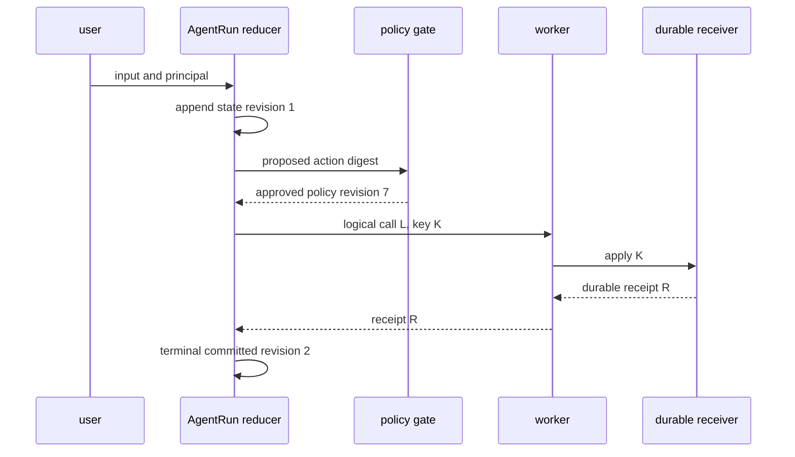
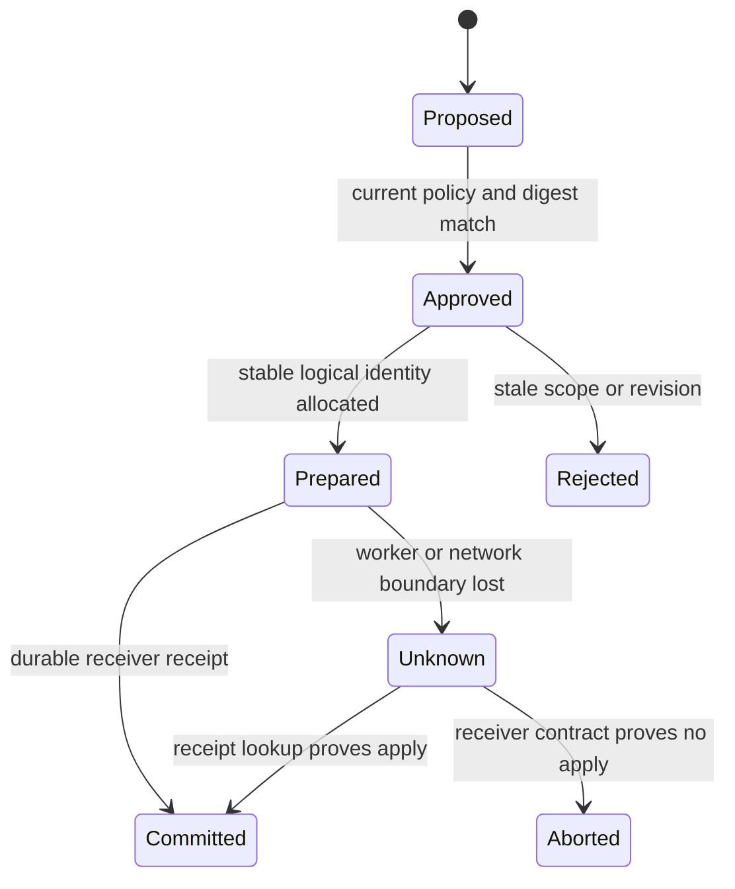
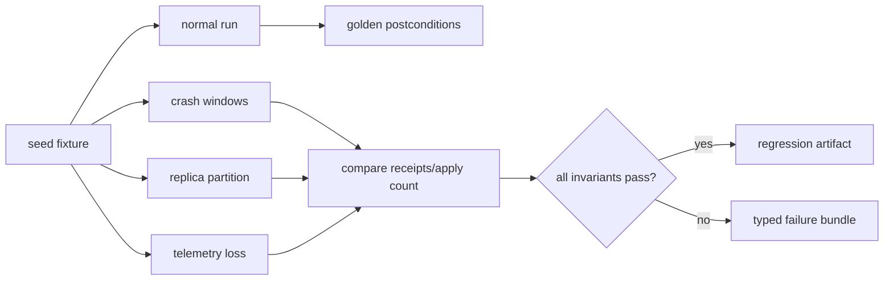

# 37장. 최소 AgentRun 골든 실습: 한 번의 실행을 끝까지 증명한다

이 책의 실습은 거대한 agent framework를 설치하는 경연이 아니다. 가장 작은 AgentRun을 만들고, 정상 경로와 실패 경로에서 무엇이 사실인지 구분하는 훈련이다. 골든 실습의 산출물은 그럴듯한 답변이 아니라 `RunID → state revision → tool approval → LogicalCallID → idempotency key → receiver receipt`를 한 줄로 잇는 원장이다. 이 연결이 되면 framework를 바꾸어도 안전 계약은 남는다.

> **실습 상태 — 계약과 실행 fixture의 결합.** 본문의 `agent-lab` 명령은 설명용 인터페이스다. 실제로 실행되는 회귀 묶음은 저장소 루트의 `python3 research/agents/fixtures/run_volume3_labs.py`이며, 각 명령 예시는 그 fixture가 검증하는 identity·receipt 계약을 사람이 읽기 쉽게 펼친 것이다.

## 37.1 최소 구성은 왜 작아야 하는가

agent 예제는 보통 모델, streaming UI, vector DB, browser, multiple tool, distributed queue를 한 번에 연결한다. 데모에는 좋지만 실패의 최초 위치를 찾기 어렵다. 이 장은 다음 다섯 component만 둔다.

|component|책임|반드시 durable한 것|절대로 판정하지 않는 것|
|---|---|---|---|
|run reducer|상태 전이|RunID·state revision·event|receiver commit|
|policy gate|scope와 action digest|decision·expiry·policy revision|모델 답의 사실성|
|worker|attempt 실행|AttemptID·logical call link|timeout의 의미|
|receiver|효과 dedup·receipt|idempotency key·receipt|상위 workflow 성공|
|observer|trace·metric·log|가능하면 loss disposition|권위 있는 효과 verdict|



각 화살표는 자연어 메시지가 아니라 typed event여야 한다. `tool succeeded` 같은 문자열은 receiver가 무엇을 했는지, 어느 key로 deduplicate했는지, 누가 승인했는지 알 수 없다. 반대로 receipt는 tool output 전체를 저장하라는 뜻이 아니다. 민감한 result는 receiver가 보유하고, run ledger에는 receipt ID·effect digest·disposition처럼 재조정에 필요한 최소 정보만 남긴다.

## 37.2 실습 전제와 안전한 작업 공간

이 실습은 disposable SQLite database와 echo receiver를 전제로 한다. 실제 결제, 메일, 배포 API의 credential을 넣지 않는다. 외부 endpoint를 호출하는 tool 대신 receiver가 `apply_count`와 receipt를 local file에 기록하게 하여 crash window를 재현한다. 작업 디렉터리를 명시하고, 실습이 끝날 때 그 디렉터리만 제거한다.

```bash
export LAB_DIR="$(mktemp -d ./agentrun-lab.XXXXXX)"
export RUN_ID='golden-run-001'
export LOGICAL_CALL_ID='golden-call-001'
export IDEMPOTENCY_KEY='golden-key-001'
printf '%s\n' "$LAB_DIR"
```

실제 구현에서 `mktemp`가 다른 directory를 만들도록 바꾸지 않는다. oracle은 첫 줄의 경로가 repository 안의 disposable directory이며, environment가 비어 있어도 secret이나 production URL을 요구하지 않는다는 것이다. 모든 record에는 lab marker를 넣어 운영 audit와 섞이지 않게 한다.

## 37.3 정상 경로를 실행하고 결과가 아니라 증거를 읽는다

가상의 CLI가 다음 interface를 가진다고 하자. 아래 `agent-lab` 명령은 그대로 설치해 실행하는 프로그램이 아니라 구현 계약을 보여 주는 **설명용 명령**이다. 이 저장소에서 실제로 실행되는 검증은 40장의 로컬 테스트 명령을 사용한다. 여러분의 framework가 다른 CLI를 쓰더라도 입력과 oracle의 의미는 바꾸지 않는다.

```bash
agent-lab init --state "$LAB_DIR/state.sqlite" --receiver "$LAB_DIR/receiver.sqlite"
agent-lab run --state "$LAB_DIR/state.sqlite" --receiver "$LAB_DIR/receiver.sqlite" \
  --run-id "$RUN_ID" --principal analyst --tenant lab \
  --logical-call-id "$LOGICAL_CALL_ID" --idempotency-key "$IDEMPOTENCY_KEY" \
  --action '{"kind":"echo","target":"lab-only","value":"hello"}'
agent-lab inspect --state "$LAB_DIR/state.sqlite" --run-id "$RUN_ID" --json | jq .
agent-lab receipt --receiver "$LAB_DIR/receiver.sqlite" --key "$IDEMPOTENCY_KEY" --json | jq .
```

**expected oracle**은 네 가지다.

1. run ledger에는 `approved`와 `committed`가 순서대로 있으며, committed event는 receipt ID를 참조한다.
2. receipt는 action digest 및 idempotency key와 일치하고 `apply_count`가 1이다.
3. `AttemptID`는 worker 시도를 식별하지만 LogicalCallID와 idempotency key를 대체하지 않는다.
4. observer 출력이 없어도 ledger와 receiver query만으로 effect verdict를 복원할 수 있다.



`Unknown`은 애매한 오류 메시지가 아니라 안전한 상태다. worker가 local journal에 committed를 쓰기 전에 죽었을 수 있고, receiver가 apply 전에 죽었을 수도 있다. 이 경우 `Failed`로 재시도하거나 `Succeeded`로 답변하는 두 선택은 모두 근거가 없다.

## 37.4 fault injection A: apply 뒤 worker를 죽인다

golden lab의 중심은 crash-after-apply다. receiver가 commit한 직후 response를 보내기 전에 child worker를 종료한다. production process를 kill하지 말고 lab fixture가 제공하는 failpoint를 사용한다.

```bash
agent-lab run --state "$LAB_DIR/state.sqlite" --receiver "$LAB_DIR/receiver.sqlite" \
  --run-id golden-run-crash --principal analyst --tenant lab \
  --logical-call-id golden-call-crash --idempotency-key golden-key-crash \
  --failpoint after-receiver-apply || true
agent-lab inspect --state "$LAB_DIR/state.sqlite" --run-id golden-run-crash --json | jq .
agent-lab receipt --receiver "$LAB_DIR/receiver.sqlite" --key golden-key-crash --json | jq .
```

올바른 oracle은 첫 command의 non-zero exit가 아니다. local run 상태가 `Unknown`이고 receiver receipt에는 apply count 1이 있어야 한다. 그 뒤 reconciliation을 실행한다.

```bash
agent-lab reconcile --state "$LAB_DIR/state.sqlite" --receiver "$LAB_DIR/receiver.sqlite" \
  --run-id golden-run-crash
agent-lab inspect --state "$LAB_DIR/state.sqlite" --run-id golden-run-crash --json | jq .
```

reconcile 후에는 동일 receipt로 `Committed`가 되어야 한다. 새 key를 발급하거나 action을 다시 apply하는 것은 실패다. 만약 receiver lookup endpoint가 없다면 이 실습은 exactly-once를 주장할 수 없고, `Unknown`을 human review queue에 보관하는 경계까지만 구현한 것이다.

## 37.5 fault injection B: policy가 stale해진다

승인 직후 state 또는 policy revision을 바꾼다. 재시도 worker는 과거 approval을 그대로 사용하면 안 된다. 아래의 `advance-policy`는 lab-only command다.

```bash
agent-lab approve --state "$LAB_DIR/state.sqlite" --run-id golden-run-stale
agent-lab advance-policy --state "$LAB_DIR/state.sqlite" --tenant lab
agent-lab commit --state "$LAB_DIR/state.sqlite" --receiver "$LAB_DIR/receiver.sqlite" \
  --run-id golden-run-stale || true
agent-lab inspect --state "$LAB_DIR/state.sqlite" --run-id golden-run-stale --json | jq .
```

oracle은 `stale_approval` 또는 `revision_mismatch`라는 typed rejection과 receipt 부재다. 모델이 여전히 같은 tool call JSON을 제안한다는 사실은 아무 관련이 없다. approval은 “이 모델이 좋아 보인다”가 아니라 특정 action digest, tenant scope, expiry, revision에 대한 좁은 권한이다.

## 37.6 fault injection C: 관측을 끊는다

observer를 끄고 read-only 및 effect run을 하나씩 실행한다. 이 test는 trace UI에서 모든 span이 사라질 수 있음을 보여 준다. 그러나 effect run의 verdict는 receiver ledger를 통해 여전히 확인되어야 한다. read-only run은 source-backed answer가 없는 경우 `unknown`을 내고, telemetry 유실을 answer failure나 security pass로 오인하지 않아야 한다.

|실험|관측에서 사라질 수 있는 것|사라지면 안 되는 것|oracle|
|---|---|---|---|
|exporter down|span·metric 일부|policy decision|durable revision record|
|worker kill|마지막 log line|receiver receipt|idempotency lookup|
|sampling|child span|run state|state transition ledger|
|redaction|raw argument|action digest|digest equality|

## 37.7 cleanup과 재현 패키지

먼저 마지막 receipt와 final run record를 JSON으로 export한다. 그 다음에만 lab directory를 지운다. cleanup 후에는 receipt를 다시 조회할 수 없으므로, 실패 ticket에 필요한 evidence를 먼저 보존하는 습관이 중요하다.

```bash
agent-lab export --state "$LAB_DIR/state.sqlite" --receiver "$LAB_DIR/receiver.sqlite" \
  --out "$LAB_DIR/evidence.json"
jq '.runs[] | {runId, terminal, receiptId}' "$LAB_DIR/evidence.json"
rm -rf "$LAB_DIR"
```

`rm -rf`의 target은 shell expansion으로 넓어질 수 있으므로, 실제 실습 automation에서는 생성 직후 canonical path를 확인하고 repository-local lab directory만 허용한다. 이 책의 명령은 production database, cluster namespace, shared artifact store를 정리하는 지침이 아니다.

## 37.8 골든 실습 체크리스트

- [ ] 하나의 RunID와 다수 AttemptID를 구별했는가?
- [ ] approval이 action digest·scope·revision·expiry를 묶는가?
- [ ] idempotency key가 retry마다 변하지 않는가?
- [ ] receiver receipt가 없으면 `Unknown`을 보존하는가?
- [ ] reconcile이 같은 key를 조회하고 새 side effect를 만들지 않는가?
- [ ] trace UI가 비어도 authority ledger와 receiver lookup으로 판정하는가?
- [ ] fault를 한 번에 하나씩 넣고, 각 oracle을 독립적으로 확인했는가?

## 37.9 이 실습이 보장하지 않는 것

SQLite loopback receiver는 multi-region quorum, actual payment semantics, malicious receiver, clock skew, provider outage를 검증하지 않는다. 또한 action digest가 같다는 사실은 자연어 목적이 같다는 보장이 아니다. 실습의 가치는 작은 runtime이 모든 분산 문제를 해결한다는 데 있지 않다. product를 평가할 때 어느 상태가 누구의 권위인지 묻게 하는 데 있다.

### 골든 artifact를 regression test로 남긴다

골든 실습은 한 번 실행하고 끝내지 않는다. `evidence.json`의 완전한 값을 snapshot으로 고정하기보다, 안정되어야 하는 invariant를 test로 적는다. 예를 들어 normal path의 `apply_count=1`, crash path의 intermediate `Unknown`, reconcile 뒤 receipt ID 보존, stale approval의 receipt 부재를 검사한다. timestamp, random trace ID, provider request ID는 snapshot 대상이 아니다. 이 분리가 없으면 테스트는 우연한 formatting에 묶이고, 정작 idempotency regression을 놓친다.

|invariant|정상 경로|crash 경로|나쁜 regression|
|---|---|---|---|
|logical identity|한 key|같은 key 유지|retry가 새 key 생성|
|effect count|1|reconcile 뒤에도 1|2회 apply|
|terminal evidence|receipt 참조|Unknown 후 receipt 참조|timeout을 Failed로 확정|
|approval|digest/revision 일치|stale면 거절|과거 승인 재사용|

이 골든 artifact는 framework 교체의 기준선이기도 하다. 새 runtime의 command 이름과 event schema가 달라도, 동일 failpoint에서 같은 안전한 disposition을 내지 못한다면 migration risk가 있다. 반대로 내부 구현이 달라도 stable logical identity와 durable receiver receipt를 유지한다면, 표현이 아니라 계약 수준에서 비교할 수 있다.

## 37.10 골든 랩 확장: partition과 관측 손실을 분리한다

checkpoint가 무엇을 복구하는지는 [28장](28-event-log-checkpoint-replay.md), fencing generation이 오래된 writer를 막는 범위는 [30장](30-lease-heartbeat-fencing.md), 장애별 terminal 판정은 [31장](31-fault-injection-recovery.md)의 계약을 따른다. 이 장은 세 계약을 새로 정의하지 않고 하나의 회귀 실험으로 묶는다.

다음 pseudocode는 실행 결과가 아니라 사후조건을 golden artifact로 만든다.

```python
effect_key = stable_key(run_id, step_id, tool_name)
expected_generation = policy_snapshot.generation

result = execute(effect_key, expected_generation)
if result.transport_error:
    observed = receiver.lookup(effect_key)
    if observed.applied:
        commit_receipt(observed.receipt)
    else:
        mark_unknown(reason="receiver-unconfirmed")

assert receiver.apply_count(effect_key) <= 1
assert no_write_accepted(fencing_generation - 1)
assert admitted_results_have_generation(expected_generation)
```

### 실험 행렬

| trial | 주입 시점 | 반드시 수집할 사후조건 |
|---|---|---|
| crash-before-apply | effect 호출 직전 | receiver apply count 0 |
| crash-after-apply | receipt commit 직전 | 조회 후 중복 없이 commit 복원 |
| crash-after-commit | caller 응답 직전 | replay가 apply를 반복하지 않음 |
| replica partition | policy generation 변경 뒤 | stale payload 미채택, 복구 수렴 |
| telemetry loss | exporter 차단 | effect 판정은 durable/receiver 증거로 유지 |



### 실행 manifest의 최소 필드

```json
{
  "binary_revision": "<commit>",
  "run_id": "harness-assigned",
  "topology": {"peers": 3, "fault": "symmetric-l2-partition"},
  "budgets": {"queue_ms": 500, "fanout": 2, "retry": 1},
  "generation": {"policy": "g2", "fencing": 8},
  "postconditions": ["apply_count<=1", "old_fence_rejected", "replicas_converged"],
  "cleanup": {"surviving_processes": 0}
}
```

golden 비교는 timestamp와 임시 port를 그대로 diff하지 않는다. 안정적인 logical IDs, normalized event order, receipt hash, peer별 visible set, typed error를 비교한다. RPO는 유실 event·receipt 수로, RTO는 safe reconciliation 완료까지의 시간으로 기록한다.

### 최종 체크리스트

- [ ] timeout을 rollback으로 취급하지 않았는가?
- [ ] telemetry gap과 effect absence를 분리했는가?
- [ ] negative 판정에 complete inventory가 있는가?
- [ ] queue·fan-out·retry budget이 manifest에 있는가?
- [ ] tenant와 policy generation이 함께 fence되는가?
- [ ] 모든 child process와 network fault가 정리됐는가?

## 원전 바로가기

- [Pi agent loop의 tool-result reduction](https://github.com/badlogic/pi-mono/blob/853a80d26c90a14c1886f0ebb8ffaae133ca2185/packages/agent/src/agent-loop.ts#L279-L370)
- [Pi reducer의 deterministic state transition](https://github.com/badlogic/pi-mono/blob/853a80d26c90a14c1886f0ebb8ffaae133ca2185/packages/agent/src/harness/reducer.ts#L312-L391)
- [Temporal worker shutdown boundary](https://github.com/temporalio/sdk-go/blob/213f751d5117fd5621ef6dd55a21b78d605c9696/internal/internal_worker_base.go#L899-L929)
- [PROV-O: activity·entity·agent 관계](https://www.w3.org/TR/prov-o/)
