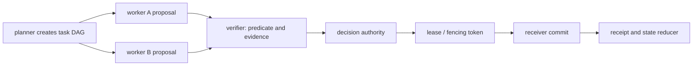
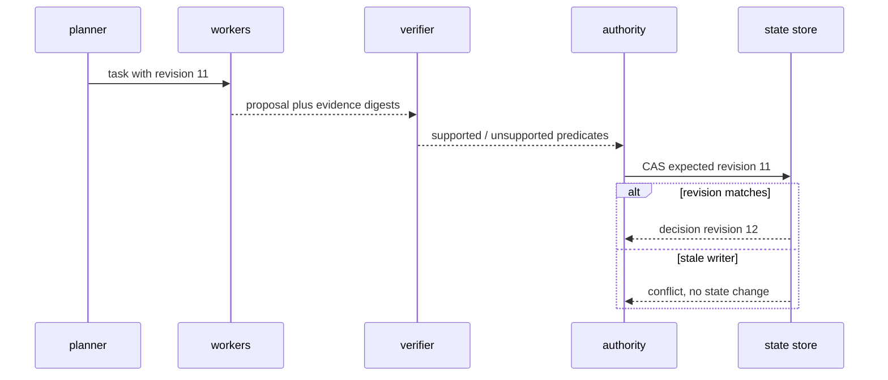
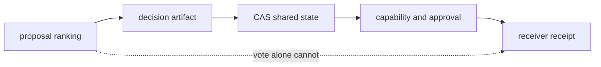
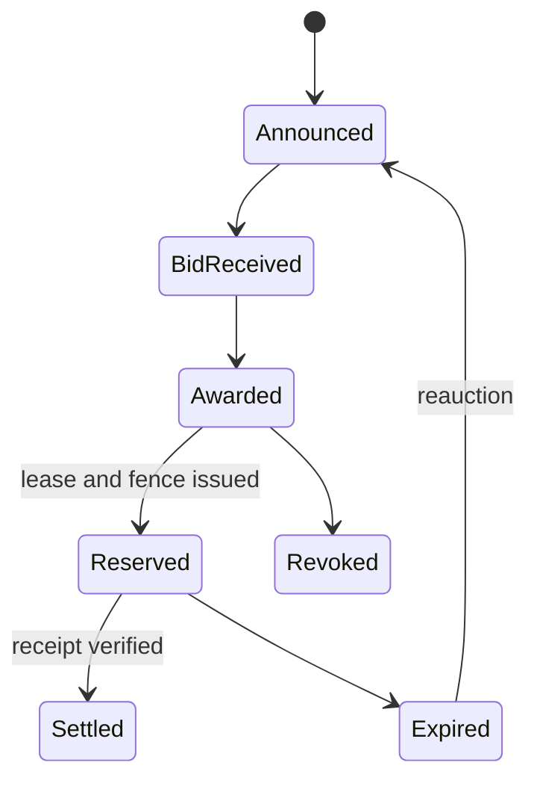

# 38장. 멀티 에이전트 조정 실습: 말의 합의와 상태의 합의를 분리한다

여러 에이전트가 같은 문제를 풀면 답이 좋아질 것이라는 직감은 자주 맞지 않는다. 같은 prompt, 같은 검색 결과, 같은 verifier 편향을 공유한 세 agent의 만장일치는 독립된 증거 세 개가 아니다. 더 위험한 경우는 조정 결과가 실제 shared state나 외부 effect를 바꿀 때다. 이 장은 planner, worker, reviewer가 함께 일하는 작은 실습으로 **제안**, **결정**, **commit**의 권위가 서로 다름을 확인한다.

> **실습 상태 — 설명용 CLI, 실행 가능한 하부 fixture.** `coord-lab`은 설치된 프로그램 이름이 아니라 조정 계약을 표현하는 인터페이스다. 실제 회귀 실행은 `python3 research/agents/fixtures/run_volume3_labs.py`로 수행하며, 결과를 읽을 때 branch 수가 아니라 unique evidence, decision authority, receiver receipt를 oracle로 삼는다.

## 38.1 coordination의 최소 언어

|객체|누가 만들 수 있는가|무엇을 뜻하는가|무엇을 뜻하지 않는가|
|---|---|---|---|
|proposal|어느 worker든|검토할 행동 또는 주장|승인·사실·commit|
|evidence|retriever/verifier|source와 predicate를 가진 근거|최종 정책 허용|
|vote|정해진 electorate|특정 ballot의 판단|durable state write|
|decision|authority service|현재 revision의 선택|receiver 적용|
|lease|scheduler/owner|제한 시간의 실행 권리|영구 소유권|
|receipt|receiver|한 effect의 durable disposition|전체 task 성공|



planner가 task를 만들었다고 worker가 해당 tool을 실행할 수 있는 것은 아니다. verifier가 답을 지지한다고 decision authority가 현재 tenant scope에서 허용한 것도 아니다. lease를 받았다고 오래된 worker가 새 owner보다 우선하는 것도 아니다. 이 분리는 장황한 설계가 아니다. crash와 retry 뒤 “누가 이 상태를 바꿀 자격이 있었는가”에 답하기 위한 최소 조건이다.

## 38.2 실습: proposal을 shared fact로 승격하지 않는다

세 agent에게 동일한 lab task를 준다. A는 database migration을 제안하고, B는 위험을 검토하며, C는 source span을 확인한다. 이때 input을 모두 같은 document로 주면 세 결론이 같아도 독립성이 없다. 따라서 각 proposal에는 `evidence_digest`, `source_revision`, `retrieval_plan`, `tool_cost`, `assumption`을 붙인다.

이 절의 `coord-lab` 블록은 실행 파일을 제공하는 명령이 아니라 CAS·fencing 사후조건을 옮겨 구현하기 위한 **설명용 명령**이다. 저장소에서 검증한 대응 fixture와 실행법은 40장에 따로 제시한다.

```bash
export LAB_DIR="$(mktemp -d ./coordination-lab.XXXXXX)"
coord-lab init --state "$LAB_DIR/state.sqlite"
coord-lab propose --state "$LAB_DIR/state.sqlite" --agent planner \
  --task migrate-lab --proposal-file examples/proposal-a.json
coord-lab propose --state "$LAB_DIR/state.sqlite" --agent reviewer \
  --task migrate-lab --proposal-file examples/proposal-b.json
coord-lab list --state "$LAB_DIR/state.sqlite" --task migrate-lab --json | jq .
```

**expected oracle**은 proposal 개수가 2인 것이 아니다. 두 proposal이 같은 evidence digest를 공유하면 system은 `correlated_evidence`를 표시해야 한다. verifier는 각 주장에 대해 source revision과 predicate를 검사하고, 없는 경우에는 높은 vote confidence라도 `unsupported`로 내린다.



## 38.3 blackboard와 mailbox는 같은 것이 아니다

blackboard는 여러 agent가 revisioned shared state를 읽고 쓰는 구조다. mailbox actor는 특정 owner가 inbox를 순서대로 처리하는 구조다. 둘을 “메시지를 주고받는다”로 뭉개면 stale write와 ordering claim이 사라진다.

|구조|기본 owner|충돌 처리|좋은 용도|위험한 오해|
|---|---|---|---|
|blackboard CAS|shared, revision gate|expected revision reject|공유 계획·검토 state|마지막 write가 진실|
|actor mailbox|actor owner|mailbox order|단일 entity lifecycle|global order 보장|
|CRDT|replica별 update|merge law|offline/partition tolerant value|업무 invariant 자동 보존|
|Raft-like log|leader/quorum|committed log index|replicated decision|tool receipt까지 자동 commit|

특히 CRDT의 convergent merge는 “두 번 결제하지 말라” 같은 invariant를 해결하지 않는다. set에 두 effect가 모두 남아 수렴하는 것은 duplicate payment를 성공적으로 막은 것이 아니다. business invariant는 receiver schema, unique constraint, compensation, human approval처럼 더 좁은 authority에서 지켜야 한다.

## 38.4 fault injection A: stale CAS writer

두 worker에게 같은 state revision 11을 제공한다. 첫 worker가 decision을 12로 commit한 뒤 둘째 worker가 11을 expected revision으로 쓰면 거절돼야 한다.

```bash
coord-lab seed --state "$LAB_DIR/state.sqlite" --task migrate-lab --revision 11
coord-lab decide --state "$LAB_DIR/state.sqlite" --agent authority-a --expected-revision 11 \
  --decision approve
coord-lab decide --state "$LAB_DIR/state.sqlite" --agent authority-b --expected-revision 11 \
  --decision approve || true
coord-lab inspect --state "$LAB_DIR/state.sqlite" --task migrate-lab --json | jq .
```

oracle은 두 번째 명령이 실패하는 것과 final revision이 12인 것, authority-b의 transition이 `stale_revision`으로 남는 것이다. worker가 실패 뒤 처음 read를 생략하고 자신의 proposal을 덮어쓰면 CAS는 장식이 된다. retry는 최신 revision을 다시 읽고 conflict를 해결한 새 decision digest를 만들어야 한다.

## 38.5 fault injection B: lease 만료와 fencing

long-running tool을 가진 owner A가 lease token 1을 받고 멈춘다. scheduler는 expiry 뒤 B에 token 2를 준다. A가 늦게 깨어나 receiver에 write하려 해도 token 1은 거절돼야 한다. lease만 확인하고 fencing을 receiver까지 전달하지 않으면 A는 이미 만료된 권한으로 write할 수 있다.

```bash
coord-lab lease --state "$LAB_DIR/state.sqlite" --task migrate-lab --owner worker-a --token 1
coord-lab advance-clock --state "$LAB_DIR/state.sqlite" --seconds 61
coord-lab lease --state "$LAB_DIR/state.sqlite" --task migrate-lab --owner worker-b --token 2
coord-lab write --state "$LAB_DIR/state.sqlite" --owner worker-a --fencing-token 1 || true
coord-lab write --state "$LAB_DIR/state.sqlite" --owner worker-b --fencing-token 2
```

expected oracle은 receiver가 highest accepted fencing token을 durable하게 보관하고 A의 write를 `stale_fence`로 거절하는 것이다. scheduler log만 보고 “lease가 끝났다”고 판단하면 network delay와 paused process를 통제할 수 없다.

## 38.6 fault injection C: poisoned majority

세 reviewer에게 같은 잘못된 source revision을 넣는다. 셋이 모두 approve해도 verifier는 source digest의 공통 원인을 보여 주고, independent evidence count를 1로 계산해야 한다. 이를 못 하면 debate를 길게 할수록 confidence만 높아지는 feedback loop가 생긴다.

|실패|관측|올바른 대응|잘못된 대응|
|---|---|---|---|
|같은 근거 재인용|vote 3개|provenance dedup|다수결로 승격|
|verifier timeout|판정 없음|unknown/escalation|approve로 fallback|
|lease owner crash|heartbeat 없음|expiry 후 fence 증가|old owner 재사용|
|mailbox replay|같은 message|dedup key|새 proposal로 처리|

## 38.7 cleanup과 체크리스트

실습을 끝내기 전에 final revision, rejected stale writes, accepted fencing token을 export한다. 그런 다음 lab directory만 제거한다.

```bash
coord-lab export --state "$LAB_DIR/state.sqlite" --out "$LAB_DIR/evidence.json"
jq '{decisions,leases,rejections}' "$LAB_DIR/evidence.json"
rm -rf "$LAB_DIR"
```

- [ ] proposal, vote, decision, receipt의 type과 owner를 분리했는가?
- [ ] independent evidence를 agent 수가 아니라 provenance로 세는가?
- [ ] state write에 expected revision이 있고 conflict가 기록되는가?
- [ ] lease expiry와 receiver fencing이 함께 있는가?
- [ ] CRDT convergence를 business invariant 보장으로 주장하지 않는가?
- [ ] verifier failure를 approval으로 바꾸지 않고 unknown으로 남기는가?

## 38.8 이 실습이 보장하지 않는 것

이 local CAS/lease 실습은 consensus protocol의 safety proof, 실제 distributed clock, Byzantine worker, network partition의 recovery를 증명하지 않는다. vote가 독립적인지 판정하는 provenance도 source의 진실성을 자동 보장하지 않는다. 이 장은 여러 agent가 있다는 사실과 강한 분산 합의가 있다는 사실을 구분한다. 실제 effect에는 별도의 receiver authority가 필요하다는 점도 드러낸다.

## 38.9 조정 비용을 먼저 예산화한다

여러 agent를 부르는 이유는 서로 다른 정보·능력·실패 모드를 결합하기 위해서다. 같은 model과 같은 context를 세 번 호출해 token을 세 배 쓰는 것은 다수결이 아니라 반복 샘플링이다. 반복 샘플링이 필요한 경우도 있지만, 비용과 판정의 목적을 숨기면 coordination은 항상 좋은 것처럼 보인다. 시작 전에 제안·도구·검증·조정에 각각 budget을 배정한다.

|예산 바구니|측정 단위|중단 조건|성공 기준|
|---|---|---|---|
|proposal|agent call·token·wall time|새 evidence 없음|서로 다른 후보 생성|
|tool|receiver-safe call 수|scope/lease 없음|확인 가능한 artifact|
|verification|predicate·source span|근거 불완전|지원/반박 판정|
|coordination|message·CAS retry|conflict 반복|decision revision 확정|

`new evidence`는 문장이 달라졌다는 뜻이 아니다. source revision, independent retrieval plan, measured tool artifact, state snapshot 중 적어도 하나가 이전 ledger와 달라야 한다. 그렇지 않은 debate round는 confidence를 얻기보다 shared context의 편향을 증폭한다. scheduler는 round 횟수보다 marginal evidence yield와 남은 deadline을 기준으로 중단할 수 있어야 한다.

### 결정 규칙의 세 층

proposal을 고르는 규칙, shared state를 갱신하는 규칙, external effect를 commit하는 규칙을 하나의 `approve` 함수에 넣지 않는다. proposal selection은 rank나 vote로 충분할 수 있다. state transition은 CAS 또는 transaction을 요구한다. effect commit은 receiver receipt와 idempotency를 요구한다. 이 세 규칙을 분리하면 “다수가 찬성했다”가 왜 결제 권한이 아닌지 코드 리뷰에서도 명확해진다.



## 38.10 mailbox 재전송과 actor failure

actor mailbox가 message order를 제공해도 delivery가 exactly-once라는 뜻은 아니다. producer가 send 직후 죽으면 broker가 받았는지 모를 수 있고, consumer가 handler 뒤 ack 전에 죽으면 같은 message가 다시 올 수 있다. handler는 message ID를 deduplicate하거나, receiver에 idempotency key를 전달해야 한다. actor의 private state update와 external tool effect가 하나의 atomic transaction이 아니면 두 개의 commit boundary가 있다는 사실도 남긴다.

|순서|actor local state|external receiver|복구 때 해야 할 일|
|---|---|---|---|
|handler 전 죽음|변화 없음|변화 없음|message 재전달 가능|
|receiver apply 뒤 죽음|미지|receipt 있음 가능|key로 receipt lookup|
|local persist 뒤 ack 전 죽음|변화 있음|변화 있음 가능|dedup replay|
|ack 뒤 replica 손실|상태 불명|외부는 독립|durable log 범위 확인|

mailbox observability에는 message ID, actor ID, delivery attempt, logical call link가 필요하다. 단, message trace가 있어도 receipt를 대체하지 않는다. actor를 늘릴수록 source of truth가 늘어나지 않게 하려면, 각 field의 owner와 durable location을 design review에서 표로 고정한다.

## 38.11 협상과 경매를 쓸 때의 안전 경계

contract-net이나 auction은 task를 잘 배분할 수 있지만, bid가 capability proof나 실제 resource reservation은 아니다. bidder가 낮은 비용을 말해도 provider quota가 만료됐거나 tool credential scope가 좁을 수 있다. award 뒤에는 실제 lease·reservation·fencing을 받는 단계가 따로 있어야 한다. late bid, revoke, expiry, settlement을 event로 남기지 않으면 재시도 시 두 winner가 같은 task를 실행한다.



여기서 `Settled`는 worker가 “done”이라고 말하는 상태가 아니라, 요구된 artifact 또는 receiver receipt가 확인된 상태다. 비용 최적화 알고리즘을 안전 권한 모델과 혼동하지 않는다.

## 38.12 coordination lab의 확장 과제

1. 같은 evidence digest를 가진 agent를 10명으로 늘려도 independent evidence count가 1인지 확인한다.
2. lease owner를 두 번 바꾸고 oldest token의 write가 계속 거절되는지 확인한다.
3. verifier가 timeout일 때 vote result를 보류하고 escalation event를 남기는지 확인한다.
4. mailbox handler를 재전송해 receiver의 apply count가 하나인지 확인한다.
5. 한 tenant의 bidding storm이 다른 tenant의 verifier budget을 소비하지 않는지 측정한다.

이 과제에서 throughput만 개선해서는 충분하지 않다. conflict·unknown·revocation의 비율도 함께 본다. 실패 경로를 보이지 않게 만드는 scheduling policy는 조정 시스템을 안전하게 만드는 것이 아니라 관측하기 어렵게 만든다.

## 통합 fault lab: 조정이 아니라 보장을 측정한다

다음 matrix를 자동화한다.

|실험|주입|반드시 관측할 값|합격 조건|
|---|---|---|---|
|DAG join|completion permutation·duplicate proof|join digest·consumed proof IDs|순서 불변, 중복 1회|
|debate|동일 source 5개 paraphrase|vote와 effective cohort 수|cohort=1|
|blackboard|lease 만료 writer 재개|generation·fence reject|stale commit 0|
|auction|reaward 뒤 old winner commit|award/fence/effect key|receiver reject|
|mailbox|commit 뒤 response drop·redelivery|attempt 수·receipt apply 수|apply=1|
|cancel|ack 뒤 residual queue work|cancel time·last work time|잔존 비용 보고|

```python
def admit_effect(proof, state, receiver):
    if not proof.complete or proof.has_cycle:
        return Reject("ambiguous proof")
    if proof.generation != state.generation:
        return Reject("stale generation")
    if proof.source_digest != state.expected_source_digest:
        return Reject("source changed")
    return receiver.commit(
        effect_key=proof.effect_key,
        fencing_token=state.fencing_token,  # pragma: allowlist secret
    )
```

MCP request ID, A2A Task ID, trace ID, proof ID, effect key를 모두 로그 한 열로 뭉개지 않는다. cancellation은 요청 상태, trace는 관측 상태, receipt는 receiver postcondition이다. 실험 보고서에는 `cancelled` 하나 대신 `request_cancelled`, `handler_stopped`, `effect_unknown`, `effect_committed`, `reconciled`를 구분한다.

검증기 독립성도 수치화한다. 후보들이 공유한 source digest·retrieval snapshot·model family·prompt template을 기록하고, 표 수와 고유 evidence cohort 수를 함께 그래프로 그린다. throughput가 좋아져도 고유 proof가 늘지 않았다면 speculative fan-out의 지식 이득은 0에 가깝다.

## 원전 바로가기

- [Hewitt actor model 원 논문](https://arxiv.org/abs/1008.1459)
- [INRIA CRDT 연구 보고서](https://inria.hal.science/inria-00555588/document)
- [Raft 논문](https://raft.github.io/raft.pdf)
- [Pi reducer의 state reduction 경계](https://github.com/badlogic/pi-mono/blob/853a80d26c90a14c1886f0ebb8ffaae133ca2185/packages/agent/src/harness/reducer.ts#L312-L391)
- [MCP cancellation race](https://github.com/modelcontextprotocol/modelcontextprotocol/blob/3ff697dcbea0804f3f397b864cfbbaaa10cba71a/docs/specification/2025-06-18/basic/utilities/cancellation.mdx#L7-L49)
- [A2A Task와 terminal state](https://github.com/a2aproject/A2A/blob/c0f30b35390c59d2cc398a1100823a9115b97a20/specification/a2a.proto#L150-L210)
