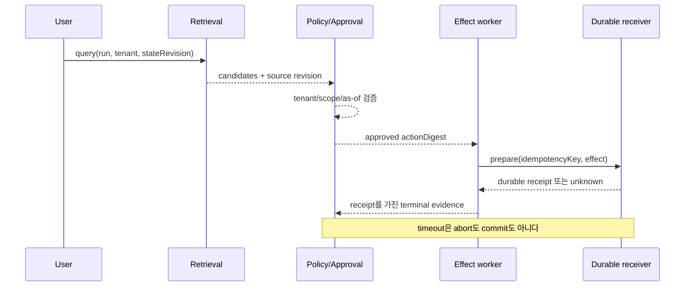
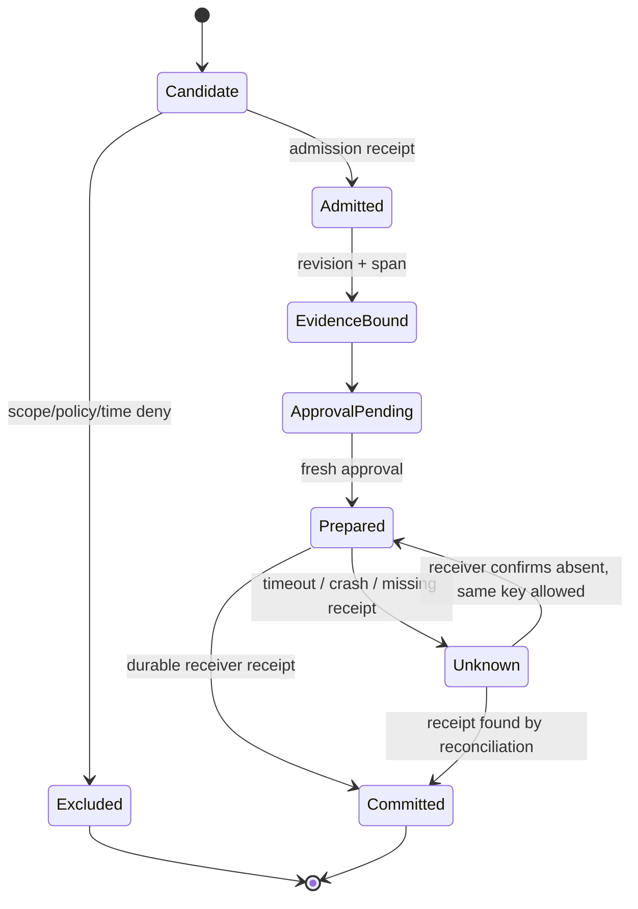
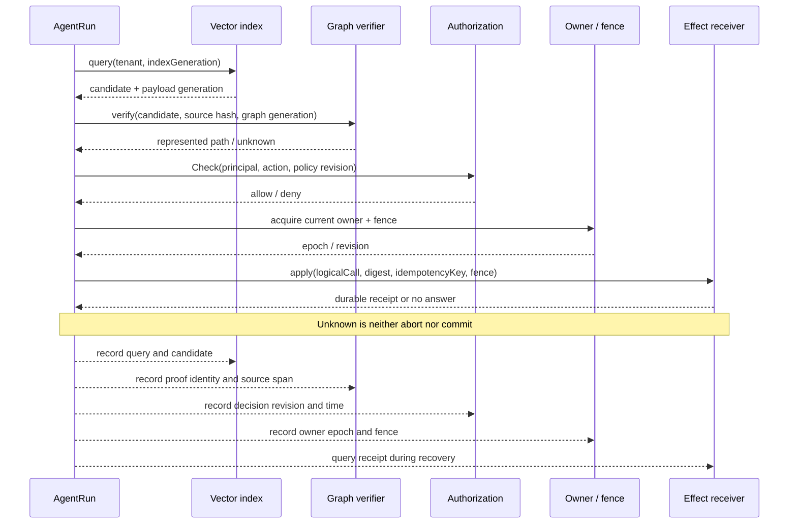

# 39장. 검색 결과가 외부 효과가 되기까지

> **실습 상태 — 실제 로컬 fixture.** 이 장의 핵심 complete/incomplete 쌍은 저장소 루트에서 `python3 research/agents/fixtures/run_volume3_labs.py`로 재검증할 수 있다. 뒤에서 사용하는 짧은 CLI 이름은 관측 계약을 설명하기 위한 표기이며 별도 설치 프로그램이 아니다.

## 완전한 근거와 불완전한 근거를 짝지어 실행한다

같은 선두 후보와 같은 검색 세대를 돌려주는 두 실행을 만든다. 둘 다 effect-time 권한 검사는 allow다. 차이는 근거 질의의 필수 해시 한 칸뿐이다.

|실행|후보|권한|근거 결과|dispatch|receipt|
|---|---|---|---|---|---|
|complete|`a-design`, generation `g32`|allow|유일 행, path·1–2행·hash 일치|열림|존재, count 1|
|incomplete|동일|allow|행은 있으나 hash binding 누락|fail-closed|없음|

불완전은 거짓과 다르다. “잘못된 문서”라고 단정하지 않고 `unknown_incomplete`로 보존하되, 효과 gate만 닫는다.

```python
proof_complete = (len(rows) == 1
                  and rows[0].generation == candidate.generation
                  and rows[0].path is not None
                  and rows[0].line_range is not None
                  and rows[0].sha256 == sha256(read_span(rows[0])))
dispatch = policy_at_effect_time.allowed and proof_complete
```

complete일 때만 별도 SQLite 수신자 프로세스가 시작됐다. incomplete일 때는 `allowed=True`여도 receiver started, dispatch, receipt가 모두 false였다. 이 차이는 telemetry 추론이 아니라 receiver ledger의 사후조건이다.

검색이 맞았다는 사실과 실행해도 된다는 사실은 다르다. 이 장의 실습은 그 차이를 한 번의
`AgentRun` 안에서 끝까지 추적한다. 출발점은 단순하다. 에이전트가 고객 지원 기록을 찾아
환불 도구를 호출하려 한다. 가장 가까운 문서는 다른 tenant의 최신 문서이고, 현재 tenant의
문서는 한 단계 아래에 있다. 여기서 벡터 점수만 믿으면 검색은 성공하지만 시스템은 실패한다.

## 39.1 실패는 검색 다음 단계에서 시작된다

요청에는 최소한 다음 identity가 붙어야 한다.

| identity | 답하는 질문 | retry 때 유지되는가 |
|---|---|---|
| `RunID` | 어떤 사용자 실행인가 | 실행 전체에서 유지 |
| `StateRevision` | 어느 상태를 읽었는가 | 상태가 바뀌면 증가 |
| `Principal/Tenant` | 누구의 권한으로 읽고 쓰는가 | 재인증 전 임의 변경 금지 |
| `LogicalCallID` | 사용자가 의도한 논리 작업은 무엇인가 | attempt가 바뀌어도 유지 |
| `ActionDigest` | 승인받은 인수와 대상은 정확히 무엇인가 | 인수가 바뀌면 새 digest |
| `IdempotencyKey` | receiver가 중복 적용을 어떻게 알아보는가 | 같은 논리 효과에서 유지 |
| `EffectID` | 실제 외부 상태 변경은 무엇인가 | 효과마다 고유 |

이 표의 열을 하나로 뭉개면 오류가 생긴다. `AttemptID`를 idempotency key로 쓰면 timeout 뒤
재시도가 새 효과로 보인다. 반대로 `RunID` 하나로 모든 효과를 deduplicate하면 같은 실행에서
서로 다른 두 환불마저 하나로 합쳐진다.



## 39.2 후보와 답 사이에는 타입 경계가 있다

벡터 검색의 출력은 `Candidate`다. tenant와 policy revision을 통과하면
`AdmissibleRecord`가 된다. 정확한 source revision과 span을 확인해야 비로소
`SourceBackedAnswer`라 부를 수 있다. 마지막으로 외부 효과를 만들려면 현재 상태에 대한
승인과 receiver의 commit 계약이 더 필요하다.

```text
Candidate
  -> tenant/scope/as-of 확인
AdmissibleRecord
  -> entity/revision/source span 확인
SourceBackedAnswer
  -> fresh approval + action digest 확인
PreparedEffect
  -> durable receiver receipt 확인
CommittedEffect
```

이 변환은 단순한 명칭 변경이 아니다. 각 화살표에는 거절 사유가 있고, 거절된 객체는 다음
타입의 권한을 얻지 못한다. 다른 tenant의 cosine top-1은 후보일 수 있지만 환불 근거가 될 수
없다. 어제 받은 승인은 설명 자료일 수 있지만 오늘 바뀐 금액의 commit 권한은 아니다.

## 39.3 timeout 뒤에 함부로 재시도하면 안 되는 이유

가장 까다로운 창은 receiver가 효과를 적용한 직후 worker가 죽는 순간이다. 로컬 기록에는
receipt가 없지만 외부 상태는 이미 바뀌었다. 이 상태를 실패로 단정하고 새 idempotency key로
재시도하면 중복 효과가 난다. 성공으로 단정해도 위험하다. receiver가 적용 전에 죽었을 수 있기
때문이다. 올바른 terminal은 `Unknown`이다.

복구기는 동일한 `LogicalCallID`와 `IdempotencyKey`로 receiver를 조회한다. durable receipt가
있으면 로컬 ledger를 `Committed`로 조정하고, 없다면 receiver 계약이 허용하는 방식으로 같은
키를 재전송한다. 이때 네트워크 응답이나 trace span은 receipt를 대신하지 않는다. 관측 데이터는
“요청을 보냈다”를 보여줄 수 있지만 권위 있는 시스템이 “한 번 적용했다”를 보증하지는 않는다.

## 39.4 실습: 최초 불일치를 찾는다

다음 Python 블록은 실행 파일이 아니라 상태 전이를 줄인 **의사 코드**다. 저장소에서 실행 가능한 회귀 테스트는 40장의 명령을 사용한다.

```python
# 의사 코드: crash window에서는 상태를 성공/실패로 접지 않는다.
prepare(logical_call_id, idempotency_key, approved_action)
try:
    receipt = receiver.apply_once(idempotency_key, approved_action)
    ledger.append("receiver.receipt", receipt)
except TimeoutOrWorkerDeath:
    ledger.append("effect.unknown", logical_call_id)
```

실습에서는 정답 문장을 외우지 말고 raw event에서 최초로 계약이 갈리는 지점을 찾는다.

1. 전역 top-k 뒤 post-filter가 허용 가능한 target을 잃는가?
2. prefilter가 tenant·scope·revision·entity를 먼저 고정하는가?
3. 승인 revision과 commit 직전 state revision이 같은가?
4. worker 종료 뒤 effect가 `Failed`가 아니라 `Unknown`으로 남는가?
5. reconciliation이 stable logical identity와 receiver receipt를 사용하는가?
6. 같은 key를 다시 보냈을 때 receiver의 적용 횟수가 하나인가?

이 fixture에는 고정 2차원 벡터, SQLite loopback receiver, 로컬 child process를 사용한다. 실제
embedding 모델, ANN 제품, 조직의 policy engine, 외부 결제 API, multi-node partition 성능을
증명하지 않는다. 실습의 목적은 제품 benchmark가 아니라 서로 다른 증거를 하나의 identity
그래프에 연결하는 법을 익히는 데 있다.

### 원장을 읽는 순서

raw event를 볼 때는 성공 메시지부터 찾지 말고, 각 사건이 이전 사건의 어떤
증거를 소비했는지 읽는다. `retrieval.candidate`의 score는 `policy.admitted`의
권한 근거가 아니다. 후자는 principal, tenant, policy revision, record revision을 다시
소비해야 한다. `approval.accepted`도 `ActionDigest`에 대한 근거일 뿐, 임의로
변경한 tool argument에 대한 포괄 위임이 아니다.

| 사건 | 반드시 있어야 할 입력 | 성공 후에도 아직 없는 보장 |
|---|---|---|
| `retrieval.candidate` | query·corpus generation·candidate ID | 읽기 권한, 질문의 정답 |
| `policy.admitted` | principal·tenant·policy revision·record revision | source의 사실성, tool 승인 |
| `approval.accepted` | action digest·scope·expiry·state revision | receiver가 효과를 적용했다는 사실 |
| `effect.prepared` | logical call·idempotency key·receiver contract | commit, abort 또는 rollback |
| `receipt.observed` | receiver authority·effect identity·durable disposition | 다른 effect까지 성공했다는 결론 |

이 표를 뒤집어 읽으면 디버깅 순서가 된다. 중복 환불이 의심될 때 모델의 응답을
먼저 읽는 것은 거의 도움이 되지 않는다. receiver에서 같은 idempotency key가 몇 번
적용되었는지, 로컬 ledger의 receipt가 어느 state revision에서 분실됐는지를 먼저 봐야 한다.

### 장애 주입 행렬

| 주입 지점 | 의도한 신호 | 잘못된 판정 | 올바른 oracle |
|---|---|---|---|
| top-k 직후 | 다른 tenant의 더 가까운 문서 | top-1을 즉시 사용 | authorization 전에는 candidate |
| 승인 직후 | state revision 증가 | 과거 승인 재사용 | stale approval 거절·재승인 |
| receiver apply 직후 | worker `SIGKILL` | 실패로 단정하고 새 key로 retry | `Unknown`·receipt 조회 |
| receipt 수신 직후 | local persist 전 종료 | 외부 effect rollback 가정 | 같은 logical identity로 reconcile |
| exporter queue overflow | trace 유실 | effect 미발생으로 판정 | authority ledger·receiver receipt 조회 |

좋은 fixture는 오류가 났는지만 보지 않는다. 장애 지점을 한 단계씩 옮겨 가며 최초
불일치가 어디로 이동하는지 봐야 한다. 이렇게 해야 `timeout 증가`같은 후행 증상을
원인으로 오인하지 않고, 권한 scope 누락이나 receipt persist 창과 같은 최초 계약 위반을
찾을 수 있다.

## 39.5 기대 event ledger: 문장이 아니라 사건 순서로 채점한다

이 실습의 출력은 “환불이 완료되었습니다”라는 자연어 한 줄이 아니다. 동일한 `RunID` 아래의 불변 event ledger다. 이벤트는 append-only로 기록하고, 사람이 읽는 상태는 event를 접어 계산한다. 그래야 worker가 종료되거나 network response가 사라져도 무엇을 *관측했고 무엇을 모르는지* 분리할 수 있다.

|순서|event|필수 identity·증거|허용되는 다음 상태|절대 추론하면 안 되는 것|
|---:|---|---|---|---|
|1|`run.started`|RunID, principal, tenant, request digest|retrieval|실행이 승인되었다|
|2|`retrieval.candidate`|corpus snapshot, candidate ID, score|admission 또는 exclusion|candidate가 사실이다|
|3|`record.admitted`|policy revision, record revision, as-of|evidence check|tool 사용이 허용된다|
|4|`evidence.bound`|entity key, source revision, span|approval request|문서 전체가 최신이다|
|5|`approval.granted`|ActionDigest, state revision, expiry|prepare|다른 인수도 승인되었다|
|6|`effect.prepared`|LogicalCallID, IdempotencyKey, receiver|apply 또는 unknown|receiver가 적용했다|
|7|`receiver.receipt`|receiver-issued disposition, EffectID|committed|다른 logical call도 성공했다|
|8|`ledger.reconciled`|receipt query time, reconciler revision|terminal committed|처음 attempt가 성공 응답을 받았다|

expected ledger의 핵심은 `candidate`와 `admitted`, `prepared`와 `committed` 사이에 빈 칸을 만들지 않는 데 있다. 예컨대 `receiver.receipt`가 없다면 local worker가 “성공”을 출력했어도 terminal state는 `Unknown`이어야 한다. 반대로 durable receipt가 있다면 local log가 유실되어도 receiver가 소유한 효과 사실을 복구할 수 있다.



### ledger 검증 규칙

실습 checker는 final status만 검사하지 말고, 다음 규칙을 위반한 첫 event를 반환해야 한다.

```text
for every record.admitted:
  require a preceding retrieval.candidate with same record revision
for every approval.granted:
  require an unexpired evidence.bound and identical ActionDigest
for every receiver.receipt:
  require exactly one LogicalCallID and IdempotencyKey
for every terminal Committed:
  require a receiver-issued durable receipt
if a worker dies after prepare and receipt is absent:
  require terminal Unknown, never Failed or Committed
```

“동일”도 정확히 정한다. ActionDigest는 tool name, target, normalized arguments, monetary amount/currency, approval scope, state revision을 canonical serialization으로 hash한 값이어야 한다. JSON field 순서나 float 표현 차이로 digest가 달라지면 같은 action의 retry가 새 효과가 된다. 반대로 user-visible message처럼 effect와 무관한 field를 digest에 넣으면 무해한 문구 수정이 recovery를 막는다.

## 39.6 cleanup은 rollback이라는 말보다 좁고 정확해야 한다

실습을 여러 번 돌리면 test tenant, index snapshot, policy grant, receiver row, trace artifact가 남는다. cleanup은 이들을 한 번에 “삭제”하는 명령이 아니라 종류별 lifecycle이다. 특히 이미 적용된 refund를 test cleanup이라고 역으로 취소하면, 역작업 자체가 또 하나의 external effect가 된다.

|자원|생성 주체|안전한 cleanup|보존해야 할 것|
|---|---|---|---|
|ephemeral index snapshot|retrieval fixture|run namespace 삭제|snapshot digest와 query plan|
|temporary policy grant|test policy store|expiry 또는 명시 revoke|grant/revoke receipt|
|receiver test record|durable receiver|test tenant namespace에서 tombstone|LogicalCallID, EffectID, receipt|
|trace/log sample|telemetry pipeline|redacted retention policy로 만료|incident에 필요한 correlation ID|
|실제 외부 효과|receiver|원래 업무의 보상 절차만 사용|원 action과 compensation의 별도 receipt|

test receiver에는 production target과 다른 endpoint·tenant allow-list·currency ceiling을 둔다. endpoint가 비어 있거나 allow-list 밖이면 fixture는 시작 전에 fail-closed 해야 한다. cleanup job도 `RunID`만 믿지 말고 test environment marker와 namespace를 둘 다 확인한다. 그렇지 않으면 충돌한 ID 하나가 다른 실행의 audit record를 지울 수 있다.

### 보상과 rollback을 구별한다

receiver가 commit한 뒤의 refund를 무조건 rollback할 수 있다고 가정하지 않는다. 결제 시스템의 취소, 반대 거래, 수동 조정은 모두 새 action이다. 각각은 새 `LogicalCallID`, 새 approval, 새 idempotency key, 새 receipt가 필요하다. 이전 오류를 고친다는 명분은 새 effect의 authority를 만들지 않는다.

## 39.7 변형 실습: 같은 원리를 다른 실패에 적용한다

기본 실습을 통과했다면 한 번에 하나의 차원만 바꾸며 다음 변형을 수행한다.

1. **문서 철회.** admission 뒤 source revision이 retracted 된다. 아직 approval 전이면 action을 보류해야 한다. 이미 receiver receipt가 있으면 역사 기록을 지우지 말고 후속 보상 절차를 검토한다.
2. **권한 변경.** retrieval cache는 hit지만 policy revision이 바뀐다. cache entry가 새 scope를 재검증하지 않으면 answer나 action 근거로 재사용되어서는 안 된다.
3. **엔터티 모호성.** entity linker가 두 customer key를 반환한다. 가장 높은 score를 임의 선택하지 말고 approval request를 만들기 전에 `Ambiguous`로 종료한다.
4. **중복 delivery.** receiver가 같은 key의 prepare를 두 번 받는다. 첫 receipt와 같은 EffectID를 되돌리고 applied count는 하나여야 한다.
5. **관측 유실.** exporter queue를 포화시켜 trace를 빼 버린다. telemetry가 비어도 receiver receipt와 durable ledger로 terminal 판정이 가능해야 한다.
6. **부분 shard 장애.** retrieval shard 하나가 timeout 된다. complete inventory가 없는 negative answer는 `unknown`이 되어야 하며, “승인 문서 없음”으로 번역하면 안 된다.

각 변형의 합격 조건은 자연어 response가 아니라 ledger에 들어온 rejection reason과 receipt다. 이 규칙을 지키면 모델·reranker·policy engine을 바꾸어도 실습의 핵심 계약은 유지된다.

### 비보장

- idempotency key 하나가 모든 종류의 효과에 exactly-once를 보장하지는 않는다. receiver의 저장과 dedup 범위가 그 보장을 결정한다.
- timeout, cancellation, worker exit는 remote abort의 증명이 아니다.
- trace와 metric은 진단 보조 자료이며 authority ledger나 durable receiver receipt를 대체하지 않는다.
- test cleanup이 실제 외부 효과를 자동으로 되돌려도 된다는 권한을 만들지 않는다.

## 39.8 운영 체크리스트

- 검색 로그에 tenant, principal, policy revision, corpus generation이 함께 남는가?
- top-k 소진과 authorization rejection을 같은 `not found`로 합치지 않는가?
- 승인은 대상·인수·만료·상태 revision을 포함하는가?
- 모델이 만든 tool call ID와 durable logical call identity를 구분하는가?
- timeout·cancel·worker exit를 remote abort로 번역하지 않는가?
- commit 판정에 receiver가 발급한 durable receipt를 요구하는가?
- `Unknown` 효과를 조회하고 재조정하는 운영 경로가 있는가?
- trace·metric·log가 유실되어도 effect ledger로 복구할 수 있는가?

이 장의 핵심은 “검색을 잘하자”나 “exactly once를 구현하자”에 있지 않다. 검색 후보가 권한 있는
근거가 되고, 그 근거가 승인된 행동이 되고, 행동이 실제 외부 효과가 되는 모든 경계에서
identity와 증거의 소유자를 바꾸지 않는 것이 핵심이다.

## 39.9 수직 경계 실습: 후보 하나를 끝까지, 그리고 되짚어 읽기

앞의 표들은 각 경계를 따로 설명했다. 운영에서 더 어려운 일은 다섯 시스템이 남긴 서로 다른
기록을 한 사용자 의도에 다시 묶는 일이다. 이 절에서는 `refund customer-17`이라는 하나의
논리 작업을 따라간다. 후보가 발견됐다는 기록, 그래프 제약을 통과했다는 기록, 권한 판정,
소유권 교체, receiver 영수증은 서로 대체되지 않는다. 따라서 어느 한 단계가 비어도 다음
단계의 성공 메시지로 채우지 않는다.

### 39.9.1 한 요청에 필요한 좌표를 먼저 고정한다

다음 다이어그램에서 굵은 화살표는 **다음 단계에 넘기는 값**이고, 점선은 **나중에 대조할
기록**이다. `generation tuple`은 하나의 전역 시계가 아니라, 이 실행이 스스로 비교하기로 한
좌표 묶음이다. 예를 들어 `(index=g2, graph=g2, source=h91, policy=p8)`처럼 각 저장소의
독립 revision을 함께 적는다. Qdrant 후보 payload와 OpenFGA Check 응답만으로 이 묶음이
원자적으로 읽혔다고 말할 수는 없다. 실제 loopback 실험에서도 `g2` 후보와 deny, 또는 allow와
빈 후보가 각각 나왔다. 그러므로 application이 비교할 좌표와 불일치 처리 규칙을 명시해야 한다.



여기서 그래프 검증의 답은 세 값으로 두는 편이 안전하다. `pass`는 선언한 snapshot 안에서
필요한 path·hash·scope가 표현됐다는 뜻이고, `fail`은 **선언된 폐쇄 inventory** 안에서
위반을 확인했다는 뜻이다. inventory·탐색 범위·entity-link 규칙이 없는 빈 path는 `unknown`이다.
이는 그래프가 약해서가 아니라, “찾지 못함”을 “세상에 없음”으로 바꾸지 않기 위한 계약이다.
`unknown`은 answer를 보류하거나 사람에게 질문할 이유가 될 수 있지만, effect를 시작할 근거는
아니다.

### 39.9.2 장애를 한 칸씩 옮겨 원인을 분리한다

수신자의 response를 잃은 사건은 겉으로 모두 timeout처럼 보인다. 하지만 *어디까지 도달했는지*
에 따라 다음 행동은 정반대가 된다. 아래 순서는 이 저장소의 bounded fixture가 실제로 보존하는
국소적 관측을 바탕으로 한 실습 절차다. SQLite fixture와 localhost process의 결과를 분산
exactly-once 보장으로 일반화해서는 안 된다.

|관측된 최초 불일치|그 순간까지 확실한 사실|금지할 추론|다음 읽기/행동|
|---|---|---|---|
|후보 `g2`, 권한 deny|후보와 권한이 별도 시점에 읽힘|`g2`가 현재 권한을 뜻함|candidate를 폐기하고 effect를 열지 않는다|
|권한 allow, graph path 없음|권한은 action scope만 판정|원문 관계가 거짓|closure 계약을 확인하고 `unknown` 또는 재조사|
|승인 뒤 fence가 바뀜|과거 owner가 있었음|기존 worker가 여전히 쓸 수 있음|새 owner가 receiver-side fence로 재입장|
|old fence의 apply가 409|receiver가 현재 epoch와 비교함|old worker의 이전 호출도 취소됨|그 logical call의 receipt를 별도로 조회|
|commit 뒤 client response 유실|transport 결과가 미상|abort 또는 duplicate apply|같은 idempotency key로 receipt를 조회|

두 receiver fixture에서는 A가 epoch 1을 얻고 만료 뒤 B가 epoch 2를 얻었다. 늦은 A 요청은
409 `stale-owner-or-lease`로 거절됐다. 이어 B가 local effect와 receipt를 commit한 직후
응답 전에 종료됐고, restart된 B는 epoch 3을 얻어 receipt를 읽은 뒤 같은 fingerprint를
`duplicate`로 reconcile했다. 이 연쇄가 보여 주는 것은 “lease가 중복을 모두 해결한다”가
아니다. fence는 **오래된 writer를 receiver 입구에서 막는 값**, idempotency key는 **같은
논리 효과를 다시 알아보는 값**, receipt는 **이미 적용된 사실을 복구하는 값**이다. 셋의 책임은
서로 다르다.

공개 저장소를 clone한 독자는 다음 세 독립 artifact-verification harness를 차례로 실행한다.
첫째는 후보·권한의 세대 불일치, 둘째는 stale owner와 receipt reconciliation, 셋째는
response-loss transport 경계다. 이 명령은 network나 Docker를 시작하지 않고, 함께 배포한
sanitized event ledger의 SHA-256·ordinal·핵심 outcome을 검증한다. bounded live reproduction의
고정 제품·scratch 조건은 checkout 안의 `labs/volume-3/retrieval-permission-effect/README.md`에 분리했다.

```bash
python3 labs/volume-3/retrieval-permission-effect/verify_generation_skew.py --verify-recorded
python3 labs/volume-3/retrieval-permission-effect/verify_lease_takeover.py --verify-recorded
python3 labs/volume-3/retrieval-permission-effect/verify_response_boundary.py --verify-recorded
```

### 39.9.3 15분 디버깅 체크리스트: 마지막 오류부터 거꾸로 간다

incident에서 “에이전트가 잘못 실행했다”는 문장은 출발점일 뿐이다. 아래 순서로 마지막
durable 사실에서 위로 거슬러 올라가면, 모델 응답·HTTP timeout·trace 유실이라는 큰 잡음보다
먼저 실제 경계를 찾을 수 있다.

1. **receiver부터 읽는다.** `LogicalCallID`, idempotency key, action digest로 receipt를
   조회한다. receipt가 없으면 `Failed`로 접지 말고 `Unknown`으로 보존한다.
2. **fence를 대조한다.** receiver가 받은 fence, 현재 owner/fence, reject reason을 한 화면에
   놓는다. worker 로그의 “lease 보유”는 receiver가 받아들였다는 증거가 아니다.
3. **effect-time 권한을 확인한다.** allow/deny뿐 아니라 principal, resource, relation,
   policy revision, 판정 시각과 action digest가 같은지 본다. 검색 당시의 allow로 대체하지
   않는다.
4. **근거의 generation tuple을 확인한다.** index payload generation, graph generation,
   source hash/span, policy revision이 모두 action에 묶였는지 확인한다. 한 시스템이 최신이라는
   표시는 다른 시스템의 watermark가 아니다.
5. **candidate와 proof를 분리한다.** score와 rank는 후보 정렬 기록이다. graph path가 있다면
   scope·closure·source hash를, 없으면 negative를 말할 권한이 있는지를 확인한다.
6. **관측 채널을 마지막에 읽는다.** trace, metric, proxy close는 타임라인을 보강하지만 receipt의
   부재나 존재를 뒤집지 않는다. trace가 없다는 사실도 effect가 없다는 뜻이 아니다.

이 checklist가 만드는 산출물은 한 줄짜리 “성공/실패”가 아니라 다음과 같은 incident tuple이다.
`(candidate ID, generation tuple, proof disposition, policy decision, fence, logical call,
idempotency key, receipt disposition)`. 이 튜플을 남기면 새 retriever, graph store, policy
engine, receiver로 교체해도 어떤 계약을 다시 검증해야 하는지 사라지지 않는다.

### 39.9.4 원전과 구현 좌표

이 절의 국소 실험은 제품의 모든 동작을 대표하지 않는다. 아래 원전은 각각의 경계가 실제로
어디에 구현되거나 정의되는지 추적하기 위한 출발점이다.

- [Qdrant v1.19.0 query REST handler](https://github.com/qdrant/qdrant/blob/74f3e85b9473c62560006c043e13737ce6b48412/src/actix/api/query_api.rs#L31-L110): query 요청이 product 경계에 들어오는 위치
- [OpenFGA Check cache/consistency 경로](https://github.com/openfga/openfga/blob/a7dfe8491dc7f9cd5905f4e9ae6c8e1d718c4bd9/internal/graph/cached_resolver.go#L136-L168): `HIGHER_CONSISTENCY`가 cache 경로를 우회하는 범위
- [OpenFGA Write command](https://github.com/openfga/openfga/blob/a7dfe8491dc7f9cd5905f4e9ae6c8e1d718c4bd9/pkg/server/commands/write.go#L80-L115): tuple delete/write가 처리되는 코드 경계
- [etcd transaction API](https://etcd.io/docs/v3.5/dev-guide/api_grpc_gateway/#transaction): compare-and-swap ownership을 설계할 때 확인할 compare·success·failure 분기
- [RDF 1.1 Semantics](https://www.w3.org/TR/rdf11-mt/): 표현되지 않은 path를 자동으로 false로 읽지 않는 모델 이론의 경계

## 원전 바로가기

- [W3C PROV-O](https://www.w3.org/TR/prov-o/): entity, activity, agent와 provenance 관계
- [Faiss indexes](https://github.com/facebookresearch/faiss/wiki/Faiss-indexes): exact·non-exhaustive index의 구조
- [Faiss FAQ](https://github.com/facebookresearch/faiss/wiki/FAQ): filtering과 ANN 운용상의 제약
- [Temporal durable execution](https://docs.temporal.io/workflow-execution): workflow execution과 durable state 경계
- [Dapr resiliency](https://docs.dapr.io/operations/resiliency/resiliency-overview/): retry·timeout·circuit breaker 정책의 적용 범위
