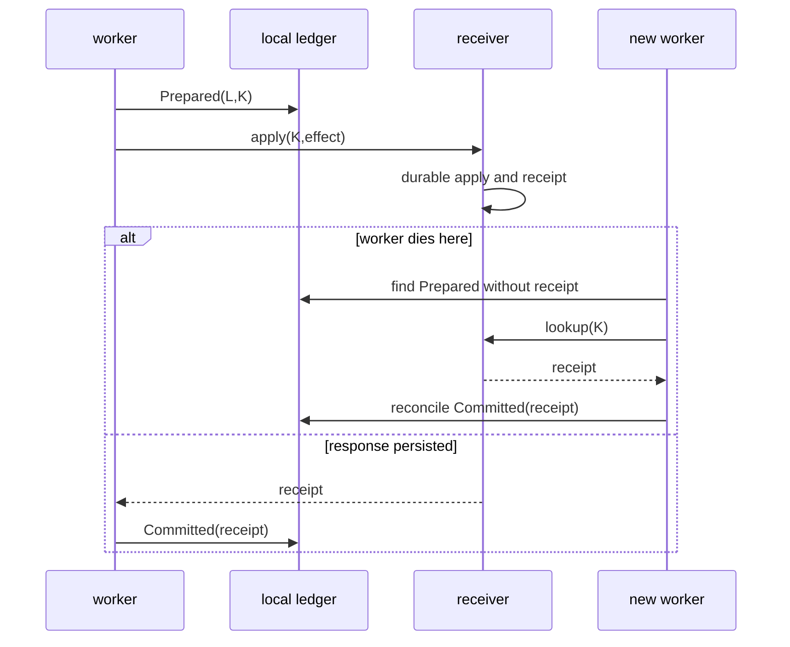
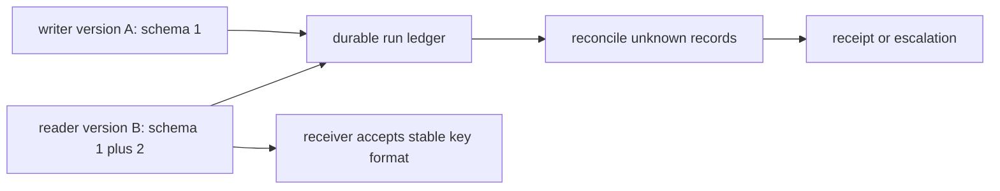
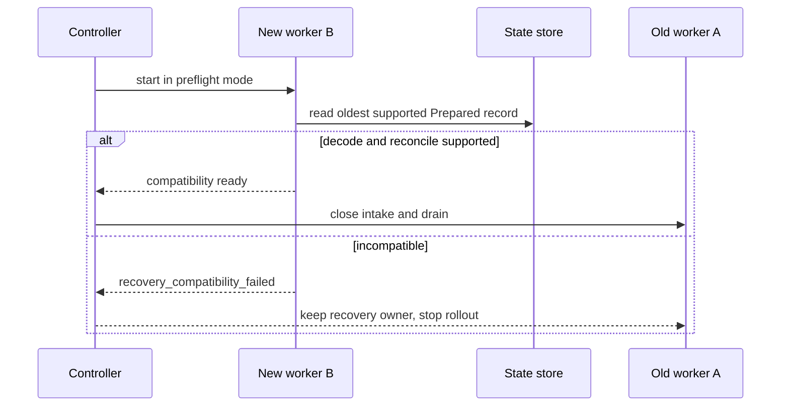

# 40장. crash recovery 배포 실습: 죽은 worker가 남긴 효과를 어떻게 판정할까

> **실습 상태 — 두 증거를 분리한다.** 아래 Python wrapper는 현재 저장소의 durable receiver fixture를 실행한다. `labs/volume-3/kubernetes`의 Kustomize manifest는 local YAML oracle로 정적 검증했다. 이 checkout에서는 Kubernetes cluster·CNI·Pod·외부 receiver를 실행하지 않았으므로 rolling deployment와 NetworkPolicy enforcement는 아직 runtime 관측이 아니다.

## 먼저 재현할 세 경계

아래 명령은 저장소 루트에서 실행하는 실제 회귀 테스트다. 로컬 loopback의 검색·권한·근거 gate·SQLite 수신자와 장애 행렬을 검사하며 외부 서비스에는 연결하지 않는다.

```bash
python3 research/agents/fixtures/run_volume3_labs.py
```

이 명령은 현재 checkout에서 실제 경로와 옵션을 확인해 실행했다.

관찰할 것은 `exit 0` 하나가 아니다.

- 검색 후보와 근거가 같은 generation인가?
- effect 직전에 정책을 다시 읽었는가?
- 취소 요청과 acknowledgement가 각각 있는가? loser 잔여 작업은 얼마인가?
- connection lost 뒤 receiver row는 `prepared`인가 `applied`인가?
- 재시작 lookup에서 receipt와 `apply_count`가 유지되는가?
- telemetry가 빠져도 receipt를 독립적으로 찾을 수 있는가?

대표 불변식은 정상 실행의 이벤트 18개, 후보 3개, 권한 허용 2개, 검증 근거 1개, 실행 갈래 3개, durable receipt 1개다. commit 전 crash는 재시작 직후 count 0, 같은 key의 복구 뒤 count 1이었다. commit 후 응답 전 crash는 최초부터 count 1이었고 duplicate retry 뒤에도 1이었다. 근거 해시가 빠진 paired run은 정책 allow에도 수신자를 시작하지 않았다.

이 숫자들은 단일 호스트 실험의 사후조건이다. 다중 replica 합의, 외부 SaaS의 원자성, 분산 exactly-once, production scheduler의 강제 취소를 증명하지 않는다.

분산 에이전트에서 가장 비싼 질문은 “이 도구 호출은 실행됐는가?”다. worker가 살아 있으면 local log가 답처럼 보인다. 그러나 receiver가 외부 상태를 바꾼 직후 worker, node, network, exporter 중 하나가 죽으면 log는 마지막 사실이 아니다. 이 장은 배포·drain·재시작·reconciliation을 하나의 실습으로 묶는다. recovery가 새로운 효과를 만들지 않게 하기 위해서다.

## 40.1 네 종류의 종료를 구별한다

|사건|local worker가 아는 것|receiver가 아는 것|안전한 terminal|
|---|---|---|---|
|apply 전 kill|attempt 시작|아무 key 없음|receiver contract에 따라 retry 가능|
|apply 후 kill|prepared만 있음|receipt 있음|Unknown → reconcile → Committed|
|receipt 후 journal 전 kill|response는 받음|receipt 있음|Unknown 또는 pending persist → reconcile|
|drain deadline|context cancel|미지|Unknown; cancel은 abort가 아님|



local ledger는 receiver보다 덜 권위 있다. `Prepared`는 외부 효과가 될 가능성이 있음을 뜻한다. `Failed`는 worker가 더 실행하지 못했다는 뜻일 뿐, receiver가 적용하지 않았음을 뜻하지 않는다. receiver lookup이 없는 tool이라면 시스템은 무엇을 할 수 있는지, 그리고 무엇을 할 수 없는지를 documentation에 명시해야 한다.

## 40.2 deploy 과정은 effect protocol의 일부다

rolling update는 새 pod가 ready가 된 뒤 old pod를 없애는 lifecycle로 보이지만, AgentRun에는 in-flight logical call이 있다. readiness가 단지 HTTP server open을 의미하면 새 version이 old state schema 또는 receiver contract를 읽지 못할 수 있다. 반대로 old version을 너무 오래 살리면 오래된 policy와 tool schema가 계속 effect를 만들 수 있다.

|단계|controller의 의무|worker의 의무|receiver의 의무|
|---|---|---|---|
|preflight|schema·policy·credential compatibility|새 work claim 금지 전 준비|versioned request 수용성 확인|
|ready|새 revision을 traffic에 포함|current contract로 claim|idempotency schema 유지|
|drain|old intake 닫기|claim 금지·inflight record|기존 key lookup 유지|
|deadline|orphan 목록 생성|cancel signal 기록|cancel과 abort 구분|
|reconcile|new owner가 unknown sweep|same logical identity 사용|receipt 또는 no-apply 답변|

Kubernetes controller의 work queue도 shutdown 때 intake를 닫고 worker를 기다린다. 하지만 platform의 graceful shutdown만으로 receiver effect의 정확성을 얻을 수는 없다. process가 정상 종료 신호를 받지 못하는 kill, node loss, partition을 별도 fault로 다뤄야 한다.

### Kubernetes manifest가 확인하는 범위와 확인하지 못하는 범위

이 책의 최소 manifest는 `Deployment`의 `maxUnavailable: 0`, `maxSurge: 1`, `minReadySeconds`, `terminationGracePeriodSeconds: 30`, TCP readiness/liveness, `preStop` hook, 두 replica와 `minAvailable: 1` PDB를 선언한다. 이 조합은 controller가 새 Pod ready 이후 old Pod를 줄일 수 있는 object-level 조건을 표현한다. 하지만 bundled HTTP fixture의 `preStop`은 hook 문법만 보이며, AgentRun intake close나 durable `Prepared` flush를 구현하지 않는다.

```bash
npm run verify:kubernetes-lab
```

이 명령은 cluster를 만들지 않는다. baseline selector·PDB·Service·NetworkPolicy·RBAC·quota·probe·rolling-update 조건과 intentional selector mismatch를 읽는 local oracle이다. 실제 kind/staging 적용은 35장의 disposable-cluster 경계에서만 수행하고, 그때도 `rollout status`를 receipt reconciliation의 성공으로 사용하지 않는다.

## 40.3 실습 환경을 고정한다

이 절부터 나오는 `recovery-lab` 블록은 제품 CLI가 아니라 배포 구현에 옮길 **설명용 명령**이다. 위의 실제 회귀 테스트가 crash window와 receipt 사후조건을 검사한다. 이 설계 실습은 disposable receiver와 version A/B worker를 가정한다. A와 B는 동일한 logical call/idempotency schema를 읽고, B는 A가 남긴 `Prepared` record를 reconciliation할 수 있어야 한다. 실습 전에 image digest, policy revision, receiver schema revision을 기록한다.

```bash
export LAB_DIR="$(mktemp -d ./recovery-lab.XXXXXX)"
recovery-lab init --dir "$LAB_DIR" --worker-version A --receiver-version 1
recovery-lab doctor --dir "$LAB_DIR" --json | jq .
recovery-lab deploy --dir "$LAB_DIR" --version A
```

expected oracle은 doctor가 green이라는 한 줄이 아니다. worker A가 receiver version 1, policy revision, current state schema를 명시적으로 보고해야 하며, receiver idempotency table이 reboot와 process restart 사이에 유지돼야 한다. memory-only map으로 만든 dedup은 pod restart 후 두 번째 효과를 허용하므로 이 실습의 receiver가 될 수 없다.

## 40.4 fault injection A: apply 뒤 강제 종료

고정 key를 가진 effect를 만들고, receiver apply 직후 lab process만 강제 종료한다. 실제 service deployment나 다른 사용자의 worker를 kill하지 않는다.

```bash
recovery-lab start --dir "$LAB_DIR" --run-id recover-1 --logical-call-id call-1 \
  --idempotency-key key-1 --failpoint after-receiver-apply || true
recovery-lab inspect --dir "$LAB_DIR" --run-id recover-1 --json | jq .
recovery-lab receipt --dir "$LAB_DIR" --key key-1 --json | jq .
```

oracle은 local disposition이 `Unknown`, receiver `apply_count=1`, durable receipt 존재다. `exit 137` 또는 pod restart count는 원인이 아니라 신호다. 이 상태에서 자동 retry가 새로운 key로 apply하면 fixture는 실패해야 한다.

## 40.5 fault injection B: version A에서 B로 drain

```bash
recovery-lab deploy --dir "$LAB_DIR" --version B --strategy rolling
recovery-lab drain --dir "$LAB_DIR" --version A --deadline-seconds 5
recovery-lab reconcile --dir "$LAB_DIR" --worker-version B
recovery-lab audit --dir "$LAB_DIR" --json | jq .
```

expected oracle은 다음 다섯 가지다.

1. B가 ready가 되기 전 A의 intake를 닫지 않는다.
2. drain 뒤 A의 new claim count는 0이다.
3. A가 남긴 `Unknown`을 B가 같은 key로 lookup한다.
4. B가 receipt를 받으면 local record만 보정하고 receiver apply를 새로 하지 않는다.
5. schema가 호환되지 않으면 rollout은 “일단 재시작”하지 않고 preflight에서 stop한다.

### fault injection C: receiver lookup도 실패한다

receiver query endpoint를 끊고 reconciliation을 시도한다. 결론은 `Failed`가 아니라 `Unknown`의 지속이다. 운영자는 backoff, deadline, escalation queue를 설정할 수 있지만 effect가 없었다고 선언할 권한은 없다. 이때 retry schedule은 queue를 무한히 채우지 않도록 bounded attempt와 jitter를 가져야 한다.

|상태|자동 조치|금지 조치|escalation 조건|
|---|---|---|---|
|Prepared|lookup 시작|새 key apply|deadline 경과|
|Unknown + receipt|commit reconcile|duplicate execute|없음|
|Unknown + no reply|backoff lookup|abort 단정|retry budget 소진|
|Unknown + no-apply proof|same-key retry 가능|다른 effect 생성|business invariant 불명|

## 40.6 cleanup과 운영 packet

실습 종료 전 final receipt, deployment revision, orphan list, reconciliation attempts를 export한다. 이것이 rollback 판단의 근거다. 그 뒤에만 disposable lab directory를 제거한다.

```bash
recovery-lab export --dir "$LAB_DIR" --out "$LAB_DIR/recovery-evidence.json"
jq '{deployments,orphans,receipts}' "$LAB_DIR/recovery-evidence.json"
rm -rf "$LAB_DIR"
```

운영 packet에는 영향을 받은 logical calls, known receipt, unknown count, receiver query availability, deploy revision, 정책 변경 여부를 포함한다. 텍스트 로그의 “success”를 packet의 verdict로 쓰지 않는다.

## 40.7 체크리스트와 비보장

- [ ] worker exit, cancellation, timeout, receiver abort를 서로 다른 event로 기록하는가?
- [ ] receiver idempotency state가 worker lifetime 밖에 durable한가?
- [ ] reconcile이 stable key를 lookup하고 duplicate apply를 하지 않는가?
- [ ] rollout compatibility가 readiness 전 검사되는가?
- [ ] drain 후 new claim이 막히고 orphan이 명시되는가?
- [ ] receiver lookup failure가 Unknown을 성공이나 abort로 바꾸지 않는가?

이 실습은 receiver가 정직하고 durable하다는 가정 아래에서 crash-window를 다룬다. distributed transaction, atomic rollback, multi-receiver saga의 compensation, regional catastrophe 복구, business-level duplicate detection은 별도 설계가 필요하다. “exactly once”라는 말을 쓰려면 어느 receiver의 어떤 key space에서, 어떤 persistence failure를 제외하고 말하는지 반드시 한정해야 한다.

## 40.8 recovery queue를 운영하는 법

Unknown은 사람이 보기에 불편한 상태라서 종종 자동 failure로 정리된다. 하지만 recovery queue는 시스템이 모르는 것을 보존하는 안전 장치다. 각 entry에는 `next_lookup_at`, `attempt_count`, `logical_call_id`, `idempotency_key`, `receiver_endpoint_revision`, `deadline`, `escalation_owner`가 있어야 한다. queue는 단순 cron이 아니라 receiver의 권위 있는 답을 기다리는 업무 원장이다.

|조건|다음 행동|기록할 증거|금지|
|---|---|---|---|
|receipt 확인|local commit reconcile|receipt ID와 lookup time|새 apply|
|명시적 no-apply|same-key retry 검토|receiver signed/authoritative reply|blind retry|
|lookup timeout|bounded backoff|network/provider disposition|abort 단정|
|budget 소진|human escalation|run·policy·effect context|Unknown 삭제|

recovery worker의 concurrency도 tenant·receiver별로 제한한다. 대규모 network incident 뒤 수천 개의 Unknown이 동시에 receiver lookup을 하면, 복구기가 원래 receiver outage를 더 악화시킬 수 있다. 또한 lookup retry의 trace가 많아지면 telemetry backend가 먼저 포화할 수 있으므로, high-cardinality key를 metric label에 넣지 않고 aggregate queue age와 reason count로 관찰한다.

## 40.9 schema migration의 역호환성

rollout 중 가장 위험한 것은 code binary가 아니라 persisted record 형식이다. 새 worker가 old `Prepared` event를 읽지 못하면 crash 이후 recovery 자체가 멈춘다. migration은 record reader가 old schema를 이해하는 기간, writer가 새 mandatory field를 쓰는 시점, receiver가 old/new idempotency digest를 비교하는 규칙을 명시해야 한다.



안전한 순서는 보통 reader-first, writer-second, cleanup-last다. 먼저 B가 schema 1과 2를 읽을 수 있게 배포한다. 그 뒤 새 writer를 켜 schema 2를 쓴다. 마지막으로 모든 old record의 recovery window가 끝난 뒤에만 schema 1 reader를 제거한다. 이 절차는 DB migration에만 해당하지 않는다. tool argument digest, policy revision field, trace correlation field도 recovery가 읽는 persisted contract다.

### migration fault injection

lab receiver에 schema 1 `Prepared` record를 남긴 다음 B를 배포한다. B가 record를 parse하지 못하면 rollout oracle은 error log가 아니라 `recovery_compatibility_failed`다. 이 상태에서 old worker를 강제로 죽이면 Unknown이 영구 orphan이 되므로, controller는 compat failure에서 rollout을 중단해야 한다.

```bash
recovery-lab seed-old-record --dir "$LAB_DIR" --schema 1 --key legacy-key
recovery-lab deploy --dir "$LAB_DIR" --version B --require-recovery-compatibility || true
recovery-lab audit --dir "$LAB_DIR" --json | jq '.compatibility'
```

## 40.10 rollback도 reconciliation을 필요로 한다

rollback은 code version을 되돌리는 행위이지 시간 여행이 아니다. B가 만든 state revision 또는 receiver receipt는 A가 모를 수 있다. 따라서 rollback plan은 A가 B의 records를 읽는지, 그렇지 않다면 recovery worker를 B로 유지하는지, in-flight execution을 어느 revision에서 drain하는지를 포함해야 한다. “kubectl rollout undo”만으로 effect semantics가 되돌아간다고 말할 수 없다.

## 40.11 실행 가능한 회귀 명령을 사후조건까지 읽는다

저장소 루트에서 다음 한 줄을 실행한다.

```bash
python3 research/agents/fixtures/run_volume3_labs.py
```

wrapper는 durable receiver crash/restart, effect admission, 조정 budget, 배포 운영 계약을 고정된 test 목록으로 실행한다. `20 passed`는 시작점이다. 어떤 assertion이 어느 위험을 막는지 읽어야 한다.

| assertion 계열 | 주입 | 확인하는 durable postcondition |
|---|---|---|
| crash before commit | child 종료 | restart 직후 apply count 0 |
| crash after commit | response 전 종료 | receipt와 apply count 1 |
| duplicate retry | 같은 key 재전송 | count가 계속 1 |
| policy revoke | effect 직전 revision 변경 | receiver 시작 전 거절 |
| telemetry loss | exporter event drop | receipt와 verdict 유지 |
| correlated agents | 같은 evidence 공유 | 독립 evidence로 중복 계산 금지 |

경고가 출력되더라도 deprecation warning과 assertion failure를 구분한다. test runner exit code, failed count, warning 종류, 실행 시간을 transcript에 함께 남긴다.

### 직접 구현할 때의 최소 receiver

```sql
CREATE TABLE effects (
  tenant TEXT NOT NULL,
  effect_key TEXT NOT NULL,
  action_digest TEXT NOT NULL,
  highest_fence INTEGER NOT NULL,
  apply_count INTEGER NOT NULL CHECK (apply_count = 1),
  receipt_id TEXT NOT NULL,
  committed_at TEXT NOT NULL,
  PRIMARY KEY (tenant, effect_key)
);
```

`INSERT ... ON CONFLICT`에서 기존 action digest가 다르면 old receipt를 돌려주지 말고 key collision으로 거절한다. 같은 key·같은 digest라면 기존 receipt를 반환한다. 이 transaction 안에서 business row mutation과 receipt를 함께 commit할 수 없다면 정확한 원자성 경계를 문서화한다.

```python
def reconcile(prepared):
    receipt = receiver.lookup(prepared.tenant, prepared.effect_key)
    if receipt and receipt.action_digest == prepared.action_digest:
        ledger.commit(prepared.logical_call_id, receipt)
        return "Committed"
    if receipt:
        return "KeyCollision"
    if receiver.proves_not_applied(prepared.effect_key):
        return "RetryableSameKey"
    return "Unknown"
```

lookup의 404가 no-apply proof인지 retention expiry인지 계약으로 정하지 않았다면 마지막 분기로 간다.

### rolling deploy에서 schema compatibility 검사



readiness probe는 빈 새 record만 읽어서는 안 된다. 배포 중 실제로 남을 수 있는 가장 오래된 schema, idempotency digest version, policy field를 fixture로 넣는다. writer 전환은 모든 reader가 새 field를 이해한 뒤에 한다. required field 삭제는 old writer가 사라지고 retention window가 지난 뒤에 한다.

### 실제 장애 명령의 안전 경계

process kill을 자동화할 때 PID가 lab child인지 부모 PID와 executable path로 검증한다. temporary directory는 생성 직후 canonical path가 repository 아래인지 확인한다. network fault는 적용 전 rule inventory를 저장하고 정확히 생성한 rule만 제거한다. cleanup 뒤에는 port bind 시도와 process wait로 survivor 0을 확인한다.

Kubernetes manifest의 intentional-defect overlay도 같은 원칙을 따른다. selector/template label 불일치는 local oracle로만 검출하며 실제 cluster에 apply하지 않는다. 이 음성 검사는 API-level rollout contract의 한 조항을 확인할 뿐, CNI의 network isolation, image pull, Pod scheduling, graceful termination, receiver lookup을 대신하지 않는다.

### lab 판정 체크리스트

- [ ] 첫 실패 command의 exit code와 receiver postcondition을 분리했는가?
- [ ] crash window마다 local disposition과 apply count를 함께 검사하는가?
- [ ] 재시작이 같은 effect key와 tenant를 유지하는가?
- [ ] B가 A의 가장 오래된 pending schema를 읽는가?
- [ ] rollback 뒤에도 B가 만든 receipt를 조회할 경로가 있는가?
- [ ] telemetry를 끊은 trial에서도 receiver 진실값이 유지되는가?
- [ ] cleanup 전 evidence export, cleanup 후 survivor 0을 확인했는가?

이 실습의 핵심 산출물은 성공 로그가 아니라 `(prepared record, receiver receipt, reconciliation decision, cleanup proof)` 묶음이다. 네 항목이 있어야 다른 runtime으로 옮겨도 같은 crash 경계를 비교할 수 있다.

### 실패를 읽는 예

`apply_count=2`면 test retry 설정부터 고치기 전에 두 row의 effect key와 action digest를 비교한다. key가 달라졌다면 logical identity 전파 실패, key는 같은데 두 번 적용됐다면 receiver atomicity 실패다. receipt는 하나인데 local `Committed`가 둘이면 reducer의 duplicate event 처리 문제다. 같은 “중복”도 owner가 다르다.

`Unknown`이 영구히 남을 때는 lookup endpoint 장애, retention으로 사라진 receipt, tenant scope 불일치, schema decode 실패를 차례로 분리한다. 조회가 성공할 때까지 blind retry하지 않는다. 사람이 판정해야 한다면 action target, 최대 손실, compensation 가능성, 승인자를 repair queue에 함께 넣는다.

CI에서는 빠른 deterministic test를 매 commit에, 실제 child kill과 restart test를 야간에 실행할 수 있다. 두 suite의 oracle은 같아야 하지만 실행 증거 등급은 다르다. simulation 통과를 process crash 관측으로 표기하지 않는다.

|rollback 질문|필요한 답|
|---|---|
|A가 B record를 읽는가?|reader compatibility test|
|B가 만든 receipt를 A가 resolve하는가?|stable receipt schema|
|drain deadline 뒤에는 누가 sweep하는가?|named recovery worker revision|
|policy가 되돌아갔는가?|separate policy revision audit|
|tool receiver가 되돌아갔는가?|receiver contract check|

이 표는 rollback을 늦추기 위한 절차가 아니다. 이미 외부에 나간 효과에 대해 되돌릴 수 있는 것과 없는 것을 분리해, 안전한 대응을 빠르게 하기 위한 절차다.

## 원전 바로가기

- [Temporal worker graceful shutdown](https://github.com/temporalio/sdk-go/blob/213f751d5117fd5621ef6dd55a21b78d605c9696/internal/internal_worker_base.go#L899-L929)
- [Kubernetes rollout reconciliation](https://github.com/kubernetes/kubernetes/blob/98e9da3000734733127c8ac3bdb77b42ad61c31b/pkg/controller/deployment/deployment_controller.go#L572-L659)
- [Pi agent loop의 event-to-state path](https://github.com/badlogic/pi-mono/blob/853a80d26c90a14c1886f0ebb8ffaae133ca2185/packages/agent/src/agent-loop.ts#L156-L273)
