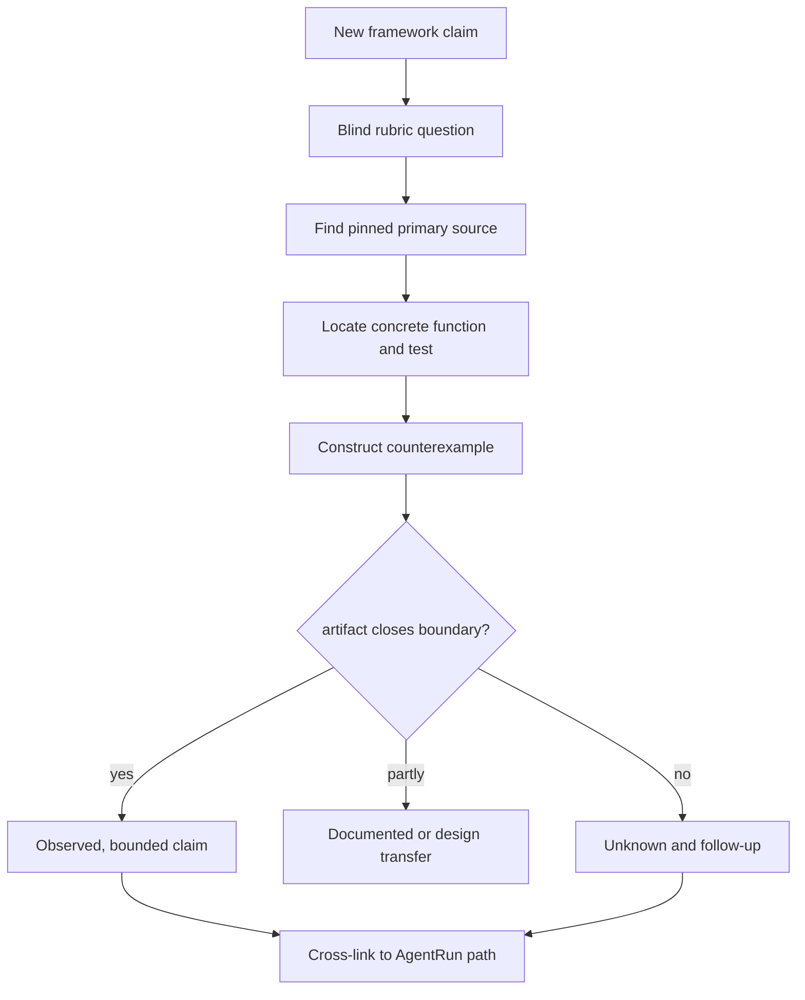
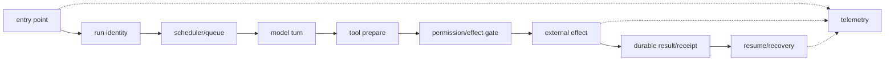
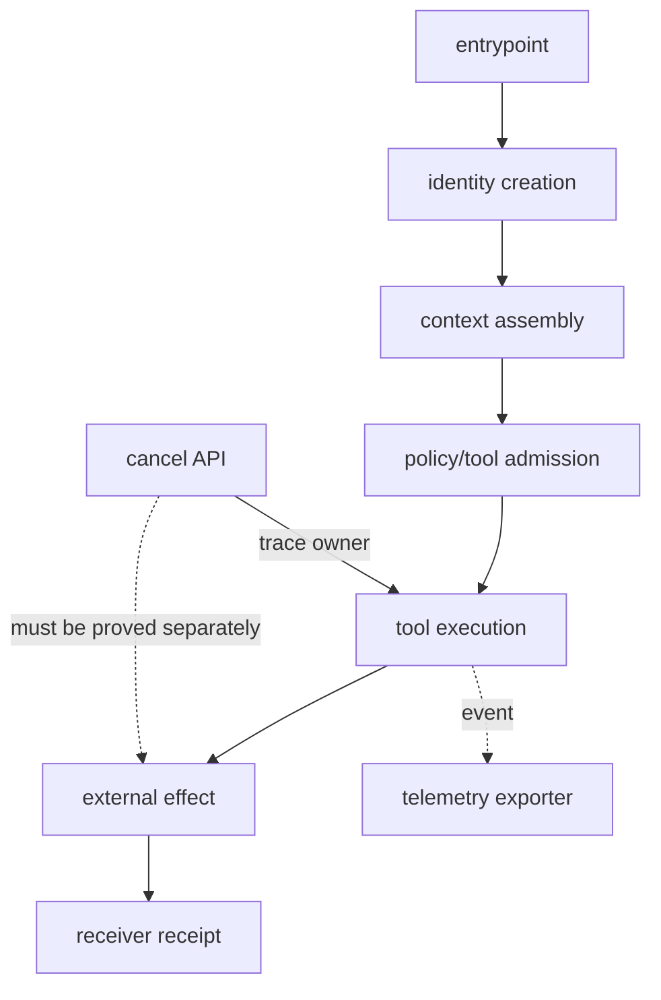

# 41장. 새 프레임워크 해부법: 이름이 아니라 실행 계약을 읽는 맹검 루브릭

새 agent framework가 나올 때마다 “멀티 에이전트”, “autonomous”, “durable”, “memory”, “secure”라는 말이 먼저 보인다. 이 말들은 출발점일 뿐 증거가 아니다. 이 장은 브랜드와 벤치마크 headline을 가리고도 framework를 조사할 수 있는 맹검 루브릭을 제시한다. 목적은 순위를 매기는 데 있지 않다. 어떤 주장에 어떤 코드·문서·실행 trace가 필요한지, 발견하지 못한 경계를 어떻게 `unknown`으로 남길지 배우는 데 있다.

## 41.1 조사 전에 금지할 것

framework를 처음 볼 때 README의 architecture diagram을 implementation proof로 읽지 않는다. quickstart가 한 번 성공했다고 retry, cancellation, authorization, multi-tenant isolation이 증명된 것도 아니다. 또 “지원하지 않는다”는 결론도 코드 검색 한 번으로 내리지 않는다. public source에 보이지 않는 managed service behavior와, 실제로 구현되지 않은 기능은 다른 상태다.

|결론 등급|허용되는 근거|표현 예|
|---|---|---|
|Observed|pinned source + 재현 가능한 실행 artifact|“이 revision의 이 함수는 … 한다”|
|Documented|공식 versioned 문서/명세|“공식 문서는 … 를 계약으로 적는다”|
|Design transfer|다른 원전에서 가져온 적용 제안|“이 구조에 적용하려면 … 가 필요하다”|
|Unknown|공개 근거가 없거나 경계가 닫히지 않음|“이 자료만으로는 판정 불가”|

`Observed`와 `Documented`를 합쳐 “보장”이라고 쓰지 않는다. test는 특정 input을 통과한 evidence이고, code는 해당 revision의 경로를 보여 주며, 제품 운영 환경은 그 밖의 deployment policy를 가질 수 있다.

## 41.2 맹검 루브릭: 열두 개의 질문

|축|질문|찾을 artifact|대표 반례|
|---|---|---|---|
|run identity|Run과 attempt를 분리하는가|state type·event schema|retry마다 새 run|
|state ownership|누가 state를 write하는가|reducer/CAS/transaction|마지막 writer wins|
|context|prompt 조립과 compaction이 revisioned인가|context builder·tests|요약이 authority를 덮음|
|tool schema|인수 검증과 capability가 분리되는가|schema·registry·permission gate|모델 JSON=권한|
|approval|digest·scope·expiry·revision을 묶는가|approval type·recheck|넓은 승인 재사용|
|effect|logical call/key/receipt가 있는가|receiver contract·idempotency test|timeout=abort|
|retry|attempt budget와 classification이 있는가|backoff code·error taxonomy|무한 retry|
|parallelism|loser cancel과 budget accounting이 있는가|scheduler·cancellation path|fan-out이 항상 빠름|
|memory|tenant·freshness·deletion lifecycle이 있는가|key derivation·tombstone|embedding 삭제=모두 삭제|
|retrieval|candidate와 admissible evidence를 구분하는가|filter·provenance·temporal gate|top-1=답|
|observation|trace와 authority ledger를 분리하는가|exporter·receipt store|span 없음=미실행|
|deployment|drain·orphan·compatibility가 있는가|shutdown·rollout code|restart=복구|



## 41.3 조사 순서: README에서 시작하되 거기서 끝내지 않는다

첫 번째 pass에서는 README와 package manifest에서 language, entry point, example, test command, version을 기록한다. 두 번째 pass에서는 state loop를 찾는다. `run`, `step`, `execute`, `reduce`, `dispatch`, `resume`, `checkpoint`라는 이름은 유용한 search seed지만 증거는 아니다. 실제로 state를 mutate하는 함수, append-only event, transaction boundary, resume token을 확인한다. 세 번째 pass에서 tool registration과 transport, 네 번째 pass에서 retry/cancel/shutdown, 다섯 번째 pass에서 observability를 읽는다.

```bash
export REPO_DIR="$(pwd)/framework-under-review"
git -C "$REPO_DIR" rev-parse HEAD
rg -n "idempot|receipt|logical.?call|retry|cancel|drain|lease|fenc" "$REPO_DIR"
rg -n "reduce|checkpoint|resume|transaction|compare.?and.?swap" "$REPO_DIR"
rg -n "approval|permission|capability|tenant|scope" "$REPO_DIR"
rg --files "$REPO_DIR" | rg 'test|spec|example|readme'
```

**expected oracle**은 검색 결과가 많이 나오는 것이 아니다. 각 claim마다 revision hash, relative path, line range, function/class, input/output, failure mode를 하나의 evidence card로 적는 것이다. line range가 넓어 함수의 역할을 숨기면 다시 좁힌다. source가 mutable branch URL이면 pinned commit URL로 바꾼다.

## 41.4 한 주장씩 반례를 먼저 만든다

“durable workflow”라는 claim을 볼 때는 다음 반례부터 적는다. effect apply 뒤 process가 죽었을 때 receiver receipt를 어떻게 찾는가? “multi-agent”라면 두 agent가 같은 state revision을 썼을 때 충돌이 어떻게 보존되는가? “memory”라면 tenant A의 retrieval key가 B의 cache entry를 읽지 않는가? 반례가 없으면 implementation을 읽어도 기대하는 이름만 찾기 쉽다.

|claim|최소 반례|판정에 필요한 evidence|불충분한 evidence|
|---|---|---|---|
|durable|apply 뒤 kill|stable key + receiver lookup + reconcile|checkpoint log 하나|
|secure tool|prompt injection|capability/approval recheck|tool schema JSON|
|parallel|loser가 늦게 완료|cancel propagation + cost ledger|async gather|
|shared memory|tenant collision|key scope + read/write test|embedding namespace 이름|
|consensus|stale writer|CAS/quorum/fencing contract|agent vote count|
|observable|exporter outage|ledger와 telemetry loss behavior|trace screenshot|

이 테스트의 목적은 framework를 나쁘게 보이게 하는 데 있지 않다. 모든 시스템에는 범위가 있고, 범위 밖을 unknown으로 남기면 독자는 component를 안전하게 조합할 수 있다.

## 41.5 코드에서 function 단위로 읽는 법

function을 읽을 때는 “무슨 기능인가”보다 입력, state read, authority check, side effect, durable write, error classification 순서를 표로 고정한다.

|질문|기록 예|왜 필요한가|
|---|---|---|
|입력 identity|run, principal, tenant, attempt|caller가 바꿀 수 있는 좌표 확인|
|읽는 revision|state/policy/schema/index|stale 판단의 기준|
|검사|schema, scope, expiry|자연어 지침이 아닌 gate 찾기|
|외부 호출|receiver, provider, queue|effect 경계 표시|
|persist|event/receipt/checkpoint|crash window 계산|
|오류 분류|retryable, rejected, unknown|재시도와 escalation 규칙|

예를 들어 loop가 `try { tool() } catch { retry() }`로 끝나면 질문은 두 가지다. tool이 receiver에서 이미 적용됐는가? catch가 어떤 error를 retryable로 묶는가? idempotency key를 상위 logical call에서 받지 않으면 retry는 framework가 아니라 tool provider의 우연한 dedup에 기대게 된다.

## 41.6 실습: 맹검 scorecard를 작성한다

다음 JSON은 비교 점수가 아니라 investigation ledger다. `status`는 pass/fail 대신 Observed/Documented/Unknown을 쓴다. failure reproduction이 없다면 capability 점수를 주지 않는다.

```json
{
  "claim": "effect recovery",
  "status": "Unknown",
  "source_revision": "<40-hex commit>",
  "anchor": "path/to/file:line-line",
  "counterexample": "worker dies after receiver apply",
  "observed_boundary": "local retry only",
  "missing_evidence": "durable receiver receipt lookup",
  "follow_up": "run controlled failpoint test"
}
```

scorecard의 값이 `Unknown`인 것은 실패가 아니다. 가장 위험한 scorecard는 빈 칸을 pass로 채우는 것이다. 기술 선택은 각 unknown을 조직의 추가 component, 운영 절차, vendor 계약으로 닫을 수 있는지에 따라 결정한다.

### fault injection: README happy path를 뒤집는다

새 framework example을 복사해 실험할 때는 다음 순서로 한 항목만 바꾼다.

1. model 응답 대신 invalid tool argument를 돌려 schema gate를 확인한다.
2. tool response 전에 cancellation을 보내고 remote receiver가 실제 중단됐는지 따로 확인한다.
3. tool apply 뒤 local process를 종료하고 restart/resume path를 확인한다.
4. 동일 idempotency key와 다른 attempt를 보내 dedup을 확인한다.
5. trace exporter를 끄고 effect ledger가 verdict를 유지하는지 확인한다.

각 fault의 expected oracle은 final prose가 아니라 typed state transition, receiver receipt, conflict rejection, telemetry-loss record다. framework가 그런 artifact를 노출하지 않으면 “나쁘다”고 추측할 것이 아니라 조사 가능한 관측 경계가 부족하다고 기록한다.

## 41.7 비교표를 공정하게 만드는 법

두 framework의 API 모양이 다르면 field 이름을 억지로 맞추지 않는다. 대신 동일한 counterexample에 대한 evidence 형태를 맞춘다. A에 `receipt` API가 있고 B에는 external store adapter만 있다면 A는 observed boundary, B는 design-transfer requirement로 쓴다. B가 반드시 unsafe라는 뜻은 아니다. 다만 adapter의 receiver contract를 별도 조사하지 않고 동등하다고 말할 수 없다는 뜻이다.

|비교 항목|A|B|공정한 결론|
|---|---|---|---|
|run resume|checkpoint observed|문서의 resume claim|동등 보장으로 합치지 않음|
|tool policy|inline schema|external gateway|권한 owner가 다름|
|effect retry|key observed|미확인|B는 Unknown|
|telemetry|spans observed|logs only|effect evidence와 별도 평가|

## 41.8 낯선 코드베이스를 90분 안에 세로로 자른다

첫 15분에는 commit, build manifest, package lock, entry point만 고정한다. 다음 20분에는 한 request가 run identity를 얻어 model loop로 가는 경로를 찾는다. 이어서 tool dispatch와 permission hook, cancellation signal, persistence, telemetry를 차례로 잇는다. 파일 수를 많이 읽는 것보다 한 request의 세로 경로를 끊기지 않게 만드는 편이 먼저다.

```bash
git -C "$REPO_DIR" rev-parse HEAD
rg -n "class .*Agent|func .*Run|async .*run|session.?id|run.?id" "$REPO_DIR"
rg -n "tool.*execute|dispatch|beforeTool|permission|sandbox" "$REPO_DIR"
rg -n "AbortSignal|context\.Cancel|cancel|shutdown|drain" "$REPO_DIR"
rg -n "checkpoint|resume|append|jsonl|transaction|receipt" "$REPO_DIR"
rg -n "trace|span|metric|event.*emit|retry|backoff" "$REPO_DIR"
```

이 명령은 symbol 후보를 찾을 뿐 capability를 증명하지 않는다. 후보 함수의 caller와 callee를 읽어 실제 mutation·외부 호출·durable write가 어디서 일어나는지 좁힌다.

### 함수 카드

| 필드 | 기록할 내용 |
|---|---|
| identity in/out | session, run, attempt, logical call 중 무엇을 받는가 |
| scheduling | single active run, queue, pool, distributed lease 중 무엇인가 |
| cancellation | signal 전달 대상과 무시될 때의 경계 |
| authority | 기본 정책인지 선택 hook인지, effect 직전 재검사인지 |
| persistence | append 시점, fsync/transaction, resume generation |
| failure | retry 분류, backoff, unknown 보존, compensation |
| evidence | pinned URL, 함수명, 좁은 행 범위, 실행 test |
| negative boundary | 이 함수가 보장하지 않는 가장 가까운 오해 |

예컨대 dispatcher가 `tool.execute(args, signal)`을 호출한다면 cancellation propagation은 관측된다. 하지만 tool이 signal을 무시할 때 강제 종료되는지는 별도다. `beforeToolCall` hook이 있으면 차단 지점은 있지만 기본 sandbox가 있다는 뜻은 아니다. append-only JSONL session이 있으면 transcript resume는 가능하지만 외부 effect exactly-once는 아니다.

### negative boundary를 쓰는 법

“기능 없음”은 repository 전체를 충분히 조사하지 않으면 위험한 주장이다. 대신 “인용한 core dispatch path에는 permission decision이 없고 optional hook으로 위임한다”처럼 경로 한정 문장을 쓴다. example extension의 sandbox를 core default로 승격하지 않고, test double의 동작을 production implementation으로 쓰지 않는다.



각 edge에 source span이 없으면 `Unknown`으로 남긴다. README 문장을 대신 붙이지 않는다.

### test 선택 순서

1. provider를 부르지 않는 unit test로 lifecycle event와 active-run guard를 본다.
2. parallel/sequential tool test로 ordering과 result persistence 순서를 본다.
3. cancellation test로 signal이 provider·hook·tool 어디까지 가는지 본다.
4. session codec test로 corrupt/future schema의 fail-closed 여부를 본다.
5. retry test로 provider error와 tool effect error가 섞이지 않는지 본다.
6. sandbox/approval test로 ceiling과 pending·deny 처리를 본다.

test runner가 설치되지 않았다면 제품 실패로 쓰지 않는다. checkout, lockfile, missing executable, 시도한 정확한 command를 execution blocker로 보존한다. 의존성을 임의 설치하면 pinned 환경이라는 조건이 바뀌므로 별도 승인된 run으로 취급한다.

### 두 프레임워크를 비교할 때의 함정

process-local queue와 durable distributed work queue를 모두 “scheduler 있음”으로 표시하면 중요한 차이가 사라진다. steering queue와 inter-agent handoff, AbortSignal과 forced process termination, lifecycle event와 durable telemetry export도 각각 분리한다. 비교 행은 같은 이름이 아니라 같은 counterexample을 기준으로 맞춘다.

| counterexample | 물을 source path | runtime oracle |
|---|---|---|
| prompt 중복 호출 | active-run guard | 둘째 호출 typed reject |
| parallel tool 하나 실패 | batch finalizer | result order·error 보존 |
| tool이 cancel 무시 | process/sandbox owner | deadline 뒤 survivor 여부 |
| restart 뒤 pending session | loader/reducer | transcript와 effect 분리 |
| exporter 실패 | sink/backpressure | run 결과와 drop counter 독립 |
| stale approval | effect-time gate | receiver 미호출 |

### autopsy 종료 조건

- 핵심 아홉 축마다 direct source span 또는 명시적 조사 blocker가 있다.
- source URL은 mutable branch가 아니라 commit과 행 범위를 가진다.
- 최소 한 개의 정상 경로와 한 개의 실패 경로 test를 실제 실행했다.
- docs claim, source observation, runtime observation을 같은 evidence grade로 섞지 않았다.
- optional extension과 core default, transcript와 effect receipt를 구별했다.
- 모든 temporary credential, process, checkout을 안전한 범위에서 정리했다.

좋은 코드 autopsy는 scorecard를 빈틈없이 채우려 하지 않는다. 직접 확인한 세로 경로는 깊게 쓰고, 확인하지 못한 경계는 다음 사람이 곧바로 시험할 수 있을 정도로 정확하게 남긴다.

## 41.9 cleanup과 공개 가능한 조사 패키지

조사가 끝나면 repository clone, temporary credentials, raw prompt, customer trace를 그대로 공개하지 않는다. pinned revision, path/line anchor, minimal synthetic reproduction, redacted output, scorecard를 남긴다. 기록의 재현성은 민감 데이터를 널리 복제하는 것이 아니라, 제3자가 동일 revision과 harmless fixture로 같은 경계를 검사할 수 있게 하는 것이다.

```bash
git -C "$REPO_DIR" status --short
git -C "$REPO_DIR" rev-parse HEAD > framework-revision.txt
rm -rf "$REPO_DIR/.lab-state"
```

cleanup 전에 shell variable이 예상 repo를 가리키는지 확인해야 한다. shared checkout, home directory, cache root를 recursive delete하는 것은 조사 절차의 범위가 아니다.

## 41.10 최종 체크리스트와 비보장

### 30분 source-digging 실전표

새 프레임워크를 받으면 README의 `agent`, `task`, `memory`를 검색하는 데서 멈추지 않는다. 다음 함수 사슬을 실제 symbol로 채운다.

|분|찾을 것|합격 증거|즉시 만드는 반례|
|---:|---|---|---|
|0–5|public entry → run admission|run/attempt ID 생성 위치|같은 ID로 retry 두 번|
|5–10|context builder → model request|revision·tenant 전달|steer 직전/직후 race|
|10–15|tool registry → permission gate|schema와 authority 분리|등록됐지만 금지된 tool|
|15–20|cancel owner → handler join|phase별 terminal state|cancel-after-send|
|20–25|effect call → receiver receipt|idempotency key·재조회|commit 뒤 response drop|
|25–30|event → exporter|drop·sampling·redaction 정책|span drop 뒤 ledger 비교|



Codex에서는 thread/turn admission, tool router, parallel cancellation, child resume를 서로 다른 함수로 추적한다. pi에서는 agent loop, reducer, `AbortSignal`, 병렬 tool scheduling을 잇는다. Jikji에서는 workflow runner, remote runner, progress/checkpoint가 어느 저장 경계를 갖는지 본다. Claude Code는 공개 hook·설정·SDK 계약만 검증할 수 있으며 비공개 core scheduler와 persistence는 **모른다**고 적는다.

protocol 이름도 점검한다. MCP request ID는 JSON-RPC 상관키이고 tool의 `isError`는 tool-level failure다. A2A Task ID와 context ID는 각각 task와 contextual collection을 가리킨다. OpenTelemetry trace/span은 관측 identity다. 새 프레임워크가 이 모두를 `run_id` 하나로 저장한다면 편의상 alias인지, 충돌 방지 범위와 lifecycle이 정말 같은지 테스트해야 한다.

- [ ] 모든 source link가 pinned primary revision인가?
- [ ] marketing claim과 code observation을 같은 등급으로 쓰지 않았는가?
- [ ] 각 capability에 concrete counterexample이 있는가?
- [ ] state owner, receiver, policy owner, observer를 각각 찾았는가?
- [ ] absent code path를 기능 부재로 성급히 결론내리지 않았는가?
- [ ] unknown과 follow-up을 scorecard에 남겼는가?
- [ ] framework 간 API 명칭 대신 effect/recovery/authority 경계로 비교했는가?

이 루브릭은 private managed backend, undisclosed deployment policy, adversarial supply-chain compromise, 실제 고객 traffic에서의 tail latency를 판정하지 않는다. 또한 line anchor는 source revision의 구현을 가리킬 뿐, 그 구현이 모든 configuration에서 켜져 있음을 보장하지 않는다. 좋은 해부는 모든 답을 가장하는 문서가 아니라, 다음 실험이 어디로 가야 하는지 선명하게 만드는 문서다.

## 원전 바로가기

- [Pi agent loop: event와 state 전이](https://github.com/badlogic/pi-mono/blob/853a80d26c90a14c1886f0ebb8ffaae133ca2185/packages/agent/src/agent-loop.ts#L156-L273)
- [Pi reducer: state reduction 경계](https://github.com/badlogic/pi-mono/blob/853a80d26c90a14c1886f0ebb8ffaae133ca2185/packages/agent/src/harness/reducer.ts#L312-L391)
- [Claude Code strict settings example](https://github.com/anthropics/claude-code/blob/f275fa282e76c5e5456912268f2c367a7f4f4797/examples/settings/settings-strict.json#L1-L28)
- [SWE-bench harness: patch와 test outcome 분리](https://github.com/SWE-bench/SWE-bench/blob/9d38c55881d3ee5c25bad64d736c4440fa5b82d9/swebench/harness/run_evaluation.py#L288-L381)
- [MCP tool error 계약](https://github.com/modelcontextprotocol/modelcontextprotocol/blob/3ff697dcbea0804f3f397b864cfbbaaa10cba71a/docs/specification/2025-06-18/server/tools.mdx#L384-L430)
- [A2A canonical Task/상태 정의](https://github.com/a2aproject/A2A/blob/c0f30b35390c59d2cc398a1100823a9115b97a20/specification/a2a.proto#L150-L210)
- [OpenTelemetry GenAI agent/tool 모델의 현재 deprecated 위치](https://github.com/open-telemetry/semantic-conventions/blob/e9d0607d95d879d4c565b5a25a565fe0c995ec61/model/gen-ai/deprecated/spans-deprecated.yaml#L531-L635)
