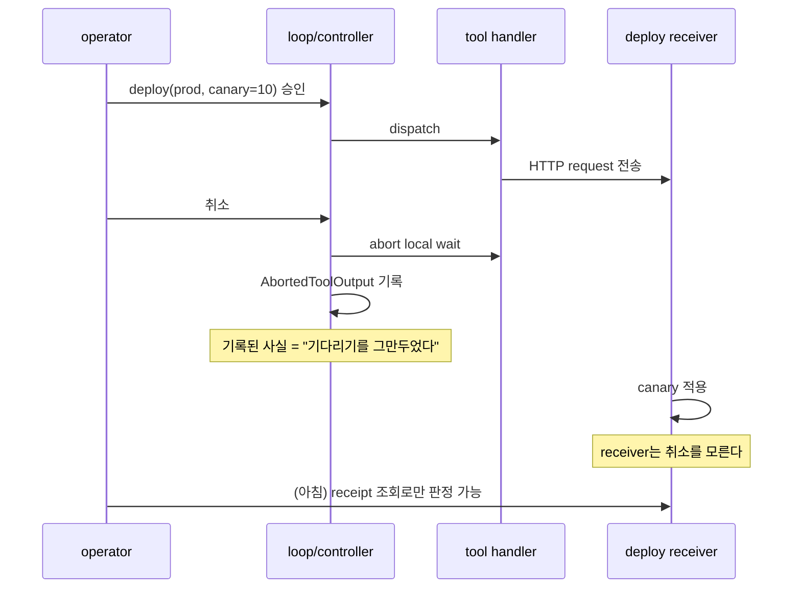
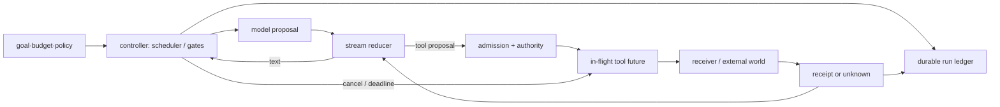
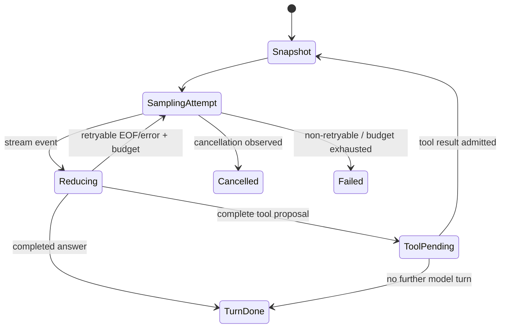
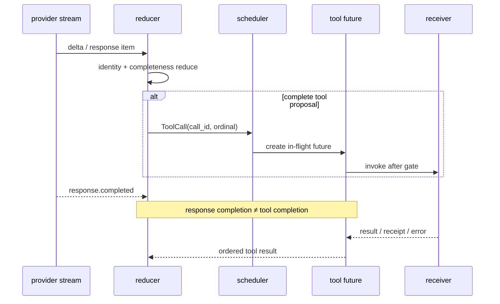
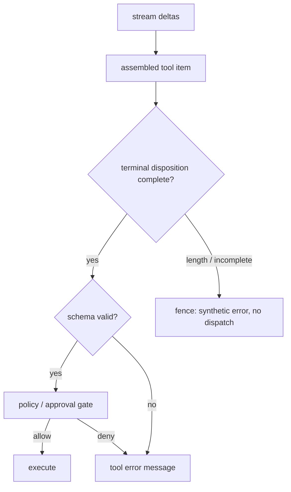

# 42장. 루프 엔지니어링: 에이전트를 제어계로 설계하는 법

에이전트의 loop는 `while (true)`가 아니다. 불완전한 관측을 받아 다음 행동을 고르고, 그 행동의 비용·위험·시간을 제한하며, 결과를 다시 상태에 접어 넣는 **제어계**다. 모델이 좋은 다음 문장을 만들 수 있어도 loop가 경계를 잃으면 같은 파일을 세 번 고치고, 이미 적용한 원격 변경을 재시도하고, 취소 뒤의 결과를 성공으로 잘못 기록한다. 반대로 loop가 견고하면 모델이 한 번 실수해도 그 실수는 작고 판정 가능한 사건으로 남는다.

이 장의 목표는 “몇 번 반복할까”라는 조언이 아니다. 어떤 상태를 snapshot으로 고정할지, streaming delta를 어디에서 하나의 사실로 줄일지, tool future를 어느 순서로 회수할지, retry·cancel·postflight가 어떤 불변식을 지켜야 하는지를 코드 경로와 함께 설계하는 것이다. 이 관점은 2장의 상태 기계, 8장의 모델 요청 재시도, 9장의 stream reduction, 13장의 logical call/effect, 15장의 위임, 27장의 interrupt, 28장의 replay를 한 개의 실행 고리로 묶는다.

> 선수 지식: [2장](./02-react-state-machine.md)의 상태 전이, [9장](./09-stream-reduction.md)의 terminal 판정, [13장](./13-logical-call-effect.md)의 effect disposition. 이 장을 마치면 한 loop의 종료·재시도·tool join 불변식을 코드 위치와 시험 oracle로 답할 수 있다.

## 42.0 실패 장면: 취소 버튼을 누른 뒤에 배포가 끝났다

새벽 2시, 운영자가 배포 agent를 돌린다. 모델이 `deploy(prod, canary=10)`을 제안하고 gate가 통과시킨다. 30초 뒤 운영자가 잘못된 대상임을 알아채고 취소를 누른다. UI는 곧바로 “취소됨”으로 바뀌고 transcript에는 `AbortedToolOutput`이 남는다.

아침에 확인해 보니 canary는 배포되어 있었다. 무슨 일이 있었나. 취소 신호는 handler가 HTTP 요청을 보낸 **뒤**에 도착했다.



loop는 local wait를 중단했고 그 사실을 정직하게 기록했다. 그러나 loop가 기록한 것은 “우리가 기다리기를 그만두었다”이지 “receiver가 적용하지 않았다”가 아니다. 두 문장이 같은 `cancelled` 하나로 눌린 순간, 시스템은 알 수 없는 것을 안다고 말했다.

이 장이 고치려는 것이 그 눌림이다. 어디까지가 관측이고 어디부터가 판정인지를 loop의 상태 전이로 갈라 두면, 같은 사고가 나도 아침에 던질 질문이 “왜 취소가 안 됐지”가 아니라 “receiver key로 receipt를 조회했나”가 된다.

## 42.1 loop는 세 겹의 feedback이다

단일 loop를 설명할 때 흔히 `think → act → observe`만 그린다. 운영 가능한 실행은 적어도 세 시간척도를 분리한다.

|고리|한 번의 입력|출력|멈추는 조건|잘못 섞으면 생기는 일|
|---|---|---|---|---|
|내부 stream 고리|provider event|완성 중인 assistant item|completed, EOF, cancel|partial JSON을 tool로 승격|
|turn 고리|assistant item·tool result|다음 model request 또는 terminal|answer, budget, policy, interrupt|tool 결과와 텍스트 순서 붕괴|
|run 고리|turn terminal·operator signal|resume, handoff, escalation|goal verdict, deadline, failure budget|retry가 새 업무를 몰래 생성|

제어계의 언어로 쓰면 model은 제안기(proposer)이고, reducer는 관측기(observer), scheduler와 policy gate는 제어기(controller), tool receiver는 plant다. 이 비유는 feedback을 진실로 착각하는 순간 무너진다. 실제 사고는 이렇게 난다. tool이 `200`을 돌려주고 reducer가 그것을 history에 넣는다. 다음 turn의 controller는 “배포는 끝났다”를 전제로 다음 단계를 고른다. 그런데 `200`은 receiver의 API gateway가 요청을 접수했다는 뜻이었고, 실제 rollout은 5분 뒤 실패했다. controller가 읽은 것은 plant의 상태가 아니라 관측 채널 하나였다. chat transcript는 관측값이고, receiver receipt는 외부 효과에 관한 더 강한 관측값이다. trace는 또 다른 관측 채널이지 권한이나 commit의 대체물이 아니다.



여기서 가장 유용한 설계 질문은 “다음 prompt에 무엇을 넣을까?”가 아니라 “어떤 상태 변화가 다음 controller 판단의 입력이 되는가?”다. 예컨대 `tool returned 200`은 text reducer에는 관측이지만, 외부 변경이 정확히 한 번 적용되었다는 결론에는 충분하지 않다. receiver가 stable key와 receipt lookup을 제공할 때만 그것을 더 강한 feedback으로 올릴 수 있다.

### loop의 최소 상태와 불변식

```text
Run = (run_id, goal_revision, policy_revision, budget, status)
Turn = (turn_id, run_id, snapshot_id, attempt_no, status)
Call = (logical_call_id, turn_id, tool, args_digest, status)
Effect = (logical_call_id, receiver_key, receipt?, status)
```

이름만 많아 보이지만 각각은 다른 질문에 답한다. `turn_id`는 “어느 대화 단계인가”, `attempt_no`는 “같은 요청의 몇 번째 전송인가”, `logical_call_id`는 “동일한 의도를 다시 보낸 것인가”, `receipt`는 “receiver가 무엇을 받아들였다고 말하는가”를 가른다. 이 분리가 없으면 timeout 뒤 retry가 새 작업인지 재전송인지 판정할 수 없다.

|불변식|판정 oracle|깨졌을 때의 대표 증상|
|---|---|---|
|하나의 active turn에는 하나의 controller owner|lease/CAS 또는 단일 actor|두 요청이 같은 history를 바꿈|
|snapshot은 request 동안 이름과 revision을 가진다|snapshot id·policy/tool digest|중간 설정 변경을 재현 못 함|
|truncated tool proposal은 dispatch하지 않는다|finish reason + complete item|잘린 인수의 파일 삭제|
|재시도는 logical identity를 보존한다|logical call id·receiver key|timeout 뒤 중복 결제|
|cancel은 effect verdict가 아니다|cancel event와 receipt 분리|“취소됨=미실행” 오판|
|병렬 결과의 transcript 순서는 명시적이다|call ordinal + reducer test|완료 순서에 따라 다음 prompt 변동|

## 42.2 Codex에서 읽는 한 바퀴: snapshot에서 postflight까지

이 절은 공개 Codex revision [`0344625ccf4ae0ab6472c6c1e7b4ace6af14661e`](https://github.com/openai/codex/tree/0344625ccf4ae0ab6472c6c1e7b4ace6af14661e)의 Rust 경로만 말한다. revision이 다르면 함수·행·행동도 달라질 수 있다. 특히 이 코드가 일반 원격 receiver의 exactly-once나 rollback을 보장한다고 확대하지 않는다.

### turn admission과 model-visible snapshot

[`run_turn`](https://github.com/openai/codex/blob/0344625ccf4ae0ab6472c6c1e7b4ace6af14661e/codex-rs/core/src/session/turn.rs#L155-L232)은 이전 비동기 hook 결과 회수, 취소 가능한 pre-sampling compaction, 필요한 MCP server 확인, 그리고 tool 조립을 안에 포함하는 step context 포착을 model request 앞에 둔다. 원전 주석도 “Capture once so context, advertised tools, and tool calls share one request view”라고 못박는다. 순서 자체가 의도다. 모델이 보게 되는 세계를 먼저 고정하고 나서 sampling을 시작해야, 같은 turn 안에서 tool catalog나 context 정책이 바뀌는 것을 무심코 섞지 않는다.

아래는 구조만 남긴 짧은 의사 코드다. 실제 구현의 타입과 보조 경로는 원전을 확인한다.

```rust
// turn.rs의 실행 순서를 축약한 설명용 의사 코드
drain_async_hook_results(...).await;             // 이전 turn의 비동기 hook 결과 회수
run_pre_sampling_compact(..., &cancellation_token).await?;
let required = required_mcp_servers_for_input(...).or_cancel(&token).await?;
// step 포착이 곧 tool 조립이다: built_tools()가 이 안에서 호출된다.
let step = capture_step_context_with_required_mcp_servers(turn_ctx, &token, &required).await?;
run_sampling_request(sess, step, ..., token.child_token()).await
```

이 snapshot이 database transaction이라는 뜻은 아니다. 이는 Codex가 해당 turn의 model-visible context를 구성하는 경계를 코드로 드러낸다는 뜻이다. 외부 파일, MCP server, 원격 policy가 포착 직후에도 변하지 않는다는 보장은 별도 version/recheck 설계가 필요하다. context compaction과 compatibility 조건은 6장의 [pre-sampling compaction 경로](./06-context-compaction.md)에서 이어 읽는다.

### `run_sampling_request`와 `try_run_sampling_request`: retry가 고리 바깥으로 새지 않게 하기

Codex의 [`run_sampling_request`](https://github.com/openai/codex/blob/0344625ccf4ae0ab6472c6c1e7b4ace6af14661e/codex-rs/core/src/session/turn.rs#L1361-L1461)는 sampling attempt를 감싸고, 내부 [`try_run_sampling_request`](https://github.com/openai/codex/blob/0344625ccf4ae0ab6472c6c1e7b4ace6af14661e/codex-rs/core/src/session/turn.rs#L2206-L2250) 경로의 결과를 retry policy에 넘긴다. 바깥 함수가 attempt budget·delay·telemetry의 owner가 되고, 안쪽 함수가 한 번의 provider stream을 만드는 분리는 중요하다. 한 번의 실패가 “새 turn을 시작하라”가 아니라 “동일 sampling 작업의 다음 attempt를 허용할까”라는 좁은 결정이 된다. 다만 이때 보존되는 것은 attempt budget이지 request payload가 아니다. Codex는 retry attempt마다 현재 history에서 prompt를 다시 조립하므로([turn.rs#L1391-L1398](https://github.com/openai/codex/blob/0344625ccf4ae0ab6472c6c1e7b4ace6af14661e/codex-rs/core/src/session/turn.rs#L1391-L1398)), payload identity가 필요하면 별도의 logical request digest를 스스로 붙여야 한다.



Codex는 retryable condition과 delay/budget policy를 다른 파일에 둔다. 무엇이 retryable인지는 [`CodexErr::is_retryable`](https://github.com/openai/codex/blob/0344625ccf4ae0ab6472c6c1e7b4ace6af14661e/codex-rs/protocol/src/error.rs#L371-L406)이, 얼마나·몇 번 기다릴지는 [`responses_retry.rs`의 retry handler](https://github.com/openai/codex/blob/0344625ccf4ae0ab6472c6c1e7b4ace6af14661e/codex-rs/core/src/responses_retry.rs#L44-L129)가 정한다. 이 separation은 “예외면 재시도”보다 안전하다. provider transport의 early EOF는 retryable일 수 있지만, schema rejection, explicit policy deny, receiver가 이미 apply했을 가능성이 있는 timeout은 같은 bucket에 들어가면 안 된다. 8장에서 다룬 [EOF-before-completion 경계](./08-model-request-retry.md)가 바로 그 이유다.

### stream reducer와 tool future: response는 끝났지만 effect는 아직 끝나지 않을 수 있다

Codex는 `try_run_sampling_request` 안의 [인라인 stream event loop](https://github.com/openai/codex/blob/0344625ccf4ae0ab6472c6c1e7b4ace6af14661e/codex-rs/core/src/session/turn.rs#L2280-L2330)에서 cancellation, EOF-before-completion, stream item identity를 서로 다른 분기로 나눈다. 이어 [item dispatch 지점](https://github.com/openai/codex/blob/0344625ccf4ae0ab6472c6c1e7b4ace6af14661e/codex-rs/core/src/session/turn.rs#L2413-L2423)은 완성된 response item을 history로 finalize하거나 in-flight tool future로 보내고, stream loop가 끝난 뒤에도 [`drain_in_flight`](https://github.com/openai/codex/blob/0344625ccf4ae0ab6472c6c1e7b4ace6af14661e/codex-rs/core/src/session/turn.rs#L2774-L2780)가 남은 tool future를 순서대로 회수한다.

이 둘을 분리하지 않으면 “model response completed”를 “모든 tool이 성공”으로 잘못 읽는다. 실제로는 assistant가 두 tool call을 낸 뒤 provider stream이 완결될 수 있고, 각각의 future는 그 후에도 실행·승인·취소·결과 축소 단계를 지난다. UI의 생성 완료는 turn의 terminal verdict가 아니다.



tool route의 더 안쪽에서는 [`ToolRouter::build_tool_call`](https://github.com/openai/codex/blob/0344625ccf4ae0ab6472c6c1e7b4ace6af14661e/codex-rs/core/src/tools/router.rs#L245-L298)이 response item을 normalized `ToolCall`로 만들고, 운영 dispatch 경로인 [`ToolRouter::dispatch_tool_call_with_terminal_outcome`](https://github.com/openai/codex/blob/0344625ccf4ae0ab6472c6c1e7b4ace6af14661e/codex-rs/core/src/tools/router.rs#L325-L346)이 그것을 invocation으로 감싸 [`ToolRegistry::dispatch_any_with_terminal_outcome`](https://github.com/openai/codex/blob/0344625ccf4ae0ab6472c6c1e7b4ace6af14661e/codex-rs/core/src/tools/registry.rs#L493-L772)에 넘긴다. registry는 payload kind 검사·pre-tool hook·execution·post-tool hook을 잇는다. 이 함수의 경계가 말해 주는 것은 proposal이 곧 execution이 아니라는 점이다. code-mode, namespace, payload kind 검사 같은 정규화가 tool handler 이전에 있다.

postflight는 특히 오해하기 쉽다. registry의 [post-tool hook 경로](https://github.com/openai/codex/blob/0344625ccf4ae0ab6472c6c1e7b4ace6af14661e/codex-rs/core/src/tools/registry.rs#L689-L755)는 결과를 가공하거나 차단할 수 있는 지점을 보여 주지만, 이미 실행된 tool의 외부 효과를 되돌리는 transaction을 뜻하지 않는다. 원전 주석이 그대로 말한다. “A PostToolUse block rejects the result, not the already-completed tool execution.” postflight는 output publication gate일 수 있고, rollback은 receiver의 별도 계약이다.

### cancel의 네 지점

취소에는 “발생했다” 하나만 기록하면 안 된다. 아래 matrix는 Codex의 [parallel cancellation tests](https://github.com/openai/codex/blob/0344625ccf4ae0ab6472c6c1e7b4ace6af14661e/codex-rs/core/src/tools/parallel.rs#L419-L675)와 27장의 모델을 한 장에 모은 것이다.

|취소 시점|loop가 할 수 있는 일|아직 알 수 없는 것|필수 기록|
|---|---|---|---|
|sampling 전|요청 admission을 막음|이미 다른 owner가 시작했는가|cancel request, turn state|
|stream 중|stream read 중단·partial item 격리|provider가 생성한 토큰 비용|last event id, finish disposition|
|handler 전|future admission을 막음|다른 call의 상태|call id, no-dispatch evidence|
|handler 후/응답 전|local wait를 중단|receiver apply 여부|receiver key, reconcile-needed|

`AbortSignal`이나 cancellation token이 handler에 전달된다는 사실은 cooperative cancellation의 증거다. handler가 signal을 무시할 때 OS process가 반드시 죽는지, 외부 API가 rollback되는지까지는 이 경로만으로 판정하지 않는다. effect 판정은 13장, interrupt의 protocol은 27장, crash 뒤 reconcile은 40장으로 이어진다.

## 42.3 pi-agent가 보여 주는 loop의 두 가지 절제: fence와 순서

공개 pi-mono revision [`853a80d26c90a14c1886f0ebb8ffaae133ca2185`](https://github.com/badlogic/pi-mono/tree/853a80d26c90a14c1886f0ebb8ffaae133ca2185)의 [`agent-loop.ts`의 `runLoop`](https://github.com/badlogic/pi-mono/blob/853a80d26c90a14c1886f0ebb8ffaae133ca2185/packages/agent/src/agent-loop.ts#L156-L278)는 loop의 의도를 읽기 좋은 TypeScript 사례다. 여기서 얻을 수 있는 관찰은 active run, context assembly, abort propagation, tool result reduction의 local 동작이다. host persistence나 외부 receiver의 recovery까지 보장한다고 말하지 않는다.

### truncated-call fence: parse 가능함과 실행 가능함은 다르다

response가 length reason으로 끝난 경우, pi-agent는 [truncated tool-call fence](https://github.com/badlogic/pi-mono/blob/853a80d26c90a14c1886f0ebb8ffaae133ca2185/packages/agent/src/agent-loop.ts#L220-L240)에서 완전하지 않은 tool call을 실행 후보로 승격하지 않는다. 이 코드는 다음 원칙을 아주 압축적으로 보여 준다.

> `JSON.parse`가 성공했다는 사실은 protocol상 완결된 action이라는 증거가 아니다.

가령 스트림이 `{"path":"/prod","recursive":false}`까지 왔지만 provider finish reason이 length라면, 문자열은 우연히 parse될 수 있다. 그러나 모델이 그 call을 완성했는지, 뒤에 approval token이나 두 번째 argument가 이어졌을지는 모른다. fence는 이 불확실성을 “나중에 model을 다시 물어볼 일”로 남기지, 실제 파일 시스템에 투영하지 않는다.

여기서 fence는 [30장](./30-lease-heartbeat-fencing.md)의 fencing token과 다른 뜻이다. 30장의 fence는 receiver가 오래된 writer의 write를 거절하게 만드는 단조 증가 토큰이고, 이 절의 fence는 완성되지 않은 proposal이 handler에 도달하지 못하게 막는 admission 차단이다. 이름이 같다고 같은 보장이 아니다.



fence가 제공하는 것은 안전한 **admission**이다. 사용자가 이어서 retry해도 같은 도구의 receiver가 idempotent하다는 보증은 아니다. 따라서 truncated call event에는 original call id, finish reason, partial arguments digest, `dispatched=false`를 남겨야 한다. 그래야 다음 turn의 재계획과 사고 조사가 같은 사건을 가리킨다.

### sequential/parallel: 실행 완료 순서와 대화 순서는 다른 계약이다

pi-agent의 [tool execution과 ordered reduction](https://github.com/badlogic/pi-mono/blob/853a80d26c90a14c1886f0ebb8ffaae133ca2185/packages/agent/src/agent-loop.ts#L409-L553)은 sequential/parallel 옵션에서 실행 방식은 달라져도 결과 message를 원래 tool-call 순서로 재구성한다. 이것은 작은 UX 정렬이 아니다. 다음 model request가 읽는 transcript가 scheduler 타이밍에 따라 바뀌지 않게 하는 deterministic reducer 정책이다. 이 선택은 config만의 문제도 아니다. 배치 안에 `executionMode: "sequential"`인 tool이 하나라도 있으면 배치 전체가 순차로 강등되고([agent-loop.ts#L417-L423](https://github.com/badlogic/pi-mono/blob/853a80d26c90a14c1886f0ebb8ffaae133ca2185/packages/agent/src/agent-loop.ts#L417-L423)), 병렬 경로에서도 준비 단계는 순차이며 실행 단계만 겹친다([#L497-L546](https://github.com/badlogic/pi-mono/blob/853a80d26c90a14c1886f0ebb8ffaae133ca2185/packages/agent/src/agent-loop.ts#L497-L546)).

```ts
// pi-agent agent-loop.ts#L538-L546, executeToolCallsParallel의 순서 보존점(고정 revision 원문).
const orderedFinalizedCalls = await Promise.all(
	finalizedCalls.map((entry) => (typeof entry === "function" ? entry() : Promise.resolve(entry))),
);
const messages: ToolResultMessage[] = [];
for (const finalized of orderedFinalizedCalls) {
	const toolResultMessage = createToolResultMessage(finalized);
	await emitToolResultMessage(toolResultMessage, emit);
	messages.push(toolResultMessage);
}
```

이 부분 인용이 말하는 것은 ‘모든 실행이 직렬’이라는 뜻이 아니다. 실행은 병렬일 수 있고, **model-visible reducer에 넣는 결과의 순서는 admission 때 정한 call order**라는 뜻이다. side effect의 실제 commit order까지 이 배열이 보장한다고 읽어서는 안 된다.

|정책|시작 순서|완료 순서|reducer 순서|언제 적합한가|
|---|---|---|---|---|
|순차|call ordinal|같음|같음|앞 call이 다음 call의 전제|
|병렬 + ordinal reduce|동시|비결정적|원래 ordinal|독립 조회·낮은 위험의 fan-out|
|병렬 + completion reduce|동시|비결정적|완료 순서|명시적으로 first-ready만 의미 있을 때|

병렬이라고 해서 항상 빠르지 않다. 느린 하나가 join을 지배하고, 이미 끝난 loser의 비용은 cancel 뒤에도 남으며, 서로 같은 resource를 만지면 ordering을 결과 배열에만 적용해도 실제 world의 순서는 뒤섞인다. 병렬 dispatcher는 최소한 `call_id`, `ordinal`, `started_at`, `settled_at`, `cancelled_at`, `logical_call_id`를 따로 보존해야 한다. 14장의 speculation과 16장의 DAG는 이 비용/의존성 판정을 확장한다.

## 42.4 Ralph와 Claude Code: 공개 계약의 범위에서만 읽기

Claude Code 공개 저장소의 고정 revision [`a1e64dc407dd57dfb4ea283b0f8049adf3eabee5`](https://github.com/anthropics/claude-code/tree/a1e64dc407dd57dfb4ea283b0f8049adf3eabee5)는 settings, hooks, plugins와 command surface를 제공하지만 product core loop 구현을 공개하지 않는다. 그러므로 “Claude Code 내부 scheduler가 이렇게 동작한다”는 문장은 이 자료로 쓸 수 없다.

그 대신 [Ralph loop command](https://github.com/anthropics/claude-code/blob/a1e64dc407dd57dfb4ea283b0f8049adf3eabee5/plugins/ralph-wiggum/commands/ralph-loop.md#L1-L18), [cancel command](https://github.com/anthropics/claude-code/blob/a1e64dc407dd57dfb4ea283b0f8049adf3eabee5/plugins/ralph-wiggum/commands/cancel-ralph.md#L1-L18), [hook configuration](https://github.com/anthropics/claude-code/blob/a1e64dc407dd57dfb4ea283b0f8049adf3eabee5/plugins/ralph-wiggum/hooks/hooks.json#L1-L15)은 반복 command와 취소 surface라는 **공개 계약**을 보여 준다. 이 자료에서 안전하게 얻는 설계 통찰은 두 가지다.

첫째, outer loop의 termination은 model의 “끝냈다” 발화 하나에 맡기면 안 된다. Ralph에서 관측되는 stop condition은 `--max-iterations`, `--completion-promise`, cancel command 세 가지이고, deadline과 verification result는 이 자료에 없으므로 설계자가 직접 얹어야 한다. 흥미로운 것은 completion promise가 바로 발화 기반 종료라는 점이다. 그래서 command 문서가 “거짓 promise로 loop를 탈출하지 말라”고 못박고, hook은 glob이 아닌 literal 비교로 `<promise>` 문자열을 검사한다([stop-hook.sh#L115-L128](https://github.com/anthropics/claude-code/blob/a1e64dc407dd57dfb4ea283b0f8049adf3eabee5/plugins/ralph-wiggum/hooks/stop-hook.sh#L115-L128)).

둘째, cancel command는 in-flight turn을 죽이는 것이 아니라 loop state 파일을 지운다(`rm .claude/ralph-loop.local.md`). 즉 관측 가능한 것은 다음 iteration의 admission 차단이고, in-flight tool의 강제 중단과 receiver rollback은 여전히 Unknown이다. 반면 iteration checkpoint는 Unknown이 아니라 Observed다. [`stop-hook.sh`](https://github.com/anthropics/claude-code/blob/a1e64dc407dd57dfb4ea283b0f8049adf3eabee5/plugins/ralph-wiggum/hooks/stop-hook.sh#L1-L177)는 `.claude/ralph-loop.local.md`의 `iteration` 필드를 temp 파일과 `mv`로 원자 갱신하고([#L152-L156](https://github.com/anthropics/claude-code/blob/a1e64dc407dd57dfb4ea283b0f8049adf3eabee5/plugins/ralph-wiggum/hooks/stop-hook.sh#L152-L156)), `max_iterations` 도달 시 state 파일을 지우며 종료하고([#L50-L55](https://github.com/anthropics/claude-code/blob/a1e64dc407dd57dfb4ea283b0f8049adf3eabee5/plugins/ralph-wiggum/hooks/stop-hook.sh#L50-L55)), `{"decision":"block"}`으로 같은 prompt를 재주입한다([#L165-L174](https://github.com/anthropics/claude-code/blob/a1e64dc407dd57dfb4ea283b0f8049adf3eabee5/plugins/ralph-wiggum/hooks/stop-hook.sh#L165-L174)). 이 outer loop 자체는 공개 코드다.

|공개 자료로 확인되는 것|이 자료로 말할 수 없는 것|black-box로 확인할 실험|통과 oracle|
|---|---|---|---|
|Stop hook이 `{"decision":"block"}`으로 같은 prompt를 재주입하는 outer loop와 iteration checkpoint|Claude Code product core loop(turn/tool scheduler)의 구현|max iteration 없이 loop를 걸고 30분 방치|iteration counter가 외부 stop condition에서 멈춤|
|hook 등록과 allow/deny/ask 형태|hook과 tool effect의 완전한 ordering|deny hook 뒤 receiver를 같은 idempotency key로 조회|receipt 0건|
|subagent 역할을 구성하는 문서 artifact|product가 실제로 쓰는 실행 pool|child 20개를 동시에 spawn|concurrency cap이 admission에서 거절|

이 절제는 약점이 아니라 설계의 출발점이다. public contract만 가진 framework를 운영에 넣을 때는 cancellation acknowledgement, checkpoint schema, effect receipt, concurrency limit을 vendor contract 또는 자신의 wrapper에 명시적으로 추가해야 한다. 41장의 맹검 루브릭은 바로 이런 unknown을 누락하지 않기 위한 방법이다.

## 42.5 subagent는 loop 안의 loop다

subagent는 “더 많은 모델 호출”이 아니라 자기 loop를 가진 실행 단위다. parent가 research, edit, test를 자식에게 나눌 때 제일 먼저 정할 것은 prompt가 아니라 **완료 판정권**이다. 탐색 subagent가 “파일을 찾았다”고 말해도 parent가 그 문장만으로 effect를 만들면 안 된다. 검증 subagent의 test exit code도 배포 승인 권한을 대신하지 않는다.

controller 관점에서 결론은 하나다. child의 terminal은 parent loop에 들어오는 **관측값**이지 전이 조건이 아니다. join reducer가 그 관측값을 다음 turn의 입력으로 승격하기 전에 base revision, policy revision, evidence를 확인해야 parent의 목표가 자식의 자기 보고로 닫히지 않는다. child에게 줄 scope·budget·snapshot의 설계는 [15장](./15-delegation-parent-child.md), goal 원장과 stale child 격리는 [44장](./44-subagents-goals.md)이 전담한다.

[15장](./15-delegation-parent-child.md)의 parent-child metadata와 [28장](./28-event-log-checkpoint-replay.md)의 replay를 함께 보면, child result는 transcript 문장만이 아니라 `parent_run_id`, input snapshot digest, tool/effect boundary, terminal disposition을 가진 event여야 함을 알 수 있다. 그래야 parent를 resume해도 어떤 결과가 어느 목표 revision의 산물인지 판정할 수 있다.

## 42.6 캐시는 loop의 feedback을 재사용해도 되는지 묻는다

loop engineering에서 cache는 latency 최적화이기 전에 **어떤 feedback을 다시 써도 같은 결론이 나오는가**라는 질문이다. controller에게 위험한 것은 오래된 응답이 아니라 오래된 권한이다. 09:00에 허용된 permission decision을 09:02의 effect 직전에 그대로 쓰면, loop는 자신이 통과시킨 gate가 아직 열려 있다고 착각한다.

그래서 loop 쪽에서 지켜야 할 규칙은 두 줄이다. 첫째, `cache_hit=true`는 품질 metric이 아니라 조사 시작점이다. cache가 controller 판단을 shortcut했다면 `source_generation`, `policy_revision`, `age_ms`, `revalidated`를 event로 남긴다. 둘째, hit이든 miss든 effect 직전의 authority 재검사는 생략하지 않는다. cache 대상별 key 축, TTL과 generation의 차이, invalidation이 늦어질 때의 실패 장면은 [43장](./43-cache-engineering.md)이 전담한다.

## 42.7 관측·진단: loop를 고치는 사람이 봐야 할 숫자

token 사용량만 보면 loop가 왜 나빠졌는지 알 수 없다. 아래 metrics는 성공률을 꾸미기 위한 dashboard가 아니라 각 상태 전이가 빠졌는지 찾는 도구다.

|metric|정의|이상 신호|바로 볼 자료|
|---|---|---|---|
|turns per accepted goal|승인된 goal당 terminal turn 수|갑작스런 증가|goal drift·stale cache|
|stream incomplete rate|completed 이전 EOF/length 비율|provider/timeout/regression|finish reason·last event id|
|truncated-call fence count|no-dispatch로 격리한 tool call 수|prompt/schema/token budget 문제|partial digest·tool schema rev|
|retry amplification|attempt 수 ÷ logical request 수|retry storm|error class·backoff·budget|
|tool future tail|p95 settle−start|response complete 뒤 긴 tail|tool name·receiver·parallel queue|
|cancel ambiguity rate|cancel 뒤 receipt unknown 비율|unsafe abort assumption|receiver key·reconcile latency|
|ordered-reducer skew|settled ordinal과 emitted ordinal 차이|parallel dependency 오판|ordinal·duration·resource key|
|cache revalidation miss|hit 뒤 revision/expiry 불일치|key가 authority를 빼먹음|generation/policy revision|

trace에는 `run_id`, `turn_id`, `attempt_no`, `logical_call_id`, `tool_call_ordinal`, `snapshot_digest`, `policy_revision`을 넣는다. 단, 민감한 args나 source text를 그대로 span attribute에 넣지 않는다. 조사에는 structured ledger와 receiver receipt를 함께 본다. [32장](./32-trace-metric-log-receipt.md)의 trace/metric/log/receipt 분리는 이 원칙의 운영 버전이며, label 설계의 구체 규칙은 32장이 소유한다.

### 30분 triage 순서

1. 동일 `logical_call_id`의 attempt와 receiver key를 모아 duplicate인가 retry인가 구분한다.
2. 마지막 stream event와 finish disposition을 확인한다. `completed`가 없으면 transcript의 문장을 terminal answer로 믿지 않는다.
3. tool future의 admission·start·settle·cancel 시각을 비교한다. cancel이 handler 전인가 후인가가 먼저다.
4. snapshot/tool/policy revision을 비교한다. cache hit 또는 child output이 stale revision을 가져왔는지 확인한다.
5. receipt가 없으면 failure라고 단정하지 않고 `Unknown`으로 두고 receiver lookup/reconcile을 수행한다.

## 42.8 실험: loop를 바꾸기 전에 깨뜨려 본다

아래 실험은 provider 품질을 평가하는 benchmark가 아니라 controller 불변식의 회귀 테스트다. 한 번에 한 fault만 넣고, **기대 문장**이 아니라 state/event/receipt oracle을 미리 적는다.

|실험|주입|통과 oracle|실패가 의미하는 것|
|---|---|---|---|
|incomplete call|tool JSON 뒤 length 종료|dispatch 없음, fence event 있음|parse와 completion을 혼동|
|early EOF retry|`response.completed` 전 socket close|같은 request의 bounded retry|새 turn 생성 또는 무한 loop|
|cancel before admission|approval/gate에서 cancel|handler start 없음|cancel race가 admission을 뚫음|
|cancel after apply|receiver apply 뒤 response 유실|receipt lookup으로 Unknown 해소|cancel=rollback 오판|
|parallel reorder|2번 call을 1번보다 빨리 끝냄|transcript ordinal 유지|scheduler timing이 prompt를 바꿈|
|stale policy cache|allow cache 뒤 policy revoke|effect-time deny|cache가 authority를 우회|
|child conflict|서로 다른 revision의 edit 반환|join이 conflict/unknown|자연어 합의로 잘못 merge|

```bash
# 저장소 루트에서: 현재 책의 실행 경계 회귀 묶음
python3 research/agents/fixtures/run_volume3_labs.py

# 새 loop 구현을 읽을 때의 최소 source 고정 절차
export LOOP_REPO="$(pwd)/framework-under-review"
git -C "$LOOP_REPO" rev-parse HEAD
rg -n "run_sampling|try_run_sampling|retry|cancel|reduce|dispatch|receipt" "$LOOP_REPO"
```

첫 명령의 성공은 이 책에 포함한 local fixture의 범위만 검증한다. 특정 framework의 모든 deployment, 외부 receiver, managed provider를 검증한다는 의미는 아니다. 두 번째 명령은 symbol 후보를 좁힐 뿐 capability proof가 아니다. 반드시 caller→state write→effect→reconcile 경로를 함수 단위로 따라가야 한다.

## 42.9 설계 체크리스트

새 agent loop를 리뷰할 때 다음 질문에 코드 위치와 시험 oracle로 답할 수 있어야 한다.

- [ ] turn이 시작할 때 history, tool schema, policy의 snapshot identity를 남기는가?
- [ ] provider stream의 EOF, completed, cancel, length를 서로 다른 disposition으로 보존하는가?
- [ ] partial 또는 truncated tool proposal이 handler에 도달하지 않는 fence가 있는가?
- [ ] retry budget은 logical request에 붙고, effect retry는 receiver key/receipt와 분리되는가?
- [ ] response completion과 tool future completion을 다른 상태로 모델링하는가?
- [ ] 병렬 실행의 start·settle·reducer 순서와 resource conflict 정책이 명시적인가?
- [ ] cancel의 request, local acknowledgement, receiver verdict, reconciliation을 따로 기록하는가?
- [ ] cache key에 tenant·revision·expiry·argument digest가 있고 effect 직전에 authority를 재검사하는가?
- [ ] subagent가 바꿀 수 있는 scope, 비용 budget, 결과 acceptance owner가 분리되는가?
- [ ] postflight filter가 이미 발생한 effect를 rollback한다고 착각하지 않는가?

좋은 loop는 모델에게 더 오래 생각하라고 요구하지 않는다. 대신 생각·행동·관측·판정을 각각 필요한 강도로 고정한다. 이 구조가 있으면 loop를 늘려도 “더 많은 토큰”이 아니라 “어떤 불확실성을 한 단계 줄였는가”로 비용을 설명할 수 있다. 반대로 이 구조가 없으면 자율성은 반복 횟수만 늘리고, 실패는 더 늦게 발견된다.

## 42.9 이 장이 보장하지 않는 것

여기서 읽은 함수 경계는 고정 revision의 로컬 실행 계약이다. Codex의 retry policy가 어떤 provider의 어떤 error class에서도 안전하다는 뜻이 아니고, pi-agent의 fence가 임의 receiver의 idempotency를 만들어 준다는 뜻도 아니다. cancellation token이 handler에 전달된다는 사실은 cooperative cancellation의 증거이지, OS process 종료나 원격 rollback의 증거가 아니다. Claude Code 공개 저장소는 command·hook·settings 표면까지만 말해 주며 core scheduler는 판정 불가로 남는다. 이 장의 불변식은 loop를 리뷰할 때 무엇을 확인해야 하는지를 정할 뿐, 확인 없이 통과시켜도 되는 항목을 만들지 않는다.

### 원전

1. [Codex `run_turn`](https://github.com/openai/codex/blob/0344625ccf4ae0ab6472c6c1e7b4ace6af14661e/codex-rs/core/src/session/turn.rs#L155-L232)
2. [Codex `run_sampling_request`](https://github.com/openai/codex/blob/0344625ccf4ae0ab6472c6c1e7b4ace6af14661e/codex-rs/core/src/session/turn.rs#L1361-L1461), [`try_run_sampling_request`](https://github.com/openai/codex/blob/0344625ccf4ae0ab6472c6c1e7b4ace6af14661e/codex-rs/core/src/session/turn.rs#L2206-L2806)
3. [Codex stream event loop와 item dispatch](https://github.com/openai/codex/blob/0344625ccf4ae0ab6472c6c1e7b4ace6af14661e/codex-rs/core/src/session/turn.rs#L2280-L2423), [`drain_in_flight`](https://github.com/openai/codex/blob/0344625ccf4ae0ab6472c6c1e7b4ace6af14661e/codex-rs/core/src/session/turn.rs#L2774-L2780)
4. [Codex retryable 판정](https://github.com/openai/codex/blob/0344625ccf4ae0ab6472c6c1e7b4ace6af14661e/codex-rs/protocol/src/error.rs#L371-L406), [retry delay/budget policy](https://github.com/openai/codex/blob/0344625ccf4ae0ab6472c6c1e7b4ace6af14661e/codex-rs/core/src/responses_retry.rs#L44-L129)
5. [Codex tool router](https://github.com/openai/codex/blob/0344625ccf4ae0ab6472c6c1e7b4ace6af14661e/codex-rs/core/src/tools/router.rs#L245-L346), [tool registry dispatch](https://github.com/openai/codex/blob/0344625ccf4ae0ab6472c6c1e7b4ace6af14661e/codex-rs/core/src/tools/registry.rs#L493-L772)
6. [Codex parallel cancellation tests](https://github.com/openai/codex/blob/0344625ccf4ae0ab6472c6c1e7b4ace6af14661e/codex-rs/core/src/tools/parallel.rs#L419-L675)
7. [pi-agent truncated-call fence](https://github.com/badlogic/pi-mono/blob/853a80d26c90a14c1886f0ebb8ffaae133ca2185/packages/agent/src/agent-loop.ts#L220-L240), [ordered tool reduction](https://github.com/badlogic/pi-mono/blob/853a80d26c90a14c1886f0ebb8ffaae133ca2185/packages/agent/src/agent-loop.ts#L409-L553)
8. [Claude Code Ralph Wiggum public plugin](https://github.com/anthropics/claude-code/tree/a1e64dc407dd57dfb4ea283b0f8049adf3eabee5/plugins/ralph-wiggum)

## 더 읽을 것

- [2장 — ReAct를 상태 기계로 읽기](./02-react-state-machine.md)
- [8장 — 모델 요청 재시도](./08-model-request-retry.md)
- [9장 — stream reduction](./09-stream-reduction.md)
- [13장 — logical call과 external effect](./13-logical-call-effect.md)
- [14장 — 병렬 speculation](./14-parallel-speculation.md)
- [15장 — parent/child 위임](./15-delegation-parent-child.md)
- [27장 — interrupt, steer, resume](./27-interrupt-steer-resume.md)
- [32장 — trace·metric·log·receipt](./32-trace-metric-log-receipt.md)
- [40장 — crash recovery 배포 실습](./40-crash-recovery-deployment-lab.md)
- [41장 — 새 framework 해부법](./41-new-framework-autopsy.md)
