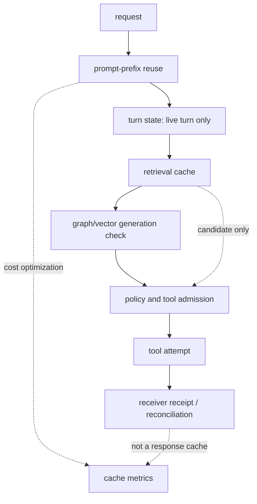
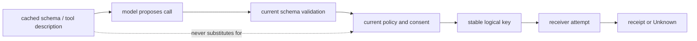
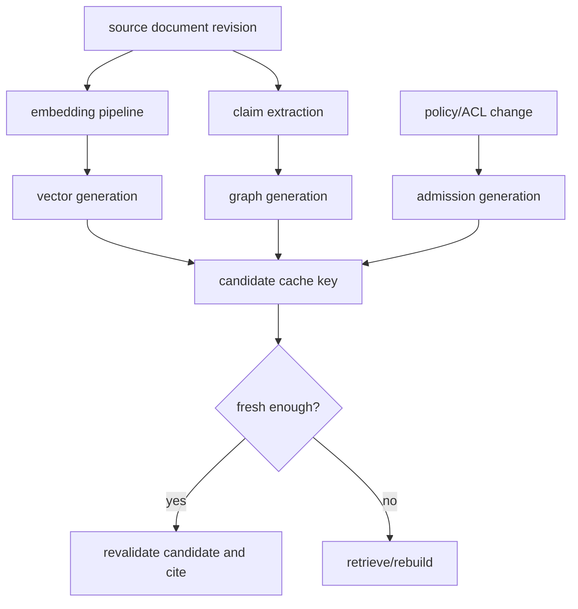
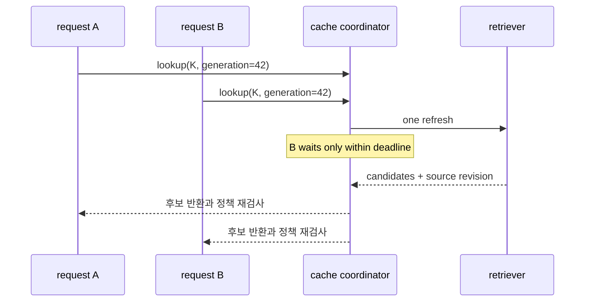

# 43장. 캐시 공학: 빠른 재사용과 오래된 결정을 같은 것으로 부르지 않는다

에이전트에서 캐시는 비용을 줄이는 장치인 동시에 가장 조용한 오류 증폭기다. 같은 질문을 두 번 받았다고 해서 같은 답을 다시 써도 되는 것은 아니다. 첫 질문 뒤에 권한이 철회되었을 수 있고, 도구의 스키마가 바뀌었을 수 있으며, 그래프의 근거가 정정되었을 수 있다. 반대로 매번 모든 것을 새로 계산하면, 고정된 긴 시스템 지시문과 동일한 도구 설명을 계속 전송하고, 동일한 문서를 다시 embedding하고, 이미 끝난 작업을 다시 실행하는 비용을 낸다.

따라서 캐시 설계의 첫 질문은 “무엇을 저장할까?”가 아니라 **어떤 사실이 재사용되어도 같은 의미를 유지하는가**다. 이 장에서는 prompt prefix, 모델 turn 상태, 스키마와 도구, 검색 후보, 벡터와 그래프, 외부 효과의 여섯 경계를 분리한다. 마지막 경계인 효과는 캐시가 아니라 receiver의 idempotency/receipt 계약으로 다뤄야 한다. 이 분리를 잃으면 `cache hit`를 `안전한 재실행`으로 오해하게 된다.

> 선수 지식: [4장](04-context-assembly.md)의 문맥 조립, [6장](06-context-compaction.md)의 압축, [13장](13-logical-call-effect.md)의 논리 호출과 receipt, [21장](21-embedding-vector-search.md)~[24장](24-hybrid-retrieval.md)의 검색을 먼저 읽으면 좋다.

## 43.1 먼저 분해한다: 여섯 저장물은 서로 다른 계약을 가진다

“캐시”라는 단어는 최소 여섯 가지 서로 다른 저장물을 가리킨다.

|저장물|재사용 단위|정답성의 기준|무효화의 주된 원인|잘못 재사용했을 때|
|---|---|---|---|---|
|prompt prefix|토큰의 공통 앞부분|동일한 요청 의미|instructions·tools·model 설정 변화|비용 절감 실패 또는 provider 오류|
|turn/model state|한 모델 turn의 연속 상태|동일한 live turn|turn 종료·연결 단절·입력 불일치|다른 turn의 문맥 혼합|
|schema/tool metadata|도구 설명·검증 규칙|호출 가능성|tool version·policy 변화|낡은 인수로 실행|
|retrieval result|후보/문서 조각|근거의 적합성·권한|source·ACL·index generation 변화|철회된 근거 노출|
|vector/graph index|근접 이웃·관계 경로|index/graph snapshot|embedding·graph generation 변화|새 지식을 못 보거나 잘못 연결|
|effect result|외부 변경의 결과|receiver의 durable receipt|receiver state·business rule|중복 결제·배포·메일|

여기서 마지막 행을 특히 경계해야 한다. `POST /deploy`의 HTTP 200을 메모리에 캐시하는 일은, deploy가 한 번만 적용됐다는 증거가 아니다. 같은 **LogicalCallID**와 idempotency key로 receiver에 재조회하고, receiver-issued receipt 또는 postcondition을 읽어야 한다. 이 장에서 말하는 cache hit는 원칙적으로 “계산을 생략할 후보”이며, 외부 효과의 terminal verdict가 아니다.



그림의 순서는 구현의 보편적인 내부 순서를 주장하지 않는다. 그러나 `retrieval cache → effect` 사이에 policy/tool admission을 생략해서는 안 된다는 설계 원칙은 분명하다. 검색할 때 허용된 문서가 commit 때도 허용되는지, 당시의 tool schema가 지금도 유효한지를 재검사해야 한다.

## 43.2 cache key는 해시 문자열이 아니라 의미 보존 서명이다

키를 `sha256(prompt)` 하나로 만들면 단순하지만, 실제 행동을 결정하는 변수를 빼먹기 쉽다. 반대로 tenant, run ID, 매 시각을 전부 넣으면 hit가 사라진다. 좋은 키는 **재사용 시 결과의 해석을 바꾸는 변수**는 포함하고, trace ID처럼 결과를 바꾸지 않는 관측 변수는 분리한다.

다음은 검색 후보 cache의 개념 모델이다. 실제 field 이름은 서비스 계약에 맞춰야 한다.

```text
retrieval_key = H(
  canonical_query,
  tenant_id,
  principal_scope_digest,
  retrieval_policy_revision,
  embedding_model_revision,
  vector_index_generation,
  graph_generation,
  source_visibility_generation,
  ranking_configuration_digest
)
```

여기서 `principal_scope_digest`는 raw ACL이나 사용자 식별자를 key namespace에 그대로 흘리지 않기 위한 canonical, secret-safe representation이다. 단, digest가 같다고 두 주체가 반드시 같은 권한이라는 뜻으로 쓰면 안 된다. 권한 결정을 재사용하려면 policy engine의 명시적 decision cache 계약, 만료와 철회 event가 별도로 필요하다.

`generation`은 TTL보다 강한 축이다. TTL은 “이 시간 이후에는 다시 확인한다”는 상한일 뿐이다. source가 삭제·정정되거나 policy가 즉시 철회된 경우, 5분 TTL은 5분 동안 오래된 권한을 허용한다. 반면 `graph_generation=42`인 entry는 현재 generation 43과 다를 때 즉시 후보로만 취급하거나 miss로 처리할 수 있다. generation을 매 mutation마다 전역 증가시키면 invalidation 폭발이 일어날 수 있으므로 tenant/collection/source family/policy scope처럼 실제 일관성 요구에 맞게 계층화한다.

### 키의 두 층: 공유 가능한 것과 개인적인 것

프롬프트는 대개 다음처럼 나뉜다.

```text
[stable: system instructions | tool schemas | public product policy]
[tenant/policy scoped: allowed corpus digest | feature flags]
[private: user request | retrieved evidence | ephemeral tool output]
```

공유 prefix는 앞쪽에 모으고, 개인 데이터와 자주 변하는 timestamp는 뒤쪽으로 보낸다. 이는 모델 provider의 prefix-cache hit 가능성을 높이지만, 보안 경계도 명확히 한다. tenant A의 retrieved evidence를 “공통 prefix”로 올려 tenant B와 공유하는 것은 최적화가 아니라 데이터 격리 실패다. prefix 안정화는 문장 순서를 예쁘게 만드는 작업이 아니라 identity·authority를 분할하는 작업이다.

## 43.3 Codex 공개 코드에서 읽는 prefix와 turn-state의 경계

고정 리비전 `0344625ccf4ae0ab6472c6c1e7b4ace6af14661e`의 Codex는 `prompt_cache_key`를 응답 요청에 넣는다. [키 선택 코드](https://github.com/openai/codex/blob/0344625ccf4ae0ab6472c6c1e7b4ace6af14661e/codex-rs/core/src/client.rs#L540-L550)는 override가 있으면 그것을 우선하고, 없으면 internal source와 parent thread ID, 그마저 없으면 session ID를 기반으로 값을 구성한다. 이 값은 `build_responses_request`에서 request property로 전달된다. [요청 조립 경로](https://github.com/openai/codex/blob/0344625ccf4ae0ab6472c6c1e7b4ace6af14661e/codex-rs/core/src/client.rs#L927-L1029)

이 코드에서 확실히 말할 수 있는 것은 **클라이언트가 안정적인 key를 제공한다**는 사실이다. hit/miss, 서버 TTL, eviction, provider별 할인율, 저장 위치는 이 공개 경로만으로 판정할 수 없다. 따라서 운영 대시보드에서 “Codex가 이 key로 80% hit”라고 쓰려면 provider usage 필드 또는 별도 비용 계측이라는 독립 근거가 있어야 한다.

더 엄격한 경계는 `ModelClientSession`이다. [세션 구조와 주석](https://github.com/openai/codex/blob/0344625ccf4ae0ab6472c6c1e7b4ace6af14661e/codex-rs/core/src/client.rs#L305-L405)은 WebSocket과 sticky `x-codex-turn-state`를 보존하되, session이 한 turn 용도이며 turn 간 재사용을 명시적으로 금한다. 요청의 model, instructions, tools, tool choice, parallel tool calls, reasoning, store, stream, include, tier, prompt-cache key, text schema가 일치하는지도 continuation 조건으로 비교한다.

```rust
// 개념을 보여 주기 위한 축약; 실제 비교 항목은 아래 원전을 확인한다.
if !responses_request_properties_match(previous, next) {
    // 같은 연결이 있어도 continuation으로 간주하지 않는다.
    return FreshRequest;
}
```

이 부분 인용이 가르치는 것은 “WebSocket이 살아 있으니 문맥도 안전하게 이어진다”가 거짓이라는 점이다. 연결 재사용, 한 turn 안의 state continuation, prompt-prefix cache는 셋 다 다른 자원이다.

|구분|살아 있는 동안|동일성 검사|종료/무효화|
|---|---|---|---|
|transport connection|socket|연결 상태|network/retry 정책|
|turn state|한 turn|request property·input prefix|turn terminal/abort|
|prompt cache|provider cache일 수 있음|cache key와 provider 계약|서버 정책·key 변화|
|conversation history|thread/session 기록|application context builder|compaction·branch·policy|

Codex의 turn loop는 sampling 전에 compaction과 step context capture를 거쳐 request를 새로 조립한다. [`run_turn`의 loop](https://github.com/openai/codex/blob/0344625ccf4ae0ab6472c6c1e7b4ace6af14661e/codex-rs/core/src/session/turn.rs#L155-L530)와 retry 시 현재 history에서 prompt를 재구성하는 [sampling request 경로](https://github.com/openai/codex/blob/0344625ccf4ae0ab6472c6c1e7b4ace6af14661e/codex-rs/core/src/session/turn.rs#L1361-L1462)는 이를 보여 준다. 그래서 prefix를 최적화할 때도 “history를 한 번 해시해 재사용”이 아니라, compaction 뒤의 canonical prompt가 무엇인지 먼저 정의해야 한다.

## 43.4 compaction은 cache eviction이 아니라 의미 보존 변환이다

문맥 창이 차면 오래된 대화를 버리는 일이 필요하다. 그러나 이를 LRU eviction처럼 말하면 위험하다. 대화의 오래된 항목에는 아직 유효한 approval, tool result, receipt, unresolved question이 있을 수 있다. 압축의 정답성은 token 수가 줄었는지가 아니라, 이후 행동에 필요한 사실과 그 출처가 보존되는가에 있다.

Codex에는 token budget에 맞춰 새 context window를 여는 경로와 요약을 만드는 local/remote compaction 경로가 분리되어 있다. [token-budget compaction](https://github.com/openai/codex/blob/0344625ccf4ae0ab6472c6c1e7b4ace6af14661e/codex-rs/core/src/compact_token_budget.rs#L21-L92), [local summary와 history replacement](https://github.com/openai/codex/blob/0344625ccf4ae0ab6472c6c1e7b4ace6af14661e/codex-rs/core/src/compact.rs#L174-L320), [remote compaction lifecycle](https://github.com/openai/codex/blob/0344625ccf4ae0ab6472c6c1e7b4ace6af14661e/codex-rs/core/src/compact_remote.rs#L53-L170)를 구별해 읽어야 한다. 같은 “compact”라는 이름이 같은 summary algorithm이나 같은 provenance 보존을 보장하지는 않는다.

pi-agent도 harness compaction에서 메시지 구간을 변환한다. [pi-agent compaction 경로](https://github.com/badlogic/pi-mono/blob/853a80d26c90a14c1886f0ebb8ffaae133ca2185/packages/agent/src/harness/compaction/compaction.ts#L216-L252)와 [aborted compaction test](https://github.com/badlogic/pi-mono/blob/853a80d26c90a14c1886f0ebb8ffaae133ca2185/packages/agent/src/harness/compaction/compaction.test.ts#L647-L674)는 변환 중단을 별도 상태로 다룰 필요를 보여 준다. host 재시작 뒤의 durable checkpoint나 외부 effect의 replay safety까지 이 코드가 보장한다고 확대해서는 안 된다.

### compaction artifact의 최소 계약

요약 text만 남기지 말고, 다음을 함께 남긴다.

```yaml
compaction:
  compaction_id: cmp-20260902-17
  input_event_range: [evt-104, evt-191]
  base_state_revision: 812
  policy_revision: policy-57
  summary_digest: sha256:...
  preserved_facts:
    - fact_id: receipt-91
      kind: receiver_receipt
      source_event: evt-144
      validity: confirmed
    - fact_id: approval-44
      kind: approval
      source_event: evt-151
      expires_at: 2026-09-02T10:20:00Z
  unresolved:
    - logical_call_id: call-38
      disposition: Unknown
  transform_status: completed
```

이 artifact는 모델에게 모든 원문을 다시 넣자는 제안이 아니다. “요약에 그렇게 적혀 있었다”를 권위 있는 receipt로 쓰지 않기 위한 provenance 경계다. `Unknown` effect, 만료 가능한 approval, 실제 tool version은 압축 후에도 typed state로 남겨야 한다.

## 43.5 도구와 스키마 cache: JSON Schema가 허가증은 아니다

도구 설명은 보통 길고 stable하여 prefix cache에 넣기 좋은 후보다. 하지만 `schema cache hit`는 그 도구가 지금 실행 가능하다는 뜻이 아니다. registry가 같은 이름의 새 version을 배포했을 수 있고, tenant feature flag가 꺼졌을 수 있으며, effect-time policy가 달라졌을 수 있다.

Codex의 tool registry는 validation, handler, post hook의 경계를 둔다. [registry의 validation과 handler 흐름](https://github.com/openai/codex/blob/0344625ccf4ae0ab6472c6c1e7b4ace6af14661e/codex-rs/core/src/tools/registry.rs#L493-L773)을 읽을 때, post-tool hook이 완료된 외부 실행을 되돌린다는 뜻으로 읽어서는 안 된다. 코드의 주석이 말하듯 post hook에서 reject해도 이미 완료된 execution 자체는 rollback되지 않는다. 따라서 cache된 schema로 model proposal을 만들더라도 다음 세 단계는 매 attempt에서 남아야 한다.



실무 키는 `tool_id`만이 아니라 semantic version 또는 immutable schema digest, policy generation, capability scope를 가진다. tool result cache를 둘 때에는 더 엄격하다. `get_exchange_rate(base=KRW)`처럼 time-varying read는 cache entry에 as-of time과 source revision을 달고, `list_repositories()`처럼 permission-filtered read는 principal scope와 authorization decision의 validity를 분리한다. write tool은 성공 payload를 response cache로 다시 내보내는 대신, stable logical call key로 receiver receipt를 lookup하는 편이 안전하다.

## 43.6 검색 cache는 답 cache가 아니라 후보 cache다

RAG 시스템은 `query → top-k chunks`를 cache하면 큰 비용을 아낄 수 있다. 하지만 vector similarity는 권한·시간·근거의 진실값을 모른다. [22장](22-vector-limits.md)에서 다뤘듯 가까운 벡터는 “허용된 현재 근거”라는 predicate가 아니다.

Open Ontologies의 공개 구현은 Turtle을 모두 parse한 뒤 graph에 넣는 경계와, exact vector search와 HNSW search를 구분해 둔다. [Turtle parse/insert](https://github.com/epoko77-ai/open-ontologies/blob/d423869aa071afebf0806e7e79e724be5fe81ac6/src/graph.rs#L108-L130), [exact vector search](https://github.com/epoko77-ai/open-ontologies/blob/d423869aa071afebf0806e7e79e724be5fe81ac6/src/vecstore.rs#L322-L335), [HNSW 경로](https://github.com/epoko77-ai/open-ontologies/blob/d423869aa071afebf0806e7e79e724be5fe81ac6/src/vecstore.rs#L337-L369)가 그 예다. 이는 index 알고리즘 경계에 대한 근거이며, cache invalidation이나 authorization semantics를 제품 전체가 자동으로 해결한다는 주장은 아니다.

검색 cache entry는 최소한 다음을 저장한다.

|필드|왜 필요한가|
|---|---|
|candidate IDs와 chunk/source revision|문서가 교체·삭제됐는지 확인|
|vector index generation·embedding revision|공간 자체가 바뀐 miss 판정|
|graph generation·valid time|관계와 시간적 주장 재검사|
|retrieval configuration digest|k, filter, reranker가 달라졌는지 판정|
|principal scope/policy decision reference|같은 후보라도 노출 가능 여부 재검사|
|created_at·soft/hard expiry|stale-while-revalidate의 안전 상한|

권장 흐름은 “후보는 재사용하되 admission은 새로 한다”이다.

```text
1. canonical query와 scope로 candidate cache를 조회한다.
2. generation이 다르면 miss 또는 bounded stale 후보로 표시한다.
3. 현재 ACL/policy와 valid time으로 후보를 다시 거른다.
4. source revision과 citation span을 확인한다.
5. 재랭킹·답변에는 admissible 후보만 넣는다.
6. effectful answer라면 effect-time policy를 다시 확인한다.
```

이 순서의 비용은 존재한다. 그 비용이 바로 cache를 authorization bypass로 만들지 않는 비용이다. 민감한 corpus에서는 candidate cache를 tenant/principal namespace로 물리적으로 나누거나 encrypted per-tenant store를 사용하고, shared cache에는 공개된 source만 넣는 것이 이해하기 쉽다.

## 43.7 그래프 generation과 vector generation을 한 숫자로 합치지 않는다

벡터 index가 새로 build됐다고 그래프의 claim validity가 바뀐 것은 아니다. 반대로 그래프에서 `supersededBy` 관계가 추가됐다고 embedding model이 달라진 것은 아니다. 두 generation을 하나의 `knowledge_version`으로 합치면 구현은 간단해 보여도 invalidation 범위가 커지고, incident 때 원인을 구분할 수 없다.



Open Ontologies에는 temporal query 경계도 있다. [temporal evaluation 코드](https://github.com/epoko77-ai/open-ontologies/blob/d423869aa071afebf0806e7e79e724be5fe81ac6/src/temporal.rs#L1866-L1934)와 [negative temporal test](https://github.com/epoko77-ai/open-ontologies/blob/d423869aa071afebf0806e7e79e724be5fe81ac6/src/temporal.rs#L2290-L2316)는 valid time을 query 의미에 넣어야 한다는 점을 보여 준다. 따라서 “그래프 cache가 hit했다”는 말에는 적어도 `recorded_at`과 `valid_at` 중 어느 시간을 기준으로 했는지가 붙어야 한다. 과거에는 참이었으나 지금은 철회된 근거를 현재 답에 쓰는 사고는 대부분 이 구분을 생략할 때 생긴다.

### stale-while-revalidate의 안전한 한계

정적 공개 문서의 title/thumbnail처럼 실패해도 권한·효과를 바꾸지 않는 값은 soft TTL 만료 뒤에 stale 값을 반환하고 백그라운드 refresh할 수 있다. 그러나 다음은 stale serving을 기본 금지한다.

- ACL, consent, allow/deny policy와 capability grant
- account balance, inventory, price, incident state처럼 결정에 쓰이는 read
- approval, lease, fence token, receiver receipt
- source가 삭제·정정·legal hold된 corpus의 인용
- tool schema와 write operation의 target

여기서 “금지”는 모든 서비스가 동기 read를 해야 한다는 뜻은 아니다. fail closed, queue, human approval, bounded degraded mode 중 무엇을 쓸지 명시하라는 뜻이다. `stale=true` badge만 붙이고 write를 수행하는 것은 degraded mode가 아니라 오판이다.

## 43.8 Claude Code는 공개 계약까지만 비교한다

Claude Code의 공식 공개 저장소 고정 리비전 `a1e64dc407dd57dfb4ea283b0f8049adf3eabee5`는 plugins, settings, hooks, skills 같은 공개 구성 표면을 제공한다. 그러나 이 저장소는 host 제품의 core loop, prompt cache key, invalidation 순서, summary algorithm, checkpoint fsync, scheduler 내부를 검증할 source tree가 아니다. 이 장에서 그런 내부를 추정하지 않는 이유는 제품을 낮게 평가해서가 아니라, cache는 세부 순서 하나가 안전성을 바꾸기 때문이다.

공개 계약에서 관찰 가능한 사실은 있다. 예를 들어 최신 [CHANGELOG](https://github.com/anthropics/claude-code/blob/a1e64dc407dd57dfb4ea283b0f8049adf3eabee5/CHANGELOG.md#L632-L668)는 `/goal`의 background check-in, task tools visibility, fork가 conversation/prompt cache를 상속한다는 release note를 담고 있다. 같은 파일은 prompt cache metrics, cache read pricing, tool definitions 및 fork/compaction 관련 release note도 포함한다. 이들은 사용자에게 노출된 동작·변경의 근거이지, key field·TTL·eviction algorithm·tenant isolation을 역으로 증명하는 근거는 아니다.

Ralph Wiggum plugin은 stop hook을 이용해 조건이 충족될 때까지 prompt를 반복시키는 공개 예다. [plugin README](https://github.com/anthropics/claude-code/blob/a1e64dc407dd57dfb4ea283b0f8049adf3eabee5/plugins/ralph-wiggum/README.md#L3-L27), [stop hook state/decision script](https://github.com/anthropics/claude-code/blob/a1e64dc407dd57dfb4ea283b0f8049adf3eabee5/plugins/ralph-wiggum/hooks/stop-hook.sh#L13-L55)를 host의 durable resume, effect reconciliation, global cache policy로 일반화하면 안 된다. plugin의 state file atomic move는 그 plugin state의 구현 사실이지 Claude Code 전체 checkpoint의 durability claim이 아니다.

이 비교에서 옳은 문장은 다음처럼 좁다.

|문장|판정|
|---|---|
|“공개 release note가 prompt cache를 언급한다.”|관찰 가능|
|“fork가 어떤 prompt cache key를 상속한다.”|공개 코드만으로 미판정|
|“hook이 반복 prompt를 막거나 허용할 수 있다.”|plugin 계약 범위에서 관찰 가능|
|“hook 거절이 이미 수행된 외부 effect를 rollback한다.”|근거 없음|
|“Claude Code core가 특정 TTL로 cache를 무효화한다.”|근거 없음|

## 43.9 cold/warm을 하나의 latency로 뭉개지 않는다

캐시 최적화가 성공했는지 보려면 평균 응답 시간 하나로는 부족하다. warm hit가 빨라져도 invalidation storm이 backend를 쓰러뜨리거나, prompt cache cost 절감이 retrieval miss 비용 증가로 상쇄될 수 있다. stage와 disposition을 분리한다.

|지표|권장 분해|무엇을 찾는가|
|---|---|---|
|cache lookup latency|cache_type, outcome, tenant_tier|cache 자체의 병목|
|hit ratio|eligible/served/miss를 분리|키 설계 실패와 eligibility 변동|
|freshness age|source/policy/graph/vector 별|오래된 값의 범위|
|invalidation lag|mutation→invalidation observed|철회가 언제까지 노출되는가|
|single-flight wait|key class, outcome|stampede·head-of-line blocking|
|prompt token/cost|cold/warm, model, request class|실제 비용 절감|
|retrieval admission reject|cached/fresh, reason enum|cache가 권한 bypass인지|
|unknown effect|cache 여부와 무관하게 별도|응답 reuse로 숨긴 불확실성|

Prometheus metric label에는 raw cache key, RunID, user ID, prompt, source URL을 넣지 않는다. cardinality를 폭발시키고 민감 정보를 누출할 수 있다. cache type, bounded outcome (`hit`, `miss`, `stale_rejected`, `coalesced`, `bypass`), bounded reason enum, tenant tier 정도로 제한하고, 개별 key는 접근 제어된 trace/audit record에서 HMAC digest로 상관시킨다.

```text
agent_cache_requests_total{
  cache_type="retrieval_candidate",
  outcome="stale_rejected",
  reason="policy_generation_mismatch",
  tenant_tier="enterprise"
} 1
```

`hit ratio = hits / requests`도 그대로 믿지 않는다. 애초에 캐시할 수 없는 요청이 급증하면 ratio가 내려가지만 성능 퇴화가 아닐 수 있다. 다음처럼 eligibility를 분리한다.

```text
eligible_hit_ratio = eligible_hits / eligible_lookups
served_stale_ratio = stale_served / eligible_lookups
unsafe_bypass_rate = admission_rejected_after_cache / cached_candidates
```

마지막 비율은 작아야 하지만 0만을 보고 cache를 넓히지 않는다. admission이 많아진 것은 policy가 더 정밀해졌다는 신호일 수도 있다. metric은 판결이 아니라 다음 질문의 시작점이다.

## 43.10 비용 모델: hit 하나가 절약하는 것과 새로 만드는 것을 같이 센다

캐시의 기대 이득은 다음처럼 대략 모델링할 수 있다.

```text
expected_saving
 = P(hit) × (cold_compute_cost - warm_lookup_cost)
 - invalidation_cost
 - refresh_cost
 - stale_incident_expected_cost
```

이 식에서 가장 자주 빠지는 항은 `stale_incident_expected_cost`다. 뉴스 요약의 30초 지연과 결제 승인 정책의 30초 지연은 같은 TTL이 아니다. 또 prompt prefix cache는 provider billing에서 cached input token 가격이 실제로 다를 때에만 금전적 절감을 확정할 수 있다. local tokenization·serialization·network queue가 병목인 경우에는 같은 key를 써도 p99가 거의 줄지 않을 수 있다.

동시에 들어온 같은 miss는 single-flight/coalescing으로 하나의 refresh에 합칠 수 있다. 하지만 coalescing key에 tenant가 빠지면 data isolation을 깨고, leader request가 timeout될 때 waiter에게 어떤 state를 보일지도 정의해야 한다.



waiter에게 raw candidate를 그대로 broadcast하기 전에 각 request의 current policy와 deadline을 다시 적용한다. shared work와 shared authorization은 다르다. refresh result가 cache에 쓰일 때도 source revision·generation이 request 시작 뒤 이미 구버전이 됐을 수 있으므로 compare-and-set 또는 “refresh began/observed generation”을 기록한다.

## 43.11 실패 장면으로 설계를 시험한다

### 장면 1: 권한 철회 뒤 cache hit

09:00에 user A가 문서 D를 읽을 수 있어 `query=q, policy=17` 후보를 저장했다. 09:01에 A의 권한이 철회됐다. 09:02에 같은 query가 들어왔다. `query`만 key로 쓴 cache는 D를 반환한다. policy revision 또는 decision validity를 key/admission에 넣은 설계는 cached candidate를 다시 보더라도 D를 탈락시킨다. 이때 “cache hit인데 답이 비었다”는 버그가 아니라 권한 경계가 작동한 결과일 수 있다.

### 장면 2: schema deploy와 낡은 도구 인수

`deploy(target, region)`에 `change_ticket`가 필수가 되는 배포가 이뤄졌다. 오래된 tool schema를 prefix에 둔 모델은 옛 인수로 proposal할 수 있다. current validator가 reject하고 새 schema를 넣어 재계획하는 것은 정상이다. cached schema를 이유로 validation을 생략하면, 빠른 호출이 아니라 bypass가 된다.

### 장면 3: compaction 뒤 사라진 Unknown

도구 요청이 timeout됐고 receiver receipt는 아직 없다. summary가 “배포 완료”라고 단정하면 다음 turn은 retry하지 않지만 실제 배포는 없었을 수 있다. 반대로 “실패”라고 단정하면 중복 deploy가 생길 수 있다. compaction artifact에는 `Unknown/PendingReconciliation`, logical key, receiver lookup deadline을 typed field로 보존해야 한다.

### 장면 4: vector rebuild와 citation mismatch

embedding model을 바꿔 vector generation을 갱신했는데 old candidate cache의 chunk ID가 재사용됐다. ID가 살아 있어도 해당 chunk의 source revision 또는 chunk boundary가 바뀌었을 수 있다. citation은 ID만이 아니라 immutable source revision과 span digest를 확인한다. vector hit는 citation validity의 증거가 아니다.

### 장면 5: cache stampede가 retry storm을 부른다

popular key의 TTL이 동시에 만료되고 수천 요청이 origin으로 간다. origin 429를 retry가 증폭하며 queue가 길어진다. single-flight, jittered expiry, per-tenant budget, stale 금지 대상의 fail-closed가 필요하다. 다만 jitter는 policy revoke propagation을 지연시키는 핑계가 될 수 없다. 권한·receipt에는 event-driven invalidation 또는 hard recheck를 둔다.

## 43.12 구현 실습: cache record를 failure-aware하게 만든다

다음은 특정 제품 API가 아니라 record contract의 예시다. key와 payload를 분리해, 운영자가 어느 generation mismatch로 miss가 났는지 설명할 수 있게 한다.

```json
{
  "cache_type": "retrieval_candidate",
  "key_version": 3,
  "key_digest": "hmac-sha256:...",
  "created_at": "2026-09-02T01:00:00Z",
  "soft_expires_at": "2026-09-02T01:02:00Z",
  "hard_expires_at": "2026-09-02T01:05:00Z",
  "basis": {
    "tenant": "tenant-opaque-7",
    "policy_generation": 57,
    "scope_digest": "hmac-sha256:...",
    "vector_generation": 144,
    "graph_generation": 88,
    "source_visibility_generation": 901
  },
  "payload": {
    "candidates": [
      {"source_revision": "doc-4@19", "span_digest": "sha256:..."}
    ]
  }
}
```

검증은 `GET cache`가 200을 돌려주는지 확인하는 일이 아니다. 아래 fault마다 expected oracle을 쓴다.

|fault|주입|expected oracle|
|---|---|---|
|policy revoke|policy generation을 증가|cached candidate가 admission에서 reject되고 raw corpus는 노출되지 않음|
|source correction|source revision 변경|old citation span은 answer context에 들어가지 않음|
|vector rebuild|vector generation 증가|entry miss 또는 명시 stale disposition|
|refresh timeout|origin timeout|hard expiry 이후 fresh처럼 응답하지 않음|
|leader crash|single-flight leader 종료|waiter가 deadline/typed error를 받고 duplicate uncontrolled refresh를 만들지 않음|
|tool schema deploy|schema digest 변경|model proposal 전에 current validation이 작동|
|receiver timeout|attempt 뒤 연결 단절|cached success가 아니라 receipt lookup/Unknown으로 분류|

간단한 pseudo-code도 이 구분을 드러내야 한다.

```python
entry = cache.get(key)
if entry and entry.basis.vector_generation == current.vector_generation:
    candidates = entry.payload.candidates
else:
    candidates = retrieve_and_store(key, current)

admissible = [c for c in candidates if policy_allows_now(c, principal)]
# write는 이 아래에서 current policy, stable logical key, receipt를 다시 다룬다.
```

`policy_allows_now`를 cache 내부의 boolean으로 바꾸지 않는 것이 핵심이다. policy decision cache가 필요하다면 그 cache도 decision owner, scope, policy generation, expiry, revocation channel, fail mode를 가진 별도 component로 설계한다.

## 43.13 운영 체크리스트

### 설계 전

- [ ] cache마다 재사용 단위와 **정답성 oracle**을 한 문장으로 썼는가?
- [ ] key에 tenant/scope/policy/source/vector/graph/tool revision 중 필요한 축이 들어 있는가?
- [ ] shared computation과 shared authorization을 구분했는가?
- [ ] TTL로 충분하지 않은 revoke/correction/fence 대상에 generation 또는 event invalidation이 있는가?
- [ ] effect 결과를 response cache가 아니라 idempotency key와 receiver receipt로 다루는가?

### 배포 전

- [ ] cold/warm, eligible/ineligible, hit/miss/stale-rejected를 분리해 측정하는가?
- [ ] raw prompt, raw cache key, user ID가 metric label에 없는가?
- [ ] compaction이 receipt/approval/Unknown을 text assertion으로 평평하게 만들지 않는가?
- [ ] schema cache hit 뒤에도 current validation과 effect-time authorization이 남아 있는가?
- [ ] soft expiry와 hard expiry의 행동, origin timeout의 fail mode를 문서화했는가?
- [ ] single-flight의 leader crash, waiter deadline, tenant isolation을 fault test했는가?

### incident 중

- [ ] “cache hit”와 “권위 있는 최신 결과”를 구별했는가?
- [ ] stale answer가 어떤 generation/expiry를 기준으로 나왔는지 말할 수 있는가?
- [ ] policy/source/tool deploy 시 invalidation lag를 측정했는가?
- [ ] hit ratio를 올리기 위해 admission rejection을 bypass하지 않았는가?
- [ ] timeout 뒤 effect가 이미 commit됐는지 receiver receipt로 조회했는가?

## 43.14 이 장이 보장하지 않는 것

완벽한 key, 무한한 generation, 짧은 TTL도 모든 staleness를 없애지 못한다. 외부 provider의 prompt cache가 어떤 tenant isolation·retention·billing을 제공하는지는 해당 provider의 명시 계약을 별도로 확인해야 한다. 공개된 Codex client 코드가 prompt-cache key를 보내는 사실은 server-side cache semantics의 증명이 아니다. Claude Code 공개 문서의 release note와 plugin은 내부 cache implementation의 증명이 아니다. pi-agent의 공개 loop/compaction은 host persistence와 receiver effect semantics의 증명이 아니다.

캐시 공학의 목표는 모든 계산을 재사용하는 데 있지 않다. **재사용해도 되는 계산은 싸게, 다시 확인해야 하는 권한과 효과는 정직하게** 다루는 데 있다. 이 원칙을 지키면 hit ratio가 조금 낮아도, 시스템은 빠른 거짓말보다 설명 가능한 최신성을 선택한다.

## 이 장의 원전 바로가기

1. [Codex prompt cache key와 request properties](https://github.com/openai/codex/blob/0344625ccf4ae0ab6472c6c1e7b4ace6af14661e/codex-rs/core/src/client.rs#L305-L405)
2. [Codex prompt cache key 선택](https://github.com/openai/codex/blob/0344625ccf4ae0ab6472c6c1e7b4ace6af14661e/codex-rs/core/src/client.rs#L540-L550)
3. [Codex Responses request 조립](https://github.com/openai/codex/blob/0344625ccf4ae0ab6472c6c1e7b4ace6af14661e/codex-rs/core/src/client.rs#L927-L1029)
4. [Codex turn loop](https://github.com/openai/codex/blob/0344625ccf4ae0ab6472c6c1e7b4ace6af14661e/codex-rs/core/src/session/turn.rs#L155-L530)
5. [Codex compaction dispatch/local replacement](https://github.com/openai/codex/blob/0344625ccf4ae0ab6472c6c1e7b4ace6af14661e/codex-rs/core/src/compact.rs#L174-L320)
6. [Codex tool registry validation/handler/post-hook](https://github.com/openai/codex/blob/0344625ccf4ae0ab6472c6c1e7b4ace6af14661e/codex-rs/core/src/tools/registry.rs#L493-L773)
7. [pi-agent compaction](https://github.com/badlogic/pi-mono/blob/853a80d26c90a14c1886f0ebb8ffaae133ca2185/packages/agent/src/harness/compaction/compaction.ts#L216-L252)
8. [Open Ontologies exact/HNSW vector search](https://github.com/epoko77-ai/open-ontologies/blob/d423869aa071afebf0806e7e79e724be5fe81ac6/src/vecstore.rs#L322-L369)
9. [Open Ontologies temporal evaluation](https://github.com/epoko77-ai/open-ontologies/blob/d423869aa071afebf0806e7e79e724be5fe81ac6/src/temporal.rs#L1866-L1934)
10. [Claude Code public release notes (pinned)](https://github.com/anthropics/claude-code/blob/a1e64dc407dd57dfb4ea283b0f8049adf3eabee5/CHANGELOG.md)
11. [Claude Code Ralph Wiggum public plugin](https://github.com/anthropics/claude-code/tree/a1e64dc407dd57dfb4ea283b0f8049adf3eabee5/plugins/ralph-wiggum)
