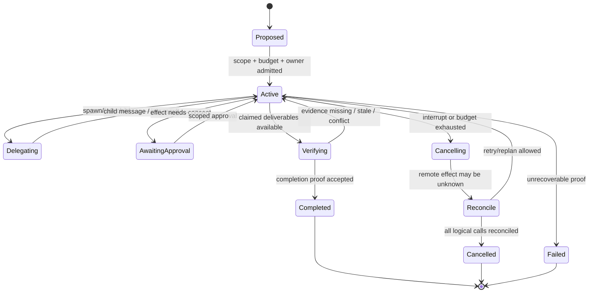
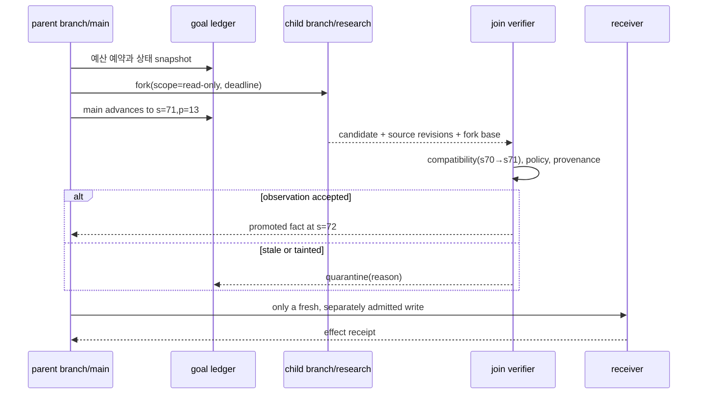
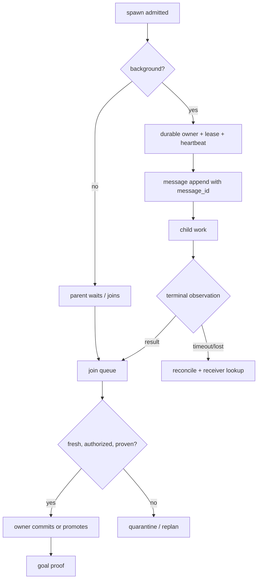
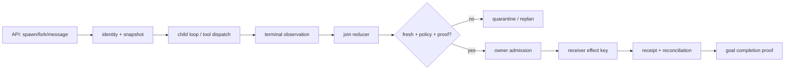

# 44장. 서브에이전트와 목표: 많은 대화를 하나의 완료 증명으로 바꾸기

서브에이전트는 병렬 prompt가 아니다. 목표도 할 일 목록의 제목이 아니다. 둘을 그렇게 취급하면, 다섯 개의 worker가 각각 그럴듯한 문장을 반환한 순간 ‘작업 완료’라고 말하게 된다. 그러나 운영에서 완료란 더 좁다. **권한 있는 주체가, 현재의 정책과 상태에서, 요구한 산출물과 외부 효과를 검증했고, 그 판정과 영수증을 다시 찾을 수 있는 상태**다.

이 장은 `spawn → work → message → join → verify → commit → close`를 하나의 실행 protocol로 다룬다. 특히 `fork`, background 실행, budget, cancel, resume는 편의 기능이 아니라 이 protocol의 서로 다른 상태 전이다. 독자가 프레임워크의 API 이름을 외우는 대신, 새 구현을 열었을 때 어느 함수를 추적하고 어떤 결손을 application layer가 메워야 하는지 알게 되는 것이 목표다.

> **근거의 경계.** 이 장의 Codex 관찰은 공개 revision [`0344625`](https://github.com/openai/codex/tree/0344625ccf4ae0ab6472c6c1e7b4ace6af14661e), pi-agent 관찰은 [`853a80d`](https://github.com/badlogic/pi-mono/tree/853a80d26c90a14c1886f0ebb8ffaae133ca2185)에 고정한다. Claude Code는 공개 revision [`a1e64dc`](https://github.com/anthropics/claude-code/tree/a1e64dc407dd57dfb4ea283b0f8049adf3eabee5)의 changelog·plugin·hook 계약만 말한다. 후자의 managed core scheduler, snapshot 저장 형식, effect reconciliation, prompt-cache invalidation은 공개 소스에서 판정할 수 없다. ‘보이지 않는다’는 ‘없다’는 뜻이 아니다.

## 44.1 성공한 child와 완료한 goal은 다르다

다음 식에서 `ChildTerminal`은 모델 호출이나 child session이 끝났다는 사실이고, `GoalComplete`는 사람이 기대하는 업무적 결론이다.

\[
GoalComplete \ne \sum ChildTerminal=success.
\]

더 유용한 정의는 다음과 같다.

\[
GoalComplete(g) = A(g) \land E(g) \land V(g) \land P(g) \land R(g).
\]

여기서 `A`는 산출물의 존재, `E`는 요구된 evidence/receipt, `V`는 현재 revision에서의 verifier 판정, `P`는 권한 있는 completion decision, `R`은 이 판정을 재현할 durable record다. 읽기 전용 조사라면 `E`는 source span일 수 있다. 배포라면 receiver receipt와 rollout observation이어야 한다. 둘을 같은 `success: true`로 표현하면 사고가 난다.



`Completed`, `Cancelled`, `Failed`를 terminal로 분리하는 이유는 운영자가 다음 질문에 다른 답을 해야 하기 때문이다. 완료는 deliverable이 검증됐다는 뜻이다. 취소는 일을 그만두었지만 dispatch된 effect가 없는지 또는 reconciliation됐다는 뜻이다. 실패는 어떤 predicate가 끝내 충족되지 않았다는 뜻이다. timeout은 이 셋 중 어느 것도 아니다. 관측이 끊긴 상태다.

### 44.1.1 목표 원장은 parent의 메모가 아니다

목표 하나에는 적어도 다음 identity를 둔다.

|필드|왜 필요한가|나쁜 대체물|
|---|---|---|
|`goal_id`, `goal_revision`|목표 문구·acceptance criteria 변경을 구별|자연어 제목|
|`root_run_id`, `branch_id`, `parent_run_id`|누가 어떤 fork에서 일을 했는지|agent display name|
|`principal`, `tenant`, `policy_generation`|누구의 권한으로 시작했는지|대화 속 사용자 이름|
|`budget_envelope`, `spent`|child 합계가 parent cap을 넘지 않게 함|token 사용량 하나|
|`logical_call_id`, `attempt_id`, `effect_key`|재시도와 외부 효과의 중복을 분리|tool call index|
|`state_revision`, `source_revision`|stale branch를 판별|마지막 수정 시각|
|`completion_proof_digest`|무엇을 보고 완료라 했는지|`done=true`|

원장은 append-only event log여야 한다는 뜻만은 아니다. 현재 projection과 원본 event의 관계도 정해야 한다. 예컨대 `budget_reserved` 이벤트를 먼저 기록하고 child를 만들며, `child_terminal`만으로 reserve를 전액 release하지 않는다. 아직 join verifier와 receiver query 비용이 남아 있기 때문이다. 완료 결정을 내린 actor와 그 decision의 policy generation도 남긴다. 그래야 나중에 ‘worker가 완료라 말했다’와 ‘owner가 완료 증명을 승인했다’를 구분한다.

## 44.2 fork는 복제본이 아니라 분기된 인과성이다

fork가 편리한 이유는 같은 문제를 다른 가설로 조사하거나, 위험한 계획을 원본 run을 더럽히지 않고 검토할 수 있기 때문이다. 위험은 fork 결과를 현재 branch에 단순 append하는 순간 시작된다. parent가 `s=70`, policy가 `p=12`일 때 child를 만들고, 그 동안 parent가 `s=71`, `p=13`으로 진행했다면 child의 문장은 최신 세계의 사실이 아니다. 그것은 **어떤 snapshot에서 얻은 observation**이다.



join predicate는 equality 하나가 아니다. 읽은 source가 바뀌었는지, parent가 바꾼 field가 child의 conclusion에 영향을 주는지, policy가 해당 action class를 좁혔는지에 따라 compatibility relation을 정의해야 한다. 따라서 결과에는 최소 `base_state_revision`, `source_revision_set`, `scope_digest`, `policy_generation`, `assumption_digest`가 붙는다.

```python
# 설명용 의사코드: text는 결코 merge key가 아니다.
def join_child(parent, result, ledger):
    assert result.parent_run_id == parent.run_id
    if not compatible(result.base_revision, parent.state_revision, result.read_set):
        return ledger.quarantine(result, "stale_branch")
    if result.policy_generation != parent.policy_generation:
        return ledger.quarantine(result, "policy_changed")
    if not verify_sources(result.source_spans, result.claims):
        return ledger.quarantine(result, "insufficient_evidence")
    return ledger.promote_observation(result)  # 아직 외부 write가 아니다.
```

`fork inherits conversation/prompt cache` 같은 제품 release note는 context 재사용 표면에 관한 유용한 계약일 수 있다. 하지만 이것은 branch의 write authority, durable merge, 최신 policy 통과를 보장한다는 계약이 아니다. Claude Code의 공개 changelog에는 fork와 prompt cache 관련 변화가 보이지만, cache key·snapshot merge algorithm·effect fence는 공개되지 않는다. 그러므로 운영 설계는 fork cache hit를 correctness 근거로 사용하지 않는다.

## 44.3 Codex에서 읽을 수 있는 loop와 goal의 좁은 사실

Codex 공개 구현에서 한 turn의 중심은 [`run_turn`](https://github.com/openai/codex/blob/0344625ccf4ae0ab6472c6c1e7b4ace6af14661e/codex-rs/core/src/session/turn.rs#L155-L530)이다. 이 함수는 pre-sampling compaction, MCP requirement, `StepContext`, tool construction, stream/후속 행동을 이어 붙인다. 중요한 것은 loop가 ‘모델을 한 번 부른다’가 아니라, 매 cycle에서 현재 history·mailbox·token 상태를 보고 다음 sampling, compaction 또는 stop을 고른다는 점이다. [`run_sampling_request`](https://github.com/openai/codex/blob/0344625ccf4ae0ab6472c6c1e7b4ace6af14661e/codex-rs/core/src/session/turn.rs#L1361-L1462)는 retry마다 현재 history로 request를 다시 만들고, initial prompt와 replay할 pending item을 보존한다.

tool output은 임의 순서의 텍스트가 아니다. [`try_run_sampling_request`](https://github.com/openai/codex/blob/0344625ccf4ae0ab6472c6c1e7b4ace6af14661e/codex-rs/core/src/session/turn.rs#L2206-L2810)는 stream event에서 tool future를 만들고 `FuturesOrdered`로 in-flight tool을 drain한다. parallel tool dispatcher는 병렬 허용 도구에는 read lock, 비병렬 도구에는 write lock을 쓰며 cancellation 때 dispatch를 abort하고 `AbortedToolOutput`을 만든다. [`parallel.rs`](https://github.com/openai/codex/blob/0344625ccf4ae0ab6472c6c1e7b4ace6af14661e/codex-rs/core/src/tools/parallel.rs#L42-L214)에서 알 수 있는 것은 local dispatch lifecycle이다. receiver가 실제 write를 했는지, rollback했는지는 별 receipt protocol 없이는 알 수 없다.

### 44.3.1 subagent API는 조직도이지 transaction manager가 아니다

V2 multi-agent 도구의 spawn/send/follow-up/interrupt/wait handler와 canonical naming 규칙은 공개 tree에서 찾을 수 있다. [`multi_agents_spec.rs`](https://github.com/openai/codex/blob/0344625ccf4ae0ab6472c6c1e7b4ace6af14661e/codex-rs/core/src/tools/handlers/multi_agents_spec.rs#L100-L190), [`spawn`](https://github.com/openai/codex/blob/0344625ccf4ae0ab6472c6c1e7b4ace6af14661e/codex-rs/core/src/tools/handlers/multi_agents_v2/spawn.rs), [`wait`](https://github.com/openai/codex/blob/0344625ccf4ae0ab6472c6c1e7b4ace6af14661e/codex-rs/core/src/tools/handlers/multi_agents_v2/wait.rs)를 따라가면 parent-child tree, 메시지 전달, follow-up, interrupt, terminal 대기를 각각 별 operation으로 모델링한 것을 볼 수 있다.

이 분리는 아주 중요하다. `spawn` 성공은 child가 일을 시작할 수 있게 됐다는 admission일 뿐이다. `send` 성공은 inbox에 message가 전달됐다는 뜻일 수 있으나 child가 그 내용을 채택·실행했다는 뜻이 아니다. `wait`의 terminal은 child execution의 상태지 parent goal의 proof가 아니다. application은 그 위에 result schema, join predicate, effect owner, completion authority를 올려야 한다.

```text
spawn_child(goal, snapshot, scope, child_budget) -> child_run_id
send_message(child_run_id, question, message_id) -> delivery status
wait(child_run_id) -> child terminal observation
verify(child_artifact, current_state, current_policy) -> accepted | rejected
commit_by_owner(effect_key) -> receiver receipt
close_goal(proof_digest, decision_actor) -> terminal goal event
```

goal 기능도 같은 절제가 필요하다. feature-gated Codex goal 도구의 [`create`](https://github.com/openai/codex/blob/0344625ccf4ae0ab6472c6c1e7b4ace6af14661e/codex-rs/ext/goal/src/tool.rs) 경로는 unfinished goal이 있을 때 replacement를 거절하고 active durable thread goal을 만든다. [`accounting.rs`](https://github.com/openai/codex/blob/0344625ccf4ae0ab6472c6c1e7b4ace6af14661e/codex-rs/ext/goal/src/accounting.rs)는 own/descendant token delta와 wall time을 계산해 persistence한다. 이는 ‘goal은 child까지 포함해 비용을 볼 수 있다’는 코드 근거다. 그러나 모든 환경에서 이 feature가 켜져 있거나, token budget이 receiver 비용·human review·external cloud invoice까지 포함한다는 일반 법칙은 아니다.

실무에서는 token budget을 spending report가 아니라 **admission reserve**로 만든다.

\[
reserve(c) + estimatedJoin(c) + rollbackReserve(c) \le remaining(goal).
\]

child의 output token이 cap 안에 들었어도 join verifier가 실행되지 못하면 시스템은 cheap failure를 만든 셈이다. root는 각 child에 cap을 배분하되, verifier·receipt lookup·cancel/reconciliation에 사용할 비축분을 남긴다.

## 44.4 Claude Code: 공개 변경 이력은 계약이지 core의 X-ray가 아니다

Claude Code의 공개 저장소는 plugin, settings, hook, command와 changelog를 제공한다. 최신 고정 revision의 changelog에는 `/goal` 오류·장시간 background check-in, task tools의 visibility, fork의 conversation/prompt-cache 상속, background에서 filler busy-loop를 피하는 변화, subagent auto-continue 등의 **사용자 표면 변화**가 기록되어 있다. [CHANGELOG](https://github.com/anthropics/claude-code/blob/a1e64dc407dd57dfb4ea283b0f8049adf3eabee5/CHANGELOG.md)에서 release를 읽을 때는 ‘언제 어떤 행동이 약속됐는가’를 추적할 수 있다.

그러나 release note는 다음 질문의 답이 아니다.

|확인 가능한 공개 표면|공개 근거만으로 판정할 수 없는 것|
|---|---|
|fork/background/subagent/goal의 UX 변화|host scheduler가 child를 어떤 queue로 배치하는가|
|prompt-cache 관련 release note|정확한 cache key, TTL, invalidation 순서|
|hook event와 allow/deny/ask 형태|internal tool effect와 hook의 완전한 ordering|
|resume/compaction 관련 문서 변화|checkpoint fsync, snapshot merge, receiver reconciliation|

공개 Ralph Wiggum plugin은 이 경계를 특히 선명하게 보여 준다. [`hooks.json`](https://github.com/anthropics/claude-code/blob/a1e64dc407dd57dfb4ea283b0f8049adf3eabee5/plugins/ralph-wiggum/hooks/hooks.json)은 Stop hook을 등록하고, [`stop-hook.sh`](https://github.com/anthropics/claude-code/blob/a1e64dc407dd57dfb4ea283b0f8049adf3eabee5/plugins/ralph-wiggum/hooks/stop-hook.sh#L13-L176)는 state file과 `<promise>` match로 반복을 막거나 같은 prompt를 다시 요구한다. plugin state의 atomic move는 plugin 상태 파일의 원자적 교체라는 관찰이지, host 전체의 checkpoint protocol 또는 external effect atomicity의 증명은 아니다.

hook은 policy extension point일 수 있지만 receiver authorization의 대체물이 아니다. 공개 hook 개발 안내는 `PreToolUse`의 allow/deny/ask/updatedInput, Stop/SubagentStop, PreCompact 같은 event와 plugin/user hook 병합·병렬 실행 표면을 설명한다. [hook development](https://github.com/anthropics/claude-code/blob/a1e64dc407dd57dfb4ea283b0f8049adf3eabee5/plugins/plugin-dev/skills/hooks/SKILL.md) 이때 fail-open hook 예제의 동작을 host default로 일반화하면 안 된다. plugin의 exception policy와 platform authorization은 다른 층이다.

따라서 Claude Code를 운영에 넣을 때에는 공개 계약을 acceptance test로 삼고, 미공개 core 속성은 black-box fault test로 확인한다. 예: cancel 직후 receiver에 같은 idempotency key로 조회, fork 후 policy revoke, background 30분 경계의 budget report, compaction 뒤 source citation의 survivability를 시험한다. 관찰한 release behavior와 우리 시스템의 durable proof를 섞어 하나의 보장이라고 부르지 않는다.

## 44.5 pi-agent: 작고 보이는 loop를 과장하지 않는다

pi-agent는 loop 자체가 공개 TypeScript라서 실험하기 좋은 기준점이다. [`Agent`](https://github.com/badlogic/pi-mono/blob/853a80d26c90a14c1886f0ebb8ffaae133ca2185/packages/agent/src/agent.ts#L347-L590)는 admission, snapshot, run lifecycle, reducer를 보여 주고, [`agent-loop.ts`](https://github.com/badlogic/pi-mono/blob/853a80d26c90a14c1886f0ebb8ffaae133ca2185/packages/agent/src/agent-loop.ts#L156-L780)는 context transform, stream, truncated call fence, dispatch, sequential/parallel 실행, preflight/postflight를 분리한다.

특히 병렬 실행에서 `Promise.all`을 쓰더라도 result message는 원 tool-call 순서로 복원한다는 구현은 좋은 lesson이다. 완료 시각 순서를 history의 인과 순서로 쓰지 않겠다는 선택이다. [parallel dispatch/reduction](https://github.com/badlogic/pi-mono/blob/853a80d26c90a14c1886f0ebb8ffaae133ca2185/packages/agent/src/agent-loop.ts#L487-L552)와 [order test](https://github.com/badlogic/pi-mono/blob/853a80d26c90a14c1886f0ebb8ffaae133ca2185/packages/agent/src/agent-loop.test.ts#L625-L680)를 함께 보라. 또 truncated tool call fence는 완성되지 않은 argument를 effect로 보내지 않는 안전 문턱이다.

```ts
// pi-agent, executeToolCallsParallel의 핵심 순서 보존점(고정 revision).
const orderedFinalizedCalls = await Promise.all(finalizedCalls.map(/* … */));
for (const finalized of orderedFinalizedCalls) messages.push(createToolResultMessage(finalized));
```

이 짧은 부분 인용이 말하는 것은 ‘모든 실행이 직렬’이라는 뜻이 아니다. 실행은 병렬일 수 있고, **model-visible reducer에 넣는 결과의 순서는 admission 때 정한 call order**라는 뜻이다. side effect의 실제 commit order까지 이 배열이 보장한다고 읽어서는 안 된다.

하지만 이 package에서 built-in child-run owner, distributed work queue, durable cross-process replay, receiver idempotency, multi-agent goal ledger가 보인다고 말할 근거는 없다. harness reducer와 compaction 구현은 context/history의 상태 처리 근거이지, 외부 receiver의 exactly-once 보장이 아니다. pi-agent를 multi-agent control plane으로 쓰려면 그 바깥에 다음을 만든다.

1. child registry와 parent ownership;
2. revisioned snapshot과 join verifier;
3. durable goal/event ledger;
4. receiver-facing idempotency key와 receipt store;
5. policy generation 및 effect-time authorization;
6. crash 뒤 pending logical call을 reconcile하는 worker.

작은 loop가 이 층을 숨기지 않는 것은 장점이다. 무엇을 framework가 하지 않는지 정확히 드러내므로, application contract를 빈칸 없이 작성할 수 있다.

## 44.6 background, message, join, cancel의 실제 상태 전이

background는 ‘나중에 답이 나온다’는 UI 기능이 아니라 caller와 executor의 liveness를 분리하는 선택이다. 따라서 `background=true`로 child를 만들 때에는 detached ownership, heartbeat, deadline, orphan policy를 즉시 적어야 한다. parent가 죽었을 때 child를 취소할지, 독립 research artifact로 계속 실행할지, 누가 비용을 부담할지 결정하지 않으면 background는 orphan 생성기다.



message는 mutable chat transcript의 append만으로 충분하지 않다. `message_id`, sender, intended recipient, creation time, causal parent event, visibility, payload digest를 둔다. at-least-once queue라면 consumer는 `message_id`를 deduplicate하고, ‘deliver됨’과 ‘semantic adoption됨’을 분리한다. child가 같은 follow-up을 두 번 받았다고 external tool을 두 번 실행하지 않게 하려면 tool layer는 별 `logical_call_id/effect_key`를 사용한다.

cancel도 네 군데를 따로 기록한다.

|단계|기록할 상태|성공으로 오인하면 안 되는 것|
|---|---|---|
|intent|`cancel_requested`와 requester/scope|사용자가 stop을 눌렀음|
|local|stream/task aborted 여부|remote provider가 중단됨|
|tool|handler가 시작/종료/abort된 위치|receiver effect가 없음|
|receiver|idempotency-key receipt query|effect가 rollback됨|

cancel이 tool dispatch 전이면 새 attempt를 만들지 않으면 된다. dispatch 후 process가 죽었다면 `unknown`이 정직한 상태다. 이때 retry는 새 effect를 만들어서는 안 되며, 같은 `effect_key`로 receiver receipt를 조회한다. receiver가 `applied`라고 하면 local state를 receipt에서 복구하고, `not_seen`이면 같은 key로 안전하게 재시도하며, 모르면 escalation한다. 이것이 ‘cancelled’보다 중요한 reconciliation이다.

## 44.7 goal completion proof를 설계하는 법

completion proof는 LLM의 자기 평가가 아니다. goal type별 predicate와 evidence bundle이다.

|goal class|완료 predicate|최소 proof|
|---|---|---|
|조사|모든 required claim이 근거·revision과 연결|claim/source span/verifier result|
|코드 변경|요구 artifact가 승인된 tree에 있고 test 통과|commit digest/test log/reviewer decision|
|배포|원하는 revision이 health/SLO 조건에서 관찰됨|deployment receipt/health window/rollback plan|
|데이터 변경|receiver가 단 한 logical effect를 적용|effect key/receiver receipt/reconciliation record|
|중단|pending effect가 없거나 모두 unknown으로 escalation|cancel ledger/receipt queries/escalation owner|

다음처럼 proof를 data로 만든다.

```json
{
  "goal_id": "g-2026-09-02-42",
  "goal_revision": 3,
  "decision": "complete",
  "decided_by": "root-owner",
  "policy_generation": 91,
  "artifacts": [{"uri": "git:...", "digest": "..."}],
  "verifications": [{"name": "golden-lab", "result": "pass", "log_digest": "..."}],
  "effects": [{"logical_call_id": "lc-7", "effect_key": "ek-7", "receipt": "r-18"}],
  "unresolved": [],
  "created_at": "2026-09-02T...Z"
}
```

`unresolved`가 비어 있다는 것은 항상 자동 계산할 수 없다. 예를 들어 provider request가 timeout 난 뒤 receiver가 receipt 조회 API를 제공하지 않으면 `unknown`은 해소되지 않는다. 이 경우 goal을 complete로 만들기보다 human owner에게 escalation하고 completion proof에 그 사실을 남긴다. 좋은 시스템은 certainty를 꾸며 내지 않는다.

### 44.7.1 budget ledger는 비용 절감기가 아니라 안전장치다

budget은 token만이 아니다. 모델 input/output, tool calls, concurrency slots, wall time, retry 횟수, human review window, provider rate limit을 각기 또는 정규화된 비용 단위로 기록한다. parent가 child에 100을 예약하고 child가 80을 썼다면 나머지 20을 즉시 재사용할 수 있다는 가정도 위험하다. inflight provider usage가 늦게 확정될 수 있고, terminal output 검증과 receipt query가 아직 남아 있다.

```text
available = hard_cap - settled - reserved - reconciliation_reserve
spawn allowed only if estimated_child + estimated_join <= available
```

budget exhaustion은 model failure가 아니라 admission decision이다. 새 child spawn은 막되, 이미 시작한 tool의 receipt 조회와 cancel은 허용해야 한다. 이 우선순위를 뒤집으면 비용 cap을 지키려다 duplicate effect를 만든다.

## 44.8 목표가 실패하는 다섯 장면

### 장면 A: stale child가 최신 계획을 덮어쓴다

증상은 child result가 parent state에 `append`된 뒤 새 policy와 충돌하는 것이다. 방어는 base revision·read set·policy generation을 가진 join, 그리고 incompatible field를 명시하는 merge law다. text similarity는 freshness 판정이 아니다.

### 장면 B: background child가 고아가 된다

parent session이 사라졌는데 child는 계속 모델 비용을 태운다. 방어는 durable owner, lease/heartbeat, orphan deadline, budget chargeback이다. heartbeat가 없다는 사실은 child가 죽었다는 사실이 아니라 관측이 끊겼다는 사실이다. lease 만료 뒤 동일 effect를 실행하려면 receiver fencing 또는 idempotency가 필요하다.

### 장면 C: cancel 뒤의 재시도가 두 번 쓴다

local abort exception을 receiver non-execution으로 해석하는 오류다. 방어는 logical call과 attempt 분리, stable effect key, receipt query다. 13장과 29장의 outbox/inbox pattern을 이 지점에 연결하라.

### 장면 D: goal이 child의 낙관적 self-report로 닫힌다

‘테스트했음’ 메시지가 test log와 artifact digest 없이 completion event가 되는 문제다. 방어는 goal type별 proof schema와 independent verifier다. verifier도 policy를 바꿀 권한은 없으며, decision owner와 분리할 수 있다.

### 장면 E: metric이 성공률만 보여 준다

child terminal success는 높지만 stale rejection, orphan, receipt unknown, verifier timeout이 숨는다. 성공률은 delivery health의 일부일 뿐이다. 완료의 신뢰도를 재려면 proof와 reconciliation을 계측해야 한다.

## 44.9 운영 dashboard와 알림

Prometheus label에 `goal_id`, raw user, branch UUID를 넣지 않는다. 이런 고카디널리티 값은 trace/log의 digest로 보낸다. metric은 bounded label (`goal_class`, `tool_class`, `terminal_reason`, `tenant_tier`)만 쓴다.

|metric|질문|즉시 볼 분해|
|---|---|---|
|`agent_goal_active`|멈추지 않은 목표가 얼마나 있는가|goal class, tenant tier|
|`agent_child_join_seconds`|join이 병목인가|outcome, worker class|
|`agent_child_stale_rejected_total`|fork가 너무 오래됐는가|reason, task class|
|`agent_effect_unknown_total`|복구가 필요한 외부 effect가 있는가|tool class, receiver|
|`agent_goal_proof_missing_total`|self-report로 닫히려 했는가|proof predicate|
|`agent_budget_reserve_ratio`|verification reserve가 남는가|goal class|
|`agent_orphan_reconciled_total`|background ownership이 회복되는가|terminal disposition|

alert는 `child_failed_total > 0` 하나가 아니다. `effect_unknown`가 deadline을 넘김, completion proof 없이 terminal close 시도, policy generation mismatch join 급증, reserve가 0인데 inflight effect 존재, orphan lease 만료가 핵심이다. trace에는 `goal_id`를 안전한 digest로 넣고 `root_run_id`, `branch_id`, `logical_call_id`, `attempt_id`, `effect_key`를 span links로 연결한다. 32장의 trace·metric·receipt 구분은 여기서 실전적인 의미를 갖는다.

## 44.10 새 framework를 열 때의 코드 탐사 순서

멀티 에이전트 README부터 읽고 기능표를 만들지 않는다. 다음 순서로 함수와 test를 찾는다.

1. `spawn`, `fork`, `resume`, `wait`, `interrupt`의 handler와 identity 생성 위치를 찾는다.
2. child snapshot이 history만 복사하는지 policy/scope/budget/revision을 포함하는지 본다.
3. result를 parent state에 쓰는 reducer 또는 merge 함수를 찾는다. `append` 앞의 verifier를 확인한다.
4. parallel future의 result order, cancel race, truncated tool call test를 찾는다.
5. logical call/attempt/effect key/receipt의 data model과 receiver query를 찾는다.
6. goal creation, replacement rejection, budget accounting, terminal update를 찾는다.
7. 공개되지 않은 scheduler/checkpoint/effect paths는 ‘판정 불가’로 표시하고 black-box fault test로 보완한다.

다음 Mermaid는 이 탐사의 최소 지도다.



## 44.11 실전 체크리스트

- [ ] goal에 acceptance criteria와 proof schema가 있고, child terminal과 goal terminal이 분리됐는가?
- [ ] fork/child에 root·parent·branch identity, snapshot revision, read set, policy generation, scope digest가 있는가?
- [ ] message delivery, semantic adoption, external effect가 서로 다른 event인가?
- [ ] join이 current state와 policy에서 revalidate되고, stale 결과는 quarantine되는가?
- [ ] child는 제안/관찰까지만 하고, write는 명시적인 effect owner가 admission하는가?
- [ ] cancellation 뒤 remote effect를 `unknown`으로 남기고 effect key로 receipt를 조회하는가?
- [ ] budget에 join·reconciliation reserve가 포함되고, cap 도달 뒤에도 안전 종료 비용이 남는가?
- [ ] background run에 durable owner, lease, heartbeat, orphan deadline, chargeback이 있는가?
- [ ] completion event에 artifact/test/source/receipt/verifier의 digest가 있고 unresolved가 명시되는가?
- [ ] 성공률 외에 stale join, orphan, proof missing, effect unknown, reserve exhaustion을 관찰하는가?
- [ ] Claude Code처럼 core가 비공개인 제품은 공개 contract와 black-box 실험 결과를 분리해 기록하는가?
- [ ] pi-agent처럼 작은 loop를 쓸 때 child owner·durable replay·receipt protocol을 application layer에 명시했는가?

## 44.12 다음으로: goal을 제어하는 지식은 무엇이어야 하는가

이 장의 원장은 ‘모든 정보를 prompt에 넣는 memory’가 아니다. 목표, actor, capability, source, policy, revision, effect, receipt의 관계를 명시해 **어떤 후보가 어떤 action의 근거가 될 수 있는지** 제한하는 제어면이다. 다음 장은 이 관계를 그래프와 ontology로 표현할 때 vector retrieval이 맡는 일과 맡지 못하는 일, 시간·provenance·권한을 planning과 effect-time admission에 어떻게 연결하는지를 다룬다.

### 원전

- [Codex `run_turn`](https://github.com/openai/codex/blob/0344625ccf4ae0ab6472c6c1e7b4ace6af14661e/codex-rs/core/src/session/turn.rs#L155-L530), [`run_sampling_request`](https://github.com/openai/codex/blob/0344625ccf4ae0ab6472c6c1e7b4ace6af14661e/codex-rs/core/src/session/turn.rs#L1361-L1462), [`try_run_sampling_request`](https://github.com/openai/codex/blob/0344625ccf4ae0ab6472c6c1e7b4ace6af14661e/codex-rs/core/src/session/turn.rs#L2206-L2810)
- [Codex parallel tool dispatch](https://github.com/openai/codex/blob/0344625ccf4ae0ab6472c6c1e7b4ace6af14661e/codex-rs/core/src/tools/parallel.rs#L42-L214)
- [Codex multi-agent specification](https://github.com/openai/codex/blob/0344625ccf4ae0ab6472c6c1e7b4ace6af14661e/codex-rs/core/src/tools/handlers/multi_agents_spec.rs#L100-L190), [spawn handler](https://github.com/openai/codex/blob/0344625ccf4ae0ab6472c6c1e7b4ace6af14661e/codex-rs/core/src/tools/handlers/multi_agents_v2/spawn.rs), [wait handler](https://github.com/openai/codex/blob/0344625ccf4ae0ab6472c6c1e7b4ace6af14661e/codex-rs/core/src/tools/handlers/multi_agents_v2/wait.rs)
- [Codex goal tool](https://github.com/openai/codex/blob/0344625ccf4ae0ab6472c6c1e7b4ace6af14661e/codex-rs/ext/goal/src/tool.rs), [goal accounting](https://github.com/openai/codex/blob/0344625ccf4ae0ab6472c6c1e7b4ace6af14661e/codex-rs/ext/goal/src/accounting.rs)
- [Claude Code public changelog](https://github.com/anthropics/claude-code/blob/a1e64dc407dd57dfb4ea283b0f8049adf3eabee5/CHANGELOG.md), [Ralph Wiggum Stop hook](https://github.com/anthropics/claude-code/blob/a1e64dc407dd57dfb4ea283b0f8049adf3eabee5/plugins/ralph-wiggum/hooks/stop-hook.sh#L13-L176), [hook development contract](https://github.com/anthropics/claude-code/blob/a1e64dc407dd57dfb4ea283b0f8049adf3eabee5/plugins/plugin-dev/skills/hooks/SKILL.md)
- [pi-agent `Agent` lifecycle/reducer](https://github.com/badlogic/pi-mono/blob/853a80d26c90a14c1886f0ebb8ffaae133ca2185/packages/agent/src/agent.ts#L347-L590), [agent loop and tool phases](https://github.com/badlogic/pi-mono/blob/853a80d26c90a14c1886f0ebb8ffaae133ca2185/packages/agent/src/agent-loop.ts#L156-L780), [parallel-order test](https://github.com/badlogic/pi-mono/blob/853a80d26c90a14c1886f0ebb8ffaae133ca2185/packages/agent/src/agent-loop.test.ts#L625-L680)
- [Prometheus metric and label practices](https://prometheus.io/docs/practices/naming/#labels)
