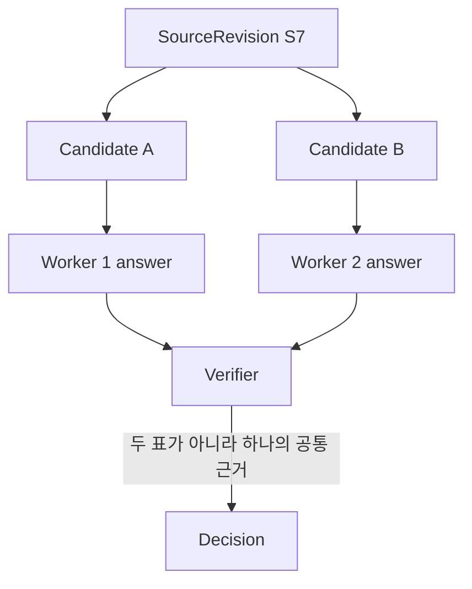

# 45장. 온톨로지를 에이전트의 제어면으로 쓰는 법

온톨로지를 에이전트에 붙인다는 말을 흔히 “지식 그래프에서 관련 문서를 찾아 프롬프트에 넣는다”로 줄인다. 그것은 가장 얕은 사용법이다. 실행하는 에이전트에게 더 중요한 질문은 따로 있다. 이 이름이 어느 실체를 가리키는가, 이 사실은 언제 유효했는가, 이 사용자가 지금 이 사실을 볼 수 있는가, 계획의 선행 조건은 충족됐는가, 이 도구 호출은 어떤 효과를 만들 권한이 있는가, 재시도된 호출이 같은 효과인지 다른 효과인지, 완료 주장을 어떤 영수증으로 반증할 수 있는가.

이 장에서 온톨로지는 모델을 대신해 생각하는 장치가 아니다. 벡터 검색을 없애는 장치도 아니다. **지식·근거·정책·실행 상태의 타입과 관계를 기계가 검사할 수 있게 만드는 실행 제어면**이다. 목표는 더 많은 답을 억지로 내는 것이 아니라, 근거가 부족한 후보가 실행으로 승격되는 순간을 붙잡는 데 있다.

## 45.1 네 그래프를 한 덩어리로 만들지 않는다

에이전트가 읽는 제품 카탈로그와 에이전트가 수행한 결제 기록은 모두 triple로 표현할 수 있다. 그렇다고 같은 의미의 그래프는 아니다. 최소한 다음 네 층을 분리해야 한다.

|그래프|핵심 개체|답하는 질문|대표적인 오독|
|---|---|---|---|
|지식·검색|`Entity`, `Claim`, `Relation`, `SourceSpan`|무엇과 무엇이 관련되는가|관련 edge를 최신 사실로 간주|
|근거·provenance|`Evidence`, `SourceRevision`, `ExtractionActivity`|누가 어느 원문 revision에서 무엇을 얻었는가|인용이 있다는 이유로 참이라 간주|
|실행·효과|`AgentRun`, `StateRevision`, `LogicalToolCall`, `Attempt`, `Effect`, `Receipt`|무엇을 시도했고 외부 세계에는 무엇이 commit됐는가|tool result를 실제 효과 영수증으로 간주|
|정책·capability|`Principal`, `Capability`, `PolicyDecision`, `Consent`, `Scope`|누가 언제 무엇을 볼 수 있고 실행할 수 있는가|검색 시점의 허용을 실행 시점 권한으로 재사용|

```mermaid
flowchart LR
  R[request + principal + as-of] --> S[scope 고정]
  S --> V[lexical / vector 후보]
  V --> E[entity resolution]
  E --> G[graph join + temporal gate]
  G --> P[provenance closure]
  P --> C[plan preconditions + capability]
  C --> A[effect-time authorization]
  A --> X[tool execution]
  X --> T[receipt + state revision]
  T --> Q[postcondition / evaluation]
```



벡터 검색은 이 경로의 후보 생성기다. cosine 거리가 가깝다는 사실은 “참이다”, “최신이다”, “이 tenant에게 허용됐다”, “실행 권한이 있다” 중 어느 것도 뜻하지 않는다. exact kNN으로 바꾸면 ANN 근사 오차는 줄지만 entity linking 오류, 시간 경과, ACL, 출처 누락, 논리적 조합 문제는 그대로 남는다.

## 45.2 실행 결론에는 검색 점수보다 긴 identity가 필요하다

운영 시스템에서 `document_id` 하나만 보존하면 나중에 같은 판단을 재현할 수 없다. 문서는 바뀌고, 정책은 철회되며, graph와 vector index는 서로 다른 시점에 배포될 수 있다. 실행을 재현하고 반증하려면 적어도 다음 tuple이 필요하다.

```text
(run_id, turn_id, branch_id, state_revision,
 logical_call_id, attempt_id, principal, tenant,
 policy_generation, graph_generation, vector_generation,
 valid_time, recorded_time, tool_id, tool_version,
 idempotency_key, source_revision, source_span_hash)
```

`LogicalToolCall`과 `Attempt`는 특히 분리한다. timeout 뒤 재시도와 speculative hedge는 여러 attempt일 수 있지만, 사용자 관점의 효과는 하나여야 한다. 반대로 같은 tool과 같은 인수라도 사용자가 두 번 명시적으로 요청했다면 logical call은 둘이다. 문자열 hash만으로 둘을 합치면 정상적인 두 번째 주문을 지울 수 있다.

효과를 허용하는 조건을 의사식으로 쓰면 다음과 같다.

```text
admit(effect, d, g) =
  candidate(d, vector_generation=g)
  AND authorized(principal, action, d,
                 policy_generation=g, at=commit_time)
  AND valid_at(d, requested_time, graph_generation=g)
  AND provenance_closed(d, source_revision, source_span_hash)
  AND preconditions_hold(state_revision)
  AND inventory_complete_if_negative(g)
  AND idempotency_reservation(logical_call_id)
```

거짓이면 거부한다. 자료가 없거나 완전성·세대가 확인되지 않으면 거짓으로 꾸미지 말고 `UNKNOWN`으로 닫는다. LLM이 자연스러운 문장으로 공백을 메웠다는 이유로 action gate를 통과시키면 안 된다.

## 45.3 loop의 어디에 연결하는가

온톨로지 query를 매 turn마다 한 번 호출하는 것으로는 부족하다. 판단이 바뀌는 경계마다 다른 검사가 필요하다.

### 45.3.1 context 조립 전: identity와 노출 범위

사용자가 말한 “고객”, 검색 문서의 `customer`, CRM 도구의 `account`가 같은 실체인지 resolver revision과 함께 판정한다. alias confidence가 낮으면 추정 실행 대신 clarification branch를 만든다. tenant와 principal scope는 retrieval 뒤의 장식이 아니라 검색 universe를 정하는 입력이다.

### 45.3.2 계획 직후: 선행 조건을 typed edge로 만든다

자연어 계획 `환불한다`만 저장하지 않는다.

```text
PlanStep(refund)
  requiresFact          Order.paid
  requiresCapability    refund:create
  requiresConsent       UserConsent(current)
  requiresStateRevision order:r17
  producesEffect        RefundIntent
```

각 predicate는 `TRUE/FALSE/UNKNOWN`을 반환한다. `UNKNOWN`은 실패가 아니라 다음 행동을 결정하는 값이다. 추가 검색, 사용자 질문, human review, 또는 안전한 중단으로 분기한다.

### 45.3.3 도구 실행 직전: 권한을 다시 판정한다

검색 시점에 문서를 볼 수 있었다고 10초 뒤 환불을 실행할 권한이 보장되는 것은 아니다. 그 사이 역할이 철회되거나 주문 revision이 바뀔 수 있다. 따라서 tool preflight에서 capability, policy generation, consent, current state revision, idempotency reservation을 다시 검사한다.

pi-agent의 공개 loop에는 이 연결 지점이 선명하다. 고정 revision `853a80d26c90a14c1886f0ebb8ffaae133ca2185`의 `agent-loop.ts`에서 tool lookup·argument validation·`beforeToolCall`·block·abort check가 실행보다 앞선다([source](https://github.com/badlogic/pi-mono/blob/853a80d26c90a14c1886f0ebb8ffaae133ca2185/packages/ai/src/agent-loop.ts#L598-L724)). 이 코드는 ontology authorization을 내장했다는 증거가 아니다. 다만 host가 policy adapter와 generation fence를 넣을 정확한 경계를 보여 준다.

### 45.3.4 실행 직후: observation이 아니라 receipt를 연결한다

`afterToolCall`이 성공 문자열을 받았다는 사실과 receiver가 효과를 commit했다는 사실은 다르다. receipt에는 receiver resource ID, committed revision, idempotency key, commit timestamp, action digest가 필요하다. 이후 reducer는 `EffectIntent → Attempt → Receipt → StateRevision` 경로를 완성하거나 `UNKNOWN_EFFECT`를 기록한다.

## 45.4 Open Ontologies가 제공하는 것과 제공하지 않는 것

Open Ontologies의 고정 revision `d423869aa071afebf0806e7e79e724be5fe81ac6`은 이 설계를 설명하기 좋은 구체적 구현이다. 그러나 라이브러리 기능을 시스템 보증으로 과장하면 안 된다.

|구현 경로|관측되는 동작|운영자가 별도로 닫아야 할 경계|
|---|---|---|
|[`src/graph.rs#L61-L130`](https://github.com/fabio-rovai/open-ontologies/blob/d423869aa071afebf0806e7e79e724be5fe81ac6/src/graph.rs#L61-L130)|in-memory/Oxigraph 또는 persistent store, Turtle 전체 parse 뒤 insert|persistent directory가 multi-writer transaction·복제를 보장하지 않음|
|[`src/vecstore.rs#L322-L424`](https://github.com/fabio-rovai/open-ontologies/blob/d423869aa071afebf0806e7e79e724be5fe81ac6/src/vecstore.rs#L322-L424)|exact, HNSW, Poincaré/product score 후보화|score는 진실·권한·시간 유효성 판정이 아님|
|[`src/shacl.rs`](https://github.com/fabio-rovai/open-ontologies/blob/d423869aa071afebf0806e7e79e724be5fe81ac6/src/shacl.rs)|선언한 shape의 constraint 검사|선언하지 않은 정책·사실성·완전성을 보장하지 않음|
|[`src/temporal.rs#L1866-L1934`](https://github.com/fabio-rovai/open-ontologies/blob/d423869aa071afebf0806e7e79e724be5fe81ac6/src/temporal.rs#L1866-L1934)|valid/recorded time 기반 named graph scope|현재 projection과 과거 질의의 generation 정합성은 호출자가 고정|
|[`src/plugins.rs#L132-L213`](https://github.com/fabio-rovai/open-ontologies/blob/d423869aa071afebf0806e7e79e724be5fe81ac6/src/plugins.rs#L132-L213)|fresh WASM instance, fuel, 제한된 ABI/return|plugin isolation이 state persistence나 business authorization을 뜻하지 않음|

Turtle loader가 문서 전체를 parse한 다음 insert하는 선택은 malformed input의 부분 적재를 피한다. 하지만 graph 적재와 vector projection의 교체를 하나의 원자 transaction으로 만들어 주지는 않는다. 그래서 query context에 양쪽 generation을 명시해야 한다.

```text
vector_hit(d, g)
AND graph_allow(d, g)
AND inventory_complete(g)
AND requested_generation = g
```

`doc-1`을 vector generation `g1`에서 찾고 graph `g2`의 ACL로 허용하면, 존재한 적 없는 혼합 snapshot에 대해 판단하게 된다. 안전한 선택은 같은 generation으로 재조회하거나 `GENERATION_SKEW`로 보류하는 것이다.

## 45.5 부정 질의는 데이터 완전성 계약을 요구한다

SPARQL `NOT EXISTS` 결과가 비었다고 “금지 dependency가 없다”고 결론 내릴 수는 없다. RDF의 open-world 가정에서는 기록되지 않은 것과 존재하지 않는 것이 다르다. 제한된 closed-world 결론을 내리려면 다음을 함께 저장한다.

- 어떤 inventory owner가 어느 범위를 완전하다고 선언했는가
- coverage window와 ingestion watermark는 무엇인가
- 어떤 predicate와 tenant에 대해서만 완전한가
- source revision과 graph generation은 무엇인가
- 이후 supersession 또는 tombstone이 적용됐는가

이 metadata가 없으면 `NOT_FOUND`가 아니라 `UNKNOWN`. “경쟁 라이브러리 없음”, “미승인 dependency 없음”, “이 사용자에게 다른 계정 없음” 같은 부정 결론은 특히 이 규칙을 따라야 한다.

SHACL도 같은 경계를 가진다. `conforms=true`는 실행한 shape와 focus node 범위가 통과했다는 뜻이다. shape에 없는 predicate, 지원하지 않는 path, 최신성, 원문 사실성까지 검증했다는 뜻이 아니다.

## 45.6 memory를 사실 저장소 하나로 만들지 않는다

에이전트 memory에는 서로 다른 생명주기가 섞인다.

|memory class|예|필요한 관계|action 근거 자격|
|---|---|---|---|
|turn working state|현재 tool call의 partial argument|run/turn/branch, expiry|그 turn 안에서도 terminal fence 필요|
|episodic observation|지난 실행의 결과 문자열|attempt, observed-at|receipt 없이는 외부 commit 근거 아님|
|model summary|compaction 요약|producer model, source message range|원문 provenance를 대신하지 못함|
|durable preference|사용자 언어 선호|principal, consent, retention|민감 행동 권한으로 확대 금지|
|source-grounded fact|계약 만료일|source revision/span, valid time|policy와 freshness를 통과하면 사용 가능|

요약에 어떤 문장이 남아 있다는 사실은 그 문장이 참이라는 뜻이 아니다. 원문 revision이 supersede되면 summary에서 파생된 claim도 stale로 표시해야 한다. 삭제 역시 vector row 하나를 지우는 것으로 끝나지 않는다. graph edge, lexical index, summary, trace payload, evaluation fixture, downstream cache까지 derivation edge를 따라 tombstone을 전파해야 한다.

## 45.7 서브에이전트와 graph: branch 수가 근거 수는 아니다

여러 서브에이전트가 같은 source snapshot과 같은 embedding index에서 답을 만들면, 세 개의 동의는 독립 증거 세 개가 아니다. provenance graph에서 공통 조상을 접으면 실질적인 evidence는 하나일 수 있다.



child run에는 `parent_run_id`, fork `state_revision`, policy/graph/vector generation, delegated scope, budget, expected artifact type을 붙인다. join 시점에는 단순 majority vote가 아니라 다음을 검사한다.

1. child가 fork한 state revision이 아직 current인가.
2. 서로 다른 답이 실제로 독립 source revision에 기대는가.
3. delegated capability를 넘어선 effect가 있는가.
4. parent가 이미 취소한 logical call을 child가 commit하지 않았는가.
5. verifier가 읽은 결과와 receiver receipt가 같은 attempt를 가리키는가.

stale child의 설명은 참고 자료로 합칠 수 있어도 효과 commit은 receiver-side compare-and-set에서 거부해야 한다. graph의 `derivedFrom` edge는 merge authority가 아니다.

## 45.8 실전 반례 여섯 개

### 반례 1: 검색 뒤 권한 철회

vector candidate를 얻은 뒤 사용자 역할을 revoke한다. 기대 결과는 retrieval trace 존재, commit-time policy deny, receiver receipt 0건이다. 이전 allow 결정을 재사용하면 실패다.

### 반례 2: g1 vector와 g2 graph

`doc-1/g1=allow`, `doc-1/g2=deny`, `doc-2/g2=allow` fixture를 만든다. generation fence가 없으면 `doc-1`이 잘못 승격된다. strict mode에서는 `doc-2`만 admissible하거나 재색인을 기다려야 한다.

### 반례 3: 빈 그래프의 `NOT EXISTS`

inventory completeness가 false인 빈 graph에서 결과는 `UNKNOWN`이어야 한다. completeness를 true로 선언한 제한된 fixture에서만 negative conclusion을 허용한다.

### 반례 4: crash 뒤 pending tool

effect prepare 뒤 receipt 저장 전에 process를 죽인다. resume은 같은 `logical_call_id`와 idempotency reservation으로 receiver를 조회해야 한다. 새 호출로 재실행해 duplicate write가 생기면 실패다.

### 반례 5: 원문 교체 뒤 살아 있는 요약

source-grounded fact와 model summary가 같은 문장을 갖게 한 뒤 source revision을 supersede한다. old claim은 stale이어야 하고 summary만으로 action을 허용하면 안 된다.

### 반례 6: SHACL green의 과대 해석

shape에 없는 invented predicate를 추가한다. validation이 통과해도 provenance verifier는 해당 claim을 거부해야 한다. 구조적 합치와 사실적 지지를 분리하는 테스트다.

## 45.9 운영 지표: 검색 품질만 보면 실패를 놓친다

|지표|세는 것|높거나 낮을 때 물을 질문|
|---|---|---|
|`entity_ambiguity_rate`|resolver가 단일 identity로 닫지 못한 비율|질문으로 돌렸는가, 임의 선택했는가|
|`generation_skew_rejects`|graph/vector/policy 세대 불일치 거부|배포 지연인가, fence가 제대로 작동한 것인가|
|`provenance_closure_rate`|claim→span→revision 경로가 닫힌 비율|인용 숫자와 독립적으로 측정했는가|
|`unknown_by_reason`|freshness·ACL·inventory·span 부족별 UNKNOWN|안전한 보류와 검색 장애를 구별했는가|
|`stale_branch_commit_rejects`|오래된 fork의 effect 차단|receiver CAS가 실제로 있었는가|
|`duplicate_effect_count`|하나의 logical call에서 중복 commit|retry와 hedge를 attempt로 분리했는가|
|`policy_recheck_latency`|effect-time authorization 비용|cache 최적화가 철회를 숨기지 않는가|
|`receipt_reconciliation_gap`|trace success와 receiver receipt 불일치|unknown effect queue가 소유자를 갖는가|

ontology query latency를 줄이려고 policy decision을 오래 cache하면 철회 창이 커진다. cache key에는 principal, tenant, resource/action, policy generation, relevant state revision을 넣고, effectful action은 짧은 TTL보다 commit-time generation check를 우선한다. “cache hit”는 권한 증명이 아니다.

## 45.10 도입 체크리스트와 순서

처음부터 거대한 domain ontology를 만들 필요는 없다. 실행 안전성에 직접 기여하는 작은 spine부터 시작한다.

1. `Run–Turn–Branch–LogicalCall–Attempt–Receipt` identity를 고정한다.
2. `Principal–Capability–PolicyDecision–Consent`를 effect preflight에 연결한다.
3. claim마다 `SourceRevision–SourceSpan`을 강제하고 `UNKNOWN` disposition을 허용한다.
4. graph/vector/policy generation을 query와 trace에 기록한다.
5. negative conclusion이 필요한 inventory에만 명시적 completeness 계약을 둔다.
6. stale fork, policy revoke, crash/retry, generation skew를 CI fixture로 만든다.
7. 그 다음에 domain vocabulary와 reasoner 규칙을 확장한다.

좋은 온톨로지는 모든 것을 아는 백과사전이 아니다. 모델이 무엇을 추정했고 시스템이 무엇을 검증했는지, 누가 무엇을 허용했고 receiver가 무엇을 commit했는지, 어느 시점의 어느 원문으로 그 결론을 뒤집을 수 있는지를 잃지 않는 구조다. 에이전트와 온톨로지가 제대로 엮였는지는 graph 크기가 아니라 **불충분한 근거가 실행으로 넘어가지 않는가**로 판정한다.

## 원전과 더 읽을거리

- [W3C SPARQL 1.1 Query Language](https://www.w3.org/TR/sparql11-query/): join, property path, `NOT EXISTS`의 명세다. 데이터 완전성을 자동으로 부여하지 않는다.
- [W3C SHACL](https://www.w3.org/TR/shacl/): 선언된 shape에 대한 validation 의미를 규정한다.
- [W3C PROV-O](https://www.w3.org/TR/prov-o/): entity, activity, agent provenance vocabulary의 표준 출발점이다.
- [NIST SP 800-207, Zero Trust Architecture](https://csrc.nist.gov/pubs/sp/800/207/final): 위치 기반 신뢰가 아닌 resource/action별 정책 판단의 배경이다.
- [HNSW, arXiv:1603.09320](https://arxiv.org/abs/1603.09320): approximate nearest-neighbor 탐색의 비용·recall 교환을 이해하기 위한 원전이다.
- [ReAct, arXiv:2210.03629](https://arxiv.org/abs/2210.03629): reasoning과 acting을 교차하는 모델 interaction의 출발점이다. durable effect semantics의 증명은 아니다.
- [Graph of Thoughts, arXiv:2308.09687](https://arxiv.org/abs/2308.09687): graph-shaped reasoning state의 동기를 제공하지만 provenance·authorization graph 구현과는 구별해야 한다.
