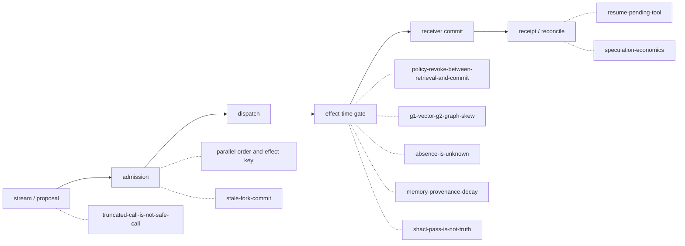

# 실행 제어 계약: 결정적 반례 fixture 10종

이 디렉터리는 42–45장이 세운 실행 계약을 **in-process 결정적 모델**로 실행하는 fixture 모음이다. 어떤 harness도 외부 제품·네트워크·컨테이너를 실행하지 않으며, 실행했다고 꾸미지도 않는다. 각 harness는 장이 정의한 계약(올바른 gate)과 그 계약을 깨는 오독(counterexample gate)을 **둘 다 코드로 실행**해 결과가 달라짐을 보이고, canonical event ledger를 생성해 커밋된 ledger 및 SHA-256과 바이트 단위로 대조한다.

```bash
# 전체 실행 (Python 3 표준 라이브러리만 필요)
python3 labs/volume-3/execution-control/run_all.py

# 개별 실행
python3 labs/volume-3/execution-control/harness/check_parallel_order_and_effect_key.py
```

시뮬레이션을 수정했다면 `--regenerate`로 ledger를 다시 쓰고 harness 상단의 `EXPECTED_SHA256`을 새 값으로 갱신한 뒤, 기본 모드가 통과하는지 확인한다.

## fixture가 loop의 어느 경계를 겨냥하는가



## 무엇을 검증하고 무엇을 반증하는가

|fixture|검증하는 계약|반증하는 오독|관련 장|
|---|---|---|---|
|parallel-order-and-effect-key|reducer는 완료 순서가 아니라 admission 때의 call order로 transcript를 만들고, 같은 `effect_key`의 재시도는 receipt 하나로 수렴|완료 순서를 대화 순서로 쓰는 reducer|[42장](../../../content/volume-3/chapters/42-loop-engineering.md)|
|truncated-call-is-not-safe-call|finish_reason=length로 잘린 call은 parse 가능해도 dispatch하지 않고 `dispatched=false`+digest를 남김|`JSON.parse` 성공을 실행 근거로 쓰는 gate|42장|
|stale-fork-commit|stale fork의 결론은 join에서 quarantine되고 receiver CAS가 오래된 revision의 commit을 거절|text 유사도 기반 merge|[44장](../../../content/volume-3/chapters/44-subagents-goals.md)|
|resume-pending-tool|dispatch 후 crash한 call은 `unknown`으로 복원하고 같은 `effect_key`로 receipt를 조회해 applied/not_seen/indeterminate를 분기|unknown을 실패로 보고 새 key로 재시도하는 정책|42·44장|
|speculation-economics|hedge 패자의 비용은 cancel 뒤에도 원장에 남고, 패자의 effect는 rollback이 아니라 receipt 조회로 판정|loser 비용을 지워 admission cap을 우회하는 회계|42장|
|policy-revoke-between-retrieval-and-commit|검색 시점 allow는 effect-time recheck를 대체하지 못하며 철회 뒤 receipt는 없다|policy generation 없는 decision cache|[43장](../../../content/volume-3/chapters/43-cache-engineering.md)|
|g1-vector-g2-graph-skew|vector·graph generation이 어긋나면 allow/deny가 아니라 `GENERATION_SKEW` 보류|generation을 무시한 `vector_hit AND graph_allow`|43·[45장](../../../content/volume-3/chapters/45-ontology-agent-control-plane.md)|
|absence-is-unknown|inventory completeness가 선언된 범위에서만 빈 결과가 `FALSE`이고, 그 밖에서는 `UNKNOWN`이 분기 입력|빈 결과를 `FALSE`로 읽는 closed-world gate|45장|
|memory-provenance-decay|source revision supersede는 `derivedFrom`을 따라 summary 파생 claim까지 stale로 전파되고 재검증 전 사용이 막힘|summary에 문장이 남아 있음을 truth로 쓰는 gate|45장|
|shacl-pass-is-not-truth|`conforms=true`는 선언한 shape의 구조 판정일 뿐이며 provenance/freshness 거절과 공존한다|SHACL pass를 사실성 증명으로 확대하는 gate|45장|

## ledger 계약

- `recorded-events/<fixture>.events.jsonl`, 각 줄은 `json.dumps(row, sort_keys=True, ensure_ascii=False)`.
- 필수 필드 `fixture`, `ordinal`(1..N 연속), `stage`, `outcome`. timestamp 계열 필드 금지(결정성).
- 오독 경로의 이벤트는 `stage`에 `counterexample:` 접두가 붙어 정상 경로와 구분된다.
- 기본 모드는 시뮬레이션을 재실행해 oracle 전부와 ledger 바이트 동일성, `EXPECTED_SHA256`을 함께 검사한다.

## 이 fixture가 보장하지 않는 것

여기서 통과한 계약은 in-process 모델의 성질이다. 실제 분산 스케줄러의 순서 보장, 실제 provider의 stream 동작, 실제 SPARQL/SHACL 엔진의 의미론, receiver의 idempotency 구현이 같은 성질을 가진다는 증명이 아니다. 각 장의 “보장하지 않는 것” 절과 원전 링크가 그 경계를 소유한다.
